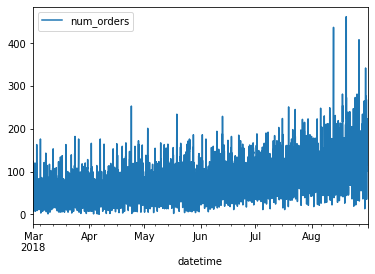
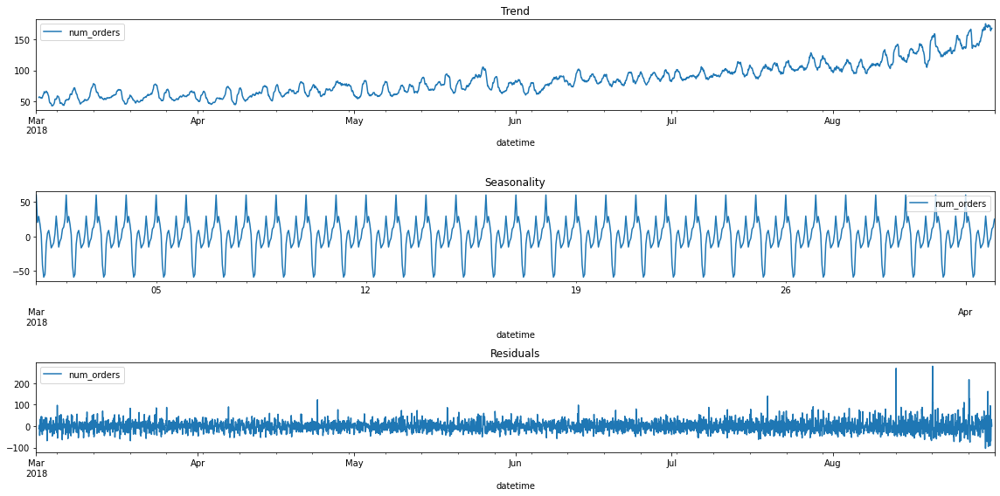
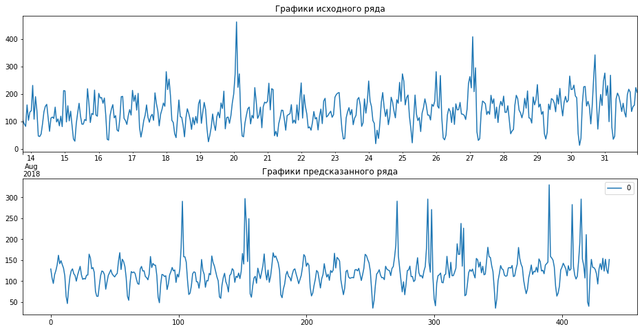

## Подготовка


```python
import pandas as pd
import numpy as np
import warnings
warnings.simplefilter("ignore")

from statsmodels.tsa.seasonal import seasonal_decompose
import matplotlib.pyplot as plt
from sklearn.model_selection import train_test_split
from sklearn.metrics import mean_squared_error

from sklearn.linear_model import LinearRegression
from sklearn.tree import DecisionTreeRegressor
from sklearn.ensemble import RandomForestRegressor
from sklearn.linear_model import LogisticRegression
from sklearn.dummy import DummyRegressor
from lightgbm import LGBMRegressor
!pip install catboost
from catboost import CatBoostRegressor
```

    Looking in indexes: https://pypi.org/simple, https://us-python.pkg.dev/colab-wheels/public/simple/
    Requirement already satisfied: catboost in /usr/local/lib/python3.7/dist-packages (1.0.6)
    Requirement already satisfied: graphviz in /usr/local/lib/python3.7/dist-packages (from catboost) (0.10.1)
    Requirement already satisfied: numpy>=1.16.0 in /usr/local/lib/python3.7/dist-packages (from catboost) (1.21.6)
    Requirement already satisfied: six in /usr/local/lib/python3.7/dist-packages (from catboost) (1.15.0)
    Requirement already satisfied: matplotlib in /usr/local/lib/python3.7/dist-packages (from catboost) (3.2.2)
    Requirement already satisfied: pandas>=0.24.0 in /usr/local/lib/python3.7/dist-packages (from catboost) (1.3.5)
    Requirement already satisfied: plotly in /usr/local/lib/python3.7/dist-packages (from catboost) (5.5.0)
    Requirement already satisfied: scipy in /usr/local/lib/python3.7/dist-packages (from catboost) (1.4.1)
    Requirement already satisfied: python-dateutil>=2.7.3 in /usr/local/lib/python3.7/dist-packages (from pandas>=0.24.0->catboost) (2.8.2)
    Requirement already satisfied: pytz>=2017.3 in /usr/local/lib/python3.7/dist-packages (from pandas>=0.24.0->catboost) (2022.1)
    Requirement already satisfied: pyparsing!=2.0.4,!=2.1.2,!=2.1.6,>=2.0.1 in /usr/local/lib/python3.7/dist-packages (from matplotlib->catboost) (3.0.9)
    Requirement already satisfied: kiwisolver>=1.0.1 in /usr/local/lib/python3.7/dist-packages (from matplotlib->catboost) (1.4.3)
    Requirement already satisfied: cycler>=0.10 in /usr/local/lib/python3.7/dist-packages (from matplotlib->catboost) (0.11.0)
    Requirement already satisfied: typing-extensions in /usr/local/lib/python3.7/dist-packages (from kiwisolver>=1.0.1->matplotlib->catboost) (4.1.1)
    Requirement already satisfied: tenacity>=6.2.0 in /usr/local/lib/python3.7/dist-packages (from plotly->catboost) (8.0.1)
    


```python
# просмотр, где находится каталог с файлами на COLAB
from google.colab import drive
drive.mount('/content/drive')
```

    Drive already mounted at /content/drive; to attempt to forcibly remount, call drive.mount("/content/drive", force_remount=True).
    


```python
# получение доступа к каталогу и уточнение названия папок
import os
os.listdir('/content/drive/My Drive/Colab Notebooks/Яндекс/Проект 10 Прогнозирование заказов такси/ДАННЫЕ')
```


    ['taxi.csv']


```python
# загрузка данных
data = pd.read_csv('/content/drive/My Drive/Colab Notebooks/Яндекс/Проект 10 Прогнозирование заказов такси/ДАННЫЕ/taxi.csv', index_col=[0], parse_dates=[0])
```


```python
data = data.sort_index()
```


```python
print(data.index.is_monotonic)
```

    True
    


```python
data
```


  <div id="df-45cee3a9-ffa9-4e05-869b-8cd927fe03f7">
    <div class="colab-df-container">
      <div>
<style scoped>
    .dataframe tbody tr th:only-of-type {
        vertical-align: middle;
    }

    .dataframe tbody tr th {
        vertical-align: top;
    }

    .dataframe thead th {
        text-align: right;
    }
</style>
<table border="1" class="dataframe">
  <thead>
    <tr style="text-align: right;">
      <th></th>
      <th>num_orders</th>
    </tr>
    <tr>
      <th>datetime</th>
      <th></th>
    </tr>
  </thead>
  <tbody>
    <tr>
      <th>2018-03-01 00:00:00</th>
      <td>9</td>
    </tr>
    <tr>
      <th>2018-03-01 00:10:00</th>
      <td>14</td>
    </tr>
    <tr>
      <th>2018-03-01 00:20:00</th>
      <td>28</td>
    </tr>
    <tr>
      <th>2018-03-01 00:30:00</th>
      <td>20</td>
    </tr>
    <tr>
      <th>2018-03-01 00:40:00</th>
      <td>32</td>
    </tr>
    <tr>
      <th>...</th>
      <td>...</td>
    </tr>
    <tr>
      <th>2018-08-31 23:10:00</th>
      <td>32</td>
    </tr>
    <tr>
      <th>2018-08-31 23:20:00</th>
      <td>24</td>
    </tr>
    <tr>
      <th>2018-08-31 23:30:00</th>
      <td>27</td>
    </tr>
    <tr>
      <th>2018-08-31 23:40:00</th>
      <td>39</td>
    </tr>
    <tr>
      <th>2018-08-31 23:50:00</th>
      <td>53</td>
    </tr>
  </tbody>
</table>
<p>26496 rows × 1 columns</p>
</div>
      <button class="colab-df-convert" onclick="convertToInteractive('df-45cee3a9-ffa9-4e05-869b-8cd927fe03f7')"
              title="Convert this dataframe to an interactive table."
              style="display:none;">

  <svg xmlns="http://www.w3.org/2000/svg" height="24px"viewBox="0 0 24 24"
       width="24px">
    <path d="M0 0h24v24H0V0z" fill="none"/>
    <path d="M18.56 5.44l.94 2.06.94-2.06 2.06-.94-2.06-.94-.94-2.06-.94 2.06-2.06.94zm-11 1L8.5 8.5l.94-2.06 2.06-.94-2.06-.94L8.5 2.5l-.94 2.06-2.06.94zm10 10l.94 2.06.94-2.06 2.06-.94-2.06-.94-.94-2.06-.94 2.06-2.06.94z"/><path d="M17.41 7.96l-1.37-1.37c-.4-.4-.92-.59-1.43-.59-.52 0-1.04.2-1.43.59L10.3 9.45l-7.72 7.72c-.78.78-.78 2.05 0 2.83L4 21.41c.39.39.9.59 1.41.59.51 0 1.02-.2 1.41-.59l7.78-7.78 2.81-2.81c.8-.78.8-2.07 0-2.86zM5.41 20L4 18.59l7.72-7.72 1.47 1.35L5.41 20z"/>
  </svg>
      </button>

  <style>
    .colab-df-container {
      display:flex;
      flex-wrap:wrap;
      gap: 12px;
    }

    .colab-df-convert {
      background-color: #E8F0FE;
      border: none;
      border-radius: 50%;
      cursor: pointer;
      display: none;
      fill: #1967D2;
      height: 32px;
      padding: 0 0 0 0;
      width: 32px;
    }

    .colab-df-convert:hover {
      background-color: #E2EBFA;
      box-shadow: 0px 1px 2px rgba(60, 64, 67, 0.3), 0px 1px 3px 1px rgba(60, 64, 67, 0.15);
      fill: #174EA6;
    }

    [theme=dark] .colab-df-convert {
      background-color: #3B4455;
      fill: #D2E3FC;
    }

    [theme=dark] .colab-df-convert:hover {
      background-color: #434B5C;
      box-shadow: 0px 1px 3px 1px rgba(0, 0, 0, 0.15);
      filter: drop-shadow(0px 1px 2px rgba(0, 0, 0, 0.3));
      fill: #FFFFFF;
    }
  </style>

      <script>
        const buttonEl =
          document.querySelector('#df-45cee3a9-ffa9-4e05-869b-8cd927fe03f7 button.colab-df-convert');
        buttonEl.style.display =
          google.colab.kernel.accessAllowed ? 'block' : 'none';

        async function convertToInteractive(key) {
          const element = document.querySelector('#df-45cee3a9-ffa9-4e05-869b-8cd927fe03f7');
          const dataTable =
            await google.colab.kernel.invokeFunction('convertToInteractive',
                                                     [key], {});
          if (!dataTable) return;

          const docLinkHtml = 'Like what you see? Visit the ' +
            '<a target="_blank" href=https://colab.research.google.com/notebooks/data_table.ipynb>data table notebook</a>'
            + ' to learn more about interactive tables.';
          element.innerHTML = '';
          dataTable['output_type'] = 'display_data';
          await google.colab.output.renderOutput(dataTable, element);
          const docLink = document.createElement('div');
          docLink.innerHTML = docLinkHtml;
          element.appendChild(docLink);
        }
      </script>
    </div>
  </div>


```python
data.info()
```

    <class 'pandas.core.frame.DataFrame'>
    DatetimeIndex: 26496 entries, 2018-03-01 00:00:00 to 2018-08-31 23:50:00
    Data columns (total 1 columns):
     #   Column      Non-Null Count  Dtype
    ---  ------      --------------  -----
     0   num_orders  26496 non-null  int64
    dtypes: int64(1)
    memory usage: 414.0 KB
    


```python
data.isna().mean() * 100
```


    num_orders    0.0
    dtype: float64


## Вывод

**В результате предварительного анализа, установлено:**

1. Данные представлены за период с 2018-03-01 пo 2018-08-31.
2. Данные насчитывают порядка 26 тыс. строк.
3. Данные представлены с разбивкой по 10 мин.
4. Пропуски в данных отсутствуют. 

## Анализ


```python
data_H = data.resample('1H').sum()
data_H.plot();
```


    

    


```python
decomposed = seasonal_decompose(data_H)

plt.figure(figsize=(16, 8))
plt.subplot(311)
# Чтобы график корректно отобразился, указываем его
# оси ax, равными plt.gca() (англ. get current axis,
# получить текущие оси)
decomposed.trend.plot(ax=plt.gca())
plt.title('Trend')
plt.subplot(312)
decomposed.seasonal['2018-03-01':'2018-04-01'].plot(ax=plt.gca())
plt.title('Seasonality')
plt.subplot(313)
decomposed.resid.plot(ax=plt.gca())
plt.title('Residuals')
plt.tight_layout()
```


    

    


```python
def make_features(data, max_lag, rolling_mean_size):
    data['month'] = data.index.month
    data['day'] = data.index.day
    data['dayofweek'] = data.index.dayofweek
    data['hour'] = data.index.hour

    for lag in range(1, max_lag + 1):
        data['lag_{}'.format(lag)] = data['num_orders'].shift(lag)

    data['rolling_mean'] = data['num_orders'].shift().rolling(rolling_mean_size).mean()
    return data
```


```python
data = make_features(data_H, 36, 36)
```


```python
data
```


  <div id="df-d05ed3e9-05e6-4115-a390-c2b4baee7042">
    <div class="colab-df-container">
      <div>
<style scoped>
    .dataframe tbody tr th:only-of-type {
        vertical-align: middle;
    }

    .dataframe tbody tr th {
        vertical-align: top;
    }

    .dataframe thead th {
        text-align: right;
    }
</style>
<table border="1" class="dataframe">
  <thead>
    <tr style="text-align: right;">
      <th></th>
      <th>num_orders</th>
      <th>month</th>
      <th>day</th>
      <th>dayofweek</th>
      <th>hour</th>
      <th>lag_1</th>
      <th>lag_2</th>
      <th>lag_3</th>
      <th>lag_4</th>
      <th>lag_5</th>
      <th>...</th>
      <th>lag_28</th>
      <th>lag_29</th>
      <th>lag_30</th>
      <th>lag_31</th>
      <th>lag_32</th>
      <th>lag_33</th>
      <th>lag_34</th>
      <th>lag_35</th>
      <th>lag_36</th>
      <th>rolling_mean</th>
    </tr>
    <tr>
      <th>datetime</th>
      <th></th>
      <th></th>
      <th></th>
      <th></th>
      <th></th>
      <th></th>
      <th></th>
      <th></th>
      <th></th>
      <th></th>
      <th></th>
      <th></th>
      <th></th>
      <th></th>
      <th></th>
      <th></th>
      <th></th>
      <th></th>
      <th></th>
      <th></th>
      <th></th>
    </tr>
  </thead>
  <tbody>
    <tr>
      <th>2018-03-01 00:00:00</th>
      <td>124</td>
      <td>3</td>
      <td>1</td>
      <td>3</td>
      <td>0</td>
      <td>NaN</td>
      <td>NaN</td>
      <td>NaN</td>
      <td>NaN</td>
      <td>NaN</td>
      <td>...</td>
      <td>NaN</td>
      <td>NaN</td>
      <td>NaN</td>
      <td>NaN</td>
      <td>NaN</td>
      <td>NaN</td>
      <td>NaN</td>
      <td>NaN</td>
      <td>NaN</td>
      <td>NaN</td>
    </tr>
    <tr>
      <th>2018-03-01 01:00:00</th>
      <td>85</td>
      <td>3</td>
      <td>1</td>
      <td>3</td>
      <td>1</td>
      <td>124.0</td>
      <td>NaN</td>
      <td>NaN</td>
      <td>NaN</td>
      <td>NaN</td>
      <td>...</td>
      <td>NaN</td>
      <td>NaN</td>
      <td>NaN</td>
      <td>NaN</td>
      <td>NaN</td>
      <td>NaN</td>
      <td>NaN</td>
      <td>NaN</td>
      <td>NaN</td>
      <td>NaN</td>
    </tr>
    <tr>
      <th>2018-03-01 02:00:00</th>
      <td>71</td>
      <td>3</td>
      <td>1</td>
      <td>3</td>
      <td>2</td>
      <td>85.0</td>
      <td>124.0</td>
      <td>NaN</td>
      <td>NaN</td>
      <td>NaN</td>
      <td>...</td>
      <td>NaN</td>
      <td>NaN</td>
      <td>NaN</td>
      <td>NaN</td>
      <td>NaN</td>
      <td>NaN</td>
      <td>NaN</td>
      <td>NaN</td>
      <td>NaN</td>
      <td>NaN</td>
    </tr>
    <tr>
      <th>2018-03-01 03:00:00</th>
      <td>66</td>
      <td>3</td>
      <td>1</td>
      <td>3</td>
      <td>3</td>
      <td>71.0</td>
      <td>85.0</td>
      <td>124.0</td>
      <td>NaN</td>
      <td>NaN</td>
      <td>...</td>
      <td>NaN</td>
      <td>NaN</td>
      <td>NaN</td>
      <td>NaN</td>
      <td>NaN</td>
      <td>NaN</td>
      <td>NaN</td>
      <td>NaN</td>
      <td>NaN</td>
      <td>NaN</td>
    </tr>
    <tr>
      <th>2018-03-01 04:00:00</th>
      <td>43</td>
      <td>3</td>
      <td>1</td>
      <td>3</td>
      <td>4</td>
      <td>66.0</td>
      <td>71.0</td>
      <td>85.0</td>
      <td>124.0</td>
      <td>NaN</td>
      <td>...</td>
      <td>NaN</td>
      <td>NaN</td>
      <td>NaN</td>
      <td>NaN</td>
      <td>NaN</td>
      <td>NaN</td>
      <td>NaN</td>
      <td>NaN</td>
      <td>NaN</td>
      <td>NaN</td>
    </tr>
    <tr>
      <th>...</th>
      <td>...</td>
      <td>...</td>
      <td>...</td>
      <td>...</td>
      <td>...</td>
      <td>...</td>
      <td>...</td>
      <td>...</td>
      <td>...</td>
      <td>...</td>
      <td>...</td>
      <td>...</td>
      <td>...</td>
      <td>...</td>
      <td>...</td>
      <td>...</td>
      <td>...</td>
      <td>...</td>
      <td>...</td>
      <td>...</td>
      <td>...</td>
    </tr>
    <tr>
      <th>2018-08-31 19:00:00</th>
      <td>136</td>
      <td>8</td>
      <td>31</td>
      <td>4</td>
      <td>19</td>
      <td>207.0</td>
      <td>217.0</td>
      <td>197.0</td>
      <td>116.0</td>
      <td>133.0</td>
      <td>...</td>
      <td>156.0</td>
      <td>91.0</td>
      <td>154.0</td>
      <td>173.0</td>
      <td>156.0</td>
      <td>227.0</td>
      <td>226.0</td>
      <td>166.0</td>
      <td>39.0</td>
      <td>169.944444</td>
    </tr>
    <tr>
      <th>2018-08-31 20:00:00</th>
      <td>154</td>
      <td>8</td>
      <td>31</td>
      <td>4</td>
      <td>20</td>
      <td>136.0</td>
      <td>207.0</td>
      <td>217.0</td>
      <td>197.0</td>
      <td>116.0</td>
      <td>...</td>
      <td>254.0</td>
      <td>156.0</td>
      <td>91.0</td>
      <td>154.0</td>
      <td>173.0</td>
      <td>156.0</td>
      <td>227.0</td>
      <td>226.0</td>
      <td>166.0</td>
      <td>172.638889</td>
    </tr>
    <tr>
      <th>2018-08-31 21:00:00</th>
      <td>159</td>
      <td>8</td>
      <td>31</td>
      <td>4</td>
      <td>21</td>
      <td>154.0</td>
      <td>136.0</td>
      <td>207.0</td>
      <td>217.0</td>
      <td>197.0</td>
      <td>...</td>
      <td>342.0</td>
      <td>254.0</td>
      <td>156.0</td>
      <td>91.0</td>
      <td>154.0</td>
      <td>173.0</td>
      <td>156.0</td>
      <td>227.0</td>
      <td>226.0</td>
      <td>172.305556</td>
    </tr>
    <tr>
      <th>2018-08-31 22:00:00</th>
      <td>223</td>
      <td>8</td>
      <td>31</td>
      <td>4</td>
      <td>22</td>
      <td>159.0</td>
      <td>154.0</td>
      <td>136.0</td>
      <td>207.0</td>
      <td>217.0</td>
      <td>...</td>
      <td>177.0</td>
      <td>342.0</td>
      <td>254.0</td>
      <td>156.0</td>
      <td>91.0</td>
      <td>154.0</td>
      <td>173.0</td>
      <td>156.0</td>
      <td>227.0</td>
      <td>170.444444</td>
    </tr>
    <tr>
      <th>2018-08-31 23:00:00</th>
      <td>205</td>
      <td>8</td>
      <td>31</td>
      <td>4</td>
      <td>23</td>
      <td>223.0</td>
      <td>159.0</td>
      <td>154.0</td>
      <td>136.0</td>
      <td>207.0</td>
      <td>...</td>
      <td>72.0</td>
      <td>177.0</td>
      <td>342.0</td>
      <td>254.0</td>
      <td>156.0</td>
      <td>91.0</td>
      <td>154.0</td>
      <td>173.0</td>
      <td>156.0</td>
      <td>170.333333</td>
    </tr>
  </tbody>
</table>
<p>4416 rows × 42 columns</p>
</div>
      <button class="colab-df-convert" onclick="convertToInteractive('df-d05ed3e9-05e6-4115-a390-c2b4baee7042')"
              title="Convert this dataframe to an interactive table."
              style="display:none;">

  <svg xmlns="http://www.w3.org/2000/svg" height="24px"viewBox="0 0 24 24"
       width="24px">
    <path d="M0 0h24v24H0V0z" fill="none"/>
    <path d="M18.56 5.44l.94 2.06.94-2.06 2.06-.94-2.06-.94-.94-2.06-.94 2.06-2.06.94zm-11 1L8.5 8.5l.94-2.06 2.06-.94-2.06-.94L8.5 2.5l-.94 2.06-2.06.94zm10 10l.94 2.06.94-2.06 2.06-.94-2.06-.94-.94-2.06-.94 2.06-2.06.94z"/><path d="M17.41 7.96l-1.37-1.37c-.4-.4-.92-.59-1.43-.59-.52 0-1.04.2-1.43.59L10.3 9.45l-7.72 7.72c-.78.78-.78 2.05 0 2.83L4 21.41c.39.39.9.59 1.41.59.51 0 1.02-.2 1.41-.59l7.78-7.78 2.81-2.81c.8-.78.8-2.07 0-2.86zM5.41 20L4 18.59l7.72-7.72 1.47 1.35L5.41 20z"/>
  </svg>
      </button>

  <style>
    .colab-df-container {
      display:flex;
      flex-wrap:wrap;
      gap: 12px;
    }

    .colab-df-convert {
      background-color: #E8F0FE;
      border: none;
      border-radius: 50%;
      cursor: pointer;
      display: none;
      fill: #1967D2;
      height: 32px;
      padding: 0 0 0 0;
      width: 32px;
    }

    .colab-df-convert:hover {
      background-color: #E2EBFA;
      box-shadow: 0px 1px 2px rgba(60, 64, 67, 0.3), 0px 1px 3px 1px rgba(60, 64, 67, 0.15);
      fill: #174EA6;
    }

    [theme=dark] .colab-df-convert {
      background-color: #3B4455;
      fill: #D2E3FC;
    }

    [theme=dark] .colab-df-convert:hover {
      background-color: #434B5C;
      box-shadow: 0px 1px 3px 1px rgba(0, 0, 0, 0.15);
      filter: drop-shadow(0px 1px 2px rgba(0, 0, 0, 0.3));
      fill: #FFFFFF;
    }
  </style>

      <script>
        const buttonEl =
          document.querySelector('#df-d05ed3e9-05e6-4115-a390-c2b4baee7042 button.colab-df-convert');
        buttonEl.style.display =
          google.colab.kernel.accessAllowed ? 'block' : 'none';

        async function convertToInteractive(key) {
          const element = document.querySelector('#df-d05ed3e9-05e6-4115-a390-c2b4baee7042');
          const dataTable =
            await google.colab.kernel.invokeFunction('convertToInteractive',
                                                     [key], {});
          if (!dataTable) return;

          const docLinkHtml = 'Like what you see? Visit the ' +
            '<a target="_blank" href=https://colab.research.google.com/notebooks/data_table.ipynb>data table notebook</a>'
            + ' to learn more about interactive tables.';
          element.innerHTML = '';
          dataTable['output_type'] = 'display_data';
          await google.colab.output.renderOutput(dataTable, element);
          const docLink = document.createElement('div');
          docLink.innerHTML = docLinkHtml;
          element.appendChild(docLink);
        }
      </script>
    </div>
  </div>


```python
data = data.dropna()
```


```python
data
```


  <div id="df-a08f1086-6554-4a4f-82b6-9c250d568383">
    <div class="colab-df-container">
      <div>
<style scoped>
    .dataframe tbody tr th:only-of-type {
        vertical-align: middle;
    }

    .dataframe tbody tr th {
        vertical-align: top;
    }

    .dataframe thead th {
        text-align: right;
    }
</style>
<table border="1" class="dataframe">
  <thead>
    <tr style="text-align: right;">
      <th></th>
      <th>num_orders</th>
      <th>month</th>
      <th>day</th>
      <th>dayofweek</th>
      <th>hour</th>
      <th>lag_1</th>
      <th>lag_2</th>
      <th>lag_3</th>
      <th>lag_4</th>
      <th>lag_5</th>
      <th>...</th>
      <th>lag_28</th>
      <th>lag_29</th>
      <th>lag_30</th>
      <th>lag_31</th>
      <th>lag_32</th>
      <th>lag_33</th>
      <th>lag_34</th>
      <th>lag_35</th>
      <th>lag_36</th>
      <th>rolling_mean</th>
    </tr>
    <tr>
      <th>datetime</th>
      <th></th>
      <th></th>
      <th></th>
      <th></th>
      <th></th>
      <th></th>
      <th></th>
      <th></th>
      <th></th>
      <th></th>
      <th></th>
      <th></th>
      <th></th>
      <th></th>
      <th></th>
      <th></th>
      <th></th>
      <th></th>
      <th></th>
      <th></th>
      <th></th>
    </tr>
  </thead>
  <tbody>
    <tr>
      <th>2018-03-02 12:00:00</th>
      <td>36</td>
      <td>3</td>
      <td>2</td>
      <td>4</td>
      <td>12</td>
      <td>91.0</td>
      <td>54.0</td>
      <td>45.0</td>
      <td>46.0</td>
      <td>7.0</td>
      <td>...</td>
      <td>34.0</td>
      <td>15.0</td>
      <td>12.0</td>
      <td>6.0</td>
      <td>43.0</td>
      <td>66.0</td>
      <td>71.0</td>
      <td>85.0</td>
      <td>124.0</td>
      <td>55.500000</td>
    </tr>
    <tr>
      <th>2018-03-02 13:00:00</th>
      <td>45</td>
      <td>3</td>
      <td>2</td>
      <td>4</td>
      <td>13</td>
      <td>36.0</td>
      <td>91.0</td>
      <td>54.0</td>
      <td>45.0</td>
      <td>46.0</td>
      <td>...</td>
      <td>69.0</td>
      <td>34.0</td>
      <td>15.0</td>
      <td>12.0</td>
      <td>6.0</td>
      <td>43.0</td>
      <td>66.0</td>
      <td>71.0</td>
      <td>85.0</td>
      <td>53.055556</td>
    </tr>
    <tr>
      <th>2018-03-02 14:00:00</th>
      <td>44</td>
      <td>3</td>
      <td>2</td>
      <td>4</td>
      <td>14</td>
      <td>45.0</td>
      <td>36.0</td>
      <td>91.0</td>
      <td>54.0</td>
      <td>45.0</td>
      <td>...</td>
      <td>64.0</td>
      <td>69.0</td>
      <td>34.0</td>
      <td>15.0</td>
      <td>12.0</td>
      <td>6.0</td>
      <td>43.0</td>
      <td>66.0</td>
      <td>71.0</td>
      <td>51.944444</td>
    </tr>
    <tr>
      <th>2018-03-02 15:00:00</th>
      <td>59</td>
      <td>3</td>
      <td>2</td>
      <td>4</td>
      <td>15</td>
      <td>44.0</td>
      <td>45.0</td>
      <td>36.0</td>
      <td>91.0</td>
      <td>54.0</td>
      <td>...</td>
      <td>96.0</td>
      <td>64.0</td>
      <td>69.0</td>
      <td>34.0</td>
      <td>15.0</td>
      <td>12.0</td>
      <td>6.0</td>
      <td>43.0</td>
      <td>66.0</td>
      <td>51.194444</td>
    </tr>
    <tr>
      <th>2018-03-02 16:00:00</th>
      <td>82</td>
      <td>3</td>
      <td>2</td>
      <td>4</td>
      <td>16</td>
      <td>59.0</td>
      <td>44.0</td>
      <td>45.0</td>
      <td>36.0</td>
      <td>91.0</td>
      <td>...</td>
      <td>30.0</td>
      <td>96.0</td>
      <td>64.0</td>
      <td>69.0</td>
      <td>34.0</td>
      <td>15.0</td>
      <td>12.0</td>
      <td>6.0</td>
      <td>43.0</td>
      <td>51.000000</td>
    </tr>
    <tr>
      <th>...</th>
      <td>...</td>
      <td>...</td>
      <td>...</td>
      <td>...</td>
      <td>...</td>
      <td>...</td>
      <td>...</td>
      <td>...</td>
      <td>...</td>
      <td>...</td>
      <td>...</td>
      <td>...</td>
      <td>...</td>
      <td>...</td>
      <td>...</td>
      <td>...</td>
      <td>...</td>
      <td>...</td>
      <td>...</td>
      <td>...</td>
      <td>...</td>
    </tr>
    <tr>
      <th>2018-08-31 19:00:00</th>
      <td>136</td>
      <td>8</td>
      <td>31</td>
      <td>4</td>
      <td>19</td>
      <td>207.0</td>
      <td>217.0</td>
      <td>197.0</td>
      <td>116.0</td>
      <td>133.0</td>
      <td>...</td>
      <td>156.0</td>
      <td>91.0</td>
      <td>154.0</td>
      <td>173.0</td>
      <td>156.0</td>
      <td>227.0</td>
      <td>226.0</td>
      <td>166.0</td>
      <td>39.0</td>
      <td>169.944444</td>
    </tr>
    <tr>
      <th>2018-08-31 20:00:00</th>
      <td>154</td>
      <td>8</td>
      <td>31</td>
      <td>4</td>
      <td>20</td>
      <td>136.0</td>
      <td>207.0</td>
      <td>217.0</td>
      <td>197.0</td>
      <td>116.0</td>
      <td>...</td>
      <td>254.0</td>
      <td>156.0</td>
      <td>91.0</td>
      <td>154.0</td>
      <td>173.0</td>
      <td>156.0</td>
      <td>227.0</td>
      <td>226.0</td>
      <td>166.0</td>
      <td>172.638889</td>
    </tr>
    <tr>
      <th>2018-08-31 21:00:00</th>
      <td>159</td>
      <td>8</td>
      <td>31</td>
      <td>4</td>
      <td>21</td>
      <td>154.0</td>
      <td>136.0</td>
      <td>207.0</td>
      <td>217.0</td>
      <td>197.0</td>
      <td>...</td>
      <td>342.0</td>
      <td>254.0</td>
      <td>156.0</td>
      <td>91.0</td>
      <td>154.0</td>
      <td>173.0</td>
      <td>156.0</td>
      <td>227.0</td>
      <td>226.0</td>
      <td>172.305556</td>
    </tr>
    <tr>
      <th>2018-08-31 22:00:00</th>
      <td>223</td>
      <td>8</td>
      <td>31</td>
      <td>4</td>
      <td>22</td>
      <td>159.0</td>
      <td>154.0</td>
      <td>136.0</td>
      <td>207.0</td>
      <td>217.0</td>
      <td>...</td>
      <td>177.0</td>
      <td>342.0</td>
      <td>254.0</td>
      <td>156.0</td>
      <td>91.0</td>
      <td>154.0</td>
      <td>173.0</td>
      <td>156.0</td>
      <td>227.0</td>
      <td>170.444444</td>
    </tr>
    <tr>
      <th>2018-08-31 23:00:00</th>
      <td>205</td>
      <td>8</td>
      <td>31</td>
      <td>4</td>
      <td>23</td>
      <td>223.0</td>
      <td>159.0</td>
      <td>154.0</td>
      <td>136.0</td>
      <td>207.0</td>
      <td>...</td>
      <td>72.0</td>
      <td>177.0</td>
      <td>342.0</td>
      <td>254.0</td>
      <td>156.0</td>
      <td>91.0</td>
      <td>154.0</td>
      <td>173.0</td>
      <td>156.0</td>
      <td>170.333333</td>
    </tr>
  </tbody>
</table>
<p>4380 rows × 42 columns</p>
</div>
      <button class="colab-df-convert" onclick="convertToInteractive('df-a08f1086-6554-4a4f-82b6-9c250d568383')"
              title="Convert this dataframe to an interactive table."
              style="display:none;">

  <svg xmlns="http://www.w3.org/2000/svg" height="24px"viewBox="0 0 24 24"
       width="24px">
    <path d="M0 0h24v24H0V0z" fill="none"/>
    <path d="M18.56 5.44l.94 2.06.94-2.06 2.06-.94-2.06-.94-.94-2.06-.94 2.06-2.06.94zm-11 1L8.5 8.5l.94-2.06 2.06-.94-2.06-.94L8.5 2.5l-.94 2.06-2.06.94zm10 10l.94 2.06.94-2.06 2.06-.94-2.06-.94-.94-2.06-.94 2.06-2.06.94z"/><path d="M17.41 7.96l-1.37-1.37c-.4-.4-.92-.59-1.43-.59-.52 0-1.04.2-1.43.59L10.3 9.45l-7.72 7.72c-.78.78-.78 2.05 0 2.83L4 21.41c.39.39.9.59 1.41.59.51 0 1.02-.2 1.41-.59l7.78-7.78 2.81-2.81c.8-.78.8-2.07 0-2.86zM5.41 20L4 18.59l7.72-7.72 1.47 1.35L5.41 20z"/>
  </svg>
      </button>

  <style>
    .colab-df-container {
      display:flex;
      flex-wrap:wrap;
      gap: 12px;
    }

    .colab-df-convert {
      background-color: #E8F0FE;
      border: none;
      border-radius: 50%;
      cursor: pointer;
      display: none;
      fill: #1967D2;
      height: 32px;
      padding: 0 0 0 0;
      width: 32px;
    }

    .colab-df-convert:hover {
      background-color: #E2EBFA;
      box-shadow: 0px 1px 2px rgba(60, 64, 67, 0.3), 0px 1px 3px 1px rgba(60, 64, 67, 0.15);
      fill: #174EA6;
    }

    [theme=dark] .colab-df-convert {
      background-color: #3B4455;
      fill: #D2E3FC;
    }

    [theme=dark] .colab-df-convert:hover {
      background-color: #434B5C;
      box-shadow: 0px 1px 3px 1px rgba(0, 0, 0, 0.15);
      filter: drop-shadow(0px 1px 2px rgba(0, 0, 0, 0.3));
      fill: #FFFFFF;
    }
  </style>

      <script>
        const buttonEl =
          document.querySelector('#df-a08f1086-6554-4a4f-82b6-9c250d568383 button.colab-df-convert');
        buttonEl.style.display =
          google.colab.kernel.accessAllowed ? 'block' : 'none';

        async function convertToInteractive(key) {
          const element = document.querySelector('#df-a08f1086-6554-4a4f-82b6-9c250d568383');
          const dataTable =
            await google.colab.kernel.invokeFunction('convertToInteractive',
                                                     [key], {});
          if (!dataTable) return;

          const docLinkHtml = 'Like what you see? Visit the ' +
            '<a target="_blank" href=https://colab.research.google.com/notebooks/data_table.ipynb>data table notebook</a>'
            + ' to learn more about interactive tables.';
          element.innerHTML = '';
          dataTable['output_type'] = 'display_data';
          await google.colab.output.renderOutput(dataTable, element);
          const docLink = document.createElement('div');
          docLink.innerHTML = docLinkHtml;
          element.appendChild(docLink);
        }
      </script>
    </div>
  </div>


```python
train, test = train_test_split(data, shuffle=False, test_size=0.1)
```


```python
features_train = train.drop(columns=['num_orders'])
target_train = train['num_orders']

features_test = test.drop(columns=['num_orders'])
target_test = test['num_orders']
```

## Вывод

**В результате анализа данных, установлено:**

1. Данные имеют общий тренд плавного увеличения от марта к августу.
2. Сезонности в данных присутствует (по дням).
3. Остатки представлены временным рядом близким по своей форме к стохастическому стационарному процессу.


## Обучение

### LinearRegression


```python
%%time
# расчет для LinearRegression
model_LinearRegression = LinearRegression()
model_LinearRegression.fit(features_train, target_train)
y_true = target_train
y_pred = pd.DataFrame(model_LinearRegression.predict(features_train))

result = mean_squared_error(y_true, y_pred)**0.5

print("Модель:", model_LinearRegression)
print("RMSE:", round(result))

```

    Модель: LinearRegression()
    RMSE: 25
    CPU times: user 19.3 ms, sys: 11.2 ms, total: 30.5 ms
    Wall time: 24.5 ms
    

### RandomForestRegressor


```python
%%time
# подбор гиперпараметров: глубины дерева, числа деревьев на основе RMSE
best_model_RandomForestRegressor = None
best_result = 100000000
for depth in range(1, 6, 1):
  for est in range(1, 6, 1):
    model = RandomForestRegressor(n_estimators=est, max_depth=depth, random_state=12345)
    model.fit(features_train, target_train)
    
    y_true = target_train
    y_pred = pd.DataFrame(model.predict(features_train))

    result = mean_squared_error(y_true, y_pred)**0.5
    if result < best_result:
      best_model_RandomForestRegressor = model
      best_result = result

print("Лучшие параметры модели:", best_model_RandomForestRegressor)
print("RMSE:", round(best_result))
```

    Лучшие параметры модели: RandomForestRegressor(max_depth=5, n_estimators=5, random_state=12345)
    RMSE: 24
    CPU times: user 2 s, sys: 43.2 ms, total: 2.05 s
    Wall time: 2.06 s
    

### DecisionTreeRegressor


```python
%%time
# подбор гиперпараметров: глубины дерева, минимального числа samples_split на основе RMSE
best_model_DecisionTreeRegressor = None
best_result = 100000000
for depth in range(1, 6, 1):
  for spl in range(2, 7, 1):
    model = DecisionTreeRegressor(max_depth=depth, min_samples_split=spl, random_state=12345)
    model.fit(features_train, target_train)
    
    y_true = target_train
    y_pred = pd.DataFrame(model.predict(features_train))

    result = mean_squared_error(y_true, y_pred)**0.5
    if result < best_result:
      best_model_DecisionTreeRegressor = model
      best_result = result

print("Лучшие параметры модели:", best_model_DecisionTreeRegressor)
print("RMSE:", round(best_result))
```

    Лучшие параметры модели: DecisionTreeRegressor(max_depth=5, random_state=12345)
    RMSE: 25
    CPU times: user 1.3 s, sys: 3.8 ms, total: 1.3 s
    Wall time: 1.52 s
    

### DummyRegressor


```python
%%time
# подбор гиперпараметров: ['mean', 'median'] на основе RMSE
best_model_DummyRegressor = None
best_result = 100000000
list_strategy = ['mean', 'median']
for strat in list_strategy:
  model = DummyRegressor(strategy=strat)
  model.fit(features_train, target_train)

  y_true = target_train
  y_pred = pd.DataFrame(model.predict(features_train))
  
  result = mean_squared_error(y_true, y_pred)**0.5
  if result < best_result:
    best_model_DummyRegressor = model
    best_result = result

print("Модель:", best_model_DummyRegressor)
print("RMSE:", round(best_result))
```

    Модель: DummyRegressor()
    RMSE: 39
    CPU times: user 11.4 ms, sys: 1.03 ms, total: 12.4 ms
    Wall time: 12 ms
    

### LGBMRegressor


```python
%%time
# подбор гиперпараметров: глубины дерева, числа деревьев на основе RMSE
best_model_LGBMRegressor = None
best_result = 100000000
for depth in range(1, 6, 1):
  for est in range(1, 6, 1):
    model = LGBMRegressor(n_estimators=est, max_depth=depth, random_state=12345)
    model.fit(features_train, target_train)
    
    y_true = target_train
    y_pred = pd.DataFrame(model.predict(features_train))

    result = mean_squared_error(y_true, y_pred)**0.5
    if result < best_result:
      best_model_LGBMRegressor = model
      best_result = result

print("Лучшие параметры модели:", best_model_LGBMRegressor)
print("RMSE:", round(best_result))
```

    Лучшие параметры модели: LGBMRegressor(max_depth=5, n_estimators=5, random_state=12345)
    RMSE: 30
    CPU times: user 3.23 s, sys: 18.3 ms, total: 3.25 s
    Wall time: 3.13 s
    

### CatBoostRegressor


```python
%%time
# подбор гиперпараметров: глубины дерева, числа деревьев на основе RMSE
best_model_CatBoostRegressor = None
best_result = 100000000
for dep in range(1, 2, 1):
  for sampl in range(1, 2, 1):
    model = CatBoostRegressor(min_child_samples=sampl, depth =dep, random_state=12345)
    model.fit(features_train, target_train)
    
    y_true = target_train
    y_pred = pd.DataFrame(model.predict(features_train))

    result = mean_squared_error(y_true, y_pred)**0.5
    if result < best_result:
      best_model_CatBoostRegressor = model
      best_result = result

print("Лучшие параметры модели:", best_model_CatBoostRegressor)
print("RMSE:", round(best_result))
```

    Learning rate set to 0.050851
    0:	learn: 38.1678073	total: 1.51ms	remaining: 1.51s
    1:	learn: 37.6677026	total: 3.18ms	remaining: 1.59s
    2:	learn: 37.1971126	total: 4.79ms	remaining: 1.59s
    3:	learn: 36.7669976	total: 7.17ms	remaining: 1.78s
    4:	learn: 36.3643774	total: 8.81ms	remaining: 1.75s
    5:	learn: 35.9809241	total: 10.5ms	remaining: 1.73s
    6:	learn: 35.6200278	total: 12.9ms	remaining: 1.83s
    7:	learn: 35.2869894	total: 14.7ms	remaining: 1.82s
    8:	learn: 34.9512441	total: 17.1ms	remaining: 1.89s
    9:	learn: 34.6551847	total: 18.9ms	remaining: 1.87s
    10:	learn: 34.3516317	total: 21.5ms	remaining: 1.93s
    11:	learn: 34.0561904	total: 23.2ms	remaining: 1.91s
    12:	learn: 33.7921749	total: 24.8ms	remaining: 1.88s
    13:	learn: 33.5312382	total: 27.2ms	remaining: 1.92s
    14:	learn: 33.2859539	total: 31.6ms	remaining: 2.07s
    15:	learn: 33.0491509	total: 35.1ms	remaining: 2.16s
    16:	learn: 32.8157665	total: 38.9ms	remaining: 2.25s
    17:	learn: 32.5865015	total: 41.7ms	remaining: 2.27s
    18:	learn: 32.3799645	total: 45ms	remaining: 2.32s
    19:	learn: 32.1750107	total: 49.6ms	remaining: 2.43s
    20:	learn: 31.9874969	total: 53ms	remaining: 2.47s
    21:	learn: 31.8250946	total: 56.9ms	remaining: 2.53s
    22:	learn: 31.6283811	total: 59.5ms	remaining: 2.53s
    23:	learn: 31.4540324	total: 64ms	remaining: 2.6s
    24:	learn: 31.2719445	total: 69ms	remaining: 2.69s
    25:	learn: 31.1361968	total: 72.2ms	remaining: 2.71s
    26:	learn: 30.9815077	total: 76.4ms	remaining: 2.75s
    27:	learn: 30.8216504	total: 80.9ms	remaining: 2.81s
    28:	learn: 30.6850233	total: 84ms	remaining: 2.81s
    29:	learn: 30.5418925	total: 89.4ms	remaining: 2.89s
    30:	learn: 30.4010115	total: 92.3ms	remaining: 2.88s
    31:	learn: 30.2709905	total: 94.3ms	remaining: 2.85s
    32:	learn: 30.1399294	total: 101ms	remaining: 2.94s
    33:	learn: 30.0163583	total: 105ms	remaining: 2.98s
    34:	learn: 29.9015343	total: 110ms	remaining: 3.03s
    35:	learn: 29.7828248	total: 121ms	remaining: 3.25s
    36:	learn: 29.6687452	total: 129ms	remaining: 3.36s
    37:	learn: 29.5640050	total: 132ms	remaining: 3.35s
    38:	learn: 29.4570187	total: 134ms	remaining: 3.31s
    39:	learn: 29.3616288	total: 140ms	remaining: 3.36s
    40:	learn: 29.2614131	total: 147ms	remaining: 3.43s
    41:	learn: 29.1506644	total: 155ms	remaining: 3.53s
    42:	learn: 29.0503459	total: 158ms	remaining: 3.51s
    43:	learn: 28.9559023	total: 162ms	remaining: 3.52s
    44:	learn: 28.8635211	total: 172ms	remaining: 3.66s
    45:	learn: 28.7770407	total: 182ms	remaining: 3.78s
    46:	learn: 28.6908616	total: 185ms	remaining: 3.76s
    47:	learn: 28.6121604	total: 190ms	remaining: 3.77s
    48:	learn: 28.5274830	total: 199ms	remaining: 3.86s
    49:	learn: 28.4518399	total: 206ms	remaining: 3.91s
    50:	learn: 28.3790647	total: 209ms	remaining: 3.88s
    51:	learn: 28.3076995	total: 213ms	remaining: 3.89s
    52:	learn: 28.2348831	total: 218ms	remaining: 3.89s
    53:	learn: 28.1679216	total: 224ms	remaining: 3.92s
    54:	learn: 28.1069070	total: 227ms	remaining: 3.9s
    55:	learn: 28.0342253	total: 231ms	remaining: 3.89s
    56:	learn: 27.9690144	total: 234ms	remaining: 3.87s
    57:	learn: 27.9214643	total: 239ms	remaining: 3.88s
    58:	learn: 27.8624495	total: 244ms	remaining: 3.9s
    59:	learn: 27.7978183	total: 249ms	remaining: 3.91s
    60:	learn: 27.7522892	total: 254ms	remaining: 3.91s
    61:	learn: 27.6942574	total: 257ms	remaining: 3.88s
    62:	learn: 27.6370810	total: 262ms	remaining: 3.89s
    63:	learn: 27.5852010	total: 267ms	remaining: 3.9s
    64:	learn: 27.5398547	total: 272ms	remaining: 3.91s
    65:	learn: 27.4963183	total: 278ms	remaining: 3.93s
    66:	learn: 27.4398093	total: 283ms	remaining: 3.94s
    67:	learn: 27.3843002	total: 299ms	remaining: 4.09s
    68:	learn: 27.3341036	total: 308ms	remaining: 4.16s
    69:	learn: 27.2879905	total: 320ms	remaining: 4.25s
    70:	learn: 27.2425338	total: 325ms	remaining: 4.26s
    71:	learn: 27.1954489	total: 328ms	remaining: 4.22s
    72:	learn: 27.1538140	total: 332ms	remaining: 4.22s
    73:	learn: 27.1106262	total: 335ms	remaining: 4.19s
    74:	learn: 27.0654667	total: 337ms	remaining: 4.16s
    75:	learn: 27.0240835	total: 338ms	remaining: 4.11s
    76:	learn: 26.9864853	total: 339ms	remaining: 4.07s
    77:	learn: 26.9500327	total: 341ms	remaining: 4.03s
    78:	learn: 26.9106261	total: 342ms	remaining: 3.98s
    79:	learn: 26.8728722	total: 370ms	remaining: 4.25s
    80:	learn: 26.8353669	total: 371ms	remaining: 4.21s
    81:	learn: 26.7988052	total: 377ms	remaining: 4.22s
    82:	learn: 26.7695591	total: 391ms	remaining: 4.32s
    83:	learn: 26.7342725	total: 394ms	remaining: 4.3s
    84:	learn: 26.7057726	total: 397ms	remaining: 4.27s
    85:	learn: 26.6676797	total: 400ms	remaining: 4.25s
    86:	learn: 26.6371923	total: 409ms	remaining: 4.29s
    87:	learn: 26.6069845	total: 412ms	remaining: 4.27s
    88:	learn: 26.5757294	total: 416ms	remaining: 4.25s
    89:	learn: 26.5498100	total: 424ms	remaining: 4.29s
    90:	learn: 26.5223690	total: 427ms	remaining: 4.26s
    91:	learn: 26.4949153	total: 429ms	remaining: 4.23s
    92:	learn: 26.4659491	total: 433ms	remaining: 4.23s
    93:	learn: 26.4399325	total: 445ms	remaining: 4.28s
    94:	learn: 26.4153918	total: 448ms	remaining: 4.26s
    95:	learn: 26.3943863	total: 459ms	remaining: 4.32s
    96:	learn: 26.3640396	total: 462ms	remaining: 4.3s
    97:	learn: 26.3424628	total: 474ms	remaining: 4.36s
    98:	learn: 26.3304983	total: 484ms	remaining: 4.4s
    99:	learn: 26.3074786	total: 487ms	remaining: 4.38s
    100:	learn: 26.2872996	total: 490ms	remaining: 4.36s
    101:	learn: 26.2665691	total: 493ms	remaining: 4.34s
    102:	learn: 26.2469067	total: 498ms	remaining: 4.33s
    103:	learn: 26.2188947	total: 501ms	remaining: 4.32s
    104:	learn: 26.2001248	total: 502ms	remaining: 4.28s
    105:	learn: 26.1736596	total: 504ms	remaining: 4.25s
    106:	learn: 26.1603830	total: 505ms	remaining: 4.21s
    107:	learn: 26.1483300	total: 506ms	remaining: 4.18s
    108:	learn: 26.1238321	total: 508ms	remaining: 4.15s
    109:	learn: 26.1122566	total: 510ms	remaining: 4.13s
    110:	learn: 26.0961681	total: 511ms	remaining: 4.09s
    111:	learn: 26.0758357	total: 512ms	remaining: 4.06s
    112:	learn: 26.0579537	total: 514ms	remaining: 4.03s
    113:	learn: 26.0393427	total: 515ms	remaining: 4s
    114:	learn: 26.0282893	total: 516ms	remaining: 3.97s
    115:	learn: 26.0176773	total: 518ms	remaining: 3.95s
    116:	learn: 26.0010096	total: 520ms	remaining: 3.93s
    117:	learn: 25.9818903	total: 521ms	remaining: 3.9s
    118:	learn: 25.9594327	total: 523ms	remaining: 3.87s
    119:	learn: 25.9473845	total: 524ms	remaining: 3.84s
    120:	learn: 25.9326209	total: 525ms	remaining: 3.81s
    121:	learn: 25.9192760	total: 526ms	remaining: 3.79s
    122:	learn: 25.9027082	total: 528ms	remaining: 3.77s
    123:	learn: 25.8823346	total: 530ms	remaining: 3.75s
    124:	learn: 25.8722050	total: 531ms	remaining: 3.72s
    125:	learn: 25.8551647	total: 533ms	remaining: 3.69s
    126:	learn: 25.8393596	total: 537ms	remaining: 3.69s
    127:	learn: 25.8297118	total: 538ms	remaining: 3.67s
    128:	learn: 25.8204496	total: 540ms	remaining: 3.65s
    129:	learn: 25.8115577	total: 542ms	remaining: 3.63s
    130:	learn: 25.7932441	total: 543ms	remaining: 3.6s
    131:	learn: 25.7799522	total: 547ms	remaining: 3.6s
    132:	learn: 25.7689189	total: 548ms	remaining: 3.58s
    133:	learn: 25.7523103	total: 550ms	remaining: 3.55s
    134:	learn: 25.7438114	total: 551ms	remaining: 3.53s
    135:	learn: 25.7356525	total: 552ms	remaining: 3.51s
    136:	learn: 25.7278201	total: 553ms	remaining: 3.48s
    137:	learn: 25.7203012	total: 554ms	remaining: 3.46s
    138:	learn: 25.7130833	total: 556ms	remaining: 3.44s
    139:	learn: 25.7061545	total: 557ms	remaining: 3.42s
    140:	learn: 25.6995031	total: 559ms	remaining: 3.4s
    141:	learn: 25.6931181	total: 560ms	remaining: 3.38s
    142:	learn: 25.6811975	total: 561ms	remaining: 3.36s
    143:	learn: 25.6665231	total: 563ms	remaining: 3.35s
    144:	learn: 25.6603991	total: 565ms	remaining: 3.33s
    145:	learn: 25.6445930	total: 566ms	remaining: 3.31s
    146:	learn: 25.6303188	total: 567ms	remaining: 3.29s
    147:	learn: 25.6166641	total: 569ms	remaining: 3.28s
    148:	learn: 25.6038624	total: 571ms	remaining: 3.26s
    149:	learn: 25.5898504	total: 572ms	remaining: 3.24s
    150:	learn: 25.5801944	total: 573ms	remaining: 3.22s
    151:	learn: 25.5647071	total: 574ms	remaining: 3.2s
    152:	learn: 25.5506264	total: 576ms	remaining: 3.19s
    153:	learn: 25.5390181	total: 577ms	remaining: 3.17s
    154:	learn: 25.5275692	total: 579ms	remaining: 3.15s
    155:	learn: 25.5218449	total: 580ms	remaining: 3.14s
    156:	learn: 25.5079542	total: 581ms	remaining: 3.12s
    157:	learn: 25.5024667	total: 582ms	remaining: 3.1s
    158:	learn: 25.4898039	total: 584ms	remaining: 3.09s
    159:	learn: 25.4791868	total: 586ms	remaining: 3.08s
    160:	learn: 25.4665531	total: 587ms	remaining: 3.06s
    161:	learn: 25.4555250	total: 589ms	remaining: 3.04s
    162:	learn: 25.4442517	total: 590ms	remaining: 3.03s
    163:	learn: 25.4330780	total: 591ms	remaining: 3.01s
    164:	learn: 25.4209120	total: 596ms	remaining: 3.01s
    165:	learn: 25.4116217	total: 597ms	remaining: 3s
    166:	learn: 25.4014885	total: 598ms	remaining: 2.98s
    167:	learn: 25.3913511	total: 600ms	remaining: 2.97s
    168:	learn: 25.3807588	total: 601ms	remaining: 2.95s
    169:	learn: 25.3702257	total: 602ms	remaining: 2.94s
    170:	learn: 25.3615658	total: 604ms	remaining: 2.93s
    171:	learn: 25.3515125	total: 605ms	remaining: 2.91s
    172:	learn: 25.3404878	total: 607ms	remaining: 2.9s
    173:	learn: 25.3306764	total: 609ms	remaining: 2.89s
    174:	learn: 25.3205883	total: 613ms	remaining: 2.89s
    175:	learn: 25.3155534	total: 628ms	remaining: 2.94s
    176:	learn: 25.3063202	total: 634ms	remaining: 2.95s
    177:	learn: 25.3015252	total: 640ms	remaining: 2.96s
    178:	learn: 25.2917047	total: 647ms	remaining: 2.97s
    179:	learn: 25.2871057	total: 654ms	remaining: 2.98s
    180:	learn: 25.2794175	total: 655ms	remaining: 2.96s
    181:	learn: 25.2750100	total: 663ms	remaining: 2.98s
    182:	learn: 25.2661280	total: 664ms	remaining: 2.96s
    183:	learn: 25.2570816	total: 665ms	remaining: 2.95s
    184:	learn: 25.2470756	total: 672ms	remaining: 2.96s
    185:	learn: 25.2381118	total: 673ms	remaining: 2.94s
    186:	learn: 25.2339070	total: 676ms	remaining: 2.94s
    187:	learn: 25.2259903	total: 677ms	remaining: 2.92s
    188:	learn: 25.2163541	total: 679ms	remaining: 2.91s
    189:	learn: 25.2064832	total: 683ms	remaining: 2.91s
    190:	learn: 25.2006509	total: 684ms	remaining: 2.9s
    191:	learn: 25.1918649	total: 689ms	remaining: 2.9s
    192:	learn: 25.1823449	total: 690ms	remaining: 2.88s
    193:	learn: 25.1735318	total: 692ms	remaining: 2.88s
    194:	learn: 25.1694675	total: 696ms	remaining: 2.87s
    195:	learn: 25.1611808	total: 699ms	remaining: 2.87s
    196:	learn: 25.1524861	total: 703ms	remaining: 2.87s
    197:	learn: 25.1440347	total: 704ms	remaining: 2.85s
    198:	learn: 25.1352217	total: 706ms	remaining: 2.84s
    199:	learn: 25.1278435	total: 712ms	remaining: 2.85s
    200:	learn: 25.1197902	total: 714ms	remaining: 2.84s
    201:	learn: 25.1159794	total: 716ms	remaining: 2.83s
    202:	learn: 25.1084708	total: 717ms	remaining: 2.81s
    203:	learn: 25.1007770	total: 718ms	remaining: 2.8s
    204:	learn: 25.0932683	total: 719ms	remaining: 2.79s
    205:	learn: 25.0896309	total: 720ms	remaining: 2.77s
    206:	learn: 25.0820919	total: 721ms	remaining: 2.76s
    207:	learn: 25.0745362	total: 724ms	remaining: 2.76s
    208:	learn: 25.0668785	total: 725ms	remaining: 2.74s
    209:	learn: 25.0633877	total: 726ms	remaining: 2.73s
    210:	learn: 25.0563597	total: 727ms	remaining: 2.72s
    211:	learn: 25.0490456	total: 729ms	remaining: 2.71s
    212:	learn: 25.0412094	total: 731ms	remaining: 2.7s
    213:	learn: 25.0343870	total: 732ms	remaining: 2.69s
    214:	learn: 25.0273330	total: 733ms	remaining: 2.68s
    215:	learn: 25.0240118	total: 735ms	remaining: 2.67s
    216:	learn: 25.0171541	total: 736ms	remaining: 2.65s
    217:	learn: 25.0099873	total: 737ms	remaining: 2.64s
    218:	learn: 25.0022507	total: 739ms	remaining: 2.64s
    219:	learn: 24.9971680	total: 741ms	remaining: 2.63s
    220:	learn: 24.9900384	total: 744ms	remaining: 2.62s
    221:	learn: 24.9834446	total: 745ms	remaining: 2.61s
    222:	learn: 24.9803470	total: 746ms	remaining: 2.6s
    223:	learn: 24.9733724	total: 747ms	remaining: 2.59s
    224:	learn: 24.9661507	total: 748ms	remaining: 2.58s
    225:	learn: 24.9589980	total: 749ms	remaining: 2.57s
    226:	learn: 24.9519377	total: 751ms	remaining: 2.56s
    227:	learn: 24.9489780	total: 753ms	remaining: 2.55s
    228:	learn: 24.9423989	total: 755ms	remaining: 2.54s
    229:	learn: 24.9377507	total: 756ms	remaining: 2.53s
    230:	learn: 24.9309659	total: 757ms	remaining: 2.52s
    231:	learn: 24.9242913	total: 759ms	remaining: 2.51s
    232:	learn: 24.9179034	total: 761ms	remaining: 2.5s
    233:	learn: 24.9116763	total: 765ms	remaining: 2.5s
    234:	learn: 24.9073536	total: 768ms	remaining: 2.5s
    235:	learn: 24.9010371	total: 771ms	remaining: 2.49s
    236:	learn: 24.8939835	total: 775ms	remaining: 2.5s
    237:	learn: 24.8885702	total: 778ms	remaining: 2.49s
    238:	learn: 24.8845439	total: 781ms	remaining: 2.49s
    239:	learn: 24.8775939	total: 785ms	remaining: 2.48s
    240:	learn: 24.8709352	total: 787ms	remaining: 2.48s
    241:	learn: 24.8645500	total: 791ms	remaining: 2.48s
    242:	learn: 24.8579596	total: 795ms	remaining: 2.48s
    243:	learn: 24.8551709	total: 797ms	remaining: 2.47s
    244:	learn: 24.8488762	total: 799ms	remaining: 2.46s
    245:	learn: 24.8462051	total: 801ms	remaining: 2.45s
    246:	learn: 24.8397443	total: 817ms	remaining: 2.49s
    247:	learn: 24.8336847	total: 819ms	remaining: 2.48s
    248:	learn: 24.8277945	total: 821ms	remaining: 2.48s
    249:	learn: 24.8215444	total: 823ms	remaining: 2.47s
    250:	learn: 24.8154981	total: 824ms	remaining: 2.46s
    251:	learn: 24.8101115	total: 826ms	remaining: 2.45s
    252:	learn: 24.8054420	total: 827ms	remaining: 2.44s
    253:	learn: 24.7996261	total: 828ms	remaining: 2.43s
    254:	learn: 24.7938978	total: 830ms	remaining: 2.42s
    255:	learn: 24.7875638	total: 832ms	remaining: 2.42s
    256:	learn: 24.7818130	total: 837ms	remaining: 2.42s
    257:	learn: 24.7781988	total: 839ms	remaining: 2.41s
    258:	learn: 24.7733218	total: 840ms	remaining: 2.4s
    259:	learn: 24.7673379	total: 841ms	remaining: 2.39s
    260:	learn: 24.7647949	total: 843ms	remaining: 2.38s
    261:	learn: 24.7614367	total: 844ms	remaining: 2.38s
    262:	learn: 24.7559665	total: 845ms	remaining: 2.37s
    263:	learn: 24.7504081	total: 846ms	remaining: 2.36s
    264:	learn: 24.7444774	total: 848ms	remaining: 2.35s
    265:	learn: 24.7413777	total: 850ms	remaining: 2.35s
    266:	learn: 24.7354627	total: 852ms	remaining: 2.34s
    267:	learn: 24.7294724	total: 853ms	remaining: 2.33s
    268:	learn: 24.7240286	total: 854ms	remaining: 2.32s
    269:	learn: 24.7187806	total: 856ms	remaining: 2.31s
    270:	learn: 24.7159129	total: 857ms	remaining: 2.3s
    271:	learn: 24.7112500	total: 858ms	remaining: 2.3s
    272:	learn: 24.7059591	total: 860ms	remaining: 2.29s
    273:	learn: 24.7006116	total: 862ms	remaining: 2.28s
    274:	learn: 24.6952545	total: 864ms	remaining: 2.28s
    275:	learn: 24.6898266	total: 866ms	remaining: 2.27s
    276:	learn: 24.6847427	total: 868ms	remaining: 2.26s
    277:	learn: 24.6794890	total: 869ms	remaining: 2.26s
    278:	learn: 24.6738881	total: 871ms	remaining: 2.25s
    279:	learn: 24.6683076	total: 872ms	remaining: 2.24s
    280:	learn: 24.6627640	total: 874ms	remaining: 2.23s
    281:	learn: 24.6604189	total: 875ms	remaining: 2.23s
    282:	learn: 24.6562302	total: 877ms	remaining: 2.22s
    283:	learn: 24.6525119	total: 879ms	remaining: 2.21s
    284:	learn: 24.6471135	total: 880ms	remaining: 2.21s
    285:	learn: 24.6418141	total: 881ms	remaining: 2.2s
    286:	learn: 24.6370694	total: 882ms	remaining: 2.19s
    287:	learn: 24.6319481	total: 884ms	remaining: 2.18s
    288:	learn: 24.6292635	total: 885ms	remaining: 2.18s
    289:	learn: 24.6239906	total: 888ms	remaining: 2.17s
    290:	learn: 24.6185888	total: 890ms	remaining: 2.17s
    291:	learn: 24.6129633	total: 891ms	remaining: 2.16s
    292:	learn: 24.6107270	total: 893ms	remaining: 2.15s
    293:	learn: 24.6055333	total: 895ms	remaining: 2.15s
    294:	learn: 24.6005295	total: 896ms	remaining: 2.14s
    295:	learn: 24.5953991	total: 897ms	remaining: 2.13s
    296:	learn: 24.5903046	total: 899ms	remaining: 2.13s
    297:	learn: 24.5851633	total: 900ms	remaining: 2.12s
    298:	learn: 24.5826751	total: 901ms	remaining: 2.11s
    299:	learn: 24.5775898	total: 902ms	remaining: 2.1s
    300:	learn: 24.5724751	total: 904ms	remaining: 2.1s
    301:	learn: 24.5675235	total: 906ms	remaining: 2.09s
    302:	learn: 24.5622872	total: 907ms	remaining: 2.09s
    303:	learn: 24.5591759	total: 909ms	remaining: 2.08s
    304:	learn: 24.5543030	total: 910ms	remaining: 2.07s
    305:	learn: 24.5496981	total: 913ms	remaining: 2.07s
    306:	learn: 24.5448090	total: 914ms	remaining: 2.06s
    307:	learn: 24.5408593	total: 915ms	remaining: 2.06s
    308:	learn: 24.5360902	total: 917ms	remaining: 2.05s
    309:	learn: 24.5314202	total: 918ms	remaining: 2.04s
    310:	learn: 24.5265485	total: 920ms	remaining: 2.04s
    311:	learn: 24.5244677	total: 922ms	remaining: 2.03s
    312:	learn: 24.5197945	total: 923ms	remaining: 2.03s
    313:	learn: 24.5151738	total: 924ms	remaining: 2.02s
    314:	learn: 24.5104590	total: 926ms	remaining: 2.01s
    315:	learn: 24.5058403	total: 928ms	remaining: 2.01s
    316:	learn: 24.5013903	total: 930ms	remaining: 2s
    317:	learn: 24.4964707	total: 935ms	remaining: 2s
    318:	learn: 24.4919802	total: 938ms	remaining: 2s
    319:	learn: 24.4875183	total: 945ms	remaining: 2.01s
    320:	learn: 24.4828154	total: 947ms	remaining: 2s
    321:	learn: 24.4784951	total: 950ms	remaining: 2s
    322:	learn: 24.4739096	total: 963ms	remaining: 2.02s
    323:	learn: 24.4692875	total: 970ms	remaining: 2.02s
    324:	learn: 24.4644816	total: 973ms	remaining: 2.02s
    325:	learn: 24.4599111	total: 985ms	remaining: 2.04s
    326:	learn: 24.4549829	total: 988ms	remaining: 2.03s
    327:	learn: 24.4530082	total: 1s	remaining: 2.06s
    328:	learn: 24.4486923	total: 1.01s	remaining: 2.06s
    329:	learn: 24.4440948	total: 1.01s	remaining: 2.06s
    330:	learn: 24.4421973	total: 1.02s	remaining: 2.07s
    331:	learn: 24.4379724	total: 1.02s	remaining: 2.06s
    332:	learn: 24.4334167	total: 1.03s	remaining: 2.07s
    333:	learn: 24.4289292	total: 1.04s	remaining: 2.07s
    334:	learn: 24.4246663	total: 1.04s	remaining: 2.07s
    335:	learn: 24.4202609	total: 1.05s	remaining: 2.07s
    336:	learn: 24.4157186	total: 1.05s	remaining: 2.07s
    337:	learn: 24.4111223	total: 1.06s	remaining: 2.09s
    338:	learn: 24.4069260	total: 1.07s	remaining: 2.08s
    339:	learn: 24.4037300	total: 1.07s	remaining: 2.08s
    340:	learn: 24.3994148	total: 1.07s	remaining: 2.08s
    341:	learn: 24.3953015	total: 1.07s	remaining: 2.07s
    342:	learn: 24.3930721	total: 1.08s	remaining: 2.06s
    343:	learn: 24.3886963	total: 1.08s	remaining: 2.05s
    344:	learn: 24.3846169	total: 1.08s	remaining: 2.05s
    345:	learn: 24.3825648	total: 1.08s	remaining: 2.04s
    346:	learn: 24.3784976	total: 1.08s	remaining: 2.04s
    347:	learn: 24.3740893	total: 1.08s	remaining: 2.03s
    348:	learn: 24.3714290	total: 1.08s	remaining: 2.02s
    349:	learn: 24.3673815	total: 1.09s	remaining: 2.02s
    350:	learn: 24.3641162	total: 1.09s	remaining: 2.01s
    351:	learn: 24.3596544	total: 1.09s	remaining: 2.01s
    352:	learn: 24.3557019	total: 1.09s	remaining: 2s
    353:	learn: 24.3519377	total: 1.09s	remaining: 1.99s
    354:	learn: 24.3482520	total: 1.1s	remaining: 1.99s
    355:	learn: 24.3438756	total: 1.1s	remaining: 1.99s
    356:	learn: 24.3400904	total: 1.1s	remaining: 1.98s
    357:	learn: 24.3371942	total: 1.1s	remaining: 1.98s
    358:	learn: 24.3333509	total: 1.11s	remaining: 1.99s
    359:	learn: 24.3294498	total: 1.12s	remaining: 1.99s
    360:	learn: 24.3253728	total: 1.12s	remaining: 1.99s
    361:	learn: 24.3211864	total: 1.12s	remaining: 1.98s
    362:	learn: 24.3170141	total: 1.13s	remaining: 1.98s
    363:	learn: 24.3128135	total: 1.13s	remaining: 1.98s
    364:	learn: 24.3092481	total: 1.13s	remaining: 1.97s
    365:	learn: 24.3053160	total: 1.13s	remaining: 1.97s
    366:	learn: 24.3017550	total: 1.14s	remaining: 1.96s
    367:	learn: 24.2978489	total: 1.14s	remaining: 1.96s
    368:	learn: 24.2945060	total: 1.16s	remaining: 1.99s
    369:	learn: 24.2906769	total: 1.18s	remaining: 2.01s
    370:	learn: 24.2867959	total: 1.19s	remaining: 2.02s
    371:	learn: 24.2828919	total: 1.21s	remaining: 2.04s
    372:	learn: 24.2811522	total: 1.21s	remaining: 2.04s
    373:	learn: 24.2776037	total: 1.22s	remaining: 2.04s
    374:	learn: 24.2744004	total: 1.23s	remaining: 2.05s
    375:	learn: 24.2708362	total: 1.24s	remaining: 2.05s
    376:	learn: 24.2670034	total: 1.24s	remaining: 2.06s
    377:	learn: 24.2627516	total: 1.25s	remaining: 2.06s
    378:	learn: 24.2590965	total: 1.26s	remaining: 2.06s
    379:	learn: 24.2552054	total: 1.26s	remaining: 2.06s
    380:	learn: 24.2515130	total: 1.27s	remaining: 2.06s
    381:	learn: 24.2477166	total: 1.28s	remaining: 2.06s
    382:	learn: 24.2438039	total: 1.29s	remaining: 2.07s
    383:	learn: 24.2398336	total: 1.29s	remaining: 2.07s
    384:	learn: 24.2356770	total: 1.3s	remaining: 2.08s
    385:	learn: 24.2318614	total: 1.3s	remaining: 2.07s
    386:	learn: 24.2284220	total: 1.3s	remaining: 2.07s
    387:	learn: 24.2247999	total: 1.31s	remaining: 2.07s
    388:	learn: 24.2209552	total: 1.31s	remaining: 2.06s
    389:	learn: 24.2171502	total: 1.31s	remaining: 2.06s
    390:	learn: 24.2135226	total: 1.32s	remaining: 2.06s
    391:	learn: 24.2105917	total: 1.33s	remaining: 2.07s
    392:	learn: 24.2072384	total: 1.34s	remaining: 2.07s
    393:	learn: 24.2035639	total: 1.34s	remaining: 2.06s
    394:	learn: 24.2001634	total: 1.36s	remaining: 2.08s
    395:	learn: 24.1977355	total: 1.36s	remaining: 2.08s
    396:	learn: 24.1940856	total: 1.36s	remaining: 2.07s
    397:	learn: 24.1903061	total: 1.37s	remaining: 2.07s
    398:	learn: 24.1866940	total: 1.37s	remaining: 2.06s
    399:	learn: 24.1829886	total: 1.37s	remaining: 2.06s
    400:	learn: 24.1813566	total: 1.38s	remaining: 2.06s
    401:	learn: 24.1777571	total: 1.38s	remaining: 2.05s
    402:	learn: 24.1748406	total: 1.38s	remaining: 2.04s
    403:	learn: 24.1710802	total: 1.38s	remaining: 2.04s
    404:	learn: 24.1677541	total: 1.38s	remaining: 2.03s
    405:	learn: 24.1642635	total: 1.38s	remaining: 2.02s
    406:	learn: 24.1607524	total: 1.39s	remaining: 2.02s
    407:	learn: 24.1569070	total: 1.39s	remaining: 2.01s
    408:	learn: 24.1534453	total: 1.39s	remaining: 2.01s
    409:	learn: 24.1500556	total: 1.39s	remaining: 2s
    410:	learn: 24.1465614	total: 1.39s	remaining: 2s
    411:	learn: 24.1438112	total: 1.39s	remaining: 1.99s
    412:	learn: 24.1410643	total: 1.4s	remaining: 1.98s
    413:	learn: 24.1378514	total: 1.4s	remaining: 1.98s
    414:	learn: 24.1345319	total: 1.4s	remaining: 1.97s
    415:	learn: 24.1314484	total: 1.4s	remaining: 1.97s
    416:	learn: 24.1299179	total: 1.4s	remaining: 1.96s
    417:	learn: 24.1284491	total: 1.4s	remaining: 1.95s
    418:	learn: 24.1250144	total: 1.41s	remaining: 1.95s
    419:	learn: 24.1216384	total: 1.41s	remaining: 1.94s
    420:	learn: 24.1183632	total: 1.41s	remaining: 1.94s
    421:	learn: 24.1152271	total: 1.41s	remaining: 1.93s
    422:	learn: 24.1116064	total: 1.41s	remaining: 1.93s
    423:	learn: 24.1081947	total: 1.41s	remaining: 1.92s
    424:	learn: 24.1053641	total: 1.41s	remaining: 1.91s
    425:	learn: 24.1018704	total: 1.42s	remaining: 1.91s
    426:	learn: 24.0987777	total: 1.42s	remaining: 1.9s
    427:	learn: 24.0953009	total: 1.42s	remaining: 1.9s
    428:	learn: 24.0920318	total: 1.42s	remaining: 1.89s
    429:	learn: 24.0889955	total: 1.42s	remaining: 1.89s
    430:	learn: 24.0855611	total: 1.42s	remaining: 1.88s
    431:	learn: 24.0836959	total: 1.42s	remaining: 1.87s
    432:	learn: 24.0803857	total: 1.43s	remaining: 1.87s
    433:	learn: 24.0775367	total: 1.43s	remaining: 1.86s
    434:	learn: 24.0750490	total: 1.43s	remaining: 1.86s
    435:	learn: 24.0715067	total: 1.43s	remaining: 1.85s
    436:	learn: 24.0682849	total: 1.43s	remaining: 1.84s
    437:	learn: 24.0652262	total: 1.43s	remaining: 1.84s
    438:	learn: 24.0617844	total: 1.43s	remaining: 1.83s
    439:	learn: 24.0587613	total: 1.44s	remaining: 1.83s
    440:	learn: 24.0557333	total: 1.44s	remaining: 1.82s
    441:	learn: 24.0526497	total: 1.44s	remaining: 1.82s
    442:	learn: 24.0499728	total: 1.44s	remaining: 1.82s
    443:	learn: 24.0467640	total: 1.45s	remaining: 1.81s
    444:	learn: 24.0434624	total: 1.45s	remaining: 1.81s
    445:	learn: 24.0404459	total: 1.45s	remaining: 1.8s
    446:	learn: 24.0372756	total: 1.46s	remaining: 1.81s
    447:	learn: 24.0344756	total: 1.47s	remaining: 1.81s
    448:	learn: 24.0330842	total: 1.47s	remaining: 1.8s
    449:	learn: 24.0298256	total: 1.47s	remaining: 1.8s
    450:	learn: 24.0267248	total: 1.47s	remaining: 1.79s
    451:	learn: 24.0241285	total: 1.48s	remaining: 1.79s
    452:	learn: 24.0211487	total: 1.48s	remaining: 1.78s
    453:	learn: 24.0181219	total: 1.48s	remaining: 1.78s
    454:	learn: 24.0167931	total: 1.48s	remaining: 1.78s
    455:	learn: 24.0137115	total: 1.49s	remaining: 1.77s
    456:	learn: 24.0103478	total: 1.49s	remaining: 1.77s
    457:	learn: 24.0076544	total: 1.49s	remaining: 1.77s
    458:	learn: 24.0046691	total: 1.5s	remaining: 1.76s
    459:	learn: 24.0012138	total: 1.5s	remaining: 1.76s
    460:	learn: 23.9985703	total: 1.5s	remaining: 1.76s
    461:	learn: 23.9955187	total: 1.51s	remaining: 1.75s
    462:	learn: 23.9925694	total: 1.51s	remaining: 1.75s
    463:	learn: 23.9900876	total: 1.51s	remaining: 1.74s
    464:	learn: 23.9874478	total: 1.51s	remaining: 1.74s
    465:	learn: 23.9844626	total: 1.51s	remaining: 1.73s
    466:	learn: 23.9813471	total: 1.51s	remaining: 1.73s
    467:	learn: 23.9796387	total: 1.52s	remaining: 1.72s
    468:	learn: 23.9767029	total: 1.52s	remaining: 1.72s
    469:	learn: 23.9743955	total: 1.52s	remaining: 1.71s
    470:	learn: 23.9714348	total: 1.52s	remaining: 1.71s
    471:	learn: 23.9684635	total: 1.52s	remaining: 1.7s
    472:	learn: 23.9654979	total: 1.52s	remaining: 1.7s
    473:	learn: 23.9627739	total: 1.52s	remaining: 1.69s
    474:	learn: 23.9596560	total: 1.53s	remaining: 1.69s
    475:	learn: 23.9576233	total: 1.53s	remaining: 1.69s
    476:	learn: 23.9548074	total: 1.53s	remaining: 1.68s
    477:	learn: 23.9519319	total: 1.53s	remaining: 1.68s
    478:	learn: 23.9489234	total: 1.53s	remaining: 1.67s
    479:	learn: 23.9457593	total: 1.54s	remaining: 1.67s
    480:	learn: 23.9425229	total: 1.54s	remaining: 1.66s
    481:	learn: 23.9397898	total: 1.54s	remaining: 1.65s
    482:	learn: 23.9380724	total: 1.54s	remaining: 1.65s
    483:	learn: 23.9352609	total: 1.54s	remaining: 1.64s
    484:	learn: 23.9324283	total: 1.54s	remaining: 1.64s
    485:	learn: 23.9295224	total: 1.54s	remaining: 1.63s
    486:	learn: 23.9265234	total: 1.55s	remaining: 1.63s
    487:	learn: 23.9257074	total: 1.55s	remaining: 1.62s
    488:	learn: 23.9228154	total: 1.55s	remaining: 1.62s
    489:	learn: 23.9202783	total: 1.57s	remaining: 1.64s
    490:	learn: 23.9175857	total: 1.57s	remaining: 1.63s
    491:	learn: 23.9146779	total: 1.57s	remaining: 1.63s
    492:	learn: 23.9117495	total: 1.58s	remaining: 1.62s
    493:	learn: 23.9089513	total: 1.58s	remaining: 1.61s
    494:	learn: 23.9068222	total: 1.58s	remaining: 1.61s
    495:	learn: 23.9042794	total: 1.58s	remaining: 1.61s
    496:	learn: 23.9014571	total: 1.58s	remaining: 1.6s
    497:	learn: 23.8985743	total: 1.58s	remaining: 1.6s
    498:	learn: 23.8958657	total: 1.58s	remaining: 1.59s
    499:	learn: 23.8928259	total: 1.59s	remaining: 1.59s
    500:	learn: 23.8920266	total: 1.59s	remaining: 1.58s
    501:	learn: 23.8891522	total: 1.59s	remaining: 1.58s
    502:	learn: 23.8878802	total: 1.59s	remaining: 1.57s
    503:	learn: 23.8870777	total: 1.59s	remaining: 1.57s
    504:	learn: 23.8851672	total: 1.59s	remaining: 1.56s
    505:	learn: 23.8824863	total: 1.6s	remaining: 1.56s
    506:	learn: 23.8796730	total: 1.6s	remaining: 1.55s
    507:	learn: 23.8768428	total: 1.6s	remaining: 1.55s
    508:	learn: 23.8755998	total: 1.6s	remaining: 1.54s
    509:	learn: 23.8729868	total: 1.6s	remaining: 1.54s
    510:	learn: 23.8721812	total: 1.6s	remaining: 1.53s
    511:	learn: 23.8700145	total: 1.6s	remaining: 1.53s
    512:	learn: 23.8692291	total: 1.61s	remaining: 1.52s
    513:	learn: 23.8664126	total: 1.61s	remaining: 1.52s
    514:	learn: 23.8635846	total: 1.61s	remaining: 1.52s
    515:	learn: 23.8613381	total: 1.61s	remaining: 1.51s
    516:	learn: 23.8586974	total: 1.61s	remaining: 1.51s
    517:	learn: 23.8561984	total: 1.61s	remaining: 1.5s
    518:	learn: 23.8535152	total: 1.61s	remaining: 1.5s
    519:	learn: 23.8522764	total: 1.62s	remaining: 1.49s
    520:	learn: 23.8495720	total: 1.62s	remaining: 1.49s
    521:	learn: 23.8467712	total: 1.62s	remaining: 1.49s
    522:	learn: 23.8439849	total: 1.62s	remaining: 1.48s
    523:	learn: 23.8431945	total: 1.63s	remaining: 1.48s
    524:	learn: 23.8403839	total: 1.63s	remaining: 1.47s
    525:	learn: 23.8384743	total: 1.63s	remaining: 1.47s
    526:	learn: 23.8356513	total: 1.63s	remaining: 1.46s
    527:	learn: 23.8348802	total: 1.63s	remaining: 1.46s
    528:	learn: 23.8321699	total: 1.64s	remaining: 1.46s
    529:	learn: 23.8309338	total: 1.64s	remaining: 1.46s
    530:	learn: 23.8283224	total: 1.65s	remaining: 1.46s
    531:	learn: 23.8260061	total: 1.65s	remaining: 1.45s
    532:	learn: 23.8234983	total: 1.66s	remaining: 1.45s
    533:	learn: 23.8227270	total: 1.66s	remaining: 1.45s
    534:	learn: 23.8199896	total: 1.66s	remaining: 1.45s
    535:	learn: 23.8173335	total: 1.67s	remaining: 1.44s
    536:	learn: 23.8148514	total: 1.68s	remaining: 1.44s
    537:	learn: 23.8121966	total: 1.68s	remaining: 1.44s
    538:	learn: 23.8095573	total: 1.68s	remaining: 1.44s
    539:	learn: 23.8070431	total: 1.68s	remaining: 1.43s
    540:	learn: 23.8043643	total: 1.68s	remaining: 1.43s
    541:	learn: 23.8019109	total: 1.69s	remaining: 1.42s
    542:	learn: 23.8011518	total: 1.69s	remaining: 1.42s
    543:	learn: 23.7991586	total: 1.69s	remaining: 1.42s
    544:	learn: 23.7964289	total: 1.69s	remaining: 1.41s
    545:	learn: 23.7938870	total: 1.69s	remaining: 1.41s
    546:	learn: 23.7912069	total: 1.69s	remaining: 1.4s
    547:	learn: 23.7887613	total: 1.69s	remaining: 1.4s
    548:	learn: 23.7863976	total: 1.7s	remaining: 1.39s
    549:	learn: 23.7838103	total: 1.7s	remaining: 1.39s
    550:	learn: 23.7826216	total: 1.7s	remaining: 1.38s
    551:	learn: 23.7818469	total: 1.7s	remaining: 1.38s
    552:	learn: 23.7793079	total: 1.7s	remaining: 1.37s
    553:	learn: 23.7767655	total: 1.7s	remaining: 1.37s
    554:	learn: 23.7760090	total: 1.71s	remaining: 1.37s
    555:	learn: 23.7748277	total: 1.71s	remaining: 1.37s
    556:	learn: 23.7740687	total: 1.71s	remaining: 1.36s
    557:	learn: 23.7733290	total: 1.72s	remaining: 1.36s
    558:	learn: 23.7709205	total: 1.72s	remaining: 1.35s
    559:	learn: 23.7697429	total: 1.74s	remaining: 1.37s
    560:	learn: 23.7675540	total: 1.74s	remaining: 1.36s
    561:	learn: 23.7649652	total: 1.75s	remaining: 1.36s
    562:	learn: 23.7631717	total: 1.75s	remaining: 1.36s
    563:	learn: 23.7624305	total: 1.75s	remaining: 1.35s
    564:	learn: 23.7601340	total: 1.75s	remaining: 1.35s
    565:	learn: 23.7583423	total: 1.76s	remaining: 1.35s
    566:	learn: 23.7559102	total: 1.77s	remaining: 1.35s
    567:	learn: 23.7535821	total: 1.77s	remaining: 1.34s
    568:	learn: 23.7511874	total: 1.77s	remaining: 1.34s
    569:	learn: 23.7487279	total: 1.77s	remaining: 1.33s
    570:	learn: 23.7461572	total: 1.77s	remaining: 1.33s
    571:	learn: 23.7435052	total: 1.77s	remaining: 1.33s
    572:	learn: 23.7427804	total: 1.77s	remaining: 1.32s
    573:	learn: 23.7416123	total: 1.77s	remaining: 1.32s
    574:	learn: 23.7392297	total: 1.78s	remaining: 1.31s
    575:	learn: 23.7375610	total: 1.78s	remaining: 1.31s
    576:	learn: 23.7349823	total: 1.78s	remaining: 1.3s
    577:	learn: 23.7342541	total: 1.78s	remaining: 1.3s
    578:	learn: 23.7325596	total: 1.78s	remaining: 1.29s
    579:	learn: 23.7306941	total: 1.78s	remaining: 1.29s
    580:	learn: 23.7283042	total: 1.79s	remaining: 1.29s
    581:	learn: 23.7256921	total: 1.79s	remaining: 1.28s
    582:	learn: 23.7231514	total: 1.8s	remaining: 1.28s
    583:	learn: 23.7224232	total: 1.8s	remaining: 1.28s
    584:	learn: 23.7217135	total: 1.8s	remaining: 1.28s
    585:	learn: 23.7192482	total: 1.81s	remaining: 1.28s
    586:	learn: 23.7167911	total: 1.81s	remaining: 1.28s
    587:	learn: 23.7144336	total: 1.82s	remaining: 1.27s
    588:	learn: 23.7121933	total: 1.82s	remaining: 1.27s
    589:	learn: 23.7097025	total: 1.82s	remaining: 1.27s
    590:	learn: 23.7077294	total: 1.83s	remaining: 1.26s
    591:	learn: 23.7060238	total: 1.83s	remaining: 1.26s
    592:	learn: 23.7035001	total: 1.84s	remaining: 1.26s
    593:	learn: 23.7012127	total: 1.85s	remaining: 1.26s
    594:	learn: 23.6988961	total: 1.85s	remaining: 1.26s
    595:	learn: 23.6977575	total: 1.85s	remaining: 1.25s
    596:	learn: 23.6953860	total: 1.85s	remaining: 1.25s
    597:	learn: 23.6927844	total: 1.85s	remaining: 1.25s
    598:	learn: 23.6920669	total: 1.86s	remaining: 1.24s
    599:	learn: 23.6896547	total: 1.86s	remaining: 1.24s
    600:	learn: 23.6872475	total: 1.86s	remaining: 1.23s
    601:	learn: 23.6865467	total: 1.86s	remaining: 1.23s
    602:	learn: 23.6844123	total: 1.86s	remaining: 1.23s
    603:	learn: 23.6820257	total: 1.86s	remaining: 1.22s
    604:	learn: 23.6796471	total: 1.86s	remaining: 1.22s
    605:	learn: 23.6774798	total: 1.87s	remaining: 1.21s
    606:	learn: 23.6756661	total: 1.87s	remaining: 1.21s
    607:	learn: 23.6745484	total: 1.87s	remaining: 1.21s
    608:	learn: 23.6721242	total: 1.87s	remaining: 1.2s
    609:	learn: 23.6700817	total: 1.87s	remaining: 1.2s
    610:	learn: 23.6693710	total: 1.87s	remaining: 1.19s
    611:	learn: 23.6678034	total: 1.87s	remaining: 1.19s
    612:	learn: 23.6655899	total: 1.88s	remaining: 1.18s
    613:	learn: 23.6634056	total: 1.88s	remaining: 1.18s
    614:	learn: 23.6627114	total: 1.88s	remaining: 1.18s
    615:	learn: 23.6603101	total: 1.88s	remaining: 1.17s
    616:	learn: 23.6591980	total: 1.89s	remaining: 1.17s
    617:	learn: 23.6568994	total: 1.89s	remaining: 1.17s
    618:	learn: 23.6546349	total: 1.89s	remaining: 1.16s
    619:	learn: 23.6522701	total: 1.9s	remaining: 1.16s
    620:	learn: 23.6497884	total: 1.91s	remaining: 1.17s
    621:	learn: 23.6490927	total: 1.91s	remaining: 1.16s
    622:	learn: 23.6480051	total: 1.92s	remaining: 1.16s
    623:	learn: 23.6455724	total: 1.93s	remaining: 1.16s
    624:	learn: 23.6436592	total: 1.93s	remaining: 1.16s
    625:	learn: 23.6413579	total: 1.93s	remaining: 1.15s
    626:	learn: 23.6389680	total: 1.93s	remaining: 1.15s
    627:	learn: 23.6367045	total: 1.94s	remaining: 1.15s
    628:	learn: 23.6360013	total: 1.94s	remaining: 1.15s
    629:	learn: 23.6338748	total: 1.95s	remaining: 1.14s
    630:	learn: 23.6331949	total: 1.95s	remaining: 1.14s
    631:	learn: 23.6316306	total: 1.96s	remaining: 1.14s
    632:	learn: 23.6293317	total: 1.96s	remaining: 1.14s
    633:	learn: 23.6282520	total: 1.96s	remaining: 1.13s
    634:	learn: 23.6259040	total: 1.97s	remaining: 1.13s
    635:	learn: 23.6252242	total: 1.97s	remaining: 1.13s
    636:	learn: 23.6229708	total: 1.97s	remaining: 1.12s
    637:	learn: 23.6214278	total: 1.98s	remaining: 1.12s
    638:	learn: 23.6189555	total: 1.98s	remaining: 1.12s
    639:	learn: 23.6182789	total: 1.99s	remaining: 1.12s
    640:	learn: 23.6172205	total: 1.99s	remaining: 1.11s
    641:	learn: 23.6165374	total: 1.99s	remaining: 1.11s
    642:	learn: 23.6144956	total: 1.99s	remaining: 1.11s
    643:	learn: 23.6122414	total: 2s	remaining: 1.1s
    644:	learn: 23.6101069	total: 2s	remaining: 1.1s
    645:	learn: 23.6082033	total: 2s	remaining: 1.1s
    646:	learn: 23.6065747	total: 2.01s	remaining: 1.1s
    647:	learn: 23.6041966	total: 2.01s	remaining: 1.09s
    648:	learn: 23.6018641	total: 2.02s	remaining: 1.09s
    649:	learn: 23.5996616	total: 2.02s	remaining: 1.09s
    650:	learn: 23.5974124	total: 2.02s	remaining: 1.08s
    651:	learn: 23.5952936	total: 2.02s	remaining: 1.08s
    652:	learn: 23.5946271	total: 2.02s	remaining: 1.07s
    653:	learn: 23.5925191	total: 2.02s	remaining: 1.07s
    654:	learn: 23.5901974	total: 2.03s	remaining: 1.07s
    655:	learn: 23.5880786	total: 2.03s	remaining: 1.06s
    656:	learn: 23.5858747	total: 2.03s	remaining: 1.06s
    657:	learn: 23.5839229	total: 2.03s	remaining: 1.05s
    658:	learn: 23.5817537	total: 2.03s	remaining: 1.05s
    659:	learn: 23.5793426	total: 2.03s	remaining: 1.05s
    660:	learn: 23.5786854	total: 2.03s	remaining: 1.04s
    661:	learn: 23.5764910	total: 2.04s	remaining: 1.04s
    662:	learn: 23.5746440	total: 2.05s	remaining: 1.04s
    663:	learn: 23.5724536	total: 2.05s	remaining: 1.04s
    664:	learn: 23.5702196	total: 2.05s	remaining: 1.03s
    665:	learn: 23.5681614	total: 2.05s	remaining: 1.03s
    666:	learn: 23.5659404	total: 2.05s	remaining: 1.02s
    667:	learn: 23.5637813	total: 2.05s	remaining: 1.02s
    668:	learn: 23.5616884	total: 2.05s	remaining: 1.02s
    669:	learn: 23.5601912	total: 2.06s	remaining: 1.01s
    670:	learn: 23.5595192	total: 2.06s	remaining: 1.01s
    671:	learn: 23.5571827	total: 2.06s	remaining: 1s
    672:	learn: 23.5555030	total: 2.06s	remaining: 1s
    673:	learn: 23.5548460	total: 2.06s	remaining: 997ms
    674:	learn: 23.5530169	total: 2.06s	remaining: 993ms
    675:	learn: 23.5511808	total: 2.06s	remaining: 989ms
    676:	learn: 23.5488959	total: 2.06s	remaining: 985ms
    677:	learn: 23.5478711	total: 2.06s	remaining: 981ms
    678:	learn: 23.5457677	total: 2.07s	remaining: 977ms
    679:	learn: 23.5436536	total: 2.07s	remaining: 974ms
    680:	learn: 23.5429952	total: 2.07s	remaining: 970ms
    681:	learn: 23.5406698	total: 2.07s	remaining: 966ms
    682:	learn: 23.5385661	total: 2.07s	remaining: 962ms
    683:	learn: 23.5362845	total: 2.07s	remaining: 959ms
    684:	learn: 23.5339170	total: 2.08s	remaining: 955ms
    685:	learn: 23.5316105	total: 2.08s	remaining: 951ms
    686:	learn: 23.5309699	total: 2.08s	remaining: 947ms
    687:	learn: 23.5295247	total: 2.08s	remaining: 943ms
    688:	learn: 23.5285006	total: 2.08s	remaining: 939ms
    689:	learn: 23.5278577	total: 2.08s	remaining: 936ms
    690:	learn: 23.5268566	total: 2.08s	remaining: 932ms
    691:	learn: 23.5248185	total: 2.08s	remaining: 928ms
    692:	learn: 23.5226687	total: 2.09s	remaining: 924ms
    693:	learn: 23.5207442	total: 2.09s	remaining: 921ms
    694:	learn: 23.5201070	total: 2.09s	remaining: 917ms
    695:	learn: 23.5177901	total: 2.09s	remaining: 913ms
    696:	learn: 23.5156245	total: 2.09s	remaining: 909ms
    697:	learn: 23.5149799	total: 2.09s	remaining: 906ms
    698:	learn: 23.5129219	total: 2.09s	remaining: 902ms
    699:	learn: 23.5107852	total: 2.1s	remaining: 898ms
    700:	learn: 23.5101557	total: 2.1s	remaining: 895ms
    701:	learn: 23.5080215	total: 2.1s	remaining: 891ms
    702:	learn: 23.5057846	total: 2.1s	remaining: 887ms
    703:	learn: 23.5034315	total: 2.1s	remaining: 883ms
    704:	learn: 23.5012928	total: 2.1s	remaining: 881ms
    705:	learn: 23.5003024	total: 2.11s	remaining: 877ms
    706:	learn: 23.4982463	total: 2.11s	remaining: 873ms
    707:	learn: 23.4976132	total: 2.11s	remaining: 870ms
    708:	learn: 23.4955887	total: 2.11s	remaining: 866ms
    709:	learn: 23.4949704	total: 2.11s	remaining: 862ms
    710:	learn: 23.4928813	total: 2.11s	remaining: 859ms
    711:	learn: 23.4922643	total: 2.11s	remaining: 855ms
    712:	learn: 23.4913046	total: 2.12s	remaining: 851ms
    713:	learn: 23.4893352	total: 2.12s	remaining: 848ms
    714:	learn: 23.4870352	total: 2.12s	remaining: 844ms
    715:	learn: 23.4849607	total: 2.12s	remaining: 841ms
    716:	learn: 23.4831677	total: 2.13s	remaining: 840ms
    717:	learn: 23.4809775	total: 2.15s	remaining: 844ms
    718:	learn: 23.4789501	total: 2.15s	remaining: 842ms
    719:	learn: 23.4769293	total: 2.16s	remaining: 840ms
    720:	learn: 23.4753969	total: 2.17s	remaining: 838ms
    721:	learn: 23.4730922	total: 2.17s	remaining: 836ms
    722:	learn: 23.4713748	total: 2.18s	remaining: 835ms
    723:	learn: 23.4693074	total: 2.19s	remaining: 834ms
    724:	learn: 23.4683306	total: 2.19s	remaining: 832ms
    725:	learn: 23.4665889	total: 2.2s	remaining: 829ms
    726:	learn: 23.4644764	total: 2.2s	remaining: 826ms
    727:	learn: 23.4621831	total: 2.21s	remaining: 825ms
    728:	learn: 23.4599393	total: 2.22s	remaining: 825ms
    729:	learn: 23.4577370	total: 2.22s	remaining: 823ms
    730:	learn: 23.4571067	total: 2.23s	remaining: 820ms
    731:	learn: 23.4551590	total: 2.23s	remaining: 818ms
    732:	learn: 23.4530956	total: 2.24s	remaining: 815ms
    733:	learn: 23.4511100	total: 2.24s	remaining: 812ms
    734:	learn: 23.4492378	total: 2.25s	remaining: 811ms
    735:	learn: 23.4471560	total: 2.25s	remaining: 808ms
    736:	learn: 23.4450854	total: 2.25s	remaining: 805ms
    737:	learn: 23.4444705	total: 2.26s	remaining: 804ms
    738:	learn: 23.4424837	total: 2.27s	remaining: 802ms
    739:	learn: 23.4406448	total: 2.27s	remaining: 798ms
    740:	learn: 23.4388444	total: 2.27s	remaining: 794ms
    741:	learn: 23.4367530	total: 2.27s	remaining: 791ms
    742:	learn: 23.4358410	total: 2.27s	remaining: 787ms
    743:	learn: 23.4337094	total: 2.28s	remaining: 783ms
    744:	learn: 23.4317384	total: 2.28s	remaining: 780ms
    745:	learn: 23.4300288	total: 2.28s	remaining: 776ms
    746:	learn: 23.4278930	total: 2.28s	remaining: 772ms
    747:	learn: 23.4258488	total: 2.28s	remaining: 769ms
    748:	learn: 23.4238287	total: 2.28s	remaining: 765ms
    749:	learn: 23.4219008	total: 2.28s	remaining: 761ms
    750:	learn: 23.4198638	total: 2.29s	remaining: 758ms
    751:	learn: 23.4179693	total: 2.29s	remaining: 755ms
    752:	learn: 23.4161010	total: 2.29s	remaining: 751ms
    753:	learn: 23.4151351	total: 2.29s	remaining: 747ms
    754:	learn: 23.4130441	total: 2.29s	remaining: 744ms
    755:	learn: 23.4108179	total: 2.29s	remaining: 740ms
    756:	learn: 23.4102000	total: 2.29s	remaining: 736ms
    757:	learn: 23.4089046	total: 2.29s	remaining: 733ms
    758:	learn: 23.4083083	total: 2.3s	remaining: 729ms
    759:	learn: 23.4063447	total: 2.3s	remaining: 726ms
    760:	learn: 23.4043637	total: 2.3s	remaining: 722ms
    761:	learn: 23.4021106	total: 2.3s	remaining: 719ms
    762:	learn: 23.4002731	total: 2.3s	remaining: 715ms
    763:	learn: 23.3983148	total: 2.3s	remaining: 711ms
    764:	learn: 23.3977120	total: 2.31s	remaining: 710ms
    765:	learn: 23.3956282	total: 2.31s	remaining: 706ms
    766:	learn: 23.3936211	total: 2.31s	remaining: 703ms
    767:	learn: 23.3926627	total: 2.31s	remaining: 699ms
    768:	learn: 23.3906424	total: 2.32s	remaining: 696ms
    769:	learn: 23.3900387	total: 2.32s	remaining: 692ms
    770:	learn: 23.3882848	total: 2.32s	remaining: 689ms
    771:	learn: 23.3863050	total: 2.32s	remaining: 685ms
    772:	learn: 23.3842146	total: 2.32s	remaining: 682ms
    773:	learn: 23.3832765	total: 2.32s	remaining: 679ms
    774:	learn: 23.3826706	total: 2.33s	remaining: 675ms
    775:	learn: 23.3807606	total: 2.33s	remaining: 671ms
    776:	learn: 23.3787270	total: 2.33s	remaining: 668ms
    777:	learn: 23.3770891	total: 2.33s	remaining: 664ms
    778:	learn: 23.3764974	total: 2.33s	remaining: 661ms
    779:	learn: 23.3746122	total: 2.33s	remaining: 657ms
    780:	learn: 23.3725944	total: 2.33s	remaining: 654ms
    781:	learn: 23.3704836	total: 2.33s	remaining: 651ms
    782:	learn: 23.3695476	total: 2.33s	remaining: 647ms
    783:	learn: 23.3679281	total: 2.34s	remaining: 644ms
    784:	learn: 23.3660252	total: 2.34s	remaining: 640ms
    785:	learn: 23.3654320	total: 2.34s	remaining: 637ms
    786:	learn: 23.3634711	total: 2.34s	remaining: 634ms
    787:	learn: 23.3615442	total: 2.34s	remaining: 630ms
    788:	learn: 23.3601097	total: 2.34s	remaining: 627ms
    789:	learn: 23.3595225	total: 2.35s	remaining: 623ms
    790:	learn: 23.3580866	total: 2.35s	remaining: 620ms
    791:	learn: 23.3561964	total: 2.35s	remaining: 616ms
    792:	learn: 23.3556155	total: 2.35s	remaining: 613ms
    793:	learn: 23.3540234	total: 2.35s	remaining: 610ms
    794:	learn: 23.3521543	total: 2.35s	remaining: 606ms
    795:	learn: 23.3500869	total: 2.35s	remaining: 603ms
    796:	learn: 23.3492391	total: 2.35s	remaining: 600ms
    797:	learn: 23.3471234	total: 2.35s	remaining: 596ms
    798:	learn: 23.3450254	total: 2.36s	remaining: 593ms
    799:	learn: 23.3430442	total: 2.36s	remaining: 589ms
    800:	learn: 23.3410392	total: 2.36s	remaining: 586ms
    801:	learn: 23.3401248	total: 2.36s	remaining: 583ms
    802:	learn: 23.3382496	total: 2.36s	remaining: 580ms
    803:	learn: 23.3376592	total: 2.36s	remaining: 576ms
    804:	learn: 23.3357443	total: 2.37s	remaining: 573ms
    805:	learn: 23.3337491	total: 2.37s	remaining: 570ms
    806:	learn: 23.3331752	total: 2.37s	remaining: 567ms
    807:	learn: 23.3313045	total: 2.37s	remaining: 564ms
    808:	learn: 23.3296412	total: 2.37s	remaining: 560ms
    809:	learn: 23.3283774	total: 2.37s	remaining: 557ms
    810:	learn: 23.3266226	total: 2.38s	remaining: 554ms
    811:	learn: 23.3247522	total: 2.38s	remaining: 550ms
    812:	learn: 23.3227742	total: 2.38s	remaining: 547ms
    813:	learn: 23.3218541	total: 2.38s	remaining: 544ms
    814:	learn: 23.3199445	total: 2.38s	remaining: 540ms
    815:	learn: 23.3180435	total: 2.38s	remaining: 537ms
    816:	learn: 23.3174670	total: 2.38s	remaining: 534ms
    817:	learn: 23.3154459	total: 2.38s	remaining: 531ms
    818:	learn: 23.3134545	total: 2.39s	remaining: 528ms
    819:	learn: 23.3117497	total: 2.39s	remaining: 524ms
    820:	learn: 23.3102781	total: 2.39s	remaining: 521ms
    821:	learn: 23.3082222	total: 2.39s	remaining: 518ms
    822:	learn: 23.3061827	total: 2.39s	remaining: 515ms
    823:	learn: 23.3046068	total: 2.4s	remaining: 512ms
    824:	learn: 23.3031748	total: 2.4s	remaining: 508ms
    825:	learn: 23.3016868	total: 2.4s	remaining: 505ms
    826:	learn: 23.2998726	total: 2.4s	remaining: 502ms
    827:	learn: 23.2981095	total: 2.4s	remaining: 499ms
    828:	learn: 23.2963751	total: 2.4s	remaining: 496ms
    829:	learn: 23.2957927	total: 2.4s	remaining: 493ms
    830:	learn: 23.2940584	total: 2.41s	remaining: 489ms
    831:	learn: 23.2922164	total: 2.41s	remaining: 486ms
    832:	learn: 23.2905721	total: 2.41s	remaining: 483ms
    833:	learn: 23.2885584	total: 2.41s	remaining: 480ms
    834:	learn: 23.2866188	total: 2.41s	remaining: 476ms
    835:	learn: 23.2852270	total: 2.41s	remaining: 473ms
    836:	learn: 23.2834114	total: 2.41s	remaining: 470ms
    837:	learn: 23.2826007	total: 2.42s	remaining: 467ms
    838:	learn: 23.2807990	total: 2.42s	remaining: 464ms
    839:	learn: 23.2789032	total: 2.42s	remaining: 461ms
    840:	learn: 23.2783353	total: 2.42s	remaining: 458ms
    841:	learn: 23.2774492	total: 2.42s	remaining: 454ms
    842:	learn: 23.2768796	total: 2.42s	remaining: 451ms
    843:	learn: 23.2753773	total: 2.42s	remaining: 448ms
    844:	learn: 23.2737112	total: 2.43s	remaining: 445ms
    845:	learn: 23.2718113	total: 2.43s	remaining: 443ms
    846:	learn: 23.2700465	total: 2.43s	remaining: 439ms
    847:	learn: 23.2679114	total: 2.43s	remaining: 436ms
    848:	learn: 23.2660086	total: 2.44s	remaining: 433ms
    849:	learn: 23.2654523	total: 2.44s	remaining: 430ms
    850:	learn: 23.2636963	total: 2.44s	remaining: 427ms
    851:	learn: 23.2618892	total: 2.44s	remaining: 424ms
    852:	learn: 23.2613288	total: 2.44s	remaining: 421ms
    853:	learn: 23.2594691	total: 2.44s	remaining: 417ms
    854:	learn: 23.2576798	total: 2.44s	remaining: 414ms
    855:	learn: 23.2556083	total: 2.45s	remaining: 412ms
    856:	learn: 23.2538172	total: 2.45s	remaining: 410ms
    857:	learn: 23.2529432	total: 2.47s	remaining: 409ms
    858:	learn: 23.2509286	total: 2.47s	remaining: 406ms
    859:	learn: 23.2490043	total: 2.47s	remaining: 403ms
    860:	learn: 23.2484464	total: 2.47s	remaining: 399ms
    861:	learn: 23.2465620	total: 2.48s	remaining: 396ms
    862:	learn: 23.2446905	total: 2.48s	remaining: 394ms
    863:	learn: 23.2427020	total: 2.48s	remaining: 391ms
    864:	learn: 23.2421572	total: 2.49s	remaining: 388ms
    865:	learn: 23.2405781	total: 2.49s	remaining: 386ms
    866:	learn: 23.2387738	total: 2.49s	remaining: 383ms
    867:	learn: 23.2370398	total: 2.5s	remaining: 380ms
    868:	learn: 23.2353003	total: 2.5s	remaining: 376ms
    869:	learn: 23.2338089	total: 2.5s	remaining: 373ms
    870:	learn: 23.2320372	total: 2.5s	remaining: 370ms
    871:	learn: 23.2300860	total: 2.5s	remaining: 367ms
    872:	learn: 23.2292127	total: 2.5s	remaining: 364ms
    873:	learn: 23.2272810	total: 2.5s	remaining: 361ms
    874:	learn: 23.2267378	total: 2.51s	remaining: 358ms
    875:	learn: 23.2261954	total: 2.51s	remaining: 355ms
    876:	learn: 23.2247051	total: 2.51s	remaining: 352ms
    877:	learn: 23.2229650	total: 2.51s	remaining: 349ms
    878:	learn: 23.2211353	total: 2.51s	remaining: 346ms
    879:	learn: 23.2198273	total: 2.51s	remaining: 343ms
    880:	learn: 23.2179838	total: 2.51s	remaining: 340ms
    881:	learn: 23.2159608	total: 2.52s	remaining: 337ms
    882:	learn: 23.2151024	total: 2.52s	remaining: 334ms
    883:	learn: 23.2133068	total: 2.52s	remaining: 331ms
    884:	learn: 23.2115305	total: 2.52s	remaining: 327ms
    885:	learn: 23.2096861	total: 2.52s	remaining: 324ms
    886:	learn: 23.2091406	total: 2.52s	remaining: 321ms
    887:	learn: 23.2078535	total: 2.52s	remaining: 318ms
    888:	learn: 23.2060260	total: 2.53s	remaining: 315ms
    889:	learn: 23.2043120	total: 2.53s	remaining: 312ms
    890:	learn: 23.2027093	total: 2.53s	remaining: 309ms
    891:	learn: 23.2021768	total: 2.53s	remaining: 306ms
    892:	learn: 23.2004515	total: 2.53s	remaining: 303ms
    893:	learn: 23.1987234	total: 2.53s	remaining: 300ms
    894:	learn: 23.1978738	total: 2.53s	remaining: 297ms
    895:	learn: 23.1958234	total: 2.54s	remaining: 294ms
    896:	learn: 23.1940539	total: 2.54s	remaining: 291ms
    897:	learn: 23.1923076	total: 2.54s	remaining: 288ms
    898:	learn: 23.1916829	total: 2.54s	remaining: 285ms
    899:	learn: 23.1902122	total: 2.54s	remaining: 282ms
    900:	learn: 23.1896763	total: 2.54s	remaining: 279ms
    901:	learn: 23.1878733	total: 2.54s	remaining: 276ms
    902:	learn: 23.1860306	total: 2.54s	remaining: 273ms
    903:	learn: 23.1842671	total: 2.55s	remaining: 270ms
    904:	learn: 23.1827211	total: 2.55s	remaining: 267ms
    905:	learn: 23.1810297	total: 2.55s	remaining: 264ms
    906:	learn: 23.1791589	total: 2.55s	remaining: 261ms
    907:	learn: 23.1786320	total: 2.55s	remaining: 259ms
    908:	learn: 23.1770547	total: 2.55s	remaining: 256ms
    909:	learn: 23.1752897	total: 2.55s	remaining: 253ms
    910:	learn: 23.1737824	total: 2.56s	remaining: 250ms
    911:	learn: 23.1721061	total: 2.56s	remaining: 247ms
    912:	learn: 23.1704235	total: 2.56s	remaining: 244ms
    913:	learn: 23.1690623	total: 2.56s	remaining: 241ms
    914:	learn: 23.1673372	total: 2.56s	remaining: 238ms
    915:	learn: 23.1665053	total: 2.56s	remaining: 235ms
    916:	learn: 23.1646967	total: 2.56s	remaining: 232ms
    917:	learn: 23.1627999	total: 2.56s	remaining: 229ms
    918:	learn: 23.1610785	total: 2.57s	remaining: 226ms
    919:	learn: 23.1605420	total: 2.57s	remaining: 223ms
    920:	learn: 23.1592180	total: 2.57s	remaining: 220ms
    921:	learn: 23.1583880	total: 2.57s	remaining: 217ms
    922:	learn: 23.1568502	total: 2.57s	remaining: 214ms
    923:	learn: 23.1551443	total: 2.57s	remaining: 212ms
    924:	learn: 23.1546148	total: 2.58s	remaining: 209ms
    925:	learn: 23.1529776	total: 2.58s	remaining: 206ms
    926:	learn: 23.1514348	total: 2.58s	remaining: 203ms
    927:	learn: 23.1498798	total: 2.58s	remaining: 200ms
    928:	learn: 23.1482320	total: 2.58s	remaining: 197ms
    929:	learn: 23.1468176	total: 2.58s	remaining: 194ms
    930:	learn: 23.1459951	total: 2.58s	remaining: 192ms
    931:	learn: 23.1442267	total: 2.59s	remaining: 189ms
    932:	learn: 23.1425906	total: 2.59s	remaining: 186ms
    933:	learn: 23.1420006	total: 2.59s	remaining: 183ms
    934:	learn: 23.1402038	total: 2.59s	remaining: 180ms
    935:	learn: 23.1396718	total: 2.59s	remaining: 177ms
    936:	learn: 23.1391533	total: 2.59s	remaining: 174ms
    937:	learn: 23.1375351	total: 2.6s	remaining: 172ms
    938:	learn: 23.1358787	total: 2.6s	remaining: 169ms
    939:	learn: 23.1340904	total: 2.6s	remaining: 166ms
    940:	learn: 23.1323696	total: 2.6s	remaining: 163ms
    941:	learn: 23.1303803	total: 2.6s	remaining: 160ms
    942:	learn: 23.1287266	total: 2.6s	remaining: 157ms
    943:	learn: 23.1269142	total: 2.6s	remaining: 155ms
    944:	learn: 23.1249428	total: 2.61s	remaining: 152ms
    945:	learn: 23.1236437	total: 2.61s	remaining: 149ms
    946:	learn: 23.1219651	total: 2.61s	remaining: 146ms
    947:	learn: 23.1204709	total: 2.61s	remaining: 143ms
    948:	learn: 23.1193143	total: 2.61s	remaining: 140ms
    949:	learn: 23.1187969	total: 2.62s	remaining: 138ms
    950:	learn: 23.1170258	total: 2.62s	remaining: 135ms
    951:	learn: 23.1152626	total: 2.62s	remaining: 132ms
    952:	learn: 23.1135977	total: 2.62s	remaining: 129ms
    953:	learn: 23.1118601	total: 2.62s	remaining: 126ms
    954:	learn: 23.1100229	total: 2.62s	remaining: 124ms
    955:	learn: 23.1095133	total: 2.63s	remaining: 121ms
    956:	learn: 23.1083355	total: 2.64s	remaining: 119ms
    957:	learn: 23.1066436	total: 2.65s	remaining: 116ms
    958:	learn: 23.1049447	total: 2.66s	remaining: 114ms
    959:	learn: 23.1033308	total: 2.66s	remaining: 111ms
    960:	learn: 23.1016385	total: 2.67s	remaining: 108ms
    961:	learn: 23.1008313	total: 2.67s	remaining: 106ms
    962:	learn: 23.0992246	total: 2.68s	remaining: 103ms
    963:	learn: 23.0972488	total: 2.68s	remaining: 100ms
    964:	learn: 23.0954976	total: 2.69s	remaining: 97.7ms
    965:	learn: 23.0937928	total: 2.7s	remaining: 94.9ms
    966:	learn: 23.0920801	total: 2.7s	remaining: 92.1ms
    967:	learn: 23.0912738	total: 2.7s	remaining: 89.3ms
    968:	learn: 23.0896995	total: 2.71s	remaining: 86.8ms
    969:	learn: 23.0891808	total: 2.71s	remaining: 84ms
    970:	learn: 23.0875593	total: 2.72s	remaining: 81.2ms
    971:	learn: 23.0870533	total: 2.73s	remaining: 78.7ms
    972:	learn: 23.0854715	total: 2.73s	remaining: 75.9ms
    973:	learn: 23.0838617	total: 2.74s	remaining: 73.1ms
    974:	learn: 23.0822426	total: 2.75s	remaining: 70.5ms
    975:	learn: 23.0804797	total: 2.75s	remaining: 67.6ms
    976:	learn: 23.0786928	total: 2.75s	remaining: 64.9ms
    977:	learn: 23.0769985	total: 2.77s	remaining: 62.2ms
    978:	learn: 23.0762011	total: 2.77s	remaining: 59.4ms
    979:	learn: 23.0746568	total: 2.77s	remaining: 56.6ms
    980:	learn: 23.0730363	total: 2.78s	remaining: 53.8ms
    981:	learn: 23.0715811	total: 2.78s	remaining: 51ms
    982:	learn: 23.0708291	total: 2.78s	remaining: 48.1ms
    983:	learn: 23.0691848	total: 2.79s	remaining: 45.3ms
    984:	learn: 23.0686762	total: 2.79s	remaining: 42.4ms
    985:	learn: 23.0671072	total: 2.79s	remaining: 39.6ms
    986:	learn: 23.0655436	total: 2.79s	remaining: 36.8ms
    987:	learn: 23.0643270	total: 2.79s	remaining: 34ms
    988:	learn: 23.0626183	total: 2.8s	remaining: 31.1ms
    989:	learn: 23.0621230	total: 2.8s	remaining: 28.3ms
    990:	learn: 23.0605517	total: 2.81s	remaining: 25.5ms
    991:	learn: 23.0589367	total: 2.81s	remaining: 22.7ms
    992:	learn: 23.0574415	total: 2.82s	remaining: 19.9ms
    993:	learn: 23.0558263	total: 2.82s	remaining: 17ms
    994:	learn: 23.0542724	total: 2.83s	remaining: 14.2ms
    995:	learn: 23.0524603	total: 2.84s	remaining: 11.4ms
    996:	learn: 23.0508342	total: 2.85s	remaining: 8.57ms
    997:	learn: 23.0492515	total: 2.85s	remaining: 5.71ms
    998:	learn: 23.0475344	total: 2.86s	remaining: 2.86ms
    999:	learn: 23.0459590	total: 2.86s	remaining: 0us
    Лучшие параметры модели: <catboost.core.CatBoostRegressor object at 0x7f48392034d0>
    RMSE: 23
    CPU times: user 2.97 s, sys: 528 ms, total: 3.5 s
    Wall time: 3.72 s
    

## Вывод

**В результате обучения, установлено:**

1. Модель: LinearRegression();
RMSE: 25;
CPU times: user 19.3 ms.
2. Лучшие параметры модели: RandomForestRegressor(max_depth=5, n_estimators=5, random_state=12345);
RMSE: 24;
CPU times: user 2 s.
3. Лучшие параметры модели: DecisionTreeRegressor(max_depth=5, random_state=12345);
RMSE: 25;
CPU times: user 1.3 s.
4. Модель: DummyRegressor();
RMSE: 39;
CPU times: user 11.4 ms.
5. Лучшие параметры модели: LGBMRegressor(max_depth=5, n_estimators=5, random_state=12345);
RMSE: 30;
CPU times: user 3.23 s.
6. Модель: CatBoostRegressor();
RMSE: 23;
CPU times: user 2.97 s.

## Тестирование


```python
list_model = [model_LinearRegression, best_model_RandomForestRegressor, best_model_DecisionTreeRegressor, best_model_DummyRegressor, best_model_LGBMRegressor, best_model_CatBoostRegressor]
```


```python
# поиск наилучшей модели на ТЕСТОВОЙ выборке
best_model = None
best_result = 100000000
for mod in list_model:
  test_predictions = mod.predict(features_test)
  y_true = target_test
  y_pred = pd.DataFrame(mod.predict(features_test))
  result = mean_squared_error(y_true, y_pred)**0.5
  if result < best_result:
    best_result = result
    best_model = mod

print("Наилучшая модель на ТЕСТОВОЙ выборке:", best_model)
print("RMSE наилучшей модели =", round(best_result))
```

    Наилучшая модель на ТЕСТОВОЙ выборке: LinearRegression()
    RMSE наилучшей модели = 48
    


```python
plt.figure(figsize=(16, 8))

plt.subplot(211)
y_true.plot(ax=plt.gca())
plt.title('Графики исходного ряда')

plt.subplot(212)
y_pred.plot(ax=plt.gca())
plt.title('Графики предсказанного ряда');
```


    

    


## Вывод

**В результате тестирования установлено:**

1. Наилучшая модель на ТЕСТОВОЙ выборке: LinearRegression().
2. RMSE наилучшей модели = 48.

## Общий вывод

**I. В результате предварительного анализа, установлено:**

1. Данные представлены за период с 2018-03-01 пo 2018-08-31.
2. Данные насчитывают порядка 26 тыс. строк.
3. Данные представлены с разбивкой по 10 мин.
4. Пропуски в данных отсутствуют.

**II. В результате анализа данных, установлено:**

1. Данные имеют общий тренд плавного увеличения от марта к августу.
2. Сезонности в данных присутствует (по дням).
3. Остатки представлены временным рядом близким по своей форме к стохастическому стационарному процессу.

**III. В результате обучения, установлено:**

1. Модель: LinearRegression();
RMSE: 25;
CPU times: user 19.3 ms.
2. Лучшие параметры модели: RandomForestRegressor(max_depth=5, n_estimators=5, random_state=12345);
RMSE: 24;
CPU times: user 2 s.
3. Лучшие параметры модели: DecisionTreeRegressor(max_depth=5, random_state=12345);
RMSE: 25;
CPU times: user 1.3 s.
4. Модель: DummyRegressor();
RMSE: 39;
CPU times: user 11.4 ms.
5. Лучшие параметры модели: LGBMRegressor(max_depth=5, n_estimators=5, random_state=12345);
RMSE: 30;
CPU times: user 3.23 s.
6. Модель: CatBoostRegressor();
RMSE: 23;
CPU times: user 2.97 s.

**IV. В результате тестирования, установлено:**

1. Наилучшая модель на ТЕСТОВОЙ выборке: LinearRegression().
2. RMSE наилучшей модели = 48.
