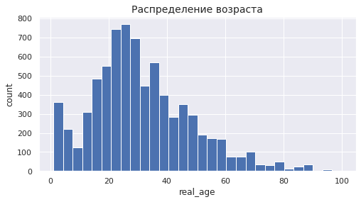
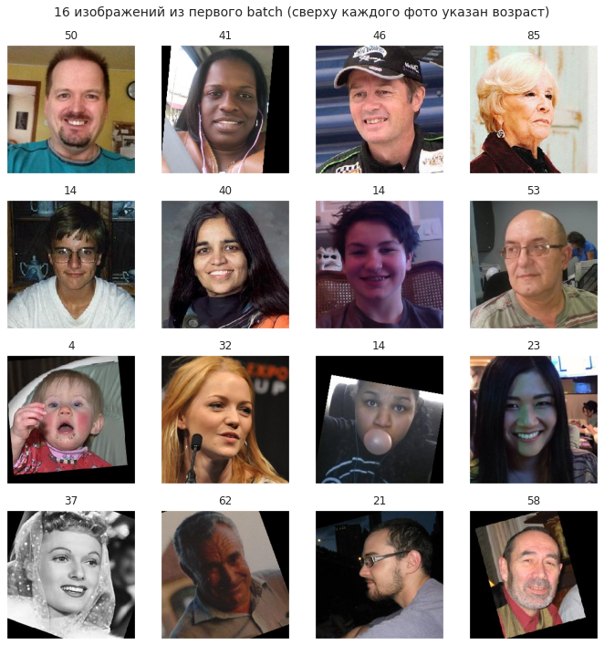

# Исследовательский анализ данных


```python
%pip install seaborn
```

    Defaulting to user installation because normal site-packages is not writeable
    Requirement already satisfied: seaborn in /home/jupyter/.local/lib/python3.8/site-packages (0.12.0)
    Requirement already satisfied: pandas>=0.25 in /usr/local/lib/python3.8/dist-packages (from seaborn) (0.25.3)
    Requirement already satisfied: matplotlib>=3.1 in /kernel/lib/python3.8/site-packages (from seaborn) (3.3.3)
    Requirement already satisfied: numpy>=1.17 in /kernel/fallback/lib/python3.8/site-packages (from seaborn) (1.19.4)
    Requirement already satisfied: pyparsing!=2.0.4,!=2.1.2,!=2.1.6,>=2.0.3 in /kernel/lib/python3.8/site-packages (from matplotlib>=3.1->seaborn) (2.4.7)
    Requirement already satisfied: python-dateutil>=2.1 in /kernel/lib/python3.8/site-packages (from matplotlib>=3.1->seaborn) (2.8.2)
    Requirement already satisfied: cycler>=0.10 in /kernel/lib/python3.8/site-packages (from matplotlib>=3.1->seaborn) (0.11.0)
    Requirement already satisfied: kiwisolver>=1.0.1 in /kernel/lib/python3.8/site-packages (from matplotlib>=3.1->seaborn) (1.4.4)
    Requirement already satisfied: pillow>=6.2.0 in /kernel/lib/python3.8/site-packages (from matplotlib>=3.1->seaborn) (9.2.0)
    Requirement already satisfied: pytz>=2017.2 in /usr/local/lib/python3.8/dist-packages (from pandas>=0.25->seaborn) (2021.3)
    Requirement already satisfied: six>=1.5 in /kernel/lib/python3.8/site-packages (from python-dateutil>=2.1->matplotlib>=3.1->seaborn) (1.16.0)
    WARNING: You are using pip version 21.3.1; however, version 22.2.2 is available.
    You should consider upgrading via the '/usr/local/bin/python3 -m pip install --upgrade pip' command.
    


```python
import pandas as pd
import numpy as np
import matplotlib.pyplot as plt
import seaborn as sns
from tensorflow import keras
from tensorflow.keras.preprocessing.image import ImageDataGenerator
from tensorflow.keras.applications.resnet import ResNet50
from tensorflow.keras.layers import GlobalAveragePooling2D, Dense
from tensorflow.keras.models import Sequential
from tensorflow.keras.optimizers import Adam

import os
import warnings
warnings.simplefilter("ignore")
```


```python
os.getcwd()
```


    '/home/jupyter/work/resources'


```python
# загрузка данных
labels = pd.read_csv('/home/jupyter/work/resources/labels.csv')
train_datagen = ImageDataGenerator(rescale=1./255)
train_gen_flow = train_datagen.flow_from_dataframe(
        dataframe=labels,
        directory='/home/jupyter/work/resources/final_files/final_files/',
        x_col='file_name',
        y_col='real_age',
        target_size=(224, 224),
        batch_size=32,
        class_mode='raw',
        seed=12345) 
```

    Found 7591 validated image filenames.
    


```python
features, target = next(train_gen_flow)
```


```python
features.shape
```


    (32, 224, 224, 3)


```python
target.shape
```


    (32,)


```python
type(target)
```


    numpy.ndarray


```python
type(features)
```


    numpy.ndarray


```python
labels.head()
```


<div>
<style scoped>
    .dataframe tbody tr th:only-of-type {
        vertical-align: middle;
    }

    .dataframe tbody tr th {
        vertical-align: top;
    }

    .dataframe thead th {
        text-align: right;
    }
</style>
<table border="1" class="dataframe">
  <thead>
    <tr style="text-align: right;">
      <th></th>
      <th>file_name</th>
      <th>real_age</th>
    </tr>
  </thead>
  <tbody>
    <tr>
      <th>0</th>
      <td>000000.jpg</td>
      <td>4</td>
    </tr>
    <tr>
      <th>1</th>
      <td>000001.jpg</td>
      <td>18</td>
    </tr>
    <tr>
      <th>2</th>
      <td>000002.jpg</td>
      <td>80</td>
    </tr>
    <tr>
      <th>3</th>
      <td>000003.jpg</td>
      <td>50</td>
    </tr>
    <tr>
      <th>4</th>
      <td>000004.jpg</td>
      <td>17</td>
    </tr>
  </tbody>
</table>
</div>


```python
labels.info()
```

    <class 'pandas.core.frame.DataFrame'>
    RangeIndex: 7591 entries, 0 to 7590
    Data columns (total 2 columns):
    file_name    7591 non-null object
    real_age     7591 non-null int64
    dtypes: int64(1), object(1)
    memory usage: 118.7+ KB
    


```python
labels.describe()
```


<div>
<style scoped>
    .dataframe tbody tr th:only-of-type {
        vertical-align: middle;
    }

    .dataframe tbody tr th {
        vertical-align: top;
    }

    .dataframe thead th {
        text-align: right;
    }
</style>
<table border="1" class="dataframe">
  <thead>
    <tr style="text-align: right;">
      <th></th>
      <th>real_age</th>
    </tr>
  </thead>
  <tbody>
    <tr>
      <th>count</th>
      <td>7591.000000</td>
    </tr>
    <tr>
      <th>mean</th>
      <td>31.201159</td>
    </tr>
    <tr>
      <th>std</th>
      <td>17.145060</td>
    </tr>
    <tr>
      <th>min</th>
      <td>1.000000</td>
    </tr>
    <tr>
      <th>25%</th>
      <td>20.000000</td>
    </tr>
    <tr>
      <th>50%</th>
      <td>29.000000</td>
    </tr>
    <tr>
      <th>75%</th>
      <td>41.000000</td>
    </tr>
    <tr>
      <th>max</th>
      <td>100.000000</td>
    </tr>
  </tbody>
</table>
</div>


```python
labels.median()
```


    real_age    29.0
    dtype: float64


```python
sns.set(style="darkgrid")
labels['real_age'].plot(kind='hist', figsize=(8,4), bins=30)
plt.title("Распределение возраста", fontsize=14)
plt.xlabel("real_age")
plt.ylabel("count");
```


    

    


```python
# выводим 16 изображений
fig = plt.figure(figsize=(10,10))
plt.suptitle("16 изображений из первого batch (сверху каждого фото указан возраст)", fontsize=14)
for i in range(16):
    fig.add_subplot(4, 4, i+1)
    plt.imshow(features[i])
    num = pd.DataFrame(target)[0][i]
    plt.title(num)
	# для компактности удаляем оси и прижимаем изображения друг к другу
    plt.xticks([])
    plt.yticks([])
    plt.tight_layout()
```


    

    


## Вывод

**В результате исследовательского анализа, установлено:**

1. общее число фотографий в датасете 7591;
2. target_size=(224, 224);
3. batch_size=32;
4. распределение возрастов по типу Пуассона;
5. среднее (31) значение смещено вправо относительно медианного (29);
6. максимальный возраст - 100, минимальный - 1.

# Обучение модели


```python
def load_train(path):
    #labels = pd.read_csv(path)
    labels = pd.read_csv(path + 'labels.csv')
    train_datagen = ImageDataGenerator(validation_split = 0.25, rescale=1./255, horizontal_flip=True,
                                       width_shift_range=0.1,
                                       height_shift_range=0.1)
    train_gen_flow = train_datagen.flow_from_dataframe(
        dataframe=labels,
        directory= path + 'final_files/final_files',
        x_col='file_name',
        y_col='real_age',
        target_size=(224, 224),
        batch_size=32,
        class_mode='raw',
        subset='training',
        seed=12345) 
 
    return train_gen_flow
```


```python
def load_test(path):
    labels = pd.read_csv(path + 'labels.csv')
   # labels = pd.read_csv(path)
    test_datagen = ImageDataGenerator(validation_split = 0.25, rescale=1./255)
    test_gen_flow = test_datagen.flow_from_dataframe(
        dataframe=labels,
        directory=path + 'final_files/final_files',
        x_col='file_name',
        y_col='real_age',
        target_size=(224, 224),
        batch_size=32,
        class_mode='raw',
        subset='validation',
        seed=12345) 
 
    return test_gen_flow
```


```python
def create_model(input_shape):
    backbone = ResNet50(input_shape=(224, 224, 3),
                    weights='/home/jupyter/work/resources/resnet50_weights_tf_dim_ordering_tf_kernels_notop.h5',
                    include_top=False) 
    # замораживаем ResNet50 без верхушки
    #backbone.trainable = False
    model = Sequential()
    model.add(backbone)
    model.add(GlobalAveragePooling2D())
    model.add(Dense(1, activation='relu')) 
    optimizer = Adam(lr=0.0001)
    model.compile(optimizer=optimizer, loss='mae', 
                  metrics=['mape'])
    return model
```


```python
def train_model(model, train_data, test_data, batch_size=None, epochs=10, steps_per_epoch=None, validation_steps=None):
 
    model.fit(train_data, 
              validation_data= test_data,
              epochs=epochs,
              steps_per_epoch=len(train_data),
              validation_steps=len(test_data),
              verbose=2)
 
    return model 
```


```python
input_shape=(224, 224, 3)
```


```python
#!g1.4
%%time
train_model(create_model(input_shape),
            load_train('/home/jupyter/work/resources/'),
            load_test('/home/jupyter/work/resources/'),
            batch_size=None, epochs=7, steps_per_epoch=None, validation_steps=None)
```

    2022-09-09 23:51:44.454742: I tensorflow/core/platform/cpu_feature_guard.cc:142] This TensorFlow binary is optimized with oneAPI Deep Neural Network Library (oneDNN) to use the following CPU instructions in performance-critical operations:  AVX2 AVX512F FMA
    To enable them in other operations, rebuild TensorFlow with the appropriate compiler flags.
    2022-09-09 23:51:47.492950: I tensorflow/core/common_runtime/gpu/gpu_device.cc:1510] Created device /job:localhost/replica:0/task:0/device:GPU:0 with 30995 MB memory:  -> device: 0, name: Tesla V100-SXM2-32GB, pci bus id: 0000:8a:00.0, compute capability: 7.0
    2022-09-09 23:51:47.497482: I tensorflow/core/common_runtime/gpu/gpu_device.cc:1510] Created device /job:localhost/replica:0/task:0/device:GPU:1 with 30995 MB memory:  -> device: 1, name: Tesla V100-SXM2-32GB, pci bus id: 0000:8b:00.0, compute capability: 7.0
    2022-09-09 23:51:47.501487: I tensorflow/core/common_runtime/gpu/gpu_device.cc:1510] Created device /job:localhost/replica:0/task:0/device:GPU:2 with 30995 MB memory:  -> device: 2, name: Tesla V100-SXM2-32GB, pci bus id: 0000:9c:00.0, compute capability: 7.0
    2022-09-09 23:51:47.505566: I tensorflow/core/common_runtime/gpu/gpu_device.cc:1510] Created device /job:localhost/replica:0/task:0/device:GPU:3 with 30995 MB memory:  -> device: 3, name: Tesla V100-SXM2-32GB, pci bus id: 0000:9d:00.0, compute capability: 7.0
    /usr/local/lib/python3.8/dist-packages/keras/optimizer_v2/optimizer_v2.py:355: UserWarning: The `lr` argument is deprecated, use `learning_rate` instead.
      warnings.warn(
    2022-09-09 23:51:57.517282: I tensorflow/compiler/mlir/mlir_graph_optimization_pass.cc:185] None of the MLIR Optimization Passes are enabled (registered 2)
    2022-09-09 23:52:03.245192: I tensorflow/stream_executor/cuda/cuda_dnn.cc:369] Loaded cuDNN version 8101
    

    Found 5694 validated image filenames.
    Found 1897 validated image filenames.
    Epoch 1/7
    178/178 - 88s - loss: 11.4484 - mape: 52.8966 - val_loss: 20.8583 - val_mape: 89.1753
    Epoch 2/7
    178/178 - 77s - loss: 7.6272 - mape: 38.5009 - val_loss: 22.5390 - val_mape: 82.9700
    Epoch 3/7
    178/178 - 74s - loss: 6.8207 - mape: 34.7290 - val_loss: 12.9494 - val_mape: 89.5773
    Epoch 4/7
    178/178 - 75s - loss: 6.3138 - mape: 30.8463 - val_loss: 13.2814 - val_mape: 47.5755
    Epoch 5/7
    178/178 - 75s - loss: 5.8923 - mape: 28.8803 - val_loss: 6.9184 - val_mape: 38.3723
    Epoch 6/7
    178/178 - 76s - loss: 5.6690 - mape: 27.0735 - val_loss: 6.5204 - val_mape: 35.2173
    Epoch 7/7
    178/178 - 75s - loss: 5.3470 - mape: 24.6381 - val_loss: 6.6847 - val_mape: 32.4547
    CPU times: user 9min 23s, sys: 31.2 s, total: 9min 54s
    Wall time: 9min 17s
    


    <keras.engine.sequential.Sequential at 0x7f6f4069e8b0>


## Вывод


**В результате обучения, установлено:**

1. размер входного изображения: (224, 224, 3);
2. применена аугментация: "горизонтальное отражение", "сдвиг по ширине и высоте";
3. обучение проходило в 7 эпохах;
4. время обучения составило порядка 9 минут на g1.4(32 cores, GPU: 4x V100) от Yandex Cloud;
5. лучшее качество модели на валидационной выборке - val_loss: 6.6847 - val_mape: 32.4547;
6. модель почти готова к выходу в продакшен, так как дает порядка 68% точности, [при максимальных 75.9% на датасете ImageNet](https://habr.com/ru/post/347564/).

# Анализ модели

1. В качестве базовой модели взята модель ResNet50;
2. Архитектура ResNet взята без двух последних слоев;
3. Добавлены два последних слоя:GlobalAveragePooling2D и Dense (функция активации: 'relu');
4. Функция потерь: MAE, метрика качества: MAPE;
5. В качестве итерационного метода для оптимизации целевой функции взят:  'adam' с шагом: 0.0001.
