## Исследовательский анализ данных

#### Загрузка библиотек, данных и их предварительный анализ


```python
!pip install catboost
```

    Looking in indexes: https://pypi.org/simple, https://us-python.pkg.dev/colab-wheels/public/simple/
    Requirement already satisfied: catboost in /usr/local/lib/python3.7/dist-packages (1.1)
    Requirement already satisfied: scipy in /usr/local/lib/python3.7/dist-packages (from catboost) (1.7.3)
    Requirement already satisfied: pandas>=0.24.0 in /usr/local/lib/python3.7/dist-packages (from catboost) (1.3.5)
    Requirement already satisfied: graphviz in /usr/local/lib/python3.7/dist-packages (from catboost) (0.10.1)
    Requirement already satisfied: six in /usr/local/lib/python3.7/dist-packages (from catboost) (1.15.0)
    Requirement already satisfied: numpy>=1.16.0 in /usr/local/lib/python3.7/dist-packages (from catboost) (1.21.6)
    Requirement already satisfied: matplotlib in /usr/local/lib/python3.7/dist-packages (from catboost) (3.2.2)
    Requirement already satisfied: plotly in /usr/local/lib/python3.7/dist-packages (from catboost) (5.5.0)
    Requirement already satisfied: python-dateutil>=2.7.3 in /usr/local/lib/python3.7/dist-packages (from pandas>=0.24.0->catboost) (2.8.2)
    Requirement already satisfied: pytz>=2017.3 in /usr/local/lib/python3.7/dist-packages (from pandas>=0.24.0->catboost) (2022.2.1)
    Requirement already satisfied: pyparsing!=2.0.4,!=2.1.2,!=2.1.6,>=2.0.1 in /usr/local/lib/python3.7/dist-packages (from matplotlib->catboost) (3.0.9)
    Requirement already satisfied: cycler>=0.10 in /usr/local/lib/python3.7/dist-packages (from matplotlib->catboost) (0.11.0)
    Requirement already satisfied: kiwisolver>=1.0.1 in /usr/local/lib/python3.7/dist-packages (from matplotlib->catboost) (1.4.4)
    Requirement already satisfied: typing-extensions in /usr/local/lib/python3.7/dist-packages (from kiwisolver>=1.0.1->matplotlib->catboost) (4.1.1)
    Requirement already satisfied: tenacity>=6.2.0 in /usr/local/lib/python3.7/dist-packages (from plotly->catboost) (8.0.1)
    


```python
!pip install xgboost
```

    Looking in indexes: https://pypi.org/simple, https://us-python.pkg.dev/colab-wheels/public/simple/
    Requirement already satisfied: xgboost in /usr/local/lib/python3.7/dist-packages (0.90)
    Requirement already satisfied: scipy in /usr/local/lib/python3.7/dist-packages (from xgboost) (1.7.3)
    Requirement already satisfied: numpy in /usr/local/lib/python3.7/dist-packages (from xgboost) (1.21.6)
    


```python
import pandas as pd
import numpy as np
import warnings
warnings.simplefilter("ignore")
import matplotlib.pyplot as plt 
import seaborn as sns

from sklearn.ensemble import IsolationForest
from sklearn.model_selection import train_test_split, cross_val_score, GridSearchCV, RandomizedSearchCV
from sklearn.metrics import mean_absolute_error
from sklearn.preprocessing import StandardScaler

from sklearn.linear_model import LinearRegression
from catboost import CatBoostRegressor
from sklearn.ensemble import RandomForestRegressor
from xgboost.sklearn import XGBRegressor

```


```python
try:
    # просмотр, где находится каталог с файлами на COLAB
    from google.colab import drive
    drive.mount('/content/drive')
    # получение доступа к каталогу и уточнение названия папок
    import os
    os.listdir('/content/drive/My Drive/Colab Notebooks/Яндекс/ФИНАЛЬНЫЙ проект/final_steel.zip (Unzipped Files)/final_steel')
    # загрузка данных csv
    data_gas = pd.read_csv('/content/drive/My Drive/Colab Notebooks/Яндекс/ФИНАЛЬНЫЙ проект/final_steel.zip (Unzipped Files)/final_steel/data_gas.csv')
    data_wire = pd.read_csv('/content/drive/My Drive/Colab Notebooks/Яндекс/ФИНАЛЬНЫЙ проект/final_steel.zip (Unzipped Files)/final_steel/data_wire.csv')
    data_temp = pd.read_csv('/content/drive/My Drive/Colab Notebooks/Яндекс/ФИНАЛЬНЫЙ проект/final_steel.zip (Unzipped Files)/final_steel/data_temp.csv')
    data_arc = pd.read_csv('/content/drive/My Drive/Colab Notebooks/Яндекс/ФИНАЛЬНЫЙ проект/final_steel.zip (Unzipped Files)/final_steel/data_arc.csv')
    data_bulk = pd.read_csv('/content/drive/My Drive/Colab Notebooks/Яндекс/ФИНАЛЬНЫЙ проект/final_steel.zip (Unzipped Files)/final_steel/data_bulk.csv')
    data_wire_time = pd.read_csv('/content/drive/My Drive/Colab Notebooks/Яндекс/ФИНАЛЬНЫЙ проект/final_steel.zip (Unzipped Files)/final_steel/data_wire_time.csv')
    data_bulk_time = pd.read_csv('/content/drive/My Drive/Colab Notebooks/Яндекс/ФИНАЛЬНЫЙ проект/final_steel.zip (Unzipped Files)/final_steel/data_bulk_time.csv')
    
except ModuleNotFoundError:
    # загрузка данных csv
    data_gas = pd.read_csv('/datasets/final_steel/data_gas.csv')
    data_wire = pd.read_csv('/datasets/final_steel/data_wire.csv')
    data_temp = pd.read_csv('/datasets/final_steel/data_temp.csv')
    data_arc = pd.read_csv('/datasets/final_steel/data_arc.csv')
    data_bulk = pd.read_csv('/datasets/final_steel/data_bulk.csv')
    data_wire_time = pd.read_csv('/datasets/final_steel/data_wire_time.csv')
    data_bulk_time = pd.read_csv('/datasets/final_steel/data_bulk_time.csv')
```

    Drive already mounted at /content/drive; to attempt to forcibly remount, call drive.mount("/content/drive", force_remount=True).
    


```python
list_data = [data_gas,
             data_wire,
             data_temp,
             data_arc,
             data_bulk,
             data_wire_time,
             data_bulk_time]
```


```python
list_name_data = ['ДАННЫЕ О ПРОДУВКЕ СПЛАВА ГАЗОМ',
             'ДАННЫЕ О ПРОВОЛОЧНЫХ МАТЕРИАЛАХ (ОБЪЁМ)',
             'РЕЗУЛЬТАТЫ ИЗМЕРЕНИЯ ТЕМПЕРАТУРЫ',
             'ДАННЫЕ ОБ ЭЛЕКТРОДАХ',
             'ДАННЫЕ О ПОДАЧЕ СЫПУЧИХ МАТЕРИАЛОВ (ОБЪЁМ)',
             'ДАННЫЕ О ПРОВОЛОЧНЫХ МАТЕРИАЛАХ (ВРЕМЯ)',
             'ДАННЫЕ О ПОДАЧЕ СЫПУЧИХ МАТЕРИАЛОВ (ВРЕМЯ)']
```


```python
i_name = 0
for dat in list_data:
  print(list_name_data[i_name])
  print(dat.head())
  #display(dat.head())
  i_name = i_name + 1
  print('###########################################################################')
```

    ДАННЫЕ О ПРОДУВКЕ СПЛАВА ГАЗОМ
       key      Газ 1
    0    1  29.749986
    1    2  12.555561
    2    3  28.554793
    3    4  18.841219
    4    5   5.413692
    ###########################################################################
    ДАННЫЕ О ПРОВОЛОЧНЫХ МАТЕРИАЛАХ (ОБЪЁМ)
       key     Wire 1   Wire 2  Wire 3  Wire 4  Wire 5  Wire 6  Wire 7  Wire 8  \
    0    1  60.059998      NaN     NaN     NaN     NaN     NaN     NaN     NaN   
    1    2  96.052315      NaN     NaN     NaN     NaN     NaN     NaN     NaN   
    2    3  91.160157      NaN     NaN     NaN     NaN     NaN     NaN     NaN   
    3    4  89.063515      NaN     NaN     NaN     NaN     NaN     NaN     NaN   
    4    5  89.238236  9.11456     NaN     NaN     NaN     NaN     NaN     NaN   
    
       Wire 9  
    0     NaN  
    1     NaN  
    2     NaN  
    3     NaN  
    4     NaN  
    ###########################################################################
    РЕЗУЛЬТАТЫ ИЗМЕРЕНИЯ ТЕМПЕРАТУРЫ
       key         Время замера  Температура
    0    1  2019-05-03 11:16:18       1571.0
    1    1  2019-05-03 11:25:53       1604.0
    2    1  2019-05-03 11:29:11       1618.0
    3    1  2019-05-03 11:30:01       1601.0
    4    1  2019-05-03 11:30:39       1613.0
    ###########################################################################
    ДАННЫЕ ОБ ЭЛЕКТРОДАХ
       key Начало нагрева дугой  Конец нагрева дугой  Активная мощность  \
    0    1  2019-05-03 11:02:14  2019-05-03 11:06:02           0.976059   
    1    1  2019-05-03 11:07:28  2019-05-03 11:10:33           0.805607   
    2    1  2019-05-03 11:11:44  2019-05-03 11:14:36           0.744363   
    3    1  2019-05-03 11:18:14  2019-05-03 11:24:19           1.659363   
    4    1  2019-05-03 11:26:09  2019-05-03 11:28:37           0.692755   
    
       Реактивная мощность  
    0             0.687084  
    1             0.520285  
    2             0.498805  
    3             1.062669  
    4             0.414397  
    ###########################################################################
    ДАННЫЕ О ПОДАЧЕ СЫПУЧИХ МАТЕРИАЛОВ (ОБЪЁМ)
       key  Bulk 1  Bulk 2  Bulk 3  Bulk 4  Bulk 5  Bulk 6  Bulk 7  Bulk 8  \
    0    1     NaN     NaN     NaN    43.0     NaN     NaN     NaN     NaN   
    1    2     NaN     NaN     NaN    73.0     NaN     NaN     NaN     NaN   
    2    3     NaN     NaN     NaN    34.0     NaN     NaN     NaN     NaN   
    3    4     NaN     NaN     NaN    81.0     NaN     NaN     NaN     NaN   
    4    5     NaN     NaN     NaN    78.0     NaN     NaN     NaN     NaN   
    
       Bulk 9  Bulk 10  Bulk 11  Bulk 12  Bulk 13  Bulk 14  Bulk 15  
    0     NaN      NaN      NaN    206.0      NaN    150.0    154.0  
    1     NaN      NaN      NaN    206.0      NaN    149.0    154.0  
    2     NaN      NaN      NaN    205.0      NaN    152.0    153.0  
    3     NaN      NaN      NaN    207.0      NaN    153.0    154.0  
    4     NaN      NaN      NaN    203.0      NaN    151.0    152.0  
    ###########################################################################
    ДАННЫЕ О ПРОВОЛОЧНЫХ МАТЕРИАЛАХ (ВРЕМЯ)
       key               Wire 1               Wire 2 Wire 3 Wire 4 Wire 5 Wire 6  \
    0    1  2019-05-03 11:11:41                  NaN    NaN    NaN    NaN    NaN   
    1    2  2019-05-03 11:46:10                  NaN    NaN    NaN    NaN    NaN   
    2    3  2019-05-03 12:13:47                  NaN    NaN    NaN    NaN    NaN   
    3    4  2019-05-03 12:48:05                  NaN    NaN    NaN    NaN    NaN   
    4    5  2019-05-03 13:18:15  2019-05-03 13:32:06    NaN    NaN    NaN    NaN   
    
      Wire 7 Wire 8 Wire 9  
    0    NaN    NaN    NaN  
    1    NaN    NaN    NaN  
    2    NaN    NaN    NaN  
    3    NaN    NaN    NaN  
    4    NaN    NaN    NaN  
    ###########################################################################
    ДАННЫЕ О ПОДАЧЕ СЫПУЧИХ МАТЕРИАЛОВ (ВРЕМЯ)
       key Bulk 1 Bulk 2 Bulk 3               Bulk 4 Bulk 5 Bulk 6 Bulk 7 Bulk 8  \
    0    1    NaN    NaN    NaN  2019-05-03 11:21:30    NaN    NaN    NaN    NaN   
    1    2    NaN    NaN    NaN  2019-05-03 11:46:38    NaN    NaN    NaN    NaN   
    2    3    NaN    NaN    NaN  2019-05-03 12:31:06    NaN    NaN    NaN    NaN   
    3    4    NaN    NaN    NaN  2019-05-03 12:48:43    NaN    NaN    NaN    NaN   
    4    5    NaN    NaN    NaN  2019-05-03 13:18:50    NaN    NaN    NaN    NaN   
    
      Bulk 9 Bulk 10 Bulk 11              Bulk 12 Bulk 13              Bulk 14  \
    0    NaN     NaN     NaN  2019-05-03 11:03:52     NaN  2019-05-03 11:03:52   
    1    NaN     NaN     NaN  2019-05-03 11:40:20     NaN  2019-05-03 11:40:20   
    2    NaN     NaN     NaN  2019-05-03 12:09:40     NaN  2019-05-03 12:09:40   
    3    NaN     NaN     NaN  2019-05-03 12:41:24     NaN  2019-05-03 12:41:24   
    4    NaN     NaN     NaN  2019-05-03 13:12:56     NaN  2019-05-03 13:12:56   
    
                   Bulk 15  
    0  2019-05-03 11:03:52  
    1  2019-05-03 11:40:20  
    2  2019-05-03 12:09:40  
    3  2019-05-03 12:41:24  
    4  2019-05-03 13:12:56  
    ###########################################################################
    


```python
print('                                                      --/ ОБЩАЯ ИНФОРМАЦИЯ, ПРОВЕРКА ТИПОВ /--')
i_name = 0
for dat in list_data:
  print(list_name_data[i_name])
  dat.info()
  i_name = i_name + 1
  print('##########################################')

```

                                                          --/ ОБЩАЯ ИНФОРМАЦИЯ, ПРОВЕРКА ТИПОВ /--
    ДАННЫЕ О ПРОДУВКЕ СПЛАВА ГАЗОМ
    <class 'pandas.core.frame.DataFrame'>
    RangeIndex: 3239 entries, 0 to 3238
    Data columns (total 2 columns):
     #   Column  Non-Null Count  Dtype  
    ---  ------  --------------  -----  
     0   key     3239 non-null   int64  
     1   Газ 1   3239 non-null   float64
    dtypes: float64(1), int64(1)
    memory usage: 50.7 KB
    ##########################################
    ДАННЫЕ О ПРОВОЛОЧНЫХ МАТЕРИАЛАХ (ОБЪЁМ)
    <class 'pandas.core.frame.DataFrame'>
    RangeIndex: 3081 entries, 0 to 3080
    Data columns (total 10 columns):
     #   Column  Non-Null Count  Dtype  
    ---  ------  --------------  -----  
     0   key     3081 non-null   int64  
     1   Wire 1  3055 non-null   float64
     2   Wire 2  1079 non-null   float64
     3   Wire 3  63 non-null     float64
     4   Wire 4  14 non-null     float64
     5   Wire 5  1 non-null      float64
     6   Wire 6  73 non-null     float64
     7   Wire 7  11 non-null     float64
     8   Wire 8  19 non-null     float64
     9   Wire 9  29 non-null     float64
    dtypes: float64(9), int64(1)
    memory usage: 240.8 KB
    ##########################################
    РЕЗУЛЬТАТЫ ИЗМЕРЕНИЯ ТЕМПЕРАТУРЫ
    <class 'pandas.core.frame.DataFrame'>
    RangeIndex: 15907 entries, 0 to 15906
    Data columns (total 3 columns):
     #   Column        Non-Null Count  Dtype  
    ---  ------        --------------  -----  
     0   key           15907 non-null  int64  
     1   Время замера  15907 non-null  object 
     2   Температура   13006 non-null  float64
    dtypes: float64(1), int64(1), object(1)
    memory usage: 372.9+ KB
    ##########################################
    ДАННЫЕ ОБ ЭЛЕКТРОДАХ
    <class 'pandas.core.frame.DataFrame'>
    RangeIndex: 14876 entries, 0 to 14875
    Data columns (total 5 columns):
     #   Column                Non-Null Count  Dtype  
    ---  ------                --------------  -----  
     0   key                   14876 non-null  int64  
     1   Начало нагрева дугой  14876 non-null  object 
     2   Конец нагрева дугой   14876 non-null  object 
     3   Активная мощность     14876 non-null  float64
     4   Реактивная мощность   14876 non-null  float64
    dtypes: float64(2), int64(1), object(2)
    memory usage: 581.2+ KB
    ##########################################
    ДАННЫЕ О ПОДАЧЕ СЫПУЧИХ МАТЕРИАЛОВ (ОБЪЁМ)
    <class 'pandas.core.frame.DataFrame'>
    RangeIndex: 3129 entries, 0 to 3128
    Data columns (total 16 columns):
     #   Column   Non-Null Count  Dtype  
    ---  ------   --------------  -----  
     0   key      3129 non-null   int64  
     1   Bulk 1   252 non-null    float64
     2   Bulk 2   22 non-null     float64
     3   Bulk 3   1298 non-null   float64
     4   Bulk 4   1014 non-null   float64
     5   Bulk 5   77 non-null     float64
     6   Bulk 6   576 non-null    float64
     7   Bulk 7   25 non-null     float64
     8   Bulk 8   1 non-null      float64
     9   Bulk 9   19 non-null     float64
     10  Bulk 10  176 non-null    float64
     11  Bulk 11  177 non-null    float64
     12  Bulk 12  2450 non-null   float64
     13  Bulk 13  18 non-null     float64
     14  Bulk 14  2806 non-null   float64
     15  Bulk 15  2248 non-null   float64
    dtypes: float64(15), int64(1)
    memory usage: 391.2 KB
    ##########################################
    ДАННЫЕ О ПРОВОЛОЧНЫХ МАТЕРИАЛАХ (ВРЕМЯ)
    <class 'pandas.core.frame.DataFrame'>
    RangeIndex: 3081 entries, 0 to 3080
    Data columns (total 10 columns):
     #   Column  Non-Null Count  Dtype 
    ---  ------  --------------  ----- 
     0   key     3081 non-null   int64 
     1   Wire 1  3055 non-null   object
     2   Wire 2  1079 non-null   object
     3   Wire 3  63 non-null     object
     4   Wire 4  14 non-null     object
     5   Wire 5  1 non-null      object
     6   Wire 6  73 non-null     object
     7   Wire 7  11 non-null     object
     8   Wire 8  19 non-null     object
     9   Wire 9  29 non-null     object
    dtypes: int64(1), object(9)
    memory usage: 240.8+ KB
    ##########################################
    ДАННЫЕ О ПОДАЧЕ СЫПУЧИХ МАТЕРИАЛОВ (ВРЕМЯ)
    <class 'pandas.core.frame.DataFrame'>
    RangeIndex: 3129 entries, 0 to 3128
    Data columns (total 16 columns):
     #   Column   Non-Null Count  Dtype 
    ---  ------   --------------  ----- 
     0   key      3129 non-null   int64 
     1   Bulk 1   252 non-null    object
     2   Bulk 2   22 non-null     object
     3   Bulk 3   1298 non-null   object
     4   Bulk 4   1014 non-null   object
     5   Bulk 5   77 non-null     object
     6   Bulk 6   576 non-null    object
     7   Bulk 7   25 non-null     object
     8   Bulk 8   1 non-null      object
     9   Bulk 9   19 non-null     object
     10  Bulk 10  176 non-null    object
     11  Bulk 11  177 non-null    object
     12  Bulk 12  2450 non-null   object
     13  Bulk 13  18 non-null     object
     14  Bulk 14  2806 non-null   object
     15  Bulk 15  2248 non-null   object
    dtypes: int64(1), object(15)
    memory usage: 391.2+ KB
    ##########################################
    

### Вывод

**В результате предварительного анализа данных, установлено:**

1. В столбце "Время замера" таблицы `data_temp` (результаты измерения температуры) тип object, а должен быть datetime.
2. В столбце "Начало нагрева дугой" таблицы `data_arc` (данные об электродах) тип object, а должен быть datetime.
3. В столбце "Конец нагрева дугой" таблицы `data_arc` (данные об электродах) тип object, а должен быть datetime.
4. Во всех столбцах таблиц `data_wire_time` (данные о проволочных материалах (время)), `data_bulk_time` (данные о подаче сыпучих материалов (время)) тип object, а должен быть datetime.


```python
print('                                                        --/ ОПИСАТЕЛЬНАЯ СТАТИСТИКА /--')
i_name = 0
for dat in list_data:
  print(list_name_data[i_name])
  display(dat.describe())
  i_name = i_name + 1
  print('#####################################################################################################################')

```

                                                            --/ ОПИСАТЕЛЬНАЯ СТАТИСТИКА /--
    ДАННЫЕ О ПРОДУВКЕ СПЛАВА ГАЗОМ
    


  <div id="df-6be80bc4-a784-4c34-a06d-aa2ab507ecbc">
    <div class="colab-df-container">
      <div>
<style scoped>
    .dataframe tbody tr th:only-of-type {
        vertical-align: middle;
    }

    .dataframe tbody tr th {
        vertical-align: top;
    }

    .dataframe thead th {
        text-align: right;
    }
</style>
<table border="1" class="dataframe">
  <thead>
    <tr style="text-align: right;">
      <th></th>
      <th>key</th>
      <th>Газ 1</th>
    </tr>
  </thead>
  <tbody>
    <tr>
      <th>count</th>
      <td>3239.000000</td>
      <td>3239.000000</td>
    </tr>
    <tr>
      <th>mean</th>
      <td>1621.861377</td>
      <td>11.002062</td>
    </tr>
    <tr>
      <th>std</th>
      <td>935.386334</td>
      <td>6.220327</td>
    </tr>
    <tr>
      <th>min</th>
      <td>1.000000</td>
      <td>0.008399</td>
    </tr>
    <tr>
      <th>25%</th>
      <td>812.500000</td>
      <td>7.043089</td>
    </tr>
    <tr>
      <th>50%</th>
      <td>1622.000000</td>
      <td>9.836267</td>
    </tr>
    <tr>
      <th>75%</th>
      <td>2431.500000</td>
      <td>13.769915</td>
    </tr>
    <tr>
      <th>max</th>
      <td>3241.000000</td>
      <td>77.995040</td>
    </tr>
  </tbody>
</table>
</div>
      <button class="colab-df-convert" onclick="convertToInteractive('df-6be80bc4-a784-4c34-a06d-aa2ab507ecbc')"
              title="Convert this dataframe to an interactive table."
              style="display:none;">

  <svg xmlns="http://www.w3.org/2000/svg" height="24px"viewBox="0 0 24 24"
       width="24px">
    <path d="M0 0h24v24H0V0z" fill="none"/>
    <path d="M18.56 5.44l.94 2.06.94-2.06 2.06-.94-2.06-.94-.94-2.06-.94 2.06-2.06.94zm-11 1L8.5 8.5l.94-2.06 2.06-.94-2.06-.94L8.5 2.5l-.94 2.06-2.06.94zm10 10l.94 2.06.94-2.06 2.06-.94-2.06-.94-.94-2.06-.94 2.06-2.06.94z"/><path d="M17.41 7.96l-1.37-1.37c-.4-.4-.92-.59-1.43-.59-.52 0-1.04.2-1.43.59L10.3 9.45l-7.72 7.72c-.78.78-.78 2.05 0 2.83L4 21.41c.39.39.9.59 1.41.59.51 0 1.02-.2 1.41-.59l7.78-7.78 2.81-2.81c.8-.78.8-2.07 0-2.86zM5.41 20L4 18.59l7.72-7.72 1.47 1.35L5.41 20z"/>
  </svg>
      </button>

  <style>
    .colab-df-container {
      display:flex;
      flex-wrap:wrap;
      gap: 12px;
    }

    .colab-df-convert {
      background-color: #E8F0FE;
      border: none;
      border-radius: 50%;
      cursor: pointer;
      display: none;
      fill: #1967D2;
      height: 32px;
      padding: 0 0 0 0;
      width: 32px;
    }

    .colab-df-convert:hover {
      background-color: #E2EBFA;
      box-shadow: 0px 1px 2px rgba(60, 64, 67, 0.3), 0px 1px 3px 1px rgba(60, 64, 67, 0.15);
      fill: #174EA6;
    }

    [theme=dark] .colab-df-convert {
      background-color: #3B4455;
      fill: #D2E3FC;
    }

    [theme=dark] .colab-df-convert:hover {
      background-color: #434B5C;
      box-shadow: 0px 1px 3px 1px rgba(0, 0, 0, 0.15);
      filter: drop-shadow(0px 1px 2px rgba(0, 0, 0, 0.3));
      fill: #FFFFFF;
    }
  </style>

      <script>
        const buttonEl =
          document.querySelector('#df-6be80bc4-a784-4c34-a06d-aa2ab507ecbc button.colab-df-convert');
        buttonEl.style.display =
          google.colab.kernel.accessAllowed ? 'block' : 'none';

        async function convertToInteractive(key) {
          const element = document.querySelector('#df-6be80bc4-a784-4c34-a06d-aa2ab507ecbc');
          const dataTable =
            await google.colab.kernel.invokeFunction('convertToInteractive',
                                                     [key], {});
          if (!dataTable) return;

          const docLinkHtml = 'Like what you see? Visit the ' +
            '<a target="_blank" href=https://colab.research.google.com/notebooks/data_table.ipynb>data table notebook</a>'
            + ' to learn more about interactive tables.';
          element.innerHTML = '';
          dataTable['output_type'] = 'display_data';
          await google.colab.output.renderOutput(dataTable, element);
          const docLink = document.createElement('div');
          docLink.innerHTML = docLinkHtml;
          element.appendChild(docLink);
        }
      </script>
    </div>
  </div>


    #####################################################################################################################
    ДАННЫЕ О ПРОВОЛОЧНЫХ МАТЕРИАЛАХ (ОБЪЁМ)
    


  <div id="df-42ad80b4-5caa-4d5a-9795-6ee705c6e353">
    <div class="colab-df-container">
      <div>
<style scoped>
    .dataframe tbody tr th:only-of-type {
        vertical-align: middle;
    }

    .dataframe tbody tr th {
        vertical-align: top;
    }

    .dataframe thead th {
        text-align: right;
    }
</style>
<table border="1" class="dataframe">
  <thead>
    <tr style="text-align: right;">
      <th></th>
      <th>key</th>
      <th>Wire 1</th>
      <th>Wire 2</th>
      <th>Wire 3</th>
      <th>Wire 4</th>
      <th>Wire 5</th>
      <th>Wire 6</th>
      <th>Wire 7</th>
      <th>Wire 8</th>
      <th>Wire 9</th>
    </tr>
  </thead>
  <tbody>
    <tr>
      <th>count</th>
      <td>3081.000000</td>
      <td>3055.000000</td>
      <td>1079.000000</td>
      <td>63.000000</td>
      <td>14.000000</td>
      <td>1.000</td>
      <td>73.000000</td>
      <td>11.000000</td>
      <td>19.000000</td>
      <td>29.000000</td>
    </tr>
    <tr>
      <th>mean</th>
      <td>1623.426485</td>
      <td>100.895853</td>
      <td>50.577323</td>
      <td>189.482681</td>
      <td>57.442841</td>
      <td>15.132</td>
      <td>48.016974</td>
      <td>10.039007</td>
      <td>53.625193</td>
      <td>34.155752</td>
    </tr>
    <tr>
      <th>std</th>
      <td>932.996726</td>
      <td>42.012518</td>
      <td>39.320216</td>
      <td>99.513444</td>
      <td>28.824667</td>
      <td>NaN</td>
      <td>33.919845</td>
      <td>8.610584</td>
      <td>16.881728</td>
      <td>19.931616</td>
    </tr>
    <tr>
      <th>min</th>
      <td>1.000000</td>
      <td>1.918800</td>
      <td>0.030160</td>
      <td>0.144144</td>
      <td>24.148801</td>
      <td>15.132</td>
      <td>0.034320</td>
      <td>0.234208</td>
      <td>45.076721</td>
      <td>4.622800</td>
    </tr>
    <tr>
      <th>25%</th>
      <td>823.000000</td>
      <td>72.115684</td>
      <td>20.193680</td>
      <td>95.135044</td>
      <td>40.807002</td>
      <td>15.132</td>
      <td>25.053600</td>
      <td>6.762756</td>
      <td>46.094879</td>
      <td>22.058401</td>
    </tr>
    <tr>
      <th>50%</th>
      <td>1619.000000</td>
      <td>100.158234</td>
      <td>40.142956</td>
      <td>235.194977</td>
      <td>45.234282</td>
      <td>15.132</td>
      <td>42.076324</td>
      <td>9.017009</td>
      <td>46.279999</td>
      <td>30.066399</td>
    </tr>
    <tr>
      <th>75%</th>
      <td>2434.000000</td>
      <td>126.060483</td>
      <td>70.227558</td>
      <td>276.252014</td>
      <td>76.124619</td>
      <td>15.132</td>
      <td>64.212723</td>
      <td>11.886057</td>
      <td>48.089603</td>
      <td>43.862003</td>
    </tr>
    <tr>
      <th>max</th>
      <td>3241.000000</td>
      <td>330.314424</td>
      <td>282.780152</td>
      <td>385.008668</td>
      <td>113.231044</td>
      <td>15.132</td>
      <td>180.454575</td>
      <td>32.847674</td>
      <td>102.762401</td>
      <td>90.053604</td>
    </tr>
  </tbody>
</table>
</div>
      <button class="colab-df-convert" onclick="convertToInteractive('df-42ad80b4-5caa-4d5a-9795-6ee705c6e353')"
              title="Convert this dataframe to an interactive table."
              style="display:none;">

  <svg xmlns="http://www.w3.org/2000/svg" height="24px"viewBox="0 0 24 24"
       width="24px">
    <path d="M0 0h24v24H0V0z" fill="none"/>
    <path d="M18.56 5.44l.94 2.06.94-2.06 2.06-.94-2.06-.94-.94-2.06-.94 2.06-2.06.94zm-11 1L8.5 8.5l.94-2.06 2.06-.94-2.06-.94L8.5 2.5l-.94 2.06-2.06.94zm10 10l.94 2.06.94-2.06 2.06-.94-2.06-.94-.94-2.06-.94 2.06-2.06.94z"/><path d="M17.41 7.96l-1.37-1.37c-.4-.4-.92-.59-1.43-.59-.52 0-1.04.2-1.43.59L10.3 9.45l-7.72 7.72c-.78.78-.78 2.05 0 2.83L4 21.41c.39.39.9.59 1.41.59.51 0 1.02-.2 1.41-.59l7.78-7.78 2.81-2.81c.8-.78.8-2.07 0-2.86zM5.41 20L4 18.59l7.72-7.72 1.47 1.35L5.41 20z"/>
  </svg>
      </button>

  <style>
    .colab-df-container {
      display:flex;
      flex-wrap:wrap;
      gap: 12px;
    }

    .colab-df-convert {
      background-color: #E8F0FE;
      border: none;
      border-radius: 50%;
      cursor: pointer;
      display: none;
      fill: #1967D2;
      height: 32px;
      padding: 0 0 0 0;
      width: 32px;
    }

    .colab-df-convert:hover {
      background-color: #E2EBFA;
      box-shadow: 0px 1px 2px rgba(60, 64, 67, 0.3), 0px 1px 3px 1px rgba(60, 64, 67, 0.15);
      fill: #174EA6;
    }

    [theme=dark] .colab-df-convert {
      background-color: #3B4455;
      fill: #D2E3FC;
    }

    [theme=dark] .colab-df-convert:hover {
      background-color: #434B5C;
      box-shadow: 0px 1px 3px 1px rgba(0, 0, 0, 0.15);
      filter: drop-shadow(0px 1px 2px rgba(0, 0, 0, 0.3));
      fill: #FFFFFF;
    }
  </style>

      <script>
        const buttonEl =
          document.querySelector('#df-42ad80b4-5caa-4d5a-9795-6ee705c6e353 button.colab-df-convert');
        buttonEl.style.display =
          google.colab.kernel.accessAllowed ? 'block' : 'none';

        async function convertToInteractive(key) {
          const element = document.querySelector('#df-42ad80b4-5caa-4d5a-9795-6ee705c6e353');
          const dataTable =
            await google.colab.kernel.invokeFunction('convertToInteractive',
                                                     [key], {});
          if (!dataTable) return;

          const docLinkHtml = 'Like what you see? Visit the ' +
            '<a target="_blank" href=https://colab.research.google.com/notebooks/data_table.ipynb>data table notebook</a>'
            + ' to learn more about interactive tables.';
          element.innerHTML = '';
          dataTable['output_type'] = 'display_data';
          await google.colab.output.renderOutput(dataTable, element);
          const docLink = document.createElement('div');
          docLink.innerHTML = docLinkHtml;
          element.appendChild(docLink);
        }
      </script>
    </div>
  </div>


    #####################################################################################################################
    РЕЗУЛЬТАТЫ ИЗМЕРЕНИЯ ТЕМПЕРАТУРЫ
    


  <div id="df-8c65fc6b-3d65-418e-a0b3-8d809d92a43f">
    <div class="colab-df-container">
      <div>
<style scoped>
    .dataframe tbody tr th:only-of-type {
        vertical-align: middle;
    }

    .dataframe tbody tr th {
        vertical-align: top;
    }

    .dataframe thead th {
        text-align: right;
    }
</style>
<table border="1" class="dataframe">
  <thead>
    <tr style="text-align: right;">
      <th></th>
      <th>key</th>
      <th>Температура</th>
    </tr>
  </thead>
  <tbody>
    <tr>
      <th>count</th>
      <td>15907.000000</td>
      <td>13006.000000</td>
    </tr>
    <tr>
      <th>mean</th>
      <td>1607.880870</td>
      <td>1591.840920</td>
    </tr>
    <tr>
      <th>std</th>
      <td>942.212073</td>
      <td>21.375851</td>
    </tr>
    <tr>
      <th>min</th>
      <td>1.000000</td>
      <td>1191.000000</td>
    </tr>
    <tr>
      <th>25%</th>
      <td>790.000000</td>
      <td>1581.000000</td>
    </tr>
    <tr>
      <th>50%</th>
      <td>1618.000000</td>
      <td>1591.000000</td>
    </tr>
    <tr>
      <th>75%</th>
      <td>2427.000000</td>
      <td>1601.000000</td>
    </tr>
    <tr>
      <th>max</th>
      <td>3241.000000</td>
      <td>1705.000000</td>
    </tr>
  </tbody>
</table>
</div>
      <button class="colab-df-convert" onclick="convertToInteractive('df-8c65fc6b-3d65-418e-a0b3-8d809d92a43f')"
              title="Convert this dataframe to an interactive table."
              style="display:none;">

  <svg xmlns="http://www.w3.org/2000/svg" height="24px"viewBox="0 0 24 24"
       width="24px">
    <path d="M0 0h24v24H0V0z" fill="none"/>
    <path d="M18.56 5.44l.94 2.06.94-2.06 2.06-.94-2.06-.94-.94-2.06-.94 2.06-2.06.94zm-11 1L8.5 8.5l.94-2.06 2.06-.94-2.06-.94L8.5 2.5l-.94 2.06-2.06.94zm10 10l.94 2.06.94-2.06 2.06-.94-2.06-.94-.94-2.06-.94 2.06-2.06.94z"/><path d="M17.41 7.96l-1.37-1.37c-.4-.4-.92-.59-1.43-.59-.52 0-1.04.2-1.43.59L10.3 9.45l-7.72 7.72c-.78.78-.78 2.05 0 2.83L4 21.41c.39.39.9.59 1.41.59.51 0 1.02-.2 1.41-.59l7.78-7.78 2.81-2.81c.8-.78.8-2.07 0-2.86zM5.41 20L4 18.59l7.72-7.72 1.47 1.35L5.41 20z"/>
  </svg>
      </button>

  <style>
    .colab-df-container {
      display:flex;
      flex-wrap:wrap;
      gap: 12px;
    }

    .colab-df-convert {
      background-color: #E8F0FE;
      border: none;
      border-radius: 50%;
      cursor: pointer;
      display: none;
      fill: #1967D2;
      height: 32px;
      padding: 0 0 0 0;
      width: 32px;
    }

    .colab-df-convert:hover {
      background-color: #E2EBFA;
      box-shadow: 0px 1px 2px rgba(60, 64, 67, 0.3), 0px 1px 3px 1px rgba(60, 64, 67, 0.15);
      fill: #174EA6;
    }

    [theme=dark] .colab-df-convert {
      background-color: #3B4455;
      fill: #D2E3FC;
    }

    [theme=dark] .colab-df-convert:hover {
      background-color: #434B5C;
      box-shadow: 0px 1px 3px 1px rgba(0, 0, 0, 0.15);
      filter: drop-shadow(0px 1px 2px rgba(0, 0, 0, 0.3));
      fill: #FFFFFF;
    }
  </style>

      <script>
        const buttonEl =
          document.querySelector('#df-8c65fc6b-3d65-418e-a0b3-8d809d92a43f button.colab-df-convert');
        buttonEl.style.display =
          google.colab.kernel.accessAllowed ? 'block' : 'none';

        async function convertToInteractive(key) {
          const element = document.querySelector('#df-8c65fc6b-3d65-418e-a0b3-8d809d92a43f');
          const dataTable =
            await google.colab.kernel.invokeFunction('convertToInteractive',
                                                     [key], {});
          if (!dataTable) return;

          const docLinkHtml = 'Like what you see? Visit the ' +
            '<a target="_blank" href=https://colab.research.google.com/notebooks/data_table.ipynb>data table notebook</a>'
            + ' to learn more about interactive tables.';
          element.innerHTML = '';
          dataTable['output_type'] = 'display_data';
          await google.colab.output.renderOutput(dataTable, element);
          const docLink = document.createElement('div');
          docLink.innerHTML = docLinkHtml;
          element.appendChild(docLink);
        }
      </script>
    </div>
  </div>


    #####################################################################################################################
    ДАННЫЕ ОБ ЭЛЕКТРОДАХ
    


  <div id="df-203a862c-e49f-49a1-a761-3b12d1168f6c">
    <div class="colab-df-container">
      <div>
<style scoped>
    .dataframe tbody tr th:only-of-type {
        vertical-align: middle;
    }

    .dataframe tbody tr th {
        vertical-align: top;
    }

    .dataframe thead th {
        text-align: right;
    }
</style>
<table border="1" class="dataframe">
  <thead>
    <tr style="text-align: right;">
      <th></th>
      <th>key</th>
      <th>Активная мощность</th>
      <th>Реактивная мощность</th>
    </tr>
  </thead>
  <tbody>
    <tr>
      <th>count</th>
      <td>14876.000000</td>
      <td>14876.000000</td>
      <td>14876.000000</td>
    </tr>
    <tr>
      <th>mean</th>
      <td>1615.220422</td>
      <td>0.670441</td>
      <td>0.452592</td>
    </tr>
    <tr>
      <th>std</th>
      <td>934.571502</td>
      <td>0.408159</td>
      <td>5.878702</td>
    </tr>
    <tr>
      <th>min</th>
      <td>1.000000</td>
      <td>0.030002</td>
      <td>-715.504924</td>
    </tr>
    <tr>
      <th>25%</th>
      <td>806.000000</td>
      <td>0.395297</td>
      <td>0.290991</td>
    </tr>
    <tr>
      <th>50%</th>
      <td>1617.000000</td>
      <td>0.555517</td>
      <td>0.415962</td>
    </tr>
    <tr>
      <th>75%</th>
      <td>2429.000000</td>
      <td>0.857034</td>
      <td>0.637371</td>
    </tr>
    <tr>
      <th>max</th>
      <td>3241.000000</td>
      <td>3.731596</td>
      <td>2.676388</td>
    </tr>
  </tbody>
</table>
</div>
      <button class="colab-df-convert" onclick="convertToInteractive('df-203a862c-e49f-49a1-a761-3b12d1168f6c')"
              title="Convert this dataframe to an interactive table."
              style="display:none;">

  <svg xmlns="http://www.w3.org/2000/svg" height="24px"viewBox="0 0 24 24"
       width="24px">
    <path d="M0 0h24v24H0V0z" fill="none"/>
    <path d="M18.56 5.44l.94 2.06.94-2.06 2.06-.94-2.06-.94-.94-2.06-.94 2.06-2.06.94zm-11 1L8.5 8.5l.94-2.06 2.06-.94-2.06-.94L8.5 2.5l-.94 2.06-2.06.94zm10 10l.94 2.06.94-2.06 2.06-.94-2.06-.94-.94-2.06-.94 2.06-2.06.94z"/><path d="M17.41 7.96l-1.37-1.37c-.4-.4-.92-.59-1.43-.59-.52 0-1.04.2-1.43.59L10.3 9.45l-7.72 7.72c-.78.78-.78 2.05 0 2.83L4 21.41c.39.39.9.59 1.41.59.51 0 1.02-.2 1.41-.59l7.78-7.78 2.81-2.81c.8-.78.8-2.07 0-2.86zM5.41 20L4 18.59l7.72-7.72 1.47 1.35L5.41 20z"/>
  </svg>
      </button>

  <style>
    .colab-df-container {
      display:flex;
      flex-wrap:wrap;
      gap: 12px;
    }

    .colab-df-convert {
      background-color: #E8F0FE;
      border: none;
      border-radius: 50%;
      cursor: pointer;
      display: none;
      fill: #1967D2;
      height: 32px;
      padding: 0 0 0 0;
      width: 32px;
    }

    .colab-df-convert:hover {
      background-color: #E2EBFA;
      box-shadow: 0px 1px 2px rgba(60, 64, 67, 0.3), 0px 1px 3px 1px rgba(60, 64, 67, 0.15);
      fill: #174EA6;
    }

    [theme=dark] .colab-df-convert {
      background-color: #3B4455;
      fill: #D2E3FC;
    }

    [theme=dark] .colab-df-convert:hover {
      background-color: #434B5C;
      box-shadow: 0px 1px 3px 1px rgba(0, 0, 0, 0.15);
      filter: drop-shadow(0px 1px 2px rgba(0, 0, 0, 0.3));
      fill: #FFFFFF;
    }
  </style>

      <script>
        const buttonEl =
          document.querySelector('#df-203a862c-e49f-49a1-a761-3b12d1168f6c button.colab-df-convert');
        buttonEl.style.display =
          google.colab.kernel.accessAllowed ? 'block' : 'none';

        async function convertToInteractive(key) {
          const element = document.querySelector('#df-203a862c-e49f-49a1-a761-3b12d1168f6c');
          const dataTable =
            await google.colab.kernel.invokeFunction('convertToInteractive',
                                                     [key], {});
          if (!dataTable) return;

          const docLinkHtml = 'Like what you see? Visit the ' +
            '<a target="_blank" href=https://colab.research.google.com/notebooks/data_table.ipynb>data table notebook</a>'
            + ' to learn more about interactive tables.';
          element.innerHTML = '';
          dataTable['output_type'] = 'display_data';
          await google.colab.output.renderOutput(dataTable, element);
          const docLink = document.createElement('div');
          docLink.innerHTML = docLinkHtml;
          element.appendChild(docLink);
        }
      </script>
    </div>
  </div>


    #####################################################################################################################
    ДАННЫЕ О ПОДАЧЕ СЫПУЧИХ МАТЕРИАЛОВ (ОБЪЁМ)
    


  <div id="df-c089d79f-b5f0-4258-9bd7-5a3b295cba24">
    <div class="colab-df-container">
      <div>
<style scoped>
    .dataframe tbody tr th:only-of-type {
        vertical-align: middle;
    }

    .dataframe tbody tr th {
        vertical-align: top;
    }

    .dataframe thead th {
        text-align: right;
    }
</style>
<table border="1" class="dataframe">
  <thead>
    <tr style="text-align: right;">
      <th></th>
      <th>key</th>
      <th>Bulk 1</th>
      <th>Bulk 2</th>
      <th>Bulk 3</th>
      <th>Bulk 4</th>
      <th>Bulk 5</th>
      <th>Bulk 6</th>
      <th>Bulk 7</th>
      <th>Bulk 8</th>
      <th>Bulk 9</th>
      <th>Bulk 10</th>
      <th>Bulk 11</th>
      <th>Bulk 12</th>
      <th>Bulk 13</th>
      <th>Bulk 14</th>
      <th>Bulk 15</th>
    </tr>
  </thead>
  <tbody>
    <tr>
      <th>count</th>
      <td>3129.000000</td>
      <td>252.000000</td>
      <td>22.000000</td>
      <td>1298.000000</td>
      <td>1014.000000</td>
      <td>77.000000</td>
      <td>576.000000</td>
      <td>25.000000</td>
      <td>1.0</td>
      <td>19.000000</td>
      <td>176.000000</td>
      <td>177.000000</td>
      <td>2450.000000</td>
      <td>18.000000</td>
      <td>2806.000000</td>
      <td>2248.000000</td>
    </tr>
    <tr>
      <th>mean</th>
      <td>1624.383509</td>
      <td>39.242063</td>
      <td>253.045455</td>
      <td>113.879045</td>
      <td>104.394477</td>
      <td>107.025974</td>
      <td>118.925347</td>
      <td>305.600000</td>
      <td>49.0</td>
      <td>76.315789</td>
      <td>83.284091</td>
      <td>76.819209</td>
      <td>260.471020</td>
      <td>181.111111</td>
      <td>170.284747</td>
      <td>160.513345</td>
    </tr>
    <tr>
      <th>std</th>
      <td>933.337642</td>
      <td>18.277654</td>
      <td>21.180578</td>
      <td>75.483494</td>
      <td>48.184126</td>
      <td>81.790646</td>
      <td>72.057776</td>
      <td>191.022904</td>
      <td>NaN</td>
      <td>21.720581</td>
      <td>26.060347</td>
      <td>59.655365</td>
      <td>120.649269</td>
      <td>46.088009</td>
      <td>65.868652</td>
      <td>51.765319</td>
    </tr>
    <tr>
      <th>min</th>
      <td>1.000000</td>
      <td>10.000000</td>
      <td>228.000000</td>
      <td>6.000000</td>
      <td>12.000000</td>
      <td>11.000000</td>
      <td>17.000000</td>
      <td>47.000000</td>
      <td>49.0</td>
      <td>63.000000</td>
      <td>24.000000</td>
      <td>8.000000</td>
      <td>53.000000</td>
      <td>151.000000</td>
      <td>16.000000</td>
      <td>1.000000</td>
    </tr>
    <tr>
      <th>25%</th>
      <td>816.000000</td>
      <td>27.000000</td>
      <td>242.000000</td>
      <td>58.000000</td>
      <td>72.000000</td>
      <td>70.000000</td>
      <td>69.750000</td>
      <td>155.000000</td>
      <td>49.0</td>
      <td>66.000000</td>
      <td>64.000000</td>
      <td>25.000000</td>
      <td>204.000000</td>
      <td>153.250000</td>
      <td>119.000000</td>
      <td>105.000000</td>
    </tr>
    <tr>
      <th>50%</th>
      <td>1622.000000</td>
      <td>31.000000</td>
      <td>251.500000</td>
      <td>97.500000</td>
      <td>102.000000</td>
      <td>86.000000</td>
      <td>100.000000</td>
      <td>298.000000</td>
      <td>49.0</td>
      <td>68.000000</td>
      <td>86.500000</td>
      <td>64.000000</td>
      <td>208.000000</td>
      <td>155.500000</td>
      <td>151.000000</td>
      <td>160.000000</td>
    </tr>
    <tr>
      <th>75%</th>
      <td>2431.000000</td>
      <td>46.000000</td>
      <td>257.750000</td>
      <td>152.000000</td>
      <td>133.000000</td>
      <td>132.000000</td>
      <td>157.000000</td>
      <td>406.000000</td>
      <td>49.0</td>
      <td>70.500000</td>
      <td>102.000000</td>
      <td>106.000000</td>
      <td>316.000000</td>
      <td>203.500000</td>
      <td>205.750000</td>
      <td>205.000000</td>
    </tr>
    <tr>
      <th>max</th>
      <td>3241.000000</td>
      <td>185.000000</td>
      <td>325.000000</td>
      <td>454.000000</td>
      <td>281.000000</td>
      <td>603.000000</td>
      <td>503.000000</td>
      <td>772.000000</td>
      <td>49.0</td>
      <td>147.000000</td>
      <td>159.000000</td>
      <td>313.000000</td>
      <td>1849.000000</td>
      <td>305.000000</td>
      <td>636.000000</td>
      <td>405.000000</td>
    </tr>
  </tbody>
</table>
</div>
      <button class="colab-df-convert" onclick="convertToInteractive('df-c089d79f-b5f0-4258-9bd7-5a3b295cba24')"
              title="Convert this dataframe to an interactive table."
              style="display:none;">

  <svg xmlns="http://www.w3.org/2000/svg" height="24px"viewBox="0 0 24 24"
       width="24px">
    <path d="M0 0h24v24H0V0z" fill="none"/>
    <path d="M18.56 5.44l.94 2.06.94-2.06 2.06-.94-2.06-.94-.94-2.06-.94 2.06-2.06.94zm-11 1L8.5 8.5l.94-2.06 2.06-.94-2.06-.94L8.5 2.5l-.94 2.06-2.06.94zm10 10l.94 2.06.94-2.06 2.06-.94-2.06-.94-.94-2.06-.94 2.06-2.06.94z"/><path d="M17.41 7.96l-1.37-1.37c-.4-.4-.92-.59-1.43-.59-.52 0-1.04.2-1.43.59L10.3 9.45l-7.72 7.72c-.78.78-.78 2.05 0 2.83L4 21.41c.39.39.9.59 1.41.59.51 0 1.02-.2 1.41-.59l7.78-7.78 2.81-2.81c.8-.78.8-2.07 0-2.86zM5.41 20L4 18.59l7.72-7.72 1.47 1.35L5.41 20z"/>
  </svg>
      </button>

  <style>
    .colab-df-container {
      display:flex;
      flex-wrap:wrap;
      gap: 12px;
    }

    .colab-df-convert {
      background-color: #E8F0FE;
      border: none;
      border-radius: 50%;
      cursor: pointer;
      display: none;
      fill: #1967D2;
      height: 32px;
      padding: 0 0 0 0;
      width: 32px;
    }

    .colab-df-convert:hover {
      background-color: #E2EBFA;
      box-shadow: 0px 1px 2px rgba(60, 64, 67, 0.3), 0px 1px 3px 1px rgba(60, 64, 67, 0.15);
      fill: #174EA6;
    }

    [theme=dark] .colab-df-convert {
      background-color: #3B4455;
      fill: #D2E3FC;
    }

    [theme=dark] .colab-df-convert:hover {
      background-color: #434B5C;
      box-shadow: 0px 1px 3px 1px rgba(0, 0, 0, 0.15);
      filter: drop-shadow(0px 1px 2px rgba(0, 0, 0, 0.3));
      fill: #FFFFFF;
    }
  </style>

      <script>
        const buttonEl =
          document.querySelector('#df-c089d79f-b5f0-4258-9bd7-5a3b295cba24 button.colab-df-convert');
        buttonEl.style.display =
          google.colab.kernel.accessAllowed ? 'block' : 'none';

        async function convertToInteractive(key) {
          const element = document.querySelector('#df-c089d79f-b5f0-4258-9bd7-5a3b295cba24');
          const dataTable =
            await google.colab.kernel.invokeFunction('convertToInteractive',
                                                     [key], {});
          if (!dataTable) return;

          const docLinkHtml = 'Like what you see? Visit the ' +
            '<a target="_blank" href=https://colab.research.google.com/notebooks/data_table.ipynb>data table notebook</a>'
            + ' to learn more about interactive tables.';
          element.innerHTML = '';
          dataTable['output_type'] = 'display_data';
          await google.colab.output.renderOutput(dataTable, element);
          const docLink = document.createElement('div');
          docLink.innerHTML = docLinkHtml;
          element.appendChild(docLink);
        }
      </script>
    </div>
  </div>


    #####################################################################################################################
    ДАННЫЕ О ПРОВОЛОЧНЫХ МАТЕРИАЛАХ (ВРЕМЯ)
    


  <div id="df-c395d30f-ee8d-40af-87d7-17acf98a0364">
    <div class="colab-df-container">
      <div>
<style scoped>
    .dataframe tbody tr th:only-of-type {
        vertical-align: middle;
    }

    .dataframe tbody tr th {
        vertical-align: top;
    }

    .dataframe thead th {
        text-align: right;
    }
</style>
<table border="1" class="dataframe">
  <thead>
    <tr style="text-align: right;">
      <th></th>
      <th>key</th>
    </tr>
  </thead>
  <tbody>
    <tr>
      <th>count</th>
      <td>3081.000000</td>
    </tr>
    <tr>
      <th>mean</th>
      <td>1623.426485</td>
    </tr>
    <tr>
      <th>std</th>
      <td>932.996726</td>
    </tr>
    <tr>
      <th>min</th>
      <td>1.000000</td>
    </tr>
    <tr>
      <th>25%</th>
      <td>823.000000</td>
    </tr>
    <tr>
      <th>50%</th>
      <td>1619.000000</td>
    </tr>
    <tr>
      <th>75%</th>
      <td>2434.000000</td>
    </tr>
    <tr>
      <th>max</th>
      <td>3241.000000</td>
    </tr>
  </tbody>
</table>
</div>
      <button class="colab-df-convert" onclick="convertToInteractive('df-c395d30f-ee8d-40af-87d7-17acf98a0364')"
              title="Convert this dataframe to an interactive table."
              style="display:none;">

  <svg xmlns="http://www.w3.org/2000/svg" height="24px"viewBox="0 0 24 24"
       width="24px">
    <path d="M0 0h24v24H0V0z" fill="none"/>
    <path d="M18.56 5.44l.94 2.06.94-2.06 2.06-.94-2.06-.94-.94-2.06-.94 2.06-2.06.94zm-11 1L8.5 8.5l.94-2.06 2.06-.94-2.06-.94L8.5 2.5l-.94 2.06-2.06.94zm10 10l.94 2.06.94-2.06 2.06-.94-2.06-.94-.94-2.06-.94 2.06-2.06.94z"/><path d="M17.41 7.96l-1.37-1.37c-.4-.4-.92-.59-1.43-.59-.52 0-1.04.2-1.43.59L10.3 9.45l-7.72 7.72c-.78.78-.78 2.05 0 2.83L4 21.41c.39.39.9.59 1.41.59.51 0 1.02-.2 1.41-.59l7.78-7.78 2.81-2.81c.8-.78.8-2.07 0-2.86zM5.41 20L4 18.59l7.72-7.72 1.47 1.35L5.41 20z"/>
  </svg>
      </button>

  <style>
    .colab-df-container {
      display:flex;
      flex-wrap:wrap;
      gap: 12px;
    }

    .colab-df-convert {
      background-color: #E8F0FE;
      border: none;
      border-radius: 50%;
      cursor: pointer;
      display: none;
      fill: #1967D2;
      height: 32px;
      padding: 0 0 0 0;
      width: 32px;
    }

    .colab-df-convert:hover {
      background-color: #E2EBFA;
      box-shadow: 0px 1px 2px rgba(60, 64, 67, 0.3), 0px 1px 3px 1px rgba(60, 64, 67, 0.15);
      fill: #174EA6;
    }

    [theme=dark] .colab-df-convert {
      background-color: #3B4455;
      fill: #D2E3FC;
    }

    [theme=dark] .colab-df-convert:hover {
      background-color: #434B5C;
      box-shadow: 0px 1px 3px 1px rgba(0, 0, 0, 0.15);
      filter: drop-shadow(0px 1px 2px rgba(0, 0, 0, 0.3));
      fill: #FFFFFF;
    }
  </style>

      <script>
        const buttonEl =
          document.querySelector('#df-c395d30f-ee8d-40af-87d7-17acf98a0364 button.colab-df-convert');
        buttonEl.style.display =
          google.colab.kernel.accessAllowed ? 'block' : 'none';

        async function convertToInteractive(key) {
          const element = document.querySelector('#df-c395d30f-ee8d-40af-87d7-17acf98a0364');
          const dataTable =
            await google.colab.kernel.invokeFunction('convertToInteractive',
                                                     [key], {});
          if (!dataTable) return;

          const docLinkHtml = 'Like what you see? Visit the ' +
            '<a target="_blank" href=https://colab.research.google.com/notebooks/data_table.ipynb>data table notebook</a>'
            + ' to learn more about interactive tables.';
          element.innerHTML = '';
          dataTable['output_type'] = 'display_data';
          await google.colab.output.renderOutput(dataTable, element);
          const docLink = document.createElement('div');
          docLink.innerHTML = docLinkHtml;
          element.appendChild(docLink);
        }
      </script>
    </div>
  </div>


    #####################################################################################################################
    ДАННЫЕ О ПОДАЧЕ СЫПУЧИХ МАТЕРИАЛОВ (ВРЕМЯ)
    


  <div id="df-71b437f3-3d03-45af-b4ae-038bf4de5f4a">
    <div class="colab-df-container">
      <div>
<style scoped>
    .dataframe tbody tr th:only-of-type {
        vertical-align: middle;
    }

    .dataframe tbody tr th {
        vertical-align: top;
    }

    .dataframe thead th {
        text-align: right;
    }
</style>
<table border="1" class="dataframe">
  <thead>
    <tr style="text-align: right;">
      <th></th>
      <th>key</th>
    </tr>
  </thead>
  <tbody>
    <tr>
      <th>count</th>
      <td>3129.000000</td>
    </tr>
    <tr>
      <th>mean</th>
      <td>1624.383509</td>
    </tr>
    <tr>
      <th>std</th>
      <td>933.337642</td>
    </tr>
    <tr>
      <th>min</th>
      <td>1.000000</td>
    </tr>
    <tr>
      <th>25%</th>
      <td>816.000000</td>
    </tr>
    <tr>
      <th>50%</th>
      <td>1622.000000</td>
    </tr>
    <tr>
      <th>75%</th>
      <td>2431.000000</td>
    </tr>
    <tr>
      <th>max</th>
      <td>3241.000000</td>
    </tr>
  </tbody>
</table>
</div>
      <button class="colab-df-convert" onclick="convertToInteractive('df-71b437f3-3d03-45af-b4ae-038bf4de5f4a')"
              title="Convert this dataframe to an interactive table."
              style="display:none;">

  <svg xmlns="http://www.w3.org/2000/svg" height="24px"viewBox="0 0 24 24"
       width="24px">
    <path d="M0 0h24v24H0V0z" fill="none"/>
    <path d="M18.56 5.44l.94 2.06.94-2.06 2.06-.94-2.06-.94-.94-2.06-.94 2.06-2.06.94zm-11 1L8.5 8.5l.94-2.06 2.06-.94-2.06-.94L8.5 2.5l-.94 2.06-2.06.94zm10 10l.94 2.06.94-2.06 2.06-.94-2.06-.94-.94-2.06-.94 2.06-2.06.94z"/><path d="M17.41 7.96l-1.37-1.37c-.4-.4-.92-.59-1.43-.59-.52 0-1.04.2-1.43.59L10.3 9.45l-7.72 7.72c-.78.78-.78 2.05 0 2.83L4 21.41c.39.39.9.59 1.41.59.51 0 1.02-.2 1.41-.59l7.78-7.78 2.81-2.81c.8-.78.8-2.07 0-2.86zM5.41 20L4 18.59l7.72-7.72 1.47 1.35L5.41 20z"/>
  </svg>
      </button>

  <style>
    .colab-df-container {
      display:flex;
      flex-wrap:wrap;
      gap: 12px;
    }

    .colab-df-convert {
      background-color: #E8F0FE;
      border: none;
      border-radius: 50%;
      cursor: pointer;
      display: none;
      fill: #1967D2;
      height: 32px;
      padding: 0 0 0 0;
      width: 32px;
    }

    .colab-df-convert:hover {
      background-color: #E2EBFA;
      box-shadow: 0px 1px 2px rgba(60, 64, 67, 0.3), 0px 1px 3px 1px rgba(60, 64, 67, 0.15);
      fill: #174EA6;
    }

    [theme=dark] .colab-df-convert {
      background-color: #3B4455;
      fill: #D2E3FC;
    }

    [theme=dark] .colab-df-convert:hover {
      background-color: #434B5C;
      box-shadow: 0px 1px 3px 1px rgba(0, 0, 0, 0.15);
      filter: drop-shadow(0px 1px 2px rgba(0, 0, 0, 0.3));
      fill: #FFFFFF;
    }
  </style>

      <script>
        const buttonEl =
          document.querySelector('#df-71b437f3-3d03-45af-b4ae-038bf4de5f4a button.colab-df-convert');
        buttonEl.style.display =
          google.colab.kernel.accessAllowed ? 'block' : 'none';

        async function convertToInteractive(key) {
          const element = document.querySelector('#df-71b437f3-3d03-45af-b4ae-038bf4de5f4a');
          const dataTable =
            await google.colab.kernel.invokeFunction('convertToInteractive',
                                                     [key], {});
          if (!dataTable) return;

          const docLinkHtml = 'Like what you see? Visit the ' +
            '<a target="_blank" href=https://colab.research.google.com/notebooks/data_table.ipynb>data table notebook</a>'
            + ' to learn more about interactive tables.';
          element.innerHTML = '';
          dataTable['output_type'] = 'display_data';
          await google.colab.output.renderOutput(dataTable, element);
          const docLink = document.createElement('div');
          docLink.innerHTML = docLinkHtml;
          element.appendChild(docLink);
        }
      </script>
    </div>
  </div>


    #####################################################################################################################
    

### Вывод

**В результате анализа описательной статистики и пропусков, установлено:**

1. В таблице `data_wire` (данные о проволочных материалах (объём)) многие столбцы имеют пропуски от 0.84% до 99.97%.
2. В таблице `data_temp` (результаты измерения температуры) в столбце "Температура" имеется 18.24% пропусков.
3. В таблице `data_bulk` (данные о подаче сыпучих материалов (объём)) многие столбцы имеют пропуски от 10.32% до 99.97%.
4. В таблице `data_arc` (данные об электродах) в столбце "Реактивная мощность" обнаружено аномальное минимальное значение: - 715.504924.


```python
print('                                                           --/ ПРОЦЕНТ ПРОПУСКОВ, % /--')
i_name = 0
for dat in list_data:
  print(list_name_data[i_name])
  display(round((dat.isna().sum() / len(dat)) * 100, 2).sort_values())
  i_name = i_name + 1
  print('####################################')


```

                                                               --/ ПРОЦЕНТ ПРОПУСКОВ, % /--
    ДАННЫЕ О ПРОДУВКЕ СПЛАВА ГАЗОМ
    


    key      0.0
    Газ 1    0.0
    dtype: float64


    ####################################
    ДАННЫЕ О ПРОВОЛОЧНЫХ МАТЕРИАЛАХ (ОБЪЁМ)
    


    key        0.00
    Wire 1     0.84
    Wire 2    64.98
    Wire 6    97.63
    Wire 3    97.96
    Wire 9    99.06
    Wire 8    99.38
    Wire 4    99.55
    Wire 7    99.64
    Wire 5    99.97
    dtype: float64


    ####################################
    РЕЗУЛЬТАТЫ ИЗМЕРЕНИЯ ТЕМПЕРАТУРЫ
    


    key              0.00
    Время замера     0.00
    Температура     18.24
    dtype: float64


    ####################################
    ДАННЫЕ ОБ ЭЛЕКТРОДАХ
    


    key                     0.0
    Начало нагрева дугой    0.0
    Конец нагрева дугой     0.0
    Активная мощность       0.0
    Реактивная мощность     0.0
    dtype: float64


    ####################################
    ДАННЫЕ О ПОДАЧЕ СЫПУЧИХ МАТЕРИАЛОВ (ОБЪЁМ)
    


    key         0.00
    Bulk 14    10.32
    Bulk 12    21.70
    Bulk 15    28.16
    Bulk 3     58.52
    Bulk 4     67.59
    Bulk 6     81.59
    Bulk 1     91.95
    Bulk 11    94.34
    Bulk 10    94.38
    Bulk 5     97.54
    Bulk 7     99.20
    Bulk 2     99.30
    Bulk 9     99.39
    Bulk 13    99.42
    Bulk 8     99.97
    dtype: float64


    ####################################
    ДАННЫЕ О ПРОВОЛОЧНЫХ МАТЕРИАЛАХ (ВРЕМЯ)
    


    key        0.00
    Wire 1     0.84
    Wire 2    64.98
    Wire 6    97.63
    Wire 3    97.96
    Wire 9    99.06
    Wire 8    99.38
    Wire 4    99.55
    Wire 7    99.64
    Wire 5    99.97
    dtype: float64


    ####################################
    ДАННЫЕ О ПОДАЧЕ СЫПУЧИХ МАТЕРИАЛОВ (ВРЕМЯ)
    


    key         0.00
    Bulk 14    10.32
    Bulk 12    21.70
    Bulk 15    28.16
    Bulk 3     58.52
    Bulk 4     67.59
    Bulk 6     81.59
    Bulk 1     91.95
    Bulk 11    94.34
    Bulk 10    94.38
    Bulk 5     97.54
    Bulk 7     99.20
    Bulk 2     99.30
    Bulk 9     99.39
    Bulk 13    99.42
    Bulk 8     99.97
    dtype: float64


    ####################################
    

#### Графический анализ

**При графическом анализе будем исходить из следующих положений:**

1. Поскольку случайные величины всегда порождаются бесконечным количеством причин и чаще всего ни одна из них не имеет дисперсии, сравнимой с дисперсией самой случайной величины, то большинство встречающихся **в практике** случайных величин подчинено **нормальному закону распределения**. [Нормальное распределение — **наиболее распространенное в природе распределение** непрерывных величин. Математическим обоснованием этого факта служит центральная предельная теорема](http://datascientist.one/central-limit-theorem/).

2. **Выбросом** считается наблюдение, которое лежит аномально далеко от остальных из серии параллельных наблюдений. Т.е. выбросы – это значения количественного признака, располагающиеся на краях интервала допустимых значений. Таким образом, при определении выбросов будем опираться на значения 0-перцентиля и 100-перцентиля, а также рекомендации бизнеса и особенности технологического процесса. **Удалению будут подлежать супервыбросы (относительно далеко отстающие единичные значения или небольшие группы  относительно основного распределения).**


```python
sns.set(style="darkgrid")
plt.rcParams["figure.figsize"] = (16,4)

plt.subplot(1, 2, 1)
data_arc['Активная мощность'].plot(kind='hist', bins=30)
plt.title("Частотное распределение активной мощности", fontsize=12)
plt.xlabel("Активная мощность")
plt.ylabel("Count")

plt.subplot(1, 2, 2)
sns.boxplot(data=data_arc, x='Активная мощность')
plt.title('"Ящик с усами" на всем диапазоне значений', fontsize=12)
plt.xlabel("Активная мощность");
```


    
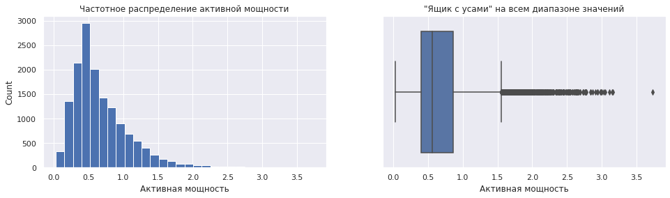
    


```python
round(np.percentile (data_arc['Активная мощность'].dropna(), 0), 2)
```


    0.03


```python
round(np.percentile (data_arc['Активная мощность'].dropna(), 100), 2)
```


    3.73


Исключим значение активной мощности большее 3.5, так как оно является явным супервыбросом. Таким образом, моделирование будем проводит в диапазоне [0, 3.5].


```python
sns.set(style="darkgrid")
plt.rcParams["figure.figsize"] = (16, 12)

plt.subplot(2, 2, 1)
data_arc['Реактивная мощность'].plot(kind='hist', bins=30)
plt.title("Частотное распределение реактивной мощности на всем диапазоне значений", fontsize=12)
plt.xlabel("Реактивная мощность")
plt.ylabel("Count")

plt.subplot(2, 2, 2)
sns.boxplot(data=data_arc, x='Реактивная мощность')
plt.title('"Ящик с усами" на всем диапазоне значений', fontsize=12)
plt.xlabel("Реактивная мощность")

plt.subplot(2, 2, 3)
data_arc['Реактивная мощность'].plot(kind='hist', bins=30, range = (-1, 3.5))
plt.title("Частотное распределение реактивной мощности на диапазоне [-1, 3.5]", fontsize=12)
plt.xlabel("Реактивная мощность")
plt.ylabel("Count")

plt.subplot(2, 2, 4)
sns.boxplot(data=data_arc, x='Реактивная мощность')
plt.title('"Ящик с усами" на диапазоне [-1, 3.5]', fontsize=12)
plt.xlabel("Реактивная мощность")
plt.xlim(-1, 3.5);
```


    
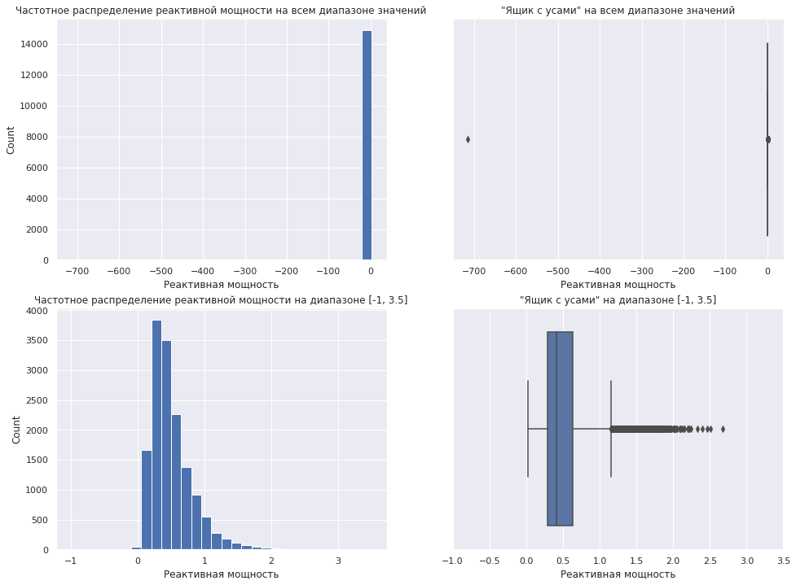
    


```python
round(np.percentile (data_arc['Реактивная мощность'].dropna(), 0), 2)
```


    -715.5


```python
round(np.percentile (data_arc['Реактивная мощность'].dropna(), 100), 2)
```


    2.68


С учетом рекомендаций бизнеса и технологического процесса, исключим значение реактивной мощности менее 0, так как оно является явно супервыбросом. Таким образом, моделирование будем проводит в диапазоне [0, 3.5].


```python
sns.set(style="darkgrid")
plt.rcParams["figure.figsize"] = (16,4)

plt.subplot(1, 2, 1)
data_temp['Температура'].plot(kind='hist', bins=30)
plt.title("Частотное распределение температуры", fontsize=12)
plt.xlabel("Температура")
plt.ylabel("Count")

plt.subplot(1, 2, 2)
sns.boxplot(data=data_temp, x='Температура')
plt.title('"Ящик с усами" на всем диапазоне значений', fontsize=12)
plt.xlabel("Температура");
```


    
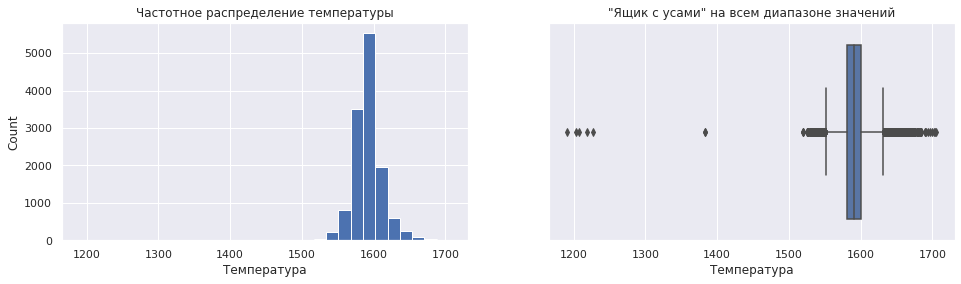
    


```python
round(np.percentile (data_temp['Температура'].dropna(), 0))
```


    1191


```python
round(np.percentile (data_temp['Температура'].dropna(), 100))
```


    1705


Исключим значение температуры менее 1400, так как оно является явным супервыбросом. Таким образом, моделирование будем проводит в диапазоне [1400, 1705].


```python
sns.set(style="darkgrid")
plt.rcParams["figure.figsize"] = (16,4)

plt.subplot(1, 2, 1)
data_wire['Wire 1'].plot(kind='hist', bins=30)
plt.title("Частотное распределение объема проволочных материалов", fontsize=12)
plt.xlabel("Объем проволочных материалов на этапе Wire 1")
plt.ylabel("Count")

plt.subplot(1, 2, 2)
sns.boxplot(data=data_wire, x='Wire 1')
plt.title('"Ящик с усами" на всем диапазоне значений', fontsize=12)
plt.xlabel("Объем проволочных материалов на этапе Wire 1");
```


    
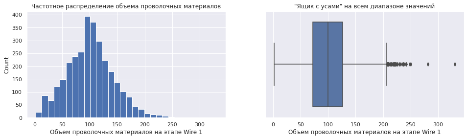
    


```python
round(np.percentile (data_wire['Wire 1'].dropna(), 0))
```


    2


```python
round(np.percentile (data_wire['Wire 1'].dropna(), 100))
```


    330


На этапе Wire 1 исключим значение объем проволочных материалов более 260, так как оно является явным супервыбросом. Таким образом, моделирование будем проводит в диапазоне [0, 260].


```python
sns.set(style="darkgrid")
plt.rcParams["figure.figsize"] = (16,4)

plt.subplot(1, 2, 1)
data_wire['Wire 2'].plot(kind='hist', bins=30)
plt.title("Частотное распределение объема проволочных материалов", fontsize=12)
plt.xlabel("Объем проволочных материалов на этапе Wire 2")
plt.ylabel("Count")

plt.subplot(1, 2, 2)
sns.boxplot(data=data_wire, x='Wire 2')
plt.title('"Ящик с усами" на всем диапазоне значений', fontsize=12)
plt.xlabel("Объем проволочных материалов на этапе Wire 2");
```


    
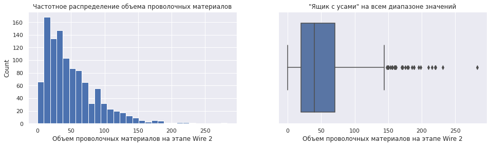
    


```python
round(np.percentile (data_wire['Wire 2'].dropna(), 0))
```


    0


```python
round(np.percentile (data_wire['Wire 2'].dropna(), 100))
```


    283


На этапе Wire 2 исключим значение объем проволочных материалов более 260, так как оно является явным супервыбросом. Таким образом, моделирование будем проводит в диапазоне [0, 260].


```python
sns.set(style="darkgrid")
plt.rcParams["figure.figsize"] = (16,4)

plt.subplot(1, 2, 1)
data_bulk['Bulk 14'].plot(kind='hist', bins=30)
plt.title("Частотное распределение объема сыпучих материалов", fontsize=12)
plt.xlabel("Объем сыпучих материалов на этапе Bulk 14")
plt.ylabel("Count")

plt.subplot(1, 2, 2)
sns.boxplot(data=data_bulk, x='Bulk 14')
plt.title('"Ящик с усами" на всем диапазоне значений', fontsize=12)
plt.xlabel("Объем сыпучих материалов на этапе Bulk 14");
```


    
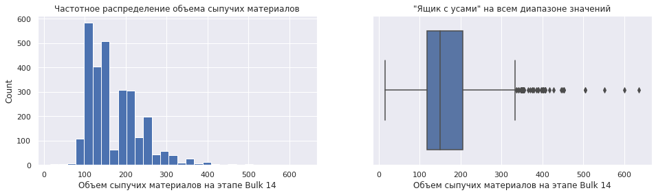
    


```python
round(np.percentile (data_bulk['Bulk 14'].dropna(), 0))
```


    16


```python
round(np.percentile (data_bulk['Bulk 14'].dropna(), 100))
```


    636


С учетом рекомендаций бизнеса и технологического процесса, пока оставим как есть. Таким образом, моделирование будем проводит в диапазоне [0, 700].


```python
sns.set(style="darkgrid")
plt.rcParams["figure.figsize"] = (16,4)

plt.subplot(1, 2, 1)
data_bulk['Bulk 12'].plot(kind='hist', bins=30)
plt.title("Частотное распределение объема сыпучих материалов", fontsize=12)
plt.xlabel("Объем сыпучих материалов на этапе Bulk 12")
plt.ylabel("Count")

plt.subplot(1, 2, 2)
sns.boxplot(data=data_bulk, x='Bulk 12')
plt.title('"Ящик с усами" на всем диапазоне значений', fontsize=12)
plt.xlabel("Объем сыпучих материалов на этапе Bulk 12");
```


    
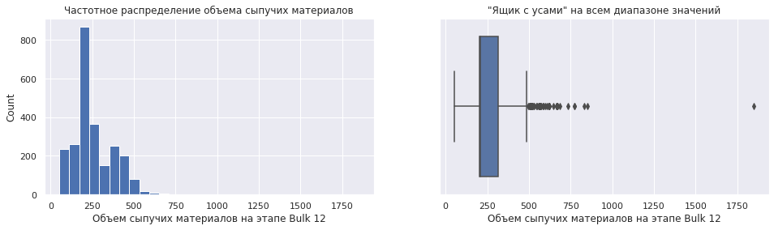
    


```python
np.percentile (data_bulk['Bulk 12'].dropna(), 0)
```


    53.0


```python
np.percentile (data_bulk['Bulk 12'].dropna(), 100)
```


    1849.0


На этапе Bulk 12 исключим значение объем сыпучих материалов более 1000, так как оно является явным супервыбросом. Таким образом, моделирование будем проводит в диапазоне [0, 1000].


```python
sns.set(style="darkgrid")
plt.rcParams["figure.figsize"] = (16,4)

plt.subplot(1, 2, 1)
data_bulk['Bulk 15'].plot(kind='hist', bins=30)
plt.title("Частотное распределение объема сыпучих материалов", fontsize=12)
plt.xlabel("Объем сыпучих материалов на этапе Bulk 15")
plt.ylabel("Count")

plt.subplot(1, 2, 2)
sns.boxplot(data=data_bulk, x='Bulk 15')
plt.title('"Ящик с усами" на всем диапазоне значений', fontsize=12)
plt.xlabel("Объем сыпучих материалов на этапе Bulk 15");
```


    
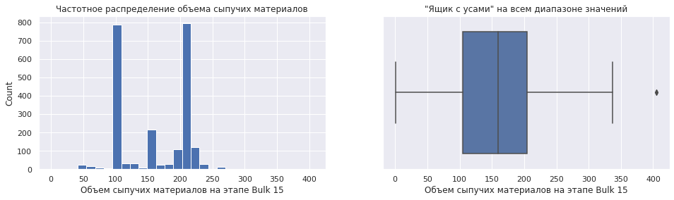
    


```python
np.percentile (data_bulk['Bulk 15'].dropna(), 0)
```


    1.0


```python
np.percentile (data_bulk['Bulk 15'].dropna(), 100)
```


    405.0


На этапе Bulk 15 исключим значение объем сыпучих материалов более 400, так как оно является явным супервыбросом. Таким образом, моделирование будем проводит в диапазоне [0, 400].


```python
sns.set(style="darkgrid")
plt.rcParams["figure.figsize"] = (16,4)

plt.subplot(1, 2, 1)
data_bulk['Bulk 3'].plot(kind='hist', bins=30)
plt.title("Частотное распределение объема сыпучих материалов", fontsize=12)
plt.xlabel("Объем сыпучих материалов на этапе Bulk 3")
plt.ylabel("Count")

plt.subplot(1, 2, 2)
sns.boxplot(data=data_bulk, x='Bulk 3')
plt.title('"Ящик с усами" на всем диапазоне значений', fontsize=12)
plt.xlabel("Объем сыпучих материалов на этапе Bulk 3");
```


    
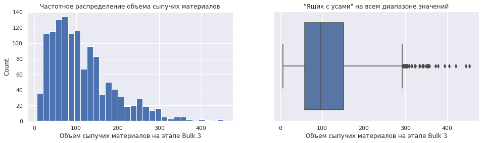
    


```python
round(np.percentile (data_bulk['Bulk 3'].dropna(), 0))
```


    6


```python
round(np.percentile (data_bulk['Bulk 3'].dropna(), 100))
```


    454


С учетом рекомендаций бизнеса и технологического процесса, пока оставим как есть. Таким образом, моделирование будем проводит в диапазоне [0, 500].


```python
sns.set(style="darkgrid")
plt.rcParams["figure.figsize"] = (16,4)

plt.subplot(1, 2, 1)
data_bulk['Bulk 4'].plot(kind='hist', bins=30)
plt.title("Частотное распределение объема сыпучих материалов", fontsize=12)
plt.xlabel("Объем сыпучих материалов на этапе Bulk 4")
plt.ylabel("Count")

plt.subplot(1, 2, 2)
sns.boxplot(data=data_bulk, x='Bulk 4')
plt.title('"Ящик с усами" на всем диапазоне значений', fontsize=12)
plt.xlabel("Объем сыпучих материалов на этапе Bulk 4");
```


    
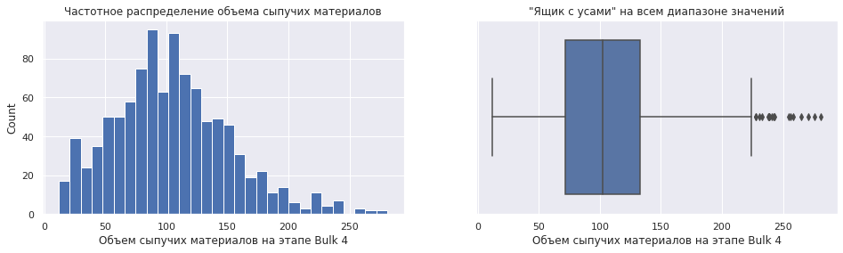
    


```python
round(np.percentile (data_bulk['Bulk 4'].dropna(), 0))
```


    12


```python
round(np.percentile (data_bulk['Bulk 4'].dropna(), 100))
```


    281


С учетом рекомендаций бизнеса и технологического процесса, пока оставим как есть. Таким образом, моделирование будем проводит в диапазоне [0, 300].

### Вывод

**Таким образом, для дальнейшего моделирования необходимо вынести следующие тезисы:**

1. так как при моделировании будет решаться задача регрессе, то для нее лучше вообще убрать столбцы с временем, так как модель может начать пытаться найти функциональную связь в датах и времени;
2. исходя из технологического процесса пропуски в таблицах `data_wire` и `data_bulk` обусловлены тем, что на каких-то итерациях процесса просто не добавляли либо проволочных материалов, либо сыпучих материалов, поэтому целесообразно их заполнить нулями;
3. в таблице `data_temp` в столбце "Температура" находится целевой признак и, поэтому мы будем вынуждены удалить строки с пропусками, так же стоит поступить с  супервыбросами, обнаруженными:
    - в таблице `data_arc` столбец «Реактивная мощность» при этом для моделирования возьмём диапазон значений [0, 3.5];
    - в таблице `data_temp` столбец «Температура», при этом для моделирования возьмём диапазон значений [1400, 1705] (целевой признак);
    - в таблице `data_wire` столбец «Wire 1», при этом для моделирования возьмём диапазон значений [0, 260];
    - в таблице `data_wire` столбец «Wire 2», при этом для моделирования возьмём диапазон значений [0, 260];
    - в таблице `data_bulk` столбец «Bulk 12», при этом для моделирования возьмём диапазон значений [0, 1000];
    - в таблице `data_bulk` столбец «Bulk 15», при этом для моделирования возьмём диапазон значений [0, 400].

# План дальнейшего исследования

1. Реализовать тезисы из предыдущего раздела.
2. Объединить все таблицы кроме `data_wire_time` и `data_bulk_time`.
3. Проверка на мультиколлинеарность.
4. Разбить данные на тренировочную и тестовую выборки в соотношении 75:25.
5. Приступить к поиску лучшей модели и подбору гиперпараметров.
6. Проверить качество модели на тестовой выборке.
7. При неудовлетворительных значениях метрики качества повторить пункты 1-5.
8. При удовлетворительных значениях метрики качества оформить выводы.


## Подготовка данных

#### data_wire


```python
data_wire.head()
```


  <div id="df-a8b08f5a-9a7a-4460-aa1c-d2eb81affa00">
    <div class="colab-df-container">
      <div>
<style scoped>
    .dataframe tbody tr th:only-of-type {
        vertical-align: middle;
    }

    .dataframe tbody tr th {
        vertical-align: top;
    }

    .dataframe thead th {
        text-align: right;
    }
</style>
<table border="1" class="dataframe">
  <thead>
    <tr style="text-align: right;">
      <th></th>
      <th>key</th>
      <th>Wire 1</th>
      <th>Wire 2</th>
      <th>Wire 3</th>
      <th>Wire 4</th>
      <th>Wire 5</th>
      <th>Wire 6</th>
      <th>Wire 7</th>
      <th>Wire 8</th>
      <th>Wire 9</th>
    </tr>
  </thead>
  <tbody>
    <tr>
      <th>0</th>
      <td>1</td>
      <td>60.059998</td>
      <td>NaN</td>
      <td>NaN</td>
      <td>NaN</td>
      <td>NaN</td>
      <td>NaN</td>
      <td>NaN</td>
      <td>NaN</td>
      <td>NaN</td>
    </tr>
    <tr>
      <th>1</th>
      <td>2</td>
      <td>96.052315</td>
      <td>NaN</td>
      <td>NaN</td>
      <td>NaN</td>
      <td>NaN</td>
      <td>NaN</td>
      <td>NaN</td>
      <td>NaN</td>
      <td>NaN</td>
    </tr>
    <tr>
      <th>2</th>
      <td>3</td>
      <td>91.160157</td>
      <td>NaN</td>
      <td>NaN</td>
      <td>NaN</td>
      <td>NaN</td>
      <td>NaN</td>
      <td>NaN</td>
      <td>NaN</td>
      <td>NaN</td>
    </tr>
    <tr>
      <th>3</th>
      <td>4</td>
      <td>89.063515</td>
      <td>NaN</td>
      <td>NaN</td>
      <td>NaN</td>
      <td>NaN</td>
      <td>NaN</td>
      <td>NaN</td>
      <td>NaN</td>
      <td>NaN</td>
    </tr>
    <tr>
      <th>4</th>
      <td>5</td>
      <td>89.238236</td>
      <td>9.11456</td>
      <td>NaN</td>
      <td>NaN</td>
      <td>NaN</td>
      <td>NaN</td>
      <td>NaN</td>
      <td>NaN</td>
      <td>NaN</td>
    </tr>
  </tbody>
</table>
</div>
      <button class="colab-df-convert" onclick="convertToInteractive('df-a8b08f5a-9a7a-4460-aa1c-d2eb81affa00')"
              title="Convert this dataframe to an interactive table."
              style="display:none;">

  <svg xmlns="http://www.w3.org/2000/svg" height="24px"viewBox="0 0 24 24"
       width="24px">
    <path d="M0 0h24v24H0V0z" fill="none"/>
    <path d="M18.56 5.44l.94 2.06.94-2.06 2.06-.94-2.06-.94-.94-2.06-.94 2.06-2.06.94zm-11 1L8.5 8.5l.94-2.06 2.06-.94-2.06-.94L8.5 2.5l-.94 2.06-2.06.94zm10 10l.94 2.06.94-2.06 2.06-.94-2.06-.94-.94-2.06-.94 2.06-2.06.94z"/><path d="M17.41 7.96l-1.37-1.37c-.4-.4-.92-.59-1.43-.59-.52 0-1.04.2-1.43.59L10.3 9.45l-7.72 7.72c-.78.78-.78 2.05 0 2.83L4 21.41c.39.39.9.59 1.41.59.51 0 1.02-.2 1.41-.59l7.78-7.78 2.81-2.81c.8-.78.8-2.07 0-2.86zM5.41 20L4 18.59l7.72-7.72 1.47 1.35L5.41 20z"/>
  </svg>
      </button>

  <style>
    .colab-df-container {
      display:flex;
      flex-wrap:wrap;
      gap: 12px;
    }

    .colab-df-convert {
      background-color: #E8F0FE;
      border: none;
      border-radius: 50%;
      cursor: pointer;
      display: none;
      fill: #1967D2;
      height: 32px;
      padding: 0 0 0 0;
      width: 32px;
    }

    .colab-df-convert:hover {
      background-color: #E2EBFA;
      box-shadow: 0px 1px 2px rgba(60, 64, 67, 0.3), 0px 1px 3px 1px rgba(60, 64, 67, 0.15);
      fill: #174EA6;
    }

    [theme=dark] .colab-df-convert {
      background-color: #3B4455;
      fill: #D2E3FC;
    }

    [theme=dark] .colab-df-convert:hover {
      background-color: #434B5C;
      box-shadow: 0px 1px 3px 1px rgba(0, 0, 0, 0.15);
      filter: drop-shadow(0px 1px 2px rgba(0, 0, 0, 0.3));
      fill: #FFFFFF;
    }
  </style>

      <script>
        const buttonEl =
          document.querySelector('#df-a8b08f5a-9a7a-4460-aa1c-d2eb81affa00 button.colab-df-convert');
        buttonEl.style.display =
          google.colab.kernel.accessAllowed ? 'block' : 'none';

        async function convertToInteractive(key) {
          const element = document.querySelector('#df-a8b08f5a-9a7a-4460-aa1c-d2eb81affa00');
          const dataTable =
            await google.colab.kernel.invokeFunction('convertToInteractive',
                                                     [key], {});
          if (!dataTable) return;

          const docLinkHtml = 'Like what you see? Visit the ' +
            '<a target="_blank" href=https://colab.research.google.com/notebooks/data_table.ipynb>data table notebook</a>'
            + ' to learn more about interactive tables.';
          element.innerHTML = '';
          dataTable['output_type'] = 'display_data';
          await google.colab.output.renderOutput(dataTable, element);
          const docLink = document.createElement('div');
          docLink.innerHTML = docLinkHtml;
          element.appendChild(docLink);
        }
      </script>
    </div>
  </div>


```python
data_wire = data_wire.fillna(0)
```


```python
data_wire
```


  <div id="df-22f42c26-d52f-48e5-8a03-4f433a51b58b">
    <div class="colab-df-container">
      <div>
<style scoped>
    .dataframe tbody tr th:only-of-type {
        vertical-align: middle;
    }

    .dataframe tbody tr th {
        vertical-align: top;
    }

    .dataframe thead th {
        text-align: right;
    }
</style>
<table border="1" class="dataframe">
  <thead>
    <tr style="text-align: right;">
      <th></th>
      <th>key</th>
      <th>Wire 1</th>
      <th>Wire 2</th>
      <th>Wire 3</th>
      <th>Wire 4</th>
      <th>Wire 5</th>
      <th>Wire 6</th>
      <th>Wire 7</th>
      <th>Wire 8</th>
      <th>Wire 9</th>
    </tr>
  </thead>
  <tbody>
    <tr>
      <th>0</th>
      <td>1</td>
      <td>60.059998</td>
      <td>0.00000</td>
      <td>0.0</td>
      <td>0.0</td>
      <td>0.0</td>
      <td>0.0</td>
      <td>0.0</td>
      <td>0.0</td>
      <td>0.0</td>
    </tr>
    <tr>
      <th>1</th>
      <td>2</td>
      <td>96.052315</td>
      <td>0.00000</td>
      <td>0.0</td>
      <td>0.0</td>
      <td>0.0</td>
      <td>0.0</td>
      <td>0.0</td>
      <td>0.0</td>
      <td>0.0</td>
    </tr>
    <tr>
      <th>2</th>
      <td>3</td>
      <td>91.160157</td>
      <td>0.00000</td>
      <td>0.0</td>
      <td>0.0</td>
      <td>0.0</td>
      <td>0.0</td>
      <td>0.0</td>
      <td>0.0</td>
      <td>0.0</td>
    </tr>
    <tr>
      <th>3</th>
      <td>4</td>
      <td>89.063515</td>
      <td>0.00000</td>
      <td>0.0</td>
      <td>0.0</td>
      <td>0.0</td>
      <td>0.0</td>
      <td>0.0</td>
      <td>0.0</td>
      <td>0.0</td>
    </tr>
    <tr>
      <th>4</th>
      <td>5</td>
      <td>89.238236</td>
      <td>9.11456</td>
      <td>0.0</td>
      <td>0.0</td>
      <td>0.0</td>
      <td>0.0</td>
      <td>0.0</td>
      <td>0.0</td>
      <td>0.0</td>
    </tr>
    <tr>
      <th>...</th>
      <td>...</td>
      <td>...</td>
      <td>...</td>
      <td>...</td>
      <td>...</td>
      <td>...</td>
      <td>...</td>
      <td>...</td>
      <td>...</td>
      <td>...</td>
    </tr>
    <tr>
      <th>3076</th>
      <td>3237</td>
      <td>38.088959</td>
      <td>0.00000</td>
      <td>0.0</td>
      <td>0.0</td>
      <td>0.0</td>
      <td>0.0</td>
      <td>0.0</td>
      <td>0.0</td>
      <td>0.0</td>
    </tr>
    <tr>
      <th>3077</th>
      <td>3238</td>
      <td>56.128799</td>
      <td>0.00000</td>
      <td>0.0</td>
      <td>0.0</td>
      <td>0.0</td>
      <td>0.0</td>
      <td>0.0</td>
      <td>0.0</td>
      <td>0.0</td>
    </tr>
    <tr>
      <th>3078</th>
      <td>3239</td>
      <td>143.357761</td>
      <td>0.00000</td>
      <td>0.0</td>
      <td>0.0</td>
      <td>0.0</td>
      <td>0.0</td>
      <td>0.0</td>
      <td>0.0</td>
      <td>0.0</td>
    </tr>
    <tr>
      <th>3079</th>
      <td>3240</td>
      <td>34.070400</td>
      <td>0.00000</td>
      <td>0.0</td>
      <td>0.0</td>
      <td>0.0</td>
      <td>0.0</td>
      <td>0.0</td>
      <td>0.0</td>
      <td>0.0</td>
    </tr>
    <tr>
      <th>3080</th>
      <td>3241</td>
      <td>63.117595</td>
      <td>0.00000</td>
      <td>0.0</td>
      <td>0.0</td>
      <td>0.0</td>
      <td>0.0</td>
      <td>0.0</td>
      <td>0.0</td>
      <td>0.0</td>
    </tr>
  </tbody>
</table>
<p>3081 rows × 10 columns</p>
</div>
      <button class="colab-df-convert" onclick="convertToInteractive('df-22f42c26-d52f-48e5-8a03-4f433a51b58b')"
              title="Convert this dataframe to an interactive table."
              style="display:none;">

  <svg xmlns="http://www.w3.org/2000/svg" height="24px"viewBox="0 0 24 24"
       width="24px">
    <path d="M0 0h24v24H0V0z" fill="none"/>
    <path d="M18.56 5.44l.94 2.06.94-2.06 2.06-.94-2.06-.94-.94-2.06-.94 2.06-2.06.94zm-11 1L8.5 8.5l.94-2.06 2.06-.94-2.06-.94L8.5 2.5l-.94 2.06-2.06.94zm10 10l.94 2.06.94-2.06 2.06-.94-2.06-.94-.94-2.06-.94 2.06-2.06.94z"/><path d="M17.41 7.96l-1.37-1.37c-.4-.4-.92-.59-1.43-.59-.52 0-1.04.2-1.43.59L10.3 9.45l-7.72 7.72c-.78.78-.78 2.05 0 2.83L4 21.41c.39.39.9.59 1.41.59.51 0 1.02-.2 1.41-.59l7.78-7.78 2.81-2.81c.8-.78.8-2.07 0-2.86zM5.41 20L4 18.59l7.72-7.72 1.47 1.35L5.41 20z"/>
  </svg>
      </button>

  <style>
    .colab-df-container {
      display:flex;
      flex-wrap:wrap;
      gap: 12px;
    }

    .colab-df-convert {
      background-color: #E8F0FE;
      border: none;
      border-radius: 50%;
      cursor: pointer;
      display: none;
      fill: #1967D2;
      height: 32px;
      padding: 0 0 0 0;
      width: 32px;
    }

    .colab-df-convert:hover {
      background-color: #E2EBFA;
      box-shadow: 0px 1px 2px rgba(60, 64, 67, 0.3), 0px 1px 3px 1px rgba(60, 64, 67, 0.15);
      fill: #174EA6;
    }

    [theme=dark] .colab-df-convert {
      background-color: #3B4455;
      fill: #D2E3FC;
    }

    [theme=dark] .colab-df-convert:hover {
      background-color: #434B5C;
      box-shadow: 0px 1px 3px 1px rgba(0, 0, 0, 0.15);
      filter: drop-shadow(0px 1px 2px rgba(0, 0, 0, 0.3));
      fill: #FFFFFF;
    }
  </style>

      <script>
        const buttonEl =
          document.querySelector('#df-22f42c26-d52f-48e5-8a03-4f433a51b58b button.colab-df-convert');
        buttonEl.style.display =
          google.colab.kernel.accessAllowed ? 'block' : 'none';

        async function convertToInteractive(key) {
          const element = document.querySelector('#df-22f42c26-d52f-48e5-8a03-4f433a51b58b');
          const dataTable =
            await google.colab.kernel.invokeFunction('convertToInteractive',
                                                     [key], {});
          if (!dataTable) return;

          const docLinkHtml = 'Like what you see? Visit the ' +
            '<a target="_blank" href=https://colab.research.google.com/notebooks/data_table.ipynb>data table notebook</a>'
            + ' to learn more about interactive tables.';
          element.innerHTML = '';
          dataTable['output_type'] = 'display_data';
          await google.colab.output.renderOutput(dataTable, element);
          const docLink = document.createElement('div');
          docLink.innerHTML = docLinkHtml;
          element.appendChild(docLink);
        }
      </script>
    </div>
  </div>


```python
data_wire = data_wire[(data_wire['Wire 1'] <= 260) &
                      (data_wire['Wire 2'] <= 260)]
```


```python
data_wire
```


  <div id="df-546da99e-e2b7-4b3a-9cb6-03729ca9b8e9">
    <div class="colab-df-container">
      <div>
<style scoped>
    .dataframe tbody tr th:only-of-type {
        vertical-align: middle;
    }

    .dataframe tbody tr th {
        vertical-align: top;
    }

    .dataframe thead th {
        text-align: right;
    }
</style>
<table border="1" class="dataframe">
  <thead>
    <tr style="text-align: right;">
      <th></th>
      <th>key</th>
      <th>Wire 1</th>
      <th>Wire 2</th>
      <th>Wire 3</th>
      <th>Wire 4</th>
      <th>Wire 5</th>
      <th>Wire 6</th>
      <th>Wire 7</th>
      <th>Wire 8</th>
      <th>Wire 9</th>
    </tr>
  </thead>
  <tbody>
    <tr>
      <th>0</th>
      <td>1</td>
      <td>60.059998</td>
      <td>0.00000</td>
      <td>0.0</td>
      <td>0.0</td>
      <td>0.0</td>
      <td>0.0</td>
      <td>0.0</td>
      <td>0.0</td>
      <td>0.0</td>
    </tr>
    <tr>
      <th>1</th>
      <td>2</td>
      <td>96.052315</td>
      <td>0.00000</td>
      <td>0.0</td>
      <td>0.0</td>
      <td>0.0</td>
      <td>0.0</td>
      <td>0.0</td>
      <td>0.0</td>
      <td>0.0</td>
    </tr>
    <tr>
      <th>2</th>
      <td>3</td>
      <td>91.160157</td>
      <td>0.00000</td>
      <td>0.0</td>
      <td>0.0</td>
      <td>0.0</td>
      <td>0.0</td>
      <td>0.0</td>
      <td>0.0</td>
      <td>0.0</td>
    </tr>
    <tr>
      <th>3</th>
      <td>4</td>
      <td>89.063515</td>
      <td>0.00000</td>
      <td>0.0</td>
      <td>0.0</td>
      <td>0.0</td>
      <td>0.0</td>
      <td>0.0</td>
      <td>0.0</td>
      <td>0.0</td>
    </tr>
    <tr>
      <th>4</th>
      <td>5</td>
      <td>89.238236</td>
      <td>9.11456</td>
      <td>0.0</td>
      <td>0.0</td>
      <td>0.0</td>
      <td>0.0</td>
      <td>0.0</td>
      <td>0.0</td>
      <td>0.0</td>
    </tr>
    <tr>
      <th>...</th>
      <td>...</td>
      <td>...</td>
      <td>...</td>
      <td>...</td>
      <td>...</td>
      <td>...</td>
      <td>...</td>
      <td>...</td>
      <td>...</td>
      <td>...</td>
    </tr>
    <tr>
      <th>3076</th>
      <td>3237</td>
      <td>38.088959</td>
      <td>0.00000</td>
      <td>0.0</td>
      <td>0.0</td>
      <td>0.0</td>
      <td>0.0</td>
      <td>0.0</td>
      <td>0.0</td>
      <td>0.0</td>
    </tr>
    <tr>
      <th>3077</th>
      <td>3238</td>
      <td>56.128799</td>
      <td>0.00000</td>
      <td>0.0</td>
      <td>0.0</td>
      <td>0.0</td>
      <td>0.0</td>
      <td>0.0</td>
      <td>0.0</td>
      <td>0.0</td>
    </tr>
    <tr>
      <th>3078</th>
      <td>3239</td>
      <td>143.357761</td>
      <td>0.00000</td>
      <td>0.0</td>
      <td>0.0</td>
      <td>0.0</td>
      <td>0.0</td>
      <td>0.0</td>
      <td>0.0</td>
      <td>0.0</td>
    </tr>
    <tr>
      <th>3079</th>
      <td>3240</td>
      <td>34.070400</td>
      <td>0.00000</td>
      <td>0.0</td>
      <td>0.0</td>
      <td>0.0</td>
      <td>0.0</td>
      <td>0.0</td>
      <td>0.0</td>
      <td>0.0</td>
    </tr>
    <tr>
      <th>3080</th>
      <td>3241</td>
      <td>63.117595</td>
      <td>0.00000</td>
      <td>0.0</td>
      <td>0.0</td>
      <td>0.0</td>
      <td>0.0</td>
      <td>0.0</td>
      <td>0.0</td>
      <td>0.0</td>
    </tr>
  </tbody>
</table>
<p>3078 rows × 10 columns</p>
</div>
      <button class="colab-df-convert" onclick="convertToInteractive('df-546da99e-e2b7-4b3a-9cb6-03729ca9b8e9')"
              title="Convert this dataframe to an interactive table."
              style="display:none;">

  <svg xmlns="http://www.w3.org/2000/svg" height="24px"viewBox="0 0 24 24"
       width="24px">
    <path d="M0 0h24v24H0V0z" fill="none"/>
    <path d="M18.56 5.44l.94 2.06.94-2.06 2.06-.94-2.06-.94-.94-2.06-.94 2.06-2.06.94zm-11 1L8.5 8.5l.94-2.06 2.06-.94-2.06-.94L8.5 2.5l-.94 2.06-2.06.94zm10 10l.94 2.06.94-2.06 2.06-.94-2.06-.94-.94-2.06-.94 2.06-2.06.94z"/><path d="M17.41 7.96l-1.37-1.37c-.4-.4-.92-.59-1.43-.59-.52 0-1.04.2-1.43.59L10.3 9.45l-7.72 7.72c-.78.78-.78 2.05 0 2.83L4 21.41c.39.39.9.59 1.41.59.51 0 1.02-.2 1.41-.59l7.78-7.78 2.81-2.81c.8-.78.8-2.07 0-2.86zM5.41 20L4 18.59l7.72-7.72 1.47 1.35L5.41 20z"/>
  </svg>
      </button>

  <style>
    .colab-df-container {
      display:flex;
      flex-wrap:wrap;
      gap: 12px;
    }

    .colab-df-convert {
      background-color: #E8F0FE;
      border: none;
      border-radius: 50%;
      cursor: pointer;
      display: none;
      fill: #1967D2;
      height: 32px;
      padding: 0 0 0 0;
      width: 32px;
    }

    .colab-df-convert:hover {
      background-color: #E2EBFA;
      box-shadow: 0px 1px 2px rgba(60, 64, 67, 0.3), 0px 1px 3px 1px rgba(60, 64, 67, 0.15);
      fill: #174EA6;
    }

    [theme=dark] .colab-df-convert {
      background-color: #3B4455;
      fill: #D2E3FC;
    }

    [theme=dark] .colab-df-convert:hover {
      background-color: #434B5C;
      box-shadow: 0px 1px 3px 1px rgba(0, 0, 0, 0.15);
      filter: drop-shadow(0px 1px 2px rgba(0, 0, 0, 0.3));
      fill: #FFFFFF;
    }
  </style>

      <script>
        const buttonEl =
          document.querySelector('#df-546da99e-e2b7-4b3a-9cb6-03729ca9b8e9 button.colab-df-convert');
        buttonEl.style.display =
          google.colab.kernel.accessAllowed ? 'block' : 'none';

        async function convertToInteractive(key) {
          const element = document.querySelector('#df-546da99e-e2b7-4b3a-9cb6-03729ca9b8e9');
          const dataTable =
            await google.colab.kernel.invokeFunction('convertToInteractive',
                                                     [key], {});
          if (!dataTable) return;

          const docLinkHtml = 'Like what you see? Visit the ' +
            '<a target="_blank" href=https://colab.research.google.com/notebooks/data_table.ipynb>data table notebook</a>'
            + ' to learn more about interactive tables.';
          element.innerHTML = '';
          dataTable['output_type'] = 'display_data';
          await google.colab.output.renderOutput(dataTable, element);
          const docLink = document.createElement('div');
          docLink.innerHTML = docLinkHtml;
          element.appendChild(docLink);
        }
      </script>
    </div>
  </div>


```python
data_wire = data_wire[['key', 'Wire 1', 'Wire 2']]
```


```python
data_wire
```


  <div id="df-d90a317a-4c09-42e6-9ea1-bd2d51090e08">
    <div class="colab-df-container">
      <div>
<style scoped>
    .dataframe tbody tr th:only-of-type {
        vertical-align: middle;
    }

    .dataframe tbody tr th {
        vertical-align: top;
    }

    .dataframe thead th {
        text-align: right;
    }
</style>
<table border="1" class="dataframe">
  <thead>
    <tr style="text-align: right;">
      <th></th>
      <th>key</th>
      <th>Wire 1</th>
      <th>Wire 2</th>
    </tr>
  </thead>
  <tbody>
    <tr>
      <th>0</th>
      <td>1</td>
      <td>60.059998</td>
      <td>0.00000</td>
    </tr>
    <tr>
      <th>1</th>
      <td>2</td>
      <td>96.052315</td>
      <td>0.00000</td>
    </tr>
    <tr>
      <th>2</th>
      <td>3</td>
      <td>91.160157</td>
      <td>0.00000</td>
    </tr>
    <tr>
      <th>3</th>
      <td>4</td>
      <td>89.063515</td>
      <td>0.00000</td>
    </tr>
    <tr>
      <th>4</th>
      <td>5</td>
      <td>89.238236</td>
      <td>9.11456</td>
    </tr>
    <tr>
      <th>...</th>
      <td>...</td>
      <td>...</td>
      <td>...</td>
    </tr>
    <tr>
      <th>3076</th>
      <td>3237</td>
      <td>38.088959</td>
      <td>0.00000</td>
    </tr>
    <tr>
      <th>3077</th>
      <td>3238</td>
      <td>56.128799</td>
      <td>0.00000</td>
    </tr>
    <tr>
      <th>3078</th>
      <td>3239</td>
      <td>143.357761</td>
      <td>0.00000</td>
    </tr>
    <tr>
      <th>3079</th>
      <td>3240</td>
      <td>34.070400</td>
      <td>0.00000</td>
    </tr>
    <tr>
      <th>3080</th>
      <td>3241</td>
      <td>63.117595</td>
      <td>0.00000</td>
    </tr>
  </tbody>
</table>
<p>3078 rows × 3 columns</p>
</div>
      <button class="colab-df-convert" onclick="convertToInteractive('df-d90a317a-4c09-42e6-9ea1-bd2d51090e08')"
              title="Convert this dataframe to an interactive table."
              style="display:none;">

  <svg xmlns="http://www.w3.org/2000/svg" height="24px"viewBox="0 0 24 24"
       width="24px">
    <path d="M0 0h24v24H0V0z" fill="none"/>
    <path d="M18.56 5.44l.94 2.06.94-2.06 2.06-.94-2.06-.94-.94-2.06-.94 2.06-2.06.94zm-11 1L8.5 8.5l.94-2.06 2.06-.94-2.06-.94L8.5 2.5l-.94 2.06-2.06.94zm10 10l.94 2.06.94-2.06 2.06-.94-2.06-.94-.94-2.06-.94 2.06-2.06.94z"/><path d="M17.41 7.96l-1.37-1.37c-.4-.4-.92-.59-1.43-.59-.52 0-1.04.2-1.43.59L10.3 9.45l-7.72 7.72c-.78.78-.78 2.05 0 2.83L4 21.41c.39.39.9.59 1.41.59.51 0 1.02-.2 1.41-.59l7.78-7.78 2.81-2.81c.8-.78.8-2.07 0-2.86zM5.41 20L4 18.59l7.72-7.72 1.47 1.35L5.41 20z"/>
  </svg>
      </button>

  <style>
    .colab-df-container {
      display:flex;
      flex-wrap:wrap;
      gap: 12px;
    }

    .colab-df-convert {
      background-color: #E8F0FE;
      border: none;
      border-radius: 50%;
      cursor: pointer;
      display: none;
      fill: #1967D2;
      height: 32px;
      padding: 0 0 0 0;
      width: 32px;
    }

    .colab-df-convert:hover {
      background-color: #E2EBFA;
      box-shadow: 0px 1px 2px rgba(60, 64, 67, 0.3), 0px 1px 3px 1px rgba(60, 64, 67, 0.15);
      fill: #174EA6;
    }

    [theme=dark] .colab-df-convert {
      background-color: #3B4455;
      fill: #D2E3FC;
    }

    [theme=dark] .colab-df-convert:hover {
      background-color: #434B5C;
      box-shadow: 0px 1px 3px 1px rgba(0, 0, 0, 0.15);
      filter: drop-shadow(0px 1px 2px rgba(0, 0, 0, 0.3));
      fill: #FFFFFF;
    }
  </style>

      <script>
        const buttonEl =
          document.querySelector('#df-d90a317a-4c09-42e6-9ea1-bd2d51090e08 button.colab-df-convert');
        buttonEl.style.display =
          google.colab.kernel.accessAllowed ? 'block' : 'none';

        async function convertToInteractive(key) {
          const element = document.querySelector('#df-d90a317a-4c09-42e6-9ea1-bd2d51090e08');
          const dataTable =
            await google.colab.kernel.invokeFunction('convertToInteractive',
                                                     [key], {});
          if (!dataTable) return;

          const docLinkHtml = 'Like what you see? Visit the ' +
            '<a target="_blank" href=https://colab.research.google.com/notebooks/data_table.ipynb>data table notebook</a>'
            + ' to learn more about interactive tables.';
          element.innerHTML = '';
          dataTable['output_type'] = 'display_data';
          await google.colab.output.renderOutput(dataTable, element);
          const docLink = document.createElement('div');
          docLink.innerHTML = docLinkHtml;
          element.appendChild(docLink);
        }
      </script>
    </div>
  </div>


Столбцы Wire 3 - Wire 7 удалим как не информативные, они содержат от 97.63% до 99.97% пропусков.

ПРОПУСКИ В ДАННЫХ О ПРОВОЛОЧНЫХ МАТЕРИАЛАХ (ОБЪЁМ), %
    
|Столбец|Процент пропусков|
|:------|----------------:|
|key|        0.00|
|Wire 1|     0.84|
|Wire 2|    64.98|
|Wire 6|    97.63|
|Wire 3|    97.96|
|Wire 9|    99.06|
|Wire 8|    99.38|
|Wire 4|    99.55|
|Wire 7|    99.64|
|Wire 5|    99.97|

#### data_bulk


```python
data_bulk.head()
```


  <div id="df-01ef2078-b9e9-4345-8ab5-5bdca1447f76">
    <div class="colab-df-container">
      <div>
<style scoped>
    .dataframe tbody tr th:only-of-type {
        vertical-align: middle;
    }

    .dataframe tbody tr th {
        vertical-align: top;
    }

    .dataframe thead th {
        text-align: right;
    }
</style>
<table border="1" class="dataframe">
  <thead>
    <tr style="text-align: right;">
      <th></th>
      <th>key</th>
      <th>Bulk 1</th>
      <th>Bulk 2</th>
      <th>Bulk 3</th>
      <th>Bulk 4</th>
      <th>Bulk 5</th>
      <th>Bulk 6</th>
      <th>Bulk 7</th>
      <th>Bulk 8</th>
      <th>Bulk 9</th>
      <th>Bulk 10</th>
      <th>Bulk 11</th>
      <th>Bulk 12</th>
      <th>Bulk 13</th>
      <th>Bulk 14</th>
      <th>Bulk 15</th>
    </tr>
  </thead>
  <tbody>
    <tr>
      <th>0</th>
      <td>1</td>
      <td>NaN</td>
      <td>NaN</td>
      <td>NaN</td>
      <td>43.0</td>
      <td>NaN</td>
      <td>NaN</td>
      <td>NaN</td>
      <td>NaN</td>
      <td>NaN</td>
      <td>NaN</td>
      <td>NaN</td>
      <td>206.0</td>
      <td>NaN</td>
      <td>150.0</td>
      <td>154.0</td>
    </tr>
    <tr>
      <th>1</th>
      <td>2</td>
      <td>NaN</td>
      <td>NaN</td>
      <td>NaN</td>
      <td>73.0</td>
      <td>NaN</td>
      <td>NaN</td>
      <td>NaN</td>
      <td>NaN</td>
      <td>NaN</td>
      <td>NaN</td>
      <td>NaN</td>
      <td>206.0</td>
      <td>NaN</td>
      <td>149.0</td>
      <td>154.0</td>
    </tr>
    <tr>
      <th>2</th>
      <td>3</td>
      <td>NaN</td>
      <td>NaN</td>
      <td>NaN</td>
      <td>34.0</td>
      <td>NaN</td>
      <td>NaN</td>
      <td>NaN</td>
      <td>NaN</td>
      <td>NaN</td>
      <td>NaN</td>
      <td>NaN</td>
      <td>205.0</td>
      <td>NaN</td>
      <td>152.0</td>
      <td>153.0</td>
    </tr>
    <tr>
      <th>3</th>
      <td>4</td>
      <td>NaN</td>
      <td>NaN</td>
      <td>NaN</td>
      <td>81.0</td>
      <td>NaN</td>
      <td>NaN</td>
      <td>NaN</td>
      <td>NaN</td>
      <td>NaN</td>
      <td>NaN</td>
      <td>NaN</td>
      <td>207.0</td>
      <td>NaN</td>
      <td>153.0</td>
      <td>154.0</td>
    </tr>
    <tr>
      <th>4</th>
      <td>5</td>
      <td>NaN</td>
      <td>NaN</td>
      <td>NaN</td>
      <td>78.0</td>
      <td>NaN</td>
      <td>NaN</td>
      <td>NaN</td>
      <td>NaN</td>
      <td>NaN</td>
      <td>NaN</td>
      <td>NaN</td>
      <td>203.0</td>
      <td>NaN</td>
      <td>151.0</td>
      <td>152.0</td>
    </tr>
  </tbody>
</table>
</div>
      <button class="colab-df-convert" onclick="convertToInteractive('df-01ef2078-b9e9-4345-8ab5-5bdca1447f76')"
              title="Convert this dataframe to an interactive table."
              style="display:none;">

  <svg xmlns="http://www.w3.org/2000/svg" height="24px"viewBox="0 0 24 24"
       width="24px">
    <path d="M0 0h24v24H0V0z" fill="none"/>
    <path d="M18.56 5.44l.94 2.06.94-2.06 2.06-.94-2.06-.94-.94-2.06-.94 2.06-2.06.94zm-11 1L8.5 8.5l.94-2.06 2.06-.94-2.06-.94L8.5 2.5l-.94 2.06-2.06.94zm10 10l.94 2.06.94-2.06 2.06-.94-2.06-.94-.94-2.06-.94 2.06-2.06.94z"/><path d="M17.41 7.96l-1.37-1.37c-.4-.4-.92-.59-1.43-.59-.52 0-1.04.2-1.43.59L10.3 9.45l-7.72 7.72c-.78.78-.78 2.05 0 2.83L4 21.41c.39.39.9.59 1.41.59.51 0 1.02-.2 1.41-.59l7.78-7.78 2.81-2.81c.8-.78.8-2.07 0-2.86zM5.41 20L4 18.59l7.72-7.72 1.47 1.35L5.41 20z"/>
  </svg>
      </button>

  <style>
    .colab-df-container {
      display:flex;
      flex-wrap:wrap;
      gap: 12px;
    }

    .colab-df-convert {
      background-color: #E8F0FE;
      border: none;
      border-radius: 50%;
      cursor: pointer;
      display: none;
      fill: #1967D2;
      height: 32px;
      padding: 0 0 0 0;
      width: 32px;
    }

    .colab-df-convert:hover {
      background-color: #E2EBFA;
      box-shadow: 0px 1px 2px rgba(60, 64, 67, 0.3), 0px 1px 3px 1px rgba(60, 64, 67, 0.15);
      fill: #174EA6;
    }

    [theme=dark] .colab-df-convert {
      background-color: #3B4455;
      fill: #D2E3FC;
    }

    [theme=dark] .colab-df-convert:hover {
      background-color: #434B5C;
      box-shadow: 0px 1px 3px 1px rgba(0, 0, 0, 0.15);
      filter: drop-shadow(0px 1px 2px rgba(0, 0, 0, 0.3));
      fill: #FFFFFF;
    }
  </style>

      <script>
        const buttonEl =
          document.querySelector('#df-01ef2078-b9e9-4345-8ab5-5bdca1447f76 button.colab-df-convert');
        buttonEl.style.display =
          google.colab.kernel.accessAllowed ? 'block' : 'none';

        async function convertToInteractive(key) {
          const element = document.querySelector('#df-01ef2078-b9e9-4345-8ab5-5bdca1447f76');
          const dataTable =
            await google.colab.kernel.invokeFunction('convertToInteractive',
                                                     [key], {});
          if (!dataTable) return;

          const docLinkHtml = 'Like what you see? Visit the ' +
            '<a target="_blank" href=https://colab.research.google.com/notebooks/data_table.ipynb>data table notebook</a>'
            + ' to learn more about interactive tables.';
          element.innerHTML = '';
          dataTable['output_type'] = 'display_data';
          await google.colab.output.renderOutput(dataTable, element);
          const docLink = document.createElement('div');
          docLink.innerHTML = docLinkHtml;
          element.appendChild(docLink);
        }
      </script>
    </div>
  </div>


```python
data_bulk = data_bulk.fillna(0)
```


```python
data_bulk
```


  <div id="df-b514452c-df11-428f-b864-5da441bac20a">
    <div class="colab-df-container">
      <div>
<style scoped>
    .dataframe tbody tr th:only-of-type {
        vertical-align: middle;
    }

    .dataframe tbody tr th {
        vertical-align: top;
    }

    .dataframe thead th {
        text-align: right;
    }
</style>
<table border="1" class="dataframe">
  <thead>
    <tr style="text-align: right;">
      <th></th>
      <th>key</th>
      <th>Bulk 1</th>
      <th>Bulk 2</th>
      <th>Bulk 3</th>
      <th>Bulk 4</th>
      <th>Bulk 5</th>
      <th>Bulk 6</th>
      <th>Bulk 7</th>
      <th>Bulk 8</th>
      <th>Bulk 9</th>
      <th>Bulk 10</th>
      <th>Bulk 11</th>
      <th>Bulk 12</th>
      <th>Bulk 13</th>
      <th>Bulk 14</th>
      <th>Bulk 15</th>
    </tr>
  </thead>
  <tbody>
    <tr>
      <th>0</th>
      <td>1</td>
      <td>0.0</td>
      <td>0.0</td>
      <td>0.0</td>
      <td>43.0</td>
      <td>0.0</td>
      <td>0.0</td>
      <td>0.0</td>
      <td>0.0</td>
      <td>0.0</td>
      <td>0.0</td>
      <td>0.0</td>
      <td>206.0</td>
      <td>0.0</td>
      <td>150.0</td>
      <td>154.0</td>
    </tr>
    <tr>
      <th>1</th>
      <td>2</td>
      <td>0.0</td>
      <td>0.0</td>
      <td>0.0</td>
      <td>73.0</td>
      <td>0.0</td>
      <td>0.0</td>
      <td>0.0</td>
      <td>0.0</td>
      <td>0.0</td>
      <td>0.0</td>
      <td>0.0</td>
      <td>206.0</td>
      <td>0.0</td>
      <td>149.0</td>
      <td>154.0</td>
    </tr>
    <tr>
      <th>2</th>
      <td>3</td>
      <td>0.0</td>
      <td>0.0</td>
      <td>0.0</td>
      <td>34.0</td>
      <td>0.0</td>
      <td>0.0</td>
      <td>0.0</td>
      <td>0.0</td>
      <td>0.0</td>
      <td>0.0</td>
      <td>0.0</td>
      <td>205.0</td>
      <td>0.0</td>
      <td>152.0</td>
      <td>153.0</td>
    </tr>
    <tr>
      <th>3</th>
      <td>4</td>
      <td>0.0</td>
      <td>0.0</td>
      <td>0.0</td>
      <td>81.0</td>
      <td>0.0</td>
      <td>0.0</td>
      <td>0.0</td>
      <td>0.0</td>
      <td>0.0</td>
      <td>0.0</td>
      <td>0.0</td>
      <td>207.0</td>
      <td>0.0</td>
      <td>153.0</td>
      <td>154.0</td>
    </tr>
    <tr>
      <th>4</th>
      <td>5</td>
      <td>0.0</td>
      <td>0.0</td>
      <td>0.0</td>
      <td>78.0</td>
      <td>0.0</td>
      <td>0.0</td>
      <td>0.0</td>
      <td>0.0</td>
      <td>0.0</td>
      <td>0.0</td>
      <td>0.0</td>
      <td>203.0</td>
      <td>0.0</td>
      <td>151.0</td>
      <td>152.0</td>
    </tr>
    <tr>
      <th>...</th>
      <td>...</td>
      <td>...</td>
      <td>...</td>
      <td>...</td>
      <td>...</td>
      <td>...</td>
      <td>...</td>
      <td>...</td>
      <td>...</td>
      <td>...</td>
      <td>...</td>
      <td>...</td>
      <td>...</td>
      <td>...</td>
      <td>...</td>
      <td>...</td>
    </tr>
    <tr>
      <th>3124</th>
      <td>3237</td>
      <td>0.0</td>
      <td>0.0</td>
      <td>170.0</td>
      <td>0.0</td>
      <td>0.0</td>
      <td>0.0</td>
      <td>0.0</td>
      <td>0.0</td>
      <td>0.0</td>
      <td>0.0</td>
      <td>0.0</td>
      <td>252.0</td>
      <td>0.0</td>
      <td>130.0</td>
      <td>206.0</td>
    </tr>
    <tr>
      <th>3125</th>
      <td>3238</td>
      <td>0.0</td>
      <td>0.0</td>
      <td>126.0</td>
      <td>0.0</td>
      <td>0.0</td>
      <td>0.0</td>
      <td>0.0</td>
      <td>0.0</td>
      <td>0.0</td>
      <td>0.0</td>
      <td>0.0</td>
      <td>254.0</td>
      <td>0.0</td>
      <td>108.0</td>
      <td>106.0</td>
    </tr>
    <tr>
      <th>3126</th>
      <td>3239</td>
      <td>0.0</td>
      <td>0.0</td>
      <td>0.0</td>
      <td>0.0</td>
      <td>0.0</td>
      <td>114.0</td>
      <td>0.0</td>
      <td>0.0</td>
      <td>0.0</td>
      <td>0.0</td>
      <td>0.0</td>
      <td>158.0</td>
      <td>0.0</td>
      <td>270.0</td>
      <td>88.0</td>
    </tr>
    <tr>
      <th>3127</th>
      <td>3240</td>
      <td>0.0</td>
      <td>0.0</td>
      <td>0.0</td>
      <td>0.0</td>
      <td>0.0</td>
      <td>26.0</td>
      <td>0.0</td>
      <td>0.0</td>
      <td>0.0</td>
      <td>0.0</td>
      <td>0.0</td>
      <td>0.0</td>
      <td>0.0</td>
      <td>192.0</td>
      <td>54.0</td>
    </tr>
    <tr>
      <th>3128</th>
      <td>3241</td>
      <td>0.0</td>
      <td>0.0</td>
      <td>0.0</td>
      <td>0.0</td>
      <td>0.0</td>
      <td>0.0</td>
      <td>0.0</td>
      <td>0.0</td>
      <td>0.0</td>
      <td>0.0</td>
      <td>0.0</td>
      <td>0.0</td>
      <td>0.0</td>
      <td>180.0</td>
      <td>52.0</td>
    </tr>
  </tbody>
</table>
<p>3129 rows × 16 columns</p>
</div>
      <button class="colab-df-convert" onclick="convertToInteractive('df-b514452c-df11-428f-b864-5da441bac20a')"
              title="Convert this dataframe to an interactive table."
              style="display:none;">

  <svg xmlns="http://www.w3.org/2000/svg" height="24px"viewBox="0 0 24 24"
       width="24px">
    <path d="M0 0h24v24H0V0z" fill="none"/>
    <path d="M18.56 5.44l.94 2.06.94-2.06 2.06-.94-2.06-.94-.94-2.06-.94 2.06-2.06.94zm-11 1L8.5 8.5l.94-2.06 2.06-.94-2.06-.94L8.5 2.5l-.94 2.06-2.06.94zm10 10l.94 2.06.94-2.06 2.06-.94-2.06-.94-.94-2.06-.94 2.06-2.06.94z"/><path d="M17.41 7.96l-1.37-1.37c-.4-.4-.92-.59-1.43-.59-.52 0-1.04.2-1.43.59L10.3 9.45l-7.72 7.72c-.78.78-.78 2.05 0 2.83L4 21.41c.39.39.9.59 1.41.59.51 0 1.02-.2 1.41-.59l7.78-7.78 2.81-2.81c.8-.78.8-2.07 0-2.86zM5.41 20L4 18.59l7.72-7.72 1.47 1.35L5.41 20z"/>
  </svg>
      </button>

  <style>
    .colab-df-container {
      display:flex;
      flex-wrap:wrap;
      gap: 12px;
    }

    .colab-df-convert {
      background-color: #E8F0FE;
      border: none;
      border-radius: 50%;
      cursor: pointer;
      display: none;
      fill: #1967D2;
      height: 32px;
      padding: 0 0 0 0;
      width: 32px;
    }

    .colab-df-convert:hover {
      background-color: #E2EBFA;
      box-shadow: 0px 1px 2px rgba(60, 64, 67, 0.3), 0px 1px 3px 1px rgba(60, 64, 67, 0.15);
      fill: #174EA6;
    }

    [theme=dark] .colab-df-convert {
      background-color: #3B4455;
      fill: #D2E3FC;
    }

    [theme=dark] .colab-df-convert:hover {
      background-color: #434B5C;
      box-shadow: 0px 1px 3px 1px rgba(0, 0, 0, 0.15);
      filter: drop-shadow(0px 1px 2px rgba(0, 0, 0, 0.3));
      fill: #FFFFFF;
    }
  </style>

      <script>
        const buttonEl =
          document.querySelector('#df-b514452c-df11-428f-b864-5da441bac20a button.colab-df-convert');
        buttonEl.style.display =
          google.colab.kernel.accessAllowed ? 'block' : 'none';

        async function convertToInteractive(key) {
          const element = document.querySelector('#df-b514452c-df11-428f-b864-5da441bac20a');
          const dataTable =
            await google.colab.kernel.invokeFunction('convertToInteractive',
                                                     [key], {});
          if (!dataTable) return;

          const docLinkHtml = 'Like what you see? Visit the ' +
            '<a target="_blank" href=https://colab.research.google.com/notebooks/data_table.ipynb>data table notebook</a>'
            + ' to learn more about interactive tables.';
          element.innerHTML = '';
          dataTable['output_type'] = 'display_data';
          await google.colab.output.renderOutput(dataTable, element);
          const docLink = document.createElement('div');
          docLink.innerHTML = docLinkHtml;
          element.appendChild(docLink);
        }
      </script>
    </div>
  </div>


```python
data_bulk = data_bulk[(data_bulk['Bulk 14'] <= 700) &
                      (data_bulk['Bulk 12'] <= 1000) & 
                      (data_bulk['Bulk 15'] <= 400) & 
                      (data_bulk['Bulk 3'] <= 500) & 
                      (data_bulk['Bulk 4'] <= 300)]
```


```python
data_bulk
```


  <div id="df-a613375d-ce8e-47b0-a3a6-f9ad382414fe">
    <div class="colab-df-container">
      <div>
<style scoped>
    .dataframe tbody tr th:only-of-type {
        vertical-align: middle;
    }

    .dataframe tbody tr th {
        vertical-align: top;
    }

    .dataframe thead th {
        text-align: right;
    }
</style>
<table border="1" class="dataframe">
  <thead>
    <tr style="text-align: right;">
      <th></th>
      <th>key</th>
      <th>Bulk 1</th>
      <th>Bulk 2</th>
      <th>Bulk 3</th>
      <th>Bulk 4</th>
      <th>Bulk 5</th>
      <th>Bulk 6</th>
      <th>Bulk 7</th>
      <th>Bulk 8</th>
      <th>Bulk 9</th>
      <th>Bulk 10</th>
      <th>Bulk 11</th>
      <th>Bulk 12</th>
      <th>Bulk 13</th>
      <th>Bulk 14</th>
      <th>Bulk 15</th>
    </tr>
  </thead>
  <tbody>
    <tr>
      <th>0</th>
      <td>1</td>
      <td>0.0</td>
      <td>0.0</td>
      <td>0.0</td>
      <td>43.0</td>
      <td>0.0</td>
      <td>0.0</td>
      <td>0.0</td>
      <td>0.0</td>
      <td>0.0</td>
      <td>0.0</td>
      <td>0.0</td>
      <td>206.0</td>
      <td>0.0</td>
      <td>150.0</td>
      <td>154.0</td>
    </tr>
    <tr>
      <th>1</th>
      <td>2</td>
      <td>0.0</td>
      <td>0.0</td>
      <td>0.0</td>
      <td>73.0</td>
      <td>0.0</td>
      <td>0.0</td>
      <td>0.0</td>
      <td>0.0</td>
      <td>0.0</td>
      <td>0.0</td>
      <td>0.0</td>
      <td>206.0</td>
      <td>0.0</td>
      <td>149.0</td>
      <td>154.0</td>
    </tr>
    <tr>
      <th>2</th>
      <td>3</td>
      <td>0.0</td>
      <td>0.0</td>
      <td>0.0</td>
      <td>34.0</td>
      <td>0.0</td>
      <td>0.0</td>
      <td>0.0</td>
      <td>0.0</td>
      <td>0.0</td>
      <td>0.0</td>
      <td>0.0</td>
      <td>205.0</td>
      <td>0.0</td>
      <td>152.0</td>
      <td>153.0</td>
    </tr>
    <tr>
      <th>3</th>
      <td>4</td>
      <td>0.0</td>
      <td>0.0</td>
      <td>0.0</td>
      <td>81.0</td>
      <td>0.0</td>
      <td>0.0</td>
      <td>0.0</td>
      <td>0.0</td>
      <td>0.0</td>
      <td>0.0</td>
      <td>0.0</td>
      <td>207.0</td>
      <td>0.0</td>
      <td>153.0</td>
      <td>154.0</td>
    </tr>
    <tr>
      <th>4</th>
      <td>5</td>
      <td>0.0</td>
      <td>0.0</td>
      <td>0.0</td>
      <td>78.0</td>
      <td>0.0</td>
      <td>0.0</td>
      <td>0.0</td>
      <td>0.0</td>
      <td>0.0</td>
      <td>0.0</td>
      <td>0.0</td>
      <td>203.0</td>
      <td>0.0</td>
      <td>151.0</td>
      <td>152.0</td>
    </tr>
    <tr>
      <th>...</th>
      <td>...</td>
      <td>...</td>
      <td>...</td>
      <td>...</td>
      <td>...</td>
      <td>...</td>
      <td>...</td>
      <td>...</td>
      <td>...</td>
      <td>...</td>
      <td>...</td>
      <td>...</td>
      <td>...</td>
      <td>...</td>
      <td>...</td>
      <td>...</td>
    </tr>
    <tr>
      <th>3124</th>
      <td>3237</td>
      <td>0.0</td>
      <td>0.0</td>
      <td>170.0</td>
      <td>0.0</td>
      <td>0.0</td>
      <td>0.0</td>
      <td>0.0</td>
      <td>0.0</td>
      <td>0.0</td>
      <td>0.0</td>
      <td>0.0</td>
      <td>252.0</td>
      <td>0.0</td>
      <td>130.0</td>
      <td>206.0</td>
    </tr>
    <tr>
      <th>3125</th>
      <td>3238</td>
      <td>0.0</td>
      <td>0.0</td>
      <td>126.0</td>
      <td>0.0</td>
      <td>0.0</td>
      <td>0.0</td>
      <td>0.0</td>
      <td>0.0</td>
      <td>0.0</td>
      <td>0.0</td>
      <td>0.0</td>
      <td>254.0</td>
      <td>0.0</td>
      <td>108.0</td>
      <td>106.0</td>
    </tr>
    <tr>
      <th>3126</th>
      <td>3239</td>
      <td>0.0</td>
      <td>0.0</td>
      <td>0.0</td>
      <td>0.0</td>
      <td>0.0</td>
      <td>114.0</td>
      <td>0.0</td>
      <td>0.0</td>
      <td>0.0</td>
      <td>0.0</td>
      <td>0.0</td>
      <td>158.0</td>
      <td>0.0</td>
      <td>270.0</td>
      <td>88.0</td>
    </tr>
    <tr>
      <th>3127</th>
      <td>3240</td>
      <td>0.0</td>
      <td>0.0</td>
      <td>0.0</td>
      <td>0.0</td>
      <td>0.0</td>
      <td>26.0</td>
      <td>0.0</td>
      <td>0.0</td>
      <td>0.0</td>
      <td>0.0</td>
      <td>0.0</td>
      <td>0.0</td>
      <td>0.0</td>
      <td>192.0</td>
      <td>54.0</td>
    </tr>
    <tr>
      <th>3128</th>
      <td>3241</td>
      <td>0.0</td>
      <td>0.0</td>
      <td>0.0</td>
      <td>0.0</td>
      <td>0.0</td>
      <td>0.0</td>
      <td>0.0</td>
      <td>0.0</td>
      <td>0.0</td>
      <td>0.0</td>
      <td>0.0</td>
      <td>0.0</td>
      <td>0.0</td>
      <td>180.0</td>
      <td>52.0</td>
    </tr>
  </tbody>
</table>
<p>3126 rows × 16 columns</p>
</div>
      <button class="colab-df-convert" onclick="convertToInteractive('df-a613375d-ce8e-47b0-a3a6-f9ad382414fe')"
              title="Convert this dataframe to an interactive table."
              style="display:none;">

  <svg xmlns="http://www.w3.org/2000/svg" height="24px"viewBox="0 0 24 24"
       width="24px">
    <path d="M0 0h24v24H0V0z" fill="none"/>
    <path d="M18.56 5.44l.94 2.06.94-2.06 2.06-.94-2.06-.94-.94-2.06-.94 2.06-2.06.94zm-11 1L8.5 8.5l.94-2.06 2.06-.94-2.06-.94L8.5 2.5l-.94 2.06-2.06.94zm10 10l.94 2.06.94-2.06 2.06-.94-2.06-.94-.94-2.06-.94 2.06-2.06.94z"/><path d="M17.41 7.96l-1.37-1.37c-.4-.4-.92-.59-1.43-.59-.52 0-1.04.2-1.43.59L10.3 9.45l-7.72 7.72c-.78.78-.78 2.05 0 2.83L4 21.41c.39.39.9.59 1.41.59.51 0 1.02-.2 1.41-.59l7.78-7.78 2.81-2.81c.8-.78.8-2.07 0-2.86zM5.41 20L4 18.59l7.72-7.72 1.47 1.35L5.41 20z"/>
  </svg>
      </button>

  <style>
    .colab-df-container {
      display:flex;
      flex-wrap:wrap;
      gap: 12px;
    }

    .colab-df-convert {
      background-color: #E8F0FE;
      border: none;
      border-radius: 50%;
      cursor: pointer;
      display: none;
      fill: #1967D2;
      height: 32px;
      padding: 0 0 0 0;
      width: 32px;
    }

    .colab-df-convert:hover {
      background-color: #E2EBFA;
      box-shadow: 0px 1px 2px rgba(60, 64, 67, 0.3), 0px 1px 3px 1px rgba(60, 64, 67, 0.15);
      fill: #174EA6;
    }

    [theme=dark] .colab-df-convert {
      background-color: #3B4455;
      fill: #D2E3FC;
    }

    [theme=dark] .colab-df-convert:hover {
      background-color: #434B5C;
      box-shadow: 0px 1px 3px 1px rgba(0, 0, 0, 0.15);
      filter: drop-shadow(0px 1px 2px rgba(0, 0, 0, 0.3));
      fill: #FFFFFF;
    }
  </style>

      <script>
        const buttonEl =
          document.querySelector('#df-a613375d-ce8e-47b0-a3a6-f9ad382414fe button.colab-df-convert');
        buttonEl.style.display =
          google.colab.kernel.accessAllowed ? 'block' : 'none';

        async function convertToInteractive(key) {
          const element = document.querySelector('#df-a613375d-ce8e-47b0-a3a6-f9ad382414fe');
          const dataTable =
            await google.colab.kernel.invokeFunction('convertToInteractive',
                                                     [key], {});
          if (!dataTable) return;

          const docLinkHtml = 'Like what you see? Visit the ' +
            '<a target="_blank" href=https://colab.research.google.com/notebooks/data_table.ipynb>data table notebook</a>'
            + ' to learn more about interactive tables.';
          element.innerHTML = '';
          dataTable['output_type'] = 'display_data';
          await google.colab.output.renderOutput(dataTable, element);
          const docLink = document.createElement('div');
          docLink.innerHTML = docLinkHtml;
          element.appendChild(docLink);
        }
      </script>
    </div>
  </div>


Столбцы Bulk 6, Bulk 1, Bulk 11, Bulk 10, Bulk 5, Bulk 7, Bulk 2, Bulk 9, Bulk 13, Bulk 8 удалим как не информативные, они содержат от 81.59% до 99.97% пропусков.

ПРОПУСКИ В ДАННЫХ О ПОДАЧЕ СЫПУЧИХ МАТЕРИАЛАХ (ОБЪЁМ), %
    
|Столбец|Процент пропусков|
|:------|----------------:|
|key|         0.00|
|Bulk 14|    10.32|
|Bulk 12|    21.70|
|Bulk 15|    28.16|
|Bulk 3|     58.52|
|Bulk 4|     67.59|
|Bulk 6|     81.59|
|Bulk 1|     91.95|
|Bulk 11|    94.34|
|Bulk 10|    94.38|
|Bulk 5|     97.54|
|Bulk 7|     99.20|
|Bulk 2|     99.30|
|Bulk 9|     99.39|
|Bulk 13|    99.42|
|Bulk 8|     99.97|


```python
data_bulk = data_bulk[['key', 'Bulk 14', 'Bulk 12', 'Bulk 15', 'Bulk 3', 'Bulk 4']]
```


```python
data_bulk
```


  <div id="df-e25f355a-92b8-4d60-9f10-72369d4fe752">
    <div class="colab-df-container">
      <div>
<style scoped>
    .dataframe tbody tr th:only-of-type {
        vertical-align: middle;
    }

    .dataframe tbody tr th {
        vertical-align: top;
    }

    .dataframe thead th {
        text-align: right;
    }
</style>
<table border="1" class="dataframe">
  <thead>
    <tr style="text-align: right;">
      <th></th>
      <th>key</th>
      <th>Bulk 14</th>
      <th>Bulk 12</th>
      <th>Bulk 15</th>
      <th>Bulk 3</th>
      <th>Bulk 4</th>
    </tr>
  </thead>
  <tbody>
    <tr>
      <th>0</th>
      <td>1</td>
      <td>150.0</td>
      <td>206.0</td>
      <td>154.0</td>
      <td>0.0</td>
      <td>43.0</td>
    </tr>
    <tr>
      <th>1</th>
      <td>2</td>
      <td>149.0</td>
      <td>206.0</td>
      <td>154.0</td>
      <td>0.0</td>
      <td>73.0</td>
    </tr>
    <tr>
      <th>2</th>
      <td>3</td>
      <td>152.0</td>
      <td>205.0</td>
      <td>153.0</td>
      <td>0.0</td>
      <td>34.0</td>
    </tr>
    <tr>
      <th>3</th>
      <td>4</td>
      <td>153.0</td>
      <td>207.0</td>
      <td>154.0</td>
      <td>0.0</td>
      <td>81.0</td>
    </tr>
    <tr>
      <th>4</th>
      <td>5</td>
      <td>151.0</td>
      <td>203.0</td>
      <td>152.0</td>
      <td>0.0</td>
      <td>78.0</td>
    </tr>
    <tr>
      <th>...</th>
      <td>...</td>
      <td>...</td>
      <td>...</td>
      <td>...</td>
      <td>...</td>
      <td>...</td>
    </tr>
    <tr>
      <th>3124</th>
      <td>3237</td>
      <td>130.0</td>
      <td>252.0</td>
      <td>206.0</td>
      <td>170.0</td>
      <td>0.0</td>
    </tr>
    <tr>
      <th>3125</th>
      <td>3238</td>
      <td>108.0</td>
      <td>254.0</td>
      <td>106.0</td>
      <td>126.0</td>
      <td>0.0</td>
    </tr>
    <tr>
      <th>3126</th>
      <td>3239</td>
      <td>270.0</td>
      <td>158.0</td>
      <td>88.0</td>
      <td>0.0</td>
      <td>0.0</td>
    </tr>
    <tr>
      <th>3127</th>
      <td>3240</td>
      <td>192.0</td>
      <td>0.0</td>
      <td>54.0</td>
      <td>0.0</td>
      <td>0.0</td>
    </tr>
    <tr>
      <th>3128</th>
      <td>3241</td>
      <td>180.0</td>
      <td>0.0</td>
      <td>52.0</td>
      <td>0.0</td>
      <td>0.0</td>
    </tr>
  </tbody>
</table>
<p>3126 rows × 6 columns</p>
</div>
      <button class="colab-df-convert" onclick="convertToInteractive('df-e25f355a-92b8-4d60-9f10-72369d4fe752')"
              title="Convert this dataframe to an interactive table."
              style="display:none;">

  <svg xmlns="http://www.w3.org/2000/svg" height="24px"viewBox="0 0 24 24"
       width="24px">
    <path d="M0 0h24v24H0V0z" fill="none"/>
    <path d="M18.56 5.44l.94 2.06.94-2.06 2.06-.94-2.06-.94-.94-2.06-.94 2.06-2.06.94zm-11 1L8.5 8.5l.94-2.06 2.06-.94-2.06-.94L8.5 2.5l-.94 2.06-2.06.94zm10 10l.94 2.06.94-2.06 2.06-.94-2.06-.94-.94-2.06-.94 2.06-2.06.94z"/><path d="M17.41 7.96l-1.37-1.37c-.4-.4-.92-.59-1.43-.59-.52 0-1.04.2-1.43.59L10.3 9.45l-7.72 7.72c-.78.78-.78 2.05 0 2.83L4 21.41c.39.39.9.59 1.41.59.51 0 1.02-.2 1.41-.59l7.78-7.78 2.81-2.81c.8-.78.8-2.07 0-2.86zM5.41 20L4 18.59l7.72-7.72 1.47 1.35L5.41 20z"/>
  </svg>
      </button>

  <style>
    .colab-df-container {
      display:flex;
      flex-wrap:wrap;
      gap: 12px;
    }

    .colab-df-convert {
      background-color: #E8F0FE;
      border: none;
      border-radius: 50%;
      cursor: pointer;
      display: none;
      fill: #1967D2;
      height: 32px;
      padding: 0 0 0 0;
      width: 32px;
    }

    .colab-df-convert:hover {
      background-color: #E2EBFA;
      box-shadow: 0px 1px 2px rgba(60, 64, 67, 0.3), 0px 1px 3px 1px rgba(60, 64, 67, 0.15);
      fill: #174EA6;
    }

    [theme=dark] .colab-df-convert {
      background-color: #3B4455;
      fill: #D2E3FC;
    }

    [theme=dark] .colab-df-convert:hover {
      background-color: #434B5C;
      box-shadow: 0px 1px 3px 1px rgba(0, 0, 0, 0.15);
      filter: drop-shadow(0px 1px 2px rgba(0, 0, 0, 0.3));
      fill: #FFFFFF;
    }
  </style>

      <script>
        const buttonEl =
          document.querySelector('#df-e25f355a-92b8-4d60-9f10-72369d4fe752 button.colab-df-convert');
        buttonEl.style.display =
          google.colab.kernel.accessAllowed ? 'block' : 'none';

        async function convertToInteractive(key) {
          const element = document.querySelector('#df-e25f355a-92b8-4d60-9f10-72369d4fe752');
          const dataTable =
            await google.colab.kernel.invokeFunction('convertToInteractive',
                                                     [key], {});
          if (!dataTable) return;

          const docLinkHtml = 'Like what you see? Visit the ' +
            '<a target="_blank" href=https://colab.research.google.com/notebooks/data_table.ipynb>data table notebook</a>'
            + ' to learn more about interactive tables.';
          element.innerHTML = '';
          dataTable['output_type'] = 'display_data';
          await google.colab.output.renderOutput(dataTable, element);
          const docLink = document.createElement('div');
          docLink.innerHTML = docLinkHtml;
          element.appendChild(docLink);
        }
      </script>
    </div>
  </div>


#### data_temp


```python
data_temp
```


  <div id="df-ca6e6a5d-57e9-49bd-ba3f-1553b8004bd9">
    <div class="colab-df-container">
      <div>
<style scoped>
    .dataframe tbody tr th:only-of-type {
        vertical-align: middle;
    }

    .dataframe tbody tr th {
        vertical-align: top;
    }

    .dataframe thead th {
        text-align: right;
    }
</style>
<table border="1" class="dataframe">
  <thead>
    <tr style="text-align: right;">
      <th></th>
      <th>key</th>
      <th>Время замера</th>
      <th>Температура</th>
    </tr>
  </thead>
  <tbody>
    <tr>
      <th>0</th>
      <td>1</td>
      <td>2019-05-03 11:16:18</td>
      <td>1571.0</td>
    </tr>
    <tr>
      <th>1</th>
      <td>1</td>
      <td>2019-05-03 11:25:53</td>
      <td>1604.0</td>
    </tr>
    <tr>
      <th>2</th>
      <td>1</td>
      <td>2019-05-03 11:29:11</td>
      <td>1618.0</td>
    </tr>
    <tr>
      <th>3</th>
      <td>1</td>
      <td>2019-05-03 11:30:01</td>
      <td>1601.0</td>
    </tr>
    <tr>
      <th>4</th>
      <td>1</td>
      <td>2019-05-03 11:30:39</td>
      <td>1613.0</td>
    </tr>
    <tr>
      <th>...</th>
      <td>...</td>
      <td>...</td>
      <td>...</td>
    </tr>
    <tr>
      <th>15902</th>
      <td>3241</td>
      <td>2019-09-01 04:03:30</td>
      <td>1586.0</td>
    </tr>
    <tr>
      <th>15903</th>
      <td>3241</td>
      <td>2019-09-01 04:16:12</td>
      <td>NaN</td>
    </tr>
    <tr>
      <th>15904</th>
      <td>3241</td>
      <td>2019-09-01 04:22:39</td>
      <td>NaN</td>
    </tr>
    <tr>
      <th>15905</th>
      <td>3241</td>
      <td>2019-09-01 04:33:42</td>
      <td>NaN</td>
    </tr>
    <tr>
      <th>15906</th>
      <td>3241</td>
      <td>2019-09-01 04:38:08</td>
      <td>NaN</td>
    </tr>
  </tbody>
</table>
<p>15907 rows × 3 columns</p>
</div>
      <button class="colab-df-convert" onclick="convertToInteractive('df-ca6e6a5d-57e9-49bd-ba3f-1553b8004bd9')"
              title="Convert this dataframe to an interactive table."
              style="display:none;">

  <svg xmlns="http://www.w3.org/2000/svg" height="24px"viewBox="0 0 24 24"
       width="24px">
    <path d="M0 0h24v24H0V0z" fill="none"/>
    <path d="M18.56 5.44l.94 2.06.94-2.06 2.06-.94-2.06-.94-.94-2.06-.94 2.06-2.06.94zm-11 1L8.5 8.5l.94-2.06 2.06-.94-2.06-.94L8.5 2.5l-.94 2.06-2.06.94zm10 10l.94 2.06.94-2.06 2.06-.94-2.06-.94-.94-2.06-.94 2.06-2.06.94z"/><path d="M17.41 7.96l-1.37-1.37c-.4-.4-.92-.59-1.43-.59-.52 0-1.04.2-1.43.59L10.3 9.45l-7.72 7.72c-.78.78-.78 2.05 0 2.83L4 21.41c.39.39.9.59 1.41.59.51 0 1.02-.2 1.41-.59l7.78-7.78 2.81-2.81c.8-.78.8-2.07 0-2.86zM5.41 20L4 18.59l7.72-7.72 1.47 1.35L5.41 20z"/>
  </svg>
      </button>

  <style>
    .colab-df-container {
      display:flex;
      flex-wrap:wrap;
      gap: 12px;
    }

    .colab-df-convert {
      background-color: #E8F0FE;
      border: none;
      border-radius: 50%;
      cursor: pointer;
      display: none;
      fill: #1967D2;
      height: 32px;
      padding: 0 0 0 0;
      width: 32px;
    }

    .colab-df-convert:hover {
      background-color: #E2EBFA;
      box-shadow: 0px 1px 2px rgba(60, 64, 67, 0.3), 0px 1px 3px 1px rgba(60, 64, 67, 0.15);
      fill: #174EA6;
    }

    [theme=dark] .colab-df-convert {
      background-color: #3B4455;
      fill: #D2E3FC;
    }

    [theme=dark] .colab-df-convert:hover {
      background-color: #434B5C;
      box-shadow: 0px 1px 3px 1px rgba(0, 0, 0, 0.15);
      filter: drop-shadow(0px 1px 2px rgba(0, 0, 0, 0.3));
      fill: #FFFFFF;
    }
  </style>

      <script>
        const buttonEl =
          document.querySelector('#df-ca6e6a5d-57e9-49bd-ba3f-1553b8004bd9 button.colab-df-convert');
        buttonEl.style.display =
          google.colab.kernel.accessAllowed ? 'block' : 'none';

        async function convertToInteractive(key) {
          const element = document.querySelector('#df-ca6e6a5d-57e9-49bd-ba3f-1553b8004bd9');
          const dataTable =
            await google.colab.kernel.invokeFunction('convertToInteractive',
                                                     [key], {});
          if (!dataTable) return;

          const docLinkHtml = 'Like what you see? Visit the ' +
            '<a target="_blank" href=https://colab.research.google.com/notebooks/data_table.ipynb>data table notebook</a>'
            + ' to learn more about interactive tables.';
          element.innerHTML = '';
          dataTable['output_type'] = 'display_data';
          await google.colab.output.renderOutput(dataTable, element);
          const docLink = document.createElement('div');
          docLink.innerHTML = docLinkHtml;
          element.appendChild(docLink);
        }
      </script>
    </div>
  </div>


```python
#переведем столбец с датой в формат даты и времени
data_temp['Время замера'] = pd.to_datetime(data_temp['Время замера'], format = '%Y-%m-%d %H:%M:%S')
```


```python
data_temp.info()
```

    <class 'pandas.core.frame.DataFrame'>
    RangeIndex: 15907 entries, 0 to 15906
    Data columns (total 3 columns):
     #   Column        Non-Null Count  Dtype         
    ---  ------        --------------  -----         
     0   key           15907 non-null  int64         
     1   Время замера  15907 non-null  datetime64[ns]
     2   Температура   13006 non-null  float64       
    dtypes: datetime64[ns](1), float64(1), int64(1)
    memory usage: 372.9 KB
    


```python
data_temp = data_temp.dropna()
```


```python
print(len(data_temp))
```

    13006
    


```python
data_temp
```


  <div id="df-32807d04-ff06-4b50-a72f-99121769d7cc">
    <div class="colab-df-container">
      <div>
<style scoped>
    .dataframe tbody tr th:only-of-type {
        vertical-align: middle;
    }

    .dataframe tbody tr th {
        vertical-align: top;
    }

    .dataframe thead th {
        text-align: right;
    }
</style>
<table border="1" class="dataframe">
  <thead>
    <tr style="text-align: right;">
      <th></th>
      <th>key</th>
      <th>Время замера</th>
      <th>Температура</th>
    </tr>
  </thead>
  <tbody>
    <tr>
      <th>0</th>
      <td>1</td>
      <td>2019-05-03 11:16:18</td>
      <td>1571.0</td>
    </tr>
    <tr>
      <th>1</th>
      <td>1</td>
      <td>2019-05-03 11:25:53</td>
      <td>1604.0</td>
    </tr>
    <tr>
      <th>2</th>
      <td>1</td>
      <td>2019-05-03 11:29:11</td>
      <td>1618.0</td>
    </tr>
    <tr>
      <th>3</th>
      <td>1</td>
      <td>2019-05-03 11:30:01</td>
      <td>1601.0</td>
    </tr>
    <tr>
      <th>4</th>
      <td>1</td>
      <td>2019-05-03 11:30:39</td>
      <td>1613.0</td>
    </tr>
    <tr>
      <th>...</th>
      <td>...</td>
      <td>...</td>
      <td>...</td>
    </tr>
    <tr>
      <th>15878</th>
      <td>3237</td>
      <td>2019-08-31 22:44:04</td>
      <td>1569.0</td>
    </tr>
    <tr>
      <th>15883</th>
      <td>3238</td>
      <td>2019-08-31 23:30:31</td>
      <td>1584.0</td>
    </tr>
    <tr>
      <th>15886</th>
      <td>3239</td>
      <td>2019-09-01 01:31:47</td>
      <td>1598.0</td>
    </tr>
    <tr>
      <th>15894</th>
      <td>3240</td>
      <td>2019-09-01 02:39:01</td>
      <td>1617.0</td>
    </tr>
    <tr>
      <th>15902</th>
      <td>3241</td>
      <td>2019-09-01 04:03:30</td>
      <td>1586.0</td>
    </tr>
  </tbody>
</table>
<p>13006 rows × 3 columns</p>
</div>
      <button class="colab-df-convert" onclick="convertToInteractive('df-32807d04-ff06-4b50-a72f-99121769d7cc')"
              title="Convert this dataframe to an interactive table."
              style="display:none;">

  <svg xmlns="http://www.w3.org/2000/svg" height="24px"viewBox="0 0 24 24"
       width="24px">
    <path d="M0 0h24v24H0V0z" fill="none"/>
    <path d="M18.56 5.44l.94 2.06.94-2.06 2.06-.94-2.06-.94-.94-2.06-.94 2.06-2.06.94zm-11 1L8.5 8.5l.94-2.06 2.06-.94-2.06-.94L8.5 2.5l-.94 2.06-2.06.94zm10 10l.94 2.06.94-2.06 2.06-.94-2.06-.94-.94-2.06-.94 2.06-2.06.94z"/><path d="M17.41 7.96l-1.37-1.37c-.4-.4-.92-.59-1.43-.59-.52 0-1.04.2-1.43.59L10.3 9.45l-7.72 7.72c-.78.78-.78 2.05 0 2.83L4 21.41c.39.39.9.59 1.41.59.51 0 1.02-.2 1.41-.59l7.78-7.78 2.81-2.81c.8-.78.8-2.07 0-2.86zM5.41 20L4 18.59l7.72-7.72 1.47 1.35L5.41 20z"/>
  </svg>
      </button>

  <style>
    .colab-df-container {
      display:flex;
      flex-wrap:wrap;
      gap: 12px;
    }

    .colab-df-convert {
      background-color: #E8F0FE;
      border: none;
      border-radius: 50%;
      cursor: pointer;
      display: none;
      fill: #1967D2;
      height: 32px;
      padding: 0 0 0 0;
      width: 32px;
    }

    .colab-df-convert:hover {
      background-color: #E2EBFA;
      box-shadow: 0px 1px 2px rgba(60, 64, 67, 0.3), 0px 1px 3px 1px rgba(60, 64, 67, 0.15);
      fill: #174EA6;
    }

    [theme=dark] .colab-df-convert {
      background-color: #3B4455;
      fill: #D2E3FC;
    }

    [theme=dark] .colab-df-convert:hover {
      background-color: #434B5C;
      box-shadow: 0px 1px 3px 1px rgba(0, 0, 0, 0.15);
      filter: drop-shadow(0px 1px 2px rgba(0, 0, 0, 0.3));
      fill: #FFFFFF;
    }
  </style>

      <script>
        const buttonEl =
          document.querySelector('#df-32807d04-ff06-4b50-a72f-99121769d7cc button.colab-df-convert');
        buttonEl.style.display =
          google.colab.kernel.accessAllowed ? 'block' : 'none';

        async function convertToInteractive(key) {
          const element = document.querySelector('#df-32807d04-ff06-4b50-a72f-99121769d7cc');
          const dataTable =
            await google.colab.kernel.invokeFunction('convertToInteractive',
                                                     [key], {});
          if (!dataTable) return;

          const docLinkHtml = 'Like what you see? Visit the ' +
            '<a target="_blank" href=https://colab.research.google.com/notebooks/data_table.ipynb>data table notebook</a>'
            + ' to learn more about interactive tables.';
          element.innerHTML = '';
          dataTable['output_type'] = 'display_data';
          await google.colab.output.renderOutput(dataTable, element);
          const docLink = document.createElement('div');
          docLink.innerHTML = docLinkHtml;
          element.appendChild(docLink);
        }
      </script>
    </div>
  </div>


##### min_time_data_temp_pivot


```python
# сводная таблица
min_time_data_temp_pivot = pd.pivot_table(data_temp, index=['key'], values=['Время замера'], aggfunc=['min'])
```


```python
# переименование столбцов сводной таблицы
min_time_data_temp_pivot.columns = ['Время замера']
```


```python
min_time_data_temp_pivot
```


  <div id="df-6fe0cf6f-4260-426b-9ca2-c78d9d8efa20">
    <div class="colab-df-container">
      <div>
<style scoped>
    .dataframe tbody tr th:only-of-type {
        vertical-align: middle;
    }

    .dataframe tbody tr th {
        vertical-align: top;
    }

    .dataframe thead th {
        text-align: right;
    }
</style>
<table border="1" class="dataframe">
  <thead>
    <tr style="text-align: right;">
      <th></th>
      <th>Время замера</th>
    </tr>
    <tr>
      <th>key</th>
      <th></th>
    </tr>
  </thead>
  <tbody>
    <tr>
      <th>1</th>
      <td>2019-05-03 11:16:18</td>
    </tr>
    <tr>
      <th>2</th>
      <td>2019-05-03 11:37:27</td>
    </tr>
    <tr>
      <th>3</th>
      <td>2019-05-03 12:13:17</td>
    </tr>
    <tr>
      <th>4</th>
      <td>2019-05-03 12:52:57</td>
    </tr>
    <tr>
      <th>5</th>
      <td>2019-05-03 13:23:19</td>
    </tr>
    <tr>
      <th>...</th>
      <td>...</td>
    </tr>
    <tr>
      <th>3237</th>
      <td>2019-08-31 22:44:04</td>
    </tr>
    <tr>
      <th>3238</th>
      <td>2019-08-31 23:30:31</td>
    </tr>
    <tr>
      <th>3239</th>
      <td>2019-09-01 01:31:47</td>
    </tr>
    <tr>
      <th>3240</th>
      <td>2019-09-01 02:39:01</td>
    </tr>
    <tr>
      <th>3241</th>
      <td>2019-09-01 04:03:30</td>
    </tr>
  </tbody>
</table>
<p>3216 rows × 1 columns</p>
</div>
      <button class="colab-df-convert" onclick="convertToInteractive('df-6fe0cf6f-4260-426b-9ca2-c78d9d8efa20')"
              title="Convert this dataframe to an interactive table."
              style="display:none;">

  <svg xmlns="http://www.w3.org/2000/svg" height="24px"viewBox="0 0 24 24"
       width="24px">
    <path d="M0 0h24v24H0V0z" fill="none"/>
    <path d="M18.56 5.44l.94 2.06.94-2.06 2.06-.94-2.06-.94-.94-2.06-.94 2.06-2.06.94zm-11 1L8.5 8.5l.94-2.06 2.06-.94-2.06-.94L8.5 2.5l-.94 2.06-2.06.94zm10 10l.94 2.06.94-2.06 2.06-.94-2.06-.94-.94-2.06-.94 2.06-2.06.94z"/><path d="M17.41 7.96l-1.37-1.37c-.4-.4-.92-.59-1.43-.59-.52 0-1.04.2-1.43.59L10.3 9.45l-7.72 7.72c-.78.78-.78 2.05 0 2.83L4 21.41c.39.39.9.59 1.41.59.51 0 1.02-.2 1.41-.59l7.78-7.78 2.81-2.81c.8-.78.8-2.07 0-2.86zM5.41 20L4 18.59l7.72-7.72 1.47 1.35L5.41 20z"/>
  </svg>
      </button>

  <style>
    .colab-df-container {
      display:flex;
      flex-wrap:wrap;
      gap: 12px;
    }

    .colab-df-convert {
      background-color: #E8F0FE;
      border: none;
      border-radius: 50%;
      cursor: pointer;
      display: none;
      fill: #1967D2;
      height: 32px;
      padding: 0 0 0 0;
      width: 32px;
    }

    .colab-df-convert:hover {
      background-color: #E2EBFA;
      box-shadow: 0px 1px 2px rgba(60, 64, 67, 0.3), 0px 1px 3px 1px rgba(60, 64, 67, 0.15);
      fill: #174EA6;
    }

    [theme=dark] .colab-df-convert {
      background-color: #3B4455;
      fill: #D2E3FC;
    }

    [theme=dark] .colab-df-convert:hover {
      background-color: #434B5C;
      box-shadow: 0px 1px 3px 1px rgba(0, 0, 0, 0.15);
      filter: drop-shadow(0px 1px 2px rgba(0, 0, 0, 0.3));
      fill: #FFFFFF;
    }
  </style>

      <script>
        const buttonEl =
          document.querySelector('#df-6fe0cf6f-4260-426b-9ca2-c78d9d8efa20 button.colab-df-convert');
        buttonEl.style.display =
          google.colab.kernel.accessAllowed ? 'block' : 'none';

        async function convertToInteractive(key) {
          const element = document.querySelector('#df-6fe0cf6f-4260-426b-9ca2-c78d9d8efa20');
          const dataTable =
            await google.colab.kernel.invokeFunction('convertToInteractive',
                                                     [key], {});
          if (!dataTable) return;

          const docLinkHtml = 'Like what you see? Visit the ' +
            '<a target="_blank" href=https://colab.research.google.com/notebooks/data_table.ipynb>data table notebook</a>'
            + ' to learn more about interactive tables.';
          element.innerHTML = '';
          dataTable['output_type'] = 'display_data';
          await google.colab.output.renderOutput(dataTable, element);
          const docLink = document.createElement('div');
          docLink.innerHTML = docLinkHtml;
          element.appendChild(docLink);
        }
      </script>
    </div>
  </div>


```python
min_time_data_temp_pivot = min_time_data_temp_pivot.reset_index()
```


```python
min_time_data_temp_pivot
```


  <div id="df-ec92d943-dc3b-4df9-8e67-58c164fed232">
    <div class="colab-df-container">
      <div>
<style scoped>
    .dataframe tbody tr th:only-of-type {
        vertical-align: middle;
    }

    .dataframe tbody tr th {
        vertical-align: top;
    }

    .dataframe thead th {
        text-align: right;
    }
</style>
<table border="1" class="dataframe">
  <thead>
    <tr style="text-align: right;">
      <th></th>
      <th>key</th>
      <th>Время замера</th>
    </tr>
  </thead>
  <tbody>
    <tr>
      <th>0</th>
      <td>1</td>
      <td>2019-05-03 11:16:18</td>
    </tr>
    <tr>
      <th>1</th>
      <td>2</td>
      <td>2019-05-03 11:37:27</td>
    </tr>
    <tr>
      <th>2</th>
      <td>3</td>
      <td>2019-05-03 12:13:17</td>
    </tr>
    <tr>
      <th>3</th>
      <td>4</td>
      <td>2019-05-03 12:52:57</td>
    </tr>
    <tr>
      <th>4</th>
      <td>5</td>
      <td>2019-05-03 13:23:19</td>
    </tr>
    <tr>
      <th>...</th>
      <td>...</td>
      <td>...</td>
    </tr>
    <tr>
      <th>3211</th>
      <td>3237</td>
      <td>2019-08-31 22:44:04</td>
    </tr>
    <tr>
      <th>3212</th>
      <td>3238</td>
      <td>2019-08-31 23:30:31</td>
    </tr>
    <tr>
      <th>3213</th>
      <td>3239</td>
      <td>2019-09-01 01:31:47</td>
    </tr>
    <tr>
      <th>3214</th>
      <td>3240</td>
      <td>2019-09-01 02:39:01</td>
    </tr>
    <tr>
      <th>3215</th>
      <td>3241</td>
      <td>2019-09-01 04:03:30</td>
    </tr>
  </tbody>
</table>
<p>3216 rows × 2 columns</p>
</div>
      <button class="colab-df-convert" onclick="convertToInteractive('df-ec92d943-dc3b-4df9-8e67-58c164fed232')"
              title="Convert this dataframe to an interactive table."
              style="display:none;">

  <svg xmlns="http://www.w3.org/2000/svg" height="24px"viewBox="0 0 24 24"
       width="24px">
    <path d="M0 0h24v24H0V0z" fill="none"/>
    <path d="M18.56 5.44l.94 2.06.94-2.06 2.06-.94-2.06-.94-.94-2.06-.94 2.06-2.06.94zm-11 1L8.5 8.5l.94-2.06 2.06-.94-2.06-.94L8.5 2.5l-.94 2.06-2.06.94zm10 10l.94 2.06.94-2.06 2.06-.94-2.06-.94-.94-2.06-.94 2.06-2.06.94z"/><path d="M17.41 7.96l-1.37-1.37c-.4-.4-.92-.59-1.43-.59-.52 0-1.04.2-1.43.59L10.3 9.45l-7.72 7.72c-.78.78-.78 2.05 0 2.83L4 21.41c.39.39.9.59 1.41.59.51 0 1.02-.2 1.41-.59l7.78-7.78 2.81-2.81c.8-.78.8-2.07 0-2.86zM5.41 20L4 18.59l7.72-7.72 1.47 1.35L5.41 20z"/>
  </svg>
      </button>

  <style>
    .colab-df-container {
      display:flex;
      flex-wrap:wrap;
      gap: 12px;
    }

    .colab-df-convert {
      background-color: #E8F0FE;
      border: none;
      border-radius: 50%;
      cursor: pointer;
      display: none;
      fill: #1967D2;
      height: 32px;
      padding: 0 0 0 0;
      width: 32px;
    }

    .colab-df-convert:hover {
      background-color: #E2EBFA;
      box-shadow: 0px 1px 2px rgba(60, 64, 67, 0.3), 0px 1px 3px 1px rgba(60, 64, 67, 0.15);
      fill: #174EA6;
    }

    [theme=dark] .colab-df-convert {
      background-color: #3B4455;
      fill: #D2E3FC;
    }

    [theme=dark] .colab-df-convert:hover {
      background-color: #434B5C;
      box-shadow: 0px 1px 3px 1px rgba(0, 0, 0, 0.15);
      filter: drop-shadow(0px 1px 2px rgba(0, 0, 0, 0.3));
      fill: #FFFFFF;
    }
  </style>

      <script>
        const buttonEl =
          document.querySelector('#df-ec92d943-dc3b-4df9-8e67-58c164fed232 button.colab-df-convert');
        buttonEl.style.display =
          google.colab.kernel.accessAllowed ? 'block' : 'none';

        async function convertToInteractive(key) {
          const element = document.querySelector('#df-ec92d943-dc3b-4df9-8e67-58c164fed232');
          const dataTable =
            await google.colab.kernel.invokeFunction('convertToInteractive',
                                                     [key], {});
          if (!dataTable) return;

          const docLinkHtml = 'Like what you see? Visit the ' +
            '<a target="_blank" href=https://colab.research.google.com/notebooks/data_table.ipynb>data table notebook</a>'
            + ' to learn more about interactive tables.';
          element.innerHTML = '';
          dataTable['output_type'] = 'display_data';
          await google.colab.output.renderOutput(dataTable, element);
          const docLink = document.createElement('div');
          docLink.innerHTML = docLinkHtml;
          element.appendChild(docLink);
        }
      </script>
    </div>
  </div>


```python
min_time_data_temp_pivot = min_time_data_temp_pivot.merge(data_temp, how='inner', on='Время замера')
```


```python
min_time_data_temp_pivot
```


  <div id="df-4fcf1ca5-bf41-4bf9-b5b3-4457d358ec35">
    <div class="colab-df-container">
      <div>
<style scoped>
    .dataframe tbody tr th:only-of-type {
        vertical-align: middle;
    }

    .dataframe tbody tr th {
        vertical-align: top;
    }

    .dataframe thead th {
        text-align: right;
    }
</style>
<table border="1" class="dataframe">
  <thead>
    <tr style="text-align: right;">
      <th></th>
      <th>key_x</th>
      <th>Время замера</th>
      <th>key_y</th>
      <th>Температура</th>
    </tr>
  </thead>
  <tbody>
    <tr>
      <th>0</th>
      <td>1</td>
      <td>2019-05-03 11:16:18</td>
      <td>1</td>
      <td>1571.0</td>
    </tr>
    <tr>
      <th>1</th>
      <td>2</td>
      <td>2019-05-03 11:37:27</td>
      <td>2</td>
      <td>1581.0</td>
    </tr>
    <tr>
      <th>2</th>
      <td>3</td>
      <td>2019-05-03 12:13:17</td>
      <td>3</td>
      <td>1596.0</td>
    </tr>
    <tr>
      <th>3</th>
      <td>4</td>
      <td>2019-05-03 12:52:57</td>
      <td>4</td>
      <td>1601.0</td>
    </tr>
    <tr>
      <th>4</th>
      <td>5</td>
      <td>2019-05-03 13:23:19</td>
      <td>5</td>
      <td>1576.0</td>
    </tr>
    <tr>
      <th>...</th>
      <td>...</td>
      <td>...</td>
      <td>...</td>
      <td>...</td>
    </tr>
    <tr>
      <th>3211</th>
      <td>3237</td>
      <td>2019-08-31 22:44:04</td>
      <td>3237</td>
      <td>1569.0</td>
    </tr>
    <tr>
      <th>3212</th>
      <td>3238</td>
      <td>2019-08-31 23:30:31</td>
      <td>3238</td>
      <td>1584.0</td>
    </tr>
    <tr>
      <th>3213</th>
      <td>3239</td>
      <td>2019-09-01 01:31:47</td>
      <td>3239</td>
      <td>1598.0</td>
    </tr>
    <tr>
      <th>3214</th>
      <td>3240</td>
      <td>2019-09-01 02:39:01</td>
      <td>3240</td>
      <td>1617.0</td>
    </tr>
    <tr>
      <th>3215</th>
      <td>3241</td>
      <td>2019-09-01 04:03:30</td>
      <td>3241</td>
      <td>1586.0</td>
    </tr>
  </tbody>
</table>
<p>3216 rows × 4 columns</p>
</div>
      <button class="colab-df-convert" onclick="convertToInteractive('df-4fcf1ca5-bf41-4bf9-b5b3-4457d358ec35')"
              title="Convert this dataframe to an interactive table."
              style="display:none;">

  <svg xmlns="http://www.w3.org/2000/svg" height="24px"viewBox="0 0 24 24"
       width="24px">
    <path d="M0 0h24v24H0V0z" fill="none"/>
    <path d="M18.56 5.44l.94 2.06.94-2.06 2.06-.94-2.06-.94-.94-2.06-.94 2.06-2.06.94zm-11 1L8.5 8.5l.94-2.06 2.06-.94-2.06-.94L8.5 2.5l-.94 2.06-2.06.94zm10 10l.94 2.06.94-2.06 2.06-.94-2.06-.94-.94-2.06-.94 2.06-2.06.94z"/><path d="M17.41 7.96l-1.37-1.37c-.4-.4-.92-.59-1.43-.59-.52 0-1.04.2-1.43.59L10.3 9.45l-7.72 7.72c-.78.78-.78 2.05 0 2.83L4 21.41c.39.39.9.59 1.41.59.51 0 1.02-.2 1.41-.59l7.78-7.78 2.81-2.81c.8-.78.8-2.07 0-2.86zM5.41 20L4 18.59l7.72-7.72 1.47 1.35L5.41 20z"/>
  </svg>
      </button>

  <style>
    .colab-df-container {
      display:flex;
      flex-wrap:wrap;
      gap: 12px;
    }

    .colab-df-convert {
      background-color: #E8F0FE;
      border: none;
      border-radius: 50%;
      cursor: pointer;
      display: none;
      fill: #1967D2;
      height: 32px;
      padding: 0 0 0 0;
      width: 32px;
    }

    .colab-df-convert:hover {
      background-color: #E2EBFA;
      box-shadow: 0px 1px 2px rgba(60, 64, 67, 0.3), 0px 1px 3px 1px rgba(60, 64, 67, 0.15);
      fill: #174EA6;
    }

    [theme=dark] .colab-df-convert {
      background-color: #3B4455;
      fill: #D2E3FC;
    }

    [theme=dark] .colab-df-convert:hover {
      background-color: #434B5C;
      box-shadow: 0px 1px 3px 1px rgba(0, 0, 0, 0.15);
      filter: drop-shadow(0px 1px 2px rgba(0, 0, 0, 0.3));
      fill: #FFFFFF;
    }
  </style>

      <script>
        const buttonEl =
          document.querySelector('#df-4fcf1ca5-bf41-4bf9-b5b3-4457d358ec35 button.colab-df-convert');
        buttonEl.style.display =
          google.colab.kernel.accessAllowed ? 'block' : 'none';

        async function convertToInteractive(key) {
          const element = document.querySelector('#df-4fcf1ca5-bf41-4bf9-b5b3-4457d358ec35');
          const dataTable =
            await google.colab.kernel.invokeFunction('convertToInteractive',
                                                     [key], {});
          if (!dataTable) return;

          const docLinkHtml = 'Like what you see? Visit the ' +
            '<a target="_blank" href=https://colab.research.google.com/notebooks/data_table.ipynb>data table notebook</a>'
            + ' to learn more about interactive tables.';
          element.innerHTML = '';
          dataTable['output_type'] = 'display_data';
          await google.colab.output.renderOutput(dataTable, element);
          const docLink = document.createElement('div');
          docLink.innerHTML = docLinkHtml;
          element.appendChild(docLink);
        }
      </script>
    </div>
  </div>


```python
min_time_data_temp_pivot = min_time_data_temp_pivot.reset_index(drop=True)
```


```python
min_time_data_temp_pivot
```


  <div id="df-3d1afef2-f915-4dcd-bcca-04513d4b1b3a">
    <div class="colab-df-container">
      <div>
<style scoped>
    .dataframe tbody tr th:only-of-type {
        vertical-align: middle;
    }

    .dataframe tbody tr th {
        vertical-align: top;
    }

    .dataframe thead th {
        text-align: right;
    }
</style>
<table border="1" class="dataframe">
  <thead>
    <tr style="text-align: right;">
      <th></th>
      <th>key_x</th>
      <th>Время замера</th>
      <th>key_y</th>
      <th>Температура</th>
    </tr>
  </thead>
  <tbody>
    <tr>
      <th>0</th>
      <td>1</td>
      <td>2019-05-03 11:16:18</td>
      <td>1</td>
      <td>1571.0</td>
    </tr>
    <tr>
      <th>1</th>
      <td>2</td>
      <td>2019-05-03 11:37:27</td>
      <td>2</td>
      <td>1581.0</td>
    </tr>
    <tr>
      <th>2</th>
      <td>3</td>
      <td>2019-05-03 12:13:17</td>
      <td>3</td>
      <td>1596.0</td>
    </tr>
    <tr>
      <th>3</th>
      <td>4</td>
      <td>2019-05-03 12:52:57</td>
      <td>4</td>
      <td>1601.0</td>
    </tr>
    <tr>
      <th>4</th>
      <td>5</td>
      <td>2019-05-03 13:23:19</td>
      <td>5</td>
      <td>1576.0</td>
    </tr>
    <tr>
      <th>...</th>
      <td>...</td>
      <td>...</td>
      <td>...</td>
      <td>...</td>
    </tr>
    <tr>
      <th>3211</th>
      <td>3237</td>
      <td>2019-08-31 22:44:04</td>
      <td>3237</td>
      <td>1569.0</td>
    </tr>
    <tr>
      <th>3212</th>
      <td>3238</td>
      <td>2019-08-31 23:30:31</td>
      <td>3238</td>
      <td>1584.0</td>
    </tr>
    <tr>
      <th>3213</th>
      <td>3239</td>
      <td>2019-09-01 01:31:47</td>
      <td>3239</td>
      <td>1598.0</td>
    </tr>
    <tr>
      <th>3214</th>
      <td>3240</td>
      <td>2019-09-01 02:39:01</td>
      <td>3240</td>
      <td>1617.0</td>
    </tr>
    <tr>
      <th>3215</th>
      <td>3241</td>
      <td>2019-09-01 04:03:30</td>
      <td>3241</td>
      <td>1586.0</td>
    </tr>
  </tbody>
</table>
<p>3216 rows × 4 columns</p>
</div>
      <button class="colab-df-convert" onclick="convertToInteractive('df-3d1afef2-f915-4dcd-bcca-04513d4b1b3a')"
              title="Convert this dataframe to an interactive table."
              style="display:none;">

  <svg xmlns="http://www.w3.org/2000/svg" height="24px"viewBox="0 0 24 24"
       width="24px">
    <path d="M0 0h24v24H0V0z" fill="none"/>
    <path d="M18.56 5.44l.94 2.06.94-2.06 2.06-.94-2.06-.94-.94-2.06-.94 2.06-2.06.94zm-11 1L8.5 8.5l.94-2.06 2.06-.94-2.06-.94L8.5 2.5l-.94 2.06-2.06.94zm10 10l.94 2.06.94-2.06 2.06-.94-2.06-.94-.94-2.06-.94 2.06-2.06.94z"/><path d="M17.41 7.96l-1.37-1.37c-.4-.4-.92-.59-1.43-.59-.52 0-1.04.2-1.43.59L10.3 9.45l-7.72 7.72c-.78.78-.78 2.05 0 2.83L4 21.41c.39.39.9.59 1.41.59.51 0 1.02-.2 1.41-.59l7.78-7.78 2.81-2.81c.8-.78.8-2.07 0-2.86zM5.41 20L4 18.59l7.72-7.72 1.47 1.35L5.41 20z"/>
  </svg>
      </button>

  <style>
    .colab-df-container {
      display:flex;
      flex-wrap:wrap;
      gap: 12px;
    }

    .colab-df-convert {
      background-color: #E8F0FE;
      border: none;
      border-radius: 50%;
      cursor: pointer;
      display: none;
      fill: #1967D2;
      height: 32px;
      padding: 0 0 0 0;
      width: 32px;
    }

    .colab-df-convert:hover {
      background-color: #E2EBFA;
      box-shadow: 0px 1px 2px rgba(60, 64, 67, 0.3), 0px 1px 3px 1px rgba(60, 64, 67, 0.15);
      fill: #174EA6;
    }

    [theme=dark] .colab-df-convert {
      background-color: #3B4455;
      fill: #D2E3FC;
    }

    [theme=dark] .colab-df-convert:hover {
      background-color: #434B5C;
      box-shadow: 0px 1px 3px 1px rgba(0, 0, 0, 0.15);
      filter: drop-shadow(0px 1px 2px rgba(0, 0, 0, 0.3));
      fill: #FFFFFF;
    }
  </style>

      <script>
        const buttonEl =
          document.querySelector('#df-3d1afef2-f915-4dcd-bcca-04513d4b1b3a button.colab-df-convert');
        buttonEl.style.display =
          google.colab.kernel.accessAllowed ? 'block' : 'none';

        async function convertToInteractive(key) {
          const element = document.querySelector('#df-3d1afef2-f915-4dcd-bcca-04513d4b1b3a');
          const dataTable =
            await google.colab.kernel.invokeFunction('convertToInteractive',
                                                     [key], {});
          if (!dataTable) return;

          const docLinkHtml = 'Like what you see? Visit the ' +
            '<a target="_blank" href=https://colab.research.google.com/notebooks/data_table.ipynb>data table notebook</a>'
            + ' to learn more about interactive tables.';
          element.innerHTML = '';
          dataTable['output_type'] = 'display_data';
          await google.colab.output.renderOutput(dataTable, element);
          const docLink = document.createElement('div');
          docLink.innerHTML = docLinkHtml;
          element.appendChild(docLink);
        }
      </script>
    </div>
  </div>


```python
min_time_data_temp_pivot = min_time_data_temp_pivot.drop('key_y', axis=1)
```


```python
min_time_data_temp_pivot
```


  <div id="df-528f6cc6-32e8-4921-aaa2-db33e199dabd">
    <div class="colab-df-container">
      <div>
<style scoped>
    .dataframe tbody tr th:only-of-type {
        vertical-align: middle;
    }

    .dataframe tbody tr th {
        vertical-align: top;
    }

    .dataframe thead th {
        text-align: right;
    }
</style>
<table border="1" class="dataframe">
  <thead>
    <tr style="text-align: right;">
      <th></th>
      <th>key_x</th>
      <th>Время замера</th>
      <th>Температура</th>
    </tr>
  </thead>
  <tbody>
    <tr>
      <th>0</th>
      <td>1</td>
      <td>2019-05-03 11:16:18</td>
      <td>1571.0</td>
    </tr>
    <tr>
      <th>1</th>
      <td>2</td>
      <td>2019-05-03 11:37:27</td>
      <td>1581.0</td>
    </tr>
    <tr>
      <th>2</th>
      <td>3</td>
      <td>2019-05-03 12:13:17</td>
      <td>1596.0</td>
    </tr>
    <tr>
      <th>3</th>
      <td>4</td>
      <td>2019-05-03 12:52:57</td>
      <td>1601.0</td>
    </tr>
    <tr>
      <th>4</th>
      <td>5</td>
      <td>2019-05-03 13:23:19</td>
      <td>1576.0</td>
    </tr>
    <tr>
      <th>...</th>
      <td>...</td>
      <td>...</td>
      <td>...</td>
    </tr>
    <tr>
      <th>3211</th>
      <td>3237</td>
      <td>2019-08-31 22:44:04</td>
      <td>1569.0</td>
    </tr>
    <tr>
      <th>3212</th>
      <td>3238</td>
      <td>2019-08-31 23:30:31</td>
      <td>1584.0</td>
    </tr>
    <tr>
      <th>3213</th>
      <td>3239</td>
      <td>2019-09-01 01:31:47</td>
      <td>1598.0</td>
    </tr>
    <tr>
      <th>3214</th>
      <td>3240</td>
      <td>2019-09-01 02:39:01</td>
      <td>1617.0</td>
    </tr>
    <tr>
      <th>3215</th>
      <td>3241</td>
      <td>2019-09-01 04:03:30</td>
      <td>1586.0</td>
    </tr>
  </tbody>
</table>
<p>3216 rows × 3 columns</p>
</div>
      <button class="colab-df-convert" onclick="convertToInteractive('df-528f6cc6-32e8-4921-aaa2-db33e199dabd')"
              title="Convert this dataframe to an interactive table."
              style="display:none;">

  <svg xmlns="http://www.w3.org/2000/svg" height="24px"viewBox="0 0 24 24"
       width="24px">
    <path d="M0 0h24v24H0V0z" fill="none"/>
    <path d="M18.56 5.44l.94 2.06.94-2.06 2.06-.94-2.06-.94-.94-2.06-.94 2.06-2.06.94zm-11 1L8.5 8.5l.94-2.06 2.06-.94-2.06-.94L8.5 2.5l-.94 2.06-2.06.94zm10 10l.94 2.06.94-2.06 2.06-.94-2.06-.94-.94-2.06-.94 2.06-2.06.94z"/><path d="M17.41 7.96l-1.37-1.37c-.4-.4-.92-.59-1.43-.59-.52 0-1.04.2-1.43.59L10.3 9.45l-7.72 7.72c-.78.78-.78 2.05 0 2.83L4 21.41c.39.39.9.59 1.41.59.51 0 1.02-.2 1.41-.59l7.78-7.78 2.81-2.81c.8-.78.8-2.07 0-2.86zM5.41 20L4 18.59l7.72-7.72 1.47 1.35L5.41 20z"/>
  </svg>
      </button>

  <style>
    .colab-df-container {
      display:flex;
      flex-wrap:wrap;
      gap: 12px;
    }

    .colab-df-convert {
      background-color: #E8F0FE;
      border: none;
      border-radius: 50%;
      cursor: pointer;
      display: none;
      fill: #1967D2;
      height: 32px;
      padding: 0 0 0 0;
      width: 32px;
    }

    .colab-df-convert:hover {
      background-color: #E2EBFA;
      box-shadow: 0px 1px 2px rgba(60, 64, 67, 0.3), 0px 1px 3px 1px rgba(60, 64, 67, 0.15);
      fill: #174EA6;
    }

    [theme=dark] .colab-df-convert {
      background-color: #3B4455;
      fill: #D2E3FC;
    }

    [theme=dark] .colab-df-convert:hover {
      background-color: #434B5C;
      box-shadow: 0px 1px 3px 1px rgba(0, 0, 0, 0.15);
      filter: drop-shadow(0px 1px 2px rgba(0, 0, 0, 0.3));
      fill: #FFFFFF;
    }
  </style>

      <script>
        const buttonEl =
          document.querySelector('#df-528f6cc6-32e8-4921-aaa2-db33e199dabd button.colab-df-convert');
        buttonEl.style.display =
          google.colab.kernel.accessAllowed ? 'block' : 'none';

        async function convertToInteractive(key) {
          const element = document.querySelector('#df-528f6cc6-32e8-4921-aaa2-db33e199dabd');
          const dataTable =
            await google.colab.kernel.invokeFunction('convertToInteractive',
                                                     [key], {});
          if (!dataTable) return;

          const docLinkHtml = 'Like what you see? Visit the ' +
            '<a target="_blank" href=https://colab.research.google.com/notebooks/data_table.ipynb>data table notebook</a>'
            + ' to learn more about interactive tables.';
          element.innerHTML = '';
          dataTable['output_type'] = 'display_data';
          await google.colab.output.renderOutput(dataTable, element);
          const docLink = document.createElement('div');
          docLink.innerHTML = docLinkHtml;
          element.appendChild(docLink);
        }
      </script>
    </div>
  </div>


```python
min_time_data_temp_pivot.rename(columns = {'key_x' : 'key', 'Время замера' : 'Начальное время замера', 'Температура' : 'Температура начальная'}, inplace = True)
```


```python
min_time_data_temp_pivot
```


  <div id="df-99fe9ce1-9255-43d3-b37a-d55e2f86542f">
    <div class="colab-df-container">
      <div>
<style scoped>
    .dataframe tbody tr th:only-of-type {
        vertical-align: middle;
    }

    .dataframe tbody tr th {
        vertical-align: top;
    }

    .dataframe thead th {
        text-align: right;
    }
</style>
<table border="1" class="dataframe">
  <thead>
    <tr style="text-align: right;">
      <th></th>
      <th>key</th>
      <th>Начальное время замера</th>
      <th>Температура начальная</th>
    </tr>
  </thead>
  <tbody>
    <tr>
      <th>0</th>
      <td>1</td>
      <td>2019-05-03 11:16:18</td>
      <td>1571.0</td>
    </tr>
    <tr>
      <th>1</th>
      <td>2</td>
      <td>2019-05-03 11:37:27</td>
      <td>1581.0</td>
    </tr>
    <tr>
      <th>2</th>
      <td>3</td>
      <td>2019-05-03 12:13:17</td>
      <td>1596.0</td>
    </tr>
    <tr>
      <th>3</th>
      <td>4</td>
      <td>2019-05-03 12:52:57</td>
      <td>1601.0</td>
    </tr>
    <tr>
      <th>4</th>
      <td>5</td>
      <td>2019-05-03 13:23:19</td>
      <td>1576.0</td>
    </tr>
    <tr>
      <th>...</th>
      <td>...</td>
      <td>...</td>
      <td>...</td>
    </tr>
    <tr>
      <th>3211</th>
      <td>3237</td>
      <td>2019-08-31 22:44:04</td>
      <td>1569.0</td>
    </tr>
    <tr>
      <th>3212</th>
      <td>3238</td>
      <td>2019-08-31 23:30:31</td>
      <td>1584.0</td>
    </tr>
    <tr>
      <th>3213</th>
      <td>3239</td>
      <td>2019-09-01 01:31:47</td>
      <td>1598.0</td>
    </tr>
    <tr>
      <th>3214</th>
      <td>3240</td>
      <td>2019-09-01 02:39:01</td>
      <td>1617.0</td>
    </tr>
    <tr>
      <th>3215</th>
      <td>3241</td>
      <td>2019-09-01 04:03:30</td>
      <td>1586.0</td>
    </tr>
  </tbody>
</table>
<p>3216 rows × 3 columns</p>
</div>
      <button class="colab-df-convert" onclick="convertToInteractive('df-99fe9ce1-9255-43d3-b37a-d55e2f86542f')"
              title="Convert this dataframe to an interactive table."
              style="display:none;">

  <svg xmlns="http://www.w3.org/2000/svg" height="24px"viewBox="0 0 24 24"
       width="24px">
    <path d="M0 0h24v24H0V0z" fill="none"/>
    <path d="M18.56 5.44l.94 2.06.94-2.06 2.06-.94-2.06-.94-.94-2.06-.94 2.06-2.06.94zm-11 1L8.5 8.5l.94-2.06 2.06-.94-2.06-.94L8.5 2.5l-.94 2.06-2.06.94zm10 10l.94 2.06.94-2.06 2.06-.94-2.06-.94-.94-2.06-.94 2.06-2.06.94z"/><path d="M17.41 7.96l-1.37-1.37c-.4-.4-.92-.59-1.43-.59-.52 0-1.04.2-1.43.59L10.3 9.45l-7.72 7.72c-.78.78-.78 2.05 0 2.83L4 21.41c.39.39.9.59 1.41.59.51 0 1.02-.2 1.41-.59l7.78-7.78 2.81-2.81c.8-.78.8-2.07 0-2.86zM5.41 20L4 18.59l7.72-7.72 1.47 1.35L5.41 20z"/>
  </svg>
      </button>

  <style>
    .colab-df-container {
      display:flex;
      flex-wrap:wrap;
      gap: 12px;
    }

    .colab-df-convert {
      background-color: #E8F0FE;
      border: none;
      border-radius: 50%;
      cursor: pointer;
      display: none;
      fill: #1967D2;
      height: 32px;
      padding: 0 0 0 0;
      width: 32px;
    }

    .colab-df-convert:hover {
      background-color: #E2EBFA;
      box-shadow: 0px 1px 2px rgba(60, 64, 67, 0.3), 0px 1px 3px 1px rgba(60, 64, 67, 0.15);
      fill: #174EA6;
    }

    [theme=dark] .colab-df-convert {
      background-color: #3B4455;
      fill: #D2E3FC;
    }

    [theme=dark] .colab-df-convert:hover {
      background-color: #434B5C;
      box-shadow: 0px 1px 3px 1px rgba(0, 0, 0, 0.15);
      filter: drop-shadow(0px 1px 2px rgba(0, 0, 0, 0.3));
      fill: #FFFFFF;
    }
  </style>

      <script>
        const buttonEl =
          document.querySelector('#df-99fe9ce1-9255-43d3-b37a-d55e2f86542f button.colab-df-convert');
        buttonEl.style.display =
          google.colab.kernel.accessAllowed ? 'block' : 'none';

        async function convertToInteractive(key) {
          const element = document.querySelector('#df-99fe9ce1-9255-43d3-b37a-d55e2f86542f');
          const dataTable =
            await google.colab.kernel.invokeFunction('convertToInteractive',
                                                     [key], {});
          if (!dataTable) return;

          const docLinkHtml = 'Like what you see? Visit the ' +
            '<a target="_blank" href=https://colab.research.google.com/notebooks/data_table.ipynb>data table notebook</a>'
            + ' to learn more about interactive tables.';
          element.innerHTML = '';
          dataTable['output_type'] = 'display_data';
          await google.colab.output.renderOutput(dataTable, element);
          const docLink = document.createElement('div');
          docLink.innerHTML = docLinkHtml;
          element.appendChild(docLink);
        }
      </script>
    </div>
  </div>


##### max_time_data_temp_pivot


```python
# сводная таблица
max_time_data_temp_pivot = pd.pivot_table(data_temp, index=['key'], values=['Время замера'], aggfunc=['max'])
```


```python
# переименование столбцов сводной таблицы
max_time_data_temp_pivot.columns = ['Время замера']
```


```python
max_time_data_temp_pivot
```


  <div id="df-06ffc34b-e490-4bfa-8906-7b77ce1c6991">
    <div class="colab-df-container">
      <div>
<style scoped>
    .dataframe tbody tr th:only-of-type {
        vertical-align: middle;
    }

    .dataframe tbody tr th {
        vertical-align: top;
    }

    .dataframe thead th {
        text-align: right;
    }
</style>
<table border="1" class="dataframe">
  <thead>
    <tr style="text-align: right;">
      <th></th>
      <th>Время замера</th>
    </tr>
    <tr>
      <th>key</th>
      <th></th>
    </tr>
  </thead>
  <tbody>
    <tr>
      <th>1</th>
      <td>2019-05-03 11:30:39</td>
    </tr>
    <tr>
      <th>2</th>
      <td>2019-05-03 11:59:12</td>
    </tr>
    <tr>
      <th>3</th>
      <td>2019-05-03 12:34:57</td>
    </tr>
    <tr>
      <th>4</th>
      <td>2019-05-03 12:59:25</td>
    </tr>
    <tr>
      <th>5</th>
      <td>2019-05-03 13:36:01</td>
    </tr>
    <tr>
      <th>...</th>
      <td>...</td>
    </tr>
    <tr>
      <th>3237</th>
      <td>2019-08-31 22:44:04</td>
    </tr>
    <tr>
      <th>3238</th>
      <td>2019-08-31 23:30:31</td>
    </tr>
    <tr>
      <th>3239</th>
      <td>2019-09-01 01:31:47</td>
    </tr>
    <tr>
      <th>3240</th>
      <td>2019-09-01 02:39:01</td>
    </tr>
    <tr>
      <th>3241</th>
      <td>2019-09-01 04:03:30</td>
    </tr>
  </tbody>
</table>
<p>3216 rows × 1 columns</p>
</div>
      <button class="colab-df-convert" onclick="convertToInteractive('df-06ffc34b-e490-4bfa-8906-7b77ce1c6991')"
              title="Convert this dataframe to an interactive table."
              style="display:none;">

  <svg xmlns="http://www.w3.org/2000/svg" height="24px"viewBox="0 0 24 24"
       width="24px">
    <path d="M0 0h24v24H0V0z" fill="none"/>
    <path d="M18.56 5.44l.94 2.06.94-2.06 2.06-.94-2.06-.94-.94-2.06-.94 2.06-2.06.94zm-11 1L8.5 8.5l.94-2.06 2.06-.94-2.06-.94L8.5 2.5l-.94 2.06-2.06.94zm10 10l.94 2.06.94-2.06 2.06-.94-2.06-.94-.94-2.06-.94 2.06-2.06.94z"/><path d="M17.41 7.96l-1.37-1.37c-.4-.4-.92-.59-1.43-.59-.52 0-1.04.2-1.43.59L10.3 9.45l-7.72 7.72c-.78.78-.78 2.05 0 2.83L4 21.41c.39.39.9.59 1.41.59.51 0 1.02-.2 1.41-.59l7.78-7.78 2.81-2.81c.8-.78.8-2.07 0-2.86zM5.41 20L4 18.59l7.72-7.72 1.47 1.35L5.41 20z"/>
  </svg>
      </button>

  <style>
    .colab-df-container {
      display:flex;
      flex-wrap:wrap;
      gap: 12px;
    }

    .colab-df-convert {
      background-color: #E8F0FE;
      border: none;
      border-radius: 50%;
      cursor: pointer;
      display: none;
      fill: #1967D2;
      height: 32px;
      padding: 0 0 0 0;
      width: 32px;
    }

    .colab-df-convert:hover {
      background-color: #E2EBFA;
      box-shadow: 0px 1px 2px rgba(60, 64, 67, 0.3), 0px 1px 3px 1px rgba(60, 64, 67, 0.15);
      fill: #174EA6;
    }

    [theme=dark] .colab-df-convert {
      background-color: #3B4455;
      fill: #D2E3FC;
    }

    [theme=dark] .colab-df-convert:hover {
      background-color: #434B5C;
      box-shadow: 0px 1px 3px 1px rgba(0, 0, 0, 0.15);
      filter: drop-shadow(0px 1px 2px rgba(0, 0, 0, 0.3));
      fill: #FFFFFF;
    }
  </style>

      <script>
        const buttonEl =
          document.querySelector('#df-06ffc34b-e490-4bfa-8906-7b77ce1c6991 button.colab-df-convert');
        buttonEl.style.display =
          google.colab.kernel.accessAllowed ? 'block' : 'none';

        async function convertToInteractive(key) {
          const element = document.querySelector('#df-06ffc34b-e490-4bfa-8906-7b77ce1c6991');
          const dataTable =
            await google.colab.kernel.invokeFunction('convertToInteractive',
                                                     [key], {});
          if (!dataTable) return;

          const docLinkHtml = 'Like what you see? Visit the ' +
            '<a target="_blank" href=https://colab.research.google.com/notebooks/data_table.ipynb>data table notebook</a>'
            + ' to learn more about interactive tables.';
          element.innerHTML = '';
          dataTable['output_type'] = 'display_data';
          await google.colab.output.renderOutput(dataTable, element);
          const docLink = document.createElement('div');
          docLink.innerHTML = docLinkHtml;
          element.appendChild(docLink);
        }
      </script>
    </div>
  </div>


```python
max_time_data_temp_pivot = max_time_data_temp_pivot.reset_index()
```


```python
max_time_data_temp_pivot
```


  <div id="df-da255383-108e-4196-85bb-fc47c89e6cbc">
    <div class="colab-df-container">
      <div>
<style scoped>
    .dataframe tbody tr th:only-of-type {
        vertical-align: middle;
    }

    .dataframe tbody tr th {
        vertical-align: top;
    }

    .dataframe thead th {
        text-align: right;
    }
</style>
<table border="1" class="dataframe">
  <thead>
    <tr style="text-align: right;">
      <th></th>
      <th>key</th>
      <th>Время замера</th>
    </tr>
  </thead>
  <tbody>
    <tr>
      <th>0</th>
      <td>1</td>
      <td>2019-05-03 11:30:39</td>
    </tr>
    <tr>
      <th>1</th>
      <td>2</td>
      <td>2019-05-03 11:59:12</td>
    </tr>
    <tr>
      <th>2</th>
      <td>3</td>
      <td>2019-05-03 12:34:57</td>
    </tr>
    <tr>
      <th>3</th>
      <td>4</td>
      <td>2019-05-03 12:59:25</td>
    </tr>
    <tr>
      <th>4</th>
      <td>5</td>
      <td>2019-05-03 13:36:01</td>
    </tr>
    <tr>
      <th>...</th>
      <td>...</td>
      <td>...</td>
    </tr>
    <tr>
      <th>3211</th>
      <td>3237</td>
      <td>2019-08-31 22:44:04</td>
    </tr>
    <tr>
      <th>3212</th>
      <td>3238</td>
      <td>2019-08-31 23:30:31</td>
    </tr>
    <tr>
      <th>3213</th>
      <td>3239</td>
      <td>2019-09-01 01:31:47</td>
    </tr>
    <tr>
      <th>3214</th>
      <td>3240</td>
      <td>2019-09-01 02:39:01</td>
    </tr>
    <tr>
      <th>3215</th>
      <td>3241</td>
      <td>2019-09-01 04:03:30</td>
    </tr>
  </tbody>
</table>
<p>3216 rows × 2 columns</p>
</div>
      <button class="colab-df-convert" onclick="convertToInteractive('df-da255383-108e-4196-85bb-fc47c89e6cbc')"
              title="Convert this dataframe to an interactive table."
              style="display:none;">

  <svg xmlns="http://www.w3.org/2000/svg" height="24px"viewBox="0 0 24 24"
       width="24px">
    <path d="M0 0h24v24H0V0z" fill="none"/>
    <path d="M18.56 5.44l.94 2.06.94-2.06 2.06-.94-2.06-.94-.94-2.06-.94 2.06-2.06.94zm-11 1L8.5 8.5l.94-2.06 2.06-.94-2.06-.94L8.5 2.5l-.94 2.06-2.06.94zm10 10l.94 2.06.94-2.06 2.06-.94-2.06-.94-.94-2.06-.94 2.06-2.06.94z"/><path d="M17.41 7.96l-1.37-1.37c-.4-.4-.92-.59-1.43-.59-.52 0-1.04.2-1.43.59L10.3 9.45l-7.72 7.72c-.78.78-.78 2.05 0 2.83L4 21.41c.39.39.9.59 1.41.59.51 0 1.02-.2 1.41-.59l7.78-7.78 2.81-2.81c.8-.78.8-2.07 0-2.86zM5.41 20L4 18.59l7.72-7.72 1.47 1.35L5.41 20z"/>
  </svg>
      </button>

  <style>
    .colab-df-container {
      display:flex;
      flex-wrap:wrap;
      gap: 12px;
    }

    .colab-df-convert {
      background-color: #E8F0FE;
      border: none;
      border-radius: 50%;
      cursor: pointer;
      display: none;
      fill: #1967D2;
      height: 32px;
      padding: 0 0 0 0;
      width: 32px;
    }

    .colab-df-convert:hover {
      background-color: #E2EBFA;
      box-shadow: 0px 1px 2px rgba(60, 64, 67, 0.3), 0px 1px 3px 1px rgba(60, 64, 67, 0.15);
      fill: #174EA6;
    }

    [theme=dark] .colab-df-convert {
      background-color: #3B4455;
      fill: #D2E3FC;
    }

    [theme=dark] .colab-df-convert:hover {
      background-color: #434B5C;
      box-shadow: 0px 1px 3px 1px rgba(0, 0, 0, 0.15);
      filter: drop-shadow(0px 1px 2px rgba(0, 0, 0, 0.3));
      fill: #FFFFFF;
    }
  </style>

      <script>
        const buttonEl =
          document.querySelector('#df-da255383-108e-4196-85bb-fc47c89e6cbc button.colab-df-convert');
        buttonEl.style.display =
          google.colab.kernel.accessAllowed ? 'block' : 'none';

        async function convertToInteractive(key) {
          const element = document.querySelector('#df-da255383-108e-4196-85bb-fc47c89e6cbc');
          const dataTable =
            await google.colab.kernel.invokeFunction('convertToInteractive',
                                                     [key], {});
          if (!dataTable) return;

          const docLinkHtml = 'Like what you see? Visit the ' +
            '<a target="_blank" href=https://colab.research.google.com/notebooks/data_table.ipynb>data table notebook</a>'
            + ' to learn more about interactive tables.';
          element.innerHTML = '';
          dataTable['output_type'] = 'display_data';
          await google.colab.output.renderOutput(dataTable, element);
          const docLink = document.createElement('div');
          docLink.innerHTML = docLinkHtml;
          element.appendChild(docLink);
        }
      </script>
    </div>
  </div>


```python
max_time_data_temp_pivot = max_time_data_temp_pivot.merge(data_temp, how='inner', on='Время замера')
```


```python
max_time_data_temp_pivot
```


  <div id="df-a40d2372-7376-4d37-af11-3994d4d9db54">
    <div class="colab-df-container">
      <div>
<style scoped>
    .dataframe tbody tr th:only-of-type {
        vertical-align: middle;
    }

    .dataframe tbody tr th {
        vertical-align: top;
    }

    .dataframe thead th {
        text-align: right;
    }
</style>
<table border="1" class="dataframe">
  <thead>
    <tr style="text-align: right;">
      <th></th>
      <th>key_x</th>
      <th>Время замера</th>
      <th>key_y</th>
      <th>Температура</th>
    </tr>
  </thead>
  <tbody>
    <tr>
      <th>0</th>
      <td>1</td>
      <td>2019-05-03 11:30:39</td>
      <td>1</td>
      <td>1613.0</td>
    </tr>
    <tr>
      <th>1</th>
      <td>2</td>
      <td>2019-05-03 11:59:12</td>
      <td>2</td>
      <td>1602.0</td>
    </tr>
    <tr>
      <th>2</th>
      <td>3</td>
      <td>2019-05-03 12:34:57</td>
      <td>3</td>
      <td>1599.0</td>
    </tr>
    <tr>
      <th>3</th>
      <td>4</td>
      <td>2019-05-03 12:59:25</td>
      <td>4</td>
      <td>1625.0</td>
    </tr>
    <tr>
      <th>4</th>
      <td>5</td>
      <td>2019-05-03 13:36:01</td>
      <td>5</td>
      <td>1602.0</td>
    </tr>
    <tr>
      <th>...</th>
      <td>...</td>
      <td>...</td>
      <td>...</td>
      <td>...</td>
    </tr>
    <tr>
      <th>3211</th>
      <td>3237</td>
      <td>2019-08-31 22:44:04</td>
      <td>3237</td>
      <td>1569.0</td>
    </tr>
    <tr>
      <th>3212</th>
      <td>3238</td>
      <td>2019-08-31 23:30:31</td>
      <td>3238</td>
      <td>1584.0</td>
    </tr>
    <tr>
      <th>3213</th>
      <td>3239</td>
      <td>2019-09-01 01:31:47</td>
      <td>3239</td>
      <td>1598.0</td>
    </tr>
    <tr>
      <th>3214</th>
      <td>3240</td>
      <td>2019-09-01 02:39:01</td>
      <td>3240</td>
      <td>1617.0</td>
    </tr>
    <tr>
      <th>3215</th>
      <td>3241</td>
      <td>2019-09-01 04:03:30</td>
      <td>3241</td>
      <td>1586.0</td>
    </tr>
  </tbody>
</table>
<p>3216 rows × 4 columns</p>
</div>
      <button class="colab-df-convert" onclick="convertToInteractive('df-a40d2372-7376-4d37-af11-3994d4d9db54')"
              title="Convert this dataframe to an interactive table."
              style="display:none;">

  <svg xmlns="http://www.w3.org/2000/svg" height="24px"viewBox="0 0 24 24"
       width="24px">
    <path d="M0 0h24v24H0V0z" fill="none"/>
    <path d="M18.56 5.44l.94 2.06.94-2.06 2.06-.94-2.06-.94-.94-2.06-.94 2.06-2.06.94zm-11 1L8.5 8.5l.94-2.06 2.06-.94-2.06-.94L8.5 2.5l-.94 2.06-2.06.94zm10 10l.94 2.06.94-2.06 2.06-.94-2.06-.94-.94-2.06-.94 2.06-2.06.94z"/><path d="M17.41 7.96l-1.37-1.37c-.4-.4-.92-.59-1.43-.59-.52 0-1.04.2-1.43.59L10.3 9.45l-7.72 7.72c-.78.78-.78 2.05 0 2.83L4 21.41c.39.39.9.59 1.41.59.51 0 1.02-.2 1.41-.59l7.78-7.78 2.81-2.81c.8-.78.8-2.07 0-2.86zM5.41 20L4 18.59l7.72-7.72 1.47 1.35L5.41 20z"/>
  </svg>
      </button>

  <style>
    .colab-df-container {
      display:flex;
      flex-wrap:wrap;
      gap: 12px;
    }

    .colab-df-convert {
      background-color: #E8F0FE;
      border: none;
      border-radius: 50%;
      cursor: pointer;
      display: none;
      fill: #1967D2;
      height: 32px;
      padding: 0 0 0 0;
      width: 32px;
    }

    .colab-df-convert:hover {
      background-color: #E2EBFA;
      box-shadow: 0px 1px 2px rgba(60, 64, 67, 0.3), 0px 1px 3px 1px rgba(60, 64, 67, 0.15);
      fill: #174EA6;
    }

    [theme=dark] .colab-df-convert {
      background-color: #3B4455;
      fill: #D2E3FC;
    }

    [theme=dark] .colab-df-convert:hover {
      background-color: #434B5C;
      box-shadow: 0px 1px 3px 1px rgba(0, 0, 0, 0.15);
      filter: drop-shadow(0px 1px 2px rgba(0, 0, 0, 0.3));
      fill: #FFFFFF;
    }
  </style>

      <script>
        const buttonEl =
          document.querySelector('#df-a40d2372-7376-4d37-af11-3994d4d9db54 button.colab-df-convert');
        buttonEl.style.display =
          google.colab.kernel.accessAllowed ? 'block' : 'none';

        async function convertToInteractive(key) {
          const element = document.querySelector('#df-a40d2372-7376-4d37-af11-3994d4d9db54');
          const dataTable =
            await google.colab.kernel.invokeFunction('convertToInteractive',
                                                     [key], {});
          if (!dataTable) return;

          const docLinkHtml = 'Like what you see? Visit the ' +
            '<a target="_blank" href=https://colab.research.google.com/notebooks/data_table.ipynb>data table notebook</a>'
            + ' to learn more about interactive tables.';
          element.innerHTML = '';
          dataTable['output_type'] = 'display_data';
          await google.colab.output.renderOutput(dataTable, element);
          const docLink = document.createElement('div');
          docLink.innerHTML = docLinkHtml;
          element.appendChild(docLink);
        }
      </script>
    </div>
  </div>


```python
max_time_data_temp_pivot = max_time_data_temp_pivot.reset_index(drop=True)
```


```python
max_time_data_temp_pivot
```


  <div id="df-e3964f93-d23a-4a2b-94ba-0c53659c150f">
    <div class="colab-df-container">
      <div>
<style scoped>
    .dataframe tbody tr th:only-of-type {
        vertical-align: middle;
    }

    .dataframe tbody tr th {
        vertical-align: top;
    }

    .dataframe thead th {
        text-align: right;
    }
</style>
<table border="1" class="dataframe">
  <thead>
    <tr style="text-align: right;">
      <th></th>
      <th>key_x</th>
      <th>Время замера</th>
      <th>key_y</th>
      <th>Температура</th>
    </tr>
  </thead>
  <tbody>
    <tr>
      <th>0</th>
      <td>1</td>
      <td>2019-05-03 11:30:39</td>
      <td>1</td>
      <td>1613.0</td>
    </tr>
    <tr>
      <th>1</th>
      <td>2</td>
      <td>2019-05-03 11:59:12</td>
      <td>2</td>
      <td>1602.0</td>
    </tr>
    <tr>
      <th>2</th>
      <td>3</td>
      <td>2019-05-03 12:34:57</td>
      <td>3</td>
      <td>1599.0</td>
    </tr>
    <tr>
      <th>3</th>
      <td>4</td>
      <td>2019-05-03 12:59:25</td>
      <td>4</td>
      <td>1625.0</td>
    </tr>
    <tr>
      <th>4</th>
      <td>5</td>
      <td>2019-05-03 13:36:01</td>
      <td>5</td>
      <td>1602.0</td>
    </tr>
    <tr>
      <th>...</th>
      <td>...</td>
      <td>...</td>
      <td>...</td>
      <td>...</td>
    </tr>
    <tr>
      <th>3211</th>
      <td>3237</td>
      <td>2019-08-31 22:44:04</td>
      <td>3237</td>
      <td>1569.0</td>
    </tr>
    <tr>
      <th>3212</th>
      <td>3238</td>
      <td>2019-08-31 23:30:31</td>
      <td>3238</td>
      <td>1584.0</td>
    </tr>
    <tr>
      <th>3213</th>
      <td>3239</td>
      <td>2019-09-01 01:31:47</td>
      <td>3239</td>
      <td>1598.0</td>
    </tr>
    <tr>
      <th>3214</th>
      <td>3240</td>
      <td>2019-09-01 02:39:01</td>
      <td>3240</td>
      <td>1617.0</td>
    </tr>
    <tr>
      <th>3215</th>
      <td>3241</td>
      <td>2019-09-01 04:03:30</td>
      <td>3241</td>
      <td>1586.0</td>
    </tr>
  </tbody>
</table>
<p>3216 rows × 4 columns</p>
</div>
      <button class="colab-df-convert" onclick="convertToInteractive('df-e3964f93-d23a-4a2b-94ba-0c53659c150f')"
              title="Convert this dataframe to an interactive table."
              style="display:none;">

  <svg xmlns="http://www.w3.org/2000/svg" height="24px"viewBox="0 0 24 24"
       width="24px">
    <path d="M0 0h24v24H0V0z" fill="none"/>
    <path d="M18.56 5.44l.94 2.06.94-2.06 2.06-.94-2.06-.94-.94-2.06-.94 2.06-2.06.94zm-11 1L8.5 8.5l.94-2.06 2.06-.94-2.06-.94L8.5 2.5l-.94 2.06-2.06.94zm10 10l.94 2.06.94-2.06 2.06-.94-2.06-.94-.94-2.06-.94 2.06-2.06.94z"/><path d="M17.41 7.96l-1.37-1.37c-.4-.4-.92-.59-1.43-.59-.52 0-1.04.2-1.43.59L10.3 9.45l-7.72 7.72c-.78.78-.78 2.05 0 2.83L4 21.41c.39.39.9.59 1.41.59.51 0 1.02-.2 1.41-.59l7.78-7.78 2.81-2.81c.8-.78.8-2.07 0-2.86zM5.41 20L4 18.59l7.72-7.72 1.47 1.35L5.41 20z"/>
  </svg>
      </button>

  <style>
    .colab-df-container {
      display:flex;
      flex-wrap:wrap;
      gap: 12px;
    }

    .colab-df-convert {
      background-color: #E8F0FE;
      border: none;
      border-radius: 50%;
      cursor: pointer;
      display: none;
      fill: #1967D2;
      height: 32px;
      padding: 0 0 0 0;
      width: 32px;
    }

    .colab-df-convert:hover {
      background-color: #E2EBFA;
      box-shadow: 0px 1px 2px rgba(60, 64, 67, 0.3), 0px 1px 3px 1px rgba(60, 64, 67, 0.15);
      fill: #174EA6;
    }

    [theme=dark] .colab-df-convert {
      background-color: #3B4455;
      fill: #D2E3FC;
    }

    [theme=dark] .colab-df-convert:hover {
      background-color: #434B5C;
      box-shadow: 0px 1px 3px 1px rgba(0, 0, 0, 0.15);
      filter: drop-shadow(0px 1px 2px rgba(0, 0, 0, 0.3));
      fill: #FFFFFF;
    }
  </style>

      <script>
        const buttonEl =
          document.querySelector('#df-e3964f93-d23a-4a2b-94ba-0c53659c150f button.colab-df-convert');
        buttonEl.style.display =
          google.colab.kernel.accessAllowed ? 'block' : 'none';

        async function convertToInteractive(key) {
          const element = document.querySelector('#df-e3964f93-d23a-4a2b-94ba-0c53659c150f');
          const dataTable =
            await google.colab.kernel.invokeFunction('convertToInteractive',
                                                     [key], {});
          if (!dataTable) return;

          const docLinkHtml = 'Like what you see? Visit the ' +
            '<a target="_blank" href=https://colab.research.google.com/notebooks/data_table.ipynb>data table notebook</a>'
            + ' to learn more about interactive tables.';
          element.innerHTML = '';
          dataTable['output_type'] = 'display_data';
          await google.colab.output.renderOutput(dataTable, element);
          const docLink = document.createElement('div');
          docLink.innerHTML = docLinkHtml;
          element.appendChild(docLink);
        }
      </script>
    </div>
  </div>


```python
max_time_data_temp_pivot = max_time_data_temp_pivot.drop('key_y', axis=1)
```


```python
max_time_data_temp_pivot
```


  <div id="df-118610c6-3217-4791-b228-8c0795e86484">
    <div class="colab-df-container">
      <div>
<style scoped>
    .dataframe tbody tr th:only-of-type {
        vertical-align: middle;
    }

    .dataframe tbody tr th {
        vertical-align: top;
    }

    .dataframe thead th {
        text-align: right;
    }
</style>
<table border="1" class="dataframe">
  <thead>
    <tr style="text-align: right;">
      <th></th>
      <th>key_x</th>
      <th>Время замера</th>
      <th>Температура</th>
    </tr>
  </thead>
  <tbody>
    <tr>
      <th>0</th>
      <td>1</td>
      <td>2019-05-03 11:30:39</td>
      <td>1613.0</td>
    </tr>
    <tr>
      <th>1</th>
      <td>2</td>
      <td>2019-05-03 11:59:12</td>
      <td>1602.0</td>
    </tr>
    <tr>
      <th>2</th>
      <td>3</td>
      <td>2019-05-03 12:34:57</td>
      <td>1599.0</td>
    </tr>
    <tr>
      <th>3</th>
      <td>4</td>
      <td>2019-05-03 12:59:25</td>
      <td>1625.0</td>
    </tr>
    <tr>
      <th>4</th>
      <td>5</td>
      <td>2019-05-03 13:36:01</td>
      <td>1602.0</td>
    </tr>
    <tr>
      <th>...</th>
      <td>...</td>
      <td>...</td>
      <td>...</td>
    </tr>
    <tr>
      <th>3211</th>
      <td>3237</td>
      <td>2019-08-31 22:44:04</td>
      <td>1569.0</td>
    </tr>
    <tr>
      <th>3212</th>
      <td>3238</td>
      <td>2019-08-31 23:30:31</td>
      <td>1584.0</td>
    </tr>
    <tr>
      <th>3213</th>
      <td>3239</td>
      <td>2019-09-01 01:31:47</td>
      <td>1598.0</td>
    </tr>
    <tr>
      <th>3214</th>
      <td>3240</td>
      <td>2019-09-01 02:39:01</td>
      <td>1617.0</td>
    </tr>
    <tr>
      <th>3215</th>
      <td>3241</td>
      <td>2019-09-01 04:03:30</td>
      <td>1586.0</td>
    </tr>
  </tbody>
</table>
<p>3216 rows × 3 columns</p>
</div>
      <button class="colab-df-convert" onclick="convertToInteractive('df-118610c6-3217-4791-b228-8c0795e86484')"
              title="Convert this dataframe to an interactive table."
              style="display:none;">

  <svg xmlns="http://www.w3.org/2000/svg" height="24px"viewBox="0 0 24 24"
       width="24px">
    <path d="M0 0h24v24H0V0z" fill="none"/>
    <path d="M18.56 5.44l.94 2.06.94-2.06 2.06-.94-2.06-.94-.94-2.06-.94 2.06-2.06.94zm-11 1L8.5 8.5l.94-2.06 2.06-.94-2.06-.94L8.5 2.5l-.94 2.06-2.06.94zm10 10l.94 2.06.94-2.06 2.06-.94-2.06-.94-.94-2.06-.94 2.06-2.06.94z"/><path d="M17.41 7.96l-1.37-1.37c-.4-.4-.92-.59-1.43-.59-.52 0-1.04.2-1.43.59L10.3 9.45l-7.72 7.72c-.78.78-.78 2.05 0 2.83L4 21.41c.39.39.9.59 1.41.59.51 0 1.02-.2 1.41-.59l7.78-7.78 2.81-2.81c.8-.78.8-2.07 0-2.86zM5.41 20L4 18.59l7.72-7.72 1.47 1.35L5.41 20z"/>
  </svg>
      </button>

  <style>
    .colab-df-container {
      display:flex;
      flex-wrap:wrap;
      gap: 12px;
    }

    .colab-df-convert {
      background-color: #E8F0FE;
      border: none;
      border-radius: 50%;
      cursor: pointer;
      display: none;
      fill: #1967D2;
      height: 32px;
      padding: 0 0 0 0;
      width: 32px;
    }

    .colab-df-convert:hover {
      background-color: #E2EBFA;
      box-shadow: 0px 1px 2px rgba(60, 64, 67, 0.3), 0px 1px 3px 1px rgba(60, 64, 67, 0.15);
      fill: #174EA6;
    }

    [theme=dark] .colab-df-convert {
      background-color: #3B4455;
      fill: #D2E3FC;
    }

    [theme=dark] .colab-df-convert:hover {
      background-color: #434B5C;
      box-shadow: 0px 1px 3px 1px rgba(0, 0, 0, 0.15);
      filter: drop-shadow(0px 1px 2px rgba(0, 0, 0, 0.3));
      fill: #FFFFFF;
    }
  </style>

      <script>
        const buttonEl =
          document.querySelector('#df-118610c6-3217-4791-b228-8c0795e86484 button.colab-df-convert');
        buttonEl.style.display =
          google.colab.kernel.accessAllowed ? 'block' : 'none';

        async function convertToInteractive(key) {
          const element = document.querySelector('#df-118610c6-3217-4791-b228-8c0795e86484');
          const dataTable =
            await google.colab.kernel.invokeFunction('convertToInteractive',
                                                     [key], {});
          if (!dataTable) return;

          const docLinkHtml = 'Like what you see? Visit the ' +
            '<a target="_blank" href=https://colab.research.google.com/notebooks/data_table.ipynb>data table notebook</a>'
            + ' to learn more about interactive tables.';
          element.innerHTML = '';
          dataTable['output_type'] = 'display_data';
          await google.colab.output.renderOutput(dataTable, element);
          const docLink = document.createElement('div');
          docLink.innerHTML = docLinkHtml;
          element.appendChild(docLink);
        }
      </script>
    </div>
  </div>


```python
max_time_data_temp_pivot.rename(columns = {'key_x' : 'key', 'Время замера' : 'Конечное время замера', 'Температура' : 'Температура конечная'}, inplace = True)
```


```python
max_time_data_temp_pivot
```


  <div id="df-a26ca112-56fc-4397-b824-8dc90180af16">
    <div class="colab-df-container">
      <div>
<style scoped>
    .dataframe tbody tr th:only-of-type {
        vertical-align: middle;
    }

    .dataframe tbody tr th {
        vertical-align: top;
    }

    .dataframe thead th {
        text-align: right;
    }
</style>
<table border="1" class="dataframe">
  <thead>
    <tr style="text-align: right;">
      <th></th>
      <th>key</th>
      <th>Конечное время замера</th>
      <th>Температура конечная</th>
    </tr>
  </thead>
  <tbody>
    <tr>
      <th>0</th>
      <td>1</td>
      <td>2019-05-03 11:30:39</td>
      <td>1613.0</td>
    </tr>
    <tr>
      <th>1</th>
      <td>2</td>
      <td>2019-05-03 11:59:12</td>
      <td>1602.0</td>
    </tr>
    <tr>
      <th>2</th>
      <td>3</td>
      <td>2019-05-03 12:34:57</td>
      <td>1599.0</td>
    </tr>
    <tr>
      <th>3</th>
      <td>4</td>
      <td>2019-05-03 12:59:25</td>
      <td>1625.0</td>
    </tr>
    <tr>
      <th>4</th>
      <td>5</td>
      <td>2019-05-03 13:36:01</td>
      <td>1602.0</td>
    </tr>
    <tr>
      <th>...</th>
      <td>...</td>
      <td>...</td>
      <td>...</td>
    </tr>
    <tr>
      <th>3211</th>
      <td>3237</td>
      <td>2019-08-31 22:44:04</td>
      <td>1569.0</td>
    </tr>
    <tr>
      <th>3212</th>
      <td>3238</td>
      <td>2019-08-31 23:30:31</td>
      <td>1584.0</td>
    </tr>
    <tr>
      <th>3213</th>
      <td>3239</td>
      <td>2019-09-01 01:31:47</td>
      <td>1598.0</td>
    </tr>
    <tr>
      <th>3214</th>
      <td>3240</td>
      <td>2019-09-01 02:39:01</td>
      <td>1617.0</td>
    </tr>
    <tr>
      <th>3215</th>
      <td>3241</td>
      <td>2019-09-01 04:03:30</td>
      <td>1586.0</td>
    </tr>
  </tbody>
</table>
<p>3216 rows × 3 columns</p>
</div>
      <button class="colab-df-convert" onclick="convertToInteractive('df-a26ca112-56fc-4397-b824-8dc90180af16')"
              title="Convert this dataframe to an interactive table."
              style="display:none;">

  <svg xmlns="http://www.w3.org/2000/svg" height="24px"viewBox="0 0 24 24"
       width="24px">
    <path d="M0 0h24v24H0V0z" fill="none"/>
    <path d="M18.56 5.44l.94 2.06.94-2.06 2.06-.94-2.06-.94-.94-2.06-.94 2.06-2.06.94zm-11 1L8.5 8.5l.94-2.06 2.06-.94-2.06-.94L8.5 2.5l-.94 2.06-2.06.94zm10 10l.94 2.06.94-2.06 2.06-.94-2.06-.94-.94-2.06-.94 2.06-2.06.94z"/><path d="M17.41 7.96l-1.37-1.37c-.4-.4-.92-.59-1.43-.59-.52 0-1.04.2-1.43.59L10.3 9.45l-7.72 7.72c-.78.78-.78 2.05 0 2.83L4 21.41c.39.39.9.59 1.41.59.51 0 1.02-.2 1.41-.59l7.78-7.78 2.81-2.81c.8-.78.8-2.07 0-2.86zM5.41 20L4 18.59l7.72-7.72 1.47 1.35L5.41 20z"/>
  </svg>
      </button>

  <style>
    .colab-df-container {
      display:flex;
      flex-wrap:wrap;
      gap: 12px;
    }

    .colab-df-convert {
      background-color: #E8F0FE;
      border: none;
      border-radius: 50%;
      cursor: pointer;
      display: none;
      fill: #1967D2;
      height: 32px;
      padding: 0 0 0 0;
      width: 32px;
    }

    .colab-df-convert:hover {
      background-color: #E2EBFA;
      box-shadow: 0px 1px 2px rgba(60, 64, 67, 0.3), 0px 1px 3px 1px rgba(60, 64, 67, 0.15);
      fill: #174EA6;
    }

    [theme=dark] .colab-df-convert {
      background-color: #3B4455;
      fill: #D2E3FC;
    }

    [theme=dark] .colab-df-convert:hover {
      background-color: #434B5C;
      box-shadow: 0px 1px 3px 1px rgba(0, 0, 0, 0.15);
      filter: drop-shadow(0px 1px 2px rgba(0, 0, 0, 0.3));
      fill: #FFFFFF;
    }
  </style>

      <script>
        const buttonEl =
          document.querySelector('#df-a26ca112-56fc-4397-b824-8dc90180af16 button.colab-df-convert');
        buttonEl.style.display =
          google.colab.kernel.accessAllowed ? 'block' : 'none';

        async function convertToInteractive(key) {
          const element = document.querySelector('#df-a26ca112-56fc-4397-b824-8dc90180af16');
          const dataTable =
            await google.colab.kernel.invokeFunction('convertToInteractive',
                                                     [key], {});
          if (!dataTable) return;

          const docLinkHtml = 'Like what you see? Visit the ' +
            '<a target="_blank" href=https://colab.research.google.com/notebooks/data_table.ipynb>data table notebook</a>'
            + ' to learn more about interactive tables.';
          element.innerHTML = '';
          dataTable['output_type'] = 'display_data';
          await google.colab.output.renderOutput(dataTable, element);
          const docLink = document.createElement('div');
          docLink.innerHTML = docLinkHtml;
          element.appendChild(docLink);
        }
      </script>
    </div>
  </div>


```python
full_pivot_data_temp = max_time_data_temp_pivot.merge(min_time_data_temp_pivot, how='inner', on='key')
```


```python
full_pivot_data_temp
```


  <div id="df-8b9d4660-7bb1-4860-8339-864a91cbab51">
    <div class="colab-df-container">
      <div>
<style scoped>
    .dataframe tbody tr th:only-of-type {
        vertical-align: middle;
    }

    .dataframe tbody tr th {
        vertical-align: top;
    }

    .dataframe thead th {
        text-align: right;
    }
</style>
<table border="1" class="dataframe">
  <thead>
    <tr style="text-align: right;">
      <th></th>
      <th>key</th>
      <th>Конечное время замера</th>
      <th>Температура конечная</th>
      <th>Начальное время замера</th>
      <th>Температура начальная</th>
    </tr>
  </thead>
  <tbody>
    <tr>
      <th>0</th>
      <td>1</td>
      <td>2019-05-03 11:30:39</td>
      <td>1613.0</td>
      <td>2019-05-03 11:16:18</td>
      <td>1571.0</td>
    </tr>
    <tr>
      <th>1</th>
      <td>2</td>
      <td>2019-05-03 11:59:12</td>
      <td>1602.0</td>
      <td>2019-05-03 11:37:27</td>
      <td>1581.0</td>
    </tr>
    <tr>
      <th>2</th>
      <td>3</td>
      <td>2019-05-03 12:34:57</td>
      <td>1599.0</td>
      <td>2019-05-03 12:13:17</td>
      <td>1596.0</td>
    </tr>
    <tr>
      <th>3</th>
      <td>4</td>
      <td>2019-05-03 12:59:25</td>
      <td>1625.0</td>
      <td>2019-05-03 12:52:57</td>
      <td>1601.0</td>
    </tr>
    <tr>
      <th>4</th>
      <td>5</td>
      <td>2019-05-03 13:36:01</td>
      <td>1602.0</td>
      <td>2019-05-03 13:23:19</td>
      <td>1576.0</td>
    </tr>
    <tr>
      <th>...</th>
      <td>...</td>
      <td>...</td>
      <td>...</td>
      <td>...</td>
      <td>...</td>
    </tr>
    <tr>
      <th>3211</th>
      <td>3237</td>
      <td>2019-08-31 22:44:04</td>
      <td>1569.0</td>
      <td>2019-08-31 22:44:04</td>
      <td>1569.0</td>
    </tr>
    <tr>
      <th>3212</th>
      <td>3238</td>
      <td>2019-08-31 23:30:31</td>
      <td>1584.0</td>
      <td>2019-08-31 23:30:31</td>
      <td>1584.0</td>
    </tr>
    <tr>
      <th>3213</th>
      <td>3239</td>
      <td>2019-09-01 01:31:47</td>
      <td>1598.0</td>
      <td>2019-09-01 01:31:47</td>
      <td>1598.0</td>
    </tr>
    <tr>
      <th>3214</th>
      <td>3240</td>
      <td>2019-09-01 02:39:01</td>
      <td>1617.0</td>
      <td>2019-09-01 02:39:01</td>
      <td>1617.0</td>
    </tr>
    <tr>
      <th>3215</th>
      <td>3241</td>
      <td>2019-09-01 04:03:30</td>
      <td>1586.0</td>
      <td>2019-09-01 04:03:30</td>
      <td>1586.0</td>
    </tr>
  </tbody>
</table>
<p>3216 rows × 5 columns</p>
</div>
      <button class="colab-df-convert" onclick="convertToInteractive('df-8b9d4660-7bb1-4860-8339-864a91cbab51')"
              title="Convert this dataframe to an interactive table."
              style="display:none;">

  <svg xmlns="http://www.w3.org/2000/svg" height="24px"viewBox="0 0 24 24"
       width="24px">
    <path d="M0 0h24v24H0V0z" fill="none"/>
    <path d="M18.56 5.44l.94 2.06.94-2.06 2.06-.94-2.06-.94-.94-2.06-.94 2.06-2.06.94zm-11 1L8.5 8.5l.94-2.06 2.06-.94-2.06-.94L8.5 2.5l-.94 2.06-2.06.94zm10 10l.94 2.06.94-2.06 2.06-.94-2.06-.94-.94-2.06-.94 2.06-2.06.94z"/><path d="M17.41 7.96l-1.37-1.37c-.4-.4-.92-.59-1.43-.59-.52 0-1.04.2-1.43.59L10.3 9.45l-7.72 7.72c-.78.78-.78 2.05 0 2.83L4 21.41c.39.39.9.59 1.41.59.51 0 1.02-.2 1.41-.59l7.78-7.78 2.81-2.81c.8-.78.8-2.07 0-2.86zM5.41 20L4 18.59l7.72-7.72 1.47 1.35L5.41 20z"/>
  </svg>
      </button>

  <style>
    .colab-df-container {
      display:flex;
      flex-wrap:wrap;
      gap: 12px;
    }

    .colab-df-convert {
      background-color: #E8F0FE;
      border: none;
      border-radius: 50%;
      cursor: pointer;
      display: none;
      fill: #1967D2;
      height: 32px;
      padding: 0 0 0 0;
      width: 32px;
    }

    .colab-df-convert:hover {
      background-color: #E2EBFA;
      box-shadow: 0px 1px 2px rgba(60, 64, 67, 0.3), 0px 1px 3px 1px rgba(60, 64, 67, 0.15);
      fill: #174EA6;
    }

    [theme=dark] .colab-df-convert {
      background-color: #3B4455;
      fill: #D2E3FC;
    }

    [theme=dark] .colab-df-convert:hover {
      background-color: #434B5C;
      box-shadow: 0px 1px 3px 1px rgba(0, 0, 0, 0.15);
      filter: drop-shadow(0px 1px 2px rgba(0, 0, 0, 0.3));
      fill: #FFFFFF;
    }
  </style>

      <script>
        const buttonEl =
          document.querySelector('#df-8b9d4660-7bb1-4860-8339-864a91cbab51 button.colab-df-convert');
        buttonEl.style.display =
          google.colab.kernel.accessAllowed ? 'block' : 'none';

        async function convertToInteractive(key) {
          const element = document.querySelector('#df-8b9d4660-7bb1-4860-8339-864a91cbab51');
          const dataTable =
            await google.colab.kernel.invokeFunction('convertToInteractive',
                                                     [key], {});
          if (!dataTable) return;

          const docLinkHtml = 'Like what you see? Visit the ' +
            '<a target="_blank" href=https://colab.research.google.com/notebooks/data_table.ipynb>data table notebook</a>'
            + ' to learn more about interactive tables.';
          element.innerHTML = '';
          dataTable['output_type'] = 'display_data';
          await google.colab.output.renderOutput(dataTable, element);
          const docLink = document.createElement('div');
          docLink.innerHTML = docLinkHtml;
          element.appendChild(docLink);
        }
      </script>
    </div>
  </div>


```python
full_pivot_data_temp['times_temp'] = (full_pivot_data_temp['Конечное время замера'] - 
                                      full_pivot_data_temp['Начальное время замера'])
```


```python
full_pivot_data_temp
```


  <div id="df-1fd2f19d-513c-4754-b462-2e721ac7e895">
    <div class="colab-df-container">
      <div>
<style scoped>
    .dataframe tbody tr th:only-of-type {
        vertical-align: middle;
    }

    .dataframe tbody tr th {
        vertical-align: top;
    }

    .dataframe thead th {
        text-align: right;
    }
</style>
<table border="1" class="dataframe">
  <thead>
    <tr style="text-align: right;">
      <th></th>
      <th>key</th>
      <th>Конечное время замера</th>
      <th>Температура конечная</th>
      <th>Начальное время замера</th>
      <th>Температура начальная</th>
      <th>times_temp</th>
    </tr>
  </thead>
  <tbody>
    <tr>
      <th>0</th>
      <td>1</td>
      <td>2019-05-03 11:30:39</td>
      <td>1613.0</td>
      <td>2019-05-03 11:16:18</td>
      <td>1571.0</td>
      <td>0 days 00:14:21</td>
    </tr>
    <tr>
      <th>1</th>
      <td>2</td>
      <td>2019-05-03 11:59:12</td>
      <td>1602.0</td>
      <td>2019-05-03 11:37:27</td>
      <td>1581.0</td>
      <td>0 days 00:21:45</td>
    </tr>
    <tr>
      <th>2</th>
      <td>3</td>
      <td>2019-05-03 12:34:57</td>
      <td>1599.0</td>
      <td>2019-05-03 12:13:17</td>
      <td>1596.0</td>
      <td>0 days 00:21:40</td>
    </tr>
    <tr>
      <th>3</th>
      <td>4</td>
      <td>2019-05-03 12:59:25</td>
      <td>1625.0</td>
      <td>2019-05-03 12:52:57</td>
      <td>1601.0</td>
      <td>0 days 00:06:28</td>
    </tr>
    <tr>
      <th>4</th>
      <td>5</td>
      <td>2019-05-03 13:36:01</td>
      <td>1602.0</td>
      <td>2019-05-03 13:23:19</td>
      <td>1576.0</td>
      <td>0 days 00:12:42</td>
    </tr>
    <tr>
      <th>...</th>
      <td>...</td>
      <td>...</td>
      <td>...</td>
      <td>...</td>
      <td>...</td>
      <td>...</td>
    </tr>
    <tr>
      <th>3211</th>
      <td>3237</td>
      <td>2019-08-31 22:44:04</td>
      <td>1569.0</td>
      <td>2019-08-31 22:44:04</td>
      <td>1569.0</td>
      <td>0 days 00:00:00</td>
    </tr>
    <tr>
      <th>3212</th>
      <td>3238</td>
      <td>2019-08-31 23:30:31</td>
      <td>1584.0</td>
      <td>2019-08-31 23:30:31</td>
      <td>1584.0</td>
      <td>0 days 00:00:00</td>
    </tr>
    <tr>
      <th>3213</th>
      <td>3239</td>
      <td>2019-09-01 01:31:47</td>
      <td>1598.0</td>
      <td>2019-09-01 01:31:47</td>
      <td>1598.0</td>
      <td>0 days 00:00:00</td>
    </tr>
    <tr>
      <th>3214</th>
      <td>3240</td>
      <td>2019-09-01 02:39:01</td>
      <td>1617.0</td>
      <td>2019-09-01 02:39:01</td>
      <td>1617.0</td>
      <td>0 days 00:00:00</td>
    </tr>
    <tr>
      <th>3215</th>
      <td>3241</td>
      <td>2019-09-01 04:03:30</td>
      <td>1586.0</td>
      <td>2019-09-01 04:03:30</td>
      <td>1586.0</td>
      <td>0 days 00:00:00</td>
    </tr>
  </tbody>
</table>
<p>3216 rows × 6 columns</p>
</div>
      <button class="colab-df-convert" onclick="convertToInteractive('df-1fd2f19d-513c-4754-b462-2e721ac7e895')"
              title="Convert this dataframe to an interactive table."
              style="display:none;">

  <svg xmlns="http://www.w3.org/2000/svg" height="24px"viewBox="0 0 24 24"
       width="24px">
    <path d="M0 0h24v24H0V0z" fill="none"/>
    <path d="M18.56 5.44l.94 2.06.94-2.06 2.06-.94-2.06-.94-.94-2.06-.94 2.06-2.06.94zm-11 1L8.5 8.5l.94-2.06 2.06-.94-2.06-.94L8.5 2.5l-.94 2.06-2.06.94zm10 10l.94 2.06.94-2.06 2.06-.94-2.06-.94-.94-2.06-.94 2.06-2.06.94z"/><path d="M17.41 7.96l-1.37-1.37c-.4-.4-.92-.59-1.43-.59-.52 0-1.04.2-1.43.59L10.3 9.45l-7.72 7.72c-.78.78-.78 2.05 0 2.83L4 21.41c.39.39.9.59 1.41.59.51 0 1.02-.2 1.41-.59l7.78-7.78 2.81-2.81c.8-.78.8-2.07 0-2.86zM5.41 20L4 18.59l7.72-7.72 1.47 1.35L5.41 20z"/>
  </svg>
      </button>

  <style>
    .colab-df-container {
      display:flex;
      flex-wrap:wrap;
      gap: 12px;
    }

    .colab-df-convert {
      background-color: #E8F0FE;
      border: none;
      border-radius: 50%;
      cursor: pointer;
      display: none;
      fill: #1967D2;
      height: 32px;
      padding: 0 0 0 0;
      width: 32px;
    }

    .colab-df-convert:hover {
      background-color: #E2EBFA;
      box-shadow: 0px 1px 2px rgba(60, 64, 67, 0.3), 0px 1px 3px 1px rgba(60, 64, 67, 0.15);
      fill: #174EA6;
    }

    [theme=dark] .colab-df-convert {
      background-color: #3B4455;
      fill: #D2E3FC;
    }

    [theme=dark] .colab-df-convert:hover {
      background-color: #434B5C;
      box-shadow: 0px 1px 3px 1px rgba(0, 0, 0, 0.15);
      filter: drop-shadow(0px 1px 2px rgba(0, 0, 0, 0.3));
      fill: #FFFFFF;
    }
  </style>

      <script>
        const buttonEl =
          document.querySelector('#df-1fd2f19d-513c-4754-b462-2e721ac7e895 button.colab-df-convert');
        buttonEl.style.display =
          google.colab.kernel.accessAllowed ? 'block' : 'none';

        async function convertToInteractive(key) {
          const element = document.querySelector('#df-1fd2f19d-513c-4754-b462-2e721ac7e895');
          const dataTable =
            await google.colab.kernel.invokeFunction('convertToInteractive',
                                                     [key], {});
          if (!dataTable) return;

          const docLinkHtml = 'Like what you see? Visit the ' +
            '<a target="_blank" href=https://colab.research.google.com/notebooks/data_table.ipynb>data table notebook</a>'
            + ' to learn more about interactive tables.';
          element.innerHTML = '';
          dataTable['output_type'] = 'display_data';
          await google.colab.output.renderOutput(dataTable, element);
          const docLink = document.createElement('div');
          docLink.innerHTML = docLinkHtml;
          element.appendChild(docLink);
        }
      </script>
    </div>
  </div>


```python
full_pivot_data_temp = full_pivot_data_temp[(full_pivot_data_temp['Температура конечная'] !=
                                             full_pivot_data_temp['Температура начальная'])]
```


```python
full_pivot_data_temp
```


  <div id="df-145aee2e-7227-4869-bcdd-cff064690c79">
    <div class="colab-df-container">
      <div>
<style scoped>
    .dataframe tbody tr th:only-of-type {
        vertical-align: middle;
    }

    .dataframe tbody tr th {
        vertical-align: top;
    }

    .dataframe thead th {
        text-align: right;
    }
</style>
<table border="1" class="dataframe">
  <thead>
    <tr style="text-align: right;">
      <th></th>
      <th>key</th>
      <th>Конечное время замера</th>
      <th>Температура конечная</th>
      <th>Начальное время замера</th>
      <th>Температура начальная</th>
      <th>times_temp</th>
    </tr>
  </thead>
  <tbody>
    <tr>
      <th>0</th>
      <td>1</td>
      <td>2019-05-03 11:30:39</td>
      <td>1613.0</td>
      <td>2019-05-03 11:16:18</td>
      <td>1571.0</td>
      <td>0 days 00:14:21</td>
    </tr>
    <tr>
      <th>1</th>
      <td>2</td>
      <td>2019-05-03 11:59:12</td>
      <td>1602.0</td>
      <td>2019-05-03 11:37:27</td>
      <td>1581.0</td>
      <td>0 days 00:21:45</td>
    </tr>
    <tr>
      <th>2</th>
      <td>3</td>
      <td>2019-05-03 12:34:57</td>
      <td>1599.0</td>
      <td>2019-05-03 12:13:17</td>
      <td>1596.0</td>
      <td>0 days 00:21:40</td>
    </tr>
    <tr>
      <th>3</th>
      <td>4</td>
      <td>2019-05-03 12:59:25</td>
      <td>1625.0</td>
      <td>2019-05-03 12:52:57</td>
      <td>1601.0</td>
      <td>0 days 00:06:28</td>
    </tr>
    <tr>
      <th>4</th>
      <td>5</td>
      <td>2019-05-03 13:36:01</td>
      <td>1602.0</td>
      <td>2019-05-03 13:23:19</td>
      <td>1576.0</td>
      <td>0 days 00:12:42</td>
    </tr>
    <tr>
      <th>...</th>
      <td>...</td>
      <td>...</td>
      <td>...</td>
      <td>...</td>
      <td>...</td>
      <td>...</td>
    </tr>
    <tr>
      <th>2472</th>
      <td>2495</td>
      <td>2019-08-06 00:54:42</td>
      <td>1591.0</td>
      <td>2019-08-06 00:35:45</td>
      <td>1570.0</td>
      <td>0 days 00:18:57</td>
    </tr>
    <tr>
      <th>2473</th>
      <td>2496</td>
      <td>2019-08-06 01:29:52</td>
      <td>1591.0</td>
      <td>2019-08-06 01:02:54</td>
      <td>1554.0</td>
      <td>0 days 00:26:58</td>
    </tr>
    <tr>
      <th>2474</th>
      <td>2497</td>
      <td>2019-08-06 01:53:50</td>
      <td>1589.0</td>
      <td>2019-08-06 01:41:53</td>
      <td>1571.0</td>
      <td>0 days 00:11:57</td>
    </tr>
    <tr>
      <th>2475</th>
      <td>2498</td>
      <td>2019-08-06 02:25:31</td>
      <td>1594.0</td>
      <td>2019-08-06 02:03:49</td>
      <td>1591.0</td>
      <td>0 days 00:21:42</td>
    </tr>
    <tr>
      <th>2476</th>
      <td>2499</td>
      <td>2019-08-06 03:00:28</td>
      <td>1603.0</td>
      <td>2019-08-06 02:40:25</td>
      <td>1569.0</td>
      <td>0 days 00:20:03</td>
    </tr>
  </tbody>
</table>
<p>2433 rows × 6 columns</p>
</div>
      <button class="colab-df-convert" onclick="convertToInteractive('df-145aee2e-7227-4869-bcdd-cff064690c79')"
              title="Convert this dataframe to an interactive table."
              style="display:none;">

  <svg xmlns="http://www.w3.org/2000/svg" height="24px"viewBox="0 0 24 24"
       width="24px">
    <path d="M0 0h24v24H0V0z" fill="none"/>
    <path d="M18.56 5.44l.94 2.06.94-2.06 2.06-.94-2.06-.94-.94-2.06-.94 2.06-2.06.94zm-11 1L8.5 8.5l.94-2.06 2.06-.94-2.06-.94L8.5 2.5l-.94 2.06-2.06.94zm10 10l.94 2.06.94-2.06 2.06-.94-2.06-.94-.94-2.06-.94 2.06-2.06.94z"/><path d="M17.41 7.96l-1.37-1.37c-.4-.4-.92-.59-1.43-.59-.52 0-1.04.2-1.43.59L10.3 9.45l-7.72 7.72c-.78.78-.78 2.05 0 2.83L4 21.41c.39.39.9.59 1.41.59.51 0 1.02-.2 1.41-.59l7.78-7.78 2.81-2.81c.8-.78.8-2.07 0-2.86zM5.41 20L4 18.59l7.72-7.72 1.47 1.35L5.41 20z"/>
  </svg>
      </button>

  <style>
    .colab-df-container {
      display:flex;
      flex-wrap:wrap;
      gap: 12px;
    }

    .colab-df-convert {
      background-color: #E8F0FE;
      border: none;
      border-radius: 50%;
      cursor: pointer;
      display: none;
      fill: #1967D2;
      height: 32px;
      padding: 0 0 0 0;
      width: 32px;
    }

    .colab-df-convert:hover {
      background-color: #E2EBFA;
      box-shadow: 0px 1px 2px rgba(60, 64, 67, 0.3), 0px 1px 3px 1px rgba(60, 64, 67, 0.15);
      fill: #174EA6;
    }

    [theme=dark] .colab-df-convert {
      background-color: #3B4455;
      fill: #D2E3FC;
    }

    [theme=dark] .colab-df-convert:hover {
      background-color: #434B5C;
      box-shadow: 0px 1px 3px 1px rgba(0, 0, 0, 0.15);
      filter: drop-shadow(0px 1px 2px rgba(0, 0, 0, 0.3));
      fill: #FFFFFF;
    }
  </style>

      <script>
        const buttonEl =
          document.querySelector('#df-145aee2e-7227-4869-bcdd-cff064690c79 button.colab-df-convert');
        buttonEl.style.display =
          google.colab.kernel.accessAllowed ? 'block' : 'none';

        async function convertToInteractive(key) {
          const element = document.querySelector('#df-145aee2e-7227-4869-bcdd-cff064690c79');
          const dataTable =
            await google.colab.kernel.invokeFunction('convertToInteractive',
                                                     [key], {});
          if (!dataTable) return;

          const docLinkHtml = 'Like what you see? Visit the ' +
            '<a target="_blank" href=https://colab.research.google.com/notebooks/data_table.ipynb>data table notebook</a>'
            + ' to learn more about interactive tables.';
          element.innerHTML = '';
          dataTable['output_type'] = 'display_data';
          await google.colab.output.renderOutput(dataTable, element);
          const docLink = document.createElement('div');
          docLink.innerHTML = docLinkHtml;
          element.appendChild(docLink);
        }
      </script>
    </div>
  </div>


Так как продолжительность процесса - это важный момент. Сделаем дополнительные фичи по часам и минутам.


```python
full_pivot_data_temp['minutes_temp'] = full_pivot_data_temp['times_temp'].dt.components['minutes']
```


```python
full_pivot_data_temp['hours_temp'] = full_pivot_data_temp['times_temp'].dt.components['hours']
```


```python
full_pivot_data_temp['hours_temp'].describe()
```


    count    2433.000000
    mean        0.056309
    std         0.330275
    min         0.000000
    25%         0.000000
    50%         0.000000
    75%         0.000000
    max         6.000000
    Name: hours_temp, dtype: float64


```python
full_pivot_data_temp.info()
```

    <class 'pandas.core.frame.DataFrame'>
    Int64Index: 2433 entries, 0 to 2476
    Data columns (total 8 columns):
     #   Column                  Non-Null Count  Dtype          
    ---  ------                  --------------  -----          
     0   key                     2433 non-null   int64          
     1   Конечное время замера   2433 non-null   datetime64[ns] 
     2   Температура конечная    2433 non-null   float64        
     3   Начальное время замера  2433 non-null   datetime64[ns] 
     4   Температура начальная   2433 non-null   float64        
     5   times_temp              2433 non-null   timedelta64[ns]
     6   minutes_temp            2433 non-null   int64          
     7   hours_temp              2433 non-null   int64          
    dtypes: datetime64[ns](2), float64(2), int64(3), timedelta64[ns](1)
    memory usage: 171.1 KB
    


```python
full_pivot_data_temp
```


  <div id="df-6392f629-acae-4bb7-af6f-07e14591447f">
    <div class="colab-df-container">
      <div>
<style scoped>
    .dataframe tbody tr th:only-of-type {
        vertical-align: middle;
    }

    .dataframe tbody tr th {
        vertical-align: top;
    }

    .dataframe thead th {
        text-align: right;
    }
</style>
<table border="1" class="dataframe">
  <thead>
    <tr style="text-align: right;">
      <th></th>
      <th>key</th>
      <th>Конечное время замера</th>
      <th>Температура конечная</th>
      <th>Начальное время замера</th>
      <th>Температура начальная</th>
      <th>times_temp</th>
      <th>minutes_temp</th>
      <th>hours_temp</th>
    </tr>
  </thead>
  <tbody>
    <tr>
      <th>0</th>
      <td>1</td>
      <td>2019-05-03 11:30:39</td>
      <td>1613.0</td>
      <td>2019-05-03 11:16:18</td>
      <td>1571.0</td>
      <td>0 days 00:14:21</td>
      <td>14</td>
      <td>0</td>
    </tr>
    <tr>
      <th>1</th>
      <td>2</td>
      <td>2019-05-03 11:59:12</td>
      <td>1602.0</td>
      <td>2019-05-03 11:37:27</td>
      <td>1581.0</td>
      <td>0 days 00:21:45</td>
      <td>21</td>
      <td>0</td>
    </tr>
    <tr>
      <th>2</th>
      <td>3</td>
      <td>2019-05-03 12:34:57</td>
      <td>1599.0</td>
      <td>2019-05-03 12:13:17</td>
      <td>1596.0</td>
      <td>0 days 00:21:40</td>
      <td>21</td>
      <td>0</td>
    </tr>
    <tr>
      <th>3</th>
      <td>4</td>
      <td>2019-05-03 12:59:25</td>
      <td>1625.0</td>
      <td>2019-05-03 12:52:57</td>
      <td>1601.0</td>
      <td>0 days 00:06:28</td>
      <td>6</td>
      <td>0</td>
    </tr>
    <tr>
      <th>4</th>
      <td>5</td>
      <td>2019-05-03 13:36:01</td>
      <td>1602.0</td>
      <td>2019-05-03 13:23:19</td>
      <td>1576.0</td>
      <td>0 days 00:12:42</td>
      <td>12</td>
      <td>0</td>
    </tr>
    <tr>
      <th>...</th>
      <td>...</td>
      <td>...</td>
      <td>...</td>
      <td>...</td>
      <td>...</td>
      <td>...</td>
      <td>...</td>
      <td>...</td>
    </tr>
    <tr>
      <th>2472</th>
      <td>2495</td>
      <td>2019-08-06 00:54:42</td>
      <td>1591.0</td>
      <td>2019-08-06 00:35:45</td>
      <td>1570.0</td>
      <td>0 days 00:18:57</td>
      <td>18</td>
      <td>0</td>
    </tr>
    <tr>
      <th>2473</th>
      <td>2496</td>
      <td>2019-08-06 01:29:52</td>
      <td>1591.0</td>
      <td>2019-08-06 01:02:54</td>
      <td>1554.0</td>
      <td>0 days 00:26:58</td>
      <td>26</td>
      <td>0</td>
    </tr>
    <tr>
      <th>2474</th>
      <td>2497</td>
      <td>2019-08-06 01:53:50</td>
      <td>1589.0</td>
      <td>2019-08-06 01:41:53</td>
      <td>1571.0</td>
      <td>0 days 00:11:57</td>
      <td>11</td>
      <td>0</td>
    </tr>
    <tr>
      <th>2475</th>
      <td>2498</td>
      <td>2019-08-06 02:25:31</td>
      <td>1594.0</td>
      <td>2019-08-06 02:03:49</td>
      <td>1591.0</td>
      <td>0 days 00:21:42</td>
      <td>21</td>
      <td>0</td>
    </tr>
    <tr>
      <th>2476</th>
      <td>2499</td>
      <td>2019-08-06 03:00:28</td>
      <td>1603.0</td>
      <td>2019-08-06 02:40:25</td>
      <td>1569.0</td>
      <td>0 days 00:20:03</td>
      <td>20</td>
      <td>0</td>
    </tr>
  </tbody>
</table>
<p>2433 rows × 8 columns</p>
</div>
      <button class="colab-df-convert" onclick="convertToInteractive('df-6392f629-acae-4bb7-af6f-07e14591447f')"
              title="Convert this dataframe to an interactive table."
              style="display:none;">

  <svg xmlns="http://www.w3.org/2000/svg" height="24px"viewBox="0 0 24 24"
       width="24px">
    <path d="M0 0h24v24H0V0z" fill="none"/>
    <path d="M18.56 5.44l.94 2.06.94-2.06 2.06-.94-2.06-.94-.94-2.06-.94 2.06-2.06.94zm-11 1L8.5 8.5l.94-2.06 2.06-.94-2.06-.94L8.5 2.5l-.94 2.06-2.06.94zm10 10l.94 2.06.94-2.06 2.06-.94-2.06-.94-.94-2.06-.94 2.06-2.06.94z"/><path d="M17.41 7.96l-1.37-1.37c-.4-.4-.92-.59-1.43-.59-.52 0-1.04.2-1.43.59L10.3 9.45l-7.72 7.72c-.78.78-.78 2.05 0 2.83L4 21.41c.39.39.9.59 1.41.59.51 0 1.02-.2 1.41-.59l7.78-7.78 2.81-2.81c.8-.78.8-2.07 0-2.86zM5.41 20L4 18.59l7.72-7.72 1.47 1.35L5.41 20z"/>
  </svg>
      </button>

  <style>
    .colab-df-container {
      display:flex;
      flex-wrap:wrap;
      gap: 12px;
    }

    .colab-df-convert {
      background-color: #E8F0FE;
      border: none;
      border-radius: 50%;
      cursor: pointer;
      display: none;
      fill: #1967D2;
      height: 32px;
      padding: 0 0 0 0;
      width: 32px;
    }

    .colab-df-convert:hover {
      background-color: #E2EBFA;
      box-shadow: 0px 1px 2px rgba(60, 64, 67, 0.3), 0px 1px 3px 1px rgba(60, 64, 67, 0.15);
      fill: #174EA6;
    }

    [theme=dark] .colab-df-convert {
      background-color: #3B4455;
      fill: #D2E3FC;
    }

    [theme=dark] .colab-df-convert:hover {
      background-color: #434B5C;
      box-shadow: 0px 1px 3px 1px rgba(0, 0, 0, 0.15);
      filter: drop-shadow(0px 1px 2px rgba(0, 0, 0, 0.3));
      fill: #FFFFFF;
    }
  </style>

      <script>
        const buttonEl =
          document.querySelector('#df-6392f629-acae-4bb7-af6f-07e14591447f button.colab-df-convert');
        buttonEl.style.display =
          google.colab.kernel.accessAllowed ? 'block' : 'none';

        async function convertToInteractive(key) {
          const element = document.querySelector('#df-6392f629-acae-4bb7-af6f-07e14591447f');
          const dataTable =
            await google.colab.kernel.invokeFunction('convertToInteractive',
                                                     [key], {});
          if (!dataTable) return;

          const docLinkHtml = 'Like what you see? Visit the ' +
            '<a target="_blank" href=https://colab.research.google.com/notebooks/data_table.ipynb>data table notebook</a>'
            + ' to learn more about interactive tables.';
          element.innerHTML = '';
          dataTable['output_type'] = 'display_data';
          await google.colab.output.renderOutput(dataTable, element);
          const docLink = document.createElement('div');
          docLink.innerHTML = docLinkHtml;
          element.appendChild(docLink);
        }
      </script>
    </div>
  </div>


```python
full_pivot_data_temp = full_pivot_data_temp.drop(['Конечное время замера', 'Начальное время замера', 'times_temp'], axis=1)
```


```python
full_pivot_data_temp
```


  <div id="df-67822398-05ad-4bff-bd28-75d6b1b3f5f3">
    <div class="colab-df-container">
      <div>
<style scoped>
    .dataframe tbody tr th:only-of-type {
        vertical-align: middle;
    }

    .dataframe tbody tr th {
        vertical-align: top;
    }

    .dataframe thead th {
        text-align: right;
    }
</style>
<table border="1" class="dataframe">
  <thead>
    <tr style="text-align: right;">
      <th></th>
      <th>key</th>
      <th>Температура конечная</th>
      <th>Температура начальная</th>
      <th>minutes_temp</th>
      <th>hours_temp</th>
    </tr>
  </thead>
  <tbody>
    <tr>
      <th>0</th>
      <td>1</td>
      <td>1613.0</td>
      <td>1571.0</td>
      <td>14</td>
      <td>0</td>
    </tr>
    <tr>
      <th>1</th>
      <td>2</td>
      <td>1602.0</td>
      <td>1581.0</td>
      <td>21</td>
      <td>0</td>
    </tr>
    <tr>
      <th>2</th>
      <td>3</td>
      <td>1599.0</td>
      <td>1596.0</td>
      <td>21</td>
      <td>0</td>
    </tr>
    <tr>
      <th>3</th>
      <td>4</td>
      <td>1625.0</td>
      <td>1601.0</td>
      <td>6</td>
      <td>0</td>
    </tr>
    <tr>
      <th>4</th>
      <td>5</td>
      <td>1602.0</td>
      <td>1576.0</td>
      <td>12</td>
      <td>0</td>
    </tr>
    <tr>
      <th>...</th>
      <td>...</td>
      <td>...</td>
      <td>...</td>
      <td>...</td>
      <td>...</td>
    </tr>
    <tr>
      <th>2472</th>
      <td>2495</td>
      <td>1591.0</td>
      <td>1570.0</td>
      <td>18</td>
      <td>0</td>
    </tr>
    <tr>
      <th>2473</th>
      <td>2496</td>
      <td>1591.0</td>
      <td>1554.0</td>
      <td>26</td>
      <td>0</td>
    </tr>
    <tr>
      <th>2474</th>
      <td>2497</td>
      <td>1589.0</td>
      <td>1571.0</td>
      <td>11</td>
      <td>0</td>
    </tr>
    <tr>
      <th>2475</th>
      <td>2498</td>
      <td>1594.0</td>
      <td>1591.0</td>
      <td>21</td>
      <td>0</td>
    </tr>
    <tr>
      <th>2476</th>
      <td>2499</td>
      <td>1603.0</td>
      <td>1569.0</td>
      <td>20</td>
      <td>0</td>
    </tr>
  </tbody>
</table>
<p>2433 rows × 5 columns</p>
</div>
      <button class="colab-df-convert" onclick="convertToInteractive('df-67822398-05ad-4bff-bd28-75d6b1b3f5f3')"
              title="Convert this dataframe to an interactive table."
              style="display:none;">

  <svg xmlns="http://www.w3.org/2000/svg" height="24px"viewBox="0 0 24 24"
       width="24px">
    <path d="M0 0h24v24H0V0z" fill="none"/>
    <path d="M18.56 5.44l.94 2.06.94-2.06 2.06-.94-2.06-.94-.94-2.06-.94 2.06-2.06.94zm-11 1L8.5 8.5l.94-2.06 2.06-.94-2.06-.94L8.5 2.5l-.94 2.06-2.06.94zm10 10l.94 2.06.94-2.06 2.06-.94-2.06-.94-.94-2.06-.94 2.06-2.06.94z"/><path d="M17.41 7.96l-1.37-1.37c-.4-.4-.92-.59-1.43-.59-.52 0-1.04.2-1.43.59L10.3 9.45l-7.72 7.72c-.78.78-.78 2.05 0 2.83L4 21.41c.39.39.9.59 1.41.59.51 0 1.02-.2 1.41-.59l7.78-7.78 2.81-2.81c.8-.78.8-2.07 0-2.86zM5.41 20L4 18.59l7.72-7.72 1.47 1.35L5.41 20z"/>
  </svg>
      </button>

  <style>
    .colab-df-container {
      display:flex;
      flex-wrap:wrap;
      gap: 12px;
    }

    .colab-df-convert {
      background-color: #E8F0FE;
      border: none;
      border-radius: 50%;
      cursor: pointer;
      display: none;
      fill: #1967D2;
      height: 32px;
      padding: 0 0 0 0;
      width: 32px;
    }

    .colab-df-convert:hover {
      background-color: #E2EBFA;
      box-shadow: 0px 1px 2px rgba(60, 64, 67, 0.3), 0px 1px 3px 1px rgba(60, 64, 67, 0.15);
      fill: #174EA6;
    }

    [theme=dark] .colab-df-convert {
      background-color: #3B4455;
      fill: #D2E3FC;
    }

    [theme=dark] .colab-df-convert:hover {
      background-color: #434B5C;
      box-shadow: 0px 1px 3px 1px rgba(0, 0, 0, 0.15);
      filter: drop-shadow(0px 1px 2px rgba(0, 0, 0, 0.3));
      fill: #FFFFFF;
    }
  </style>

      <script>
        const buttonEl =
          document.querySelector('#df-67822398-05ad-4bff-bd28-75d6b1b3f5f3 button.colab-df-convert');
        buttonEl.style.display =
          google.colab.kernel.accessAllowed ? 'block' : 'none';

        async function convertToInteractive(key) {
          const element = document.querySelector('#df-67822398-05ad-4bff-bd28-75d6b1b3f5f3');
          const dataTable =
            await google.colab.kernel.invokeFunction('convertToInteractive',
                                                     [key], {});
          if (!dataTable) return;

          const docLinkHtml = 'Like what you see? Visit the ' +
            '<a target="_blank" href=https://colab.research.google.com/notebooks/data_table.ipynb>data table notebook</a>'
            + ' to learn more about interactive tables.';
          element.innerHTML = '';
          dataTable['output_type'] = 'display_data';
          await google.colab.output.renderOutput(dataTable, element);
          const docLink = document.createElement('div');
          docLink.innerHTML = docLinkHtml;
          element.appendChild(docLink);
        }
      </script>
    </div>
  </div>


```python
full_pivot_data_temp = full_pivot_data_temp[(full_pivot_data_temp['Температура начальная'] >= 1400) &
                      (full_pivot_data_temp['Температура конечная'] <= 1705)]
```


```python
full_pivot_data_temp
```


  <div id="df-0c6e148f-de08-4a10-887e-98384054d742">
    <div class="colab-df-container">
      <div>
<style scoped>
    .dataframe tbody tr th:only-of-type {
        vertical-align: middle;
    }

    .dataframe tbody tr th {
        vertical-align: top;
    }

    .dataframe thead th {
        text-align: right;
    }
</style>
<table border="1" class="dataframe">
  <thead>
    <tr style="text-align: right;">
      <th></th>
      <th>key</th>
      <th>Температура конечная</th>
      <th>Температура начальная</th>
      <th>minutes_temp</th>
      <th>hours_temp</th>
    </tr>
  </thead>
  <tbody>
    <tr>
      <th>0</th>
      <td>1</td>
      <td>1613.0</td>
      <td>1571.0</td>
      <td>14</td>
      <td>0</td>
    </tr>
    <tr>
      <th>1</th>
      <td>2</td>
      <td>1602.0</td>
      <td>1581.0</td>
      <td>21</td>
      <td>0</td>
    </tr>
    <tr>
      <th>2</th>
      <td>3</td>
      <td>1599.0</td>
      <td>1596.0</td>
      <td>21</td>
      <td>0</td>
    </tr>
    <tr>
      <th>3</th>
      <td>4</td>
      <td>1625.0</td>
      <td>1601.0</td>
      <td>6</td>
      <td>0</td>
    </tr>
    <tr>
      <th>4</th>
      <td>5</td>
      <td>1602.0</td>
      <td>1576.0</td>
      <td>12</td>
      <td>0</td>
    </tr>
    <tr>
      <th>...</th>
      <td>...</td>
      <td>...</td>
      <td>...</td>
      <td>...</td>
      <td>...</td>
    </tr>
    <tr>
      <th>2472</th>
      <td>2495</td>
      <td>1591.0</td>
      <td>1570.0</td>
      <td>18</td>
      <td>0</td>
    </tr>
    <tr>
      <th>2473</th>
      <td>2496</td>
      <td>1591.0</td>
      <td>1554.0</td>
      <td>26</td>
      <td>0</td>
    </tr>
    <tr>
      <th>2474</th>
      <td>2497</td>
      <td>1589.0</td>
      <td>1571.0</td>
      <td>11</td>
      <td>0</td>
    </tr>
    <tr>
      <th>2475</th>
      <td>2498</td>
      <td>1594.0</td>
      <td>1591.0</td>
      <td>21</td>
      <td>0</td>
    </tr>
    <tr>
      <th>2476</th>
      <td>2499</td>
      <td>1603.0</td>
      <td>1569.0</td>
      <td>20</td>
      <td>0</td>
    </tr>
  </tbody>
</table>
<p>2429 rows × 5 columns</p>
</div>
      <button class="colab-df-convert" onclick="convertToInteractive('df-0c6e148f-de08-4a10-887e-98384054d742')"
              title="Convert this dataframe to an interactive table."
              style="display:none;">

  <svg xmlns="http://www.w3.org/2000/svg" height="24px"viewBox="0 0 24 24"
       width="24px">
    <path d="M0 0h24v24H0V0z" fill="none"/>
    <path d="M18.56 5.44l.94 2.06.94-2.06 2.06-.94-2.06-.94-.94-2.06-.94 2.06-2.06.94zm-11 1L8.5 8.5l.94-2.06 2.06-.94-2.06-.94L8.5 2.5l-.94 2.06-2.06.94zm10 10l.94 2.06.94-2.06 2.06-.94-2.06-.94-.94-2.06-.94 2.06-2.06.94z"/><path d="M17.41 7.96l-1.37-1.37c-.4-.4-.92-.59-1.43-.59-.52 0-1.04.2-1.43.59L10.3 9.45l-7.72 7.72c-.78.78-.78 2.05 0 2.83L4 21.41c.39.39.9.59 1.41.59.51 0 1.02-.2 1.41-.59l7.78-7.78 2.81-2.81c.8-.78.8-2.07 0-2.86zM5.41 20L4 18.59l7.72-7.72 1.47 1.35L5.41 20z"/>
  </svg>
      </button>

  <style>
    .colab-df-container {
      display:flex;
      flex-wrap:wrap;
      gap: 12px;
    }

    .colab-df-convert {
      background-color: #E8F0FE;
      border: none;
      border-radius: 50%;
      cursor: pointer;
      display: none;
      fill: #1967D2;
      height: 32px;
      padding: 0 0 0 0;
      width: 32px;
    }

    .colab-df-convert:hover {
      background-color: #E2EBFA;
      box-shadow: 0px 1px 2px rgba(60, 64, 67, 0.3), 0px 1px 3px 1px rgba(60, 64, 67, 0.15);
      fill: #174EA6;
    }

    [theme=dark] .colab-df-convert {
      background-color: #3B4455;
      fill: #D2E3FC;
    }

    [theme=dark] .colab-df-convert:hover {
      background-color: #434B5C;
      box-shadow: 0px 1px 3px 1px rgba(0, 0, 0, 0.15);
      filter: drop-shadow(0px 1px 2px rgba(0, 0, 0, 0.3));
      fill: #FFFFFF;
    }
  </style>

      <script>
        const buttonEl =
          document.querySelector('#df-0c6e148f-de08-4a10-887e-98384054d742 button.colab-df-convert');
        buttonEl.style.display =
          google.colab.kernel.accessAllowed ? 'block' : 'none';

        async function convertToInteractive(key) {
          const element = document.querySelector('#df-0c6e148f-de08-4a10-887e-98384054d742');
          const dataTable =
            await google.colab.kernel.invokeFunction('convertToInteractive',
                                                     [key], {});
          if (!dataTable) return;

          const docLinkHtml = 'Like what you see? Visit the ' +
            '<a target="_blank" href=https://colab.research.google.com/notebooks/data_table.ipynb>data table notebook</a>'
            + ' to learn more about interactive tables.';
          element.innerHTML = '';
          dataTable['output_type'] = 'display_data';
          await google.colab.output.renderOutput(dataTable, element);
          const docLink = document.createElement('div');
          docLink.innerHTML = docLinkHtml;
          element.appendChild(docLink);
        }
      </script>
    </div>
  </div>


#### data_arc


```python
#переведем столбец с датой в формат даты и времени
data_arc['Начало нагрева дугой'] = pd.to_datetime(data_arc['Начало нагрева дугой'], format = '%Y-%m-%d %H:%M:%S')
data_arc['Конец нагрева дугой'] = pd.to_datetime(data_arc['Конец нагрева дугой'], format = '%Y-%m-%d %H:%M:%S')
```

**Понятие [полной мощности](https://odinelectric.ru/knowledgebase/aktivnaja-i-reaktivnaja-moshhnost-peremennogo-toka).**

Полная мощность – это геометрически вычисляемая величина, равная корню из суммы квадратов активной (P) и реактивной (Q) мощностей соответственно. Обозначается латинской буквой S.

$$
S = (P^{2} + Q^{2})^{1/2}
$$


```python
data_arc
```


  <div id="df-a7fb270f-22cb-407b-81fd-83ec7cbebf5c">
    <div class="colab-df-container">
      <div>
<style scoped>
    .dataframe tbody tr th:only-of-type {
        vertical-align: middle;
    }

    .dataframe tbody tr th {
        vertical-align: top;
    }

    .dataframe thead th {
        text-align: right;
    }
</style>
<table border="1" class="dataframe">
  <thead>
    <tr style="text-align: right;">
      <th></th>
      <th>key</th>
      <th>Начало нагрева дугой</th>
      <th>Конец нагрева дугой</th>
      <th>Активная мощность</th>
      <th>Реактивная мощность</th>
    </tr>
  </thead>
  <tbody>
    <tr>
      <th>0</th>
      <td>1</td>
      <td>2019-05-03 11:02:14</td>
      <td>2019-05-03 11:06:02</td>
      <td>0.976059</td>
      <td>0.687084</td>
    </tr>
    <tr>
      <th>1</th>
      <td>1</td>
      <td>2019-05-03 11:07:28</td>
      <td>2019-05-03 11:10:33</td>
      <td>0.805607</td>
      <td>0.520285</td>
    </tr>
    <tr>
      <th>2</th>
      <td>1</td>
      <td>2019-05-03 11:11:44</td>
      <td>2019-05-03 11:14:36</td>
      <td>0.744363</td>
      <td>0.498805</td>
    </tr>
    <tr>
      <th>3</th>
      <td>1</td>
      <td>2019-05-03 11:18:14</td>
      <td>2019-05-03 11:24:19</td>
      <td>1.659363</td>
      <td>1.062669</td>
    </tr>
    <tr>
      <th>4</th>
      <td>1</td>
      <td>2019-05-03 11:26:09</td>
      <td>2019-05-03 11:28:37</td>
      <td>0.692755</td>
      <td>0.414397</td>
    </tr>
    <tr>
      <th>...</th>
      <td>...</td>
      <td>...</td>
      <td>...</td>
      <td>...</td>
      <td>...</td>
    </tr>
    <tr>
      <th>14871</th>
      <td>3241</td>
      <td>2019-09-01 03:58:58</td>
      <td>2019-09-01 04:01:35</td>
      <td>0.533670</td>
      <td>0.354439</td>
    </tr>
    <tr>
      <th>14872</th>
      <td>3241</td>
      <td>2019-09-01 04:05:04</td>
      <td>2019-09-01 04:08:04</td>
      <td>0.676604</td>
      <td>0.523631</td>
    </tr>
    <tr>
      <th>14873</th>
      <td>3241</td>
      <td>2019-09-01 04:16:41</td>
      <td>2019-09-01 04:19:45</td>
      <td>0.733899</td>
      <td>0.475654</td>
    </tr>
    <tr>
      <th>14874</th>
      <td>3241</td>
      <td>2019-09-01 04:31:51</td>
      <td>2019-09-01 04:32:48</td>
      <td>0.220694</td>
      <td>0.145768</td>
    </tr>
    <tr>
      <th>14875</th>
      <td>3241</td>
      <td>2019-09-01 04:34:47</td>
      <td>2019-09-01 04:36:08</td>
      <td>0.306580</td>
      <td>0.196708</td>
    </tr>
  </tbody>
</table>
<p>14876 rows × 5 columns</p>
</div>
      <button class="colab-df-convert" onclick="convertToInteractive('df-a7fb270f-22cb-407b-81fd-83ec7cbebf5c')"
              title="Convert this dataframe to an interactive table."
              style="display:none;">

  <svg xmlns="http://www.w3.org/2000/svg" height="24px"viewBox="0 0 24 24"
       width="24px">
    <path d="M0 0h24v24H0V0z" fill="none"/>
    <path d="M18.56 5.44l.94 2.06.94-2.06 2.06-.94-2.06-.94-.94-2.06-.94 2.06-2.06.94zm-11 1L8.5 8.5l.94-2.06 2.06-.94-2.06-.94L8.5 2.5l-.94 2.06-2.06.94zm10 10l.94 2.06.94-2.06 2.06-.94-2.06-.94-.94-2.06-.94 2.06-2.06.94z"/><path d="M17.41 7.96l-1.37-1.37c-.4-.4-.92-.59-1.43-.59-.52 0-1.04.2-1.43.59L10.3 9.45l-7.72 7.72c-.78.78-.78 2.05 0 2.83L4 21.41c.39.39.9.59 1.41.59.51 0 1.02-.2 1.41-.59l7.78-7.78 2.81-2.81c.8-.78.8-2.07 0-2.86zM5.41 20L4 18.59l7.72-7.72 1.47 1.35L5.41 20z"/>
  </svg>
      </button>

  <style>
    .colab-df-container {
      display:flex;
      flex-wrap:wrap;
      gap: 12px;
    }

    .colab-df-convert {
      background-color: #E8F0FE;
      border: none;
      border-radius: 50%;
      cursor: pointer;
      display: none;
      fill: #1967D2;
      height: 32px;
      padding: 0 0 0 0;
      width: 32px;
    }

    .colab-df-convert:hover {
      background-color: #E2EBFA;
      box-shadow: 0px 1px 2px rgba(60, 64, 67, 0.3), 0px 1px 3px 1px rgba(60, 64, 67, 0.15);
      fill: #174EA6;
    }

    [theme=dark] .colab-df-convert {
      background-color: #3B4455;
      fill: #D2E3FC;
    }

    [theme=dark] .colab-df-convert:hover {
      background-color: #434B5C;
      box-shadow: 0px 1px 3px 1px rgba(0, 0, 0, 0.15);
      filter: drop-shadow(0px 1px 2px rgba(0, 0, 0, 0.3));
      fill: #FFFFFF;
    }
  </style>

      <script>
        const buttonEl =
          document.querySelector('#df-a7fb270f-22cb-407b-81fd-83ec7cbebf5c button.colab-df-convert');
        buttonEl.style.display =
          google.colab.kernel.accessAllowed ? 'block' : 'none';

        async function convertToInteractive(key) {
          const element = document.querySelector('#df-a7fb270f-22cb-407b-81fd-83ec7cbebf5c');
          const dataTable =
            await google.colab.kernel.invokeFunction('convertToInteractive',
                                                     [key], {});
          if (!dataTable) return;

          const docLinkHtml = 'Like what you see? Visit the ' +
            '<a target="_blank" href=https://colab.research.google.com/notebooks/data_table.ipynb>data table notebook</a>'
            + ' to learn more about interactive tables.';
          element.innerHTML = '';
          dataTable['output_type'] = 'display_data';
          await google.colab.output.renderOutput(dataTable, element);
          const docLink = document.createElement('div');
          docLink.innerHTML = docLinkHtml;
          element.appendChild(docLink);
        }
      </script>
    </div>
  </div>


```python
data_arc = data_arc[(data_arc['Активная мощность'] <= 3.5) &
                    (data_arc['Активная мощность'] > 0) &
                    (data_arc['Реактивная мощность'] <= 3.5) &
                    (data_arc['Реактивная мощность'] > 0)]
```


```python
data_arc['s'] = (data_arc['Активная мощность']**2 + data_arc['Реактивная мощность']**2)**0.5
```


```python
data_arc
```


  <div id="df-b85fe40f-3164-4a22-a69e-459d47291756">
    <div class="colab-df-container">
      <div>
<style scoped>
    .dataframe tbody tr th:only-of-type {
        vertical-align: middle;
    }

    .dataframe tbody tr th {
        vertical-align: top;
    }

    .dataframe thead th {
        text-align: right;
    }
</style>
<table border="1" class="dataframe">
  <thead>
    <tr style="text-align: right;">
      <th></th>
      <th>key</th>
      <th>Начало нагрева дугой</th>
      <th>Конец нагрева дугой</th>
      <th>Активная мощность</th>
      <th>Реактивная мощность</th>
      <th>s</th>
    </tr>
  </thead>
  <tbody>
    <tr>
      <th>0</th>
      <td>1</td>
      <td>2019-05-03 11:02:14</td>
      <td>2019-05-03 11:06:02</td>
      <td>0.976059</td>
      <td>0.687084</td>
      <td>1.193639</td>
    </tr>
    <tr>
      <th>1</th>
      <td>1</td>
      <td>2019-05-03 11:07:28</td>
      <td>2019-05-03 11:10:33</td>
      <td>0.805607</td>
      <td>0.520285</td>
      <td>0.959010</td>
    </tr>
    <tr>
      <th>2</th>
      <td>1</td>
      <td>2019-05-03 11:11:44</td>
      <td>2019-05-03 11:14:36</td>
      <td>0.744363</td>
      <td>0.498805</td>
      <td>0.896038</td>
    </tr>
    <tr>
      <th>3</th>
      <td>1</td>
      <td>2019-05-03 11:18:14</td>
      <td>2019-05-03 11:24:19</td>
      <td>1.659363</td>
      <td>1.062669</td>
      <td>1.970470</td>
    </tr>
    <tr>
      <th>4</th>
      <td>1</td>
      <td>2019-05-03 11:26:09</td>
      <td>2019-05-03 11:28:37</td>
      <td>0.692755</td>
      <td>0.414397</td>
      <td>0.807239</td>
    </tr>
    <tr>
      <th>...</th>
      <td>...</td>
      <td>...</td>
      <td>...</td>
      <td>...</td>
      <td>...</td>
      <td>...</td>
    </tr>
    <tr>
      <th>14871</th>
      <td>3241</td>
      <td>2019-09-01 03:58:58</td>
      <td>2019-09-01 04:01:35</td>
      <td>0.533670</td>
      <td>0.354439</td>
      <td>0.640648</td>
    </tr>
    <tr>
      <th>14872</th>
      <td>3241</td>
      <td>2019-09-01 04:05:04</td>
      <td>2019-09-01 04:08:04</td>
      <td>0.676604</td>
      <td>0.523631</td>
      <td>0.855559</td>
    </tr>
    <tr>
      <th>14873</th>
      <td>3241</td>
      <td>2019-09-01 04:16:41</td>
      <td>2019-09-01 04:19:45</td>
      <td>0.733899</td>
      <td>0.475654</td>
      <td>0.874560</td>
    </tr>
    <tr>
      <th>14874</th>
      <td>3241</td>
      <td>2019-09-01 04:31:51</td>
      <td>2019-09-01 04:32:48</td>
      <td>0.220694</td>
      <td>0.145768</td>
      <td>0.264489</td>
    </tr>
    <tr>
      <th>14875</th>
      <td>3241</td>
      <td>2019-09-01 04:34:47</td>
      <td>2019-09-01 04:36:08</td>
      <td>0.306580</td>
      <td>0.196708</td>
      <td>0.364260</td>
    </tr>
  </tbody>
</table>
<p>14874 rows × 6 columns</p>
</div>
      <button class="colab-df-convert" onclick="convertToInteractive('df-b85fe40f-3164-4a22-a69e-459d47291756')"
              title="Convert this dataframe to an interactive table."
              style="display:none;">

  <svg xmlns="http://www.w3.org/2000/svg" height="24px"viewBox="0 0 24 24"
       width="24px">
    <path d="M0 0h24v24H0V0z" fill="none"/>
    <path d="M18.56 5.44l.94 2.06.94-2.06 2.06-.94-2.06-.94-.94-2.06-.94 2.06-2.06.94zm-11 1L8.5 8.5l.94-2.06 2.06-.94-2.06-.94L8.5 2.5l-.94 2.06-2.06.94zm10 10l.94 2.06.94-2.06 2.06-.94-2.06-.94-.94-2.06-.94 2.06-2.06.94z"/><path d="M17.41 7.96l-1.37-1.37c-.4-.4-.92-.59-1.43-.59-.52 0-1.04.2-1.43.59L10.3 9.45l-7.72 7.72c-.78.78-.78 2.05 0 2.83L4 21.41c.39.39.9.59 1.41.59.51 0 1.02-.2 1.41-.59l7.78-7.78 2.81-2.81c.8-.78.8-2.07 0-2.86zM5.41 20L4 18.59l7.72-7.72 1.47 1.35L5.41 20z"/>
  </svg>
      </button>

  <style>
    .colab-df-container {
      display:flex;
      flex-wrap:wrap;
      gap: 12px;
    }

    .colab-df-convert {
      background-color: #E8F0FE;
      border: none;
      border-radius: 50%;
      cursor: pointer;
      display: none;
      fill: #1967D2;
      height: 32px;
      padding: 0 0 0 0;
      width: 32px;
    }

    .colab-df-convert:hover {
      background-color: #E2EBFA;
      box-shadow: 0px 1px 2px rgba(60, 64, 67, 0.3), 0px 1px 3px 1px rgba(60, 64, 67, 0.15);
      fill: #174EA6;
    }

    [theme=dark] .colab-df-convert {
      background-color: #3B4455;
      fill: #D2E3FC;
    }

    [theme=dark] .colab-df-convert:hover {
      background-color: #434B5C;
      box-shadow: 0px 1px 3px 1px rgba(0, 0, 0, 0.15);
      filter: drop-shadow(0px 1px 2px rgba(0, 0, 0, 0.3));
      fill: #FFFFFF;
    }
  </style>

      <script>
        const buttonEl =
          document.querySelector('#df-b85fe40f-3164-4a22-a69e-459d47291756 button.colab-df-convert');
        buttonEl.style.display =
          google.colab.kernel.accessAllowed ? 'block' : 'none';

        async function convertToInteractive(key) {
          const element = document.querySelector('#df-b85fe40f-3164-4a22-a69e-459d47291756');
          const dataTable =
            await google.colab.kernel.invokeFunction('convertToInteractive',
                                                     [key], {});
          if (!dataTable) return;

          const docLinkHtml = 'Like what you see? Visit the ' +
            '<a target="_blank" href=https://colab.research.google.com/notebooks/data_table.ipynb>data table notebook</a>'
            + ' to learn more about interactive tables.';
          element.innerHTML = '';
          dataTable['output_type'] = 'display_data';
          await google.colab.output.renderOutput(dataTable, element);
          const docLink = document.createElement('div');
          docLink.innerHTML = docLinkHtml;
          element.appendChild(docLink);
        }
      </script>
    </div>
  </div>


```python
# сводная таблица
min_time_data_arc_pivot = pd.pivot_table(data_arc, index=['key'], values=['Начало нагрева дугой'], aggfunc=['min'])
```


```python
# сводная таблица
max_time_data_arc_pivot = pd.pivot_table(data_arc, index=['key'], values=['Конец нагрева дугой'], aggfunc=['max'])
```


```python
# сводная таблица
p_data_arc_pivot = pd.pivot_table(data_arc, index=['key'], values=['Активная мощность'], aggfunc=['min', 'max'])
```


```python
# сводная таблица
q_data_arc_pivot = pd.pivot_table(data_arc, index=['key'], values=['Реактивная мощность'], aggfunc=['min', 'max'])
```


```python
# сводная таблица
s_data_arc_pivot = pd.pivot_table(data_arc, index=['key'], values=['s'], aggfunc=['min', 'max'])
```


```python
# переименование столбцов сводной таблицы
min_time_data_arc_pivot.columns = ['min_time_power']
min_time_data_arc_pivot = min_time_data_arc_pivot.reset_index()
```


```python
min_time_data_arc_pivot
```


  <div id="df-9b76d6a0-449d-4fe8-b019-6086d6163aa0">
    <div class="colab-df-container">
      <div>
<style scoped>
    .dataframe tbody tr th:only-of-type {
        vertical-align: middle;
    }

    .dataframe tbody tr th {
        vertical-align: top;
    }

    .dataframe thead th {
        text-align: right;
    }
</style>
<table border="1" class="dataframe">
  <thead>
    <tr style="text-align: right;">
      <th></th>
      <th>key</th>
      <th>min_time_power</th>
    </tr>
  </thead>
  <tbody>
    <tr>
      <th>0</th>
      <td>1</td>
      <td>2019-05-03 11:02:14</td>
    </tr>
    <tr>
      <th>1</th>
      <td>2</td>
      <td>2019-05-03 11:34:14</td>
    </tr>
    <tr>
      <th>2</th>
      <td>3</td>
      <td>2019-05-03 12:06:54</td>
    </tr>
    <tr>
      <th>3</th>
      <td>4</td>
      <td>2019-05-03 12:39:37</td>
    </tr>
    <tr>
      <th>4</th>
      <td>5</td>
      <td>2019-05-03 13:11:13</td>
    </tr>
    <tr>
      <th>...</th>
      <td>...</td>
      <td>...</td>
    </tr>
    <tr>
      <th>3209</th>
      <td>3237</td>
      <td>2019-08-31 22:41:18</td>
    </tr>
    <tr>
      <th>3210</th>
      <td>3238</td>
      <td>2019-08-31 23:26:18</td>
    </tr>
    <tr>
      <th>3211</th>
      <td>3239</td>
      <td>2019-09-01 01:26:53</td>
    </tr>
    <tr>
      <th>3212</th>
      <td>3240</td>
      <td>2019-09-01 02:35:24</td>
    </tr>
    <tr>
      <th>3213</th>
      <td>3241</td>
      <td>2019-09-01 03:58:58</td>
    </tr>
  </tbody>
</table>
<p>3214 rows × 2 columns</p>
</div>
      <button class="colab-df-convert" onclick="convertToInteractive('df-9b76d6a0-449d-4fe8-b019-6086d6163aa0')"
              title="Convert this dataframe to an interactive table."
              style="display:none;">

  <svg xmlns="http://www.w3.org/2000/svg" height="24px"viewBox="0 0 24 24"
       width="24px">
    <path d="M0 0h24v24H0V0z" fill="none"/>
    <path d="M18.56 5.44l.94 2.06.94-2.06 2.06-.94-2.06-.94-.94-2.06-.94 2.06-2.06.94zm-11 1L8.5 8.5l.94-2.06 2.06-.94-2.06-.94L8.5 2.5l-.94 2.06-2.06.94zm10 10l.94 2.06.94-2.06 2.06-.94-2.06-.94-.94-2.06-.94 2.06-2.06.94z"/><path d="M17.41 7.96l-1.37-1.37c-.4-.4-.92-.59-1.43-.59-.52 0-1.04.2-1.43.59L10.3 9.45l-7.72 7.72c-.78.78-.78 2.05 0 2.83L4 21.41c.39.39.9.59 1.41.59.51 0 1.02-.2 1.41-.59l7.78-7.78 2.81-2.81c.8-.78.8-2.07 0-2.86zM5.41 20L4 18.59l7.72-7.72 1.47 1.35L5.41 20z"/>
  </svg>
      </button>

  <style>
    .colab-df-container {
      display:flex;
      flex-wrap:wrap;
      gap: 12px;
    }

    .colab-df-convert {
      background-color: #E8F0FE;
      border: none;
      border-radius: 50%;
      cursor: pointer;
      display: none;
      fill: #1967D2;
      height: 32px;
      padding: 0 0 0 0;
      width: 32px;
    }

    .colab-df-convert:hover {
      background-color: #E2EBFA;
      box-shadow: 0px 1px 2px rgba(60, 64, 67, 0.3), 0px 1px 3px 1px rgba(60, 64, 67, 0.15);
      fill: #174EA6;
    }

    [theme=dark] .colab-df-convert {
      background-color: #3B4455;
      fill: #D2E3FC;
    }

    [theme=dark] .colab-df-convert:hover {
      background-color: #434B5C;
      box-shadow: 0px 1px 3px 1px rgba(0, 0, 0, 0.15);
      filter: drop-shadow(0px 1px 2px rgba(0, 0, 0, 0.3));
      fill: #FFFFFF;
    }
  </style>

      <script>
        const buttonEl =
          document.querySelector('#df-9b76d6a0-449d-4fe8-b019-6086d6163aa0 button.colab-df-convert');
        buttonEl.style.display =
          google.colab.kernel.accessAllowed ? 'block' : 'none';

        async function convertToInteractive(key) {
          const element = document.querySelector('#df-9b76d6a0-449d-4fe8-b019-6086d6163aa0');
          const dataTable =
            await google.colab.kernel.invokeFunction('convertToInteractive',
                                                     [key], {});
          if (!dataTable) return;

          const docLinkHtml = 'Like what you see? Visit the ' +
            '<a target="_blank" href=https://colab.research.google.com/notebooks/data_table.ipynb>data table notebook</a>'
            + ' to learn more about interactive tables.';
          element.innerHTML = '';
          dataTable['output_type'] = 'display_data';
          await google.colab.output.renderOutput(dataTable, element);
          const docLink = document.createElement('div');
          docLink.innerHTML = docLinkHtml;
          element.appendChild(docLink);
        }
      </script>
    </div>
  </div>


```python
# переименование столбцов сводной таблицы
max_time_data_arc_pivot.columns = ['max_time_power']
max_time_data_arc_pivot = max_time_data_arc_pivot.reset_index()
```


```python
full_times_arc = min_time_data_arc_pivot.merge(max_time_data_arc_pivot, how='inner', on='key')
```


```python
full_times_arc['times_arc'] = full_times_arc['max_time_power'] - full_times_arc['min_time_power']
```


```python
full_times_arc
```


  <div id="df-62ab8ce8-234c-470f-af8c-067c14ae0f2f">
    <div class="colab-df-container">
      <div>
<style scoped>
    .dataframe tbody tr th:only-of-type {
        vertical-align: middle;
    }

    .dataframe tbody tr th {
        vertical-align: top;
    }

    .dataframe thead th {
        text-align: right;
    }
</style>
<table border="1" class="dataframe">
  <thead>
    <tr style="text-align: right;">
      <th></th>
      <th>key</th>
      <th>min_time_power</th>
      <th>max_time_power</th>
      <th>times_arc</th>
    </tr>
  </thead>
  <tbody>
    <tr>
      <th>0</th>
      <td>1</td>
      <td>2019-05-03 11:02:14</td>
      <td>2019-05-03 11:28:37</td>
      <td>0 days 00:26:23</td>
    </tr>
    <tr>
      <th>1</th>
      <td>2</td>
      <td>2019-05-03 11:34:14</td>
      <td>2019-05-03 11:53:18</td>
      <td>0 days 00:19:04</td>
    </tr>
    <tr>
      <th>2</th>
      <td>3</td>
      <td>2019-05-03 12:06:54</td>
      <td>2019-05-03 12:32:19</td>
      <td>0 days 00:25:25</td>
    </tr>
    <tr>
      <th>3</th>
      <td>4</td>
      <td>2019-05-03 12:39:37</td>
      <td>2019-05-03 12:57:50</td>
      <td>0 days 00:18:13</td>
    </tr>
    <tr>
      <th>4</th>
      <td>5</td>
      <td>2019-05-03 13:11:13</td>
      <td>2019-05-03 13:33:55</td>
      <td>0 days 00:22:42</td>
    </tr>
    <tr>
      <th>...</th>
      <td>...</td>
      <td>...</td>
      <td>...</td>
      <td>...</td>
    </tr>
    <tr>
      <th>3209</th>
      <td>3237</td>
      <td>2019-08-31 22:41:18</td>
      <td>2019-08-31 23:03:48</td>
      <td>0 days 00:22:30</td>
    </tr>
    <tr>
      <th>3210</th>
      <td>3238</td>
      <td>2019-08-31 23:26:18</td>
      <td>2019-08-31 23:41:28</td>
      <td>0 days 00:15:10</td>
    </tr>
    <tr>
      <th>3211</th>
      <td>3239</td>
      <td>2019-09-01 01:26:53</td>
      <td>2019-09-01 02:15:43</td>
      <td>0 days 00:48:50</td>
    </tr>
    <tr>
      <th>3212</th>
      <td>3240</td>
      <td>2019-09-01 02:35:24</td>
      <td>2019-09-01 03:34:08</td>
      <td>0 days 00:58:44</td>
    </tr>
    <tr>
      <th>3213</th>
      <td>3241</td>
      <td>2019-09-01 03:58:58</td>
      <td>2019-09-01 04:36:08</td>
      <td>0 days 00:37:10</td>
    </tr>
  </tbody>
</table>
<p>3214 rows × 4 columns</p>
</div>
      <button class="colab-df-convert" onclick="convertToInteractive('df-62ab8ce8-234c-470f-af8c-067c14ae0f2f')"
              title="Convert this dataframe to an interactive table."
              style="display:none;">

  <svg xmlns="http://www.w3.org/2000/svg" height="24px"viewBox="0 0 24 24"
       width="24px">
    <path d="M0 0h24v24H0V0z" fill="none"/>
    <path d="M18.56 5.44l.94 2.06.94-2.06 2.06-.94-2.06-.94-.94-2.06-.94 2.06-2.06.94zm-11 1L8.5 8.5l.94-2.06 2.06-.94-2.06-.94L8.5 2.5l-.94 2.06-2.06.94zm10 10l.94 2.06.94-2.06 2.06-.94-2.06-.94-.94-2.06-.94 2.06-2.06.94z"/><path d="M17.41 7.96l-1.37-1.37c-.4-.4-.92-.59-1.43-.59-.52 0-1.04.2-1.43.59L10.3 9.45l-7.72 7.72c-.78.78-.78 2.05 0 2.83L4 21.41c.39.39.9.59 1.41.59.51 0 1.02-.2 1.41-.59l7.78-7.78 2.81-2.81c.8-.78.8-2.07 0-2.86zM5.41 20L4 18.59l7.72-7.72 1.47 1.35L5.41 20z"/>
  </svg>
      </button>

  <style>
    .colab-df-container {
      display:flex;
      flex-wrap:wrap;
      gap: 12px;
    }

    .colab-df-convert {
      background-color: #E8F0FE;
      border: none;
      border-radius: 50%;
      cursor: pointer;
      display: none;
      fill: #1967D2;
      height: 32px;
      padding: 0 0 0 0;
      width: 32px;
    }

    .colab-df-convert:hover {
      background-color: #E2EBFA;
      box-shadow: 0px 1px 2px rgba(60, 64, 67, 0.3), 0px 1px 3px 1px rgba(60, 64, 67, 0.15);
      fill: #174EA6;
    }

    [theme=dark] .colab-df-convert {
      background-color: #3B4455;
      fill: #D2E3FC;
    }

    [theme=dark] .colab-df-convert:hover {
      background-color: #434B5C;
      box-shadow: 0px 1px 3px 1px rgba(0, 0, 0, 0.15);
      filter: drop-shadow(0px 1px 2px rgba(0, 0, 0, 0.3));
      fill: #FFFFFF;
    }
  </style>

      <script>
        const buttonEl =
          document.querySelector('#df-62ab8ce8-234c-470f-af8c-067c14ae0f2f button.colab-df-convert');
        buttonEl.style.display =
          google.colab.kernel.accessAllowed ? 'block' : 'none';

        async function convertToInteractive(key) {
          const element = document.querySelector('#df-62ab8ce8-234c-470f-af8c-067c14ae0f2f');
          const dataTable =
            await google.colab.kernel.invokeFunction('convertToInteractive',
                                                     [key], {});
          if (!dataTable) return;

          const docLinkHtml = 'Like what you see? Visit the ' +
            '<a target="_blank" href=https://colab.research.google.com/notebooks/data_table.ipynb>data table notebook</a>'
            + ' to learn more about interactive tables.';
          element.innerHTML = '';
          dataTable['output_type'] = 'display_data';
          await google.colab.output.renderOutput(dataTable, element);
          const docLink = document.createElement('div');
          docLink.innerHTML = docLinkHtml;
          element.appendChild(docLink);
        }
      </script>
    </div>
  </div>


```python
full_times_arc = full_times_arc.drop(['min_time_power', 'max_time_power'], axis=1)
```


```python
full_times_arc
```


  <div id="df-bd34c955-af3b-42c1-969d-36f2ee1edcce">
    <div class="colab-df-container">
      <div>
<style scoped>
    .dataframe tbody tr th:only-of-type {
        vertical-align: middle;
    }

    .dataframe tbody tr th {
        vertical-align: top;
    }

    .dataframe thead th {
        text-align: right;
    }
</style>
<table border="1" class="dataframe">
  <thead>
    <tr style="text-align: right;">
      <th></th>
      <th>key</th>
      <th>times_arc</th>
    </tr>
  </thead>
  <tbody>
    <tr>
      <th>0</th>
      <td>1</td>
      <td>0 days 00:26:23</td>
    </tr>
    <tr>
      <th>1</th>
      <td>2</td>
      <td>0 days 00:19:04</td>
    </tr>
    <tr>
      <th>2</th>
      <td>3</td>
      <td>0 days 00:25:25</td>
    </tr>
    <tr>
      <th>3</th>
      <td>4</td>
      <td>0 days 00:18:13</td>
    </tr>
    <tr>
      <th>4</th>
      <td>5</td>
      <td>0 days 00:22:42</td>
    </tr>
    <tr>
      <th>...</th>
      <td>...</td>
      <td>...</td>
    </tr>
    <tr>
      <th>3209</th>
      <td>3237</td>
      <td>0 days 00:22:30</td>
    </tr>
    <tr>
      <th>3210</th>
      <td>3238</td>
      <td>0 days 00:15:10</td>
    </tr>
    <tr>
      <th>3211</th>
      <td>3239</td>
      <td>0 days 00:48:50</td>
    </tr>
    <tr>
      <th>3212</th>
      <td>3240</td>
      <td>0 days 00:58:44</td>
    </tr>
    <tr>
      <th>3213</th>
      <td>3241</td>
      <td>0 days 00:37:10</td>
    </tr>
  </tbody>
</table>
<p>3214 rows × 2 columns</p>
</div>
      <button class="colab-df-convert" onclick="convertToInteractive('df-bd34c955-af3b-42c1-969d-36f2ee1edcce')"
              title="Convert this dataframe to an interactive table."
              style="display:none;">

  <svg xmlns="http://www.w3.org/2000/svg" height="24px"viewBox="0 0 24 24"
       width="24px">
    <path d="M0 0h24v24H0V0z" fill="none"/>
    <path d="M18.56 5.44l.94 2.06.94-2.06 2.06-.94-2.06-.94-.94-2.06-.94 2.06-2.06.94zm-11 1L8.5 8.5l.94-2.06 2.06-.94-2.06-.94L8.5 2.5l-.94 2.06-2.06.94zm10 10l.94 2.06.94-2.06 2.06-.94-2.06-.94-.94-2.06-.94 2.06-2.06.94z"/><path d="M17.41 7.96l-1.37-1.37c-.4-.4-.92-.59-1.43-.59-.52 0-1.04.2-1.43.59L10.3 9.45l-7.72 7.72c-.78.78-.78 2.05 0 2.83L4 21.41c.39.39.9.59 1.41.59.51 0 1.02-.2 1.41-.59l7.78-7.78 2.81-2.81c.8-.78.8-2.07 0-2.86zM5.41 20L4 18.59l7.72-7.72 1.47 1.35L5.41 20z"/>
  </svg>
      </button>

  <style>
    .colab-df-container {
      display:flex;
      flex-wrap:wrap;
      gap: 12px;
    }

    .colab-df-convert {
      background-color: #E8F0FE;
      border: none;
      border-radius: 50%;
      cursor: pointer;
      display: none;
      fill: #1967D2;
      height: 32px;
      padding: 0 0 0 0;
      width: 32px;
    }

    .colab-df-convert:hover {
      background-color: #E2EBFA;
      box-shadow: 0px 1px 2px rgba(60, 64, 67, 0.3), 0px 1px 3px 1px rgba(60, 64, 67, 0.15);
      fill: #174EA6;
    }

    [theme=dark] .colab-df-convert {
      background-color: #3B4455;
      fill: #D2E3FC;
    }

    [theme=dark] .colab-df-convert:hover {
      background-color: #434B5C;
      box-shadow: 0px 1px 3px 1px rgba(0, 0, 0, 0.15);
      filter: drop-shadow(0px 1px 2px rgba(0, 0, 0, 0.3));
      fill: #FFFFFF;
    }
  </style>

      <script>
        const buttonEl =
          document.querySelector('#df-bd34c955-af3b-42c1-969d-36f2ee1edcce button.colab-df-convert');
        buttonEl.style.display =
          google.colab.kernel.accessAllowed ? 'block' : 'none';

        async function convertToInteractive(key) {
          const element = document.querySelector('#df-bd34c955-af3b-42c1-969d-36f2ee1edcce');
          const dataTable =
            await google.colab.kernel.invokeFunction('convertToInteractive',
                                                     [key], {});
          if (!dataTable) return;

          const docLinkHtml = 'Like what you see? Visit the ' +
            '<a target="_blank" href=https://colab.research.google.com/notebooks/data_table.ipynb>data table notebook</a>'
            + ' to learn more about interactive tables.';
          element.innerHTML = '';
          dataTable['output_type'] = 'display_data';
          await google.colab.output.renderOutput(dataTable, element);
          const docLink = document.createElement('div');
          docLink.innerHTML = docLinkHtml;
          element.appendChild(docLink);
        }
      </script>
    </div>
  </div>


```python
# переименование столбцов сводной таблицы
p_data_arc_pivot.columns = ['min_p', 'max_p']
p_data_arc_pivot = p_data_arc_pivot.reset_index()
```


```python
p_data_arc_pivot
```


  <div id="df-c95d0d66-5145-4acd-b265-1fbe9cde7726">
    <div class="colab-df-container">
      <div>
<style scoped>
    .dataframe tbody tr th:only-of-type {
        vertical-align: middle;
    }

    .dataframe tbody tr th {
        vertical-align: top;
    }

    .dataframe thead th {
        text-align: right;
    }
</style>
<table border="1" class="dataframe">
  <thead>
    <tr style="text-align: right;">
      <th></th>
      <th>key</th>
      <th>min_p</th>
      <th>max_p</th>
    </tr>
  </thead>
  <tbody>
    <tr>
      <th>0</th>
      <td>1</td>
      <td>0.692755</td>
      <td>1.659363</td>
    </tr>
    <tr>
      <th>1</th>
      <td>2</td>
      <td>0.438063</td>
      <td>1.296415</td>
    </tr>
    <tr>
      <th>2</th>
      <td>3</td>
      <td>0.250280</td>
      <td>1.062053</td>
    </tr>
    <tr>
      <th>3</th>
      <td>4</td>
      <td>0.425692</td>
      <td>1.220955</td>
    </tr>
    <tr>
      <th>4</th>
      <td>5</td>
      <td>0.267457</td>
      <td>1.621665</td>
    </tr>
    <tr>
      <th>...</th>
      <td>...</td>
      <td>...</td>
      <td>...</td>
    </tr>
    <tr>
      <th>3209</th>
      <td>3237</td>
      <td>0.405685</td>
      <td>1.060122</td>
    </tr>
    <tr>
      <th>3210</th>
      <td>3238</td>
      <td>0.371511</td>
      <td>1.017459</td>
    </tr>
    <tr>
      <th>3211</th>
      <td>3239</td>
      <td>0.205792</td>
      <td>1.156764</td>
    </tr>
    <tr>
      <th>3212</th>
      <td>3240</td>
      <td>0.411601</td>
      <td>0.983723</td>
    </tr>
    <tr>
      <th>3213</th>
      <td>3241</td>
      <td>0.220694</td>
      <td>0.733899</td>
    </tr>
  </tbody>
</table>
<p>3214 rows × 3 columns</p>
</div>
      <button class="colab-df-convert" onclick="convertToInteractive('df-c95d0d66-5145-4acd-b265-1fbe9cde7726')"
              title="Convert this dataframe to an interactive table."
              style="display:none;">

  <svg xmlns="http://www.w3.org/2000/svg" height="24px"viewBox="0 0 24 24"
       width="24px">
    <path d="M0 0h24v24H0V0z" fill="none"/>
    <path d="M18.56 5.44l.94 2.06.94-2.06 2.06-.94-2.06-.94-.94-2.06-.94 2.06-2.06.94zm-11 1L8.5 8.5l.94-2.06 2.06-.94-2.06-.94L8.5 2.5l-.94 2.06-2.06.94zm10 10l.94 2.06.94-2.06 2.06-.94-2.06-.94-.94-2.06-.94 2.06-2.06.94z"/><path d="M17.41 7.96l-1.37-1.37c-.4-.4-.92-.59-1.43-.59-.52 0-1.04.2-1.43.59L10.3 9.45l-7.72 7.72c-.78.78-.78 2.05 0 2.83L4 21.41c.39.39.9.59 1.41.59.51 0 1.02-.2 1.41-.59l7.78-7.78 2.81-2.81c.8-.78.8-2.07 0-2.86zM5.41 20L4 18.59l7.72-7.72 1.47 1.35L5.41 20z"/>
  </svg>
      </button>

  <style>
    .colab-df-container {
      display:flex;
      flex-wrap:wrap;
      gap: 12px;
    }

    .colab-df-convert {
      background-color: #E8F0FE;
      border: none;
      border-radius: 50%;
      cursor: pointer;
      display: none;
      fill: #1967D2;
      height: 32px;
      padding: 0 0 0 0;
      width: 32px;
    }

    .colab-df-convert:hover {
      background-color: #E2EBFA;
      box-shadow: 0px 1px 2px rgba(60, 64, 67, 0.3), 0px 1px 3px 1px rgba(60, 64, 67, 0.15);
      fill: #174EA6;
    }

    [theme=dark] .colab-df-convert {
      background-color: #3B4455;
      fill: #D2E3FC;
    }

    [theme=dark] .colab-df-convert:hover {
      background-color: #434B5C;
      box-shadow: 0px 1px 3px 1px rgba(0, 0, 0, 0.15);
      filter: drop-shadow(0px 1px 2px rgba(0, 0, 0, 0.3));
      fill: #FFFFFF;
    }
  </style>

      <script>
        const buttonEl =
          document.querySelector('#df-c95d0d66-5145-4acd-b265-1fbe9cde7726 button.colab-df-convert');
        buttonEl.style.display =
          google.colab.kernel.accessAllowed ? 'block' : 'none';

        async function convertToInteractive(key) {
          const element = document.querySelector('#df-c95d0d66-5145-4acd-b265-1fbe9cde7726');
          const dataTable =
            await google.colab.kernel.invokeFunction('convertToInteractive',
                                                     [key], {});
          if (!dataTable) return;

          const docLinkHtml = 'Like what you see? Visit the ' +
            '<a target="_blank" href=https://colab.research.google.com/notebooks/data_table.ipynb>data table notebook</a>'
            + ' to learn more about interactive tables.';
          element.innerHTML = '';
          dataTable['output_type'] = 'display_data';
          await google.colab.output.renderOutput(dataTable, element);
          const docLink = document.createElement('div');
          docLink.innerHTML = docLinkHtml;
          element.appendChild(docLink);
        }
      </script>
    </div>
  </div>


```python
# переименование столбцов сводной таблицы
q_data_arc_pivot.columns = ['min_q', 'max_q']
q_data_arc_pivot = q_data_arc_pivot.reset_index()
```


```python
q_data_arc_pivot
```


  <div id="df-dcbc22d9-3263-4ec5-92f7-0254279595ce">
    <div class="colab-df-container">
      <div>
<style scoped>
    .dataframe tbody tr th:only-of-type {
        vertical-align: middle;
    }

    .dataframe tbody tr th {
        vertical-align: top;
    }

    .dataframe thead th {
        text-align: right;
    }
</style>
<table border="1" class="dataframe">
  <thead>
    <tr style="text-align: right;">
      <th></th>
      <th>key</th>
      <th>min_q</th>
      <th>max_q</th>
    </tr>
  </thead>
  <tbody>
    <tr>
      <th>0</th>
      <td>1</td>
      <td>0.414397</td>
      <td>1.062669</td>
    </tr>
    <tr>
      <th>1</th>
      <td>2</td>
      <td>0.283043</td>
      <td>0.892914</td>
    </tr>
    <tr>
      <th>2</th>
      <td>3</td>
      <td>0.155901</td>
      <td>0.671494</td>
    </tr>
    <tr>
      <th>3</th>
      <td>4</td>
      <td>0.268482</td>
      <td>0.754719</td>
    </tr>
    <tr>
      <th>4</th>
      <td>5</td>
      <td>0.181992</td>
      <td>1.047776</td>
    </tr>
    <tr>
      <th>...</th>
      <td>...</td>
      <td>...</td>
      <td>...</td>
    </tr>
    <tr>
      <th>3209</th>
      <td>3237</td>
      <td>0.320431</td>
      <td>0.784557</td>
    </tr>
    <tr>
      <th>3210</th>
      <td>3238</td>
      <td>0.309811</td>
      <td>0.850749</td>
    </tr>
    <tr>
      <th>3211</th>
      <td>3239</td>
      <td>0.135075</td>
      <td>0.725063</td>
    </tr>
    <tr>
      <th>3212</th>
      <td>3240</td>
      <td>0.274390</td>
      <td>0.884585</td>
    </tr>
    <tr>
      <th>3213</th>
      <td>3241</td>
      <td>0.145768</td>
      <td>0.523631</td>
    </tr>
  </tbody>
</table>
<p>3214 rows × 3 columns</p>
</div>
      <button class="colab-df-convert" onclick="convertToInteractive('df-dcbc22d9-3263-4ec5-92f7-0254279595ce')"
              title="Convert this dataframe to an interactive table."
              style="display:none;">

  <svg xmlns="http://www.w3.org/2000/svg" height="24px"viewBox="0 0 24 24"
       width="24px">
    <path d="M0 0h24v24H0V0z" fill="none"/>
    <path d="M18.56 5.44l.94 2.06.94-2.06 2.06-.94-2.06-.94-.94-2.06-.94 2.06-2.06.94zm-11 1L8.5 8.5l.94-2.06 2.06-.94-2.06-.94L8.5 2.5l-.94 2.06-2.06.94zm10 10l.94 2.06.94-2.06 2.06-.94-2.06-.94-.94-2.06-.94 2.06-2.06.94z"/><path d="M17.41 7.96l-1.37-1.37c-.4-.4-.92-.59-1.43-.59-.52 0-1.04.2-1.43.59L10.3 9.45l-7.72 7.72c-.78.78-.78 2.05 0 2.83L4 21.41c.39.39.9.59 1.41.59.51 0 1.02-.2 1.41-.59l7.78-7.78 2.81-2.81c.8-.78.8-2.07 0-2.86zM5.41 20L4 18.59l7.72-7.72 1.47 1.35L5.41 20z"/>
  </svg>
      </button>

  <style>
    .colab-df-container {
      display:flex;
      flex-wrap:wrap;
      gap: 12px;
    }

    .colab-df-convert {
      background-color: #E8F0FE;
      border: none;
      border-radius: 50%;
      cursor: pointer;
      display: none;
      fill: #1967D2;
      height: 32px;
      padding: 0 0 0 0;
      width: 32px;
    }

    .colab-df-convert:hover {
      background-color: #E2EBFA;
      box-shadow: 0px 1px 2px rgba(60, 64, 67, 0.3), 0px 1px 3px 1px rgba(60, 64, 67, 0.15);
      fill: #174EA6;
    }

    [theme=dark] .colab-df-convert {
      background-color: #3B4455;
      fill: #D2E3FC;
    }

    [theme=dark] .colab-df-convert:hover {
      background-color: #434B5C;
      box-shadow: 0px 1px 3px 1px rgba(0, 0, 0, 0.15);
      filter: drop-shadow(0px 1px 2px rgba(0, 0, 0, 0.3));
      fill: #FFFFFF;
    }
  </style>

      <script>
        const buttonEl =
          document.querySelector('#df-dcbc22d9-3263-4ec5-92f7-0254279595ce button.colab-df-convert');
        buttonEl.style.display =
          google.colab.kernel.accessAllowed ? 'block' : 'none';

        async function convertToInteractive(key) {
          const element = document.querySelector('#df-dcbc22d9-3263-4ec5-92f7-0254279595ce');
          const dataTable =
            await google.colab.kernel.invokeFunction('convertToInteractive',
                                                     [key], {});
          if (!dataTable) return;

          const docLinkHtml = 'Like what you see? Visit the ' +
            '<a target="_blank" href=https://colab.research.google.com/notebooks/data_table.ipynb>data table notebook</a>'
            + ' to learn more about interactive tables.';
          element.innerHTML = '';
          dataTable['output_type'] = 'display_data';
          await google.colab.output.renderOutput(dataTable, element);
          const docLink = document.createElement('div');
          docLink.innerHTML = docLinkHtml;
          element.appendChild(docLink);
        }
      </script>
    </div>
  </div>


```python
# переименование столбцов сводной таблицы
s_data_arc_pivot.columns = ['min_s', 'max_s']
s_data_arc_pivot = s_data_arc_pivot.reset_index()
```


```python
s_data_arc_pivot
```


  <div id="df-315071f5-2506-43df-9b3a-c331633d63e2">
    <div class="colab-df-container">
      <div>
<style scoped>
    .dataframe tbody tr th:only-of-type {
        vertical-align: middle;
    }

    .dataframe tbody tr th {
        vertical-align: top;
    }

    .dataframe thead th {
        text-align: right;
    }
</style>
<table border="1" class="dataframe">
  <thead>
    <tr style="text-align: right;">
      <th></th>
      <th>key</th>
      <th>min_s</th>
      <th>max_s</th>
    </tr>
  </thead>
  <tbody>
    <tr>
      <th>0</th>
      <td>1</td>
      <td>0.807239</td>
      <td>1.970470</td>
    </tr>
    <tr>
      <th>1</th>
      <td>2</td>
      <td>0.521549</td>
      <td>1.574162</td>
    </tr>
    <tr>
      <th>2</th>
      <td>3</td>
      <td>0.294865</td>
      <td>1.256527</td>
    </tr>
    <tr>
      <th>3</th>
      <td>4</td>
      <td>0.503286</td>
      <td>1.435385</td>
    </tr>
    <tr>
      <th>4</th>
      <td>5</td>
      <td>0.323503</td>
      <td>1.930707</td>
    </tr>
    <tr>
      <th>...</th>
      <td>...</td>
      <td>...</td>
      <td>...</td>
    </tr>
    <tr>
      <th>3209</th>
      <td>3237</td>
      <td>0.516969</td>
      <td>1.318859</td>
    </tr>
    <tr>
      <th>3210</th>
      <td>3238</td>
      <td>0.483738</td>
      <td>1.326271</td>
    </tr>
    <tr>
      <th>3211</th>
      <td>3239</td>
      <td>0.246162</td>
      <td>1.365218</td>
    </tr>
    <tr>
      <th>3212</th>
      <td>3240</td>
      <td>0.494677</td>
      <td>1.322952</td>
    </tr>
    <tr>
      <th>3213</th>
      <td>3241</td>
      <td>0.264489</td>
      <td>0.874560</td>
    </tr>
  </tbody>
</table>
<p>3214 rows × 3 columns</p>
</div>
      <button class="colab-df-convert" onclick="convertToInteractive('df-315071f5-2506-43df-9b3a-c331633d63e2')"
              title="Convert this dataframe to an interactive table."
              style="display:none;">

  <svg xmlns="http://www.w3.org/2000/svg" height="24px"viewBox="0 0 24 24"
       width="24px">
    <path d="M0 0h24v24H0V0z" fill="none"/>
    <path d="M18.56 5.44l.94 2.06.94-2.06 2.06-.94-2.06-.94-.94-2.06-.94 2.06-2.06.94zm-11 1L8.5 8.5l.94-2.06 2.06-.94-2.06-.94L8.5 2.5l-.94 2.06-2.06.94zm10 10l.94 2.06.94-2.06 2.06-.94-2.06-.94-.94-2.06-.94 2.06-2.06.94z"/><path d="M17.41 7.96l-1.37-1.37c-.4-.4-.92-.59-1.43-.59-.52 0-1.04.2-1.43.59L10.3 9.45l-7.72 7.72c-.78.78-.78 2.05 0 2.83L4 21.41c.39.39.9.59 1.41.59.51 0 1.02-.2 1.41-.59l7.78-7.78 2.81-2.81c.8-.78.8-2.07 0-2.86zM5.41 20L4 18.59l7.72-7.72 1.47 1.35L5.41 20z"/>
  </svg>
      </button>

  <style>
    .colab-df-container {
      display:flex;
      flex-wrap:wrap;
      gap: 12px;
    }

    .colab-df-convert {
      background-color: #E8F0FE;
      border: none;
      border-radius: 50%;
      cursor: pointer;
      display: none;
      fill: #1967D2;
      height: 32px;
      padding: 0 0 0 0;
      width: 32px;
    }

    .colab-df-convert:hover {
      background-color: #E2EBFA;
      box-shadow: 0px 1px 2px rgba(60, 64, 67, 0.3), 0px 1px 3px 1px rgba(60, 64, 67, 0.15);
      fill: #174EA6;
    }

    [theme=dark] .colab-df-convert {
      background-color: #3B4455;
      fill: #D2E3FC;
    }

    [theme=dark] .colab-df-convert:hover {
      background-color: #434B5C;
      box-shadow: 0px 1px 3px 1px rgba(0, 0, 0, 0.15);
      filter: drop-shadow(0px 1px 2px rgba(0, 0, 0, 0.3));
      fill: #FFFFFF;
    }
  </style>

      <script>
        const buttonEl =
          document.querySelector('#df-315071f5-2506-43df-9b3a-c331633d63e2 button.colab-df-convert');
        buttonEl.style.display =
          google.colab.kernel.accessAllowed ? 'block' : 'none';

        async function convertToInteractive(key) {
          const element = document.querySelector('#df-315071f5-2506-43df-9b3a-c331633d63e2');
          const dataTable =
            await google.colab.kernel.invokeFunction('convertToInteractive',
                                                     [key], {});
          if (!dataTable) return;

          const docLinkHtml = 'Like what you see? Visit the ' +
            '<a target="_blank" href=https://colab.research.google.com/notebooks/data_table.ipynb>data table notebook</a>'
            + ' to learn more about interactive tables.';
          element.innerHTML = '';
          dataTable['output_type'] = 'display_data';
          await google.colab.output.renderOutput(dataTable, element);
          const docLink = document.createElement('div');
          docLink.innerHTML = docLinkHtml;
          element.appendChild(docLink);
        }
      </script>
    </div>
  </div>


```python
full_pivot_arc = full_times_arc.merge(p_data_arc_pivot, how='inner', on='key')
full_pivot_arc = full_pivot_arc.merge(q_data_arc_pivot, how='inner', on='key')
full_pivot_arc = full_pivot_arc.merge(s_data_arc_pivot, how='inner', on='key')
```


```python
full_pivot_arc
```


  <div id="df-6e85e79c-991e-44ed-ad81-2615c6054e0e">
    <div class="colab-df-container">
      <div>
<style scoped>
    .dataframe tbody tr th:only-of-type {
        vertical-align: middle;
    }

    .dataframe tbody tr th {
        vertical-align: top;
    }

    .dataframe thead th {
        text-align: right;
    }
</style>
<table border="1" class="dataframe">
  <thead>
    <tr style="text-align: right;">
      <th></th>
      <th>key</th>
      <th>times_arc</th>
      <th>min_p</th>
      <th>max_p</th>
      <th>min_q</th>
      <th>max_q</th>
      <th>min_s</th>
      <th>max_s</th>
    </tr>
  </thead>
  <tbody>
    <tr>
      <th>0</th>
      <td>1</td>
      <td>0 days 00:26:23</td>
      <td>0.692755</td>
      <td>1.659363</td>
      <td>0.414397</td>
      <td>1.062669</td>
      <td>0.807239</td>
      <td>1.970470</td>
    </tr>
    <tr>
      <th>1</th>
      <td>2</td>
      <td>0 days 00:19:04</td>
      <td>0.438063</td>
      <td>1.296415</td>
      <td>0.283043</td>
      <td>0.892914</td>
      <td>0.521549</td>
      <td>1.574162</td>
    </tr>
    <tr>
      <th>2</th>
      <td>3</td>
      <td>0 days 00:25:25</td>
      <td>0.250280</td>
      <td>1.062053</td>
      <td>0.155901</td>
      <td>0.671494</td>
      <td>0.294865</td>
      <td>1.256527</td>
    </tr>
    <tr>
      <th>3</th>
      <td>4</td>
      <td>0 days 00:18:13</td>
      <td>0.425692</td>
      <td>1.220955</td>
      <td>0.268482</td>
      <td>0.754719</td>
      <td>0.503286</td>
      <td>1.435385</td>
    </tr>
    <tr>
      <th>4</th>
      <td>5</td>
      <td>0 days 00:22:42</td>
      <td>0.267457</td>
      <td>1.621665</td>
      <td>0.181992</td>
      <td>1.047776</td>
      <td>0.323503</td>
      <td>1.930707</td>
    </tr>
    <tr>
      <th>...</th>
      <td>...</td>
      <td>...</td>
      <td>...</td>
      <td>...</td>
      <td>...</td>
      <td>...</td>
      <td>...</td>
      <td>...</td>
    </tr>
    <tr>
      <th>3209</th>
      <td>3237</td>
      <td>0 days 00:22:30</td>
      <td>0.405685</td>
      <td>1.060122</td>
      <td>0.320431</td>
      <td>0.784557</td>
      <td>0.516969</td>
      <td>1.318859</td>
    </tr>
    <tr>
      <th>3210</th>
      <td>3238</td>
      <td>0 days 00:15:10</td>
      <td>0.371511</td>
      <td>1.017459</td>
      <td>0.309811</td>
      <td>0.850749</td>
      <td>0.483738</td>
      <td>1.326271</td>
    </tr>
    <tr>
      <th>3211</th>
      <td>3239</td>
      <td>0 days 00:48:50</td>
      <td>0.205792</td>
      <td>1.156764</td>
      <td>0.135075</td>
      <td>0.725063</td>
      <td>0.246162</td>
      <td>1.365218</td>
    </tr>
    <tr>
      <th>3212</th>
      <td>3240</td>
      <td>0 days 00:58:44</td>
      <td>0.411601</td>
      <td>0.983723</td>
      <td>0.274390</td>
      <td>0.884585</td>
      <td>0.494677</td>
      <td>1.322952</td>
    </tr>
    <tr>
      <th>3213</th>
      <td>3241</td>
      <td>0 days 00:37:10</td>
      <td>0.220694</td>
      <td>0.733899</td>
      <td>0.145768</td>
      <td>0.523631</td>
      <td>0.264489</td>
      <td>0.874560</td>
    </tr>
  </tbody>
</table>
<p>3214 rows × 8 columns</p>
</div>
      <button class="colab-df-convert" onclick="convertToInteractive('df-6e85e79c-991e-44ed-ad81-2615c6054e0e')"
              title="Convert this dataframe to an interactive table."
              style="display:none;">

  <svg xmlns="http://www.w3.org/2000/svg" height="24px"viewBox="0 0 24 24"
       width="24px">
    <path d="M0 0h24v24H0V0z" fill="none"/>
    <path d="M18.56 5.44l.94 2.06.94-2.06 2.06-.94-2.06-.94-.94-2.06-.94 2.06-2.06.94zm-11 1L8.5 8.5l.94-2.06 2.06-.94-2.06-.94L8.5 2.5l-.94 2.06-2.06.94zm10 10l.94 2.06.94-2.06 2.06-.94-2.06-.94-.94-2.06-.94 2.06-2.06.94z"/><path d="M17.41 7.96l-1.37-1.37c-.4-.4-.92-.59-1.43-.59-.52 0-1.04.2-1.43.59L10.3 9.45l-7.72 7.72c-.78.78-.78 2.05 0 2.83L4 21.41c.39.39.9.59 1.41.59.51 0 1.02-.2 1.41-.59l7.78-7.78 2.81-2.81c.8-.78.8-2.07 0-2.86zM5.41 20L4 18.59l7.72-7.72 1.47 1.35L5.41 20z"/>
  </svg>
      </button>

  <style>
    .colab-df-container {
      display:flex;
      flex-wrap:wrap;
      gap: 12px;
    }

    .colab-df-convert {
      background-color: #E8F0FE;
      border: none;
      border-radius: 50%;
      cursor: pointer;
      display: none;
      fill: #1967D2;
      height: 32px;
      padding: 0 0 0 0;
      width: 32px;
    }

    .colab-df-convert:hover {
      background-color: #E2EBFA;
      box-shadow: 0px 1px 2px rgba(60, 64, 67, 0.3), 0px 1px 3px 1px rgba(60, 64, 67, 0.15);
      fill: #174EA6;
    }

    [theme=dark] .colab-df-convert {
      background-color: #3B4455;
      fill: #D2E3FC;
    }

    [theme=dark] .colab-df-convert:hover {
      background-color: #434B5C;
      box-shadow: 0px 1px 3px 1px rgba(0, 0, 0, 0.15);
      filter: drop-shadow(0px 1px 2px rgba(0, 0, 0, 0.3));
      fill: #FFFFFF;
    }
  </style>

      <script>
        const buttonEl =
          document.querySelector('#df-6e85e79c-991e-44ed-ad81-2615c6054e0e button.colab-df-convert');
        buttonEl.style.display =
          google.colab.kernel.accessAllowed ? 'block' : 'none';

        async function convertToInteractive(key) {
          const element = document.querySelector('#df-6e85e79c-991e-44ed-ad81-2615c6054e0e');
          const dataTable =
            await google.colab.kernel.invokeFunction('convertToInteractive',
                                                     [key], {});
          if (!dataTable) return;

          const docLinkHtml = 'Like what you see? Visit the ' +
            '<a target="_blank" href=https://colab.research.google.com/notebooks/data_table.ipynb>data table notebook</a>'
            + ' to learn more about interactive tables.';
          element.innerHTML = '';
          dataTable['output_type'] = 'display_data';
          await google.colab.output.renderOutput(dataTable, element);
          const docLink = document.createElement('div');
          docLink.innerHTML = docLinkHtml;
          element.appendChild(docLink);
        }
      </script>
    </div>
  </div>


Аналогично предыдущим выкладкам, сделаем дополнительные фичи по часам и минутам.


```python
full_pivot_arc['minutes_arc'] = full_pivot_arc['times_arc'].dt.components['minutes']
```


```python
full_pivot_arc['hours_arc'] = full_pivot_arc['times_arc'].dt.components['hours']
```


```python
full_pivot_arc
```


  <div id="df-e5739463-3b13-40bd-973c-6b6428999543">
    <div class="colab-df-container">
      <div>
<style scoped>
    .dataframe tbody tr th:only-of-type {
        vertical-align: middle;
    }

    .dataframe tbody tr th {
        vertical-align: top;
    }

    .dataframe thead th {
        text-align: right;
    }
</style>
<table border="1" class="dataframe">
  <thead>
    <tr style="text-align: right;">
      <th></th>
      <th>key</th>
      <th>times_arc</th>
      <th>min_p</th>
      <th>max_p</th>
      <th>min_q</th>
      <th>max_q</th>
      <th>min_s</th>
      <th>max_s</th>
      <th>minutes_arc</th>
      <th>hours_arc</th>
    </tr>
  </thead>
  <tbody>
    <tr>
      <th>0</th>
      <td>1</td>
      <td>0 days 00:26:23</td>
      <td>0.692755</td>
      <td>1.659363</td>
      <td>0.414397</td>
      <td>1.062669</td>
      <td>0.807239</td>
      <td>1.970470</td>
      <td>26</td>
      <td>0</td>
    </tr>
    <tr>
      <th>1</th>
      <td>2</td>
      <td>0 days 00:19:04</td>
      <td>0.438063</td>
      <td>1.296415</td>
      <td>0.283043</td>
      <td>0.892914</td>
      <td>0.521549</td>
      <td>1.574162</td>
      <td>19</td>
      <td>0</td>
    </tr>
    <tr>
      <th>2</th>
      <td>3</td>
      <td>0 days 00:25:25</td>
      <td>0.250280</td>
      <td>1.062053</td>
      <td>0.155901</td>
      <td>0.671494</td>
      <td>0.294865</td>
      <td>1.256527</td>
      <td>25</td>
      <td>0</td>
    </tr>
    <tr>
      <th>3</th>
      <td>4</td>
      <td>0 days 00:18:13</td>
      <td>0.425692</td>
      <td>1.220955</td>
      <td>0.268482</td>
      <td>0.754719</td>
      <td>0.503286</td>
      <td>1.435385</td>
      <td>18</td>
      <td>0</td>
    </tr>
    <tr>
      <th>4</th>
      <td>5</td>
      <td>0 days 00:22:42</td>
      <td>0.267457</td>
      <td>1.621665</td>
      <td>0.181992</td>
      <td>1.047776</td>
      <td>0.323503</td>
      <td>1.930707</td>
      <td>22</td>
      <td>0</td>
    </tr>
    <tr>
      <th>...</th>
      <td>...</td>
      <td>...</td>
      <td>...</td>
      <td>...</td>
      <td>...</td>
      <td>...</td>
      <td>...</td>
      <td>...</td>
      <td>...</td>
      <td>...</td>
    </tr>
    <tr>
      <th>3209</th>
      <td>3237</td>
      <td>0 days 00:22:30</td>
      <td>0.405685</td>
      <td>1.060122</td>
      <td>0.320431</td>
      <td>0.784557</td>
      <td>0.516969</td>
      <td>1.318859</td>
      <td>22</td>
      <td>0</td>
    </tr>
    <tr>
      <th>3210</th>
      <td>3238</td>
      <td>0 days 00:15:10</td>
      <td>0.371511</td>
      <td>1.017459</td>
      <td>0.309811</td>
      <td>0.850749</td>
      <td>0.483738</td>
      <td>1.326271</td>
      <td>15</td>
      <td>0</td>
    </tr>
    <tr>
      <th>3211</th>
      <td>3239</td>
      <td>0 days 00:48:50</td>
      <td>0.205792</td>
      <td>1.156764</td>
      <td>0.135075</td>
      <td>0.725063</td>
      <td>0.246162</td>
      <td>1.365218</td>
      <td>48</td>
      <td>0</td>
    </tr>
    <tr>
      <th>3212</th>
      <td>3240</td>
      <td>0 days 00:58:44</td>
      <td>0.411601</td>
      <td>0.983723</td>
      <td>0.274390</td>
      <td>0.884585</td>
      <td>0.494677</td>
      <td>1.322952</td>
      <td>58</td>
      <td>0</td>
    </tr>
    <tr>
      <th>3213</th>
      <td>3241</td>
      <td>0 days 00:37:10</td>
      <td>0.220694</td>
      <td>0.733899</td>
      <td>0.145768</td>
      <td>0.523631</td>
      <td>0.264489</td>
      <td>0.874560</td>
      <td>37</td>
      <td>0</td>
    </tr>
  </tbody>
</table>
<p>3214 rows × 10 columns</p>
</div>
      <button class="colab-df-convert" onclick="convertToInteractive('df-e5739463-3b13-40bd-973c-6b6428999543')"
              title="Convert this dataframe to an interactive table."
              style="display:none;">

  <svg xmlns="http://www.w3.org/2000/svg" height="24px"viewBox="0 0 24 24"
       width="24px">
    <path d="M0 0h24v24H0V0z" fill="none"/>
    <path d="M18.56 5.44l.94 2.06.94-2.06 2.06-.94-2.06-.94-.94-2.06-.94 2.06-2.06.94zm-11 1L8.5 8.5l.94-2.06 2.06-.94-2.06-.94L8.5 2.5l-.94 2.06-2.06.94zm10 10l.94 2.06.94-2.06 2.06-.94-2.06-.94-.94-2.06-.94 2.06-2.06.94z"/><path d="M17.41 7.96l-1.37-1.37c-.4-.4-.92-.59-1.43-.59-.52 0-1.04.2-1.43.59L10.3 9.45l-7.72 7.72c-.78.78-.78 2.05 0 2.83L4 21.41c.39.39.9.59 1.41.59.51 0 1.02-.2 1.41-.59l7.78-7.78 2.81-2.81c.8-.78.8-2.07 0-2.86zM5.41 20L4 18.59l7.72-7.72 1.47 1.35L5.41 20z"/>
  </svg>
      </button>

  <style>
    .colab-df-container {
      display:flex;
      flex-wrap:wrap;
      gap: 12px;
    }

    .colab-df-convert {
      background-color: #E8F0FE;
      border: none;
      border-radius: 50%;
      cursor: pointer;
      display: none;
      fill: #1967D2;
      height: 32px;
      padding: 0 0 0 0;
      width: 32px;
    }

    .colab-df-convert:hover {
      background-color: #E2EBFA;
      box-shadow: 0px 1px 2px rgba(60, 64, 67, 0.3), 0px 1px 3px 1px rgba(60, 64, 67, 0.15);
      fill: #174EA6;
    }

    [theme=dark] .colab-df-convert {
      background-color: #3B4455;
      fill: #D2E3FC;
    }

    [theme=dark] .colab-df-convert:hover {
      background-color: #434B5C;
      box-shadow: 0px 1px 3px 1px rgba(0, 0, 0, 0.15);
      filter: drop-shadow(0px 1px 2px rgba(0, 0, 0, 0.3));
      fill: #FFFFFF;
    }
  </style>

      <script>
        const buttonEl =
          document.querySelector('#df-e5739463-3b13-40bd-973c-6b6428999543 button.colab-df-convert');
        buttonEl.style.display =
          google.colab.kernel.accessAllowed ? 'block' : 'none';

        async function convertToInteractive(key) {
          const element = document.querySelector('#df-e5739463-3b13-40bd-973c-6b6428999543');
          const dataTable =
            await google.colab.kernel.invokeFunction('convertToInteractive',
                                                     [key], {});
          if (!dataTable) return;

          const docLinkHtml = 'Like what you see? Visit the ' +
            '<a target="_blank" href=https://colab.research.google.com/notebooks/data_table.ipynb>data table notebook</a>'
            + ' to learn more about interactive tables.';
          element.innerHTML = '';
          dataTable['output_type'] = 'display_data';
          await google.colab.output.renderOutput(dataTable, element);
          const docLink = document.createElement('div');
          docLink.innerHTML = docLinkHtml;
          element.appendChild(docLink);
        }
      </script>
    </div>
  </div>


```python
full_pivot_arc = full_pivot_arc.drop(['times_arc'], axis=1)
```


```python
full_pivot_arc['hours_arc'].describe()
```


    count    3214.000000
    mean        0.057250
    std         0.316309
    min         0.000000
    25%         0.000000
    50%         0.000000
    75%         0.000000
    max         6.000000
    Name: hours_arc, dtype: float64


```python
full_pivot_arc.info()
```

    <class 'pandas.core.frame.DataFrame'>
    Int64Index: 3214 entries, 0 to 3213
    Data columns (total 9 columns):
     #   Column       Non-Null Count  Dtype  
    ---  ------       --------------  -----  
     0   key          3214 non-null   int64  
     1   min_p        3214 non-null   float64
     2   max_p        3214 non-null   float64
     3   min_q        3214 non-null   float64
     4   max_q        3214 non-null   float64
     5   min_s        3214 non-null   float64
     6   max_s        3214 non-null   float64
     7   minutes_arc  3214 non-null   int64  
     8   hours_arc    3214 non-null   int64  
    dtypes: float64(6), int64(3)
    memory usage: 251.1 KB
    


```python
full_pivot_arc
```


  <div id="df-6c7c4ee8-2ec0-4ce5-93a3-5841faa55d3d">
    <div class="colab-df-container">
      <div>
<style scoped>
    .dataframe tbody tr th:only-of-type {
        vertical-align: middle;
    }

    .dataframe tbody tr th {
        vertical-align: top;
    }

    .dataframe thead th {
        text-align: right;
    }
</style>
<table border="1" class="dataframe">
  <thead>
    <tr style="text-align: right;">
      <th></th>
      <th>key</th>
      <th>min_p</th>
      <th>max_p</th>
      <th>min_q</th>
      <th>max_q</th>
      <th>min_s</th>
      <th>max_s</th>
      <th>minutes_arc</th>
      <th>hours_arc</th>
    </tr>
  </thead>
  <tbody>
    <tr>
      <th>0</th>
      <td>1</td>
      <td>0.692755</td>
      <td>1.659363</td>
      <td>0.414397</td>
      <td>1.062669</td>
      <td>0.807239</td>
      <td>1.970470</td>
      <td>26</td>
      <td>0</td>
    </tr>
    <tr>
      <th>1</th>
      <td>2</td>
      <td>0.438063</td>
      <td>1.296415</td>
      <td>0.283043</td>
      <td>0.892914</td>
      <td>0.521549</td>
      <td>1.574162</td>
      <td>19</td>
      <td>0</td>
    </tr>
    <tr>
      <th>2</th>
      <td>3</td>
      <td>0.250280</td>
      <td>1.062053</td>
      <td>0.155901</td>
      <td>0.671494</td>
      <td>0.294865</td>
      <td>1.256527</td>
      <td>25</td>
      <td>0</td>
    </tr>
    <tr>
      <th>3</th>
      <td>4</td>
      <td>0.425692</td>
      <td>1.220955</td>
      <td>0.268482</td>
      <td>0.754719</td>
      <td>0.503286</td>
      <td>1.435385</td>
      <td>18</td>
      <td>0</td>
    </tr>
    <tr>
      <th>4</th>
      <td>5</td>
      <td>0.267457</td>
      <td>1.621665</td>
      <td>0.181992</td>
      <td>1.047776</td>
      <td>0.323503</td>
      <td>1.930707</td>
      <td>22</td>
      <td>0</td>
    </tr>
    <tr>
      <th>...</th>
      <td>...</td>
      <td>...</td>
      <td>...</td>
      <td>...</td>
      <td>...</td>
      <td>...</td>
      <td>...</td>
      <td>...</td>
      <td>...</td>
    </tr>
    <tr>
      <th>3209</th>
      <td>3237</td>
      <td>0.405685</td>
      <td>1.060122</td>
      <td>0.320431</td>
      <td>0.784557</td>
      <td>0.516969</td>
      <td>1.318859</td>
      <td>22</td>
      <td>0</td>
    </tr>
    <tr>
      <th>3210</th>
      <td>3238</td>
      <td>0.371511</td>
      <td>1.017459</td>
      <td>0.309811</td>
      <td>0.850749</td>
      <td>0.483738</td>
      <td>1.326271</td>
      <td>15</td>
      <td>0</td>
    </tr>
    <tr>
      <th>3211</th>
      <td>3239</td>
      <td>0.205792</td>
      <td>1.156764</td>
      <td>0.135075</td>
      <td>0.725063</td>
      <td>0.246162</td>
      <td>1.365218</td>
      <td>48</td>
      <td>0</td>
    </tr>
    <tr>
      <th>3212</th>
      <td>3240</td>
      <td>0.411601</td>
      <td>0.983723</td>
      <td>0.274390</td>
      <td>0.884585</td>
      <td>0.494677</td>
      <td>1.322952</td>
      <td>58</td>
      <td>0</td>
    </tr>
    <tr>
      <th>3213</th>
      <td>3241</td>
      <td>0.220694</td>
      <td>0.733899</td>
      <td>0.145768</td>
      <td>0.523631</td>
      <td>0.264489</td>
      <td>0.874560</td>
      <td>37</td>
      <td>0</td>
    </tr>
  </tbody>
</table>
<p>3214 rows × 9 columns</p>
</div>
      <button class="colab-df-convert" onclick="convertToInteractive('df-6c7c4ee8-2ec0-4ce5-93a3-5841faa55d3d')"
              title="Convert this dataframe to an interactive table."
              style="display:none;">

  <svg xmlns="http://www.w3.org/2000/svg" height="24px"viewBox="0 0 24 24"
       width="24px">
    <path d="M0 0h24v24H0V0z" fill="none"/>
    <path d="M18.56 5.44l.94 2.06.94-2.06 2.06-.94-2.06-.94-.94-2.06-.94 2.06-2.06.94zm-11 1L8.5 8.5l.94-2.06 2.06-.94-2.06-.94L8.5 2.5l-.94 2.06-2.06.94zm10 10l.94 2.06.94-2.06 2.06-.94-2.06-.94-.94-2.06-.94 2.06-2.06.94z"/><path d="M17.41 7.96l-1.37-1.37c-.4-.4-.92-.59-1.43-.59-.52 0-1.04.2-1.43.59L10.3 9.45l-7.72 7.72c-.78.78-.78 2.05 0 2.83L4 21.41c.39.39.9.59 1.41.59.51 0 1.02-.2 1.41-.59l7.78-7.78 2.81-2.81c.8-.78.8-2.07 0-2.86zM5.41 20L4 18.59l7.72-7.72 1.47 1.35L5.41 20z"/>
  </svg>
      </button>

  <style>
    .colab-df-container {
      display:flex;
      flex-wrap:wrap;
      gap: 12px;
    }

    .colab-df-convert {
      background-color: #E8F0FE;
      border: none;
      border-radius: 50%;
      cursor: pointer;
      display: none;
      fill: #1967D2;
      height: 32px;
      padding: 0 0 0 0;
      width: 32px;
    }

    .colab-df-convert:hover {
      background-color: #E2EBFA;
      box-shadow: 0px 1px 2px rgba(60, 64, 67, 0.3), 0px 1px 3px 1px rgba(60, 64, 67, 0.15);
      fill: #174EA6;
    }

    [theme=dark] .colab-df-convert {
      background-color: #3B4455;
      fill: #D2E3FC;
    }

    [theme=dark] .colab-df-convert:hover {
      background-color: #434B5C;
      box-shadow: 0px 1px 3px 1px rgba(0, 0, 0, 0.15);
      filter: drop-shadow(0px 1px 2px rgba(0, 0, 0, 0.3));
      fill: #FFFFFF;
    }
  </style>

      <script>
        const buttonEl =
          document.querySelector('#df-6c7c4ee8-2ec0-4ce5-93a3-5841faa55d3d button.colab-df-convert');
        buttonEl.style.display =
          google.colab.kernel.accessAllowed ? 'block' : 'none';

        async function convertToInteractive(key) {
          const element = document.querySelector('#df-6c7c4ee8-2ec0-4ce5-93a3-5841faa55d3d');
          const dataTable =
            await google.colab.kernel.invokeFunction('convertToInteractive',
                                                     [key], {});
          if (!dataTable) return;

          const docLinkHtml = 'Like what you see? Visit the ' +
            '<a target="_blank" href=https://colab.research.google.com/notebooks/data_table.ipynb>data table notebook</a>'
            + ' to learn more about interactive tables.';
          element.innerHTML = '';
          dataTable['output_type'] = 'display_data';
          await google.colab.output.renderOutput(dataTable, element);
          const docLink = document.createElement('div');
          docLink.innerHTML = docLinkHtml;
          element.appendChild(docLink);
        }
      </script>
    </div>
  </div>


#### Объединение всех таблиц


```python
full_pivot_merge = full_pivot_data_temp.merge(full_pivot_arc, how='inner', on='key')
```


```python
full_pivot_merge
```


  <div id="df-64bc69f4-2983-4380-9077-7193152866cf">
    <div class="colab-df-container">
      <div>
<style scoped>
    .dataframe tbody tr th:only-of-type {
        vertical-align: middle;
    }

    .dataframe tbody tr th {
        vertical-align: top;
    }

    .dataframe thead th {
        text-align: right;
    }
</style>
<table border="1" class="dataframe">
  <thead>
    <tr style="text-align: right;">
      <th></th>
      <th>key</th>
      <th>Температура конечная</th>
      <th>Температура начальная</th>
      <th>minutes_temp</th>
      <th>hours_temp</th>
      <th>min_p</th>
      <th>max_p</th>
      <th>min_q</th>
      <th>max_q</th>
      <th>min_s</th>
      <th>max_s</th>
      <th>minutes_arc</th>
      <th>hours_arc</th>
    </tr>
  </thead>
  <tbody>
    <tr>
      <th>0</th>
      <td>1</td>
      <td>1613.0</td>
      <td>1571.0</td>
      <td>14</td>
      <td>0</td>
      <td>0.692755</td>
      <td>1.659363</td>
      <td>0.414397</td>
      <td>1.062669</td>
      <td>0.807239</td>
      <td>1.970470</td>
      <td>26</td>
      <td>0</td>
    </tr>
    <tr>
      <th>1</th>
      <td>2</td>
      <td>1602.0</td>
      <td>1581.0</td>
      <td>21</td>
      <td>0</td>
      <td>0.438063</td>
      <td>1.296415</td>
      <td>0.283043</td>
      <td>0.892914</td>
      <td>0.521549</td>
      <td>1.574162</td>
      <td>19</td>
      <td>0</td>
    </tr>
    <tr>
      <th>2</th>
      <td>3</td>
      <td>1599.0</td>
      <td>1596.0</td>
      <td>21</td>
      <td>0</td>
      <td>0.250280</td>
      <td>1.062053</td>
      <td>0.155901</td>
      <td>0.671494</td>
      <td>0.294865</td>
      <td>1.256527</td>
      <td>25</td>
      <td>0</td>
    </tr>
    <tr>
      <th>3</th>
      <td>4</td>
      <td>1625.0</td>
      <td>1601.0</td>
      <td>6</td>
      <td>0</td>
      <td>0.425692</td>
      <td>1.220955</td>
      <td>0.268482</td>
      <td>0.754719</td>
      <td>0.503286</td>
      <td>1.435385</td>
      <td>18</td>
      <td>0</td>
    </tr>
    <tr>
      <th>4</th>
      <td>5</td>
      <td>1602.0</td>
      <td>1576.0</td>
      <td>12</td>
      <td>0</td>
      <td>0.267457</td>
      <td>1.621665</td>
      <td>0.181992</td>
      <td>1.047776</td>
      <td>0.323503</td>
      <td>1.930707</td>
      <td>22</td>
      <td>0</td>
    </tr>
    <tr>
      <th>...</th>
      <td>...</td>
      <td>...</td>
      <td>...</td>
      <td>...</td>
      <td>...</td>
      <td>...</td>
      <td>...</td>
      <td>...</td>
      <td>...</td>
      <td>...</td>
      <td>...</td>
      <td>...</td>
      <td>...</td>
    </tr>
    <tr>
      <th>2424</th>
      <td>2495</td>
      <td>1591.0</td>
      <td>1570.0</td>
      <td>18</td>
      <td>0</td>
      <td>0.435236</td>
      <td>1.062164</td>
      <td>0.304878</td>
      <td>0.769281</td>
      <td>0.531395</td>
      <td>1.311482</td>
      <td>20</td>
      <td>0</td>
    </tr>
    <tr>
      <th>2425</th>
      <td>2496</td>
      <td>1591.0</td>
      <td>1554.0</td>
      <td>26</td>
      <td>0</td>
      <td>0.393625</td>
      <td>1.049800</td>
      <td>0.287355</td>
      <td>0.701201</td>
      <td>0.487354</td>
      <td>1.262444</td>
      <td>23</td>
      <td>0</td>
    </tr>
    <tr>
      <th>2426</th>
      <td>2497</td>
      <td>1589.0</td>
      <td>1571.0</td>
      <td>11</td>
      <td>0</td>
      <td>0.580983</td>
      <td>0.834539</td>
      <td>0.504512</td>
      <td>0.701218</td>
      <td>0.769463</td>
      <td>1.090028</td>
      <td>12</td>
      <td>0</td>
    </tr>
    <tr>
      <th>2427</th>
      <td>2498</td>
      <td>1594.0</td>
      <td>1591.0</td>
      <td>21</td>
      <td>0</td>
      <td>0.180213</td>
      <td>1.162895</td>
      <td>0.116065</td>
      <td>0.832519</td>
      <td>0.214355</td>
      <td>1.430179</td>
      <td>22</td>
      <td>0</td>
    </tr>
    <tr>
      <th>2428</th>
      <td>2499</td>
      <td>1603.0</td>
      <td>1569.0</td>
      <td>20</td>
      <td>0</td>
      <td>0.312893</td>
      <td>1.425867</td>
      <td>0.212472</td>
      <td>1.043338</td>
      <td>0.378215</td>
      <td>1.766819</td>
      <td>22</td>
      <td>0</td>
    </tr>
  </tbody>
</table>
<p>2429 rows × 13 columns</p>
</div>
      <button class="colab-df-convert" onclick="convertToInteractive('df-64bc69f4-2983-4380-9077-7193152866cf')"
              title="Convert this dataframe to an interactive table."
              style="display:none;">

  <svg xmlns="http://www.w3.org/2000/svg" height="24px"viewBox="0 0 24 24"
       width="24px">
    <path d="M0 0h24v24H0V0z" fill="none"/>
    <path d="M18.56 5.44l.94 2.06.94-2.06 2.06-.94-2.06-.94-.94-2.06-.94 2.06-2.06.94zm-11 1L8.5 8.5l.94-2.06 2.06-.94-2.06-.94L8.5 2.5l-.94 2.06-2.06.94zm10 10l.94 2.06.94-2.06 2.06-.94-2.06-.94-.94-2.06-.94 2.06-2.06.94z"/><path d="M17.41 7.96l-1.37-1.37c-.4-.4-.92-.59-1.43-.59-.52 0-1.04.2-1.43.59L10.3 9.45l-7.72 7.72c-.78.78-.78 2.05 0 2.83L4 21.41c.39.39.9.59 1.41.59.51 0 1.02-.2 1.41-.59l7.78-7.78 2.81-2.81c.8-.78.8-2.07 0-2.86zM5.41 20L4 18.59l7.72-7.72 1.47 1.35L5.41 20z"/>
  </svg>
      </button>

  <style>
    .colab-df-container {
      display:flex;
      flex-wrap:wrap;
      gap: 12px;
    }

    .colab-df-convert {
      background-color: #E8F0FE;
      border: none;
      border-radius: 50%;
      cursor: pointer;
      display: none;
      fill: #1967D2;
      height: 32px;
      padding: 0 0 0 0;
      width: 32px;
    }

    .colab-df-convert:hover {
      background-color: #E2EBFA;
      box-shadow: 0px 1px 2px rgba(60, 64, 67, 0.3), 0px 1px 3px 1px rgba(60, 64, 67, 0.15);
      fill: #174EA6;
    }

    [theme=dark] .colab-df-convert {
      background-color: #3B4455;
      fill: #D2E3FC;
    }

    [theme=dark] .colab-df-convert:hover {
      background-color: #434B5C;
      box-shadow: 0px 1px 3px 1px rgba(0, 0, 0, 0.15);
      filter: drop-shadow(0px 1px 2px rgba(0, 0, 0, 0.3));
      fill: #FFFFFF;
    }
  </style>

      <script>
        const buttonEl =
          document.querySelector('#df-64bc69f4-2983-4380-9077-7193152866cf button.colab-df-convert');
        buttonEl.style.display =
          google.colab.kernel.accessAllowed ? 'block' : 'none';

        async function convertToInteractive(key) {
          const element = document.querySelector('#df-64bc69f4-2983-4380-9077-7193152866cf');
          const dataTable =
            await google.colab.kernel.invokeFunction('convertToInteractive',
                                                     [key], {});
          if (!dataTable) return;

          const docLinkHtml = 'Like what you see? Visit the ' +
            '<a target="_blank" href=https://colab.research.google.com/notebooks/data_table.ipynb>data table notebook</a>'
            + ' to learn more about interactive tables.';
          element.innerHTML = '';
          dataTable['output_type'] = 'display_data';
          await google.colab.output.renderOutput(dataTable, element);
          const docLink = document.createElement('div');
          docLink.innerHTML = docLinkHtml;
          element.appendChild(docLink);
        }
      </script>
    </div>
  </div>


```python
full_pivot_merge = full_pivot_merge.merge(data_bulk, how='inner', on='key')
```


```python
full_pivot_merge = full_pivot_merge.merge(data_wire, how='inner', on='key')
```


```python
full_pivot_merge
```


  <div id="df-d394cd52-ac40-4c22-8b90-280e0c644b21">
    <div class="colab-df-container">
      <div>
<style scoped>
    .dataframe tbody tr th:only-of-type {
        vertical-align: middle;
    }

    .dataframe tbody tr th {
        vertical-align: top;
    }

    .dataframe thead th {
        text-align: right;
    }
</style>
<table border="1" class="dataframe">
  <thead>
    <tr style="text-align: right;">
      <th></th>
      <th>key</th>
      <th>Температура конечная</th>
      <th>Температура начальная</th>
      <th>minutes_temp</th>
      <th>hours_temp</th>
      <th>min_p</th>
      <th>max_p</th>
      <th>min_q</th>
      <th>max_q</th>
      <th>min_s</th>
      <th>max_s</th>
      <th>minutes_arc</th>
      <th>hours_arc</th>
      <th>Bulk 14</th>
      <th>Bulk 12</th>
      <th>Bulk 15</th>
      <th>Bulk 3</th>
      <th>Bulk 4</th>
      <th>Wire 1</th>
      <th>Wire 2</th>
    </tr>
  </thead>
  <tbody>
    <tr>
      <th>0</th>
      <td>1</td>
      <td>1613.0</td>
      <td>1571.0</td>
      <td>14</td>
      <td>0</td>
      <td>0.692755</td>
      <td>1.659363</td>
      <td>0.414397</td>
      <td>1.062669</td>
      <td>0.807239</td>
      <td>1.970470</td>
      <td>26</td>
      <td>0</td>
      <td>150.0</td>
      <td>206.0</td>
      <td>154.0</td>
      <td>0.0</td>
      <td>43.0</td>
      <td>60.059998</td>
      <td>0.00000</td>
    </tr>
    <tr>
      <th>1</th>
      <td>2</td>
      <td>1602.0</td>
      <td>1581.0</td>
      <td>21</td>
      <td>0</td>
      <td>0.438063</td>
      <td>1.296415</td>
      <td>0.283043</td>
      <td>0.892914</td>
      <td>0.521549</td>
      <td>1.574162</td>
      <td>19</td>
      <td>0</td>
      <td>149.0</td>
      <td>206.0</td>
      <td>154.0</td>
      <td>0.0</td>
      <td>73.0</td>
      <td>96.052315</td>
      <td>0.00000</td>
    </tr>
    <tr>
      <th>2</th>
      <td>3</td>
      <td>1599.0</td>
      <td>1596.0</td>
      <td>21</td>
      <td>0</td>
      <td>0.250280</td>
      <td>1.062053</td>
      <td>0.155901</td>
      <td>0.671494</td>
      <td>0.294865</td>
      <td>1.256527</td>
      <td>25</td>
      <td>0</td>
      <td>152.0</td>
      <td>205.0</td>
      <td>153.0</td>
      <td>0.0</td>
      <td>34.0</td>
      <td>91.160157</td>
      <td>0.00000</td>
    </tr>
    <tr>
      <th>3</th>
      <td>4</td>
      <td>1625.0</td>
      <td>1601.0</td>
      <td>6</td>
      <td>0</td>
      <td>0.425692</td>
      <td>1.220955</td>
      <td>0.268482</td>
      <td>0.754719</td>
      <td>0.503286</td>
      <td>1.435385</td>
      <td>18</td>
      <td>0</td>
      <td>153.0</td>
      <td>207.0</td>
      <td>154.0</td>
      <td>0.0</td>
      <td>81.0</td>
      <td>89.063515</td>
      <td>0.00000</td>
    </tr>
    <tr>
      <th>4</th>
      <td>5</td>
      <td>1602.0</td>
      <td>1576.0</td>
      <td>12</td>
      <td>0</td>
      <td>0.267457</td>
      <td>1.621665</td>
      <td>0.181992</td>
      <td>1.047776</td>
      <td>0.323503</td>
      <td>1.930707</td>
      <td>22</td>
      <td>0</td>
      <td>151.0</td>
      <td>203.0</td>
      <td>152.0</td>
      <td>0.0</td>
      <td>78.0</td>
      <td>89.238236</td>
      <td>9.11456</td>
    </tr>
    <tr>
      <th>...</th>
      <td>...</td>
      <td>...</td>
      <td>...</td>
      <td>...</td>
      <td>...</td>
      <td>...</td>
      <td>...</td>
      <td>...</td>
      <td>...</td>
      <td>...</td>
      <td>...</td>
      <td>...</td>
      <td>...</td>
      <td>...</td>
      <td>...</td>
      <td>...</td>
      <td>...</td>
      <td>...</td>
      <td>...</td>
      <td>...</td>
    </tr>
    <tr>
      <th>2280</th>
      <td>2495</td>
      <td>1591.0</td>
      <td>1570.0</td>
      <td>18</td>
      <td>0</td>
      <td>0.435236</td>
      <td>1.062164</td>
      <td>0.304878</td>
      <td>0.769281</td>
      <td>0.531395</td>
      <td>1.311482</td>
      <td>20</td>
      <td>0</td>
      <td>129.0</td>
      <td>256.0</td>
      <td>223.0</td>
      <td>21.0</td>
      <td>0.0</td>
      <td>89.150879</td>
      <td>0.00000</td>
    </tr>
    <tr>
      <th>2281</th>
      <td>2496</td>
      <td>1591.0</td>
      <td>1554.0</td>
      <td>26</td>
      <td>0</td>
      <td>0.393625</td>
      <td>1.049800</td>
      <td>0.287355</td>
      <td>0.701201</td>
      <td>0.487354</td>
      <td>1.262444</td>
      <td>23</td>
      <td>0</td>
      <td>129.0</td>
      <td>256.0</td>
      <td>226.0</td>
      <td>0.0</td>
      <td>63.0</td>
      <td>114.179527</td>
      <td>0.00000</td>
    </tr>
    <tr>
      <th>2282</th>
      <td>2497</td>
      <td>1589.0</td>
      <td>1571.0</td>
      <td>11</td>
      <td>0</td>
      <td>0.580983</td>
      <td>0.834539</td>
      <td>0.504512</td>
      <td>0.701218</td>
      <td>0.769463</td>
      <td>1.090028</td>
      <td>12</td>
      <td>0</td>
      <td>124.0</td>
      <td>230.0</td>
      <td>226.0</td>
      <td>0.0</td>
      <td>85.0</td>
      <td>94.086723</td>
      <td>9.04800</td>
    </tr>
    <tr>
      <th>2283</th>
      <td>2498</td>
      <td>1594.0</td>
      <td>1591.0</td>
      <td>21</td>
      <td>0</td>
      <td>0.180213</td>
      <td>1.162895</td>
      <td>0.116065</td>
      <td>0.832519</td>
      <td>0.214355</td>
      <td>1.430179</td>
      <td>22</td>
      <td>0</td>
      <td>129.0</td>
      <td>206.0</td>
      <td>207.0</td>
      <td>90.0</td>
      <td>0.0</td>
      <td>118.110717</td>
      <td>0.00000</td>
    </tr>
    <tr>
      <th>2284</th>
      <td>2499</td>
      <td>1603.0</td>
      <td>1569.0</td>
      <td>20</td>
      <td>0</td>
      <td>0.312893</td>
      <td>1.425867</td>
      <td>0.212472</td>
      <td>1.043338</td>
      <td>0.378215</td>
      <td>1.766819</td>
      <td>22</td>
      <td>0</td>
      <td>126.0</td>
      <td>233.0</td>
      <td>227.0</td>
      <td>47.0</td>
      <td>0.0</td>
      <td>110.160958</td>
      <td>50.00528</td>
    </tr>
  </tbody>
</table>
<p>2285 rows × 20 columns</p>
</div>
      <button class="colab-df-convert" onclick="convertToInteractive('df-d394cd52-ac40-4c22-8b90-280e0c644b21')"
              title="Convert this dataframe to an interactive table."
              style="display:none;">

  <svg xmlns="http://www.w3.org/2000/svg" height="24px"viewBox="0 0 24 24"
       width="24px">
    <path d="M0 0h24v24H0V0z" fill="none"/>
    <path d="M18.56 5.44l.94 2.06.94-2.06 2.06-.94-2.06-.94-.94-2.06-.94 2.06-2.06.94zm-11 1L8.5 8.5l.94-2.06 2.06-.94-2.06-.94L8.5 2.5l-.94 2.06-2.06.94zm10 10l.94 2.06.94-2.06 2.06-.94-2.06-.94-.94-2.06-.94 2.06-2.06.94z"/><path d="M17.41 7.96l-1.37-1.37c-.4-.4-.92-.59-1.43-.59-.52 0-1.04.2-1.43.59L10.3 9.45l-7.72 7.72c-.78.78-.78 2.05 0 2.83L4 21.41c.39.39.9.59 1.41.59.51 0 1.02-.2 1.41-.59l7.78-7.78 2.81-2.81c.8-.78.8-2.07 0-2.86zM5.41 20L4 18.59l7.72-7.72 1.47 1.35L5.41 20z"/>
  </svg>
      </button>

  <style>
    .colab-df-container {
      display:flex;
      flex-wrap:wrap;
      gap: 12px;
    }

    .colab-df-convert {
      background-color: #E8F0FE;
      border: none;
      border-radius: 50%;
      cursor: pointer;
      display: none;
      fill: #1967D2;
      height: 32px;
      padding: 0 0 0 0;
      width: 32px;
    }

    .colab-df-convert:hover {
      background-color: #E2EBFA;
      box-shadow: 0px 1px 2px rgba(60, 64, 67, 0.3), 0px 1px 3px 1px rgba(60, 64, 67, 0.15);
      fill: #174EA6;
    }

    [theme=dark] .colab-df-convert {
      background-color: #3B4455;
      fill: #D2E3FC;
    }

    [theme=dark] .colab-df-convert:hover {
      background-color: #434B5C;
      box-shadow: 0px 1px 3px 1px rgba(0, 0, 0, 0.15);
      filter: drop-shadow(0px 1px 2px rgba(0, 0, 0, 0.3));
      fill: #FFFFFF;
    }
  </style>

      <script>
        const buttonEl =
          document.querySelector('#df-d394cd52-ac40-4c22-8b90-280e0c644b21 button.colab-df-convert');
        buttonEl.style.display =
          google.colab.kernel.accessAllowed ? 'block' : 'none';

        async function convertToInteractive(key) {
          const element = document.querySelector('#df-d394cd52-ac40-4c22-8b90-280e0c644b21');
          const dataTable =
            await google.colab.kernel.invokeFunction('convertToInteractive',
                                                     [key], {});
          if (!dataTable) return;

          const docLinkHtml = 'Like what you see? Visit the ' +
            '<a target="_blank" href=https://colab.research.google.com/notebooks/data_table.ipynb>data table notebook</a>'
            + ' to learn more about interactive tables.';
          element.innerHTML = '';
          dataTable['output_type'] = 'display_data';
          await google.colab.output.renderOutput(dataTable, element);
          const docLink = document.createElement('div');
          docLink.innerHTML = docLinkHtml;
          element.appendChild(docLink);
        }
      </script>
    </div>
  </div>


```python
full_pivot_merge.info()
```

    <class 'pandas.core.frame.DataFrame'>
    Int64Index: 2285 entries, 0 to 2284
    Data columns (total 20 columns):
     #   Column                 Non-Null Count  Dtype  
    ---  ------                 --------------  -----  
     0   key                    2285 non-null   int64  
     1   Температура конечная   2285 non-null   float64
     2   Температура начальная  2285 non-null   float64
     3   minutes_temp           2285 non-null   int64  
     4   hours_temp             2285 non-null   int64  
     5   min_p                  2285 non-null   float64
     6   max_p                  2285 non-null   float64
     7   min_q                  2285 non-null   float64
     8   max_q                  2285 non-null   float64
     9   min_s                  2285 non-null   float64
     10  max_s                  2285 non-null   float64
     11  minutes_arc            2285 non-null   int64  
     12  hours_arc              2285 non-null   int64  
     13  Bulk 14                2285 non-null   float64
     14  Bulk 12                2285 non-null   float64
     15  Bulk 15                2285 non-null   float64
     16  Bulk 3                 2285 non-null   float64
     17  Bulk 4                 2285 non-null   float64
     18  Wire 1                 2285 non-null   float64
     19  Wire 2                 2285 non-null   float64
    dtypes: float64(15), int64(5)
    memory usage: 374.9 KB
    


```python
display(round((full_pivot_merge.isna().sum() / len(dat)) * 100, 2).sort_values())
```


    key                      0.0
    Bulk 4                   0.0
    Bulk 3                   0.0
    Bulk 15                  0.0
    Bulk 12                  0.0
    Bulk 14                  0.0
    hours_arc                0.0
    minutes_arc              0.0
    max_s                    0.0
    min_s                    0.0
    max_q                    0.0
    min_q                    0.0
    max_p                    0.0
    min_p                    0.0
    hours_temp               0.0
    minutes_temp             0.0
    Температура начальная    0.0
    Температура конечная     0.0
    Wire 1                   0.0
    Wire 2                   0.0
    dtype: float64


```python
full_pivot_merge
```


  <div id="df-4393c468-1325-481b-93d9-e4b91315bcf9">
    <div class="colab-df-container">
      <div>
<style scoped>
    .dataframe tbody tr th:only-of-type {
        vertical-align: middle;
    }

    .dataframe tbody tr th {
        vertical-align: top;
    }

    .dataframe thead th {
        text-align: right;
    }
</style>
<table border="1" class="dataframe">
  <thead>
    <tr style="text-align: right;">
      <th></th>
      <th>key</th>
      <th>Температура конечная</th>
      <th>Температура начальная</th>
      <th>minutes_temp</th>
      <th>hours_temp</th>
      <th>min_p</th>
      <th>max_p</th>
      <th>min_q</th>
      <th>max_q</th>
      <th>min_s</th>
      <th>max_s</th>
      <th>minutes_arc</th>
      <th>hours_arc</th>
      <th>Bulk 14</th>
      <th>Bulk 12</th>
      <th>Bulk 15</th>
      <th>Bulk 3</th>
      <th>Bulk 4</th>
      <th>Wire 1</th>
      <th>Wire 2</th>
    </tr>
  </thead>
  <tbody>
    <tr>
      <th>0</th>
      <td>1</td>
      <td>1613.0</td>
      <td>1571.0</td>
      <td>14</td>
      <td>0</td>
      <td>0.692755</td>
      <td>1.659363</td>
      <td>0.414397</td>
      <td>1.062669</td>
      <td>0.807239</td>
      <td>1.970470</td>
      <td>26</td>
      <td>0</td>
      <td>150.0</td>
      <td>206.0</td>
      <td>154.0</td>
      <td>0.0</td>
      <td>43.0</td>
      <td>60.059998</td>
      <td>0.00000</td>
    </tr>
    <tr>
      <th>1</th>
      <td>2</td>
      <td>1602.0</td>
      <td>1581.0</td>
      <td>21</td>
      <td>0</td>
      <td>0.438063</td>
      <td>1.296415</td>
      <td>0.283043</td>
      <td>0.892914</td>
      <td>0.521549</td>
      <td>1.574162</td>
      <td>19</td>
      <td>0</td>
      <td>149.0</td>
      <td>206.0</td>
      <td>154.0</td>
      <td>0.0</td>
      <td>73.0</td>
      <td>96.052315</td>
      <td>0.00000</td>
    </tr>
    <tr>
      <th>2</th>
      <td>3</td>
      <td>1599.0</td>
      <td>1596.0</td>
      <td>21</td>
      <td>0</td>
      <td>0.250280</td>
      <td>1.062053</td>
      <td>0.155901</td>
      <td>0.671494</td>
      <td>0.294865</td>
      <td>1.256527</td>
      <td>25</td>
      <td>0</td>
      <td>152.0</td>
      <td>205.0</td>
      <td>153.0</td>
      <td>0.0</td>
      <td>34.0</td>
      <td>91.160157</td>
      <td>0.00000</td>
    </tr>
    <tr>
      <th>3</th>
      <td>4</td>
      <td>1625.0</td>
      <td>1601.0</td>
      <td>6</td>
      <td>0</td>
      <td>0.425692</td>
      <td>1.220955</td>
      <td>0.268482</td>
      <td>0.754719</td>
      <td>0.503286</td>
      <td>1.435385</td>
      <td>18</td>
      <td>0</td>
      <td>153.0</td>
      <td>207.0</td>
      <td>154.0</td>
      <td>0.0</td>
      <td>81.0</td>
      <td>89.063515</td>
      <td>0.00000</td>
    </tr>
    <tr>
      <th>4</th>
      <td>5</td>
      <td>1602.0</td>
      <td>1576.0</td>
      <td>12</td>
      <td>0</td>
      <td>0.267457</td>
      <td>1.621665</td>
      <td>0.181992</td>
      <td>1.047776</td>
      <td>0.323503</td>
      <td>1.930707</td>
      <td>22</td>
      <td>0</td>
      <td>151.0</td>
      <td>203.0</td>
      <td>152.0</td>
      <td>0.0</td>
      <td>78.0</td>
      <td>89.238236</td>
      <td>9.11456</td>
    </tr>
    <tr>
      <th>...</th>
      <td>...</td>
      <td>...</td>
      <td>...</td>
      <td>...</td>
      <td>...</td>
      <td>...</td>
      <td>...</td>
      <td>...</td>
      <td>...</td>
      <td>...</td>
      <td>...</td>
      <td>...</td>
      <td>...</td>
      <td>...</td>
      <td>...</td>
      <td>...</td>
      <td>...</td>
      <td>...</td>
      <td>...</td>
      <td>...</td>
    </tr>
    <tr>
      <th>2280</th>
      <td>2495</td>
      <td>1591.0</td>
      <td>1570.0</td>
      <td>18</td>
      <td>0</td>
      <td>0.435236</td>
      <td>1.062164</td>
      <td>0.304878</td>
      <td>0.769281</td>
      <td>0.531395</td>
      <td>1.311482</td>
      <td>20</td>
      <td>0</td>
      <td>129.0</td>
      <td>256.0</td>
      <td>223.0</td>
      <td>21.0</td>
      <td>0.0</td>
      <td>89.150879</td>
      <td>0.00000</td>
    </tr>
    <tr>
      <th>2281</th>
      <td>2496</td>
      <td>1591.0</td>
      <td>1554.0</td>
      <td>26</td>
      <td>0</td>
      <td>0.393625</td>
      <td>1.049800</td>
      <td>0.287355</td>
      <td>0.701201</td>
      <td>0.487354</td>
      <td>1.262444</td>
      <td>23</td>
      <td>0</td>
      <td>129.0</td>
      <td>256.0</td>
      <td>226.0</td>
      <td>0.0</td>
      <td>63.0</td>
      <td>114.179527</td>
      <td>0.00000</td>
    </tr>
    <tr>
      <th>2282</th>
      <td>2497</td>
      <td>1589.0</td>
      <td>1571.0</td>
      <td>11</td>
      <td>0</td>
      <td>0.580983</td>
      <td>0.834539</td>
      <td>0.504512</td>
      <td>0.701218</td>
      <td>0.769463</td>
      <td>1.090028</td>
      <td>12</td>
      <td>0</td>
      <td>124.0</td>
      <td>230.0</td>
      <td>226.0</td>
      <td>0.0</td>
      <td>85.0</td>
      <td>94.086723</td>
      <td>9.04800</td>
    </tr>
    <tr>
      <th>2283</th>
      <td>2498</td>
      <td>1594.0</td>
      <td>1591.0</td>
      <td>21</td>
      <td>0</td>
      <td>0.180213</td>
      <td>1.162895</td>
      <td>0.116065</td>
      <td>0.832519</td>
      <td>0.214355</td>
      <td>1.430179</td>
      <td>22</td>
      <td>0</td>
      <td>129.0</td>
      <td>206.0</td>
      <td>207.0</td>
      <td>90.0</td>
      <td>0.0</td>
      <td>118.110717</td>
      <td>0.00000</td>
    </tr>
    <tr>
      <th>2284</th>
      <td>2499</td>
      <td>1603.0</td>
      <td>1569.0</td>
      <td>20</td>
      <td>0</td>
      <td>0.312893</td>
      <td>1.425867</td>
      <td>0.212472</td>
      <td>1.043338</td>
      <td>0.378215</td>
      <td>1.766819</td>
      <td>22</td>
      <td>0</td>
      <td>126.0</td>
      <td>233.0</td>
      <td>227.0</td>
      <td>47.0</td>
      <td>0.0</td>
      <td>110.160958</td>
      <td>50.00528</td>
    </tr>
  </tbody>
</table>
<p>2285 rows × 20 columns</p>
</div>
      <button class="colab-df-convert" onclick="convertToInteractive('df-4393c468-1325-481b-93d9-e4b91315bcf9')"
              title="Convert this dataframe to an interactive table."
              style="display:none;">

  <svg xmlns="http://www.w3.org/2000/svg" height="24px"viewBox="0 0 24 24"
       width="24px">
    <path d="M0 0h24v24H0V0z" fill="none"/>
    <path d="M18.56 5.44l.94 2.06.94-2.06 2.06-.94-2.06-.94-.94-2.06-.94 2.06-2.06.94zm-11 1L8.5 8.5l.94-2.06 2.06-.94-2.06-.94L8.5 2.5l-.94 2.06-2.06.94zm10 10l.94 2.06.94-2.06 2.06-.94-2.06-.94-.94-2.06-.94 2.06-2.06.94z"/><path d="M17.41 7.96l-1.37-1.37c-.4-.4-.92-.59-1.43-.59-.52 0-1.04.2-1.43.59L10.3 9.45l-7.72 7.72c-.78.78-.78 2.05 0 2.83L4 21.41c.39.39.9.59 1.41.59.51 0 1.02-.2 1.41-.59l7.78-7.78 2.81-2.81c.8-.78.8-2.07 0-2.86zM5.41 20L4 18.59l7.72-7.72 1.47 1.35L5.41 20z"/>
  </svg>
      </button>

  <style>
    .colab-df-container {
      display:flex;
      flex-wrap:wrap;
      gap: 12px;
    }

    .colab-df-convert {
      background-color: #E8F0FE;
      border: none;
      border-radius: 50%;
      cursor: pointer;
      display: none;
      fill: #1967D2;
      height: 32px;
      padding: 0 0 0 0;
      width: 32px;
    }

    .colab-df-convert:hover {
      background-color: #E2EBFA;
      box-shadow: 0px 1px 2px rgba(60, 64, 67, 0.3), 0px 1px 3px 1px rgba(60, 64, 67, 0.15);
      fill: #174EA6;
    }

    [theme=dark] .colab-df-convert {
      background-color: #3B4455;
      fill: #D2E3FC;
    }

    [theme=dark] .colab-df-convert:hover {
      background-color: #434B5C;
      box-shadow: 0px 1px 3px 1px rgba(0, 0, 0, 0.15);
      filter: drop-shadow(0px 1px 2px rgba(0, 0, 0, 0.3));
      fill: #FFFFFF;
    }
  </style>

      <script>
        const buttonEl =
          document.querySelector('#df-4393c468-1325-481b-93d9-e4b91315bcf9 button.colab-df-convert');
        buttonEl.style.display =
          google.colab.kernel.accessAllowed ? 'block' : 'none';

        async function convertToInteractive(key) {
          const element = document.querySelector('#df-4393c468-1325-481b-93d9-e4b91315bcf9');
          const dataTable =
            await google.colab.kernel.invokeFunction('convertToInteractive',
                                                     [key], {});
          if (!dataTable) return;

          const docLinkHtml = 'Like what you see? Visit the ' +
            '<a target="_blank" href=https://colab.research.google.com/notebooks/data_table.ipynb>data table notebook</a>'
            + ' to learn more about interactive tables.';
          element.innerHTML = '';
          dataTable['output_type'] = 'display_data';
          await google.colab.output.renderOutput(dataTable, element);
          const docLink = document.createElement('div');
          docLink.innerHTML = docLinkHtml;
          element.appendChild(docLink);
        }
      </script>
    </div>
  </div>


```python
full_pivot_merge.rename(columns = {'Температура конечная' : 't_end',
                                   'Температура начальная' : 't_start',
                                   'Bulk 14' : 'b_14',
                                   'Bulk 12' : 'b_12',
                                   'Bulk 15' : 'b_15',
                                   'Bulk 3' : 'b_3',
                                   'Bulk 4' : 'b_4',
                                   'Wire 1' : 'w_1',
                                   'Wire 2' : 'w_2'}, inplace = True)
```


```python
full_pivot_merge
```


  <div id="df-40eaeb4a-b448-4cb7-8d81-fb9c23c87e77">
    <div class="colab-df-container">
      <div>
<style scoped>
    .dataframe tbody tr th:only-of-type {
        vertical-align: middle;
    }

    .dataframe tbody tr th {
        vertical-align: top;
    }

    .dataframe thead th {
        text-align: right;
    }
</style>
<table border="1" class="dataframe">
  <thead>
    <tr style="text-align: right;">
      <th></th>
      <th>key</th>
      <th>t_end</th>
      <th>t_start</th>
      <th>minutes_temp</th>
      <th>hours_temp</th>
      <th>min_p</th>
      <th>max_p</th>
      <th>min_q</th>
      <th>max_q</th>
      <th>min_s</th>
      <th>max_s</th>
      <th>minutes_arc</th>
      <th>hours_arc</th>
      <th>b_14</th>
      <th>b_12</th>
      <th>b_15</th>
      <th>b_3</th>
      <th>b_4</th>
      <th>w_1</th>
      <th>w_2</th>
    </tr>
  </thead>
  <tbody>
    <tr>
      <th>0</th>
      <td>1</td>
      <td>1613.0</td>
      <td>1571.0</td>
      <td>14</td>
      <td>0</td>
      <td>0.692755</td>
      <td>1.659363</td>
      <td>0.414397</td>
      <td>1.062669</td>
      <td>0.807239</td>
      <td>1.970470</td>
      <td>26</td>
      <td>0</td>
      <td>150.0</td>
      <td>206.0</td>
      <td>154.0</td>
      <td>0.0</td>
      <td>43.0</td>
      <td>60.059998</td>
      <td>0.00000</td>
    </tr>
    <tr>
      <th>1</th>
      <td>2</td>
      <td>1602.0</td>
      <td>1581.0</td>
      <td>21</td>
      <td>0</td>
      <td>0.438063</td>
      <td>1.296415</td>
      <td>0.283043</td>
      <td>0.892914</td>
      <td>0.521549</td>
      <td>1.574162</td>
      <td>19</td>
      <td>0</td>
      <td>149.0</td>
      <td>206.0</td>
      <td>154.0</td>
      <td>0.0</td>
      <td>73.0</td>
      <td>96.052315</td>
      <td>0.00000</td>
    </tr>
    <tr>
      <th>2</th>
      <td>3</td>
      <td>1599.0</td>
      <td>1596.0</td>
      <td>21</td>
      <td>0</td>
      <td>0.250280</td>
      <td>1.062053</td>
      <td>0.155901</td>
      <td>0.671494</td>
      <td>0.294865</td>
      <td>1.256527</td>
      <td>25</td>
      <td>0</td>
      <td>152.0</td>
      <td>205.0</td>
      <td>153.0</td>
      <td>0.0</td>
      <td>34.0</td>
      <td>91.160157</td>
      <td>0.00000</td>
    </tr>
    <tr>
      <th>3</th>
      <td>4</td>
      <td>1625.0</td>
      <td>1601.0</td>
      <td>6</td>
      <td>0</td>
      <td>0.425692</td>
      <td>1.220955</td>
      <td>0.268482</td>
      <td>0.754719</td>
      <td>0.503286</td>
      <td>1.435385</td>
      <td>18</td>
      <td>0</td>
      <td>153.0</td>
      <td>207.0</td>
      <td>154.0</td>
      <td>0.0</td>
      <td>81.0</td>
      <td>89.063515</td>
      <td>0.00000</td>
    </tr>
    <tr>
      <th>4</th>
      <td>5</td>
      <td>1602.0</td>
      <td>1576.0</td>
      <td>12</td>
      <td>0</td>
      <td>0.267457</td>
      <td>1.621665</td>
      <td>0.181992</td>
      <td>1.047776</td>
      <td>0.323503</td>
      <td>1.930707</td>
      <td>22</td>
      <td>0</td>
      <td>151.0</td>
      <td>203.0</td>
      <td>152.0</td>
      <td>0.0</td>
      <td>78.0</td>
      <td>89.238236</td>
      <td>9.11456</td>
    </tr>
    <tr>
      <th>...</th>
      <td>...</td>
      <td>...</td>
      <td>...</td>
      <td>...</td>
      <td>...</td>
      <td>...</td>
      <td>...</td>
      <td>...</td>
      <td>...</td>
      <td>...</td>
      <td>...</td>
      <td>...</td>
      <td>...</td>
      <td>...</td>
      <td>...</td>
      <td>...</td>
      <td>...</td>
      <td>...</td>
      <td>...</td>
      <td>...</td>
    </tr>
    <tr>
      <th>2280</th>
      <td>2495</td>
      <td>1591.0</td>
      <td>1570.0</td>
      <td>18</td>
      <td>0</td>
      <td>0.435236</td>
      <td>1.062164</td>
      <td>0.304878</td>
      <td>0.769281</td>
      <td>0.531395</td>
      <td>1.311482</td>
      <td>20</td>
      <td>0</td>
      <td>129.0</td>
      <td>256.0</td>
      <td>223.0</td>
      <td>21.0</td>
      <td>0.0</td>
      <td>89.150879</td>
      <td>0.00000</td>
    </tr>
    <tr>
      <th>2281</th>
      <td>2496</td>
      <td>1591.0</td>
      <td>1554.0</td>
      <td>26</td>
      <td>0</td>
      <td>0.393625</td>
      <td>1.049800</td>
      <td>0.287355</td>
      <td>0.701201</td>
      <td>0.487354</td>
      <td>1.262444</td>
      <td>23</td>
      <td>0</td>
      <td>129.0</td>
      <td>256.0</td>
      <td>226.0</td>
      <td>0.0</td>
      <td>63.0</td>
      <td>114.179527</td>
      <td>0.00000</td>
    </tr>
    <tr>
      <th>2282</th>
      <td>2497</td>
      <td>1589.0</td>
      <td>1571.0</td>
      <td>11</td>
      <td>0</td>
      <td>0.580983</td>
      <td>0.834539</td>
      <td>0.504512</td>
      <td>0.701218</td>
      <td>0.769463</td>
      <td>1.090028</td>
      <td>12</td>
      <td>0</td>
      <td>124.0</td>
      <td>230.0</td>
      <td>226.0</td>
      <td>0.0</td>
      <td>85.0</td>
      <td>94.086723</td>
      <td>9.04800</td>
    </tr>
    <tr>
      <th>2283</th>
      <td>2498</td>
      <td>1594.0</td>
      <td>1591.0</td>
      <td>21</td>
      <td>0</td>
      <td>0.180213</td>
      <td>1.162895</td>
      <td>0.116065</td>
      <td>0.832519</td>
      <td>0.214355</td>
      <td>1.430179</td>
      <td>22</td>
      <td>0</td>
      <td>129.0</td>
      <td>206.0</td>
      <td>207.0</td>
      <td>90.0</td>
      <td>0.0</td>
      <td>118.110717</td>
      <td>0.00000</td>
    </tr>
    <tr>
      <th>2284</th>
      <td>2499</td>
      <td>1603.0</td>
      <td>1569.0</td>
      <td>20</td>
      <td>0</td>
      <td>0.312893</td>
      <td>1.425867</td>
      <td>0.212472</td>
      <td>1.043338</td>
      <td>0.378215</td>
      <td>1.766819</td>
      <td>22</td>
      <td>0</td>
      <td>126.0</td>
      <td>233.0</td>
      <td>227.0</td>
      <td>47.0</td>
      <td>0.0</td>
      <td>110.160958</td>
      <td>50.00528</td>
    </tr>
  </tbody>
</table>
<p>2285 rows × 20 columns</p>
</div>
      <button class="colab-df-convert" onclick="convertToInteractive('df-40eaeb4a-b448-4cb7-8d81-fb9c23c87e77')"
              title="Convert this dataframe to an interactive table."
              style="display:none;">

  <svg xmlns="http://www.w3.org/2000/svg" height="24px"viewBox="0 0 24 24"
       width="24px">
    <path d="M0 0h24v24H0V0z" fill="none"/>
    <path d="M18.56 5.44l.94 2.06.94-2.06 2.06-.94-2.06-.94-.94-2.06-.94 2.06-2.06.94zm-11 1L8.5 8.5l.94-2.06 2.06-.94-2.06-.94L8.5 2.5l-.94 2.06-2.06.94zm10 10l.94 2.06.94-2.06 2.06-.94-2.06-.94-.94-2.06-.94 2.06-2.06.94z"/><path d="M17.41 7.96l-1.37-1.37c-.4-.4-.92-.59-1.43-.59-.52 0-1.04.2-1.43.59L10.3 9.45l-7.72 7.72c-.78.78-.78 2.05 0 2.83L4 21.41c.39.39.9.59 1.41.59.51 0 1.02-.2 1.41-.59l7.78-7.78 2.81-2.81c.8-.78.8-2.07 0-2.86zM5.41 20L4 18.59l7.72-7.72 1.47 1.35L5.41 20z"/>
  </svg>
      </button>

  <style>
    .colab-df-container {
      display:flex;
      flex-wrap:wrap;
      gap: 12px;
    }

    .colab-df-convert {
      background-color: #E8F0FE;
      border: none;
      border-radius: 50%;
      cursor: pointer;
      display: none;
      fill: #1967D2;
      height: 32px;
      padding: 0 0 0 0;
      width: 32px;
    }

    .colab-df-convert:hover {
      background-color: #E2EBFA;
      box-shadow: 0px 1px 2px rgba(60, 64, 67, 0.3), 0px 1px 3px 1px rgba(60, 64, 67, 0.15);
      fill: #174EA6;
    }

    [theme=dark] .colab-df-convert {
      background-color: #3B4455;
      fill: #D2E3FC;
    }

    [theme=dark] .colab-df-convert:hover {
      background-color: #434B5C;
      box-shadow: 0px 1px 3px 1px rgba(0, 0, 0, 0.15);
      filter: drop-shadow(0px 1px 2px rgba(0, 0, 0, 0.3));
      fill: #FFFFFF;
    }
  </style>

      <script>
        const buttonEl =
          document.querySelector('#df-40eaeb4a-b448-4cb7-8d81-fb9c23c87e77 button.colab-df-convert');
        buttonEl.style.display =
          google.colab.kernel.accessAllowed ? 'block' : 'none';

        async function convertToInteractive(key) {
          const element = document.querySelector('#df-40eaeb4a-b448-4cb7-8d81-fb9c23c87e77');
          const dataTable =
            await google.colab.kernel.invokeFunction('convertToInteractive',
                                                     [key], {});
          if (!dataTable) return;

          const docLinkHtml = 'Like what you see? Visit the ' +
            '<a target="_blank" href=https://colab.research.google.com/notebooks/data_table.ipynb>data table notebook</a>'
            + ' to learn more about interactive tables.';
          element.innerHTML = '';
          dataTable['output_type'] = 'display_data';
          await google.colab.output.renderOutput(dataTable, element);
          const docLink = document.createElement('div');
          docLink.innerHTML = docLinkHtml;
          element.appendChild(docLink);
        }
      </script>
    </div>
  </div>


```python
null_in_full_pivot_merge = full_pivot_merge.query('b_14 == 0 & b_12 == 0 & b_15 == 0 & b_3 == 0 & b_4 == 0 & w_2 == 0 & w_1 == 0')
```


```python
null_in_full_pivot_merge
```


  <div id="df-7032d1da-c8dc-4e8d-b7cc-b78c336d8815">
    <div class="colab-df-container">
      <div>
<style scoped>
    .dataframe tbody tr th:only-of-type {
        vertical-align: middle;
    }

    .dataframe tbody tr th {
        vertical-align: top;
    }

    .dataframe thead th {
        text-align: right;
    }
</style>
<table border="1" class="dataframe">
  <thead>
    <tr style="text-align: right;">
      <th></th>
      <th>key</th>
      <th>t_end</th>
      <th>t_start</th>
      <th>minutes_temp</th>
      <th>hours_temp</th>
      <th>min_p</th>
      <th>max_p</th>
      <th>min_q</th>
      <th>max_q</th>
      <th>min_s</th>
      <th>max_s</th>
      <th>minutes_arc</th>
      <th>hours_arc</th>
      <th>b_14</th>
      <th>b_12</th>
      <th>b_15</th>
      <th>b_3</th>
      <th>b_4</th>
      <th>w_1</th>
      <th>w_2</th>
    </tr>
  </thead>
  <tbody>
    <tr>
      <th>94</th>
      <td>114</td>
      <td>1600.0</td>
      <td>1631.0</td>
      <td>48</td>
      <td>0</td>
      <td>0.477073</td>
      <td>0.931495</td>
      <td>0.410262</td>
      <td>0.703216</td>
      <td>0.629217</td>
      <td>1.167131</td>
      <td>58</td>
      <td>0</td>
      <td>0.0</td>
      <td>0.0</td>
      <td>0.0</td>
      <td>0.0</td>
      <td>0.0</td>
      <td>0.0</td>
      <td>0.0</td>
    </tr>
  </tbody>
</table>
</div>
      <button class="colab-df-convert" onclick="convertToInteractive('df-7032d1da-c8dc-4e8d-b7cc-b78c336d8815')"
              title="Convert this dataframe to an interactive table."
              style="display:none;">

  <svg xmlns="http://www.w3.org/2000/svg" height="24px"viewBox="0 0 24 24"
       width="24px">
    <path d="M0 0h24v24H0V0z" fill="none"/>
    <path d="M18.56 5.44l.94 2.06.94-2.06 2.06-.94-2.06-.94-.94-2.06-.94 2.06-2.06.94zm-11 1L8.5 8.5l.94-2.06 2.06-.94-2.06-.94L8.5 2.5l-.94 2.06-2.06.94zm10 10l.94 2.06.94-2.06 2.06-.94-2.06-.94-.94-2.06-.94 2.06-2.06.94z"/><path d="M17.41 7.96l-1.37-1.37c-.4-.4-.92-.59-1.43-.59-.52 0-1.04.2-1.43.59L10.3 9.45l-7.72 7.72c-.78.78-.78 2.05 0 2.83L4 21.41c.39.39.9.59 1.41.59.51 0 1.02-.2 1.41-.59l7.78-7.78 2.81-2.81c.8-.78.8-2.07 0-2.86zM5.41 20L4 18.59l7.72-7.72 1.47 1.35L5.41 20z"/>
  </svg>
      </button>

  <style>
    .colab-df-container {
      display:flex;
      flex-wrap:wrap;
      gap: 12px;
    }

    .colab-df-convert {
      background-color: #E8F0FE;
      border: none;
      border-radius: 50%;
      cursor: pointer;
      display: none;
      fill: #1967D2;
      height: 32px;
      padding: 0 0 0 0;
      width: 32px;
    }

    .colab-df-convert:hover {
      background-color: #E2EBFA;
      box-shadow: 0px 1px 2px rgba(60, 64, 67, 0.3), 0px 1px 3px 1px rgba(60, 64, 67, 0.15);
      fill: #174EA6;
    }

    [theme=dark] .colab-df-convert {
      background-color: #3B4455;
      fill: #D2E3FC;
    }

    [theme=dark] .colab-df-convert:hover {
      background-color: #434B5C;
      box-shadow: 0px 1px 3px 1px rgba(0, 0, 0, 0.15);
      filter: drop-shadow(0px 1px 2px rgba(0, 0, 0, 0.3));
      fill: #FFFFFF;
    }
  </style>

      <script>
        const buttonEl =
          document.querySelector('#df-7032d1da-c8dc-4e8d-b7cc-b78c336d8815 button.colab-df-convert');
        buttonEl.style.display =
          google.colab.kernel.accessAllowed ? 'block' : 'none';

        async function convertToInteractive(key) {
          const element = document.querySelector('#df-7032d1da-c8dc-4e8d-b7cc-b78c336d8815');
          const dataTable =
            await google.colab.kernel.invokeFunction('convertToInteractive',
                                                     [key], {});
          if (!dataTable) return;

          const docLinkHtml = 'Like what you see? Visit the ' +
            '<a target="_blank" href=https://colab.research.google.com/notebooks/data_table.ipynb>data table notebook</a>'
            + ' to learn more about interactive tables.';
          element.innerHTML = '';
          dataTable['output_type'] = 'display_data';
          await google.colab.output.renderOutput(dataTable, element);
          const docLink = document.createElement('div');
          docLink.innerHTML = docLinkHtml;
          element.appendChild(docLink);
        }
      </script>
    </div>
  </div>


```python
null_in_full_pivot_merge.index
```


    Int64Index([94], dtype='int64')


```python
full_pivot_merge = full_pivot_merge.drop(null_in_full_pivot_merge.index)
full_pivot_merge = full_pivot_merge.reset_index(drop=True)
```


```python
full_pivot_merge
```


  <div id="df-5ac924a3-9f20-4c55-83f7-7df2750a948d">
    <div class="colab-df-container">
      <div>
<style scoped>
    .dataframe tbody tr th:only-of-type {
        vertical-align: middle;
    }

    .dataframe tbody tr th {
        vertical-align: top;
    }

    .dataframe thead th {
        text-align: right;
    }
</style>
<table border="1" class="dataframe">
  <thead>
    <tr style="text-align: right;">
      <th></th>
      <th>key</th>
      <th>t_end</th>
      <th>t_start</th>
      <th>minutes_temp</th>
      <th>hours_temp</th>
      <th>min_p</th>
      <th>max_p</th>
      <th>min_q</th>
      <th>max_q</th>
      <th>min_s</th>
      <th>max_s</th>
      <th>minutes_arc</th>
      <th>hours_arc</th>
      <th>b_14</th>
      <th>b_12</th>
      <th>b_15</th>
      <th>b_3</th>
      <th>b_4</th>
      <th>w_1</th>
      <th>w_2</th>
    </tr>
  </thead>
  <tbody>
    <tr>
      <th>0</th>
      <td>1</td>
      <td>1613.0</td>
      <td>1571.0</td>
      <td>14</td>
      <td>0</td>
      <td>0.692755</td>
      <td>1.659363</td>
      <td>0.414397</td>
      <td>1.062669</td>
      <td>0.807239</td>
      <td>1.970470</td>
      <td>26</td>
      <td>0</td>
      <td>150.0</td>
      <td>206.0</td>
      <td>154.0</td>
      <td>0.0</td>
      <td>43.0</td>
      <td>60.059998</td>
      <td>0.00000</td>
    </tr>
    <tr>
      <th>1</th>
      <td>2</td>
      <td>1602.0</td>
      <td>1581.0</td>
      <td>21</td>
      <td>0</td>
      <td>0.438063</td>
      <td>1.296415</td>
      <td>0.283043</td>
      <td>0.892914</td>
      <td>0.521549</td>
      <td>1.574162</td>
      <td>19</td>
      <td>0</td>
      <td>149.0</td>
      <td>206.0</td>
      <td>154.0</td>
      <td>0.0</td>
      <td>73.0</td>
      <td>96.052315</td>
      <td>0.00000</td>
    </tr>
    <tr>
      <th>2</th>
      <td>3</td>
      <td>1599.0</td>
      <td>1596.0</td>
      <td>21</td>
      <td>0</td>
      <td>0.250280</td>
      <td>1.062053</td>
      <td>0.155901</td>
      <td>0.671494</td>
      <td>0.294865</td>
      <td>1.256527</td>
      <td>25</td>
      <td>0</td>
      <td>152.0</td>
      <td>205.0</td>
      <td>153.0</td>
      <td>0.0</td>
      <td>34.0</td>
      <td>91.160157</td>
      <td>0.00000</td>
    </tr>
    <tr>
      <th>3</th>
      <td>4</td>
      <td>1625.0</td>
      <td>1601.0</td>
      <td>6</td>
      <td>0</td>
      <td>0.425692</td>
      <td>1.220955</td>
      <td>0.268482</td>
      <td>0.754719</td>
      <td>0.503286</td>
      <td>1.435385</td>
      <td>18</td>
      <td>0</td>
      <td>153.0</td>
      <td>207.0</td>
      <td>154.0</td>
      <td>0.0</td>
      <td>81.0</td>
      <td>89.063515</td>
      <td>0.00000</td>
    </tr>
    <tr>
      <th>4</th>
      <td>5</td>
      <td>1602.0</td>
      <td>1576.0</td>
      <td>12</td>
      <td>0</td>
      <td>0.267457</td>
      <td>1.621665</td>
      <td>0.181992</td>
      <td>1.047776</td>
      <td>0.323503</td>
      <td>1.930707</td>
      <td>22</td>
      <td>0</td>
      <td>151.0</td>
      <td>203.0</td>
      <td>152.0</td>
      <td>0.0</td>
      <td>78.0</td>
      <td>89.238236</td>
      <td>9.11456</td>
    </tr>
    <tr>
      <th>...</th>
      <td>...</td>
      <td>...</td>
      <td>...</td>
      <td>...</td>
      <td>...</td>
      <td>...</td>
      <td>...</td>
      <td>...</td>
      <td>...</td>
      <td>...</td>
      <td>...</td>
      <td>...</td>
      <td>...</td>
      <td>...</td>
      <td>...</td>
      <td>...</td>
      <td>...</td>
      <td>...</td>
      <td>...</td>
      <td>...</td>
    </tr>
    <tr>
      <th>2279</th>
      <td>2495</td>
      <td>1591.0</td>
      <td>1570.0</td>
      <td>18</td>
      <td>0</td>
      <td>0.435236</td>
      <td>1.062164</td>
      <td>0.304878</td>
      <td>0.769281</td>
      <td>0.531395</td>
      <td>1.311482</td>
      <td>20</td>
      <td>0</td>
      <td>129.0</td>
      <td>256.0</td>
      <td>223.0</td>
      <td>21.0</td>
      <td>0.0</td>
      <td>89.150879</td>
      <td>0.00000</td>
    </tr>
    <tr>
      <th>2280</th>
      <td>2496</td>
      <td>1591.0</td>
      <td>1554.0</td>
      <td>26</td>
      <td>0</td>
      <td>0.393625</td>
      <td>1.049800</td>
      <td>0.287355</td>
      <td>0.701201</td>
      <td>0.487354</td>
      <td>1.262444</td>
      <td>23</td>
      <td>0</td>
      <td>129.0</td>
      <td>256.0</td>
      <td>226.0</td>
      <td>0.0</td>
      <td>63.0</td>
      <td>114.179527</td>
      <td>0.00000</td>
    </tr>
    <tr>
      <th>2281</th>
      <td>2497</td>
      <td>1589.0</td>
      <td>1571.0</td>
      <td>11</td>
      <td>0</td>
      <td>0.580983</td>
      <td>0.834539</td>
      <td>0.504512</td>
      <td>0.701218</td>
      <td>0.769463</td>
      <td>1.090028</td>
      <td>12</td>
      <td>0</td>
      <td>124.0</td>
      <td>230.0</td>
      <td>226.0</td>
      <td>0.0</td>
      <td>85.0</td>
      <td>94.086723</td>
      <td>9.04800</td>
    </tr>
    <tr>
      <th>2282</th>
      <td>2498</td>
      <td>1594.0</td>
      <td>1591.0</td>
      <td>21</td>
      <td>0</td>
      <td>0.180213</td>
      <td>1.162895</td>
      <td>0.116065</td>
      <td>0.832519</td>
      <td>0.214355</td>
      <td>1.430179</td>
      <td>22</td>
      <td>0</td>
      <td>129.0</td>
      <td>206.0</td>
      <td>207.0</td>
      <td>90.0</td>
      <td>0.0</td>
      <td>118.110717</td>
      <td>0.00000</td>
    </tr>
    <tr>
      <th>2283</th>
      <td>2499</td>
      <td>1603.0</td>
      <td>1569.0</td>
      <td>20</td>
      <td>0</td>
      <td>0.312893</td>
      <td>1.425867</td>
      <td>0.212472</td>
      <td>1.043338</td>
      <td>0.378215</td>
      <td>1.766819</td>
      <td>22</td>
      <td>0</td>
      <td>126.0</td>
      <td>233.0</td>
      <td>227.0</td>
      <td>47.0</td>
      <td>0.0</td>
      <td>110.160958</td>
      <td>50.00528</td>
    </tr>
  </tbody>
</table>
<p>2284 rows × 20 columns</p>
</div>
      <button class="colab-df-convert" onclick="convertToInteractive('df-5ac924a3-9f20-4c55-83f7-7df2750a948d')"
              title="Convert this dataframe to an interactive table."
              style="display:none;">

  <svg xmlns="http://www.w3.org/2000/svg" height="24px"viewBox="0 0 24 24"
       width="24px">
    <path d="M0 0h24v24H0V0z" fill="none"/>
    <path d="M18.56 5.44l.94 2.06.94-2.06 2.06-.94-2.06-.94-.94-2.06-.94 2.06-2.06.94zm-11 1L8.5 8.5l.94-2.06 2.06-.94-2.06-.94L8.5 2.5l-.94 2.06-2.06.94zm10 10l.94 2.06.94-2.06 2.06-.94-2.06-.94-.94-2.06-.94 2.06-2.06.94z"/><path d="M17.41 7.96l-1.37-1.37c-.4-.4-.92-.59-1.43-.59-.52 0-1.04.2-1.43.59L10.3 9.45l-7.72 7.72c-.78.78-.78 2.05 0 2.83L4 21.41c.39.39.9.59 1.41.59.51 0 1.02-.2 1.41-.59l7.78-7.78 2.81-2.81c.8-.78.8-2.07 0-2.86zM5.41 20L4 18.59l7.72-7.72 1.47 1.35L5.41 20z"/>
  </svg>
      </button>

  <style>
    .colab-df-container {
      display:flex;
      flex-wrap:wrap;
      gap: 12px;
    }

    .colab-df-convert {
      background-color: #E8F0FE;
      border: none;
      border-radius: 50%;
      cursor: pointer;
      display: none;
      fill: #1967D2;
      height: 32px;
      padding: 0 0 0 0;
      width: 32px;
    }

    .colab-df-convert:hover {
      background-color: #E2EBFA;
      box-shadow: 0px 1px 2px rgba(60, 64, 67, 0.3), 0px 1px 3px 1px rgba(60, 64, 67, 0.15);
      fill: #174EA6;
    }

    [theme=dark] .colab-df-convert {
      background-color: #3B4455;
      fill: #D2E3FC;
    }

    [theme=dark] .colab-df-convert:hover {
      background-color: #434B5C;
      box-shadow: 0px 1px 3px 1px rgba(0, 0, 0, 0.15);
      filter: drop-shadow(0px 1px 2px rgba(0, 0, 0, 0.3));
      fill: #FFFFFF;
    }
  </style>

      <script>
        const buttonEl =
          document.querySelector('#df-5ac924a3-9f20-4c55-83f7-7df2750a948d button.colab-df-convert');
        buttonEl.style.display =
          google.colab.kernel.accessAllowed ? 'block' : 'none';

        async function convertToInteractive(key) {
          const element = document.querySelector('#df-5ac924a3-9f20-4c55-83f7-7df2750a948d');
          const dataTable =
            await google.colab.kernel.invokeFunction('convertToInteractive',
                                                     [key], {});
          if (!dataTable) return;

          const docLinkHtml = 'Like what you see? Visit the ' +
            '<a target="_blank" href=https://colab.research.google.com/notebooks/data_table.ipynb>data table notebook</a>'
            + ' to learn more about interactive tables.';
          element.innerHTML = '';
          dataTable['output_type'] = 'display_data';
          await google.colab.output.renderOutput(dataTable, element);
          const docLink = document.createElement('div');
          docLink.innerHTML = docLinkHtml;
          element.appendChild(docLink);
        }
      </script>
    </div>
  </div>


```python
null_in_full_pivot_merge = full_pivot_merge.query('b_14 == 0 & b_12 == 0 & b_15 == 0 & b_3 == 0 & b_4 == 0 & w_2 == 0 & w_1 == 0')
```


```python
null_in_full_pivot_merge
```


  <div id="df-d705515d-a709-4ee1-a988-d171b95ad15b">
    <div class="colab-df-container">
      <div>
<style scoped>
    .dataframe tbody tr th:only-of-type {
        vertical-align: middle;
    }

    .dataframe tbody tr th {
        vertical-align: top;
    }

    .dataframe thead th {
        text-align: right;
    }
</style>
<table border="1" class="dataframe">
  <thead>
    <tr style="text-align: right;">
      <th></th>
      <th>key</th>
      <th>t_end</th>
      <th>t_start</th>
      <th>minutes_temp</th>
      <th>hours_temp</th>
      <th>min_p</th>
      <th>max_p</th>
      <th>min_q</th>
      <th>max_q</th>
      <th>min_s</th>
      <th>max_s</th>
      <th>minutes_arc</th>
      <th>hours_arc</th>
      <th>b_14</th>
      <th>b_12</th>
      <th>b_15</th>
      <th>b_3</th>
      <th>b_4</th>
      <th>w_1</th>
      <th>w_2</th>
    </tr>
  </thead>
  <tbody>
  </tbody>
</table>
</div>
      <button class="colab-df-convert" onclick="convertToInteractive('df-d705515d-a709-4ee1-a988-d171b95ad15b')"
              title="Convert this dataframe to an interactive table."
              style="display:none;">

  <svg xmlns="http://www.w3.org/2000/svg" height="24px"viewBox="0 0 24 24"
       width="24px">
    <path d="M0 0h24v24H0V0z" fill="none"/>
    <path d="M18.56 5.44l.94 2.06.94-2.06 2.06-.94-2.06-.94-.94-2.06-.94 2.06-2.06.94zm-11 1L8.5 8.5l.94-2.06 2.06-.94-2.06-.94L8.5 2.5l-.94 2.06-2.06.94zm10 10l.94 2.06.94-2.06 2.06-.94-2.06-.94-.94-2.06-.94 2.06-2.06.94z"/><path d="M17.41 7.96l-1.37-1.37c-.4-.4-.92-.59-1.43-.59-.52 0-1.04.2-1.43.59L10.3 9.45l-7.72 7.72c-.78.78-.78 2.05 0 2.83L4 21.41c.39.39.9.59 1.41.59.51 0 1.02-.2 1.41-.59l7.78-7.78 2.81-2.81c.8-.78.8-2.07 0-2.86zM5.41 20L4 18.59l7.72-7.72 1.47 1.35L5.41 20z"/>
  </svg>
      </button>

  <style>
    .colab-df-container {
      display:flex;
      flex-wrap:wrap;
      gap: 12px;
    }

    .colab-df-convert {
      background-color: #E8F0FE;
      border: none;
      border-radius: 50%;
      cursor: pointer;
      display: none;
      fill: #1967D2;
      height: 32px;
      padding: 0 0 0 0;
      width: 32px;
    }

    .colab-df-convert:hover {
      background-color: #E2EBFA;
      box-shadow: 0px 1px 2px rgba(60, 64, 67, 0.3), 0px 1px 3px 1px rgba(60, 64, 67, 0.15);
      fill: #174EA6;
    }

    [theme=dark] .colab-df-convert {
      background-color: #3B4455;
      fill: #D2E3FC;
    }

    [theme=dark] .colab-df-convert:hover {
      background-color: #434B5C;
      box-shadow: 0px 1px 3px 1px rgba(0, 0, 0, 0.15);
      filter: drop-shadow(0px 1px 2px rgba(0, 0, 0, 0.3));
      fill: #FFFFFF;
    }
  </style>

      <script>
        const buttonEl =
          document.querySelector('#df-d705515d-a709-4ee1-a988-d171b95ad15b button.colab-df-convert');
        buttonEl.style.display =
          google.colab.kernel.accessAllowed ? 'block' : 'none';

        async function convertToInteractive(key) {
          const element = document.querySelector('#df-d705515d-a709-4ee1-a988-d171b95ad15b');
          const dataTable =
            await google.colab.kernel.invokeFunction('convertToInteractive',
                                                     [key], {});
          if (!dataTable) return;

          const docLinkHtml = 'Like what you see? Visit the ' +
            '<a target="_blank" href=https://colab.research.google.com/notebooks/data_table.ipynb>data table notebook</a>'
            + ' to learn more about interactive tables.';
          element.innerHTML = '';
          dataTable['output_type'] = 'display_data';
          await google.colab.output.renderOutput(dataTable, element);
          const docLink = document.createElement('div');
          docLink.innerHTML = docLinkHtml;
          element.appendChild(docLink);
        }
      </script>
    </div>
  </div>


```python
full_pivot_merge
```


  <div id="df-9d9b9d4d-b541-4ca6-8d15-3fa4066d0531">
    <div class="colab-df-container">
      <div>
<style scoped>
    .dataframe tbody tr th:only-of-type {
        vertical-align: middle;
    }

    .dataframe tbody tr th {
        vertical-align: top;
    }

    .dataframe thead th {
        text-align: right;
    }
</style>
<table border="1" class="dataframe">
  <thead>
    <tr style="text-align: right;">
      <th></th>
      <th>key</th>
      <th>t_end</th>
      <th>t_start</th>
      <th>minutes_temp</th>
      <th>hours_temp</th>
      <th>min_p</th>
      <th>max_p</th>
      <th>min_q</th>
      <th>max_q</th>
      <th>min_s</th>
      <th>max_s</th>
      <th>minutes_arc</th>
      <th>hours_arc</th>
      <th>b_14</th>
      <th>b_12</th>
      <th>b_15</th>
      <th>b_3</th>
      <th>b_4</th>
      <th>w_1</th>
      <th>w_2</th>
    </tr>
  </thead>
  <tbody>
    <tr>
      <th>0</th>
      <td>1</td>
      <td>1613.0</td>
      <td>1571.0</td>
      <td>14</td>
      <td>0</td>
      <td>0.692755</td>
      <td>1.659363</td>
      <td>0.414397</td>
      <td>1.062669</td>
      <td>0.807239</td>
      <td>1.970470</td>
      <td>26</td>
      <td>0</td>
      <td>150.0</td>
      <td>206.0</td>
      <td>154.0</td>
      <td>0.0</td>
      <td>43.0</td>
      <td>60.059998</td>
      <td>0.00000</td>
    </tr>
    <tr>
      <th>1</th>
      <td>2</td>
      <td>1602.0</td>
      <td>1581.0</td>
      <td>21</td>
      <td>0</td>
      <td>0.438063</td>
      <td>1.296415</td>
      <td>0.283043</td>
      <td>0.892914</td>
      <td>0.521549</td>
      <td>1.574162</td>
      <td>19</td>
      <td>0</td>
      <td>149.0</td>
      <td>206.0</td>
      <td>154.0</td>
      <td>0.0</td>
      <td>73.0</td>
      <td>96.052315</td>
      <td>0.00000</td>
    </tr>
    <tr>
      <th>2</th>
      <td>3</td>
      <td>1599.0</td>
      <td>1596.0</td>
      <td>21</td>
      <td>0</td>
      <td>0.250280</td>
      <td>1.062053</td>
      <td>0.155901</td>
      <td>0.671494</td>
      <td>0.294865</td>
      <td>1.256527</td>
      <td>25</td>
      <td>0</td>
      <td>152.0</td>
      <td>205.0</td>
      <td>153.0</td>
      <td>0.0</td>
      <td>34.0</td>
      <td>91.160157</td>
      <td>0.00000</td>
    </tr>
    <tr>
      <th>3</th>
      <td>4</td>
      <td>1625.0</td>
      <td>1601.0</td>
      <td>6</td>
      <td>0</td>
      <td>0.425692</td>
      <td>1.220955</td>
      <td>0.268482</td>
      <td>0.754719</td>
      <td>0.503286</td>
      <td>1.435385</td>
      <td>18</td>
      <td>0</td>
      <td>153.0</td>
      <td>207.0</td>
      <td>154.0</td>
      <td>0.0</td>
      <td>81.0</td>
      <td>89.063515</td>
      <td>0.00000</td>
    </tr>
    <tr>
      <th>4</th>
      <td>5</td>
      <td>1602.0</td>
      <td>1576.0</td>
      <td>12</td>
      <td>0</td>
      <td>0.267457</td>
      <td>1.621665</td>
      <td>0.181992</td>
      <td>1.047776</td>
      <td>0.323503</td>
      <td>1.930707</td>
      <td>22</td>
      <td>0</td>
      <td>151.0</td>
      <td>203.0</td>
      <td>152.0</td>
      <td>0.0</td>
      <td>78.0</td>
      <td>89.238236</td>
      <td>9.11456</td>
    </tr>
    <tr>
      <th>...</th>
      <td>...</td>
      <td>...</td>
      <td>...</td>
      <td>...</td>
      <td>...</td>
      <td>...</td>
      <td>...</td>
      <td>...</td>
      <td>...</td>
      <td>...</td>
      <td>...</td>
      <td>...</td>
      <td>...</td>
      <td>...</td>
      <td>...</td>
      <td>...</td>
      <td>...</td>
      <td>...</td>
      <td>...</td>
      <td>...</td>
    </tr>
    <tr>
      <th>2279</th>
      <td>2495</td>
      <td>1591.0</td>
      <td>1570.0</td>
      <td>18</td>
      <td>0</td>
      <td>0.435236</td>
      <td>1.062164</td>
      <td>0.304878</td>
      <td>0.769281</td>
      <td>0.531395</td>
      <td>1.311482</td>
      <td>20</td>
      <td>0</td>
      <td>129.0</td>
      <td>256.0</td>
      <td>223.0</td>
      <td>21.0</td>
      <td>0.0</td>
      <td>89.150879</td>
      <td>0.00000</td>
    </tr>
    <tr>
      <th>2280</th>
      <td>2496</td>
      <td>1591.0</td>
      <td>1554.0</td>
      <td>26</td>
      <td>0</td>
      <td>0.393625</td>
      <td>1.049800</td>
      <td>0.287355</td>
      <td>0.701201</td>
      <td>0.487354</td>
      <td>1.262444</td>
      <td>23</td>
      <td>0</td>
      <td>129.0</td>
      <td>256.0</td>
      <td>226.0</td>
      <td>0.0</td>
      <td>63.0</td>
      <td>114.179527</td>
      <td>0.00000</td>
    </tr>
    <tr>
      <th>2281</th>
      <td>2497</td>
      <td>1589.0</td>
      <td>1571.0</td>
      <td>11</td>
      <td>0</td>
      <td>0.580983</td>
      <td>0.834539</td>
      <td>0.504512</td>
      <td>0.701218</td>
      <td>0.769463</td>
      <td>1.090028</td>
      <td>12</td>
      <td>0</td>
      <td>124.0</td>
      <td>230.0</td>
      <td>226.0</td>
      <td>0.0</td>
      <td>85.0</td>
      <td>94.086723</td>
      <td>9.04800</td>
    </tr>
    <tr>
      <th>2282</th>
      <td>2498</td>
      <td>1594.0</td>
      <td>1591.0</td>
      <td>21</td>
      <td>0</td>
      <td>0.180213</td>
      <td>1.162895</td>
      <td>0.116065</td>
      <td>0.832519</td>
      <td>0.214355</td>
      <td>1.430179</td>
      <td>22</td>
      <td>0</td>
      <td>129.0</td>
      <td>206.0</td>
      <td>207.0</td>
      <td>90.0</td>
      <td>0.0</td>
      <td>118.110717</td>
      <td>0.00000</td>
    </tr>
    <tr>
      <th>2283</th>
      <td>2499</td>
      <td>1603.0</td>
      <td>1569.0</td>
      <td>20</td>
      <td>0</td>
      <td>0.312893</td>
      <td>1.425867</td>
      <td>0.212472</td>
      <td>1.043338</td>
      <td>0.378215</td>
      <td>1.766819</td>
      <td>22</td>
      <td>0</td>
      <td>126.0</td>
      <td>233.0</td>
      <td>227.0</td>
      <td>47.0</td>
      <td>0.0</td>
      <td>110.160958</td>
      <td>50.00528</td>
    </tr>
  </tbody>
</table>
<p>2284 rows × 20 columns</p>
</div>
      <button class="colab-df-convert" onclick="convertToInteractive('df-9d9b9d4d-b541-4ca6-8d15-3fa4066d0531')"
              title="Convert this dataframe to an interactive table."
              style="display:none;">

  <svg xmlns="http://www.w3.org/2000/svg" height="24px"viewBox="0 0 24 24"
       width="24px">
    <path d="M0 0h24v24H0V0z" fill="none"/>
    <path d="M18.56 5.44l.94 2.06.94-2.06 2.06-.94-2.06-.94-.94-2.06-.94 2.06-2.06.94zm-11 1L8.5 8.5l.94-2.06 2.06-.94-2.06-.94L8.5 2.5l-.94 2.06-2.06.94zm10 10l.94 2.06.94-2.06 2.06-.94-2.06-.94-.94-2.06-.94 2.06-2.06.94z"/><path d="M17.41 7.96l-1.37-1.37c-.4-.4-.92-.59-1.43-.59-.52 0-1.04.2-1.43.59L10.3 9.45l-7.72 7.72c-.78.78-.78 2.05 0 2.83L4 21.41c.39.39.9.59 1.41.59.51 0 1.02-.2 1.41-.59l7.78-7.78 2.81-2.81c.8-.78.8-2.07 0-2.86zM5.41 20L4 18.59l7.72-7.72 1.47 1.35L5.41 20z"/>
  </svg>
      </button>

  <style>
    .colab-df-container {
      display:flex;
      flex-wrap:wrap;
      gap: 12px;
    }

    .colab-df-convert {
      background-color: #E8F0FE;
      border: none;
      border-radius: 50%;
      cursor: pointer;
      display: none;
      fill: #1967D2;
      height: 32px;
      padding: 0 0 0 0;
      width: 32px;
    }

    .colab-df-convert:hover {
      background-color: #E2EBFA;
      box-shadow: 0px 1px 2px rgba(60, 64, 67, 0.3), 0px 1px 3px 1px rgba(60, 64, 67, 0.15);
      fill: #174EA6;
    }

    [theme=dark] .colab-df-convert {
      background-color: #3B4455;
      fill: #D2E3FC;
    }

    [theme=dark] .colab-df-convert:hover {
      background-color: #434B5C;
      box-shadow: 0px 1px 3px 1px rgba(0, 0, 0, 0.15);
      filter: drop-shadow(0px 1px 2px rgba(0, 0, 0, 0.3));
      fill: #FFFFFF;
    }
  </style>

      <script>
        const buttonEl =
          document.querySelector('#df-9d9b9d4d-b541-4ca6-8d15-3fa4066d0531 button.colab-df-convert');
        buttonEl.style.display =
          google.colab.kernel.accessAllowed ? 'block' : 'none';

        async function convertToInteractive(key) {
          const element = document.querySelector('#df-9d9b9d4d-b541-4ca6-8d15-3fa4066d0531');
          const dataTable =
            await google.colab.kernel.invokeFunction('convertToInteractive',
                                                     [key], {});
          if (!dataTable) return;

          const docLinkHtml = 'Like what you see? Visit the ' +
            '<a target="_blank" href=https://colab.research.google.com/notebooks/data_table.ipynb>data table notebook</a>'
            + ' to learn more about interactive tables.';
          element.innerHTML = '';
          dataTable['output_type'] = 'display_data';
          await google.colab.output.renderOutput(dataTable, element);
          const docLink = document.createElement('div');
          docLink.innerHTML = docLinkHtml;
          element.appendChild(docLink);
        }
      </script>
    </div>
  </div>


```python
full_pivot_merge.info()
```

    <class 'pandas.core.frame.DataFrame'>
    RangeIndex: 2284 entries, 0 to 2283
    Data columns (total 20 columns):
     #   Column        Non-Null Count  Dtype  
    ---  ------        --------------  -----  
     0   key           2284 non-null   int64  
     1   t_end         2284 non-null   float64
     2   t_start       2284 non-null   float64
     3   minutes_temp  2284 non-null   int64  
     4   hours_temp    2284 non-null   int64  
     5   min_p         2284 non-null   float64
     6   max_p         2284 non-null   float64
     7   min_q         2284 non-null   float64
     8   max_q         2284 non-null   float64
     9   min_s         2284 non-null   float64
     10  max_s         2284 non-null   float64
     11  minutes_arc   2284 non-null   int64  
     12  hours_arc     2284 non-null   int64  
     13  b_14          2284 non-null   float64
     14  b_12          2284 non-null   float64
     15  b_15          2284 non-null   float64
     16  b_3           2284 non-null   float64
     17  b_4           2284 non-null   float64
     18  w_1           2284 non-null   float64
     19  w_2           2284 non-null   float64
    dtypes: float64(15), int64(5)
    memory usage: 357.0 KB
    

#### Оценка мультиколлинеарности


```python
full_pivot_merge_cor = full_pivot_merge.drop(['key'], axis=1)
full_pivot_merge_cor.corr()
```


  <div id="df-88b67554-9264-4fee-9ef6-9a783afae15a">
    <div class="colab-df-container">
      <div>
<style scoped>
    .dataframe tbody tr th:only-of-type {
        vertical-align: middle;
    }

    .dataframe tbody tr th {
        vertical-align: top;
    }

    .dataframe thead th {
        text-align: right;
    }
</style>
<table border="1" class="dataframe">
  <thead>
    <tr style="text-align: right;">
      <th></th>
      <th>t_end</th>
      <th>t_start</th>
      <th>minutes_temp</th>
      <th>hours_temp</th>
      <th>min_p</th>
      <th>max_p</th>
      <th>min_q</th>
      <th>max_q</th>
      <th>min_s</th>
      <th>max_s</th>
      <th>minutes_arc</th>
      <th>hours_arc</th>
      <th>b_14</th>
      <th>b_12</th>
      <th>b_15</th>
      <th>b_3</th>
      <th>b_4</th>
      <th>w_1</th>
      <th>w_2</th>
    </tr>
  </thead>
  <tbody>
    <tr>
      <th>t_end</th>
      <td>1.000000</td>
      <td>0.295814</td>
      <td>0.097861</td>
      <td>0.042479</td>
      <td>0.022760</td>
      <td>0.240410</td>
      <td>-0.007861</td>
      <td>0.199941</td>
      <td>0.010650</td>
      <td>0.226912</td>
      <td>0.106676</td>
      <td>0.051925</td>
      <td>0.110460</td>
      <td>0.264034</td>
      <td>0.266974</td>
      <td>-0.040462</td>
      <td>0.184733</td>
      <td>0.317673</td>
      <td>-0.214294</td>
    </tr>
    <tr>
      <th>t_start</th>
      <td>0.295814</td>
      <td>1.000000</td>
      <td>0.215234</td>
      <td>0.095844</td>
      <td>-0.168234</td>
      <td>-0.474098</td>
      <td>-0.156967</td>
      <td>-0.444263</td>
      <td>-0.167709</td>
      <td>-0.468998</td>
      <td>0.071579</td>
      <td>0.098596</td>
      <td>-0.185933</td>
      <td>-0.086831</td>
      <td>-0.061550</td>
      <td>-0.119912</td>
      <td>0.167529</td>
      <td>0.264368</td>
      <td>-0.112791</td>
    </tr>
    <tr>
      <th>minutes_temp</th>
      <td>0.097861</td>
      <td>0.215234</td>
      <td>1.000000</td>
      <td>-0.141000</td>
      <td>-0.165963</td>
      <td>0.087791</td>
      <td>-0.167054</td>
      <td>0.094359</td>
      <td>-0.165911</td>
      <td>0.091963</td>
      <td>0.756418</td>
      <td>-0.047175</td>
      <td>0.174818</td>
      <td>0.153918</td>
      <td>0.081472</td>
      <td>0.037316</td>
      <td>0.043118</td>
      <td>0.234460</td>
      <td>0.046322</td>
    </tr>
    <tr>
      <th>hours_temp</th>
      <td>0.042479</td>
      <td>0.095844</td>
      <td>-0.141000</td>
      <td>1.000000</td>
      <td>-0.069322</td>
      <td>0.223540</td>
      <td>-0.058583</td>
      <td>0.226329</td>
      <td>-0.065522</td>
      <td>0.226811</td>
      <td>-0.091811</td>
      <td>0.942980</td>
      <td>0.086237</td>
      <td>0.139457</td>
      <td>0.094371</td>
      <td>-0.003899</td>
      <td>-0.023029</td>
      <td>0.044830</td>
      <td>0.008451</td>
    </tr>
    <tr>
      <th>min_p</th>
      <td>0.022760</td>
      <td>-0.168234</td>
      <td>-0.165963</td>
      <td>-0.069322</td>
      <td>1.000000</td>
      <td>0.139123</td>
      <td>0.955191</td>
      <td>0.111513</td>
      <td>0.992319</td>
      <td>0.129130</td>
      <td>-0.213276</td>
      <td>-0.072513</td>
      <td>0.037019</td>
      <td>0.067114</td>
      <td>0.118634</td>
      <td>-0.010006</td>
      <td>-0.055296</td>
      <td>-0.135215</td>
      <td>-0.014753</td>
    </tr>
    <tr>
      <th>max_p</th>
      <td>0.240410</td>
      <td>-0.474098</td>
      <td>0.087791</td>
      <td>0.223540</td>
      <td>0.139123</td>
      <td>1.000000</td>
      <td>0.103419</td>
      <td>0.940308</td>
      <td>0.128086</td>
      <td>0.990901</td>
      <td>0.164308</td>
      <td>0.232926</td>
      <td>0.435932</td>
      <td>0.466214</td>
      <td>0.336195</td>
      <td>0.083900</td>
      <td>-0.045923</td>
      <td>-0.039794</td>
      <td>-0.015064</td>
    </tr>
    <tr>
      <th>min_q</th>
      <td>-0.007861</td>
      <td>-0.156967</td>
      <td>-0.167054</td>
      <td>-0.058583</td>
      <td>0.955191</td>
      <td>0.103419</td>
      <td>1.000000</td>
      <td>0.122698</td>
      <td>0.983076</td>
      <td>0.110670</td>
      <td>-0.221619</td>
      <td>-0.057562</td>
      <td>0.008595</td>
      <td>0.039387</td>
      <td>0.089456</td>
      <td>-0.036647</td>
      <td>-0.059360</td>
      <td>-0.167964</td>
      <td>-0.019117</td>
    </tr>
    <tr>
      <th>max_q</th>
      <td>0.199941</td>
      <td>-0.444263</td>
      <td>0.094359</td>
      <td>0.226329</td>
      <td>0.111513</td>
      <td>0.940308</td>
      <td>0.122698</td>
      <td>1.000000</td>
      <td>0.119039</td>
      <td>0.976738</td>
      <td>0.164784</td>
      <td>0.241200</td>
      <td>0.414862</td>
      <td>0.478681</td>
      <td>0.322077</td>
      <td>0.032291</td>
      <td>-0.043531</td>
      <td>-0.062997</td>
      <td>-0.025003</td>
    </tr>
    <tr>
      <th>min_s</th>
      <td>0.010650</td>
      <td>-0.167709</td>
      <td>-0.165911</td>
      <td>-0.065522</td>
      <td>0.992319</td>
      <td>0.128086</td>
      <td>0.983076</td>
      <td>0.119039</td>
      <td>1.000000</td>
      <td>0.125014</td>
      <td>-0.215718</td>
      <td>-0.067146</td>
      <td>0.027933</td>
      <td>0.057015</td>
      <td>0.107334</td>
      <td>-0.018989</td>
      <td>-0.057238</td>
      <td>-0.148963</td>
      <td>-0.017782</td>
    </tr>
    <tr>
      <th>max_s</th>
      <td>0.226912</td>
      <td>-0.468998</td>
      <td>0.091963</td>
      <td>0.226811</td>
      <td>0.129130</td>
      <td>0.990901</td>
      <td>0.110670</td>
      <td>0.976738</td>
      <td>0.125014</td>
      <td>1.000000</td>
      <td>0.166743</td>
      <td>0.238529</td>
      <td>0.432425</td>
      <td>0.475479</td>
      <td>0.333393</td>
      <td>0.065403</td>
      <td>-0.046583</td>
      <td>-0.050388</td>
      <td>-0.019969</td>
    </tr>
    <tr>
      <th>minutes_arc</th>
      <td>0.106676</td>
      <td>0.071579</td>
      <td>0.756418</td>
      <td>-0.091811</td>
      <td>-0.213276</td>
      <td>0.164308</td>
      <td>-0.221619</td>
      <td>0.164784</td>
      <td>-0.215718</td>
      <td>0.166743</td>
      <td>1.000000</td>
      <td>-0.173109</td>
      <td>0.229007</td>
      <td>0.208941</td>
      <td>0.110212</td>
      <td>0.062753</td>
      <td>0.048560</td>
      <td>0.213950</td>
      <td>0.054740</td>
    </tr>
    <tr>
      <th>hours_arc</th>
      <td>0.051925</td>
      <td>0.098596</td>
      <td>-0.047175</td>
      <td>0.942980</td>
      <td>-0.072513</td>
      <td>0.232926</td>
      <td>-0.057562</td>
      <td>0.241200</td>
      <td>-0.067146</td>
      <td>0.238529</td>
      <td>-0.173109</td>
      <td>1.000000</td>
      <td>0.088321</td>
      <td>0.134425</td>
      <td>0.086497</td>
      <td>-0.006992</td>
      <td>-0.029917</td>
      <td>0.036596</td>
      <td>0.010198</td>
    </tr>
    <tr>
      <th>b_14</th>
      <td>0.110460</td>
      <td>-0.185933</td>
      <td>0.174818</td>
      <td>0.086237</td>
      <td>0.037019</td>
      <td>0.435932</td>
      <td>0.008595</td>
      <td>0.414862</td>
      <td>0.027933</td>
      <td>0.432425</td>
      <td>0.229007</td>
      <td>0.088321</td>
      <td>1.000000</td>
      <td>0.466182</td>
      <td>0.266204</td>
      <td>0.009866</td>
      <td>-0.096537</td>
      <td>-0.054169</td>
      <td>0.018349</td>
    </tr>
    <tr>
      <th>b_12</th>
      <td>0.264034</td>
      <td>-0.086831</td>
      <td>0.153918</td>
      <td>0.139457</td>
      <td>0.067114</td>
      <td>0.466214</td>
      <td>0.039387</td>
      <td>0.478681</td>
      <td>0.057015</td>
      <td>0.475479</td>
      <td>0.208941</td>
      <td>0.134425</td>
      <td>0.466182</td>
      <td>1.000000</td>
      <td>0.638475</td>
      <td>0.018843</td>
      <td>0.101189</td>
      <td>0.181298</td>
      <td>-0.122793</td>
    </tr>
    <tr>
      <th>b_15</th>
      <td>0.266974</td>
      <td>-0.061550</td>
      <td>0.081472</td>
      <td>0.094371</td>
      <td>0.118634</td>
      <td>0.336195</td>
      <td>0.089456</td>
      <td>0.322077</td>
      <td>0.107334</td>
      <td>0.333393</td>
      <td>0.110212</td>
      <td>0.086497</td>
      <td>0.266204</td>
      <td>0.638475</td>
      <td>1.000000</td>
      <td>-0.013835</td>
      <td>0.100551</td>
      <td>0.116421</td>
      <td>-0.102290</td>
    </tr>
    <tr>
      <th>b_3</th>
      <td>-0.040462</td>
      <td>-0.119912</td>
      <td>0.037316</td>
      <td>-0.003899</td>
      <td>-0.010006</td>
      <td>0.083900</td>
      <td>-0.036647</td>
      <td>0.032291</td>
      <td>-0.018989</td>
      <td>0.065403</td>
      <td>0.062753</td>
      <td>-0.006992</td>
      <td>0.009866</td>
      <td>0.018843</td>
      <td>-0.013835</td>
      <td>1.000000</td>
      <td>-0.293496</td>
      <td>0.031457</td>
      <td>0.088241</td>
    </tr>
    <tr>
      <th>b_4</th>
      <td>0.184733</td>
      <td>0.167529</td>
      <td>0.043118</td>
      <td>-0.023029</td>
      <td>-0.055296</td>
      <td>-0.045923</td>
      <td>-0.059360</td>
      <td>-0.043531</td>
      <td>-0.057238</td>
      <td>-0.046583</td>
      <td>0.048560</td>
      <td>-0.029917</td>
      <td>-0.096537</td>
      <td>0.101189</td>
      <td>0.100551</td>
      <td>-0.293496</td>
      <td>1.000000</td>
      <td>0.299014</td>
      <td>-0.269982</td>
    </tr>
    <tr>
      <th>w_1</th>
      <td>0.317673</td>
      <td>0.264368</td>
      <td>0.234460</td>
      <td>0.044830</td>
      <td>-0.135215</td>
      <td>-0.039794</td>
      <td>-0.167964</td>
      <td>-0.062997</td>
      <td>-0.148963</td>
      <td>-0.050388</td>
      <td>0.213950</td>
      <td>0.036596</td>
      <td>-0.054169</td>
      <td>0.181298</td>
      <td>0.116421</td>
      <td>0.031457</td>
      <td>0.299014</td>
      <td>1.000000</td>
      <td>-0.070932</td>
    </tr>
    <tr>
      <th>w_2</th>
      <td>-0.214294</td>
      <td>-0.112791</td>
      <td>0.046322</td>
      <td>0.008451</td>
      <td>-0.014753</td>
      <td>-0.015064</td>
      <td>-0.019117</td>
      <td>-0.025003</td>
      <td>-0.017782</td>
      <td>-0.019969</td>
      <td>0.054740</td>
      <td>0.010198</td>
      <td>0.018349</td>
      <td>-0.122793</td>
      <td>-0.102290</td>
      <td>0.088241</td>
      <td>-0.269982</td>
      <td>-0.070932</td>
      <td>1.000000</td>
    </tr>
  </tbody>
</table>
</div>
      <button class="colab-df-convert" onclick="convertToInteractive('df-88b67554-9264-4fee-9ef6-9a783afae15a')"
              title="Convert this dataframe to an interactive table."
              style="display:none;">

  <svg xmlns="http://www.w3.org/2000/svg" height="24px"viewBox="0 0 24 24"
       width="24px">
    <path d="M0 0h24v24H0V0z" fill="none"/>
    <path d="M18.56 5.44l.94 2.06.94-2.06 2.06-.94-2.06-.94-.94-2.06-.94 2.06-2.06.94zm-11 1L8.5 8.5l.94-2.06 2.06-.94-2.06-.94L8.5 2.5l-.94 2.06-2.06.94zm10 10l.94 2.06.94-2.06 2.06-.94-2.06-.94-.94-2.06-.94 2.06-2.06.94z"/><path d="M17.41 7.96l-1.37-1.37c-.4-.4-.92-.59-1.43-.59-.52 0-1.04.2-1.43.59L10.3 9.45l-7.72 7.72c-.78.78-.78 2.05 0 2.83L4 21.41c.39.39.9.59 1.41.59.51 0 1.02-.2 1.41-.59l7.78-7.78 2.81-2.81c.8-.78.8-2.07 0-2.86zM5.41 20L4 18.59l7.72-7.72 1.47 1.35L5.41 20z"/>
  </svg>
      </button>

  <style>
    .colab-df-container {
      display:flex;
      flex-wrap:wrap;
      gap: 12px;
    }

    .colab-df-convert {
      background-color: #E8F0FE;
      border: none;
      border-radius: 50%;
      cursor: pointer;
      display: none;
      fill: #1967D2;
      height: 32px;
      padding: 0 0 0 0;
      width: 32px;
    }

    .colab-df-convert:hover {
      background-color: #E2EBFA;
      box-shadow: 0px 1px 2px rgba(60, 64, 67, 0.3), 0px 1px 3px 1px rgba(60, 64, 67, 0.15);
      fill: #174EA6;
    }

    [theme=dark] .colab-df-convert {
      background-color: #3B4455;
      fill: #D2E3FC;
    }

    [theme=dark] .colab-df-convert:hover {
      background-color: #434B5C;
      box-shadow: 0px 1px 3px 1px rgba(0, 0, 0, 0.15);
      filter: drop-shadow(0px 1px 2px rgba(0, 0, 0, 0.3));
      fill: #FFFFFF;
    }
  </style>

      <script>
        const buttonEl =
          document.querySelector('#df-88b67554-9264-4fee-9ef6-9a783afae15a button.colab-df-convert');
        buttonEl.style.display =
          google.colab.kernel.accessAllowed ? 'block' : 'none';

        async function convertToInteractive(key) {
          const element = document.querySelector('#df-88b67554-9264-4fee-9ef6-9a783afae15a');
          const dataTable =
            await google.colab.kernel.invokeFunction('convertToInteractive',
                                                     [key], {});
          if (!dataTable) return;

          const docLinkHtml = 'Like what you see? Visit the ' +
            '<a target="_blank" href=https://colab.research.google.com/notebooks/data_table.ipynb>data table notebook</a>'
            + ' to learn more about interactive tables.';
          element.innerHTML = '';
          dataTable['output_type'] = 'display_data';
          await google.colab.output.renderOutput(dataTable, element);
          const docLink = document.createElement('div');
          docLink.innerHTML = docLinkHtml;
          element.appendChild(docLink);
        }
      </script>
    </div>
  </div>


```python
corr_heatmap_data = full_pivot_merge_cor.corr()

fig, ax = plt.subplots(figsize=(10,10))
ax.set_xticks(np.arange(len(corr_heatmap_data.index)))
ax.set_yticks(np.arange(len(corr_heatmap_data.index)))

ax.set_xticklabels(corr_heatmap_data.index)
ax.set_yticklabels(corr_heatmap_data.index)

plt.setp(ax.get_xticklabels(), rotation=45, ha="right",
         rotation_mode="anchor")

data = corr_heatmap_data.values

for i in range(len(corr_heatmap_data.index)):
    for j in range(len(corr_heatmap_data.index)):
        text = ax.text(j, i, '{:.2}'.format(data[i, j]),
                       ha="center", va="center", color="w")
        
im = ax.imshow(corr_heatmap_data.corr(), cmap='Reds')
```


    
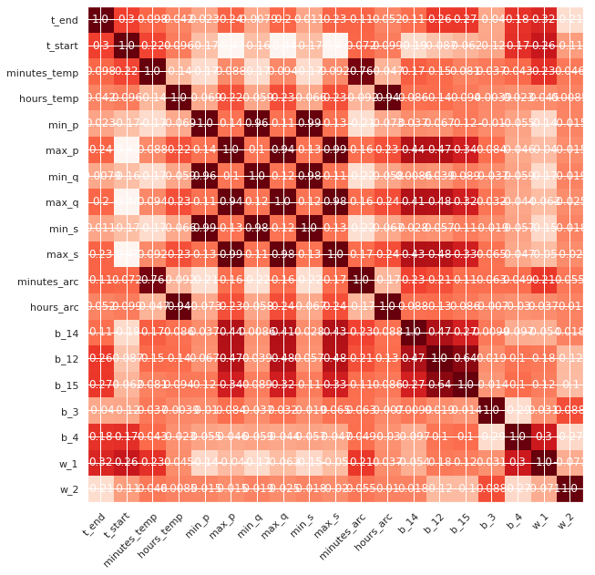
    


**Наблюдается мультиколлинеарность**, т.е сильная корреляция между некоторыми признаками. Для ее устранения необходимо убрать из двух сильно коррелирующих признаков один. Прежде чем убирать какой-либо признак, необходимо также оценить его значимость для целевого признака.


```python
round(full_pivot_merge_cor.corr()['t_end'].sort_values(ascending=False), 2)
```


    t_end           1.00
    w_1             0.32
    t_start         0.30
    b_15            0.27
    b_12            0.26
    max_p           0.24
    max_s           0.23
    max_q           0.20
    b_4             0.18
    b_14            0.11
    minutes_arc     0.11
    minutes_temp    0.10
    hours_arc       0.05
    hours_temp      0.04
    min_p           0.02
    min_s           0.01
    min_q          -0.01
    b_3            -0.04
    w_2            -0.21
    Name: t_end, dtype: float64


Группу признаков: **hours_arc, hours_temp, min_p, min_s, min_q, b_3 можно убрать**, так как их влияние на `t_end` не превышает 0.1


```python
full_pivot_merge_cor = full_pivot_merge_cor.drop(['hours_arc',
                                                  'hours_temp',
                                                  'min_p',
                                                  'min_s',
                                                  'min_q',
                                                  'b_3'], axis=1)
```


```python
name_col_full_pivot_merge_cor = full_pivot_merge_cor.columns
name_col_full_pivot_merge_cor
```


    Index(['t_end', 't_start', 'minutes_temp', 'max_p', 'max_q', 'max_s',
           'minutes_arc', 'b_14', 'b_12', 'b_15', 'b_4', 'w_1', 'w_2'],
          dtype='object')


```python
for i in range(len(name_col_full_pivot_merge_cor)):
    print("         ", name_col_full_pivot_merge_cor[i])
    print("------------------------")
    print(full_pivot_merge_cor.corr()[name_col_full_pivot_merge_cor[i]].sort_values(ascending=False).head(3))
    print()
    
```

              t_end
    ------------------------
    t_end      1.000000
    w_1        0.317673
    t_start    0.295814
    Name: t_end, dtype: float64
    
              t_start
    ------------------------
    t_start    1.000000
    t_end      0.295814
    w_1        0.264368
    Name: t_start, dtype: float64
    
              minutes_temp
    ------------------------
    minutes_temp    1.000000
    minutes_arc     0.756418
    w_1             0.234460
    Name: minutes_temp, dtype: float64
    
              max_p
    ------------------------
    max_p    1.000000
    max_s    0.990901
    max_q    0.940308
    Name: max_p, dtype: float64
    
              max_q
    ------------------------
    max_q    1.000000
    max_s    0.976738
    max_p    0.940308
    Name: max_q, dtype: float64
    
              max_s
    ------------------------
    max_s    1.000000
    max_p    0.990901
    max_q    0.976738
    Name: max_s, dtype: float64
    
              minutes_arc
    ------------------------
    minutes_arc     1.000000
    minutes_temp    0.756418
    b_14            0.229007
    Name: minutes_arc, dtype: float64
    
              b_14
    ------------------------
    b_14     1.000000
    b_12     0.466182
    max_p    0.435932
    Name: b_14, dtype: float64
    
              b_12
    ------------------------
    b_12     1.000000
    b_15     0.638475
    max_q    0.478681
    Name: b_12, dtype: float64
    
              b_15
    ------------------------
    b_15     1.000000
    b_12     0.638475
    max_p    0.336195
    Name: b_15, dtype: float64
    
              b_4
    ------------------------
    b_4      1.000000
    w_1      0.299014
    t_end    0.184733
    Name: b_4, dtype: float64
    
              w_1
    ------------------------
    w_1      1.000000
    t_end    0.317673
    b_4      0.299014
    Name: w_1, dtype: float64
    
              w_2
    ------------------------
    w_2             1.000000
    minutes_arc     0.054740
    minutes_temp    0.046322
    Name: w_2, dtype: float64
    
    


```python
round(full_pivot_merge_cor.corr()['t_end'].sort_values(ascending=False), 2)
```


    t_end           1.00
    w_1             0.32
    t_start         0.30
    b_15            0.27
    b_12            0.26
    max_p           0.24
    max_s           0.23
    max_q           0.20
    b_4             0.18
    b_14            0.11
    minutes_arc     0.11
    minutes_temp    0.10
    w_2            -0.21
    Name: t_end, dtype: float64


**Существует корреляция между:**

* `minutes_temp - minutes_arc`: удалим **`minutes_temp`**, так как `minutes_arc` оказывает большее влияние на `t_end`;
* `max_s - max_p - max_q`: удалим **`max_s - max_q`**, так как `max_p` оказывает большее влияние на `t_end`;
* `b_12 - b_14`, `b_12 - b_15`: удалим **`w_12`**, так как это разъединит два других признака, которые она замыкает на себя (`b_15`, `b_14`).


```python
full_pivot_merge_cor = full_pivot_merge_cor.drop(['minutes_temp',
                                                  'max_s',
                                                  'max_p',
                                                  'b_12'], axis=1)
```


```python
full_pivot_merge_cor
```


  <div id="df-08f6871a-5310-4a13-ac76-328407aba21f">
    <div class="colab-df-container">
      <div>
<style scoped>
    .dataframe tbody tr th:only-of-type {
        vertical-align: middle;
    }

    .dataframe tbody tr th {
        vertical-align: top;
    }

    .dataframe thead th {
        text-align: right;
    }
</style>
<table border="1" class="dataframe">
  <thead>
    <tr style="text-align: right;">
      <th></th>
      <th>t_end</th>
      <th>t_start</th>
      <th>max_q</th>
      <th>minutes_arc</th>
      <th>b_14</th>
      <th>b_15</th>
      <th>b_4</th>
      <th>w_1</th>
      <th>w_2</th>
    </tr>
  </thead>
  <tbody>
    <tr>
      <th>0</th>
      <td>1613.0</td>
      <td>1571.0</td>
      <td>1.062669</td>
      <td>26</td>
      <td>150.0</td>
      <td>154.0</td>
      <td>43.0</td>
      <td>60.059998</td>
      <td>0.00000</td>
    </tr>
    <tr>
      <th>1</th>
      <td>1602.0</td>
      <td>1581.0</td>
      <td>0.892914</td>
      <td>19</td>
      <td>149.0</td>
      <td>154.0</td>
      <td>73.0</td>
      <td>96.052315</td>
      <td>0.00000</td>
    </tr>
    <tr>
      <th>2</th>
      <td>1599.0</td>
      <td>1596.0</td>
      <td>0.671494</td>
      <td>25</td>
      <td>152.0</td>
      <td>153.0</td>
      <td>34.0</td>
      <td>91.160157</td>
      <td>0.00000</td>
    </tr>
    <tr>
      <th>3</th>
      <td>1625.0</td>
      <td>1601.0</td>
      <td>0.754719</td>
      <td>18</td>
      <td>153.0</td>
      <td>154.0</td>
      <td>81.0</td>
      <td>89.063515</td>
      <td>0.00000</td>
    </tr>
    <tr>
      <th>4</th>
      <td>1602.0</td>
      <td>1576.0</td>
      <td>1.047776</td>
      <td>22</td>
      <td>151.0</td>
      <td>152.0</td>
      <td>78.0</td>
      <td>89.238236</td>
      <td>9.11456</td>
    </tr>
    <tr>
      <th>...</th>
      <td>...</td>
      <td>...</td>
      <td>...</td>
      <td>...</td>
      <td>...</td>
      <td>...</td>
      <td>...</td>
      <td>...</td>
      <td>...</td>
    </tr>
    <tr>
      <th>2279</th>
      <td>1591.0</td>
      <td>1570.0</td>
      <td>0.769281</td>
      <td>20</td>
      <td>129.0</td>
      <td>223.0</td>
      <td>0.0</td>
      <td>89.150879</td>
      <td>0.00000</td>
    </tr>
    <tr>
      <th>2280</th>
      <td>1591.0</td>
      <td>1554.0</td>
      <td>0.701201</td>
      <td>23</td>
      <td>129.0</td>
      <td>226.0</td>
      <td>63.0</td>
      <td>114.179527</td>
      <td>0.00000</td>
    </tr>
    <tr>
      <th>2281</th>
      <td>1589.0</td>
      <td>1571.0</td>
      <td>0.701218</td>
      <td>12</td>
      <td>124.0</td>
      <td>226.0</td>
      <td>85.0</td>
      <td>94.086723</td>
      <td>9.04800</td>
    </tr>
    <tr>
      <th>2282</th>
      <td>1594.0</td>
      <td>1591.0</td>
      <td>0.832519</td>
      <td>22</td>
      <td>129.0</td>
      <td>207.0</td>
      <td>0.0</td>
      <td>118.110717</td>
      <td>0.00000</td>
    </tr>
    <tr>
      <th>2283</th>
      <td>1603.0</td>
      <td>1569.0</td>
      <td>1.043338</td>
      <td>22</td>
      <td>126.0</td>
      <td>227.0</td>
      <td>0.0</td>
      <td>110.160958</td>
      <td>50.00528</td>
    </tr>
  </tbody>
</table>
<p>2284 rows × 9 columns</p>
</div>
      <button class="colab-df-convert" onclick="convertToInteractive('df-08f6871a-5310-4a13-ac76-328407aba21f')"
              title="Convert this dataframe to an interactive table."
              style="display:none;">

  <svg xmlns="http://www.w3.org/2000/svg" height="24px"viewBox="0 0 24 24"
       width="24px">
    <path d="M0 0h24v24H0V0z" fill="none"/>
    <path d="M18.56 5.44l.94 2.06.94-2.06 2.06-.94-2.06-.94-.94-2.06-.94 2.06-2.06.94zm-11 1L8.5 8.5l.94-2.06 2.06-.94-2.06-.94L8.5 2.5l-.94 2.06-2.06.94zm10 10l.94 2.06.94-2.06 2.06-.94-2.06-.94-.94-2.06-.94 2.06-2.06.94z"/><path d="M17.41 7.96l-1.37-1.37c-.4-.4-.92-.59-1.43-.59-.52 0-1.04.2-1.43.59L10.3 9.45l-7.72 7.72c-.78.78-.78 2.05 0 2.83L4 21.41c.39.39.9.59 1.41.59.51 0 1.02-.2 1.41-.59l7.78-7.78 2.81-2.81c.8-.78.8-2.07 0-2.86zM5.41 20L4 18.59l7.72-7.72 1.47 1.35L5.41 20z"/>
  </svg>
      </button>

  <style>
    .colab-df-container {
      display:flex;
      flex-wrap:wrap;
      gap: 12px;
    }

    .colab-df-convert {
      background-color: #E8F0FE;
      border: none;
      border-radius: 50%;
      cursor: pointer;
      display: none;
      fill: #1967D2;
      height: 32px;
      padding: 0 0 0 0;
      width: 32px;
    }

    .colab-df-convert:hover {
      background-color: #E2EBFA;
      box-shadow: 0px 1px 2px rgba(60, 64, 67, 0.3), 0px 1px 3px 1px rgba(60, 64, 67, 0.15);
      fill: #174EA6;
    }

    [theme=dark] .colab-df-convert {
      background-color: #3B4455;
      fill: #D2E3FC;
    }

    [theme=dark] .colab-df-convert:hover {
      background-color: #434B5C;
      box-shadow: 0px 1px 3px 1px rgba(0, 0, 0, 0.15);
      filter: drop-shadow(0px 1px 2px rgba(0, 0, 0, 0.3));
      fill: #FFFFFF;
    }
  </style>

      <script>
        const buttonEl =
          document.querySelector('#df-08f6871a-5310-4a13-ac76-328407aba21f button.colab-df-convert');
        buttonEl.style.display =
          google.colab.kernel.accessAllowed ? 'block' : 'none';

        async function convertToInteractive(key) {
          const element = document.querySelector('#df-08f6871a-5310-4a13-ac76-328407aba21f');
          const dataTable =
            await google.colab.kernel.invokeFunction('convertToInteractive',
                                                     [key], {});
          if (!dataTable) return;

          const docLinkHtml = 'Like what you see? Visit the ' +
            '<a target="_blank" href=https://colab.research.google.com/notebooks/data_table.ipynb>data table notebook</a>'
            + ' to learn more about interactive tables.';
          element.innerHTML = '';
          dataTable['output_type'] = 'display_data';
          await google.colab.output.renderOutput(dataTable, element);
          const docLink = document.createElement('div');
          docLink.innerHTML = docLinkHtml;
          element.appendChild(docLink);
        }
      </script>
    </div>
  </div>


```python
# изучение корреляции в данных
sns.pairplot(full_pivot_merge_cor, hue="t_end");
```


    
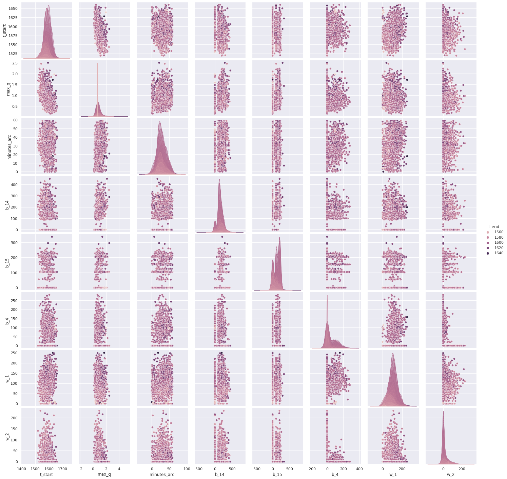
    


```python
corr_heatmap_data = full_pivot_merge_cor.corr()

fig, ax = plt.subplots(figsize=(10,10))
ax.set_xticks(np.arange(len(corr_heatmap_data.index)))
ax.set_yticks(np.arange(len(corr_heatmap_data.index)))

ax.set_xticklabels(corr_heatmap_data.index)
ax.set_yticklabels(corr_heatmap_data.index)

plt.setp(ax.get_xticklabels(), rotation=45, ha="right",
         rotation_mode="anchor")

data = corr_heatmap_data.values

for i in range(len(corr_heatmap_data.index)):
    for j in range(len(corr_heatmap_data.index)):
        text = ax.text(j, i, '{:.2}'.format(data[i, j]),
                       ha="center", va="center", color="w")
        
im = ax.imshow(corr_heatmap_data.corr(), cmap='Reds')
```


    
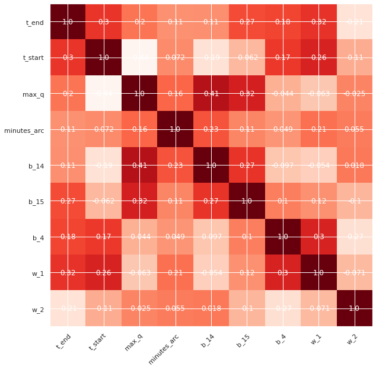
    


Как видно на графике парных отношений в наборе данных, а также на тепловой карте от мультиколлинеарности удалось избавиться.


```python
features = full_pivot_merge_cor.drop(['t_end'], axis=1)
target = full_pivot_merge_cor['t_end']
```


```python
features
```


  <div id="df-f0906f2f-29c8-4460-b732-e62c10ecaad9">
    <div class="colab-df-container">
      <div>
<style scoped>
    .dataframe tbody tr th:only-of-type {
        vertical-align: middle;
    }

    .dataframe tbody tr th {
        vertical-align: top;
    }

    .dataframe thead th {
        text-align: right;
    }
</style>
<table border="1" class="dataframe">
  <thead>
    <tr style="text-align: right;">
      <th></th>
      <th>t_start</th>
      <th>max_q</th>
      <th>minutes_arc</th>
      <th>b_14</th>
      <th>b_15</th>
      <th>b_4</th>
      <th>w_1</th>
      <th>w_2</th>
    </tr>
  </thead>
  <tbody>
    <tr>
      <th>0</th>
      <td>1571.0</td>
      <td>1.062669</td>
      <td>26</td>
      <td>150.0</td>
      <td>154.0</td>
      <td>43.0</td>
      <td>60.059998</td>
      <td>0.00000</td>
    </tr>
    <tr>
      <th>1</th>
      <td>1581.0</td>
      <td>0.892914</td>
      <td>19</td>
      <td>149.0</td>
      <td>154.0</td>
      <td>73.0</td>
      <td>96.052315</td>
      <td>0.00000</td>
    </tr>
    <tr>
      <th>2</th>
      <td>1596.0</td>
      <td>0.671494</td>
      <td>25</td>
      <td>152.0</td>
      <td>153.0</td>
      <td>34.0</td>
      <td>91.160157</td>
      <td>0.00000</td>
    </tr>
    <tr>
      <th>3</th>
      <td>1601.0</td>
      <td>0.754719</td>
      <td>18</td>
      <td>153.0</td>
      <td>154.0</td>
      <td>81.0</td>
      <td>89.063515</td>
      <td>0.00000</td>
    </tr>
    <tr>
      <th>4</th>
      <td>1576.0</td>
      <td>1.047776</td>
      <td>22</td>
      <td>151.0</td>
      <td>152.0</td>
      <td>78.0</td>
      <td>89.238236</td>
      <td>9.11456</td>
    </tr>
    <tr>
      <th>...</th>
      <td>...</td>
      <td>...</td>
      <td>...</td>
      <td>...</td>
      <td>...</td>
      <td>...</td>
      <td>...</td>
      <td>...</td>
    </tr>
    <tr>
      <th>2279</th>
      <td>1570.0</td>
      <td>0.769281</td>
      <td>20</td>
      <td>129.0</td>
      <td>223.0</td>
      <td>0.0</td>
      <td>89.150879</td>
      <td>0.00000</td>
    </tr>
    <tr>
      <th>2280</th>
      <td>1554.0</td>
      <td>0.701201</td>
      <td>23</td>
      <td>129.0</td>
      <td>226.0</td>
      <td>63.0</td>
      <td>114.179527</td>
      <td>0.00000</td>
    </tr>
    <tr>
      <th>2281</th>
      <td>1571.0</td>
      <td>0.701218</td>
      <td>12</td>
      <td>124.0</td>
      <td>226.0</td>
      <td>85.0</td>
      <td>94.086723</td>
      <td>9.04800</td>
    </tr>
    <tr>
      <th>2282</th>
      <td>1591.0</td>
      <td>0.832519</td>
      <td>22</td>
      <td>129.0</td>
      <td>207.0</td>
      <td>0.0</td>
      <td>118.110717</td>
      <td>0.00000</td>
    </tr>
    <tr>
      <th>2283</th>
      <td>1569.0</td>
      <td>1.043338</td>
      <td>22</td>
      <td>126.0</td>
      <td>227.0</td>
      <td>0.0</td>
      <td>110.160958</td>
      <td>50.00528</td>
    </tr>
  </tbody>
</table>
<p>2284 rows × 8 columns</p>
</div>
      <button class="colab-df-convert" onclick="convertToInteractive('df-f0906f2f-29c8-4460-b732-e62c10ecaad9')"
              title="Convert this dataframe to an interactive table."
              style="display:none;">

  <svg xmlns="http://www.w3.org/2000/svg" height="24px"viewBox="0 0 24 24"
       width="24px">
    <path d="M0 0h24v24H0V0z" fill="none"/>
    <path d="M18.56 5.44l.94 2.06.94-2.06 2.06-.94-2.06-.94-.94-2.06-.94 2.06-2.06.94zm-11 1L8.5 8.5l.94-2.06 2.06-.94-2.06-.94L8.5 2.5l-.94 2.06-2.06.94zm10 10l.94 2.06.94-2.06 2.06-.94-2.06-.94-.94-2.06-.94 2.06-2.06.94z"/><path d="M17.41 7.96l-1.37-1.37c-.4-.4-.92-.59-1.43-.59-.52 0-1.04.2-1.43.59L10.3 9.45l-7.72 7.72c-.78.78-.78 2.05 0 2.83L4 21.41c.39.39.9.59 1.41.59.51 0 1.02-.2 1.41-.59l7.78-7.78 2.81-2.81c.8-.78.8-2.07 0-2.86zM5.41 20L4 18.59l7.72-7.72 1.47 1.35L5.41 20z"/>
  </svg>
      </button>

  <style>
    .colab-df-container {
      display:flex;
      flex-wrap:wrap;
      gap: 12px;
    }

    .colab-df-convert {
      background-color: #E8F0FE;
      border: none;
      border-radius: 50%;
      cursor: pointer;
      display: none;
      fill: #1967D2;
      height: 32px;
      padding: 0 0 0 0;
      width: 32px;
    }

    .colab-df-convert:hover {
      background-color: #E2EBFA;
      box-shadow: 0px 1px 2px rgba(60, 64, 67, 0.3), 0px 1px 3px 1px rgba(60, 64, 67, 0.15);
      fill: #174EA6;
    }

    [theme=dark] .colab-df-convert {
      background-color: #3B4455;
      fill: #D2E3FC;
    }

    [theme=dark] .colab-df-convert:hover {
      background-color: #434B5C;
      box-shadow: 0px 1px 3px 1px rgba(0, 0, 0, 0.15);
      filter: drop-shadow(0px 1px 2px rgba(0, 0, 0, 0.3));
      fill: #FFFFFF;
    }
  </style>

      <script>
        const buttonEl =
          document.querySelector('#df-f0906f2f-29c8-4460-b732-e62c10ecaad9 button.colab-df-convert');
        buttonEl.style.display =
          google.colab.kernel.accessAllowed ? 'block' : 'none';

        async function convertToInteractive(key) {
          const element = document.querySelector('#df-f0906f2f-29c8-4460-b732-e62c10ecaad9');
          const dataTable =
            await google.colab.kernel.invokeFunction('convertToInteractive',
                                                     [key], {});
          if (!dataTable) return;

          const docLinkHtml = 'Like what you see? Visit the ' +
            '<a target="_blank" href=https://colab.research.google.com/notebooks/data_table.ipynb>data table notebook</a>'
            + ' to learn more about interactive tables.';
          element.innerHTML = '';
          dataTable['output_type'] = 'display_data';
          await google.colab.output.renderOutput(dataTable, element);
          const docLink = document.createElement('div');
          docLink.innerHTML = docLinkHtml;
          element.appendChild(docLink);
        }
      </script>
    </div>
  </div>


```python
name_features = features.columns
list(name_features)
```


    ['t_start', 'max_q', 'minutes_arc', 'b_14', 'b_15', 'b_4', 'w_1', 'w_2']


```python
# масштабирование признаков
numeric = ['t_start', 'max_q', 'minutes_arc', 'b_14', 'b_15', 'b_4', 'w_1', 'w_2']

scaler = StandardScaler()
scaler.fit(features[numeric])
features[numeric] = scaler.transform(features[numeric])
```

### Вывод

**В результате подготовки данных:**

1. Устранена мультиколлинеарность.
2. Перед моделированием применено масштабирование.

## Обучение модели


```python
features
```


  <div id="df-97ecd090-4182-47f8-adcc-560385d84450">
    <div class="colab-df-container">
      <div>
<style scoped>
    .dataframe tbody tr th:only-of-type {
        vertical-align: middle;
    }

    .dataframe tbody tr th {
        vertical-align: top;
    }

    .dataframe thead th {
        text-align: right;
    }
</style>
<table border="1" class="dataframe">
  <thead>
    <tr style="text-align: right;">
      <th></th>
      <th>t_start</th>
      <th>max_q</th>
      <th>minutes_arc</th>
      <th>b_14</th>
      <th>b_15</th>
      <th>b_4</th>
      <th>w_1</th>
      <th>w_2</th>
    </tr>
  </thead>
  <tbody>
    <tr>
      <th>0</th>
      <td>-0.685307</td>
      <td>0.583821</td>
      <td>-0.186928</td>
      <td>-0.047853</td>
      <td>0.402844</td>
      <td>0.099008</td>
      <td>-0.978280</td>
      <td>-0.527770</td>
    </tr>
    <tr>
      <th>1</th>
      <td>-0.263011</td>
      <td>0.091977</td>
      <td>-0.756404</td>
      <td>-0.060234</td>
      <td>0.402844</td>
      <td>0.609737</td>
      <td>-0.143960</td>
      <td>-0.527770</td>
    </tr>
    <tr>
      <th>2</th>
      <td>0.370434</td>
      <td>-0.549556</td>
      <td>-0.268282</td>
      <td>-0.023092</td>
      <td>0.390985</td>
      <td>-0.054211</td>
      <td>-0.257363</td>
      <td>-0.527770</td>
    </tr>
    <tr>
      <th>3</th>
      <td>0.581582</td>
      <td>-0.308424</td>
      <td>-0.837758</td>
      <td>-0.010711</td>
      <td>0.402844</td>
      <td>0.745931</td>
      <td>-0.305964</td>
      <td>-0.527770</td>
    </tr>
    <tr>
      <th>4</th>
      <td>-0.474159</td>
      <td>0.540669</td>
      <td>-0.512343</td>
      <td>-0.035473</td>
      <td>0.379126</td>
      <td>0.694858</td>
      <td>-0.301914</td>
      <td>-0.253031</td>
    </tr>
    <tr>
      <th>...</th>
      <td>...</td>
      <td>...</td>
      <td>...</td>
      <td>...</td>
      <td>...</td>
      <td>...</td>
      <td>...</td>
      <td>...</td>
    </tr>
    <tr>
      <th>2279</th>
      <td>-0.727537</td>
      <td>-0.266231</td>
      <td>-0.675050</td>
      <td>-0.307848</td>
      <td>1.221130</td>
      <td>-0.633037</td>
      <td>-0.303939</td>
      <td>-0.527770</td>
    </tr>
    <tr>
      <th>2280</th>
      <td>-1.403212</td>
      <td>-0.463483</td>
      <td>-0.430989</td>
      <td>-0.307848</td>
      <td>1.256707</td>
      <td>0.439494</td>
      <td>0.276238</td>
      <td>-0.527770</td>
    </tr>
    <tr>
      <th>2281</th>
      <td>-0.685307</td>
      <td>-0.463436</td>
      <td>-1.325879</td>
      <td>-0.369752</td>
      <td>1.256707</td>
      <td>0.814029</td>
      <td>-0.189523</td>
      <td>-0.255037</td>
    </tr>
    <tr>
      <th>2282</th>
      <td>0.159286</td>
      <td>-0.083010</td>
      <td>-0.512343</td>
      <td>-0.307848</td>
      <td>1.031383</td>
      <td>-0.633037</td>
      <td>0.367365</td>
      <td>-0.527770</td>
    </tr>
    <tr>
      <th>2283</th>
      <td>-0.769767</td>
      <td>0.527810</td>
      <td>-0.512343</td>
      <td>-0.344990</td>
      <td>1.268567</td>
      <td>-0.633037</td>
      <td>0.183086</td>
      <td>0.979531</td>
    </tr>
  </tbody>
</table>
<p>2284 rows × 8 columns</p>
</div>
      <button class="colab-df-convert" onclick="convertToInteractive('df-97ecd090-4182-47f8-adcc-560385d84450')"
              title="Convert this dataframe to an interactive table."
              style="display:none;">

  <svg xmlns="http://www.w3.org/2000/svg" height="24px"viewBox="0 0 24 24"
       width="24px">
    <path d="M0 0h24v24H0V0z" fill="none"/>
    <path d="M18.56 5.44l.94 2.06.94-2.06 2.06-.94-2.06-.94-.94-2.06-.94 2.06-2.06.94zm-11 1L8.5 8.5l.94-2.06 2.06-.94-2.06-.94L8.5 2.5l-.94 2.06-2.06.94zm10 10l.94 2.06.94-2.06 2.06-.94-2.06-.94-.94-2.06-.94 2.06-2.06.94z"/><path d="M17.41 7.96l-1.37-1.37c-.4-.4-.92-.59-1.43-.59-.52 0-1.04.2-1.43.59L10.3 9.45l-7.72 7.72c-.78.78-.78 2.05 0 2.83L4 21.41c.39.39.9.59 1.41.59.51 0 1.02-.2 1.41-.59l7.78-7.78 2.81-2.81c.8-.78.8-2.07 0-2.86zM5.41 20L4 18.59l7.72-7.72 1.47 1.35L5.41 20z"/>
  </svg>
      </button>

  <style>
    .colab-df-container {
      display:flex;
      flex-wrap:wrap;
      gap: 12px;
    }

    .colab-df-convert {
      background-color: #E8F0FE;
      border: none;
      border-radius: 50%;
      cursor: pointer;
      display: none;
      fill: #1967D2;
      height: 32px;
      padding: 0 0 0 0;
      width: 32px;
    }

    .colab-df-convert:hover {
      background-color: #E2EBFA;
      box-shadow: 0px 1px 2px rgba(60, 64, 67, 0.3), 0px 1px 3px 1px rgba(60, 64, 67, 0.15);
      fill: #174EA6;
    }

    [theme=dark] .colab-df-convert {
      background-color: #3B4455;
      fill: #D2E3FC;
    }

    [theme=dark] .colab-df-convert:hover {
      background-color: #434B5C;
      box-shadow: 0px 1px 3px 1px rgba(0, 0, 0, 0.15);
      filter: drop-shadow(0px 1px 2px rgba(0, 0, 0, 0.3));
      fill: #FFFFFF;
    }
  </style>

      <script>
        const buttonEl =
          document.querySelector('#df-97ecd090-4182-47f8-adcc-560385d84450 button.colab-df-convert');
        buttonEl.style.display =
          google.colab.kernel.accessAllowed ? 'block' : 'none';

        async function convertToInteractive(key) {
          const element = document.querySelector('#df-97ecd090-4182-47f8-adcc-560385d84450');
          const dataTable =
            await google.colab.kernel.invokeFunction('convertToInteractive',
                                                     [key], {});
          if (!dataTable) return;

          const docLinkHtml = 'Like what you see? Visit the ' +
            '<a target="_blank" href=https://colab.research.google.com/notebooks/data_table.ipynb>data table notebook</a>'
            + ' to learn more about interactive tables.';
          element.innerHTML = '';
          dataTable['output_type'] = 'display_data';
          await google.colab.output.renderOutput(dataTable, element);
          const docLink = document.createElement('div');
          docLink.innerHTML = docLinkHtml;
          element.appendChild(docLink);
        }
      </script>
    </div>
  </div>


```python
target
```


    0       1613.0
    1       1602.0
    2       1599.0
    3       1625.0
    4       1602.0
             ...  
    2279    1591.0
    2280    1591.0
    2281    1589.0
    2282    1594.0
    2283    1603.0
    Name: t_end, Length: 2284, dtype: float64


```python
features_train, features_test, target_train, target_test = train_test_split(
                                                            features, 
                                                            target, 
                                                            test_size=0.20, 
                                                            random_state=12092022)
```

#### LinearRegression


```python
%%time

model = LinearRegression()
parametrs = { 'fit_intercept':[True,False], 'normalize':[True,False], 'copy_X':[True, False] }
search = GridSearchCV(model, parametrs, cv=5, scoring='neg_mean_absolute_error')
search.fit(features_train, target_train)
best_model_LinearRegression = search.best_estimator_
best_score_model_LinearRegression = abs(round(search.best_score_, 3))
print('# # # # # # # # # # # # # # # # # # # # # # # # # # # # # # # # # # # # # # # # # # # # # # # # # # # # # # # # # # # # # # # #')
print('Модель:', best_model_LinearRegression)
print('Параметры лучшей модели:', search.best_params_)
print('best_score:', best_score_model_LinearRegression)
```

    # # # # # # # # # # # # # # # # # # # # # # # # # # # # # # # # # # # # # # # # # # # # # # # # # # # # # # # # # # # # # # # #
    Модель: LinearRegression(normalize=True)
    Параметры лучшей модели: {'copy_X': True, 'fit_intercept': True, 'normalize': True}
    best_score: 6.993
    CPU times: user 239 ms, sys: 193 ms, total: 433 ms
    Wall time: 222 ms
    

#### CatBoostRegressor


```python
%%time

model = CatBoostRegressor()
parametrs = { 'depth': range (1, 9, 2),
              'n_estimators': range (1, 9, 2) }
search = GridSearchCV(model, parametrs, cv=5, scoring='neg_mean_absolute_error')
search.fit(features_train, target_train)
best_model_CatBoostRegressor = search.best_estimator_
best_score_model_CatBoostRegressor = abs(round(search.best_score_, 3))
print('# # # # # # # # # # # # # # # # # # # # # # # # # # # # # # # # # # # # # # # # # # # # # # # # # # # # # # # # # # # # # # ')
print('Модель:', best_model_CatBoostRegressor)
print('Параметры лучшей модели:', search.best_params_)
print('best_score:', best_score_model_CatBoostRegressor)
```

    Learning rate set to 0.5
    0:	learn: 10.8784994	total: 492us	remaining: 0us
    Learning rate set to 0.5
    0:	learn: 11.0185176	total: 478us	remaining: 0us
    Learning rate set to 0.5
    0:	learn: 10.8835146	total: 469us	remaining: 0us
    Learning rate set to 0.5
    0:	learn: 10.9607292	total: 411us	remaining: 0us
    Learning rate set to 0.5
    0:	learn: 11.1383205	total: 515us	remaining: 0us
    Learning rate set to 0.5
    0:	learn: 10.8784994	total: 383us	remaining: 767us
    1:	learn: 10.6319764	total: 674us	remaining: 337us
    2:	learn: 10.3567148	total: 979us	remaining: 0us
    Learning rate set to 0.5
    0:	learn: 11.0185176	total: 356us	remaining: 713us
    1:	learn: 10.7040104	total: 655us	remaining: 327us
    2:	learn: 10.4661701	total: 1.15ms	remaining: 0us
    Learning rate set to 0.5
    0:	learn: 10.8835146	total: 436us	remaining: 873us
    1:	learn: 10.5619255	total: 1.21ms	remaining: 603us
    2:	learn: 10.3307416	total: 2.05ms	remaining: 0us
    Learning rate set to 0.5
    0:	learn: 10.9607292	total: 390us	remaining: 780us
    1:	learn: 10.7138104	total: 1.01ms	remaining: 506us
    2:	learn: 10.4833074	total: 1.7ms	remaining: 0us
    Learning rate set to 0.5
    0:	learn: 11.1383205	total: 446us	remaining: 892us
    1:	learn: 10.8777574	total: 2.71ms	remaining: 1.35ms
    2:	learn: 10.6447386	total: 3.81ms	remaining: 0us
    Learning rate set to 0.5
    0:	learn: 10.8784994	total: 402us	remaining: 1.61ms
    1:	learn: 10.6319764	total: 991us	remaining: 1.49ms
    2:	learn: 10.3567148	total: 1.54ms	remaining: 1.02ms
    3:	learn: 10.2110528	total: 2.11ms	remaining: 526us
    4:	learn: 10.0987077	total: 2.69ms	remaining: 0us
    Learning rate set to 0.5
    0:	learn: 11.0185176	total: 460us	remaining: 1.84ms
    1:	learn: 10.7040104	total: 1.03ms	remaining: 1.54ms
    2:	learn: 10.4661701	total: 1.6ms	remaining: 1.07ms
    3:	learn: 10.3372203	total: 2.2ms	remaining: 549us
    4:	learn: 10.2096896	total: 2.52ms	remaining: 0us
    Learning rate set to 0.5
    0:	learn: 10.8835146	total: 398us	remaining: 1.59ms
    1:	learn: 10.5619255	total: 680us	remaining: 1.02ms
    2:	learn: 10.3307416	total: 950us	remaining: 633us
    3:	learn: 10.1869246	total: 1.26ms	remaining: 314us
    4:	learn: 10.0352757	total: 1.53ms	remaining: 0us
    Learning rate set to 0.5
    0:	learn: 10.9607292	total: 397us	remaining: 1.59ms
    1:	learn: 10.7138104	total: 706us	remaining: 1.06ms
    2:	learn: 10.4833074	total: 973us	remaining: 649us
    3:	learn: 10.3747929	total: 1.27ms	remaining: 317us
    4:	learn: 10.2517697	total: 1.55ms	remaining: 0us
    Learning rate set to 0.5
    0:	learn: 11.1383205	total: 439us	remaining: 1.76ms
    1:	learn: 10.8777574	total: 1.2ms	remaining: 1.8ms
    2:	learn: 10.6447386	total: 1.77ms	remaining: 1.18ms
    3:	learn: 10.5034056	total: 4.6ms	remaining: 1.15ms
    4:	learn: 10.3555910	total: 4.91ms	remaining: 0us
    Learning rate set to 0.5
    0:	learn: 10.8784994	total: 425us	remaining: 2.55ms
    1:	learn: 10.6319764	total: 1.04ms	remaining: 2.59ms
    2:	learn: 10.3567148	total: 1.58ms	remaining: 2.1ms
    3:	learn: 10.2110528	total: 2.15ms	remaining: 1.62ms
    4:	learn: 10.0987077	total: 2.71ms	remaining: 1.08ms
    5:	learn: 9.9553907	total: 3.29ms	remaining: 549us
    6:	learn: 9.8360879	total: 3.88ms	remaining: 0us
    Learning rate set to 0.5
    0:	learn: 11.0185176	total: 456us	remaining: 2.74ms
    1:	learn: 10.7040104	total: 1.03ms	remaining: 2.57ms
    2:	learn: 10.4661701	total: 1.6ms	remaining: 2.13ms
    3:	learn: 10.3372203	total: 2.18ms	remaining: 1.64ms
    4:	learn: 10.2096896	total: 2.74ms	remaining: 1.09ms
    5:	learn: 10.0991207	total: 3.43ms	remaining: 571us
    6:	learn: 9.9909743	total: 4.33ms	remaining: 0us
    Learning rate set to 0.5
    0:	learn: 10.8835146	total: 397us	remaining: 2.39ms
    1:	learn: 10.5619255	total: 924us	remaining: 2.31ms
    2:	learn: 10.3307416	total: 1.52ms	remaining: 2.03ms
    3:	learn: 10.1869246	total: 2.06ms	remaining: 1.54ms
    4:	learn: 10.0352757	total: 3.24ms	remaining: 1.29ms
    5:	learn: 9.9246986	total: 3.9ms	remaining: 650us
    6:	learn: 9.8284019	total: 4.52ms	remaining: 0us
    Learning rate set to 0.5
    0:	learn: 10.9607292	total: 504us	remaining: 3.02ms
    1:	learn: 10.7138104	total: 1.17ms	remaining: 2.92ms
    2:	learn: 10.4833074	total: 1.72ms	remaining: 2.29ms
    3:	learn: 10.3747929	total: 2.28ms	remaining: 1.71ms
    4:	learn: 10.2517697	total: 3.65ms	remaining: 1.46ms
    5:	learn: 10.1295872	total: 4.26ms	remaining: 709us
    6:	learn: 10.0120086	total: 4.88ms	remaining: 0us
    Learning rate set to 0.5
    0:	learn: 11.1383205	total: 455us	remaining: 2.73ms
    1:	learn: 10.8777574	total: 2.55ms	remaining: 6.38ms
    2:	learn: 10.6447386	total: 2.84ms	remaining: 3.78ms
    3:	learn: 10.5034056	total: 3.1ms	remaining: 2.33ms
    4:	learn: 10.3555910	total: 3.45ms	remaining: 1.38ms
    5:	learn: 10.2170479	total: 3.72ms	remaining: 620us
    6:	learn: 10.0863294	total: 4.02ms	remaining: 0us
    Learning rate set to 0.5
    0:	learn: 10.5246962	total: 712us	remaining: 0us
    Learning rate set to 0.5
    0:	learn: 10.7309923	total: 772us	remaining: 0us
    Learning rate set to 0.5
    0:	learn: 10.4775216	total: 701us	remaining: 0us
    Learning rate set to 0.5
    0:	learn: 10.6283411	total: 714us	remaining: 0us
    Learning rate set to 0.5
    0:	learn: 10.7938240	total: 674us	remaining: 0us
    Learning rate set to 0.5
    0:	learn: 10.5246962	total: 731us	remaining: 1.46ms
    1:	learn: 9.9110786	total: 1.58ms	remaining: 792us
    2:	learn: 9.5969538	total: 2.41ms	remaining: 0us
    Learning rate set to 0.5
    0:	learn: 10.7309923	total: 735us	remaining: 1.47ms
    1:	learn: 10.2567581	total: 1.65ms	remaining: 823us
    2:	learn: 9.9021395	total: 2.5ms	remaining: 0us
    Learning rate set to 0.5
    0:	learn: 10.4775216	total: 757us	remaining: 1.51ms
    1:	learn: 9.8976373	total: 1.68ms	remaining: 839us
    2:	learn: 9.6314794	total: 2.58ms	remaining: 0us
    Learning rate set to 0.5
    0:	learn: 10.6283411	total: 840us	remaining: 1.68ms
    1:	learn: 10.0335024	total: 1.69ms	remaining: 845us
    2:	learn: 9.8068716	total: 2.55ms	remaining: 0us
    Learning rate set to 0.5
    0:	learn: 10.7938240	total: 667us	remaining: 1.33ms
    1:	learn: 10.1587609	total: 1.53ms	remaining: 767us
    2:	learn: 9.8087943	total: 2.4ms	remaining: 0us
    Learning rate set to 0.5
    0:	learn: 10.5246962	total: 702us	remaining: 2.81ms
    1:	learn: 9.9110786	total: 1.31ms	remaining: 1.96ms
    2:	learn: 9.5969538	total: 1.89ms	remaining: 1.26ms
    3:	learn: 9.3955842	total: 2.47ms	remaining: 617us
    4:	learn: 9.2943117	total: 3.06ms	remaining: 0us
    Learning rate set to 0.5
    0:	learn: 10.7309923	total: 718us	remaining: 2.87ms
    1:	learn: 10.2567581	total: 1.67ms	remaining: 2.5ms
    2:	learn: 9.9021395	total: 2.57ms	remaining: 1.72ms
    3:	learn: 9.6786663	total: 3.47ms	remaining: 867us
    4:	learn: 9.5696095	total: 4.39ms	remaining: 0us
    Learning rate set to 0.5
    0:	learn: 10.4775216	total: 751us	remaining: 3ms
    1:	learn: 9.8976373	total: 2.4ms	remaining: 3.6ms
    2:	learn: 9.6314794	total: 3.56ms	remaining: 2.37ms
    3:	learn: 9.4496009	total: 4.46ms	remaining: 1.11ms
    4:	learn: 9.2595808	total: 5.35ms	remaining: 0us
    Learning rate set to 0.5
    0:	learn: 10.6283411	total: 760us	remaining: 3.04ms
    1:	learn: 10.0335024	total: 1.67ms	remaining: 2.5ms
    2:	learn: 9.8068716	total: 2.55ms	remaining: 1.7ms
    3:	learn: 9.5962805	total: 3.49ms	remaining: 872us
    4:	learn: 9.5015681	total: 4.47ms	remaining: 0us
    Learning rate set to 0.5
    0:	learn: 10.7938240	total: 914us	remaining: 3.66ms
    1:	learn: 10.1587609	total: 1.79ms	remaining: 2.69ms
    2:	learn: 9.8087943	total: 2.62ms	remaining: 1.75ms
    3:	learn: 9.6090151	total: 3.46ms	remaining: 865us
    4:	learn: 9.4663568	total: 4.28ms	remaining: 0us
    Learning rate set to 0.5
    0:	learn: 10.5246962	total: 709us	remaining: 4.25ms
    1:	learn: 9.9110786	total: 1.62ms	remaining: 4.06ms
    2:	learn: 9.5969538	total: 3.32ms	remaining: 4.43ms
    3:	learn: 9.3955842	total: 4.85ms	remaining: 3.64ms
    4:	learn: 9.2943117	total: 5.83ms	remaining: 2.33ms
    5:	learn: 9.1746200	total: 6.68ms	remaining: 1.11ms
    6:	learn: 9.0848665	total: 7.81ms	remaining: 0us
    Learning rate set to 0.5
    0:	learn: 10.7309923	total: 744us	remaining: 4.47ms
    1:	learn: 10.2567581	total: 1.49ms	remaining: 3.72ms
    2:	learn: 9.9021395	total: 2.53ms	remaining: 3.37ms
    3:	learn: 9.6786663	total: 3.31ms	remaining: 2.48ms
    4:	learn: 9.5696095	total: 4.14ms	remaining: 1.66ms
    5:	learn: 9.4395426	total: 4.97ms	remaining: 828us
    6:	learn: 9.2736522	total: 5.79ms	remaining: 0us
    Learning rate set to 0.5
    0:	learn: 10.4775216	total: 708us	remaining: 4.25ms
    1:	learn: 9.8976373	total: 1.79ms	remaining: 4.49ms
    2:	learn: 9.6314794	total: 2.59ms	remaining: 3.46ms
    3:	learn: 9.4496009	total: 3.39ms	remaining: 2.54ms
    4:	learn: 9.2595808	total: 4.3ms	remaining: 1.72ms
    5:	learn: 9.1794602	total: 5.21ms	remaining: 868us
    6:	learn: 9.0723940	total: 6.09ms	remaining: 0us
    Learning rate set to 0.5
    0:	learn: 10.6283411	total: 677us	remaining: 4.06ms
    1:	learn: 10.0335024	total: 1.33ms	remaining: 3.33ms
    2:	learn: 9.8068716	total: 2.27ms	remaining: 3.03ms
    3:	learn: 9.5962805	total: 3.02ms	remaining: 2.26ms
    4:	learn: 9.5015681	total: 3.9ms	remaining: 1.56ms
    5:	learn: 9.3750581	total: 4.83ms	remaining: 805us
    6:	learn: 9.1804672	total: 5.76ms	remaining: 0us
    Learning rate set to 0.5
    0:	learn: 10.7938240	total: 1.01ms	remaining: 6.04ms
    1:	learn: 10.1587609	total: 2.31ms	remaining: 5.76ms
    2:	learn: 9.8087943	total: 3.33ms	remaining: 4.44ms
    3:	learn: 9.6090151	total: 4.77ms	remaining: 3.58ms
    4:	learn: 9.4663568	total: 5.91ms	remaining: 2.36ms
    5:	learn: 9.3402971	total: 6.87ms	remaining: 1.14ms
    6:	learn: 9.2321890	total: 7.77ms	remaining: 0us
    Learning rate set to 0.5
    0:	learn: 10.1391102	total: 1.43ms	remaining: 0us
    Learning rate set to 0.5
    0:	learn: 10.3335724	total: 1.65ms	remaining: 0us
    Learning rate set to 0.5
    0:	learn: 10.1687151	total: 1.45ms	remaining: 0us
    Learning rate set to 0.5
    0:	learn: 10.3218963	total: 1.26ms	remaining: 0us
    Learning rate set to 0.5
    0:	learn: 10.4198400	total: 1.3ms	remaining: 0us
    Learning rate set to 0.5
    0:	learn: 10.1391102	total: 1.31ms	remaining: 2.61ms
    1:	learn: 9.6573641	total: 2.76ms	remaining: 1.38ms
    2:	learn: 9.2345820	total: 4.18ms	remaining: 0us
    Learning rate set to 0.5
    0:	learn: 10.3335724	total: 1.37ms	remaining: 2.74ms
    1:	learn: 9.8076003	total: 2.85ms	remaining: 1.42ms
    2:	learn: 9.4037622	total: 4.35ms	remaining: 0us
    Learning rate set to 0.5
    0:	learn: 10.1687151	total: 1.38ms	remaining: 2.76ms
    1:	learn: 9.5795951	total: 2.89ms	remaining: 1.44ms
    2:	learn: 9.2792335	total: 4.34ms	remaining: 0us
    Learning rate set to 0.5
    0:	learn: 10.3218963	total: 1.34ms	remaining: 2.69ms
    1:	learn: 9.8979302	total: 2.52ms	remaining: 1.26ms
    2:	learn: 9.4249644	total: 3.65ms	remaining: 0us
    Learning rate set to 0.5
    0:	learn: 10.4198400	total: 1.22ms	remaining: 2.45ms
    1:	learn: 9.8204597	total: 2.44ms	remaining: 1.22ms
    2:	learn: 9.4960948	total: 3.8ms	remaining: 0us
    Learning rate set to 0.5
    0:	learn: 10.1391102	total: 1.64ms	remaining: 6.56ms
    1:	learn: 9.6573641	total: 2.85ms	remaining: 4.28ms
    2:	learn: 9.2345820	total: 4.29ms	remaining: 2.86ms
    3:	learn: 9.0909118	total: 5.95ms	remaining: 1.49ms
    4:	learn: 8.8551564	total: 7.45ms	remaining: 0us
    Learning rate set to 0.5
    0:	learn: 10.3335724	total: 1.31ms	remaining: 5.24ms
    1:	learn: 9.8076003	total: 3.03ms	remaining: 4.54ms
    2:	learn: 9.4037622	total: 5.54ms	remaining: 3.69ms
    3:	learn: 9.2067456	total: 7.51ms	remaining: 1.88ms
    4:	learn: 9.0570146	total: 9.96ms	remaining: 0us
    Learning rate set to 0.5
    0:	learn: 10.1687151	total: 1.29ms	remaining: 5.16ms
    1:	learn: 9.5795951	total: 2.73ms	remaining: 4.1ms
    2:	learn: 9.2792335	total: 4.17ms	remaining: 2.78ms
    3:	learn: 9.0371110	total: 5.55ms	remaining: 1.39ms
    4:	learn: 8.9046094	total: 6.96ms	remaining: 0us
    Learning rate set to 0.5
    0:	learn: 10.3218963	total: 1.3ms	remaining: 5.22ms
    1:	learn: 9.8979302	total: 2.4ms	remaining: 3.6ms
    2:	learn: 9.4249644	total: 3.52ms	remaining: 2.35ms
    3:	learn: 9.2644266	total: 5.24ms	remaining: 1.31ms
    4:	learn: 9.0505266	total: 6.85ms	remaining: 0us
    Learning rate set to 0.5
    0:	learn: 10.4198400	total: 1.29ms	remaining: 5.18ms
    1:	learn: 9.8204597	total: 2.76ms	remaining: 4.14ms
    2:	learn: 9.4960948	total: 4.23ms	remaining: 2.82ms
    3:	learn: 9.2034955	total: 5.54ms	remaining: 1.39ms
    4:	learn: 8.9497074	total: 6.95ms	remaining: 0us
    Learning rate set to 0.5
    0:	learn: 10.1391102	total: 1.35ms	remaining: 8.1ms
    1:	learn: 9.6573641	total: 2.49ms	remaining: 6.23ms
    2:	learn: 9.2345820	total: 3.62ms	remaining: 4.82ms
    3:	learn: 9.0909118	total: 4.75ms	remaining: 3.56ms
    4:	learn: 8.8551564	total: 5.92ms	remaining: 2.37ms
    5:	learn: 8.7323877	total: 7.02ms	remaining: 1.17ms
    6:	learn: 8.6323078	total: 8.1ms	remaining: 0us
    Learning rate set to 0.5
    0:	learn: 10.3335724	total: 1.3ms	remaining: 7.82ms
    1:	learn: 9.8076003	total: 2.69ms	remaining: 6.72ms
    2:	learn: 9.4037622	total: 4.08ms	remaining: 5.45ms
    3:	learn: 9.2067456	total: 5.49ms	remaining: 4.12ms
    4:	learn: 9.0570146	total: 6.96ms	remaining: 2.79ms
    5:	learn: 8.8950742	total: 8.42ms	remaining: 1.4ms
    6:	learn: 8.7038521	total: 9.93ms	remaining: 0us
    Learning rate set to 0.5
    0:	learn: 10.1687151	total: 1.24ms	remaining: 7.43ms
    1:	learn: 9.5795951	total: 2.73ms	remaining: 6.82ms
    2:	learn: 9.2792335	total: 4.19ms	remaining: 5.59ms
    3:	learn: 9.0371110	total: 6.31ms	remaining: 4.73ms
    4:	learn: 8.9046094	total: 7.79ms	remaining: 3.12ms
    5:	learn: 8.7342972	total: 9.33ms	remaining: 1.55ms
    6:	learn: 8.6362024	total: 10.9ms	remaining: 0us
    Learning rate set to 0.5
    0:	learn: 10.3218963	total: 1.28ms	remaining: 7.67ms
    1:	learn: 9.8979302	total: 2.71ms	remaining: 6.79ms
    2:	learn: 9.4249644	total: 4.7ms	remaining: 6.27ms
    3:	learn: 9.2644266	total: 6.23ms	remaining: 4.67ms
    4:	learn: 9.0505266	total: 7.67ms	remaining: 3.07ms
    5:	learn: 8.8396202	total: 9.13ms	remaining: 1.52ms
    6:	learn: 8.7207935	total: 10.5ms	remaining: 0us
    Learning rate set to 0.5
    0:	learn: 10.4198400	total: 1.36ms	remaining: 8.17ms
    1:	learn: 9.8204597	total: 3.23ms	remaining: 8.08ms
    2:	learn: 9.4960948	total: 4.68ms	remaining: 6.24ms
    3:	learn: 9.2034955	total: 6.12ms	remaining: 4.59ms
    4:	learn: 8.9497074	total: 7.54ms	remaining: 3.02ms
    5:	learn: 8.8215328	total: 9.28ms	remaining: 1.55ms
    6:	learn: 8.7091557	total: 10.7ms	remaining: 0us
    Learning rate set to 0.5
    0:	learn: 9.9180154	total: 2.91ms	remaining: 0us
    Learning rate set to 0.5
    0:	learn: 10.0795017	total: 2.94ms	remaining: 0us
    Learning rate set to 0.5
    0:	learn: 9.9167336	total: 2.76ms	remaining: 0us
    Learning rate set to 0.5
    0:	learn: 10.1660674	total: 2.65ms	remaining: 0us
    Learning rate set to 0.5
    0:	learn: 10.3319909	total: 2.62ms	remaining: 0us
    Learning rate set to 0.5
    0:	learn: 9.9180154	total: 2.79ms	remaining: 5.58ms
    1:	learn: 9.4731472	total: 5.34ms	remaining: 2.67ms
    2:	learn: 9.0572547	total: 8.65ms	remaining: 0us
    Learning rate set to 0.5
    0:	learn: 10.0795017	total: 2.69ms	remaining: 5.39ms
    1:	learn: 9.5247948	total: 5.63ms	remaining: 2.81ms
    2:	learn: 9.2144588	total: 8.33ms	remaining: 0us
    Learning rate set to 0.5
    0:	learn: 9.9167336	total: 2.57ms	remaining: 5.13ms
    1:	learn: 9.3600159	total: 5.41ms	remaining: 2.71ms
    2:	learn: 8.9492339	total: 8.23ms	remaining: 0us
    Learning rate set to 0.5
    0:	learn: 10.1660674	total: 2.76ms	remaining: 5.51ms
    1:	learn: 9.5449882	total: 5.45ms	remaining: 2.72ms
    2:	learn: 9.0419081	total: 8.13ms	remaining: 0us
    Learning rate set to 0.5
    0:	learn: 10.3319909	total: 2.56ms	remaining: 5.12ms
    1:	learn: 9.5627563	total: 5.41ms	remaining: 2.71ms
    2:	learn: 9.1880702	total: 8.24ms	remaining: 0us
    Learning rate set to 0.5
    0:	learn: 9.9180154	total: 3.22ms	remaining: 12.9ms
    1:	learn: 9.4731472	total: 5.93ms	remaining: 8.9ms
    2:	learn: 9.0572547	total: 8.52ms	remaining: 5.68ms
    3:	learn: 8.8372311	total: 11ms	remaining: 2.75ms
    4:	learn: 8.5736741	total: 13.5ms	remaining: 0us
    Learning rate set to 0.5
    0:	learn: 10.0795017	total: 2.65ms	remaining: 10.6ms
    1:	learn: 9.5247948	total: 5.28ms	remaining: 7.92ms
    2:	learn: 9.2144588	total: 7.86ms	remaining: 5.24ms
    3:	learn: 8.9966921	total: 10.7ms	remaining: 2.69ms
    4:	learn: 8.7229100	total: 13.7ms	remaining: 0us
    Learning rate set to 0.5
    0:	learn: 9.9167336	total: 2.63ms	remaining: 10.5ms
    1:	learn: 9.3600159	total: 5.77ms	remaining: 8.65ms
    2:	learn: 8.9492339	total: 9.51ms	remaining: 6.34ms
    3:	learn: 8.7122131	total: 12.5ms	remaining: 3.13ms
    4:	learn: 8.4377861	total: 16ms	remaining: 0us
    Learning rate set to 0.5
    0:	learn: 10.1660674	total: 2.78ms	remaining: 11.1ms
    1:	learn: 9.5449882	total: 5.46ms	remaining: 8.18ms
    2:	learn: 9.0419081	total: 8.16ms	remaining: 5.44ms
    3:	learn: 8.7782037	total: 10.7ms	remaining: 2.68ms
    4:	learn: 8.5107726	total: 13.2ms	remaining: 0us
    Learning rate set to 0.5
    0:	learn: 10.3319909	total: 2.69ms	remaining: 10.8ms
    1:	learn: 9.5627563	total: 5.78ms	remaining: 8.67ms
    2:	learn: 9.1880702	total: 8.96ms	remaining: 5.97ms
    3:	learn: 8.8753478	total: 11.8ms	remaining: 2.94ms
    4:	learn: 8.6154043	total: 14.7ms	remaining: 0us
    Learning rate set to 0.5
    0:	learn: 9.9180154	total: 7.27ms	remaining: 43.6ms
    1:	learn: 9.4731472	total: 10.5ms	remaining: 26.3ms
    2:	learn: 9.0572547	total: 13.3ms	remaining: 17.8ms
    3:	learn: 8.8372311	total: 17.7ms	remaining: 13.3ms
    4:	learn: 8.5736741	total: 21.3ms	remaining: 8.52ms
    5:	learn: 8.4191487	total: 24.3ms	remaining: 4.05ms
    6:	learn: 8.2107850	total: 26.8ms	remaining: 0us
    Learning rate set to 0.5
    0:	learn: 10.0795017	total: 2.64ms	remaining: 15.8ms
    1:	learn: 9.5247948	total: 5.4ms	remaining: 13.5ms
    2:	learn: 9.2144588	total: 8.19ms	remaining: 10.9ms
    3:	learn: 8.9966921	total: 11ms	remaining: 8.25ms
    4:	learn: 8.7229100	total: 13.8ms	remaining: 5.52ms
    5:	learn: 8.4534549	total: 16.6ms	remaining: 2.76ms
    6:	learn: 8.3074077	total: 19.4ms	remaining: 0us
    Learning rate set to 0.5
    0:	learn: 9.9167336	total: 2.74ms	remaining: 16.4ms
    1:	learn: 9.3600159	total: 5.65ms	remaining: 14.1ms
    2:	learn: 8.9492339	total: 8.4ms	remaining: 11.2ms
    3:	learn: 8.7122131	total: 11.1ms	remaining: 8.3ms
    4:	learn: 8.4377861	total: 13.9ms	remaining: 5.56ms
    5:	learn: 8.2466754	total: 16.7ms	remaining: 2.79ms
    6:	learn: 8.0898834	total: 19.6ms	remaining: 0us
    Learning rate set to 0.5
    0:	learn: 10.1660674	total: 2.67ms	remaining: 16ms
    1:	learn: 9.5449882	total: 5.51ms	remaining: 13.8ms
    2:	learn: 9.0419081	total: 8.4ms	remaining: 11.2ms
    3:	learn: 8.7782037	total: 11.2ms	remaining: 8.36ms
    4:	learn: 8.5107726	total: 15ms	remaining: 5.99ms
    5:	learn: 8.3351033	total: 17.7ms	remaining: 2.94ms
    6:	learn: 8.1289793	total: 20.2ms	remaining: 0us
    Learning rate set to 0.5
    0:	learn: 10.3319909	total: 2.75ms	remaining: 16.5ms
    1:	learn: 9.5627563	total: 5.34ms	remaining: 13.4ms
    2:	learn: 9.1880702	total: 8.42ms	remaining: 11.2ms
    3:	learn: 8.8753478	total: 11.4ms	remaining: 8.53ms
    4:	learn: 8.6154043	total: 14.4ms	remaining: 5.78ms
    5:	learn: 8.3603633	total: 17.2ms	remaining: 2.87ms
    6:	learn: 8.2227037	total: 20.1ms	remaining: 0us
    Learning rate set to 0.5
    0:	learn: 10.2844269	total: 1.37ms	remaining: 8.21ms
    1:	learn: 9.7626949	total: 2.8ms	remaining: 6.99ms
    2:	learn: 9.4327321	total: 4.22ms	remaining: 5.63ms
    3:	learn: 9.2793684	total: 5.74ms	remaining: 4.31ms
    4:	learn: 9.0994597	total: 7.25ms	remaining: 2.9ms
    5:	learn: 8.9546561	total: 8.74ms	remaining: 1.46ms
    6:	learn: 8.8211975	total: 10.3ms	remaining: 0us
    # # # # # # # # # # # # # # # # # # # # # # # # # # # # # # # # # # # # # # # # # # # # # # # # # # # # # # # # # # # # # # 
    Модель: <catboost.core.CatBoostRegressor object at 0x7f7df01401d0>
    Параметры лучшей модели: {'depth': 5, 'n_estimators': 7}
    best_score: 7.017
    CPU times: user 1.75 s, sys: 405 ms, total: 2.15 s
    Wall time: 3.3 s
    

#### RandomForestRegressor


```python
%%time

model = RandomForestRegressor()
parametrs = {'bootstrap': [True, False],
               'max_depth': [10, 20, 30, None],
               'max_features': ['auto', 'sqrt'],
               'min_samples_leaf': [1, 2, 4],
               'min_samples_split': [2, 5, 10],
               'n_estimators': [13, 18, 23, 34, 45, 56, 78]}
search = RandomizedSearchCV(model, parametrs, cv=5, scoring='neg_mean_absolute_error')
search.fit(features_train, target_train)
best_model_RandomForestRegressor = search.best_estimator_
best_score_model_RandomForestRegressor = abs(round(search.best_score_, 3))
print('# # # # # # # # # # # # # # # # # # # # # # # # # # # # # # # # # # # # # # # # # # # # # # # # # # # # # # # # # # # # # # # #')
print('Модель:', best_model_RandomForestRegressor)
print('Параметры лучшей модели:', search.best_params_)
print('best_score:', best_score_model_RandomForestRegressor)
```

    # # # # # # # # # # # # # # # # # # # # # # # # # # # # # # # # # # # # # # # # # # # # # # # # # # # # # # # # # # # # # # # #
    Модель: RandomForestRegressor(min_samples_leaf=4, min_samples_split=5, n_estimators=78)
    Параметры лучшей модели: {'n_estimators': 78, 'min_samples_split': 5, 'min_samples_leaf': 4, 'max_features': 'auto', 'max_depth': None, 'bootstrap': True}
    best_score: 6.931
    CPU times: user 17.8 s, sys: 11.9 ms, total: 17.8 s
    Wall time: 17.9 s
    

#### XGBRegressor


```python
%%time

model = XGBRegressor()
parametrs = {'nthread':[4],
             'objective':['reg:linear'],
             'learning_rate': [.03, 0.05, .07],
             'max_depth': [5, 6, 7],
             'min_child_weight': [4],
             'silent': [1],
             'subsample': [0.7],
             'colsample_bytree': [0.7],
             'n_estimators': [200]}
search = GridSearchCV(model, parametrs, cv=3, scoring='neg_mean_absolute_error')
search.fit(features_train, target_train)
best_model_XGBRegressor = search.best_estimator_
best_score_model_XGBRegressor = abs(round(search.best_score_, 3))
print('# # # # # # # # # # # # # # # # # # # # # # # # # # # # # # # # # # # # # # # # # # # # # # # # # # # # # # # # # # # # # # # #')
print('Модель:', best_model_XGBRegressor)
print('Параметры лучшей модели:', search.best_params_)
print('best_score:', best_score_model_XGBRegressor)
```

    # # # # # # # # # # # # # # # # # # # # # # # # # # # # # # # # # # # # # # # # # # # # # # # # # # # # # # # # # # # # # # # #
    Модель: XGBRegressor(colsample_bytree=0.7, learning_rate=0.05, max_depth=5,
                 min_child_weight=4, n_estimators=200, nthread=4, silent=1,
                 subsample=0.7)
    Параметры лучшей модели: {'colsample_bytree': 0.7, 'learning_rate': 0.05, 'max_depth': 5, 'min_child_weight': 4, 'n_estimators': 200, 'nthread': 4, 'objective': 'reg:linear', 'silent': 1, 'subsample': 0.7}
    best_score: 6.904
    CPU times: user 10.7 s, sys: 2.21 s, total: 13 s
    Wall time: 9.3 s
    

#### Выбор лучшей модели


```python
list_model = [best_model_LinearRegression,
              best_model_CatBoostRegressor,
              best_model_RandomForestRegressor,
              best_model_XGBRegressor]
```


```python
list_model
```


    [LinearRegression(normalize=True),
     <catboost.core.CatBoostRegressor at 0x7f7df01401d0>,
     RandomForestRegressor(min_samples_leaf=4, min_samples_split=5, n_estimators=78),
     XGBRegressor(colsample_bytree=0.7, learning_rate=0.05, max_depth=5,
                  min_child_weight=4, n_estimators=200, nthread=4, silent=1,
                  subsample=0.7)]


```python
list_score = [best_score_model_LinearRegression,
              best_score_model_CatBoostRegressor,
              best_score_model_RandomForestRegressor,
              best_score_model_XGBRegressor]
```


```python
intermediate_dictionary = {'Model':list_model, 'MAE':list_score}
```


```python
rating_model = pd.DataFrame(intermediate_dictionary)
```


```python
rating = rating_model.sort_values(by='MAE')
rating
```


  <div id="df-14f05dbd-9485-47c6-ba4e-702344bc7988">
    <div class="colab-df-container">
      <div>
<style scoped>
    .dataframe tbody tr th:only-of-type {
        vertical-align: middle;
    }

    .dataframe tbody tr th {
        vertical-align: top;
    }

    .dataframe thead th {
        text-align: right;
    }
</style>
<table border="1" class="dataframe">
  <thead>
    <tr style="text-align: right;">
      <th></th>
      <th>Model</th>
      <th>MAE</th>
    </tr>
  </thead>
  <tbody>
    <tr>
      <th>3</th>
      <td>XGBRegressor(colsample_bytree=0.7, learning_ra...</td>
      <td>6.904</td>
    </tr>
    <tr>
      <th>2</th>
      <td>(DecisionTreeRegressor(max_features='auto', mi...</td>
      <td>6.931</td>
    </tr>
    <tr>
      <th>0</th>
      <td>LinearRegression(normalize=True)</td>
      <td>6.993</td>
    </tr>
    <tr>
      <th>1</th>
      <td>&lt;catboost.core.CatBoostRegressor object at 0x7...</td>
      <td>7.017</td>
    </tr>
  </tbody>
</table>
</div>
      <button class="colab-df-convert" onclick="convertToInteractive('df-14f05dbd-9485-47c6-ba4e-702344bc7988')"
              title="Convert this dataframe to an interactive table."
              style="display:none;">

  <svg xmlns="http://www.w3.org/2000/svg" height="24px"viewBox="0 0 24 24"
       width="24px">
    <path d="M0 0h24v24H0V0z" fill="none"/>
    <path d="M18.56 5.44l.94 2.06.94-2.06 2.06-.94-2.06-.94-.94-2.06-.94 2.06-2.06.94zm-11 1L8.5 8.5l.94-2.06 2.06-.94-2.06-.94L8.5 2.5l-.94 2.06-2.06.94zm10 10l.94 2.06.94-2.06 2.06-.94-2.06-.94-.94-2.06-.94 2.06-2.06.94z"/><path d="M17.41 7.96l-1.37-1.37c-.4-.4-.92-.59-1.43-.59-.52 0-1.04.2-1.43.59L10.3 9.45l-7.72 7.72c-.78.78-.78 2.05 0 2.83L4 21.41c.39.39.9.59 1.41.59.51 0 1.02-.2 1.41-.59l7.78-7.78 2.81-2.81c.8-.78.8-2.07 0-2.86zM5.41 20L4 18.59l7.72-7.72 1.47 1.35L5.41 20z"/>
  </svg>
      </button>

  <style>
    .colab-df-container {
      display:flex;
      flex-wrap:wrap;
      gap: 12px;
    }

    .colab-df-convert {
      background-color: #E8F0FE;
      border: none;
      border-radius: 50%;
      cursor: pointer;
      display: none;
      fill: #1967D2;
      height: 32px;
      padding: 0 0 0 0;
      width: 32px;
    }

    .colab-df-convert:hover {
      background-color: #E2EBFA;
      box-shadow: 0px 1px 2px rgba(60, 64, 67, 0.3), 0px 1px 3px 1px rgba(60, 64, 67, 0.15);
      fill: #174EA6;
    }

    [theme=dark] .colab-df-convert {
      background-color: #3B4455;
      fill: #D2E3FC;
    }

    [theme=dark] .colab-df-convert:hover {
      background-color: #434B5C;
      box-shadow: 0px 1px 3px 1px rgba(0, 0, 0, 0.15);
      filter: drop-shadow(0px 1px 2px rgba(0, 0, 0, 0.3));
      fill: #FFFFFF;
    }
  </style>

      <script>
        const buttonEl =
          document.querySelector('#df-14f05dbd-9485-47c6-ba4e-702344bc7988 button.colab-df-convert');
        buttonEl.style.display =
          google.colab.kernel.accessAllowed ? 'block' : 'none';

        async function convertToInteractive(key) {
          const element = document.querySelector('#df-14f05dbd-9485-47c6-ba4e-702344bc7988');
          const dataTable =
            await google.colab.kernel.invokeFunction('convertToInteractive',
                                                     [key], {});
          if (!dataTable) return;

          const docLinkHtml = 'Like what you see? Visit the ' +
            '<a target="_blank" href=https://colab.research.google.com/notebooks/data_table.ipynb>data table notebook</a>'
            + ' to learn more about interactive tables.';
          element.innerHTML = '';
          dataTable['output_type'] = 'display_data';
          await google.colab.output.renderOutput(dataTable, element);
          const docLink = document.createElement('div');
          docLink.innerHTML = docLinkHtml;
          element.appendChild(docLink);
        }
      </script>
    </div>
  </div>


### Вывод

**В результате обучения и подбора лучших параметров моделей, установлено:**

1. Лучшая модель: XGBRegressor.
2. Параметры лучшей модели: {'colsample_bytree': 0.7, 'learning_rate': 0.05, 'max_depth': 5, 'min_child_weight': 4, 'n_estimators': 200, 'nthread': 4, 'objective': 'reg:linear', 'silent': 1, 'subsample': 0.7}.
3. Качество модели (MAE): 6.904.


## Проверка качества модели на тестовой выборке


```python
mod = best_model_XGBRegressor
```


```python
mod.fit(features_train, target_train)
test_predictions = mod.predict(features_test)
result = mean_absolute_error(target_test, test_predictions)
print()
print("Лучшая модель:", mod)
print("MAE лучшей модели на тестовой выборке:", abs(round(result, 1)))
```

    
    Лучшая модель: XGBRegressor(colsample_bytree=0.7, learning_rate=0.05, max_depth=5,
                 min_child_weight=4, n_estimators=200, nthread=4, silent=1,
                 subsample=0.7)
    MAE лучшей модели на тестовой выборке: 6.7
    

### Оценка важности факторов


```python
import seaborn as sns
def chart_feature_imp(model):
    feature_imp = pd.Series(model.feature_importances_, index=features_test.columns).sort_values(ascending=False)

    ax = sns.barplot(x=feature_imp, y=feature_imp.index)
    _ = ax.set(xlabel='Оценка важности признаков', ylabel='Признаки')
    _ = ax.set_title('Визуализация важности признаков')

```


```python
chart_feature_imp(mod)
```


    
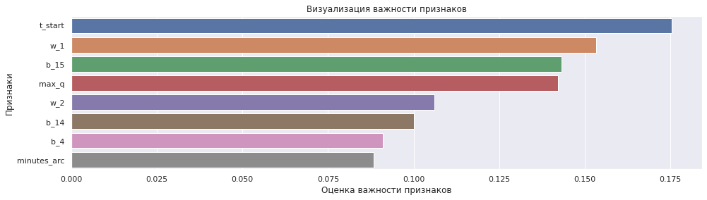
    


## Общий вывод

**I. В результате предварительного анализа данных, установлено:**

1. В столбце "Время замера" таблицы `data_temp` (результаты измерения температуры) тип object, а должен быть datetime.
2. В столбце "Начало нагрева дугой" таблицы `data_arc` (данные об электродах) тип object, а должен быть datetime.
3. В столбце "Конец нагрева дугой" таблицы `data_arc` (данные об электродах) тип object, а должен быть datetime.
4. Во всех столбцах таблиц `data_wire_time` (данные о проволочных материалах (время)), `data_bulk_time` (данные о подаче сыпучих материалов (время)) тип object, а должен быть datetime.

**II. В результате анализа описательной статистики и пропусков, установлено:**

1. В таблице `data_wire` (данные о проволочных материалах (объём)) многие столбцы имеют пропуски от 0.84% до 99.97%.
2. В таблице `data_temp` (результаты измерения температуры) в столбце "Температура" имеется 18.24% пропусков.
3. В таблице `data_bulk` (данные о подаче сыпучих материалов (объём)) многие столбцы имеют пропуски от 10.32% до 99.97%.
4. В таблице `data_arc` (данные об электродах) в столбце "Реактивная мощность" обнаружено аномальное минимальное значение: - 715.504924.

**III. На основе предварительного анализа данных, для дальнейшего исследования установлены следующие положения:**

1. Поскольку случайные величины всегда порождаются бесконечным количеством причин и чаще всего ни одна из них не имеет дисперсии, сравнимой с дисперсией самой случайной величины, то большинство встречающихся **в практике** случайных величин подчинено **нормальному закону распределения**. [Нормальное распределение — **наиболее распространенное в природе распределение** непрерывных величин. Математическим обоснованием этого факта служит центральная предельная теорема](http://datascientist.one/central-limit-theorem/).

2. **Выбросом** считается наблюдение, которое лежит аномально далеко от остальных из серии параллельных наблюдений. Т.е. выбросы – это значения количественного признака, располагающиеся на краях интервала допустимых значений. Таким образом, при определении выбросов будем опираться на значения 0-перцентиля и 100-перцентиля, а также рекомендации бизнеса и особенности технологического процесса. **Удалению будут подлежать супервыбросы (относительно далеко отстающие единичные значения или небольшие группы  относительно основного распределения).**

**IV. Таким образом, для дальнейшего моделирования необходимо вынести следующие тезисы:**

1. так как при моделировании будет решаться задача регрессе, то для нее лучше вообще убрать столбцы с временем, так как модель может начать пытаться найти функциональную связь в датах и времени;
2. исходя из технологического процесса пропуски в таблицах `data_wire` и `data_bulk` обусловлены тем, что на каких-то итерациях процесса просто не добавляли либо проволочных материалов, либо сыпучих материалов, поэтому целесообразно их заполнить нулями;
3. в таблице `data_temp` в столбце "Температура" находится целевой признак и, поэтому мы будем вынуждены удалить строки с пропусками, так же стоит поступить с  супервыбросами, обнаруженными:
    - в таблице `data_arc` столбец «Реактивная мощность» при этом для моделирования возьмём диапазон значений [0, 3.5];
    - в таблице `data_temp` столбец «Температура», при этом для моделирования возьмём диапазон значений [1400, 1705] (целевой признак);
    - в таблице `data_wire` столбец «Wire 1», при этом для моделирования возьмём диапазон значений [0, 260];
    - в таблице `data_wire` столбец «Wire 2», при этом для моделирования возьмём диапазон значений [0, 260];
    - в таблице `data_bulk` столбец «Bulk 12», при этом для моделирования возьмём диапазон значений [0, 1000];
    - в таблице `data_bulk` столбец «Bulk 15», при этом для моделирования возьмём диапазон значений [0, 400].

**V. В результате подготовки данных:**

1. Устранена мультиколлинеарность.
2. Перед моделированием применено масштабирование.

**VI. В результате обучения и подбора лучших параметров моделей, установлено:**

1. Лучшая модель: XGBRegressor.
2. Параметры лучшей модели: {'colsample_bytree': 0.7, 'learning_rate': 0.05, 'max_depth': 5, 'min_child_weight': 4, 'n_estimators': 200, 'nthread': 4, 'objective': 'reg:linear', 'silent': 1, 'subsample': 0.7}.
3. Качество модели (MAE): 6.904.

**VII. В результате проверки качества модели на тестовой выборке:**

1.  MAE лучшей модели на тестовой выборке: 6.7.
2.  Значение MAE удовлетворяет условию бизнеса: MAE ≤ 6.8.
3.  В тройку самых значимых факторов входит:
  * начальная температура;
  * объем проволочных материалов;
  * объем сыпучих материалов.
