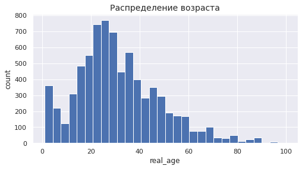
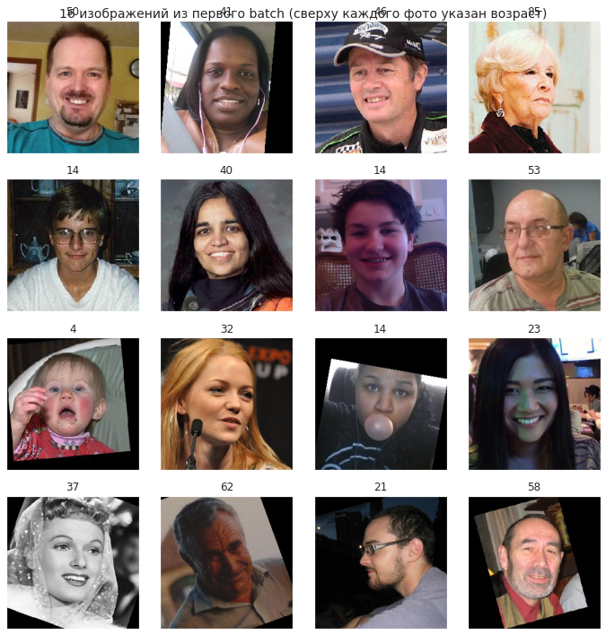

## Исследовательский анализ данных


```python
%pip install tensorflow
```

    Looking in indexes: https://pypi.org/simple, https://us-python.pkg.dev/colab-wheels/public/simple/
    Requirement already satisfied: tensorflow in /usr/local/lib/python3.7/dist-packages (2.9.2)
    Requirement already satisfied: google-pasta>=0.1.1 in /usr/local/lib/python3.7/dist-packages (from tensorflow) (0.2.0)
    Requirement already satisfied: h5py>=2.9.0 in /usr/local/lib/python3.7/dist-packages (from tensorflow) (3.1.0)
    Requirement already satisfied: protobuf<3.20,>=3.9.2 in /usr/local/lib/python3.7/dist-packages (from tensorflow) (3.17.3)
    Requirement already satisfied: tensorflow-io-gcs-filesystem>=0.23.1 in /usr/local/lib/python3.7/dist-packages (from tensorflow) (0.27.0)
    Requirement already satisfied: packaging in /usr/local/lib/python3.7/dist-packages (from tensorflow) (21.3)
    Requirement already satisfied: numpy>=1.20 in /usr/local/lib/python3.7/dist-packages (from tensorflow) (1.21.6)
    Requirement already satisfied: opt-einsum>=2.3.2 in /usr/local/lib/python3.7/dist-packages (from tensorflow) (3.3.0)
    Requirement already satisfied: astunparse>=1.6.0 in /usr/local/lib/python3.7/dist-packages (from tensorflow) (1.6.3)
    Requirement already satisfied: grpcio<2.0,>=1.24.3 in /usr/local/lib/python3.7/dist-packages (from tensorflow) (1.49.1)
    Requirement already satisfied: six>=1.12.0 in /usr/local/lib/python3.7/dist-packages (from tensorflow) (1.15.0)
    Requirement already satisfied: tensorboard<2.10,>=2.9 in /usr/local/lib/python3.7/dist-packages (from tensorflow) (2.9.1)
    Requirement already satisfied: tensorflow-estimator<2.10.0,>=2.9.0rc0 in /usr/local/lib/python3.7/dist-packages (from tensorflow) (2.9.0)
    Requirement already satisfied: typing-extensions>=3.6.6 in /usr/local/lib/python3.7/dist-packages (from tensorflow) (4.1.1)
    Requirement already satisfied: flatbuffers<2,>=1.12 in /usr/local/lib/python3.7/dist-packages (from tensorflow) (1.12)
    Requirement already satisfied: termcolor>=1.1.0 in /usr/local/lib/python3.7/dist-packages (from tensorflow) (2.0.1)
    Requirement already satisfied: libclang>=13.0.0 in /usr/local/lib/python3.7/dist-packages (from tensorflow) (14.0.6)
    Requirement already satisfied: absl-py>=1.0.0 in /usr/local/lib/python3.7/dist-packages (from tensorflow) (1.3.0)
    Requirement already satisfied: wrapt>=1.11.0 in /usr/local/lib/python3.7/dist-packages (from tensorflow) (1.14.1)
    Requirement already satisfied: keras-preprocessing>=1.1.1 in /usr/local/lib/python3.7/dist-packages (from tensorflow) (1.1.2)
    Requirement already satisfied: keras<2.10.0,>=2.9.0rc0 in /usr/local/lib/python3.7/dist-packages (from tensorflow) (2.9.0)
    Requirement already satisfied: gast<=0.4.0,>=0.2.1 in /usr/local/lib/python3.7/dist-packages (from tensorflow) (0.4.0)
    Requirement already satisfied: setuptools in /usr/local/lib/python3.7/dist-packages (from tensorflow) (57.4.0)
    Requirement already satisfied: wheel<1.0,>=0.23.0 in /usr/local/lib/python3.7/dist-packages (from astunparse>=1.6.0->tensorflow) (0.37.1)
    Requirement already satisfied: cached-property in /usr/local/lib/python3.7/dist-packages (from h5py>=2.9.0->tensorflow) (1.5.2)
    Requirement already satisfied: tensorboard-plugin-wit>=1.6.0 in /usr/local/lib/python3.7/dist-packages (from tensorboard<2.10,>=2.9->tensorflow) (1.8.1)
    Requirement already satisfied: google-auth-oauthlib<0.5,>=0.4.1 in /usr/local/lib/python3.7/dist-packages (from tensorboard<2.10,>=2.9->tensorflow) (0.4.6)
    Requirement already satisfied: werkzeug>=1.0.1 in /usr/local/lib/python3.7/dist-packages (from tensorboard<2.10,>=2.9->tensorflow) (1.0.1)
    Requirement already satisfied: google-auth<3,>=1.6.3 in /usr/local/lib/python3.7/dist-packages (from tensorboard<2.10,>=2.9->tensorflow) (1.35.0)
    Requirement already satisfied: markdown>=2.6.8 in /usr/local/lib/python3.7/dist-packages (from tensorboard<2.10,>=2.9->tensorflow) (3.4.1)
    Requirement already satisfied: tensorboard-data-server<0.7.0,>=0.6.0 in /usr/local/lib/python3.7/dist-packages (from tensorboard<2.10,>=2.9->tensorflow) (0.6.1)
    Requirement already satisfied: requests<3,>=2.21.0 in /usr/local/lib/python3.7/dist-packages (from tensorboard<2.10,>=2.9->tensorflow) (2.23.0)
    Requirement already satisfied: pyasn1-modules>=0.2.1 in /usr/local/lib/python3.7/dist-packages (from google-auth<3,>=1.6.3->tensorboard<2.10,>=2.9->tensorflow) (0.2.8)
    Requirement already satisfied: cachetools<5.0,>=2.0.0 in /usr/local/lib/python3.7/dist-packages (from google-auth<3,>=1.6.3->tensorboard<2.10,>=2.9->tensorflow) (4.2.4)
    Requirement already satisfied: rsa<5,>=3.1.4 in /usr/local/lib/python3.7/dist-packages (from google-auth<3,>=1.6.3->tensorboard<2.10,>=2.9->tensorflow) (4.9)
    Requirement already satisfied: requests-oauthlib>=0.7.0 in /usr/local/lib/python3.7/dist-packages (from google-auth-oauthlib<0.5,>=0.4.1->tensorboard<2.10,>=2.9->tensorflow) (1.3.1)
    Requirement already satisfied: importlib-metadata>=4.4 in /usr/local/lib/python3.7/dist-packages (from markdown>=2.6.8->tensorboard<2.10,>=2.9->tensorflow) (4.13.0)
    Requirement already satisfied: zipp>=0.5 in /usr/local/lib/python3.7/dist-packages (from importlib-metadata>=4.4->markdown>=2.6.8->tensorboard<2.10,>=2.9->tensorflow) (3.9.0)
    Requirement already satisfied: pyasn1<0.5.0,>=0.4.6 in /usr/local/lib/python3.7/dist-packages (from pyasn1-modules>=0.2.1->google-auth<3,>=1.6.3->tensorboard<2.10,>=2.9->tensorflow) (0.4.8)
    Requirement already satisfied: urllib3!=1.25.0,!=1.25.1,<1.26,>=1.21.1 in /usr/local/lib/python3.7/dist-packages (from requests<3,>=2.21.0->tensorboard<2.10,>=2.9->tensorflow) (1.24.3)
    Requirement already satisfied: chardet<4,>=3.0.2 in /usr/local/lib/python3.7/dist-packages (from requests<3,>=2.21.0->tensorboard<2.10,>=2.9->tensorflow) (3.0.4)
    Requirement already satisfied: idna<3,>=2.5 in /usr/local/lib/python3.7/dist-packages (from requests<3,>=2.21.0->tensorboard<2.10,>=2.9->tensorflow) (2.10)
    Requirement already satisfied: certifi>=2017.4.17 in /usr/local/lib/python3.7/dist-packages (from requests<3,>=2.21.0->tensorboard<2.10,>=2.9->tensorflow) (2022.9.24)
    Requirement already satisfied: oauthlib>=3.0.0 in /usr/local/lib/python3.7/dist-packages (from requests-oauthlib>=0.7.0->google-auth-oauthlib<0.5,>=0.4.1->tensorboard<2.10,>=2.9->tensorflow) (3.2.1)
    Requirement already satisfied: pyparsing!=3.0.5,>=2.0.2 in /usr/local/lib/python3.7/dist-packages (from packaging->tensorflow) (3.0.9)
    


```python
%pip install keras
```

    Looking in indexes: https://pypi.org/simple, https://us-python.pkg.dev/colab-wheels/public/simple/
    Requirement already satisfied: keras in /usr/local/lib/python3.7/dist-packages (2.9.0)
    


```python
%pip install seaborn
```

    Looking in indexes: https://pypi.org/simple, https://us-python.pkg.dev/colab-wheels/public/simple/
    Requirement already satisfied: seaborn in /usr/local/lib/python3.7/dist-packages (0.11.2)
    Requirement already satisfied: matplotlib>=2.2 in /usr/local/lib/python3.7/dist-packages (from seaborn) (3.2.2)
    Requirement already satisfied: pandas>=0.23 in /usr/local/lib/python3.7/dist-packages (from seaborn) (1.3.5)
    Requirement already satisfied: scipy>=1.0 in /usr/local/lib/python3.7/dist-packages (from seaborn) (1.7.3)
    Requirement already satisfied: numpy>=1.15 in /usr/local/lib/python3.7/dist-packages (from seaborn) (1.21.6)
    Requirement already satisfied: cycler>=0.10 in /usr/local/lib/python3.7/dist-packages (from matplotlib>=2.2->seaborn) (0.11.0)
    Requirement already satisfied: kiwisolver>=1.0.1 in /usr/local/lib/python3.7/dist-packages (from matplotlib>=2.2->seaborn) (1.4.4)
    Requirement already satisfied: python-dateutil>=2.1 in /usr/local/lib/python3.7/dist-packages (from matplotlib>=2.2->seaborn) (2.8.2)
    Requirement already satisfied: pyparsing!=2.0.4,!=2.1.2,!=2.1.6,>=2.0.1 in /usr/local/lib/python3.7/dist-packages (from matplotlib>=2.2->seaborn) (3.0.9)
    Requirement already satisfied: typing-extensions in /usr/local/lib/python3.7/dist-packages (from kiwisolver>=1.0.1->matplotlib>=2.2->seaborn) (4.1.1)
    Requirement already satisfied: pytz>=2017.3 in /usr/local/lib/python3.7/dist-packages (from pandas>=0.23->seaborn) (2022.4)
    Requirement already satisfied: six>=1.5 in /usr/local/lib/python3.7/dist-packages (from python-dateutil>=2.1->matplotlib>=2.2->seaborn) (1.15.0)
    


```python
import pandas as pd
import numpy as np
import matplotlib.pyplot as plt
import seaborn as sns
from tensorflow import keras
from tensorflow.keras.preprocessing.image import ImageDataGenerator
from sklearn.model_selection import train_test_split
from sklearn.metrics import mean_absolute_error
from sklearn.metrics import r2_score

from tensorflow.keras.applications.xception import Xception
from tensorflow.keras.layers import GlobalAveragePooling2D, Dense
from tensorflow.keras.models import Sequential, model_from_json
from tensorflow.keras.callbacks import ModelCheckpoint
from tensorflow.keras.optimizers import Adam

import os
import warnings
warnings.simplefilter("ignore")
```


```python
# просмотр, где находится каталог с файлами на COLAB
from google.colab import drive
drive.mount('/content/drive')
```

    Drive already mounted at /content/drive; to attempt to forcibly remount, call drive.mount("/content/drive", force_remount=True).
    


```python
# получение доступа к каталогу и уточнение названия папок
import os
os.listdir('/content/drive/My Drive/Colab Notebooks/Яндекс/Проект 14/archive.zip (Unzipped Files)/final_files')
```


    ['final_files']


```python
# загрузка данных
labels = pd.read_csv('/content/drive/My Drive/Colab Notebooks/Яндекс/Проект 14/archive.zip (Unzipped Files)/labels.csv')
train_datagen = ImageDataGenerator(rescale=1./255)
train_gen_flow = train_datagen.flow_from_dataframe(
        dataframe=labels,
        directory='/content/drive/My Drive/Colab Notebooks/Яндекс/Проект 14/archive.zip (Unzipped Files)/final_files/final_files/',
        x_col='file_name',
        y_col='real_age',
        target_size=(224, 224),
        batch_size=32,
        class_mode='raw',
        seed=12345) 
```

    Found 7591 validated image filenames.
    


```python
features, target = next(train_gen_flow)
```


```python
features.shape
```


    (32, 224, 224, 3)


```python
target.shape
```


    (32,)


```python
type(target)
```


    numpy.ndarray


```python
type(features)
```


    numpy.ndarray


```python
labels.head()
```


  <div id="df-4d8b3424-2941-482f-8b37-8a32d8e02af0">
    <div class="colab-df-container">
      <div>
<style scoped>
    .dataframe tbody tr th:only-of-type {
        vertical-align: middle;
    }

    .dataframe tbody tr th {
        vertical-align: top;
    }

    .dataframe thead th {
        text-align: right;
    }
</style>
<table border="1" class="dataframe">
  <thead>
    <tr style="text-align: right;">
      <th></th>
      <th>file_name</th>
      <th>real_age</th>
    </tr>
  </thead>
  <tbody>
    <tr>
      <th>0</th>
      <td>000000.jpg</td>
      <td>4</td>
    </tr>
    <tr>
      <th>1</th>
      <td>000001.jpg</td>
      <td>18</td>
    </tr>
    <tr>
      <th>2</th>
      <td>000002.jpg</td>
      <td>80</td>
    </tr>
    <tr>
      <th>3</th>
      <td>000003.jpg</td>
      <td>50</td>
    </tr>
    <tr>
      <th>4</th>
      <td>000004.jpg</td>
      <td>17</td>
    </tr>
  </tbody>
</table>
</div>
      <button class="colab-df-convert" onclick="convertToInteractive('df-4d8b3424-2941-482f-8b37-8a32d8e02af0')"
              title="Convert this dataframe to an interactive table."
              style="display:none;">

  <svg xmlns="http://www.w3.org/2000/svg" height="24px"viewBox="0 0 24 24"
       width="24px">
    <path d="M0 0h24v24H0V0z" fill="none"/>
    <path d="M18.56 5.44l.94 2.06.94-2.06 2.06-.94-2.06-.94-.94-2.06-.94 2.06-2.06.94zm-11 1L8.5 8.5l.94-2.06 2.06-.94-2.06-.94L8.5 2.5l-.94 2.06-2.06.94zm10 10l.94 2.06.94-2.06 2.06-.94-2.06-.94-.94-2.06-.94 2.06-2.06.94z"/><path d="M17.41 7.96l-1.37-1.37c-.4-.4-.92-.59-1.43-.59-.52 0-1.04.2-1.43.59L10.3 9.45l-7.72 7.72c-.78.78-.78 2.05 0 2.83L4 21.41c.39.39.9.59 1.41.59.51 0 1.02-.2 1.41-.59l7.78-7.78 2.81-2.81c.8-.78.8-2.07 0-2.86zM5.41 20L4 18.59l7.72-7.72 1.47 1.35L5.41 20z"/>
  </svg>
      </button>

  <style>
    .colab-df-container {
      display:flex;
      flex-wrap:wrap;
      gap: 12px;
    }

    .colab-df-convert {
      background-color: #E8F0FE;
      border: none;
      border-radius: 50%;
      cursor: pointer;
      display: none;
      fill: #1967D2;
      height: 32px;
      padding: 0 0 0 0;
      width: 32px;
    }

    .colab-df-convert:hover {
      background-color: #E2EBFA;
      box-shadow: 0px 1px 2px rgba(60, 64, 67, 0.3), 0px 1px 3px 1px rgba(60, 64, 67, 0.15);
      fill: #174EA6;
    }

    [theme=dark] .colab-df-convert {
      background-color: #3B4455;
      fill: #D2E3FC;
    }

    [theme=dark] .colab-df-convert:hover {
      background-color: #434B5C;
      box-shadow: 0px 1px 3px 1px rgba(0, 0, 0, 0.15);
      filter: drop-shadow(0px 1px 2px rgba(0, 0, 0, 0.3));
      fill: #FFFFFF;
    }
  </style>

      <script>
        const buttonEl =
          document.querySelector('#df-4d8b3424-2941-482f-8b37-8a32d8e02af0 button.colab-df-convert');
        buttonEl.style.display =
          google.colab.kernel.accessAllowed ? 'block' : 'none';

        async function convertToInteractive(key) {
          const element = document.querySelector('#df-4d8b3424-2941-482f-8b37-8a32d8e02af0');
          const dataTable =
            await google.colab.kernel.invokeFunction('convertToInteractive',
                                                     [key], {});
          if (!dataTable) return;

          const docLinkHtml = 'Like what you see? Visit the ' +
            '<a target="_blank" href=https://colab.research.google.com/notebooks/data_table.ipynb>data table notebook</a>'
            + ' to learn more about interactive tables.';
          element.innerHTML = '';
          dataTable['output_type'] = 'display_data';
          await google.colab.output.renderOutput(dataTable, element);
          const docLink = document.createElement('div');
          docLink.innerHTML = docLinkHtml;
          element.appendChild(docLink);
        }
      </script>
    </div>
  </div>


```python
labels.info()
```

    <class 'pandas.core.frame.DataFrame'>
    RangeIndex: 7591 entries, 0 to 7590
    Data columns (total 2 columns):
     #   Column     Non-Null Count  Dtype 
    ---  ------     --------------  ----- 
     0   file_name  7591 non-null   object
     1   real_age   7591 non-null   int64 
    dtypes: int64(1), object(1)
    memory usage: 118.7+ KB
    


```python
labels.describe()
```


  <div id="df-e48d1f83-701b-4ab4-92d8-b0b1efb7ac31">
    <div class="colab-df-container">
      <div>
<style scoped>
    .dataframe tbody tr th:only-of-type {
        vertical-align: middle;
    }

    .dataframe tbody tr th {
        vertical-align: top;
    }

    .dataframe thead th {
        text-align: right;
    }
</style>
<table border="1" class="dataframe">
  <thead>
    <tr style="text-align: right;">
      <th></th>
      <th>real_age</th>
    </tr>
  </thead>
  <tbody>
    <tr>
      <th>count</th>
      <td>7591.000000</td>
    </tr>
    <tr>
      <th>mean</th>
      <td>31.201159</td>
    </tr>
    <tr>
      <th>std</th>
      <td>17.145060</td>
    </tr>
    <tr>
      <th>min</th>
      <td>1.000000</td>
    </tr>
    <tr>
      <th>25%</th>
      <td>20.000000</td>
    </tr>
    <tr>
      <th>50%</th>
      <td>29.000000</td>
    </tr>
    <tr>
      <th>75%</th>
      <td>41.000000</td>
    </tr>
    <tr>
      <th>max</th>
      <td>100.000000</td>
    </tr>
  </tbody>
</table>
</div>
      <button class="colab-df-convert" onclick="convertToInteractive('df-e48d1f83-701b-4ab4-92d8-b0b1efb7ac31')"
              title="Convert this dataframe to an interactive table."
              style="display:none;">

  <svg xmlns="http://www.w3.org/2000/svg" height="24px"viewBox="0 0 24 24"
       width="24px">
    <path d="M0 0h24v24H0V0z" fill="none"/>
    <path d="M18.56 5.44l.94 2.06.94-2.06 2.06-.94-2.06-.94-.94-2.06-.94 2.06-2.06.94zm-11 1L8.5 8.5l.94-2.06 2.06-.94-2.06-.94L8.5 2.5l-.94 2.06-2.06.94zm10 10l.94 2.06.94-2.06 2.06-.94-2.06-.94-.94-2.06-.94 2.06-2.06.94z"/><path d="M17.41 7.96l-1.37-1.37c-.4-.4-.92-.59-1.43-.59-.52 0-1.04.2-1.43.59L10.3 9.45l-7.72 7.72c-.78.78-.78 2.05 0 2.83L4 21.41c.39.39.9.59 1.41.59.51 0 1.02-.2 1.41-.59l7.78-7.78 2.81-2.81c.8-.78.8-2.07 0-2.86zM5.41 20L4 18.59l7.72-7.72 1.47 1.35L5.41 20z"/>
  </svg>
      </button>

  <style>
    .colab-df-container {
      display:flex;
      flex-wrap:wrap;
      gap: 12px;
    }

    .colab-df-convert {
      background-color: #E8F0FE;
      border: none;
      border-radius: 50%;
      cursor: pointer;
      display: none;
      fill: #1967D2;
      height: 32px;
      padding: 0 0 0 0;
      width: 32px;
    }

    .colab-df-convert:hover {
      background-color: #E2EBFA;
      box-shadow: 0px 1px 2px rgba(60, 64, 67, 0.3), 0px 1px 3px 1px rgba(60, 64, 67, 0.15);
      fill: #174EA6;
    }

    [theme=dark] .colab-df-convert {
      background-color: #3B4455;
      fill: #D2E3FC;
    }

    [theme=dark] .colab-df-convert:hover {
      background-color: #434B5C;
      box-shadow: 0px 1px 3px 1px rgba(0, 0, 0, 0.15);
      filter: drop-shadow(0px 1px 2px rgba(0, 0, 0, 0.3));
      fill: #FFFFFF;
    }
  </style>

      <script>
        const buttonEl =
          document.querySelector('#df-e48d1f83-701b-4ab4-92d8-b0b1efb7ac31 button.colab-df-convert');
        buttonEl.style.display =
          google.colab.kernel.accessAllowed ? 'block' : 'none';

        async function convertToInteractive(key) {
          const element = document.querySelector('#df-e48d1f83-701b-4ab4-92d8-b0b1efb7ac31');
          const dataTable =
            await google.colab.kernel.invokeFunction('convertToInteractive',
                                                     [key], {});
          if (!dataTable) return;

          const docLinkHtml = 'Like what you see? Visit the ' +
            '<a target="_blank" href=https://colab.research.google.com/notebooks/data_table.ipynb>data table notebook</a>'
            + ' to learn more about interactive tables.';
          element.innerHTML = '';
          dataTable['output_type'] = 'display_data';
          await google.colab.output.renderOutput(dataTable, element);
          const docLink = document.createElement('div');
          docLink.innerHTML = docLinkHtml;
          element.appendChild(docLink);
        }
      </script>
    </div>
  </div>


```python
labels.median()
```


    real_age    29.0
    dtype: float64


```python
sns.set(style="darkgrid")
labels['real_age'].plot(kind='hist', figsize=(8,4), bins=30)
plt.title("Распределение возраста", fontsize=14)
plt.xlabel("real_age")
plt.ylabel("count");
```


    

    


```python
# выводим 16 изображений
fig = plt.figure(figsize=(10,10))
plt.suptitle("16 изображений из первого batch (сверху каждого фото указан возраст)", fontsize=14)
for i in range(16):
    fig.add_subplot(4, 4, i+1)
    plt.imshow(features[i])
    num = pd.DataFrame(target)[0][i]
    plt.title(num)
	# для компактности удаляем оси и прижимаем изображения друг к другу
    plt.xticks([])
    plt.yticks([])
    plt.tight_layout()
```


    

    


## Вывод

**В результате исследовательского анализа, установлено:**

* общее число фотографий в датасете 7591;
* target_size=(224, 224);
* batch_size=32;
* распределение возрастов по типу Пуассона;
* среднее (31) значение смещено вправо относительно медианного (29);
* максимальный возраст - 100, минимальный - 1.

# Обучение модели


```python
def load_train(path):
    #labels = pd.read_csv(path)
    labels = pd.read_csv(path + 'labels.csv')
    train_datagen = ImageDataGenerator(validation_split = 0.25, rescale=1./255, horizontal_flip=True,
                                       width_shift_range=0.1,
                                       height_shift_range=0.1)
    train_gen_flow = train_datagen.flow_from_dataframe(
        dataframe=labels,
        directory= path + 'final_files/final_files',
        x_col='file_name',
        y_col='real_age',
        target_size=(224, 224),
        batch_size=32,
        class_mode='raw',
        subset='training',
        seed=12345) 
 
    return train_gen_flow
```


```python
def load_test(path):
    labels = pd.read_csv(path + 'labels.csv')
   # labels = pd.read_csv(path)
    test_datagen = ImageDataGenerator(validation_split = 0.25, rescale=1./255)
    test_gen_flow = test_datagen.flow_from_dataframe(
        dataframe=labels,
        directory=path + 'final_files/final_files',
        x_col='file_name',
        y_col='real_age',
        target_size=(224, 224),
        batch_size=32,
        class_mode='raw',
        subset='validation',
        seed=12345) 
 
    return test_gen_flow
```


```python
def create_model(input_shape):
    backbone = Xception(input_shape=(224, 224, 3),
                    weights='imagenet',
                    include_top=False) 
    # замораживаем Xception без верхушки
    #backbone.trainable = False
    model = Sequential()
    model.add(backbone)
    model.add(GlobalAveragePooling2D())
    model.add(Dense(1, activation='relu')) 

    return model
```


```python
input_shape=(224, 224, 3)
```


```python
def train_model(model, train_data, test_data, batch_size=None, epochs=10, steps_per_epoch=None, validation_steps=None):
 
    weights_file = 'weights.h5'
    callback = ModelCheckpoint(weights_file,
                               monitor='val_mape',
                               mode='min',
                               save_best_only=True)
    
    optimizer = Adam()
    model.compile(optimizer=optimizer, loss='mae', 
                  metrics=['mape'])
    
    model.fit(train_data, 
              validation_data= test_data,
              epochs=epochs,
              steps_per_epoch=len(train_data),
              validation_steps=len(test_data),
              verbose=2, 
              callbacks=[callback])
    
    json_file = 'model.json'
    model_json = model.to_json()
    with open(json_file, 'w') as f:
        f.write(model_json)
        
    with open(json_file, 'r') as f:
        loaded_model = model_from_json(f.read())
    loaded_model.load_weights('weights.h5')
 
    return loaded_model
```

**Процесс обучения реализуем на бесплатной GPU платформе от Google Colab. Ввиду большой ресурсоемкости будем обучать модель на 2-х эпохах с сохранением лучшей модели и ее весов, а затем опять обучением на 2-х эпохах (на 4-м этапе в 4-х эпохах) с повторением процесса сохранения и т.д. При этом в начале Learning_rate будет по умолчанию (0,001), а затем уменьшим его до 0,0001.**

## I этап (обучение в 2-х эпохах, Learning_rate = 0.001)


```python
%%time
best_model_v1  = train_model(create_model(input_shape),
            load_train('/content/drive/My Drive/Colab Notebooks/Яндекс/Проект 14/archive.zip (Unzipped Files)/'),
            load_test('/content/drive/My Drive/Colab Notebooks/Яндекс/Проект 14/archive.zip (Unzipped Files)/'),
            batch_size=None, epochs=2, steps_per_epoch=None, validation_steps=None)
```

    Downloading data from https://storage.googleapis.com/tensorflow/keras-applications/xception/xception_weights_tf_dim_ordering_tf_kernels_notop.h5
    83683744/83683744 [==============================] - 1s 0us/step
    Found 5694 validated image filenames.
    Found 1897 validated image filenames.
    Epoch 1/2
    178/178 - 1862s - loss: 12.5255 - mape: 53.8986 - val_loss: 13.0045 - val_mape: 93.3014 - 1862s/epoch - 10s/step
    Epoch 2/2
    178/178 - 133s - loss: 8.3101 - mape: 43.5210 - val_loss: 16.0493 - val_mape: 124.2830 - 133s/epoch - 747ms/step
    CPU times: user 6min 52s, sys: 9.44 s, total: 7min 2s
    Wall time: 33min 45s
    

## Вывод

* val_loss: 13.0045;
* val_mape: 93.3014;
* модель с весами сохранена в best_model_v1.

## II этап (обучение в 2-х эпохах, Learning_rate = 0.001)


```python
%%time
best_model_v2  = train_model(best_model_v1,
            load_train('/content/drive/My Drive/Colab Notebooks/Яндекс/Проект 14/archive.zip (Unzipped Files)/'),
            load_test('/content/drive/My Drive/Colab Notebooks/Яндекс/Проект 14/archive.zip (Unzipped Files)/'),
            batch_size=None, epochs=2, steps_per_epoch=None, validation_steps=None)
```

    Found 5694 validated image filenames.
    Found 1897 validated image filenames.
    Epoch 1/2
    178/178 - 138s - loss: 8.5501 - mape: 44.5439 - val_loss: 16.9249 - val_mape: 112.1419 - 138s/epoch - 778ms/step
    Epoch 2/2
    178/178 - 134s - loss: 7.5866 - mape: 40.9276 - val_loss: 11.2387 - val_mape: 52.3709 - 134s/epoch - 753ms/step
    CPU times: user 7min 5s, sys: 8.05 s, total: 7min 13s
    Wall time: 4min 46s
    

## Вывод

* модель с весами сохранена в best_model_v2;
* val_loss: 11.2387;
* val_mape: 52.3709.

## III этап (обучение в 2-х эпохах, Learning_rate = 0.001)


```python
%%time
best_model_v3  = train_model(best_model_v2,
            load_train('/content/drive/My Drive/Colab Notebooks/Яндекс/Проект 14/archive.zip (Unzipped Files)/'),
            load_test('/content/drive/My Drive/Colab Notebooks/Яндекс/Проект 14/archive.zip (Unzipped Files)/'),
            batch_size=None, epochs=2, steps_per_epoch=None, validation_steps=None)
```

    Found 5694 validated image filenames.
    Found 1897 validated image filenames.
    Epoch 1/2
    178/178 - 140s - loss: 6.4438 - mape: 31.7556 - val_loss: 7.1618 - val_mape: 48.7640 - 140s/epoch - 789ms/step
    Epoch 2/2
    178/178 - 137s - loss: 6.2074 - mape: 29.3362 - val_loss: 6.3906 - val_mape: 29.3306 - 137s/epoch - 768ms/step
    CPU times: user 7min 12s, sys: 7.58 s, total: 7min 19s
    Wall time: 4min 42s
    

## Вывод

* лучшая модель с весами сохранена в best_model_v3;
* val_loss: 6.3906;
* val_mape: 29.3306.

## IV этап (обучение в 4-х эпохах, Learning_rate = 0.001)


```python
%%time
best_model_v4  = train_model(best_model_v3,
            load_train('/content/drive/My Drive/Colab Notebooks/Яндекс/Проект 14/archive.zip (Unzipped Files)/'),
            load_test('/content/drive/My Drive/Colab Notebooks/Яндекс/Проект 14/archive.zip (Unzipped Files)/'),
            batch_size=None, epochs=4, steps_per_epoch=None, validation_steps=None)
```

    Found 5694 validated image filenames.
    Found 1897 validated image filenames.
    Epoch 1/4
    178/178 - 141s - loss: 5.8621 - mape: 27.8894 - val_loss: 6.5420 - val_mape: 33.4789 - 141s/epoch - 791ms/step
    Epoch 2/4
    178/178 - 135s - loss: 5.7852 - mape: 27.7186 - val_loss: 7.5924 - val_mape: 31.8755 - 135s/epoch - 758ms/step
    Epoch 3/4
    178/178 - 133s - loss: 5.4602 - mape: 25.7838 - val_loss: 6.0730 - val_mape: 31.9527 - 133s/epoch - 749ms/step
    Epoch 4/4
    178/178 - 132s - loss: 5.3119 - mape: 25.7437 - val_loss: 6.4724 - val_mape: 33.5575 - 132s/epoch - 741ms/step
    CPU times: user 14min 5s, sys: 14.5 s, total: 14min 19s
    Wall time: 9min 16s
    

## Вывод

* лучшая модель с весами сохранена в best_model_v4;
* val_loss: 7.5924;
* val_mape: 31.8755.

## V этап (обучение в 2-х эпохах, Learning_rate = 0.001)


```python
%%time
best_model_v5  = train_model(best_model_v4,
            load_train('/content/drive/My Drive/Colab Notebooks/Яндекс/Проект 14/archive.zip (Unzipped Files)/'),
            load_test('/content/drive/My Drive/Colab Notebooks/Яндекс/Проект 14/archive.zip (Unzipped Files)/'),
            batch_size=None, epochs=2, steps_per_epoch=None, validation_steps=None)
```

## Вывод

* лучшая модель с весами сохранена в best_model_v5;
* val_loss: 6.5751;
* val_mape: 29.2222.

## VI этап (обучение в 2-х эпохах, Learning_rate = 0.001)


```python
%%time
best_model_v6  = train_model(best_model_v5,
            load_train('/content/drive/My Drive/Colab Notebooks/Яндекс/Проект 14/archive.zip (Unzipped Files)/'),
            load_test('/content/drive/My Drive/Colab Notebooks/Яндекс/Проект 14/archive.zip (Unzipped Files)/'),
            batch_size=None, epochs=2, steps_per_epoch=None, validation_steps=None)
```

    Found 5694 validated image filenames.
    Found 1897 validated image filenames.
    Epoch 1/2
    178/178 - 146s - loss: 5.2158 - mape: 26.0716 - val_loss: 9.0715 - val_mape: 33.0455 - 146s/epoch - 821ms/step
    Epoch 2/2
    178/178 - 135s - loss: 5.2420 - mape: 24.1483 - val_loss: 6.7867 - val_mape: 29.4694 - 135s/epoch - 759ms/step
    CPU times: user 7min 14s, sys: 8.83 s, total: 7min 22s
    Wall time: 4min 54s
    

## Вывод

* лучшая модель с весами сохранена в best_model_v6;
* val_loss: 6.7867;
* val_mape: 29.4694.

## VII этап (обучение в 2-х эпохах, Learning_rate = 0.001)


```python
%%time
best_model_v7  = train_model(best_model_v6,
            load_train('/content/drive/My Drive/Colab Notebooks/Яндекс/Проект 14/archive.zip (Unzipped Files)/'),
            load_test('/content/drive/My Drive/Colab Notebooks/Яндекс/Проект 14/archive.zip (Unzipped Files)/'),
            batch_size=None, epochs=2, steps_per_epoch=None, validation_steps=None)
```

    Found 5694 validated image filenames.
    Found 1897 validated image filenames.
    Epoch 1/2
    178/178 - 140s - loss: 4.9727 - mape: 23.2353 - val_loss: 8.5092 - val_mape: 34.0996 - 140s/epoch - 787ms/step
    Epoch 2/2
    178/178 - 133s - loss: 4.9557 - mape: 22.3206 - val_loss: 6.1089 - val_mape: 35.9684 - 133s/epoch - 748ms/step
    CPU times: user 7min 6s, sys: 7.72 s, total: 7min 14s
    Wall time: 4min 38s
    

## Вывод

* лучшая модель с весами сохранена в best_model_v7;
* val_loss: 8.5092;
* val_mape: 34.0996.

## VIII этап (обучение в 2-х эпохах, Learning_rate = 0.001)


```python
%%time
best_model_v8  = train_model(best_model_v7,
            load_train('/content/drive/My Drive/Colab Notebooks/Яндекс/Проект 14/archive.zip (Unzipped Files)/'),
            load_test('/content/drive/My Drive/Colab Notebooks/Яндекс/Проект 14/archive.zip (Unzipped Files)/'),
            batch_size=None, epochs=2, steps_per_epoch=None, validation_steps=None)
```

    Found 5694 validated image filenames.
    Found 1897 validated image filenames.
    Epoch 1/2
    178/178 - 143s - loss: 4.8233 - mape: 23.5012 - val_loss: 8.8312 - val_mape: 33.7035 - 143s/epoch - 804ms/step
    Epoch 2/2
    178/178 - 135s - loss: 4.8492 - mape: 23.4007 - val_loss: 5.8466 - val_mape: 28.2312 - 135s/epoch - 759ms/step
    CPU times: user 7min 5s, sys: 8.3 s, total: 7min 13s
    Wall time: 4min 50s
    

## Вывод

* лучшая модель с весами сохранена в best_model_v8;
* val_loss: 5.8466;
* val_mape: 28.2312.

**Для того чтобы спуститься в локальный минимум уменишим Learning_rate до 0.0001**


```python
def train_model_lr(model, train_data, test_data, batch_size=None, epochs=10, steps_per_epoch=None, validation_steps=None):
 
    weights_file = 'weights.h5'
    callback = ModelCheckpoint(weights_file,
                               monitor='val_mape',
                               mode='min',
                               save_best_only=True)
    
    optimizer = Adam(lr=0.0001)
    model.compile(optimizer=optimizer, loss='mae', 
                  metrics=['mape'])
    
    model.fit(train_data, 
              validation_data= test_data,
              epochs=epochs,
              steps_per_epoch=len(train_data),
              validation_steps=len(test_data),
              verbose=2, 
              callbacks=[callback])
    
    json_file = 'model.json'
    model_json = model.to_json()
    with open(json_file, 'w') as f:
        f.write(model_json)
        
    with open(json_file, 'r') as f:
        loaded_model = model_from_json(f.read())
    loaded_model.load_weights('weights.h5')
 
    return loaded_model
```

## IX этап (обучение в 2-х эпохах, Learning_rate = 0.0001)


```python
%%time
best_model_v9  = train_model_lr(best_model_v8,
            load_train('/content/drive/My Drive/Colab Notebooks/Яндекс/Проект 14/archive.zip (Unzipped Files)/'),
            load_test('/content/drive/My Drive/Colab Notebooks/Яндекс/Проект 14/archive.zip (Unzipped Files)/'),
            batch_size=None, epochs=2, steps_per_epoch=None, validation_steps=None)
```

    Found 5694 validated image filenames.
    Found 1897 validated image filenames.
    Epoch 1/2
    178/178 - 144s - loss: 3.8629 - mape: 17.4915 - val_loss: 5.2202 - val_mape: 27.2435 - 144s/epoch - 811ms/step
    Epoch 2/2
    178/178 - 138s - loss: 3.6176 - mape: 16.1723 - val_loss: 5.2458 - val_mape: 25.3494 - 138s/epoch - 775ms/step
    CPU times: user 7min 14s, sys: 8.89 s, total: 7min 23s
    Wall time: 4min 51s
    

## Вывод

* лучшая модель с весами сохранена в best_model_v9;
* val_loss: 5.2458;
* val_mape: 25.3494.

## X этап (обучение в 2-х эпохах, Learning_rate = 0.0001)


```python
%%time
best_model_v10  = train_model_lr(best_model_v9,
            load_train('/content/drive/My Drive/Colab Notebooks/Яндекс/Проект 14/archive.zip (Unzipped Files)/'),
            load_test('/content/drive/My Drive/Colab Notebooks/Яндекс/Проект 14/archive.zip (Unzipped Files)/'),
            batch_size=None, epochs=2, steps_per_epoch=None, validation_steps=None)
```

    Found 5694 validated image filenames.
    Found 1897 validated image filenames.
    Epoch 1/2
    178/178 - 141s - loss: 3.4377 - mape: 15.4631 - val_loss: 5.2075 - val_mape: 24.6453 - 141s/epoch - 794ms/step
    Epoch 2/2
    178/178 - 134s - loss: 3.2705 - mape: 14.8961 - val_loss: 5.1776 - val_mape: 26.3812 - 134s/epoch - 751ms/step
    CPU times: user 7min 10s, sys: 7.62 s, total: 7min 17s
    Wall time: 4min 40s
    

## Вывод

* лучшая модель с весами сохранена в best_model_v10;
* val_loss: 5.2075;
* val_mape: 24.6453.

## Вывод


**В результате обучения:**

1. Размер входного изображения: (224, 224, 3).
2. Применена аугментация: "горизонтальное отражение", "сдвиг по ширине и высоте".
3. Обучение проходило в 10 этапах по 2 эпохи в каждом (за исключением 4-го этапа), при этом до 9-го этапа Learning_rate был равен 0.001, затем 0.0001;
4. Время обучения составило порядка 80 минут на бесплатном GPU от Goole Colab.
5. Лучшее качество модели на валидационной выборке - val_loss: 5.2075 - val_mape: 24.6453;
6. Модель почти готова, так как дает порядка 75% точности, [при максимальных 79% на датасете ImageNet](https://habr.com/ru/post/347564/).

# Анализ модели

1. В качестве базовой модели взята - Xception;
2. Веса взяты с предобученной Xception на ImageNet;
3. В архитектуре Xception отсутствует два последних слоя и она "заморожена" с предобученными весами;
4. Добавлены два слоя: GlobalAveragePooling2D и Dense (функция активации: 'relu');
5. Функция потерь: MAE, метрика качества: MAPE;
6. Выбран итерационный метод, для оптимизации целевой функции - 'adam' до 9-го этапа с шагом: 0.001, после 9-го этапа - 0.0001.
