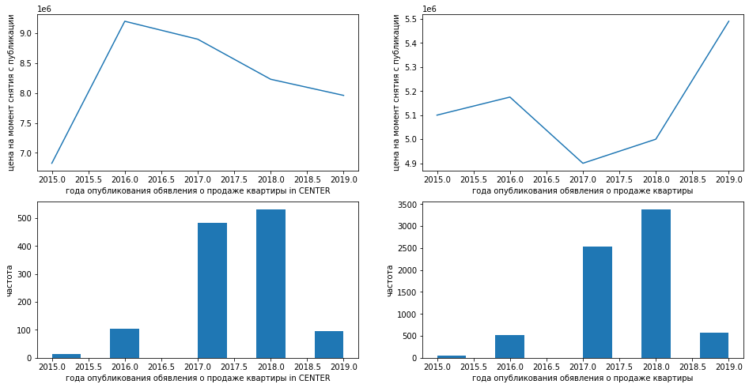

## Изучение данных из файла


```python
import pandas as pd
import matplotlib.pyplot as plt
import warnings
warnings.simplefilter("ignore")
import seaborn as sns

```


```python
# посмотреть, где находится каталог с файлами на COLAB
from google.colab import drive
drive.mount('/content/drive')
```

    Mounted at /content/drive
    


```python
# получить доступ к каталогу и уточнить названия папок
import os
os.listdir('/content/drive/My Drive/Colab Notebooks/Яндекс/Проект 3 Недвижимость')
```


    ['GitHub',
     'Исследование объявлений о продаже квартир.ipynb',
     'real_estate_data.csv',
     'ПРАВКА']


```python
# присвоить переменной путь к файлу в каталоге
path = "/content/drive/My Drive/Colab Notebooks/Яндекс/Проект 3 Недвижимость/real_estate_data.csv"
```


```python
# cчитать данные csv и присвоить им имя
data = pd.read_csv(path, sep = '\t')
```


```python
# просмотр типов данных и кол-ва ненулевых значений
data.info()
```

    <class 'pandas.core.frame.DataFrame'>
    RangeIndex: 23699 entries, 0 to 23698
    Data columns (total 22 columns):
     #   Column                Non-Null Count  Dtype  
    ---  ------                --------------  -----  
     0   total_images          23699 non-null  int64  
     1   last_price            23699 non-null  float64
     2   total_area            23699 non-null  float64
     3   first_day_exposition  23699 non-null  object 
     4   rooms                 23699 non-null  int64  
     5   ceiling_height        14504 non-null  float64
     6   floors_total          23613 non-null  float64
     7   living_area           21796 non-null  float64
     8   floor                 23699 non-null  int64  
     9   is_apartment          2775 non-null   object 
     10  studio                23699 non-null  bool   
     11  open_plan             23699 non-null  bool   
     12  kitchen_area          21421 non-null  float64
     13  balcony               12180 non-null  float64
     14  locality_name         23650 non-null  object 
     15  airports_nearest      18157 non-null  float64
     16  cityCenters_nearest   18180 non-null  float64
     17  parks_around3000      18181 non-null  float64
     18  parks_nearest         8079 non-null   float64
     19  ponds_around3000      18181 non-null  float64
     20  ponds_nearest         9110 non-null   float64
     21  days_exposition       20518 non-null  float64
    dtypes: bool(2), float64(14), int64(3), object(3)
    memory usage: 3.7+ MB
    


```python
data.head(15)
```


  <div id="df-79c456c1-3158-41fa-9743-ec69723554e4">
    <div class="colab-df-container">
      <div>
<style scoped>
    .dataframe tbody tr th:only-of-type {
        vertical-align: middle;
    }

    .dataframe tbody tr th {
        vertical-align: top;
    }

    .dataframe thead th {
        text-align: right;
    }
</style>
<table border="1" class="dataframe">
  <thead>
    <tr style="text-align: right;">
      <th></th>
      <th>total_images</th>
      <th>last_price</th>
      <th>total_area</th>
      <th>first_day_exposition</th>
      <th>rooms</th>
      <th>ceiling_height</th>
      <th>floors_total</th>
      <th>living_area</th>
      <th>floor</th>
      <th>is_apartment</th>
      <th>...</th>
      <th>kitchen_area</th>
      <th>balcony</th>
      <th>locality_name</th>
      <th>airports_nearest</th>
      <th>cityCenters_nearest</th>
      <th>parks_around3000</th>
      <th>parks_nearest</th>
      <th>ponds_around3000</th>
      <th>ponds_nearest</th>
      <th>days_exposition</th>
    </tr>
  </thead>
  <tbody>
    <tr>
      <th>0</th>
      <td>20</td>
      <td>13000000.0</td>
      <td>108.00</td>
      <td>2019-03-07T00:00:00</td>
      <td>3</td>
      <td>2.70</td>
      <td>16.0</td>
      <td>51.00</td>
      <td>8</td>
      <td>NaN</td>
      <td>...</td>
      <td>25.00</td>
      <td>NaN</td>
      <td>Санкт-Петербург</td>
      <td>18863.0</td>
      <td>16028.0</td>
      <td>1.0</td>
      <td>482.0</td>
      <td>2.0</td>
      <td>755.0</td>
      <td>NaN</td>
    </tr>
    <tr>
      <th>1</th>
      <td>7</td>
      <td>3350000.0</td>
      <td>40.40</td>
      <td>2018-12-04T00:00:00</td>
      <td>1</td>
      <td>NaN</td>
      <td>11.0</td>
      <td>18.60</td>
      <td>1</td>
      <td>NaN</td>
      <td>...</td>
      <td>11.00</td>
      <td>2.0</td>
      <td>посёлок Шушары</td>
      <td>12817.0</td>
      <td>18603.0</td>
      <td>0.0</td>
      <td>NaN</td>
      <td>0.0</td>
      <td>NaN</td>
      <td>81.0</td>
    </tr>
    <tr>
      <th>2</th>
      <td>10</td>
      <td>5196000.0</td>
      <td>56.00</td>
      <td>2015-08-20T00:00:00</td>
      <td>2</td>
      <td>NaN</td>
      <td>5.0</td>
      <td>34.30</td>
      <td>4</td>
      <td>NaN</td>
      <td>...</td>
      <td>8.30</td>
      <td>0.0</td>
      <td>Санкт-Петербург</td>
      <td>21741.0</td>
      <td>13933.0</td>
      <td>1.0</td>
      <td>90.0</td>
      <td>2.0</td>
      <td>574.0</td>
      <td>558.0</td>
    </tr>
    <tr>
      <th>3</th>
      <td>0</td>
      <td>64900000.0</td>
      <td>159.00</td>
      <td>2015-07-24T00:00:00</td>
      <td>3</td>
      <td>NaN</td>
      <td>14.0</td>
      <td>NaN</td>
      <td>9</td>
      <td>NaN</td>
      <td>...</td>
      <td>NaN</td>
      <td>0.0</td>
      <td>Санкт-Петербург</td>
      <td>28098.0</td>
      <td>6800.0</td>
      <td>2.0</td>
      <td>84.0</td>
      <td>3.0</td>
      <td>234.0</td>
      <td>424.0</td>
    </tr>
    <tr>
      <th>4</th>
      <td>2</td>
      <td>10000000.0</td>
      <td>100.00</td>
      <td>2018-06-19T00:00:00</td>
      <td>2</td>
      <td>3.03</td>
      <td>14.0</td>
      <td>32.00</td>
      <td>13</td>
      <td>NaN</td>
      <td>...</td>
      <td>41.00</td>
      <td>NaN</td>
      <td>Санкт-Петербург</td>
      <td>31856.0</td>
      <td>8098.0</td>
      <td>2.0</td>
      <td>112.0</td>
      <td>1.0</td>
      <td>48.0</td>
      <td>121.0</td>
    </tr>
    <tr>
      <th>5</th>
      <td>10</td>
      <td>2890000.0</td>
      <td>30.40</td>
      <td>2018-09-10T00:00:00</td>
      <td>1</td>
      <td>NaN</td>
      <td>12.0</td>
      <td>14.40</td>
      <td>5</td>
      <td>NaN</td>
      <td>...</td>
      <td>9.10</td>
      <td>NaN</td>
      <td>городской посёлок Янино-1</td>
      <td>NaN</td>
      <td>NaN</td>
      <td>NaN</td>
      <td>NaN</td>
      <td>NaN</td>
      <td>NaN</td>
      <td>55.0</td>
    </tr>
    <tr>
      <th>6</th>
      <td>6</td>
      <td>3700000.0</td>
      <td>37.30</td>
      <td>2017-11-02T00:00:00</td>
      <td>1</td>
      <td>NaN</td>
      <td>26.0</td>
      <td>10.60</td>
      <td>6</td>
      <td>NaN</td>
      <td>...</td>
      <td>14.40</td>
      <td>1.0</td>
      <td>посёлок Парголово</td>
      <td>52996.0</td>
      <td>19143.0</td>
      <td>0.0</td>
      <td>NaN</td>
      <td>0.0</td>
      <td>NaN</td>
      <td>155.0</td>
    </tr>
    <tr>
      <th>7</th>
      <td>5</td>
      <td>7915000.0</td>
      <td>71.60</td>
      <td>2019-04-18T00:00:00</td>
      <td>2</td>
      <td>NaN</td>
      <td>24.0</td>
      <td>NaN</td>
      <td>22</td>
      <td>NaN</td>
      <td>...</td>
      <td>18.90</td>
      <td>2.0</td>
      <td>Санкт-Петербург</td>
      <td>23982.0</td>
      <td>11634.0</td>
      <td>0.0</td>
      <td>NaN</td>
      <td>0.0</td>
      <td>NaN</td>
      <td>NaN</td>
    </tr>
    <tr>
      <th>8</th>
      <td>20</td>
      <td>2900000.0</td>
      <td>33.16</td>
      <td>2018-05-23T00:00:00</td>
      <td>1</td>
      <td>NaN</td>
      <td>27.0</td>
      <td>15.43</td>
      <td>26</td>
      <td>NaN</td>
      <td>...</td>
      <td>8.81</td>
      <td>NaN</td>
      <td>посёлок Мурино</td>
      <td>NaN</td>
      <td>NaN</td>
      <td>NaN</td>
      <td>NaN</td>
      <td>NaN</td>
      <td>NaN</td>
      <td>189.0</td>
    </tr>
    <tr>
      <th>9</th>
      <td>18</td>
      <td>5400000.0</td>
      <td>61.00</td>
      <td>2017-02-26T00:00:00</td>
      <td>3</td>
      <td>2.50</td>
      <td>9.0</td>
      <td>43.60</td>
      <td>7</td>
      <td>NaN</td>
      <td>...</td>
      <td>6.50</td>
      <td>2.0</td>
      <td>Санкт-Петербург</td>
      <td>50898.0</td>
      <td>15008.0</td>
      <td>0.0</td>
      <td>NaN</td>
      <td>0.0</td>
      <td>NaN</td>
      <td>289.0</td>
    </tr>
    <tr>
      <th>10</th>
      <td>5</td>
      <td>5050000.0</td>
      <td>39.60</td>
      <td>2017-11-16T00:00:00</td>
      <td>1</td>
      <td>2.67</td>
      <td>12.0</td>
      <td>20.30</td>
      <td>3</td>
      <td>NaN</td>
      <td>...</td>
      <td>8.50</td>
      <td>NaN</td>
      <td>Санкт-Петербург</td>
      <td>38357.0</td>
      <td>13878.0</td>
      <td>1.0</td>
      <td>310.0</td>
      <td>2.0</td>
      <td>553.0</td>
      <td>137.0</td>
    </tr>
    <tr>
      <th>11</th>
      <td>9</td>
      <td>3300000.0</td>
      <td>44.00</td>
      <td>2018-08-27T00:00:00</td>
      <td>2</td>
      <td>NaN</td>
      <td>5.0</td>
      <td>31.00</td>
      <td>4</td>
      <td>False</td>
      <td>...</td>
      <td>6.00</td>
      <td>1.0</td>
      <td>Ломоносов</td>
      <td>48252.0</td>
      <td>51677.0</td>
      <td>0.0</td>
      <td>NaN</td>
      <td>0.0</td>
      <td>NaN</td>
      <td>7.0</td>
    </tr>
    <tr>
      <th>12</th>
      <td>10</td>
      <td>3890000.0</td>
      <td>54.00</td>
      <td>2016-06-30T00:00:00</td>
      <td>2</td>
      <td>NaN</td>
      <td>5.0</td>
      <td>30.00</td>
      <td>5</td>
      <td>NaN</td>
      <td>...</td>
      <td>9.00</td>
      <td>0.0</td>
      <td>Сертолово</td>
      <td>NaN</td>
      <td>NaN</td>
      <td>NaN</td>
      <td>NaN</td>
      <td>NaN</td>
      <td>NaN</td>
      <td>90.0</td>
    </tr>
    <tr>
      <th>13</th>
      <td>20</td>
      <td>3550000.0</td>
      <td>42.80</td>
      <td>2017-07-01T00:00:00</td>
      <td>2</td>
      <td>2.56</td>
      <td>5.0</td>
      <td>27.00</td>
      <td>5</td>
      <td>NaN</td>
      <td>...</td>
      <td>5.20</td>
      <td>1.0</td>
      <td>Петергоф</td>
      <td>37868.0</td>
      <td>33058.0</td>
      <td>1.0</td>
      <td>294.0</td>
      <td>3.0</td>
      <td>298.0</td>
      <td>366.0</td>
    </tr>
    <tr>
      <th>14</th>
      <td>1</td>
      <td>4400000.0</td>
      <td>36.00</td>
      <td>2016-06-23T00:00:00</td>
      <td>1</td>
      <td>NaN</td>
      <td>6.0</td>
      <td>17.00</td>
      <td>1</td>
      <td>NaN</td>
      <td>...</td>
      <td>8.00</td>
      <td>0.0</td>
      <td>Пушкин</td>
      <td>20782.0</td>
      <td>30759.0</td>
      <td>0.0</td>
      <td>NaN</td>
      <td>1.0</td>
      <td>96.0</td>
      <td>203.0</td>
    </tr>
  </tbody>
</table>
<p>15 rows × 22 columns</p>
</div>
      <button class="colab-df-convert" onclick="convertToInteractive('df-79c456c1-3158-41fa-9743-ec69723554e4')"
              title="Convert this dataframe to an interactive table."
              style="display:none;">

  <svg xmlns="http://www.w3.org/2000/svg" height="24px"viewBox="0 0 24 24"
       width="24px">
    <path d="M0 0h24v24H0V0z" fill="none"/>
    <path d="M18.56 5.44l.94 2.06.94-2.06 2.06-.94-2.06-.94-.94-2.06-.94 2.06-2.06.94zm-11 1L8.5 8.5l.94-2.06 2.06-.94-2.06-.94L8.5 2.5l-.94 2.06-2.06.94zm10 10l.94 2.06.94-2.06 2.06-.94-2.06-.94-.94-2.06-.94 2.06-2.06.94z"/><path d="M17.41 7.96l-1.37-1.37c-.4-.4-.92-.59-1.43-.59-.52 0-1.04.2-1.43.59L10.3 9.45l-7.72 7.72c-.78.78-.78 2.05 0 2.83L4 21.41c.39.39.9.59 1.41.59.51 0 1.02-.2 1.41-.59l7.78-7.78 2.81-2.81c.8-.78.8-2.07 0-2.86zM5.41 20L4 18.59l7.72-7.72 1.47 1.35L5.41 20z"/>
  </svg>
      </button>

  <style>
    .colab-df-container {
      display:flex;
      flex-wrap:wrap;
      gap: 12px;
    }

    .colab-df-convert {
      background-color: #E8F0FE;
      border: none;
      border-radius: 50%;
      cursor: pointer;
      display: none;
      fill: #1967D2;
      height: 32px;
      padding: 0 0 0 0;
      width: 32px;
    }

    .colab-df-convert:hover {
      background-color: #E2EBFA;
      box-shadow: 0px 1px 2px rgba(60, 64, 67, 0.3), 0px 1px 3px 1px rgba(60, 64, 67, 0.15);
      fill: #174EA6;
    }

    [theme=dark] .colab-df-convert {
      background-color: #3B4455;
      fill: #D2E3FC;
    }

    [theme=dark] .colab-df-convert:hover {
      background-color: #434B5C;
      box-shadow: 0px 1px 3px 1px rgba(0, 0, 0, 0.15);
      filter: drop-shadow(0px 1px 2px rgba(0, 0, 0, 0.3));
      fill: #FFFFFF;
    }
  </style>

      <script>
        const buttonEl =
          document.querySelector('#df-79c456c1-3158-41fa-9743-ec69723554e4 button.colab-df-convert');
        buttonEl.style.display =
          google.colab.kernel.accessAllowed ? 'block' : 'none';

        async function convertToInteractive(key) {
          const element = document.querySelector('#df-79c456c1-3158-41fa-9743-ec69723554e4');
          const dataTable =
            await google.colab.kernel.invokeFunction('convertToInteractive',
                                                     [key], {});
          if (!dataTable) return;

          const docLinkHtml = 'Like what you see? Visit the ' +
            '<a target="_blank" href=https://colab.research.google.com/notebooks/data_table.ipynb>data table notebook</a>'
            + ' to learn more about interactive tables.';
          element.innerHTML = '';
          dataTable['output_type'] = 'display_data';
          await google.colab.output.renderOutput(dataTable, element);
          const docLink = document.createElement('div');
          docLink.innerHTML = docLinkHtml;
          element.appendChild(docLink);
        }
      </script>
    </div>
  </div>


### Вывод

**Проблемы с данными, следующие:**

1. first_day_exposition - object - должен быть тип datetime.
2. ceiling_height - пропущены значения.
3. floors_total - пропущены значения и должен быть тип int.
4. living_area - пропущены значения.
5. is_apartment - пропущены значения.
6. kitchen_area - пропущены значения.
7. balcony - пропущены значения и должен быть тип int.
8. airports_nearest - пропущены значения.
9. cityCenters_nearest - пропущены значения.
10. parks_around3000 - пропущены значения и должен быть тип int.
11. parks_nearest - пропущены значения.
12. ponds_around3000 - пропущены значения и должен быть тип int.
13. ponds_nearest - пропущены значения.
14. days_exposition - пропущены значения.
15. locality_name - пропущены значения.


## Предобработка данных

### Устранение проблем в столбце first_day_exposition


```python
#переведем столбец с датой в формат даты без времени, т.к. время нулевое (00:00:00)
data['first_day_exposition'] = pd.to_datetime(data['first_day_exposition'], format = '%Y-%m-%d')
```


```python
data.head()
```


  <div id="df-2dd82393-cc33-4279-ab0d-9bfc1fe173ca">
    <div class="colab-df-container">
      <div>
<style scoped>
    .dataframe tbody tr th:only-of-type {
        vertical-align: middle;
    }

    .dataframe tbody tr th {
        vertical-align: top;
    }

    .dataframe thead th {
        text-align: right;
    }
</style>
<table border="1" class="dataframe">
  <thead>
    <tr style="text-align: right;">
      <th></th>
      <th>total_images</th>
      <th>last_price</th>
      <th>total_area</th>
      <th>first_day_exposition</th>
      <th>rooms</th>
      <th>ceiling_height</th>
      <th>floors_total</th>
      <th>living_area</th>
      <th>floor</th>
      <th>is_apartment</th>
      <th>...</th>
      <th>kitchen_area</th>
      <th>balcony</th>
      <th>locality_name</th>
      <th>airports_nearest</th>
      <th>cityCenters_nearest</th>
      <th>parks_around3000</th>
      <th>parks_nearest</th>
      <th>ponds_around3000</th>
      <th>ponds_nearest</th>
      <th>days_exposition</th>
    </tr>
  </thead>
  <tbody>
    <tr>
      <th>0</th>
      <td>20</td>
      <td>13000000.0</td>
      <td>108.0</td>
      <td>2019-03-07</td>
      <td>3</td>
      <td>2.70</td>
      <td>16.0</td>
      <td>51.0</td>
      <td>8</td>
      <td>NaN</td>
      <td>...</td>
      <td>25.0</td>
      <td>NaN</td>
      <td>Санкт-Петербург</td>
      <td>18863.0</td>
      <td>16028.0</td>
      <td>1.0</td>
      <td>482.0</td>
      <td>2.0</td>
      <td>755.0</td>
      <td>NaN</td>
    </tr>
    <tr>
      <th>1</th>
      <td>7</td>
      <td>3350000.0</td>
      <td>40.4</td>
      <td>2018-12-04</td>
      <td>1</td>
      <td>NaN</td>
      <td>11.0</td>
      <td>18.6</td>
      <td>1</td>
      <td>NaN</td>
      <td>...</td>
      <td>11.0</td>
      <td>2.0</td>
      <td>посёлок Шушары</td>
      <td>12817.0</td>
      <td>18603.0</td>
      <td>0.0</td>
      <td>NaN</td>
      <td>0.0</td>
      <td>NaN</td>
      <td>81.0</td>
    </tr>
    <tr>
      <th>2</th>
      <td>10</td>
      <td>5196000.0</td>
      <td>56.0</td>
      <td>2015-08-20</td>
      <td>2</td>
      <td>NaN</td>
      <td>5.0</td>
      <td>34.3</td>
      <td>4</td>
      <td>NaN</td>
      <td>...</td>
      <td>8.3</td>
      <td>0.0</td>
      <td>Санкт-Петербург</td>
      <td>21741.0</td>
      <td>13933.0</td>
      <td>1.0</td>
      <td>90.0</td>
      <td>2.0</td>
      <td>574.0</td>
      <td>558.0</td>
    </tr>
    <tr>
      <th>3</th>
      <td>0</td>
      <td>64900000.0</td>
      <td>159.0</td>
      <td>2015-07-24</td>
      <td>3</td>
      <td>NaN</td>
      <td>14.0</td>
      <td>NaN</td>
      <td>9</td>
      <td>NaN</td>
      <td>...</td>
      <td>NaN</td>
      <td>0.0</td>
      <td>Санкт-Петербург</td>
      <td>28098.0</td>
      <td>6800.0</td>
      <td>2.0</td>
      <td>84.0</td>
      <td>3.0</td>
      <td>234.0</td>
      <td>424.0</td>
    </tr>
    <tr>
      <th>4</th>
      <td>2</td>
      <td>10000000.0</td>
      <td>100.0</td>
      <td>2018-06-19</td>
      <td>2</td>
      <td>3.03</td>
      <td>14.0</td>
      <td>32.0</td>
      <td>13</td>
      <td>NaN</td>
      <td>...</td>
      <td>41.0</td>
      <td>NaN</td>
      <td>Санкт-Петербург</td>
      <td>31856.0</td>
      <td>8098.0</td>
      <td>2.0</td>
      <td>112.0</td>
      <td>1.0</td>
      <td>48.0</td>
      <td>121.0</td>
    </tr>
  </tbody>
</table>
<p>5 rows × 22 columns</p>
</div>
      <button class="colab-df-convert" onclick="convertToInteractive('df-2dd82393-cc33-4279-ab0d-9bfc1fe173ca')"
              title="Convert this dataframe to an interactive table."
              style="display:none;">

  <svg xmlns="http://www.w3.org/2000/svg" height="24px"viewBox="0 0 24 24"
       width="24px">
    <path d="M0 0h24v24H0V0z" fill="none"/>
    <path d="M18.56 5.44l.94 2.06.94-2.06 2.06-.94-2.06-.94-.94-2.06-.94 2.06-2.06.94zm-11 1L8.5 8.5l.94-2.06 2.06-.94-2.06-.94L8.5 2.5l-.94 2.06-2.06.94zm10 10l.94 2.06.94-2.06 2.06-.94-2.06-.94-.94-2.06-.94 2.06-2.06.94z"/><path d="M17.41 7.96l-1.37-1.37c-.4-.4-.92-.59-1.43-.59-.52 0-1.04.2-1.43.59L10.3 9.45l-7.72 7.72c-.78.78-.78 2.05 0 2.83L4 21.41c.39.39.9.59 1.41.59.51 0 1.02-.2 1.41-.59l7.78-7.78 2.81-2.81c.8-.78.8-2.07 0-2.86zM5.41 20L4 18.59l7.72-7.72 1.47 1.35L5.41 20z"/>
  </svg>
      </button>

  <style>
    .colab-df-container {
      display:flex;
      flex-wrap:wrap;
      gap: 12px;
    }

    .colab-df-convert {
      background-color: #E8F0FE;
      border: none;
      border-radius: 50%;
      cursor: pointer;
      display: none;
      fill: #1967D2;
      height: 32px;
      padding: 0 0 0 0;
      width: 32px;
    }

    .colab-df-convert:hover {
      background-color: #E2EBFA;
      box-shadow: 0px 1px 2px rgba(60, 64, 67, 0.3), 0px 1px 3px 1px rgba(60, 64, 67, 0.15);
      fill: #174EA6;
    }

    [theme=dark] .colab-df-convert {
      background-color: #3B4455;
      fill: #D2E3FC;
    }

    [theme=dark] .colab-df-convert:hover {
      background-color: #434B5C;
      box-shadow: 0px 1px 3px 1px rgba(0, 0, 0, 0.15);
      filter: drop-shadow(0px 1px 2px rgba(0, 0, 0, 0.3));
      fill: #FFFFFF;
    }
  </style>

      <script>
        const buttonEl =
          document.querySelector('#df-2dd82393-cc33-4279-ab0d-9bfc1fe173ca button.colab-df-convert');
        buttonEl.style.display =
          google.colab.kernel.accessAllowed ? 'block' : 'none';

        async function convertToInteractive(key) {
          const element = document.querySelector('#df-2dd82393-cc33-4279-ab0d-9bfc1fe173ca');
          const dataTable =
            await google.colab.kernel.invokeFunction('convertToInteractive',
                                                     [key], {});
          if (!dataTable) return;

          const docLinkHtml = 'Like what you see? Visit the ' +
            '<a target="_blank" href=https://colab.research.google.com/notebooks/data_table.ipynb>data table notebook</a>'
            + ' to learn more about interactive tables.';
          element.innerHTML = '';
          dataTable['output_type'] = 'display_data';
          await google.colab.output.renderOutput(dataTable, element);
          const docLink = document.createElement('div');
          docLink.innerHTML = docLinkHtml;
          element.appendChild(docLink);
        }
      </script>
    </div>
  </div>


### Устранение проблем в столбце ceiling_height


```python
# просмотр описательной статистики
data['ceiling_height'].describe()
```


    count    14504.000000
    mean         2.771499
    std          1.261056
    min          1.000000
    25%          2.520000
    50%          2.650000
    75%          2.800000
    max        100.000000
    Name: ceiling_height, dtype: float64


```python
# просмотр гистограммы распределения частот встречающихся значений
plt.rcParams["figure.figsize"] = (7,4)

plt.hist(data['ceiling_height'].sort_values(), bins=30, range = (2.25, 4.0));
plt.xlabel("высота потолка (м)")
plt.ylabel("частота");
```


    

    


```python
# сортировка с целью выявления аномально низких значений
data['ceiling_height'].sort_values()
```


    22590    1.00
    5712     1.20
    16934    1.75
    2572     2.00
    19329    2.00
             ... 
    23687     NaN
    23690     NaN
    23692     NaN
    23695     NaN
    23696     NaN
    Name: ceiling_height, Length: 23699, dtype: float64


```python
# сортировка с целью выявления аномально высоких значений
data['ceiling_height'].sort_values(ascending=False)
```


    22869    100.0
    22336     32.0
    3148      32.0
    21377     27.5
    20478     27.0
             ...  
    23687      NaN
    23690      NaN
    23692      NaN
    23695      NaN
    23696      NaN
    Name: ceiling_height, Length: 23699, dtype: float64


```python
# подсчет аномально высоких значений потолка (более 4 м)
print(data[data['ceiling_height'] > 4]['ceiling_height'].count())
```

    75
    


```python
# подсчет процента аномальных значений от общего числа записей
data[data['ceiling_height'] > 4]['ceiling_height'].count()/len(data)*100
```


    0.31646904932697584


```python
# подсчет аномально низких значений потолка (менее 2,5 м)
print(data[data['ceiling_height'] < 2.5]['ceiling_height'].count())
```

    73
    


```python
# подсчет процента аномальных значений от общего числа записей
data[data['ceiling_height'] < 2.5]['ceiling_height'].count()/len(data)*100
```


    0.30802987467825643


```python
# удаление аномальных значений высоты потолка
data = data.query('2.5 < ceiling_height < 4')
```

### Устранение проблем в столбце floors_total


```python
# просмотр описательной статистики
data['floors_total'].describe()
```


    count    10793.000000
    mean        11.023997
    std          6.611806
    min          1.000000
    25%          5.000000
    50%          9.000000
    75%         16.000000
    max         60.000000
    Name: floors_total, dtype: float64


```python
# просмотр гистограммы распределения частот встречающихся значений
plt.rcParams["figure.figsize"] = (7,4)

plt.hist(data['floors_total'].sort_values(), bins=30, range = (0, 40));
plt.xlabel("всего этажей в доме")
plt.ylabel("частота");
```


    

    


```python
# сортировка с целью выявления аномально низких значений
data['floors_total'].sort_values()
```


    8335     1.0
    15543    1.0
    14836    1.0
    17020    1.0
    21603    1.0
            ... 
    16668    NaN
    20250    NaN
    21651    NaN
    22542    NaN
    23658    NaN
    Name: floors_total, Length: 10802, dtype: float64


```python
# сортировка с целью выявления аномально высоких значений
data['floors_total'].sort_values(ascending=False)
```


    2253     60.0
    16731    52.0
    11079    36.0
    12960    35.0
    4855     35.0
             ... 
    16668     NaN
    20250     NaN
    21651     NaN
    22542     NaN
    23658     NaN
    Name: floors_total, Length: 10802, dtype: float64


```python
# посчитать пропущенные данные
data['floors_total'].isnull().sum()
```


    9


```python
# процент пропуска
data['floors_total'].isnull().sum()/len(data['floors_total'])*100
```


    0.08331790409183484


```python
# пропущенных значений (9 шт. - 0.08%), а имеющаяся описательная статистика вполне репрезентативна, поэтому заменим пропуски медианными значениями
data['floors_total'] = data['floors_total'].fillna(data['floors_total'].median())
# преобразование в 'int'
data['floors_total'] = data['floors_total'].astype('int')
```

### Устранение проблем в столбце living_area


```python
# просмотр описательной статистики
data['living_area'].describe()
```


    count    10229.000000
    mean        37.260756
    std         24.192272
    min          2.000000
    25%         19.800000
    50%         32.000000
    75%         45.900000
    max        409.700000
    Name: living_area, dtype: float64


```python
# просмотр гистограммы распределения частот встречающихся значений
plt.rcParams["figure.figsize"] = (7,4)

plt.hist(data['living_area'].sort_values(), bins=50, range = (0, 200));
plt.xlabel("жилая площадь в квадратных метрах (м²)")
plt.ylabel("частота");
```


    

    


```python
# сортировка с целью выявления аномально низких значений
data['living_area'].sort_values()
```


    13915    2.0
    23574    3.0
    16431    6.0
    114      8.3
    2309     8.4
            ... 
    23632    NaN
    23642    NaN
    23663    NaN
    23670    NaN
    23697    NaN
    Name: living_area, Length: 10802, dtype: float64


```python
# сортировка с целью выявления аномально высоких значений
data['living_area'].sort_values(ascending=False)
```


    19540    409.7
    5358     409.0
    12859    322.3
    660      312.5
    14088    300.0
             ...  
    23632      NaN
    23642      NaN
    23663      NaN
    23670      NaN
    23697      NaN
    Name: living_area, Length: 10802, dtype: float64


```python
# посчитать пропущенные данные
data['living_area'].isnull().sum()
```


    573


```python
# процент пропуска
data['living_area'].isnull().sum()/len(data['living_area'])*100
```


    5.304573227180152


```python
# пропущенных значений (573 шт. - 5.30%), а имеющаяся описательная статистика вполне репрезентативна, поэтому заменим пропуски медианными значениями
data['living_area'] = data['living_area'].fillna(data['living_area'].median())
```

### Устранение проблем в столбце is_apartment 


```python
# просмотр описательной статистики
data['is_apartment'].describe()
```


    count      1521
    unique        2
    top       False
    freq       1485
    Name: is_apartment, dtype: object


```python
# посчитать пропущенные данные
data['is_apartment'].isnull().sum()
```


    9281


```python
# процент пропуска
data['is_apartment'].isnull().sum()/len(data['is_apartment'])*100
```


    85.91927420847992


```python
# пропусков достаточно много (9281 шт. - 85.92%), целесообразно их заменить на 'False', так как это уж точно не снизит привлекательность жилья
data['is_apartment'] = data['is_apartment'].fillna(False)
```

### Устранение проблем в столбце kitchen_area 


```python
# просмотр описательной статистики
data['kitchen_area'].describe()
```


    count    10099.000000
    mean        11.520176
    std          6.379866
    min          1.300000
    25%          8.000000
    50%         10.000000
    75%         12.940000
    max        112.000000
    Name: kitchen_area, dtype: float64


```python
# просмотр гистограммы распределения частот встречающихся значений
plt.rcParams["figure.figsize"] = (7,4)

plt.hist(data['kitchen_area'].sort_values(), bins=50, range = (0, 60));
plt.xlabel("площадь кухни в квадратных метрах (м²)")
plt.ylabel("частота");
```


    

    


```python
# сортировка с целью выявления аномально низких значений
data['kitchen_area'].sort_values()
```


    20217    1.3
    6262     2.0
    906      2.0
    8729     2.4
    17424    3.0
            ... 
    23632    NaN
    23642    NaN
    23655    NaN
    23663    NaN
    23670    NaN
    Name: kitchen_area, Length: 10802, dtype: float64


```python
# сортировка с целью выявления аномально высоких значений
data['kitchen_area'].sort_values(ascending=False)
```


    19540    112.0
    5358     100.0
    16239     93.2
    492       77.0
    4394      77.0
             ...  
    23632      NaN
    23642      NaN
    23655      NaN
    23663      NaN
    23670      NaN
    Name: kitchen_area, Length: 10802, dtype: float64


```python
# посчитать пропущенные данные
data['kitchen_area'].isnull().sum()
```


    703


```python
# процент пропуска
data['kitchen_area'].isnull().sum()/len(data['kitchen_area'])*100
```


    6.50805406406221


```python
# пропущенных значений (703 шт. - 6.51%), а имеющаяся описательная статистика вполне репрезентативна, поэтому заменим пропуски медианными значениями
data['kitchen_area'] = data['kitchen_area'].fillna(data['kitchen_area'].median())
```

### Устранение проблем в столбце balcony 


```python
# просмотр описательной статистики
data['balcony'].describe()
```


    count    5636.000000
    mean        1.383960
    std         1.103283
    min         0.000000
    25%         1.000000
    50%         1.000000
    75%         2.000000
    max         5.000000
    Name: balcony, dtype: float64


```python
# просмотр гистограммы распределения частот встречающихся значений
plt.rcParams["figure.figsize"] = (7,4)

plt.hist(data['balcony'].sort_values(), range = (0, 6));
plt.xlabel("число балконов")
plt.ylabel("частота");
```


    

    


```python
# сортировка с целью выявления аномально низких значений
data['balcony'].sort_values()
```


    11826    0.0
    15889    0.0
    15901    0.0
    5366     0.0
    15938    0.0
            ... 
    23670    NaN
    23677    NaN
    23684    NaN
    23688    NaN
    23694    NaN
    Name: balcony, Length: 10802, dtype: float64


```python
# сортировка с целью выявления аномально высоких значений
data['balcony'].sort_values(ascending=False)
```


    21427    5.0
    21955    5.0
    8762     5.0
    12181    5.0
    9111     5.0
            ... 
    23670    NaN
    23677    NaN
    23684    NaN
    23688    NaN
    23694    NaN
    Name: balcony, Length: 10802, dtype: float64


```python
# посчитать пропущенные данные
data['balcony'].isnull().sum()
```


    5166


```python
# процент пропуска
data['balcony'].isnull().sum()/len(data['balcony'])*100
```


    47.824476948713205


```python
# пропусков достаточно много (5166 шт. - 47.94%), целесообразно их заменить на '0', 
# так как если заполнять средними значениями, то можно получить однушку с 3 балконами 
data['balcony'] = data['balcony'].fillna(0)
```


```python
# преобразование в 'int'
data['balcony'] = data['balcony'].astype('int')
```

### Устранение проблем в столбце parks_around3000


```python
# просмотр описательной статистики
data['parks_around3000'].describe()
```


    count    8882.000000
    mean        0.663139
    std         0.840916
    min         0.000000
    25%         0.000000
    50%         0.000000
    75%         1.000000
    max         3.000000
    Name: parks_around3000, dtype: float64


```python
# просмотр гистограммы распределения частот встречающихся значений 
plt.rcParams["figure.figsize"] = (7,4)

plt.hist(data['parks_around3000'].sort_values(), range = (0, 3.5));
plt.xlabel("число парков в радиусе 3 км")
plt.ylabel("частота");
```


    

    


```python
# сортировка с целью выявления аномально низких значений
data['parks_around3000'].sort_values()
```


    15369    0.0
    18926    0.0
    16145    0.0
    13868    0.0
    8612     0.0
            ... 
    23630    NaN
    23654    NaN
    23655    NaN
    23670    NaN
    23677    NaN
    Name: parks_around3000, Length: 10802, dtype: float64


```python
# сортировка с целью выявления аномально высоких значений
data['parks_around3000'].sort_values(ascending=False)
```


    22634    3.0
    15721    3.0
    19913    3.0
    7278     3.0
    11751    3.0
            ... 
    23630    NaN
    23654    NaN
    23655    NaN
    23670    NaN
    23677    NaN
    Name: parks_around3000, Length: 10802, dtype: float64


```python
# посчитать пропущенные данные
data['parks_around3000'].isnull().sum()
```


    1920


```python
# процент пропуска
data['parks_around3000'].isnull().sum()/len(data['parks_around3000'])*100
```


    17.7744862062581


```python
# пропусков достаточно много (1920 шт. - 17.77%), целесообразно их заменить на '0', чтоб искусственно не завышать привлекательность
data['parks_around3000'] = data['parks_around3000'].fillna(0)
```


```python
# преобразование в 'int'
data['parks_around3000'] = data['parks_around3000'].astype('int')
```

### Устранение проблем в столбце ponds_around3000


```python
# просмотр описательной статистики
data['ponds_around3000'].describe()
```


    count    8882.000000
    mean        0.839113
    std         0.987085
    min         0.000000
    25%         0.000000
    50%         1.000000
    75%         1.000000
    max         3.000000
    Name: ponds_around3000, dtype: float64


```python
# просмотр гистограммы распределения частот встречающихся значений 
plt.rcParams["figure.figsize"] = (7,4)

plt.hist(data['ponds_around3000'].sort_values(), range = (0,3.5));
plt.xlabel("число водоёмов в радиусе 3 км")
plt.ylabel("частота");
```


    

    


```python
# сортировка с целью выявления аномально низких значений
data['ponds_around3000'].sort_values()
```


    11913    0.0
    11093    0.0
    11092    0.0
    11084    0.0
    21048    0.0
            ... 
    23630    NaN
    23654    NaN
    23655    NaN
    23670    NaN
    23677    NaN
    Name: ponds_around3000, Length: 10802, dtype: float64


```python
# сортировка с целью выявления аномально высоких значений
data['ponds_around3000'].sort_values(ascending=False)
```


    23697    3.0
    13864    3.0
    13620    3.0
    13661    3.0
    13672    3.0
            ... 
    23630    NaN
    23654    NaN
    23655    NaN
    23670    NaN
    23677    NaN
    Name: ponds_around3000, Length: 10802, dtype: float64


```python
# посчитать пропущенные данные
data['ponds_around3000'].isnull().sum()
```


    1920


```python
# процент пропуска
data['ponds_around3000'].isnull().sum()/len(data['ponds_around3000'])*100
```


    17.7744862062581


```python
# пропусков достаточно много (1920 шт. - 17.77%), целесообразно их заменить на '0', чтоб искусственно не завышать привлекательность
data['ponds_around3000'] = data['ponds_around3000'].fillna(0)
```


```python
# преобразование в 'int'
data['parks_around3000'] = data['parks_around3000'].astype('int')
```

### Устранение проблем в столбце days_exposition


```python
# просмотр описательной статистики
data['days_exposition'].describe()
```


    count    9013.000000
    mean      198.012537
    std       234.732058
    min         2.000000
    25%        45.000000
    50%       108.000000
    75%       261.000000
    max      1553.000000
    Name: days_exposition, dtype: float64


```python
# просмотр гистограммы распределения частот встречающихся значений
plt.rcParams["figure.figsize"] = (7,4) 

plt.hist(data['days_exposition'].sort_values(), bins = 100, range = (0,350));
plt.xlabel("сколько дней было размещено объявление (от публикации до снятия)")
plt.ylabel("частота");
```


    

    


```python
# сортировка с целью выявления аномально низких значений
data['days_exposition'].sort_values()
```


    13061    2.0
    16212    2.0
    21563    3.0
    17165    3.0
    5196     3.0
            ... 
    23568    NaN
    23646    NaN
    23650    NaN
    23684    NaN
    23694    NaN
    Name: days_exposition, Length: 10802, dtype: float64


```python
# сортировка с целью выявления аномально высоких значений
data['days_exposition'].sort_values(ascending=False)
```


    9553     1553.0
    1885     1513.0
    20969    1512.0
    14093    1497.0
    15313    1489.0
              ...  
    23568       NaN
    23646       NaN
    23650       NaN
    23684       NaN
    23694       NaN
    Name: days_exposition, Length: 10802, dtype: float64


```python
# посчитать пропущенные данные
data['days_exposition'].isnull().sum()
```


    1789


```python
# процент пропуска
data['days_exposition'].isnull().sum()/len(data['days_exposition'])*100
```


    16.56174782447695


```python
# пропусков достаточно много (1789 шт. - 16.56%) и присутствуют аномально высокие значения (по 4 года висели некоторые объявления)
# заполнение средними или медианными значениями будет не корректно. Оставим столбец пока без изменений.
```

### Устранение проблем в столбце locality_name


```python
# просмотр описательной статистики
data['locality_name'].describe()
```


    count               10789
    unique                239
    top       Санкт-Петербург
    freq                 7881
    Name: locality_name, dtype: object


```python
# посчитать пропущенные данные
data['locality_name'].isnull().sum()
```


    13


```python
# процент пропуска
data['locality_name'].isnull().sum()/len(data['locality_name'])*100
```


    0.12034808368820589


```python
# процент пропусков менее 1, данные целесообразно удалить
data = data.dropna(subset=['locality_name'])
```

### Устранение проблем в оставшихся столбцах

Что касается оставшихся параметров (столбцов), то они, как правило, характеризуют привлекательность недвижимости по внешним признакам усреднение которых (или заполнение нулевыми значениями) будет не совсем корректно (например, квартира находится на окраине с плохой транспортной доступностью, а мы по средством усреднения поместим ее условно в район третьего транспортного кольца), поэтому целесообразно эти проблемные столбцы пока не трогать.

### Поиск дубликатов


```python
# перевод строковых значений в нижний регистр с целью поиска неявных дубликатов
data['locality_name'] = data['locality_name'].str.lower()
```


```python
# подсчет доли дубликатов
print(data.duplicated().sum() / len(data) * 100)
```

    0.0
    

### Контрольная проверка результатов предобработки


```python
# контрольная проверка на пропуски
data.isnull().sum()
```


    total_images               0
    last_price                 0
    total_area                 0
    first_day_exposition       0
    rooms                      0
    ceiling_height             0
    floors_total               0
    living_area                0
    floor                      0
    is_apartment               0
    studio                     0
    open_plan                  0
    kitchen_area               0
    balcony                    0
    locality_name              0
    airports_nearest        1935
    cityCenters_nearest     1919
    parks_around3000           0
    parks_nearest           6650
    ponds_around3000           0
    ponds_nearest           6174
    days_exposition         1789
    dtype: int64


```python
# контрольная проверка типов данных и кол-ва ненулевых значений
data.info()
```

    <class 'pandas.core.frame.DataFrame'>
    Int64Index: 10789 entries, 0 to 23697
    Data columns (total 22 columns):
     #   Column                Non-Null Count  Dtype         
    ---  ------                --------------  -----         
     0   total_images          10789 non-null  int64         
     1   last_price            10789 non-null  float64       
     2   total_area            10789 non-null  float64       
     3   first_day_exposition  10789 non-null  datetime64[ns]
     4   rooms                 10789 non-null  int64         
     5   ceiling_height        10789 non-null  float64       
     6   floors_total          10789 non-null  int64         
     7   living_area           10789 non-null  float64       
     8   floor                 10789 non-null  int64         
     9   is_apartment          10789 non-null  bool          
     10  studio                10789 non-null  bool          
     11  open_plan             10789 non-null  bool          
     12  kitchen_area          10789 non-null  float64       
     13  balcony               10789 non-null  int64         
     14  locality_name         10789 non-null  object        
     15  airports_nearest      8854 non-null   float64       
     16  cityCenters_nearest   8870 non-null   float64       
     17  parks_around3000      10789 non-null  int64         
     18  parks_nearest         4139 non-null   float64       
     19  ponds_around3000      10789 non-null  float64       
     20  ponds_nearest         4615 non-null   float64       
     21  days_exposition       9000 non-null   float64       
    dtypes: bool(3), datetime64[ns](1), float64(11), int64(6), object(1)
    memory usage: 1.7+ MB
    


```python
data.head()
```


  <div id="df-34bc2d21-17f9-4867-94b3-3181ec960511">
    <div class="colab-df-container">
      <div>
<style scoped>
    .dataframe tbody tr th:only-of-type {
        vertical-align: middle;
    }

    .dataframe tbody tr th {
        vertical-align: top;
    }

    .dataframe thead th {
        text-align: right;
    }
</style>
<table border="1" class="dataframe">
  <thead>
    <tr style="text-align: right;">
      <th></th>
      <th>total_images</th>
      <th>last_price</th>
      <th>total_area</th>
      <th>first_day_exposition</th>
      <th>rooms</th>
      <th>ceiling_height</th>
      <th>floors_total</th>
      <th>living_area</th>
      <th>floor</th>
      <th>is_apartment</th>
      <th>...</th>
      <th>kitchen_area</th>
      <th>balcony</th>
      <th>locality_name</th>
      <th>airports_nearest</th>
      <th>cityCenters_nearest</th>
      <th>parks_around3000</th>
      <th>parks_nearest</th>
      <th>ponds_around3000</th>
      <th>ponds_nearest</th>
      <th>days_exposition</th>
    </tr>
  </thead>
  <tbody>
    <tr>
      <th>0</th>
      <td>20</td>
      <td>13000000.0</td>
      <td>108.0</td>
      <td>2019-03-07</td>
      <td>3</td>
      <td>2.70</td>
      <td>16</td>
      <td>51.0</td>
      <td>8</td>
      <td>False</td>
      <td>...</td>
      <td>25.0</td>
      <td>0</td>
      <td>санкт-петербург</td>
      <td>18863.0</td>
      <td>16028.0</td>
      <td>1</td>
      <td>482.0</td>
      <td>2.0</td>
      <td>755.0</td>
      <td>NaN</td>
    </tr>
    <tr>
      <th>4</th>
      <td>2</td>
      <td>10000000.0</td>
      <td>100.0</td>
      <td>2018-06-19</td>
      <td>2</td>
      <td>3.03</td>
      <td>14</td>
      <td>32.0</td>
      <td>13</td>
      <td>False</td>
      <td>...</td>
      <td>41.0</td>
      <td>0</td>
      <td>санкт-петербург</td>
      <td>31856.0</td>
      <td>8098.0</td>
      <td>2</td>
      <td>112.0</td>
      <td>1.0</td>
      <td>48.0</td>
      <td>121.0</td>
    </tr>
    <tr>
      <th>10</th>
      <td>5</td>
      <td>5050000.0</td>
      <td>39.6</td>
      <td>2017-11-16</td>
      <td>1</td>
      <td>2.67</td>
      <td>12</td>
      <td>20.3</td>
      <td>3</td>
      <td>False</td>
      <td>...</td>
      <td>8.5</td>
      <td>0</td>
      <td>санкт-петербург</td>
      <td>38357.0</td>
      <td>13878.0</td>
      <td>1</td>
      <td>310.0</td>
      <td>2.0</td>
      <td>553.0</td>
      <td>137.0</td>
    </tr>
    <tr>
      <th>13</th>
      <td>20</td>
      <td>3550000.0</td>
      <td>42.8</td>
      <td>2017-07-01</td>
      <td>2</td>
      <td>2.56</td>
      <td>5</td>
      <td>27.0</td>
      <td>5</td>
      <td>False</td>
      <td>...</td>
      <td>5.2</td>
      <td>1</td>
      <td>петергоф</td>
      <td>37868.0</td>
      <td>33058.0</td>
      <td>1</td>
      <td>294.0</td>
      <td>3.0</td>
      <td>298.0</td>
      <td>366.0</td>
    </tr>
    <tr>
      <th>16</th>
      <td>11</td>
      <td>6700000.0</td>
      <td>82.0</td>
      <td>2017-11-23</td>
      <td>3</td>
      <td>3.05</td>
      <td>5</td>
      <td>55.6</td>
      <td>1</td>
      <td>False</td>
      <td>...</td>
      <td>9.0</td>
      <td>0</td>
      <td>санкт-петербург</td>
      <td>22108.0</td>
      <td>10698.0</td>
      <td>3</td>
      <td>420.0</td>
      <td>0.0</td>
      <td>NaN</td>
      <td>397.0</td>
    </tr>
  </tbody>
</table>
<p>5 rows × 22 columns</p>
</div>
      <button class="colab-df-convert" onclick="convertToInteractive('df-34bc2d21-17f9-4867-94b3-3181ec960511')"
              title="Convert this dataframe to an interactive table."
              style="display:none;">

  <svg xmlns="http://www.w3.org/2000/svg" height="24px"viewBox="0 0 24 24"
       width="24px">
    <path d="M0 0h24v24H0V0z" fill="none"/>
    <path d="M18.56 5.44l.94 2.06.94-2.06 2.06-.94-2.06-.94-.94-2.06-.94 2.06-2.06.94zm-11 1L8.5 8.5l.94-2.06 2.06-.94-2.06-.94L8.5 2.5l-.94 2.06-2.06.94zm10 10l.94 2.06.94-2.06 2.06-.94-2.06-.94-.94-2.06-.94 2.06-2.06.94z"/><path d="M17.41 7.96l-1.37-1.37c-.4-.4-.92-.59-1.43-.59-.52 0-1.04.2-1.43.59L10.3 9.45l-7.72 7.72c-.78.78-.78 2.05 0 2.83L4 21.41c.39.39.9.59 1.41.59.51 0 1.02-.2 1.41-.59l7.78-7.78 2.81-2.81c.8-.78.8-2.07 0-2.86zM5.41 20L4 18.59l7.72-7.72 1.47 1.35L5.41 20z"/>
  </svg>
      </button>

  <style>
    .colab-df-container {
      display:flex;
      flex-wrap:wrap;
      gap: 12px;
    }

    .colab-df-convert {
      background-color: #E8F0FE;
      border: none;
      border-radius: 50%;
      cursor: pointer;
      display: none;
      fill: #1967D2;
      height: 32px;
      padding: 0 0 0 0;
      width: 32px;
    }

    .colab-df-convert:hover {
      background-color: #E2EBFA;
      box-shadow: 0px 1px 2px rgba(60, 64, 67, 0.3), 0px 1px 3px 1px rgba(60, 64, 67, 0.15);
      fill: #174EA6;
    }

    [theme=dark] .colab-df-convert {
      background-color: #3B4455;
      fill: #D2E3FC;
    }

    [theme=dark] .colab-df-convert:hover {
      background-color: #434B5C;
      box-shadow: 0px 1px 3px 1px rgba(0, 0, 0, 0.15);
      filter: drop-shadow(0px 1px 2px rgba(0, 0, 0, 0.3));
      fill: #FFFFFF;
    }
  </style>

      <script>
        const buttonEl =
          document.querySelector('#df-34bc2d21-17f9-4867-94b3-3181ec960511 button.colab-df-convert');
        buttonEl.style.display =
          google.colab.kernel.accessAllowed ? 'block' : 'none';

        async function convertToInteractive(key) {
          const element = document.querySelector('#df-34bc2d21-17f9-4867-94b3-3181ec960511');
          const dataTable =
            await google.colab.kernel.invokeFunction('convertToInteractive',
                                                     [key], {});
          if (!dataTable) return;

          const docLinkHtml = 'Like what you see? Visit the ' +
            '<a target="_blank" href=https://colab.research.google.com/notebooks/data_table.ipynb>data table notebook</a>'
            + ' to learn more about interactive tables.';
          element.innerHTML = '';
          dataTable['output_type'] = 'display_data';
          await google.colab.output.renderOutput(dataTable, element);
          const docLink = document.createElement('div');
          docLink.innerHTML = docLinkHtml;
          element.appendChild(docLink);
        }
      </script>
    </div>
  </div>


## Расчёты и добавление результатов в таблицу

**Необходимо рассчитать:**

1. Цену квадратного метра.
2. День недели, месяц и год публикации объявления.
3. Этаж квартиры; варианты — первый, последний, другой.
4. Соотношение жилой и общей площади, а также отношение площади кухни к общей.


```python
# цена квадратного метра
data['price_per_square_meter'] = data['last_price'] / data['total_area']
```


```python
# столбец дня недели
data['weekday_exposition'] = data['first_day_exposition'].dt.weekday

# столбец месяца
data['month_exposition'] = data['first_day_exposition'].dt.month

# столбец года
data['year_exposition'] = data['first_day_exposition'].dt.year

```


```python
# функция категоризации по этажам
def floor_category(row):
    floors_total = row['floors_total']
    floor = row['floor']
    if floor == 1:
        return 'первый'
    elif floor == floors_total:
        return 'последний'
    elif 1 < floor < floors_total:
        return 'другой'
```


```python
# столбец категоризации по этажам 
data['floor_category'] = data.apply(floor_category, axis = 1)
```


```python
# столбец соотношения жилой площади к общей
data['useful_area_ratio'] = data['living_area'] / data['total_area']

# столбец отношения площади кухни к общей
data['kitchen_area_ratio'] = data['kitchen_area'] / data['total_area']
```

## Исследовательский анализ данных

### Изучение параметров: площадь, цена, число комнат, высота потолков. Построение гистограмм для каждого параметра


```python
plt.rcParams["figure.figsize"] = (16,8)

plt.subplot(2, 2, 1)
# гистограммa площади
plt.xlabel("площадь квартиры в квадратных метрах (м²)")
plt.ylabel("частота")
plt.hist(data['total_area'], bins = 30, range = (0,500));

plt.subplot(2, 2, 2)
# гистограммa цены
plt.xlabel("цена на момент снятия с публикации (*10^7 руб.)")
plt.ylabel("частота")
plt.hist(data['last_price'], bins = 30, range = (0, 28000000));

plt.subplot(2, 2, 3)
# гистограммa число комнат
plt.xlabel("число комнат")
plt.ylabel("частота")
plt.hist(data['rooms'], bins = 30, range = (0, 8));

plt.subplot(2, 2, 4)
# гистограммa высота потолков
plt.xlabel("высота потолков (м)")
plt.ylabel("частота")
plt.hist(data['ceiling_height'], bins = 30, range = (2.25, 4));

plt.show();
```


    

    


```python
# изучение корреляции в данных
sns.pairplot(data[['total_area', 'last_price', 'rooms', 'ceiling_height']]);
```


    

    


```python
data[['total_area', 'last_price', 'rooms', 'ceiling_height']].corr()
```


  <div id="df-0c84cb43-98f3-47ef-81ee-fa73aac39670">
    <div class="colab-df-container">
      <div>
<style scoped>
    .dataframe tbody tr th:only-of-type {
        vertical-align: middle;
    }

    .dataframe tbody tr th {
        vertical-align: top;
    }

    .dataframe thead th {
        text-align: right;
    }
</style>
<table border="1" class="dataframe">
  <thead>
    <tr style="text-align: right;">
      <th></th>
      <th>total_area</th>
      <th>last_price</th>
      <th>rooms</th>
      <th>ceiling_height</th>
    </tr>
  </thead>
  <tbody>
    <tr>
      <th>total_area</th>
      <td>1.000000</td>
      <td>0.697972</td>
      <td>0.781928</td>
      <td>0.454173</td>
    </tr>
    <tr>
      <th>last_price</th>
      <td>0.697972</td>
      <td>1.000000</td>
      <td>0.407513</td>
      <td>0.352187</td>
    </tr>
    <tr>
      <th>rooms</th>
      <td>0.781928</td>
      <td>0.407513</td>
      <td>1.000000</td>
      <td>0.342785</td>
    </tr>
    <tr>
      <th>ceiling_height</th>
      <td>0.454173</td>
      <td>0.352187</td>
      <td>0.342785</td>
      <td>1.000000</td>
    </tr>
  </tbody>
</table>
</div>
      <button class="colab-df-convert" onclick="convertToInteractive('df-0c84cb43-98f3-47ef-81ee-fa73aac39670')"
              title="Convert this dataframe to an interactive table."
              style="display:none;">

  <svg xmlns="http://www.w3.org/2000/svg" height="24px"viewBox="0 0 24 24"
       width="24px">
    <path d="M0 0h24v24H0V0z" fill="none"/>
    <path d="M18.56 5.44l.94 2.06.94-2.06 2.06-.94-2.06-.94-.94-2.06-.94 2.06-2.06.94zm-11 1L8.5 8.5l.94-2.06 2.06-.94-2.06-.94L8.5 2.5l-.94 2.06-2.06.94zm10 10l.94 2.06.94-2.06 2.06-.94-2.06-.94-.94-2.06-.94 2.06-2.06.94z"/><path d="M17.41 7.96l-1.37-1.37c-.4-.4-.92-.59-1.43-.59-.52 0-1.04.2-1.43.59L10.3 9.45l-7.72 7.72c-.78.78-.78 2.05 0 2.83L4 21.41c.39.39.9.59 1.41.59.51 0 1.02-.2 1.41-.59l7.78-7.78 2.81-2.81c.8-.78.8-2.07 0-2.86zM5.41 20L4 18.59l7.72-7.72 1.47 1.35L5.41 20z"/>
  </svg>
      </button>

  <style>
    .colab-df-container {
      display:flex;
      flex-wrap:wrap;
      gap: 12px;
    }

    .colab-df-convert {
      background-color: #E8F0FE;
      border: none;
      border-radius: 50%;
      cursor: pointer;
      display: none;
      fill: #1967D2;
      height: 32px;
      padding: 0 0 0 0;
      width: 32px;
    }

    .colab-df-convert:hover {
      background-color: #E2EBFA;
      box-shadow: 0px 1px 2px rgba(60, 64, 67, 0.3), 0px 1px 3px 1px rgba(60, 64, 67, 0.15);
      fill: #174EA6;
    }

    [theme=dark] .colab-df-convert {
      background-color: #3B4455;
      fill: #D2E3FC;
    }

    [theme=dark] .colab-df-convert:hover {
      background-color: #434B5C;
      box-shadow: 0px 1px 3px 1px rgba(0, 0, 0, 0.15);
      filter: drop-shadow(0px 1px 2px rgba(0, 0, 0, 0.3));
      fill: #FFFFFF;
    }
  </style>

      <script>
        const buttonEl =
          document.querySelector('#df-0c84cb43-98f3-47ef-81ee-fa73aac39670 button.colab-df-convert');
        buttonEl.style.display =
          google.colab.kernel.accessAllowed ? 'block' : 'none';

        async function convertToInteractive(key) {
          const element = document.querySelector('#df-0c84cb43-98f3-47ef-81ee-fa73aac39670');
          const dataTable =
            await google.colab.kernel.invokeFunction('convertToInteractive',
                                                     [key], {});
          if (!dataTable) return;

          const docLinkHtml = 'Like what you see? Visit the ' +
            '<a target="_blank" href=https://colab.research.google.com/notebooks/data_table.ipynb>data table notebook</a>'
            + ' to learn more about interactive tables.';
          element.innerHTML = '';
          dataTable['output_type'] = 'display_data';
          await google.colab.output.renderOutput(dataTable, element);
          const docLink = document.createElement('div');
          docLink.innerHTML = docLinkHtml;
          element.appendChild(docLink);
        }
      </script>
    </div>
  </div>


#### Вывод:

1. Цена квартиры имеет хорошую корреляцию с площадью квартиры, на уровне 0.7.
2. Есть слабая, но тем не менее взаимосвязь между количеством комнат и стоимостью квартиры, на уровне 0.4.
3. Сильная связь оказалась между площадью и количеством комнат, на уровне 0.8.

### Изучение времени продажи квартиры, построение гистограмм, расчет среднего и медианного значений. Ответ на вопрос: "Сколько обычно занимает продажа. Когда можно считать, что продажи прошли очень быстро, а когда необычно долго?"


```python
# Предварительное изучение данных уже было проведено на этапе предобработки данных (см. 7.10). Было установлено:
# а) пропусков достаточно много (1789 шт. - 16.56%) и присутствуют аномально высокие значения (по 4 года висели некоторые объявления);
# б) заполнение средними или медианными значениями будет не корректно.
```


```python
# просмотр гистограммы распределения частот встречающихся значений 
plt.rcParams["figure.figsize"] = (7,4)

plt.hist(data['days_exposition'].sort_values(), bins = 100, range = (0,350));
plt.xlabel("сколько дней было размещено объявление (от публикации до снятия)")
plt.ylabel("частота");
```


    

    


```python
# сортировка с целью выявления аномально низких значений
data['days_exposition'].sort_values()
```


    13061    2.0
    16212    2.0
    21314    3.0
    10877    3.0
    19722    3.0
            ... 
    23568    NaN
    23646    NaN
    23650    NaN
    23684    NaN
    23694    NaN
    Name: days_exposition, Length: 10789, dtype: float64


```python
# сортировка с целью выявления аномально высоких значений
data['days_exposition'].sort_values(ascending=False)
```


    9553     1553.0
    1885     1513.0
    20969    1512.0
    14093    1497.0
    15313    1489.0
              ...  
    23568       NaN
    23646       NaN
    23650       NaN
    23684       NaN
    23694       NaN
    Name: days_exposition, Length: 10789, dtype: float64


```python
# подсчет среднего
data['days_exposition'].mean()
```


    197.90844444444446


```python
# подсчет медианы
data['days_exposition'].median()
```


    108.0


```python
data['days_exposition'].median() / data['days_exposition'].mean() * 100
```


    54.57068812964019


#### Вывод:

Анализ гистограммы, среднего и медианы говорит о наличии выбросов (аномалий), при которых среднее значение совпадает с медианой всего лишь на 55%. Исходя из имеющихся данным медианное значение времени продажи составляет порядка 108 дней или около 3 месяцев. Самая быстрая продажа 2 день, самая долгая 1553 дня или около 4 лет. Источник (https://ultramodern-home.ru/2019/01/srednij-srok-prodazhi-kvartiry-v-sankt-peterburge-v-2018/#:~:text=%D0%A1%D1%80%D0%B5%D0%B4%D0%BD%D0%B8%D0%B9%20%D1%81%D1%80%D0%BE%D0%BA%20%D0%BF%D1%80%D0%BE%D0%B4%D0%B0%D0%B6%D0%B8%20%D0%BA%D0%B2%D0%B0%D1%80%D1%82%D0%B8%D1%80%D1%8B%20%D0%B2%20%D0%A1%D0%B0%D0%BD%D0%BA%D1%82%2D%D0%9F%D0%B5%D1%82%D0%B5%D1%80%D0%B1%D1%83%D1%80%D0%B3%D0%B5%20%D0%B2%202018%20%D0%B3%D0%BE%D0%B4%D1%83,%D1%81%D0%BF%D1%80%D0%BE%D1%81%D0%BE%D0%BC%20%D0%BF%D0%BE%D0%BB%D1%8C%D0%B7%D1%83%D1%8E%D1%82%D1%81%D1%8F%20%D0%BA%D0%B2%D0%B0%D1%80%D1%82%D0%B8%D1%80%D1%8B%20%D1%8D%D0%BA%D0%BE%D0%BD%D0%BE%D0%BC%2D%D0%BA%D0%BB%D0%B0%D1%81%D1%81%D0%B0.) говорит что, средний срок продажи квартиры в Санкт-Петербурге в 2018 году составляет 7,5 месяцев. В 2017 году недвижимость в среднем продавалась на 2 недели дольше. На продажу квартиры эконом-класса (меньше 90 000 рублей за квадратный метр) уходит меньше 7 месяцев. Дорогая недвижимость (от 125 000 рублей за кв. м.) продается около 9 месяцев.
Исходя из выше сказанного целесообразно убрать объявления о продаже "провисевшие" более 10 месяцев.

### Удаление редких и выбивающихся значений. Описать, какие особенности обнаружены


```python
# удаление аномальных значений по количеству дней продажи
data = data.query('days_exposition < 300')
```


```python
# просмотр гистограммы распределения частот встречающихся значений 
plt.rcParams["figure.figsize"] = (7,4)

plt.hist(data['days_exposition'].sort_values(), bins = 100, range = (0, 350));
plt.xlabel("сколько дней было размещено объявление (от публикации до снятия)")
plt.ylabel("частота");
```


    

    


```python
# подсчет среднего
data['days_exposition'].mean()
```


    96.75950624290579


```python
# подсчет медианы
data['days_exposition'].median()
```


    74.0


```python
data['days_exposition'].median() / data['days_exposition'].mean() * 100
```


    76.47827368427227


#### Вывод:

Анализ гистограммы, среднего и медианы говорит о наличии распределения по типу Пуассона, в котором среднее значение совпадает с медианой на 76%, что является достаточно неплохим результатом с точки зрения наличия выбросов и аномалий. Исходя из скорректированных данных медианное значение времени продажи составляет порядка 74 дней или около 2-х с половиной месяцев.

### Анализ факторов, наиболее влияющих на стоимость квартиры. Изучение зависимости цены от площади, числа комнат, удалённости от центра. Изучение зависимости цены от того, на каком этаже расположена квартира: первом, последнем или другом. Изучение зависимости цены от даты размещения: дня недели, месяца и года.


```python
# изучение корреляции в данных
sns.pairplot(data[['last_price', 'total_area', 'rooms', 'cityCenters_nearest']]);
```


    

    


```python
data[['last_price', 'total_area', 'rooms', 'cityCenters_nearest']].corr()
```


  <div id="df-1fe3db9b-a13a-4349-894c-b3b0b13853b8">
    <div class="colab-df-container">
      <div>
<style scoped>
    .dataframe tbody tr th:only-of-type {
        vertical-align: middle;
    }

    .dataframe tbody tr th {
        vertical-align: top;
    }

    .dataframe thead th {
        text-align: right;
    }
</style>
<table border="1" class="dataframe">
  <thead>
    <tr style="text-align: right;">
      <th></th>
      <th>last_price</th>
      <th>total_area</th>
      <th>rooms</th>
      <th>cityCenters_nearest</th>
    </tr>
  </thead>
  <tbody>
    <tr>
      <th>last_price</th>
      <td>1.000000</td>
      <td>0.694312</td>
      <td>0.399617</td>
      <td>-0.192640</td>
    </tr>
    <tr>
      <th>total_area</th>
      <td>0.694312</td>
      <td>1.000000</td>
      <td>0.772254</td>
      <td>-0.211897</td>
    </tr>
    <tr>
      <th>rooms</th>
      <td>0.399617</td>
      <td>0.772254</td>
      <td>1.000000</td>
      <td>-0.194994</td>
    </tr>
    <tr>
      <th>cityCenters_nearest</th>
      <td>-0.192640</td>
      <td>-0.211897</td>
      <td>-0.194994</td>
      <td>1.000000</td>
    </tr>
  </tbody>
</table>
</div>
      <button class="colab-df-convert" onclick="convertToInteractive('df-1fe3db9b-a13a-4349-894c-b3b0b13853b8')"
              title="Convert this dataframe to an interactive table."
              style="display:none;">

  <svg xmlns="http://www.w3.org/2000/svg" height="24px"viewBox="0 0 24 24"
       width="24px">
    <path d="M0 0h24v24H0V0z" fill="none"/>
    <path d="M18.56 5.44l.94 2.06.94-2.06 2.06-.94-2.06-.94-.94-2.06-.94 2.06-2.06.94zm-11 1L8.5 8.5l.94-2.06 2.06-.94-2.06-.94L8.5 2.5l-.94 2.06-2.06.94zm10 10l.94 2.06.94-2.06 2.06-.94-2.06-.94-.94-2.06-.94 2.06-2.06.94z"/><path d="M17.41 7.96l-1.37-1.37c-.4-.4-.92-.59-1.43-.59-.52 0-1.04.2-1.43.59L10.3 9.45l-7.72 7.72c-.78.78-.78 2.05 0 2.83L4 21.41c.39.39.9.59 1.41.59.51 0 1.02-.2 1.41-.59l7.78-7.78 2.81-2.81c.8-.78.8-2.07 0-2.86zM5.41 20L4 18.59l7.72-7.72 1.47 1.35L5.41 20z"/>
  </svg>
      </button>

  <style>
    .colab-df-container {
      display:flex;
      flex-wrap:wrap;
      gap: 12px;
    }

    .colab-df-convert {
      background-color: #E8F0FE;
      border: none;
      border-radius: 50%;
      cursor: pointer;
      display: none;
      fill: #1967D2;
      height: 32px;
      padding: 0 0 0 0;
      width: 32px;
    }

    .colab-df-convert:hover {
      background-color: #E2EBFA;
      box-shadow: 0px 1px 2px rgba(60, 64, 67, 0.3), 0px 1px 3px 1px rgba(60, 64, 67, 0.15);
      fill: #174EA6;
    }

    [theme=dark] .colab-df-convert {
      background-color: #3B4455;
      fill: #D2E3FC;
    }

    [theme=dark] .colab-df-convert:hover {
      background-color: #434B5C;
      box-shadow: 0px 1px 3px 1px rgba(0, 0, 0, 0.15);
      filter: drop-shadow(0px 1px 2px rgba(0, 0, 0, 0.3));
      fill: #FFFFFF;
    }
  </style>

      <script>
        const buttonEl =
          document.querySelector('#df-1fe3db9b-a13a-4349-894c-b3b0b13853b8 button.colab-df-convert');
        buttonEl.style.display =
          google.colab.kernel.accessAllowed ? 'block' : 'none';

        async function convertToInteractive(key) {
          const element = document.querySelector('#df-1fe3db9b-a13a-4349-894c-b3b0b13853b8');
          const dataTable =
            await google.colab.kernel.invokeFunction('convertToInteractive',
                                                     [key], {});
          if (!dataTable) return;

          const docLinkHtml = 'Like what you see? Visit the ' +
            '<a target="_blank" href=https://colab.research.google.com/notebooks/data_table.ipynb>data table notebook</a>'
            + ' to learn more about interactive tables.';
          element.innerHTML = '';
          dataTable['output_type'] = 'display_data';
          await google.colab.output.renderOutput(dataTable, element);
          const docLink = document.createElement('div');
          docLink.innerHTML = docLinkHtml;
          element.appendChild(docLink);
        }
      </script>
    </div>
  </div>


#### Вывод:

**На основе матрицы корреляций и матрицы графиков рассеяния установлено:**

* между стоимостью квартиры и площадью существует существенная, положительная корреляционная связь на уровне 0.7;
* между стоимостью квартиры и количеством комнат существует слабо выраженная, положительная корреляционная связь на уровне 0.4;
* между стоимостью квартиры и расстояние до города существует незначительная, но все же имеющая место, отрицательная корреляционная связь на уровне 0.2, которая говорит о снижении стоимости квартиры при увеличении расстояния до центра.


```python
# сводная таблица по категориям этажей
data_pivot = data.pivot_table(index = ['floor_category'], values = 'last_price', aggfunc = 'median')
```


```python
data_pivot
```


  <div id="df-41ca938c-37d1-4217-bed6-e919bd794a51">
    <div class="colab-df-container">
      <div>
<style scoped>
    .dataframe tbody tr th:only-of-type {
        vertical-align: middle;
    }

    .dataframe tbody tr th {
        vertical-align: top;
    }

    .dataframe thead th {
        text-align: right;
    }
</style>
<table border="1" class="dataframe">
  <thead>
    <tr style="text-align: right;">
      <th></th>
      <th>last_price</th>
    </tr>
    <tr>
      <th>floor_category</th>
      <th></th>
    </tr>
  </thead>
  <tbody>
    <tr>
      <th>другой</th>
      <td>5120000.0</td>
    </tr>
    <tr>
      <th>первый</th>
      <td>4200000.0</td>
    </tr>
    <tr>
      <th>последний</th>
      <td>4990000.0</td>
    </tr>
  </tbody>
</table>
</div>
      <button class="colab-df-convert" onclick="convertToInteractive('df-41ca938c-37d1-4217-bed6-e919bd794a51')"
              title="Convert this dataframe to an interactive table."
              style="display:none;">

  <svg xmlns="http://www.w3.org/2000/svg" height="24px"viewBox="0 0 24 24"
       width="24px">
    <path d="M0 0h24v24H0V0z" fill="none"/>
    <path d="M18.56 5.44l.94 2.06.94-2.06 2.06-.94-2.06-.94-.94-2.06-.94 2.06-2.06.94zm-11 1L8.5 8.5l.94-2.06 2.06-.94-2.06-.94L8.5 2.5l-.94 2.06-2.06.94zm10 10l.94 2.06.94-2.06 2.06-.94-2.06-.94-.94-2.06-.94 2.06-2.06.94z"/><path d="M17.41 7.96l-1.37-1.37c-.4-.4-.92-.59-1.43-.59-.52 0-1.04.2-1.43.59L10.3 9.45l-7.72 7.72c-.78.78-.78 2.05 0 2.83L4 21.41c.39.39.9.59 1.41.59.51 0 1.02-.2 1.41-.59l7.78-7.78 2.81-2.81c.8-.78.8-2.07 0-2.86zM5.41 20L4 18.59l7.72-7.72 1.47 1.35L5.41 20z"/>
  </svg>
      </button>

  <style>
    .colab-df-container {
      display:flex;
      flex-wrap:wrap;
      gap: 12px;
    }

    .colab-df-convert {
      background-color: #E8F0FE;
      border: none;
      border-radius: 50%;
      cursor: pointer;
      display: none;
      fill: #1967D2;
      height: 32px;
      padding: 0 0 0 0;
      width: 32px;
    }

    .colab-df-convert:hover {
      background-color: #E2EBFA;
      box-shadow: 0px 1px 2px rgba(60, 64, 67, 0.3), 0px 1px 3px 1px rgba(60, 64, 67, 0.15);
      fill: #174EA6;
    }

    [theme=dark] .colab-df-convert {
      background-color: #3B4455;
      fill: #D2E3FC;
    }

    [theme=dark] .colab-df-convert:hover {
      background-color: #434B5C;
      box-shadow: 0px 1px 3px 1px rgba(0, 0, 0, 0.15);
      filter: drop-shadow(0px 1px 2px rgba(0, 0, 0, 0.3));
      fill: #FFFFFF;
    }
  </style>

      <script>
        const buttonEl =
          document.querySelector('#df-41ca938c-37d1-4217-bed6-e919bd794a51 button.colab-df-convert');
        buttonEl.style.display =
          google.colab.kernel.accessAllowed ? 'block' : 'none';

        async function convertToInteractive(key) {
          const element = document.querySelector('#df-41ca938c-37d1-4217-bed6-e919bd794a51');
          const dataTable =
            await google.colab.kernel.invokeFunction('convertToInteractive',
                                                     [key], {});
          if (!dataTable) return;

          const docLinkHtml = 'Like what you see? Visit the ' +
            '<a target="_blank" href=https://colab.research.google.com/notebooks/data_table.ipynb>data table notebook</a>'
            + ' to learn more about interactive tables.';
          element.innerHTML = '';
          dataTable['output_type'] = 'display_data';
          await google.colab.output.renderOutput(dataTable, element);
          const docLink = document.createElement('div');
          docLink.innerHTML = docLinkHtml;
          element.appendChild(docLink);
        }
      </script>
    </div>
  </div>


#### Вывод:

**Исходя из медианных значений сводной таблицы необходимо отметить, следующее:**

* первые этажи, как правило, дешевле чем последние и другие;
* самыми ликвидными являются этажи располагающиеся между первым и последним.


```python
# сводная таблица
data_pivot_weekday_exposition = data.pivot_table(index = ['weekday_exposition'], values = 'last_price', aggfunc = 'median')
```


```python
data_pivot_weekday_exposition
```


  <div id="df-f7f39098-80d7-40f6-9c4f-b0d0a369170a">
    <div class="colab-df-container">
      <div>
<style scoped>
    .dataframe tbody tr th:only-of-type {
        vertical-align: middle;
    }

    .dataframe tbody tr th {
        vertical-align: top;
    }

    .dataframe thead th {
        text-align: right;
    }
</style>
<table border="1" class="dataframe">
  <thead>
    <tr style="text-align: right;">
      <th></th>
      <th>last_price</th>
    </tr>
    <tr>
      <th>weekday_exposition</th>
      <th></th>
    </tr>
  </thead>
  <tbody>
    <tr>
      <th>0</th>
      <td>5000000.0</td>
    </tr>
    <tr>
      <th>1</th>
      <td>5100000.0</td>
    </tr>
    <tr>
      <th>2</th>
      <td>4904000.0</td>
    </tr>
    <tr>
      <th>3</th>
      <td>5000000.0</td>
    </tr>
    <tr>
      <th>4</th>
      <td>5000000.0</td>
    </tr>
    <tr>
      <th>5</th>
      <td>4990000.0</td>
    </tr>
    <tr>
      <th>6</th>
      <td>4860000.0</td>
    </tr>
  </tbody>
</table>
</div>
      <button class="colab-df-convert" onclick="convertToInteractive('df-f7f39098-80d7-40f6-9c4f-b0d0a369170a')"
              title="Convert this dataframe to an interactive table."
              style="display:none;">

  <svg xmlns="http://www.w3.org/2000/svg" height="24px"viewBox="0 0 24 24"
       width="24px">
    <path d="M0 0h24v24H0V0z" fill="none"/>
    <path d="M18.56 5.44l.94 2.06.94-2.06 2.06-.94-2.06-.94-.94-2.06-.94 2.06-2.06.94zm-11 1L8.5 8.5l.94-2.06 2.06-.94-2.06-.94L8.5 2.5l-.94 2.06-2.06.94zm10 10l.94 2.06.94-2.06 2.06-.94-2.06-.94-.94-2.06-.94 2.06-2.06.94z"/><path d="M17.41 7.96l-1.37-1.37c-.4-.4-.92-.59-1.43-.59-.52 0-1.04.2-1.43.59L10.3 9.45l-7.72 7.72c-.78.78-.78 2.05 0 2.83L4 21.41c.39.39.9.59 1.41.59.51 0 1.02-.2 1.41-.59l7.78-7.78 2.81-2.81c.8-.78.8-2.07 0-2.86zM5.41 20L4 18.59l7.72-7.72 1.47 1.35L5.41 20z"/>
  </svg>
      </button>

  <style>
    .colab-df-container {
      display:flex;
      flex-wrap:wrap;
      gap: 12px;
    }

    .colab-df-convert {
      background-color: #E8F0FE;
      border: none;
      border-radius: 50%;
      cursor: pointer;
      display: none;
      fill: #1967D2;
      height: 32px;
      padding: 0 0 0 0;
      width: 32px;
    }

    .colab-df-convert:hover {
      background-color: #E2EBFA;
      box-shadow: 0px 1px 2px rgba(60, 64, 67, 0.3), 0px 1px 3px 1px rgba(60, 64, 67, 0.15);
      fill: #174EA6;
    }

    [theme=dark] .colab-df-convert {
      background-color: #3B4455;
      fill: #D2E3FC;
    }

    [theme=dark] .colab-df-convert:hover {
      background-color: #434B5C;
      box-shadow: 0px 1px 3px 1px rgba(0, 0, 0, 0.15);
      filter: drop-shadow(0px 1px 2px rgba(0, 0, 0, 0.3));
      fill: #FFFFFF;
    }
  </style>

      <script>
        const buttonEl =
          document.querySelector('#df-f7f39098-80d7-40f6-9c4f-b0d0a369170a button.colab-df-convert');
        buttonEl.style.display =
          google.colab.kernel.accessAllowed ? 'block' : 'none';

        async function convertToInteractive(key) {
          const element = document.querySelector('#df-f7f39098-80d7-40f6-9c4f-b0d0a369170a');
          const dataTable =
            await google.colab.kernel.invokeFunction('convertToInteractive',
                                                     [key], {});
          if (!dataTable) return;

          const docLinkHtml = 'Like what you see? Visit the ' +
            '<a target="_blank" href=https://colab.research.google.com/notebooks/data_table.ipynb>data table notebook</a>'
            + ' to learn more about interactive tables.';
          element.innerHTML = '';
          dataTable['output_type'] = 'display_data';
          await google.colab.output.renderOutput(dataTable, element);
          const docLink = document.createElement('div');
          docLink.innerHTML = docLinkHtml;
          element.appendChild(docLink);
        }
      </script>
    </div>
  </div>


```python
plt.rcParams["figure.figsize"] = (16, 4)

plt.subplot(1, 2, 1)
plt.xlabel("дни недели опубликования обявления о продаже квартиры")
plt.ylabel("цена на момент снятия с публикации")
plt.plot(data_pivot_weekday_exposition);

plt.subplot(1, 2, 2)
plt.xlabel("дни недели опубликования обявления о продаже квартиры")
plt.ylabel("частота")
plt.hist(data['weekday_exposition'], bins = 30, range = (0, 7));
plt.show();
```


    

    


```python
# сводная таблица
data_pivot_month_exposition = data.pivot_table(index = ['month_exposition'], values = 'last_price', aggfunc = 'median')
```


```python
data_pivot_month_exposition
```


  <div id="df-e1570e6f-a820-45f9-9a0b-4dbc1bf4070e">
    <div class="colab-df-container">
      <div>
<style scoped>
    .dataframe tbody tr th:only-of-type {
        vertical-align: middle;
    }

    .dataframe tbody tr th {
        vertical-align: top;
    }

    .dataframe thead th {
        text-align: right;
    }
</style>
<table border="1" class="dataframe">
  <thead>
    <tr style="text-align: right;">
      <th></th>
      <th>last_price</th>
    </tr>
    <tr>
      <th>month_exposition</th>
      <th></th>
    </tr>
  </thead>
  <tbody>
    <tr>
      <th>1</th>
      <td>5000000.0</td>
    </tr>
    <tr>
      <th>2</th>
      <td>5100000.0</td>
    </tr>
    <tr>
      <th>3</th>
      <td>4700000.0</td>
    </tr>
    <tr>
      <th>4</th>
      <td>5024999.0</td>
    </tr>
    <tr>
      <th>5</th>
      <td>4800000.0</td>
    </tr>
    <tr>
      <th>6</th>
      <td>5000000.0</td>
    </tr>
    <tr>
      <th>7</th>
      <td>5150000.0</td>
    </tr>
    <tr>
      <th>8</th>
      <td>5250000.0</td>
    </tr>
    <tr>
      <th>9</th>
      <td>5100000.0</td>
    </tr>
    <tr>
      <th>10</th>
      <td>4999000.0</td>
    </tr>
    <tr>
      <th>11</th>
      <td>5000228.0</td>
    </tr>
    <tr>
      <th>12</th>
      <td>5000000.0</td>
    </tr>
  </tbody>
</table>
</div>
      <button class="colab-df-convert" onclick="convertToInteractive('df-e1570e6f-a820-45f9-9a0b-4dbc1bf4070e')"
              title="Convert this dataframe to an interactive table."
              style="display:none;">

  <svg xmlns="http://www.w3.org/2000/svg" height="24px"viewBox="0 0 24 24"
       width="24px">
    <path d="M0 0h24v24H0V0z" fill="none"/>
    <path d="M18.56 5.44l.94 2.06.94-2.06 2.06-.94-2.06-.94-.94-2.06-.94 2.06-2.06.94zm-11 1L8.5 8.5l.94-2.06 2.06-.94-2.06-.94L8.5 2.5l-.94 2.06-2.06.94zm10 10l.94 2.06.94-2.06 2.06-.94-2.06-.94-.94-2.06-.94 2.06-2.06.94z"/><path d="M17.41 7.96l-1.37-1.37c-.4-.4-.92-.59-1.43-.59-.52 0-1.04.2-1.43.59L10.3 9.45l-7.72 7.72c-.78.78-.78 2.05 0 2.83L4 21.41c.39.39.9.59 1.41.59.51 0 1.02-.2 1.41-.59l7.78-7.78 2.81-2.81c.8-.78.8-2.07 0-2.86zM5.41 20L4 18.59l7.72-7.72 1.47 1.35L5.41 20z"/>
  </svg>
      </button>

  <style>
    .colab-df-container {
      display:flex;
      flex-wrap:wrap;
      gap: 12px;
    }

    .colab-df-convert {
      background-color: #E8F0FE;
      border: none;
      border-radius: 50%;
      cursor: pointer;
      display: none;
      fill: #1967D2;
      height: 32px;
      padding: 0 0 0 0;
      width: 32px;
    }

    .colab-df-convert:hover {
      background-color: #E2EBFA;
      box-shadow: 0px 1px 2px rgba(60, 64, 67, 0.3), 0px 1px 3px 1px rgba(60, 64, 67, 0.15);
      fill: #174EA6;
    }

    [theme=dark] .colab-df-convert {
      background-color: #3B4455;
      fill: #D2E3FC;
    }

    [theme=dark] .colab-df-convert:hover {
      background-color: #434B5C;
      box-shadow: 0px 1px 3px 1px rgba(0, 0, 0, 0.15);
      filter: drop-shadow(0px 1px 2px rgba(0, 0, 0, 0.3));
      fill: #FFFFFF;
    }
  </style>

      <script>
        const buttonEl =
          document.querySelector('#df-e1570e6f-a820-45f9-9a0b-4dbc1bf4070e button.colab-df-convert');
        buttonEl.style.display =
          google.colab.kernel.accessAllowed ? 'block' : 'none';

        async function convertToInteractive(key) {
          const element = document.querySelector('#df-e1570e6f-a820-45f9-9a0b-4dbc1bf4070e');
          const dataTable =
            await google.colab.kernel.invokeFunction('convertToInteractive',
                                                     [key], {});
          if (!dataTable) return;

          const docLinkHtml = 'Like what you see? Visit the ' +
            '<a target="_blank" href=https://colab.research.google.com/notebooks/data_table.ipynb>data table notebook</a>'
            + ' to learn more about interactive tables.';
          element.innerHTML = '';
          dataTable['output_type'] = 'display_data';
          await google.colab.output.renderOutput(dataTable, element);
          const docLink = document.createElement('div');
          docLink.innerHTML = docLinkHtml;
          element.appendChild(docLink);
        }
      </script>
    </div>
  </div>


```python
plt.rcParams["figure.figsize"] = (16,4)

plt.subplot(1, 2, 1)
plt.xlabel("месяцы опубликования объявления о продаже квартиры")
plt.ylabel("цена на момент снятия с публикации")
plt.plot(data_pivot_month_exposition);

plt.subplot(1, 2, 2)
plt.xlabel("месяцы опубликования объявления о продаже квартиры")
plt.ylabel("частота")
plt.hist(data['month_exposition'], bins = 30, range = (0, 12));
plt.show();
```


    

    


```python
# сводная таблица
data_pivot_year_exposition = data.pivot_table(index = ['year_exposition'], values = 'last_price', aggfunc = 'median')
```


```python
data_pivot_year_exposition
```


  <div id="df-4e68dcb2-e66f-49e4-9cac-237fa53917c5">
    <div class="colab-df-container">
      <div>
<style scoped>
    .dataframe tbody tr th:only-of-type {
        vertical-align: middle;
    }

    .dataframe tbody tr th {
        vertical-align: top;
    }

    .dataframe thead th {
        text-align: right;
    }
</style>
<table border="1" class="dataframe">
  <thead>
    <tr style="text-align: right;">
      <th></th>
      <th>last_price</th>
    </tr>
    <tr>
      <th>year_exposition</th>
      <th></th>
    </tr>
  </thead>
  <tbody>
    <tr>
      <th>2015</th>
      <td>5100000.0</td>
    </tr>
    <tr>
      <th>2016</th>
      <td>5175000.0</td>
    </tr>
    <tr>
      <th>2017</th>
      <td>4900000.0</td>
    </tr>
    <tr>
      <th>2018</th>
      <td>5000000.0</td>
    </tr>
    <tr>
      <th>2019</th>
      <td>5490000.0</td>
    </tr>
  </tbody>
</table>
</div>
      <button class="colab-df-convert" onclick="convertToInteractive('df-4e68dcb2-e66f-49e4-9cac-237fa53917c5')"
              title="Convert this dataframe to an interactive table."
              style="display:none;">

  <svg xmlns="http://www.w3.org/2000/svg" height="24px"viewBox="0 0 24 24"
       width="24px">
    <path d="M0 0h24v24H0V0z" fill="none"/>
    <path d="M18.56 5.44l.94 2.06.94-2.06 2.06-.94-2.06-.94-.94-2.06-.94 2.06-2.06.94zm-11 1L8.5 8.5l.94-2.06 2.06-.94-2.06-.94L8.5 2.5l-.94 2.06-2.06.94zm10 10l.94 2.06.94-2.06 2.06-.94-2.06-.94-.94-2.06-.94 2.06-2.06.94z"/><path d="M17.41 7.96l-1.37-1.37c-.4-.4-.92-.59-1.43-.59-.52 0-1.04.2-1.43.59L10.3 9.45l-7.72 7.72c-.78.78-.78 2.05 0 2.83L4 21.41c.39.39.9.59 1.41.59.51 0 1.02-.2 1.41-.59l7.78-7.78 2.81-2.81c.8-.78.8-2.07 0-2.86zM5.41 20L4 18.59l7.72-7.72 1.47 1.35L5.41 20z"/>
  </svg>
      </button>

  <style>
    .colab-df-container {
      display:flex;
      flex-wrap:wrap;
      gap: 12px;
    }

    .colab-df-convert {
      background-color: #E8F0FE;
      border: none;
      border-radius: 50%;
      cursor: pointer;
      display: none;
      fill: #1967D2;
      height: 32px;
      padding: 0 0 0 0;
      width: 32px;
    }

    .colab-df-convert:hover {
      background-color: #E2EBFA;
      box-shadow: 0px 1px 2px rgba(60, 64, 67, 0.3), 0px 1px 3px 1px rgba(60, 64, 67, 0.15);
      fill: #174EA6;
    }

    [theme=dark] .colab-df-convert {
      background-color: #3B4455;
      fill: #D2E3FC;
    }

    [theme=dark] .colab-df-convert:hover {
      background-color: #434B5C;
      box-shadow: 0px 1px 3px 1px rgba(0, 0, 0, 0.15);
      filter: drop-shadow(0px 1px 2px rgba(0, 0, 0, 0.3));
      fill: #FFFFFF;
    }
  </style>

      <script>
        const buttonEl =
          document.querySelector('#df-4e68dcb2-e66f-49e4-9cac-237fa53917c5 button.colab-df-convert');
        buttonEl.style.display =
          google.colab.kernel.accessAllowed ? 'block' : 'none';

        async function convertToInteractive(key) {
          const element = document.querySelector('#df-4e68dcb2-e66f-49e4-9cac-237fa53917c5');
          const dataTable =
            await google.colab.kernel.invokeFunction('convertToInteractive',
                                                     [key], {});
          if (!dataTable) return;

          const docLinkHtml = 'Like what you see? Visit the ' +
            '<a target="_blank" href=https://colab.research.google.com/notebooks/data_table.ipynb>data table notebook</a>'
            + ' to learn more about interactive tables.';
          element.innerHTML = '';
          dataTable['output_type'] = 'display_data';
          await google.colab.output.renderOutput(dataTable, element);
          const docLink = document.createElement('div');
          docLink.innerHTML = docLinkHtml;
          element.appendChild(docLink);
        }
      </script>
    </div>
  </div>


```python
plt.rcParams["figure.figsize"] = (16, 4)

plt.subplot(1, 2, 1)
plt.xlabel("года опубликования обявления о продаже квартиры")
plt.ylabel("цена на момент снятия с публикации")
plt.plot(data_pivot_year_exposition);

plt.subplot(1, 2, 2)
plt.xlabel("года опубликования обявления о продаже квартиры")
plt.ylabel("частота")
plt.hist(data['year_exposition']);
plt.show();
```


    

    


#### Вывод:

**На основе линейных графиков по сводным таблицам и частотных гистограмм необходимо отметит некоторые особенности:**

* в представленной выборке данных, основная часть объявлений опубликована в первой половине месяца с 1 по 6 число, при этом максимальная стоимость квартир стартует в первые дни и постепенно снижается к шестому дню достигая своего минимума;
* в начале и конце года публикуется больше объявлений, меньше всего в мае месяце, при этом стоимость квартир минимальна в марте и достигает своего максимума в августе;
* с 2015 года по 2018 год наблюдался значительный рост количества публикаций, в 2019 сильный провал, при этом минимальное значение стоимости наблюдается в 2017 году после чего идет заметный рост вплоть до 2019 года.

### Выбор 10 населённых пунктов с наибольшим числом объявлений. Расчет средней цены квадратного метра 10 населённых пунктах. Определение населённых пунктов с самой высокой и низкой стоимостью жилья.


```python
data_pivot = data.pivot_table(index = ['locality_name'], values = 'price_per_square_meter', aggfunc = ['count', 'mean'])
```


```python
data_pivot.columns = ['count', 'mean']
```


```python
data_pivot.sort_values(by='count', ascending=False).head(10)
```


  <div id="df-2dab380a-bc19-4006-b787-b0e7dd7bfcdd">
    <div class="colab-df-container">
      <div>
<style scoped>
    .dataframe tbody tr th:only-of-type {
        vertical-align: middle;
    }

    .dataframe tbody tr th {
        vertical-align: top;
    }

    .dataframe thead th {
        text-align: right;
    }
</style>
<table border="1" class="dataframe">
  <thead>
    <tr style="text-align: right;">
      <th></th>
      <th>count</th>
      <th>mean</th>
    </tr>
    <tr>
      <th>locality_name</th>
      <th></th>
      <th></th>
    </tr>
  </thead>
  <tbody>
    <tr>
      <th>санкт-петербург</th>
      <td>5123</td>
      <td>114817.335804</td>
    </tr>
    <tr>
      <th>всеволожск</th>
      <td>154</td>
      <td>66886.673182</td>
    </tr>
    <tr>
      <th>посёлок мурино</th>
      <td>153</td>
      <td>88383.640452</td>
    </tr>
    <tr>
      <th>посёлок шушары</th>
      <td>141</td>
      <td>79180.026543</td>
    </tr>
    <tr>
      <th>деревня кудрово</th>
      <td>95</td>
      <td>91497.193333</td>
    </tr>
    <tr>
      <th>посёлок парголово</th>
      <td>93</td>
      <td>90400.862252</td>
    </tr>
    <tr>
      <th>пушкин</th>
      <td>89</td>
      <td>102272.564699</td>
    </tr>
    <tr>
      <th>колпино</th>
      <td>73</td>
      <td>75118.368700</td>
    </tr>
    <tr>
      <th>сестрорецк</th>
      <td>66</td>
      <td>105767.496795</td>
    </tr>
    <tr>
      <th>петергоф</th>
      <td>66</td>
      <td>84412.082897</td>
    </tr>
  </tbody>
</table>
</div>
      <button class="colab-df-convert" onclick="convertToInteractive('df-2dab380a-bc19-4006-b787-b0e7dd7bfcdd')"
              title="Convert this dataframe to an interactive table."
              style="display:none;">

  <svg xmlns="http://www.w3.org/2000/svg" height="24px"viewBox="0 0 24 24"
       width="24px">
    <path d="M0 0h24v24H0V0z" fill="none"/>
    <path d="M18.56 5.44l.94 2.06.94-2.06 2.06-.94-2.06-.94-.94-2.06-.94 2.06-2.06.94zm-11 1L8.5 8.5l.94-2.06 2.06-.94-2.06-.94L8.5 2.5l-.94 2.06-2.06.94zm10 10l.94 2.06.94-2.06 2.06-.94-2.06-.94-.94-2.06-.94 2.06-2.06.94z"/><path d="M17.41 7.96l-1.37-1.37c-.4-.4-.92-.59-1.43-.59-.52 0-1.04.2-1.43.59L10.3 9.45l-7.72 7.72c-.78.78-.78 2.05 0 2.83L4 21.41c.39.39.9.59 1.41.59.51 0 1.02-.2 1.41-.59l7.78-7.78 2.81-2.81c.8-.78.8-2.07 0-2.86zM5.41 20L4 18.59l7.72-7.72 1.47 1.35L5.41 20z"/>
  </svg>
      </button>

  <style>
    .colab-df-container {
      display:flex;
      flex-wrap:wrap;
      gap: 12px;
    }

    .colab-df-convert {
      background-color: #E8F0FE;
      border: none;
      border-radius: 50%;
      cursor: pointer;
      display: none;
      fill: #1967D2;
      height: 32px;
      padding: 0 0 0 0;
      width: 32px;
    }

    .colab-df-convert:hover {
      background-color: #E2EBFA;
      box-shadow: 0px 1px 2px rgba(60, 64, 67, 0.3), 0px 1px 3px 1px rgba(60, 64, 67, 0.15);
      fill: #174EA6;
    }

    [theme=dark] .colab-df-convert {
      background-color: #3B4455;
      fill: #D2E3FC;
    }

    [theme=dark] .colab-df-convert:hover {
      background-color: #434B5C;
      box-shadow: 0px 1px 3px 1px rgba(0, 0, 0, 0.15);
      filter: drop-shadow(0px 1px 2px rgba(0, 0, 0, 0.3));
      fill: #FFFFFF;
    }
  </style>

      <script>
        const buttonEl =
          document.querySelector('#df-2dab380a-bc19-4006-b787-b0e7dd7bfcdd button.colab-df-convert');
        buttonEl.style.display =
          google.colab.kernel.accessAllowed ? 'block' : 'none';

        async function convertToInteractive(key) {
          const element = document.querySelector('#df-2dab380a-bc19-4006-b787-b0e7dd7bfcdd');
          const dataTable =
            await google.colab.kernel.invokeFunction('convertToInteractive',
                                                     [key], {});
          if (!dataTable) return;

          const docLinkHtml = 'Like what you see? Visit the ' +
            '<a target="_blank" href=https://colab.research.google.com/notebooks/data_table.ipynb>data table notebook</a>'
            + ' to learn more about interactive tables.';
          element.innerHTML = '';
          dataTable['output_type'] = 'display_data';
          await google.colab.output.renderOutput(dataTable, element);
          const docLink = document.createElement('div');
          docLink.innerHTML = docLinkHtml;
          element.appendChild(docLink);
        }
      </script>
    </div>
  </div>


```python
df = data_pivot.sort_values(by='count', ascending=False).head(10).reset_index()
```


```python
df.plot(x='locality_name', y='count', figsize=(9, 5))
plt.xlabel("города")
plt.ylabel("количество объявлений")

df.sort_values(by='mean', ascending=False).plot(x='locality_name', y='mean', figsize=(9, 5))
plt.xlabel("города")
plt.ylabel("средняя стоимость квадратного метра (руб.)");
plt.show();
```


    

    


    

    


```python
data_pivot.sort_values(by='count', ascending=False).head(10).mean()
```


    count      605.300000
    mean     89873.624466
    dtype: float64


```python
plt.rcParams["figure.figsize"] = (7,4)

data_pivot.sort_values(by='mean', ascending=True).head(3).plot(y='mean')
plt.xlabel("города")
plt.ylabel("средняя стоимость квадратного метра (руб.)");
```


    

    


```python
plt.rcParams["figure.figsize"] = (7,4)

data_pivot.sort_values(by='mean', ascending=False).head(3).plot(y='mean')
plt.xlabel("города")
plt.ylabel("средняя стоимость квадратного метра (руб.)");
```


    

    


#### Вывод:

* 10-ку населённых пунктов с наибольшим числом объявлений открывает Санкт-Петербург, а замыкает Петергоф;
* средняя стоимость квадратного метра в 10-ке порядка 89873 руб.;
* самая высокая стоимость жилья в: Зеленогорске, Санкт-Петербурге, Сестрорецке;
* самая низкая стоимость жилья в: деревне Вахнова Кара, поселке Совхозный, поселке городского типа Ефимовский.

### Изучение предложения квартир: для каждой квартиры есть информация о расстоянии до центра. Определение квартир в Санкт-Петербурге (locality_name). Выяснение, какая область входит в центр. Сформировать столбец с расстоянием до центра в километрах: округление до целых значений. Расчет средней цены для каждого километра (построить график). Определить границу, где график сильно меняется, — это центральная зона


```python
SPB_data = data.query('locality_name == "санкт-петербург"')
```


```python
SPB_data
```


  <div id="df-c6b67861-6e4a-4d42-8005-dee16792246f">
    <div class="colab-df-container">
      <div>
<style scoped>
    .dataframe tbody tr th:only-of-type {
        vertical-align: middle;
    }

    .dataframe tbody tr th {
        vertical-align: top;
    }

    .dataframe thead th {
        text-align: right;
    }
</style>
<table border="1" class="dataframe">
  <thead>
    <tr style="text-align: right;">
      <th></th>
      <th>total_images</th>
      <th>last_price</th>
      <th>total_area</th>
      <th>first_day_exposition</th>
      <th>rooms</th>
      <th>ceiling_height</th>
      <th>floors_total</th>
      <th>living_area</th>
      <th>floor</th>
      <th>is_apartment</th>
      <th>...</th>
      <th>ponds_around3000</th>
      <th>ponds_nearest</th>
      <th>days_exposition</th>
      <th>price_per_square_meter</th>
      <th>weekday_exposition</th>
      <th>month_exposition</th>
      <th>year_exposition</th>
      <th>floor_category</th>
      <th>useful_area_ratio</th>
      <th>kitchen_area_ratio</th>
    </tr>
  </thead>
  <tbody>
    <tr>
      <th>4</th>
      <td>2</td>
      <td>10000000.0</td>
      <td>100.0</td>
      <td>2018-06-19</td>
      <td>2</td>
      <td>3.03</td>
      <td>14</td>
      <td>32.0</td>
      <td>13</td>
      <td>False</td>
      <td>...</td>
      <td>1.0</td>
      <td>48.0</td>
      <td>121.0</td>
      <td>100000.000000</td>
      <td>1</td>
      <td>6</td>
      <td>2018</td>
      <td>другой</td>
      <td>0.320000</td>
      <td>0.410000</td>
    </tr>
    <tr>
      <th>10</th>
      <td>5</td>
      <td>5050000.0</td>
      <td>39.6</td>
      <td>2017-11-16</td>
      <td>1</td>
      <td>2.67</td>
      <td>12</td>
      <td>20.3</td>
      <td>3</td>
      <td>False</td>
      <td>...</td>
      <td>2.0</td>
      <td>553.0</td>
      <td>137.0</td>
      <td>127525.252525</td>
      <td>3</td>
      <td>11</td>
      <td>2017</td>
      <td>другой</td>
      <td>0.512626</td>
      <td>0.214646</td>
    </tr>
    <tr>
      <th>19</th>
      <td>16</td>
      <td>14200000.0</td>
      <td>121.0</td>
      <td>2019-01-09</td>
      <td>3</td>
      <td>2.75</td>
      <td>16</td>
      <td>76.0</td>
      <td>8</td>
      <td>False</td>
      <td>...</td>
      <td>0.0</td>
      <td>NaN</td>
      <td>97.0</td>
      <td>117355.371901</td>
      <td>2</td>
      <td>1</td>
      <td>2019</td>
      <td>другой</td>
      <td>0.628099</td>
      <td>0.099174</td>
    </tr>
    <tr>
      <th>27</th>
      <td>20</td>
      <td>7100000.0</td>
      <td>70.0</td>
      <td>2017-05-12</td>
      <td>3</td>
      <td>2.60</td>
      <td>17</td>
      <td>49.0</td>
      <td>11</td>
      <td>False</td>
      <td>...</td>
      <td>1.0</td>
      <td>779.0</td>
      <td>151.0</td>
      <td>101428.571429</td>
      <td>4</td>
      <td>5</td>
      <td>2017</td>
      <td>другой</td>
      <td>0.700000</td>
      <td>0.131429</td>
    </tr>
    <tr>
      <th>31</th>
      <td>8</td>
      <td>7200000.0</td>
      <td>67.9</td>
      <td>2017-10-26</td>
      <td>2</td>
      <td>2.80</td>
      <td>16</td>
      <td>38.1</td>
      <td>4</td>
      <td>False</td>
      <td>...</td>
      <td>0.0</td>
      <td>NaN</td>
      <td>112.0</td>
      <td>106038.291605</td>
      <td>3</td>
      <td>10</td>
      <td>2017</td>
      <td>другой</td>
      <td>0.561119</td>
      <td>0.197349</td>
    </tr>
    <tr>
      <th>...</th>
      <td>...</td>
      <td>...</td>
      <td>...</td>
      <td>...</td>
      <td>...</td>
      <td>...</td>
      <td>...</td>
      <td>...</td>
      <td>...</td>
      <td>...</td>
      <td>...</td>
      <td>...</td>
      <td>...</td>
      <td>...</td>
      <td>...</td>
      <td>...</td>
      <td>...</td>
      <td>...</td>
      <td>...</td>
      <td>...</td>
      <td>...</td>
    </tr>
    <tr>
      <th>23668</th>
      <td>13</td>
      <td>6000000.0</td>
      <td>47.0</td>
      <td>2018-03-16</td>
      <td>2</td>
      <td>3.00</td>
      <td>5</td>
      <td>27.0</td>
      <td>4</td>
      <td>False</td>
      <td>...</td>
      <td>0.0</td>
      <td>NaN</td>
      <td>157.0</td>
      <td>127659.574468</td>
      <td>4</td>
      <td>3</td>
      <td>2018</td>
      <td>другой</td>
      <td>0.574468</td>
      <td>0.191489</td>
    </tr>
    <tr>
      <th>23673</th>
      <td>9</td>
      <td>3100000.0</td>
      <td>23.0</td>
      <td>2018-03-19</td>
      <td>1</td>
      <td>2.80</td>
      <td>9</td>
      <td>12.6</td>
      <td>1</td>
      <td>False</td>
      <td>...</td>
      <td>1.0</td>
      <td>442.0</td>
      <td>41.0</td>
      <td>134782.608696</td>
      <td>0</td>
      <td>3</td>
      <td>2018</td>
      <td>первый</td>
      <td>0.547826</td>
      <td>0.217391</td>
    </tr>
    <tr>
      <th>23686</th>
      <td>8</td>
      <td>3300000.0</td>
      <td>31.0</td>
      <td>2017-04-29</td>
      <td>1</td>
      <td>2.55</td>
      <td>9</td>
      <td>18.0</td>
      <td>6</td>
      <td>False</td>
      <td>...</td>
      <td>1.0</td>
      <td>317.0</td>
      <td>193.0</td>
      <td>106451.612903</td>
      <td>5</td>
      <td>4</td>
      <td>2017</td>
      <td>другой</td>
      <td>0.580645</td>
      <td>0.209677</td>
    </tr>
    <tr>
      <th>23688</th>
      <td>19</td>
      <td>9200000.0</td>
      <td>101.0</td>
      <td>2019-04-01</td>
      <td>3</td>
      <td>3.05</td>
      <td>15</td>
      <td>63.0</td>
      <td>12</td>
      <td>False</td>
      <td>...</td>
      <td>0.0</td>
      <td>NaN</td>
      <td>23.0</td>
      <td>91089.108911</td>
      <td>0</td>
      <td>4</td>
      <td>2019</td>
      <td>другой</td>
      <td>0.623762</td>
      <td>0.148515</td>
    </tr>
    <tr>
      <th>23689</th>
      <td>13</td>
      <td>3550000.0</td>
      <td>35.3</td>
      <td>2018-02-28</td>
      <td>1</td>
      <td>2.86</td>
      <td>15</td>
      <td>16.3</td>
      <td>4</td>
      <td>False</td>
      <td>...</td>
      <td>2.0</td>
      <td>652.0</td>
      <td>29.0</td>
      <td>100566.572238</td>
      <td>2</td>
      <td>2</td>
      <td>2018</td>
      <td>другой</td>
      <td>0.461756</td>
      <td>0.257790</td>
    </tr>
  </tbody>
</table>
<p>5123 rows × 29 columns</p>
</div>
      <button class="colab-df-convert" onclick="convertToInteractive('df-c6b67861-6e4a-4d42-8005-dee16792246f')"
              title="Convert this dataframe to an interactive table."
              style="display:none;">

  <svg xmlns="http://www.w3.org/2000/svg" height="24px"viewBox="0 0 24 24"
       width="24px">
    <path d="M0 0h24v24H0V0z" fill="none"/>
    <path d="M18.56 5.44l.94 2.06.94-2.06 2.06-.94-2.06-.94-.94-2.06-.94 2.06-2.06.94zm-11 1L8.5 8.5l.94-2.06 2.06-.94-2.06-.94L8.5 2.5l-.94 2.06-2.06.94zm10 10l.94 2.06.94-2.06 2.06-.94-2.06-.94-.94-2.06-.94 2.06-2.06.94z"/><path d="M17.41 7.96l-1.37-1.37c-.4-.4-.92-.59-1.43-.59-.52 0-1.04.2-1.43.59L10.3 9.45l-7.72 7.72c-.78.78-.78 2.05 0 2.83L4 21.41c.39.39.9.59 1.41.59.51 0 1.02-.2 1.41-.59l7.78-7.78 2.81-2.81c.8-.78.8-2.07 0-2.86zM5.41 20L4 18.59l7.72-7.72 1.47 1.35L5.41 20z"/>
  </svg>
      </button>

  <style>
    .colab-df-container {
      display:flex;
      flex-wrap:wrap;
      gap: 12px;
    }

    .colab-df-convert {
      background-color: #E8F0FE;
      border: none;
      border-radius: 50%;
      cursor: pointer;
      display: none;
      fill: #1967D2;
      height: 32px;
      padding: 0 0 0 0;
      width: 32px;
    }

    .colab-df-convert:hover {
      background-color: #E2EBFA;
      box-shadow: 0px 1px 2px rgba(60, 64, 67, 0.3), 0px 1px 3px 1px rgba(60, 64, 67, 0.15);
      fill: #174EA6;
    }

    [theme=dark] .colab-df-convert {
      background-color: #3B4455;
      fill: #D2E3FC;
    }

    [theme=dark] .colab-df-convert:hover {
      background-color: #434B5C;
      box-shadow: 0px 1px 3px 1px rgba(0, 0, 0, 0.15);
      filter: drop-shadow(0px 1px 2px rgba(0, 0, 0, 0.3));
      fill: #FFFFFF;
    }
  </style>

      <script>
        const buttonEl =
          document.querySelector('#df-c6b67861-6e4a-4d42-8005-dee16792246f button.colab-df-convert');
        buttonEl.style.display =
          google.colab.kernel.accessAllowed ? 'block' : 'none';

        async function convertToInteractive(key) {
          const element = document.querySelector('#df-c6b67861-6e4a-4d42-8005-dee16792246f');
          const dataTable =
            await google.colab.kernel.invokeFunction('convertToInteractive',
                                                     [key], {});
          if (!dataTable) return;

          const docLinkHtml = 'Like what you see? Visit the ' +
            '<a target="_blank" href=https://colab.research.google.com/notebooks/data_table.ipynb>data table notebook</a>'
            + ' to learn more about interactive tables.';
          element.innerHTML = '';
          dataTable['output_type'] = 'display_data';
          await google.colab.output.renderOutput(dataTable, element);
          const docLink = document.createElement('div');
          docLink.innerHTML = docLinkHtml;
          element.appendChild(docLink);
        }
      </script>
    </div>
  </div>


```python
# количество пропусков
SPB_data['cityCenters_nearest'].isna().sum()
```


    8


```python
# процент пропуска
SPB_data['cityCenters_nearest'].isna().sum()/len(SPB_data['cityCenters_nearest'])*100
```


    0.1561585008783916


```python
# процент пропусков менее 1, данные целесообразно удалить
SPB_data = SPB_data.dropna(subset=['cityCenters_nearest'])
```


```python
SPB_data['cityCenters_nearest'] = SPB_data['cityCenters_nearest'].astype('int')
```


```python
SPB_data['km_cityCenters_nearest'] = SPB_data['cityCenters_nearest']/1000
```


```python
# SPB_data['km_cityCenters_nearest'] = round(SPB_data['km_cityCenters_nearest'], 0) 
```


```python
SPB_data['km_cityCenters_nearest'] = SPB_data['km_cityCenters_nearest'].astype('int')
```


```python
SPB_data_pivot_km_price = SPB_data.pivot_table(index = ['km_cityCenters_nearest'], values = 'price_per_square_meter', aggfunc = 'mean')
```


```python
SPB_data_pivot_km_price.plot();
```


    

    


```python
SPB_data_pivot_km_price = SPB_data_pivot_km_price.reset_index()
```


```python
SPB_data_pivot_km_price.query('3 < km_cityCenters_nearest < 10 ').sort_values(by='price_per_square_meter', ascending=False).head()
```


  <div id="df-8e0c6d3b-57f2-47fc-ad55-3b4b9c293601">
    <div class="colab-df-container">
      <div>
<style scoped>
    .dataframe tbody tr th:only-of-type {
        vertical-align: middle;
    }

    .dataframe tbody tr th {
        vertical-align: top;
    }

    .dataframe thead th {
        text-align: right;
    }
</style>
<table border="1" class="dataframe">
  <thead>
    <tr style="text-align: right;">
      <th></th>
      <th>km_cityCenters_nearest</th>
      <th>price_per_square_meter</th>
    </tr>
  </thead>
  <tbody>
    <tr>
      <th>5</th>
      <td>5</td>
      <td>142339.769612</td>
    </tr>
    <tr>
      <th>6</th>
      <td>6</td>
      <td>141205.214610</td>
    </tr>
    <tr>
      <th>7</th>
      <td>7</td>
      <td>134393.112393</td>
    </tr>
    <tr>
      <th>4</th>
      <td>4</td>
      <td>134278.759452</td>
    </tr>
    <tr>
      <th>8</th>
      <td>8</td>
      <td>124157.239207</td>
    </tr>
  </tbody>
</table>
</div>
      <button class="colab-df-convert" onclick="convertToInteractive('df-8e0c6d3b-57f2-47fc-ad55-3b4b9c293601')"
              title="Convert this dataframe to an interactive table."
              style="display:none;">

  <svg xmlns="http://www.w3.org/2000/svg" height="24px"viewBox="0 0 24 24"
       width="24px">
    <path d="M0 0h24v24H0V0z" fill="none"/>
    <path d="M18.56 5.44l.94 2.06.94-2.06 2.06-.94-2.06-.94-.94-2.06-.94 2.06-2.06.94zm-11 1L8.5 8.5l.94-2.06 2.06-.94-2.06-.94L8.5 2.5l-.94 2.06-2.06.94zm10 10l.94 2.06.94-2.06 2.06-.94-2.06-.94-.94-2.06-.94 2.06-2.06.94z"/><path d="M17.41 7.96l-1.37-1.37c-.4-.4-.92-.59-1.43-.59-.52 0-1.04.2-1.43.59L10.3 9.45l-7.72 7.72c-.78.78-.78 2.05 0 2.83L4 21.41c.39.39.9.59 1.41.59.51 0 1.02-.2 1.41-.59l7.78-7.78 2.81-2.81c.8-.78.8-2.07 0-2.86zM5.41 20L4 18.59l7.72-7.72 1.47 1.35L5.41 20z"/>
  </svg>
      </button>

  <style>
    .colab-df-container {
      display:flex;
      flex-wrap:wrap;
      gap: 12px;
    }

    .colab-df-convert {
      background-color: #E8F0FE;
      border: none;
      border-radius: 50%;
      cursor: pointer;
      display: none;
      fill: #1967D2;
      height: 32px;
      padding: 0 0 0 0;
      width: 32px;
    }

    .colab-df-convert:hover {
      background-color: #E2EBFA;
      box-shadow: 0px 1px 2px rgba(60, 64, 67, 0.3), 0px 1px 3px 1px rgba(60, 64, 67, 0.15);
      fill: #174EA6;
    }

    [theme=dark] .colab-df-convert {
      background-color: #3B4455;
      fill: #D2E3FC;
    }

    [theme=dark] .colab-df-convert:hover {
      background-color: #434B5C;
      box-shadow: 0px 1px 3px 1px rgba(0, 0, 0, 0.15);
      filter: drop-shadow(0px 1px 2px rgba(0, 0, 0, 0.3));
      fill: #FFFFFF;
    }
  </style>

      <script>
        const buttonEl =
          document.querySelector('#df-8e0c6d3b-57f2-47fc-ad55-3b4b9c293601 button.colab-df-convert');
        buttonEl.style.display =
          google.colab.kernel.accessAllowed ? 'block' : 'none';

        async function convertToInteractive(key) {
          const element = document.querySelector('#df-8e0c6d3b-57f2-47fc-ad55-3b4b9c293601');
          const dataTable =
            await google.colab.kernel.invokeFunction('convertToInteractive',
                                                     [key], {});
          if (!dataTable) return;

          const docLinkHtml = 'Like what you see? Visit the ' +
            '<a target="_blank" href=https://colab.research.google.com/notebooks/data_table.ipynb>data table notebook</a>'
            + ' to learn more about interactive tables.';
          element.innerHTML = '';
          dataTable['output_type'] = 'display_data';
          await google.colab.output.renderOutput(dataTable, element);
          const docLink = document.createElement('div');
          docLink.innerHTML = docLinkHtml;
          element.appendChild(docLink);
        }
      </script>
    </div>
  </div>


#### Вывод:

Центральная зона находится в районе 7 км, так как 4 (первый локальный минимум) и 7 близки по значениям, а вот после 8 начинается монотонное уменьшение средней стоимости квадратного метра.


### Определение сегмента квартир в центре. Анализ территории и изучение: площади, цены, числа комнат, высоты потолков. Определение факторов, которые влияют на стоимость квартиры (число комнат, этаж, удалённость от центра, дата размещения объявления). Ответ на вопрос: "Отличаются ли выводы по указанному сегменту от общих выводов по всей базе?"


```python
center_data = SPB_data.query('km_cityCenters_nearest <= 7')
```


```python
# средняя стоимость квадратного метра в центре
center_data['price_per_square_meter'].mean()
```


    137804.20426824462


```python
plt.rcParams["figure.figsize"] = (16, 16)

# гистограммa площади

plt.subplot(4, 2, 1)
plt.xlabel("площадь квартиры в квадратных метрах (м²) in CENTER")
plt.ylabel("частота")
plt.hist(center_data['total_area'], bins = 100, range = (0, 500));

plt.subplot(4, 2, 2)
plt.xlabel("площадь квартиры в квадратных метрах (м²)")
plt.ylabel("частота")
plt.hist(data['total_area'], bins = 100, range = (0, 500))

# гистограммa цены

plt.subplot(4, 2, 3)
plt.xlabel("цена на момент снятия с публикации (*10^7 руб.) in CENTER")
plt.ylabel("частота")
plt.hist(center_data['last_price'], bins = 100, range = (0, 35000000))

plt.subplot(4, 2, 4)
plt.xlabel("цена на момент снятия с публикации (*10^7 руб.)")
plt.ylabel("частота")
plt.hist(data['last_price'], bins = 100, range = (0, 35000000))

# гистограммa число комнат

plt.subplot(4, 2, 5)
plt.xlabel("число комнат in CENTER")
plt.ylabel("частота")
plt.hist(center_data['rooms'], bins = 30)

plt.subplot(4, 2, 6)
plt.xlabel("число комнат")
plt.ylabel("частота")
plt.hist(data['rooms'], bins = 30)

# гистограммa высота потолков

plt.subplot(4, 2, 7)
plt.xlabel("высота потолка (м) in CENTER")
plt.ylabel("частота")
plt.hist(center_data['ceiling_height'], bins = 30, range = (2.25, 4))

plt.subplot(4, 2, 8)
plt.xlabel("высота потолка (м)")
plt.ylabel("частота")
plt.hist(data['ceiling_height'], bins = 30, range = (2.25, 4))
plt.show();
```


    

    


```python
# изучение корреляции в данных
sns.pairplot(center_data[['total_area', 'last_price', 'rooms', 'ceiling_height']]);
```


    

    


```python
# изучение корреляции в данных
sns.pairplot(data[['total_area', 'last_price', 'rooms', 'ceiling_height']]);
```


    

    


```python
center_data[['total_area', 'last_price', 'rooms', 'ceiling_height']].corr()
```


  <div id="df-68a90bc4-dda4-4759-a1fa-d288605b3be1">
    <div class="colab-df-container">
      <div>
<style scoped>
    .dataframe tbody tr th:only-of-type {
        vertical-align: middle;
    }

    .dataframe tbody tr th {
        vertical-align: top;
    }

    .dataframe thead th {
        text-align: right;
    }
</style>
<table border="1" class="dataframe">
  <thead>
    <tr style="text-align: right;">
      <th></th>
      <th>total_area</th>
      <th>last_price</th>
      <th>rooms</th>
      <th>ceiling_height</th>
    </tr>
  </thead>
  <tbody>
    <tr>
      <th>total_area</th>
      <td>1.000000</td>
      <td>0.700849</td>
      <td>0.741817</td>
      <td>0.246298</td>
    </tr>
    <tr>
      <th>last_price</th>
      <td>0.700849</td>
      <td>1.000000</td>
      <td>0.385135</td>
      <td>0.126497</td>
    </tr>
    <tr>
      <th>rooms</th>
      <td>0.741817</td>
      <td>0.385135</td>
      <td>1.000000</td>
      <td>0.268991</td>
    </tr>
    <tr>
      <th>ceiling_height</th>
      <td>0.246298</td>
      <td>0.126497</td>
      <td>0.268991</td>
      <td>1.000000</td>
    </tr>
  </tbody>
</table>
</div>
      <button class="colab-df-convert" onclick="convertToInteractive('df-68a90bc4-dda4-4759-a1fa-d288605b3be1')"
              title="Convert this dataframe to an interactive table."
              style="display:none;">

  <svg xmlns="http://www.w3.org/2000/svg" height="24px"viewBox="0 0 24 24"
       width="24px">
    <path d="M0 0h24v24H0V0z" fill="none"/>
    <path d="M18.56 5.44l.94 2.06.94-2.06 2.06-.94-2.06-.94-.94-2.06-.94 2.06-2.06.94zm-11 1L8.5 8.5l.94-2.06 2.06-.94-2.06-.94L8.5 2.5l-.94 2.06-2.06.94zm10 10l.94 2.06.94-2.06 2.06-.94-2.06-.94-.94-2.06-.94 2.06-2.06.94z"/><path d="M17.41 7.96l-1.37-1.37c-.4-.4-.92-.59-1.43-.59-.52 0-1.04.2-1.43.59L10.3 9.45l-7.72 7.72c-.78.78-.78 2.05 0 2.83L4 21.41c.39.39.9.59 1.41.59.51 0 1.02-.2 1.41-.59l7.78-7.78 2.81-2.81c.8-.78.8-2.07 0-2.86zM5.41 20L4 18.59l7.72-7.72 1.47 1.35L5.41 20z"/>
  </svg>
      </button>

  <style>
    .colab-df-container {
      display:flex;
      flex-wrap:wrap;
      gap: 12px;
    }

    .colab-df-convert {
      background-color: #E8F0FE;
      border: none;
      border-radius: 50%;
      cursor: pointer;
      display: none;
      fill: #1967D2;
      height: 32px;
      padding: 0 0 0 0;
      width: 32px;
    }

    .colab-df-convert:hover {
      background-color: #E2EBFA;
      box-shadow: 0px 1px 2px rgba(60, 64, 67, 0.3), 0px 1px 3px 1px rgba(60, 64, 67, 0.15);
      fill: #174EA6;
    }

    [theme=dark] .colab-df-convert {
      background-color: #3B4455;
      fill: #D2E3FC;
    }

    [theme=dark] .colab-df-convert:hover {
      background-color: #434B5C;
      box-shadow: 0px 1px 3px 1px rgba(0, 0, 0, 0.15);
      filter: drop-shadow(0px 1px 2px rgba(0, 0, 0, 0.3));
      fill: #FFFFFF;
    }
  </style>

      <script>
        const buttonEl =
          document.querySelector('#df-68a90bc4-dda4-4759-a1fa-d288605b3be1 button.colab-df-convert');
        buttonEl.style.display =
          google.colab.kernel.accessAllowed ? 'block' : 'none';

        async function convertToInteractive(key) {
          const element = document.querySelector('#df-68a90bc4-dda4-4759-a1fa-d288605b3be1');
          const dataTable =
            await google.colab.kernel.invokeFunction('convertToInteractive',
                                                     [key], {});
          if (!dataTable) return;

          const docLinkHtml = 'Like what you see? Visit the ' +
            '<a target="_blank" href=https://colab.research.google.com/notebooks/data_table.ipynb>data table notebook</a>'
            + ' to learn more about interactive tables.';
          element.innerHTML = '';
          dataTable['output_type'] = 'display_data';
          await google.colab.output.renderOutput(dataTable, element);
          const docLink = document.createElement('div');
          docLink.innerHTML = docLinkHtml;
          element.appendChild(docLink);
        }
      </script>
    </div>
  </div>


```python
data[['total_area', 'last_price', 'rooms', 'ceiling_height']].corr()
```


  <div id="df-15062e9d-1970-4e8f-b53d-48d3821f3351">
    <div class="colab-df-container">
      <div>
<style scoped>
    .dataframe tbody tr th:only-of-type {
        vertical-align: middle;
    }

    .dataframe tbody tr th {
        vertical-align: top;
    }

    .dataframe thead th {
        text-align: right;
    }
</style>
<table border="1" class="dataframe">
  <thead>
    <tr style="text-align: right;">
      <th></th>
      <th>total_area</th>
      <th>last_price</th>
      <th>rooms</th>
      <th>ceiling_height</th>
    </tr>
  </thead>
  <tbody>
    <tr>
      <th>total_area</th>
      <td>1.000000</td>
      <td>0.694312</td>
      <td>0.772254</td>
      <td>0.407938</td>
    </tr>
    <tr>
      <th>last_price</th>
      <td>0.694312</td>
      <td>1.000000</td>
      <td>0.399617</td>
      <td>0.295046</td>
    </tr>
    <tr>
      <th>rooms</th>
      <td>0.772254</td>
      <td>0.399617</td>
      <td>1.000000</td>
      <td>0.298834</td>
    </tr>
    <tr>
      <th>ceiling_height</th>
      <td>0.407938</td>
      <td>0.295046</td>
      <td>0.298834</td>
      <td>1.000000</td>
    </tr>
  </tbody>
</table>
</div>
      <button class="colab-df-convert" onclick="convertToInteractive('df-15062e9d-1970-4e8f-b53d-48d3821f3351')"
              title="Convert this dataframe to an interactive table."
              style="display:none;">

  <svg xmlns="http://www.w3.org/2000/svg" height="24px"viewBox="0 0 24 24"
       width="24px">
    <path d="M0 0h24v24H0V0z" fill="none"/>
    <path d="M18.56 5.44l.94 2.06.94-2.06 2.06-.94-2.06-.94-.94-2.06-.94 2.06-2.06.94zm-11 1L8.5 8.5l.94-2.06 2.06-.94-2.06-.94L8.5 2.5l-.94 2.06-2.06.94zm10 10l.94 2.06.94-2.06 2.06-.94-2.06-.94-.94-2.06-.94 2.06-2.06.94z"/><path d="M17.41 7.96l-1.37-1.37c-.4-.4-.92-.59-1.43-.59-.52 0-1.04.2-1.43.59L10.3 9.45l-7.72 7.72c-.78.78-.78 2.05 0 2.83L4 21.41c.39.39.9.59 1.41.59.51 0 1.02-.2 1.41-.59l7.78-7.78 2.81-2.81c.8-.78.8-2.07 0-2.86zM5.41 20L4 18.59l7.72-7.72 1.47 1.35L5.41 20z"/>
  </svg>
      </button>

  <style>
    .colab-df-container {
      display:flex;
      flex-wrap:wrap;
      gap: 12px;
    }

    .colab-df-convert {
      background-color: #E8F0FE;
      border: none;
      border-radius: 50%;
      cursor: pointer;
      display: none;
      fill: #1967D2;
      height: 32px;
      padding: 0 0 0 0;
      width: 32px;
    }

    .colab-df-convert:hover {
      background-color: #E2EBFA;
      box-shadow: 0px 1px 2px rgba(60, 64, 67, 0.3), 0px 1px 3px 1px rgba(60, 64, 67, 0.15);
      fill: #174EA6;
    }

    [theme=dark] .colab-df-convert {
      background-color: #3B4455;
      fill: #D2E3FC;
    }

    [theme=dark] .colab-df-convert:hover {
      background-color: #434B5C;
      box-shadow: 0px 1px 3px 1px rgba(0, 0, 0, 0.15);
      filter: drop-shadow(0px 1px 2px rgba(0, 0, 0, 0.3));
      fill: #FFFFFF;
    }
  </style>

      <script>
        const buttonEl =
          document.querySelector('#df-15062e9d-1970-4e8f-b53d-48d3821f3351 button.colab-df-convert');
        buttonEl.style.display =
          google.colab.kernel.accessAllowed ? 'block' : 'none';

        async function convertToInteractive(key) {
          const element = document.querySelector('#df-15062e9d-1970-4e8f-b53d-48d3821f3351');
          const dataTable =
            await google.colab.kernel.invokeFunction('convertToInteractive',
                                                     [key], {});
          if (!dataTable) return;

          const docLinkHtml = 'Like what you see? Visit the ' +
            '<a target="_blank" href=https://colab.research.google.com/notebooks/data_table.ipynb>data table notebook</a>'
            + ' to learn more about interactive tables.';
          element.innerHTML = '';
          dataTable['output_type'] = 'display_data';
          await google.colab.output.renderOutput(dataTable, element);
          const docLink = document.createElement('div');
          docLink.innerHTML = docLinkHtml;
          element.appendChild(docLink);
        }
      </script>
    </div>
  </div>


#### Вывод:

**Отличия имеются, но они незначительные, как правило, на уровне сотых:**

1. Цена квартиры в центре имеет аналогичную корреляцию с площадью квартиры, на уровне 0.7.
2. Есть слабо выраженная, взаимосвязь между количеством комнат и стоимостью квартиры, на уровне 0.4.
3. Самая сильная связь оказалась между площадью и количеством комнат, на уровне 0.8.


```python
center_data_pivot = center_data.pivot_table(index = ['floor_category'], values = 'last_price', aggfunc = 'median')
```


```python
center_data_pivot
```


  <div id="df-20356981-a051-4942-906a-608bde401420">
    <div class="colab-df-container">
      <div>
<style scoped>
    .dataframe tbody tr th:only-of-type {
        vertical-align: middle;
    }

    .dataframe tbody tr th {
        vertical-align: top;
    }

    .dataframe thead th {
        text-align: right;
    }
</style>
<table border="1" class="dataframe">
  <thead>
    <tr style="text-align: right;">
      <th></th>
      <th>last_price</th>
    </tr>
    <tr>
      <th>floor_category</th>
      <th></th>
    </tr>
  </thead>
  <tbody>
    <tr>
      <th>другой</th>
      <td>8782500.0</td>
    </tr>
    <tr>
      <th>первый</th>
      <td>6200000.0</td>
    </tr>
    <tr>
      <th>последний</th>
      <td>8625000.0</td>
    </tr>
  </tbody>
</table>
</div>
      <button class="colab-df-convert" onclick="convertToInteractive('df-20356981-a051-4942-906a-608bde401420')"
              title="Convert this dataframe to an interactive table."
              style="display:none;">

  <svg xmlns="http://www.w3.org/2000/svg" height="24px"viewBox="0 0 24 24"
       width="24px">
    <path d="M0 0h24v24H0V0z" fill="none"/>
    <path d="M18.56 5.44l.94 2.06.94-2.06 2.06-.94-2.06-.94-.94-2.06-.94 2.06-2.06.94zm-11 1L8.5 8.5l.94-2.06 2.06-.94-2.06-.94L8.5 2.5l-.94 2.06-2.06.94zm10 10l.94 2.06.94-2.06 2.06-.94-2.06-.94-.94-2.06-.94 2.06-2.06.94z"/><path d="M17.41 7.96l-1.37-1.37c-.4-.4-.92-.59-1.43-.59-.52 0-1.04.2-1.43.59L10.3 9.45l-7.72 7.72c-.78.78-.78 2.05 0 2.83L4 21.41c.39.39.9.59 1.41.59.51 0 1.02-.2 1.41-.59l7.78-7.78 2.81-2.81c.8-.78.8-2.07 0-2.86zM5.41 20L4 18.59l7.72-7.72 1.47 1.35L5.41 20z"/>
  </svg>
      </button>

  <style>
    .colab-df-container {
      display:flex;
      flex-wrap:wrap;
      gap: 12px;
    }

    .colab-df-convert {
      background-color: #E8F0FE;
      border: none;
      border-radius: 50%;
      cursor: pointer;
      display: none;
      fill: #1967D2;
      height: 32px;
      padding: 0 0 0 0;
      width: 32px;
    }

    .colab-df-convert:hover {
      background-color: #E2EBFA;
      box-shadow: 0px 1px 2px rgba(60, 64, 67, 0.3), 0px 1px 3px 1px rgba(60, 64, 67, 0.15);
      fill: #174EA6;
    }

    [theme=dark] .colab-df-convert {
      background-color: #3B4455;
      fill: #D2E3FC;
    }

    [theme=dark] .colab-df-convert:hover {
      background-color: #434B5C;
      box-shadow: 0px 1px 3px 1px rgba(0, 0, 0, 0.15);
      filter: drop-shadow(0px 1px 2px rgba(0, 0, 0, 0.3));
      fill: #FFFFFF;
    }
  </style>

      <script>
        const buttonEl =
          document.querySelector('#df-20356981-a051-4942-906a-608bde401420 button.colab-df-convert');
        buttonEl.style.display =
          google.colab.kernel.accessAllowed ? 'block' : 'none';

        async function convertToInteractive(key) {
          const element = document.querySelector('#df-20356981-a051-4942-906a-608bde401420');
          const dataTable =
            await google.colab.kernel.invokeFunction('convertToInteractive',
                                                     [key], {});
          if (!dataTable) return;

          const docLinkHtml = 'Like what you see? Visit the ' +
            '<a target="_blank" href=https://colab.research.google.com/notebooks/data_table.ipynb>data table notebook</a>'
            + ' to learn more about interactive tables.';
          element.innerHTML = '';
          dataTable['output_type'] = 'display_data';
          await google.colab.output.renderOutput(dataTable, element);
          const docLink = document.createElement('div');
          docLink.innerHTML = docLinkHtml;
          element.appendChild(docLink);
        }
      </script>
    </div>
  </div>


```python
data_pivot
```


  <div id="df-197f85dc-185c-4a01-8844-325191d33d50">
    <div class="colab-df-container">
      <div>
<style scoped>
    .dataframe tbody tr th:only-of-type {
        vertical-align: middle;
    }

    .dataframe tbody tr th {
        vertical-align: top;
    }

    .dataframe thead th {
        text-align: right;
    }
</style>
<table border="1" class="dataframe">
  <thead>
    <tr style="text-align: right;">
      <th></th>
      <th>count</th>
      <th>mean</th>
    </tr>
    <tr>
      <th>locality_name</th>
      <th></th>
      <th></th>
    </tr>
  </thead>
  <tbody>
    <tr>
      <th>бокситогорск</th>
      <td>1</td>
      <td>19230.769231</td>
    </tr>
    <tr>
      <th>волосово</th>
      <td>3</td>
      <td>47568.430908</td>
    </tr>
    <tr>
      <th>волхов</th>
      <td>24</td>
      <td>34657.110575</td>
    </tr>
    <tr>
      <th>всеволожск</th>
      <td>154</td>
      <td>66886.673182</td>
    </tr>
    <tr>
      <th>выборг</th>
      <td>29</td>
      <td>59165.078154</td>
    </tr>
    <tr>
      <th>...</th>
      <td>...</td>
      <td>...</td>
    </tr>
    <tr>
      <th>сосновый бор</th>
      <td>18</td>
      <td>73761.220220</td>
    </tr>
    <tr>
      <th>сясьстрой</th>
      <td>3</td>
      <td>35418.187346</td>
    </tr>
    <tr>
      <th>тихвин</th>
      <td>7</td>
      <td>39309.035522</td>
    </tr>
    <tr>
      <th>тосно</th>
      <td>19</td>
      <td>60067.983442</td>
    </tr>
    <tr>
      <th>шлиссельбург</th>
      <td>8</td>
      <td>66217.023760</td>
    </tr>
  </tbody>
</table>
<p>180 rows × 2 columns</p>
</div>
      <button class="colab-df-convert" onclick="convertToInteractive('df-197f85dc-185c-4a01-8844-325191d33d50')"
              title="Convert this dataframe to an interactive table."
              style="display:none;">

  <svg xmlns="http://www.w3.org/2000/svg" height="24px"viewBox="0 0 24 24"
       width="24px">
    <path d="M0 0h24v24H0V0z" fill="none"/>
    <path d="M18.56 5.44l.94 2.06.94-2.06 2.06-.94-2.06-.94-.94-2.06-.94 2.06-2.06.94zm-11 1L8.5 8.5l.94-2.06 2.06-.94-2.06-.94L8.5 2.5l-.94 2.06-2.06.94zm10 10l.94 2.06.94-2.06 2.06-.94-2.06-.94-.94-2.06-.94 2.06-2.06.94z"/><path d="M17.41 7.96l-1.37-1.37c-.4-.4-.92-.59-1.43-.59-.52 0-1.04.2-1.43.59L10.3 9.45l-7.72 7.72c-.78.78-.78 2.05 0 2.83L4 21.41c.39.39.9.59 1.41.59.51 0 1.02-.2 1.41-.59l7.78-7.78 2.81-2.81c.8-.78.8-2.07 0-2.86zM5.41 20L4 18.59l7.72-7.72 1.47 1.35L5.41 20z"/>
  </svg>
      </button>

  <style>
    .colab-df-container {
      display:flex;
      flex-wrap:wrap;
      gap: 12px;
    }

    .colab-df-convert {
      background-color: #E8F0FE;
      border: none;
      border-radius: 50%;
      cursor: pointer;
      display: none;
      fill: #1967D2;
      height: 32px;
      padding: 0 0 0 0;
      width: 32px;
    }

    .colab-df-convert:hover {
      background-color: #E2EBFA;
      box-shadow: 0px 1px 2px rgba(60, 64, 67, 0.3), 0px 1px 3px 1px rgba(60, 64, 67, 0.15);
      fill: #174EA6;
    }

    [theme=dark] .colab-df-convert {
      background-color: #3B4455;
      fill: #D2E3FC;
    }

    [theme=dark] .colab-df-convert:hover {
      background-color: #434B5C;
      box-shadow: 0px 1px 3px 1px rgba(0, 0, 0, 0.15);
      filter: drop-shadow(0px 1px 2px rgba(0, 0, 0, 0.3));
      fill: #FFFFFF;
    }
  </style>

      <script>
        const buttonEl =
          document.querySelector('#df-197f85dc-185c-4a01-8844-325191d33d50 button.colab-df-convert');
        buttonEl.style.display =
          google.colab.kernel.accessAllowed ? 'block' : 'none';

        async function convertToInteractive(key) {
          const element = document.querySelector('#df-197f85dc-185c-4a01-8844-325191d33d50');
          const dataTable =
            await google.colab.kernel.invokeFunction('convertToInteractive',
                                                     [key], {});
          if (!dataTable) return;

          const docLinkHtml = 'Like what you see? Visit the ' +
            '<a target="_blank" href=https://colab.research.google.com/notebooks/data_table.ipynb>data table notebook</a>'
            + ' to learn more about interactive tables.';
          element.innerHTML = '';
          dataTable['output_type'] = 'display_data';
          await google.colab.output.renderOutput(dataTable, element);
          const docLink = document.createElement('div');
          docLink.innerHTML = docLinkHtml;
          element.appendChild(docLink);
        }
      </script>
    </div>
  </div>


#### Вывод:

**Обнаружены значительные отличия, обусловленные, в основном, более высокой стоимостью квартир в центре. В остальном все аналогично выводам по общей базе:**
* первый этажи, как правило, дешевле чем последний и другие;
* самыми ликвидными являются этажи, располагающиеся между первым и последним.


```python
# сводная таблица
center_data_pivot_weekday_exposition = center_data.pivot_table(index = ['weekday_exposition'], values = 'last_price', aggfunc = 'median')
```


```python
plt.rcParams["figure.figsize"] = (16, 8)

plt.subplot(2, 2, 1)
plt.xlabel("дни недели опубликования объявления о продаже квартиры in CENTER")
plt.ylabel("цена на момент снятия с публикации")
plt.plot(center_data_pivot_weekday_exposition)

plt.subplot(2, 2, 2)
plt.xlabel("дни недели опубликования объявления о продаже квартиры")
plt.ylabel("цена на момент снятия с публикации")
plt.plot(data_pivot_weekday_exposition)

plt.subplot(2, 2, 3)
plt.xlabel("дни недели опубликования объявления о продаже квартиры in CENTER")
plt.ylabel("частота")
plt.hist(center_data['weekday_exposition'])

plt.subplot(2, 2, 4)
plt.xlabel("дни недели опубликования объявления о продаже квартиры")
plt.ylabel("частота")
plt.hist(data['weekday_exposition'])

plt.show();
```


    

    


```python
# сводная таблица
center_data_pivot_month_exposition = center_data.pivot_table(index = ['month_exposition'], values = 'last_price', aggfunc = 'median')
```


```python
plt.rcParams["figure.figsize"] = (16, 8)

plt.subplot(2, 2, 1)
plt.xlabel("месяцы опубликования объявления о продаже квартиры in CENTER")
plt.ylabel("цена на момент снятия с публикации")
plt.plot(center_data_pivot_month_exposition)

plt.subplot(2, 2, 2)
plt.xlabel("месяцы опубликования объявления о продаже квартиры")
plt.ylabel("цена на момент снятия с публикации")
plt.plot(data_pivot_month_exposition)

plt.subplot(2, 2, 3)
plt.xlabel("месяцы опубликования объявления о продаже квартиры in CENTER")
plt.ylabel("частота")
plt.hist(center_data['month_exposition'])

plt.subplot(2, 2, 4)
plt.xlabel("месяцы опубликования объявления о продаже квартиры")
plt.ylabel("частота")
plt.hist(data['month_exposition'])

plt.show();
```


    

    


```python
# сводная таблица
center_data_pivot_year_exposition = center_data.pivot_table(index = ['year_exposition'], values = 'last_price', aggfunc = 'median')
```


```python
plt.rcParams["figure.figsize"] = (16, 8)

plt.subplot(2, 2, 1)
plt.xlabel("года опубликования обявления о продаже квартиры in CENTER")
plt.ylabel("цена на момент снятия с публикации")
plt.plot(center_data_pivot_year_exposition)

plt.subplot(2, 2, 2)
plt.xlabel("года опубликования обявления о продаже квартиры")
plt.ylabel("цена на момент снятия с публикации")
plt.plot(data_pivot_year_exposition)

plt.subplot(2, 2, 3)
plt.xlabel("года опубликования обявления о продаже квартиры in CENTER")
plt.ylabel("частота")
plt.hist(center_data['year_exposition'])

plt.subplot(2, 2, 4)
plt.xlabel("года опубликования обявления о продаже квартиры")
plt.ylabel("частота")
plt.hist(data['year_exposition'])

plt.show();
```


    

    


#### Вывод:

**В данном подразделе сходство максимально по частотным гистограммам, однако характер изменения стоимости квартир в момент снятия объявления другой, так например:**

* в представленной выборке данных (in CENTER), основная часть объявлений опубликована в первой половине месяца с 1 по 6 число, как и в общей выборке, однако максимальная стоимость наблюдается на 6, а минимальная на 3 и 5 день с локальным максимумом на 4 дне;
* в начале и конце года публикуется больше объявлений, однако в представленной выборке данных (in CENTER) прослеживается сдвиг вправо (по стоимости) на один месяц, поэтому минимальная стоимость здесь находится в апреле, а максимальная в сентябре;
* с 2015 года по 2018 год наблюдался значительный рост количества публикаций, в 2019 сильный провал, при этом в отличии от общей выборки, с 2016 года идет снижение стоимости. 


## Общий вывод

**В результате предобработки были выявлены следующие проблемы с данными:**

1. first_day_exposition - object - должен быть тип datetime.
2. ceiling_height - пропущены значения.
3. floors_total - пропущены значения и должен быть тип int.
4. living_area - пропущены значения.
5. is_apartment - пропущены значения.
6. kitchen_area - пропущены значения.
7. balcony - пропущены значения и должен быть тип int.
8. airports_nearest - пропущены значения.
9. cityCenters_nearest - пропущены значения.
10. parks_around3000 - пропущены значения и должен быть тип int.
11. parks_nearest - пропущены значения.
12. ponds_around3000 - пропущены значения и должен быть тип int.
13. ponds_nearest - пропущены значения.
14. days_exposition - пропущены значения.
15. locality_name - пропущены значения.

**Средняя рыночная стоимость квадратного метра:**
* для центра в условном радиусе 7 км - 137804 рублей;
* для 10-ти населённых пунктах с наибольшим числом объявлений - 89873 рублей.

*Кроме того, необходимо отметить:*

* самая высокая стоимость жилья в: Зеленогорске, Санкт-Петербурге, Сестрорецке;
* самая низкая стоимость жилья в: деревне Вахнова Кара, поселке Совхозный, поселке городского типа Ефимовский.
   
**На среднюю рыночную стоимость квадратного метра оказывают влияние:**

* площадью квартиры (коэффициент корреляции прядка 0.7);
* количеством комнат (коэффициент корреляции прядка 0.4);
* расстояние до центра города (существует незначительная, но все же имеющая место, отрицательная корреляционная связь на уровне 0.2, которая говорит о снижении стоимости квартиры при увеличении расстояния до центра);
* этаж (первый этажи, как правило, дешевле чем последний и другие, а самыми ликвидными являются этажи, располагающиеся между первым и последним);
* высота потолка (имеет положительный коэффициент корреляции прядка 0.3, но это так только в общей выборке, для квартир в центре города коэффициент корреляции снижается почти до 0.1).    

**Временные (сезонные) особенности продаж:**

* в общей выборке максимальная стоимость квартир стартует в 1 день и постепенно снижается к 6 дню достигая своего минимума;
* в центре максимальная стоимость квартир наблюдается на 6 день, а минимальная на 3 и 5 день с локальным максимумом в 4 дне;
* в общей выборке стоимость квартир минимальна в марте и достигает своего максимума в августе;
* в центре прослеживается сдвиг вправо на один месяц и поэтому минимальная стоимость здесь находится в апреле, а максимальная в сентябре;
* в общей выборке минимальное значение стоимости наблюдается в 2017 году после чего идет заметный рост вплоть до 2019 года;
* в центре, в отличии от общей выборки, с 2016 года идет монотонное снижение стоимости квартир.   


```python

```
