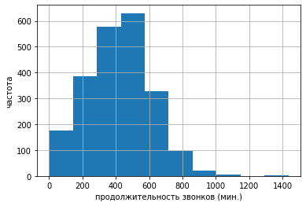
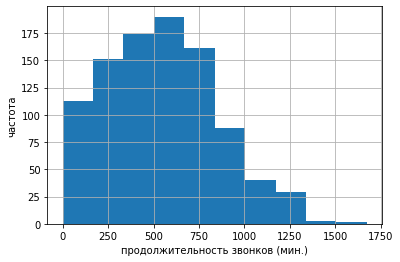
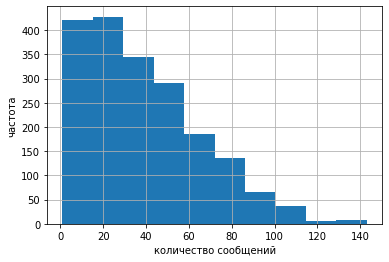
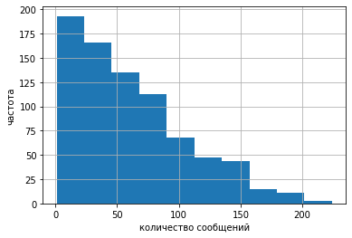
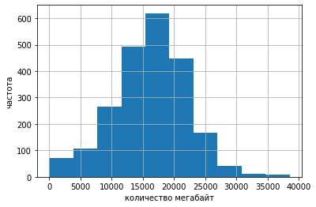
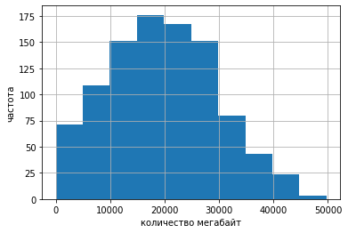

## Импорт библиотек, загрузка данных и общий просмотр


```python
import pandas as pd
import matplotlib.pyplot as plt 
import seaborn as sns
from scipy import stats as st
import numpy as np
import warnings
warnings.simplefilter("ignore")
import math
```


```python
# просмотр, где находится каталог с файлами на COLAB
from google.colab import drive
drive.mount('/content/drive')
```

    Mounted at /content/drive
    


```python
# получение доступа к каталогу и уточнение названия папок
import os
os.listdir('/content/drive/My Drive/Colab Notebooks/Яндекс/Проект 4 Смарт vs Ультра/ДАННЫЕ')
```


    ['calls.csv', 'internet.csv', 'messages.csv', 'tariffs.csv', 'users.csv']


```python
# считать данные csv и присвоить им имя
data_calls = pd.read_csv('/content/drive/My Drive/Colab Notebooks/Яндекс/Проект 4 Смарт vs Ультра/ДАННЫЕ/calls.csv')
data_internet = pd.read_csv('/content/drive/My Drive/Colab Notebooks/Яндекс/Проект 4 Смарт vs Ультра/ДАННЫЕ/internet.csv')
data_messages = pd.read_csv('/content/drive/My Drive/Colab Notebooks/Яндекс/Проект 4 Смарт vs Ультра/ДАННЫЕ/messages.csv')
data_tariffs = pd.read_csv('/content/drive/My Drive/Colab Notebooks/Яндекс/Проект 4 Смарт vs Ультра/ДАННЫЕ/tariffs.csv')
data_users = pd.read_csv('/content/drive/My Drive/Colab Notebooks/Яндекс/Проект 4 Смарт vs Ультра/ДАННЫЕ/users.csv')
```


```python
data_calls.head()
```


  <div id="df-5a32ad29-d9a8-4027-b11e-44d8f261834a">
    <div class="colab-df-container">
      <div>
<style scoped>
    .dataframe tbody tr th:only-of-type {
        vertical-align: middle;
    }

    .dataframe tbody tr th {
        vertical-align: top;
    }

    .dataframe thead th {
        text-align: right;
    }
</style>
<table border="1" class="dataframe">
  <thead>
    <tr style="text-align: right;">
      <th></th>
      <th>id</th>
      <th>call_date</th>
      <th>duration</th>
      <th>user_id</th>
    </tr>
  </thead>
  <tbody>
    <tr>
      <th>0</th>
      <td>1000_0</td>
      <td>2018-07-25</td>
      <td>0.00</td>
      <td>1000</td>
    </tr>
    <tr>
      <th>1</th>
      <td>1000_1</td>
      <td>2018-08-17</td>
      <td>0.00</td>
      <td>1000</td>
    </tr>
    <tr>
      <th>2</th>
      <td>1000_2</td>
      <td>2018-06-11</td>
      <td>2.85</td>
      <td>1000</td>
    </tr>
    <tr>
      <th>3</th>
      <td>1000_3</td>
      <td>2018-09-21</td>
      <td>13.80</td>
      <td>1000</td>
    </tr>
    <tr>
      <th>4</th>
      <td>1000_4</td>
      <td>2018-12-15</td>
      <td>5.18</td>
      <td>1000</td>
    </tr>
  </tbody>
</table>
</div>
      <button class="colab-df-convert" onclick="convertToInteractive('df-5a32ad29-d9a8-4027-b11e-44d8f261834a')"
              title="Convert this dataframe to an interactive table."
              style="display:none;">

  <svg xmlns="http://www.w3.org/2000/svg" height="24px"viewBox="0 0 24 24"
       width="24px">
    <path d="M0 0h24v24H0V0z" fill="none"/>
    <path d="M18.56 5.44l.94 2.06.94-2.06 2.06-.94-2.06-.94-.94-2.06-.94 2.06-2.06.94zm-11 1L8.5 8.5l.94-2.06 2.06-.94-2.06-.94L8.5 2.5l-.94 2.06-2.06.94zm10 10l.94 2.06.94-2.06 2.06-.94-2.06-.94-.94-2.06-.94 2.06-2.06.94z"/><path d="M17.41 7.96l-1.37-1.37c-.4-.4-.92-.59-1.43-.59-.52 0-1.04.2-1.43.59L10.3 9.45l-7.72 7.72c-.78.78-.78 2.05 0 2.83L4 21.41c.39.39.9.59 1.41.59.51 0 1.02-.2 1.41-.59l7.78-7.78 2.81-2.81c.8-.78.8-2.07 0-2.86zM5.41 20L4 18.59l7.72-7.72 1.47 1.35L5.41 20z"/>
  </svg>
      </button>

  <style>
    .colab-df-container {
      display:flex;
      flex-wrap:wrap;
      gap: 12px;
    }

    .colab-df-convert {
      background-color: #E8F0FE;
      border: none;
      border-radius: 50%;
      cursor: pointer;
      display: none;
      fill: #1967D2;
      height: 32px;
      padding: 0 0 0 0;
      width: 32px;
    }

    .colab-df-convert:hover {
      background-color: #E2EBFA;
      box-shadow: 0px 1px 2px rgba(60, 64, 67, 0.3), 0px 1px 3px 1px rgba(60, 64, 67, 0.15);
      fill: #174EA6;
    }

    [theme=dark] .colab-df-convert {
      background-color: #3B4455;
      fill: #D2E3FC;
    }

    [theme=dark] .colab-df-convert:hover {
      background-color: #434B5C;
      box-shadow: 0px 1px 3px 1px rgba(0, 0, 0, 0.15);
      filter: drop-shadow(0px 1px 2px rgba(0, 0, 0, 0.3));
      fill: #FFFFFF;
    }
  </style>

      <script>
        const buttonEl =
          document.querySelector('#df-5a32ad29-d9a8-4027-b11e-44d8f261834a button.colab-df-convert');
        buttonEl.style.display =
          google.colab.kernel.accessAllowed ? 'block' : 'none';

        async function convertToInteractive(key) {
          const element = document.querySelector('#df-5a32ad29-d9a8-4027-b11e-44d8f261834a');
          const dataTable =
            await google.colab.kernel.invokeFunction('convertToInteractive',
                                                     [key], {});
          if (!dataTable) return;

          const docLinkHtml = 'Like what you see? Visit the ' +
            '<a target="_blank" href=https://colab.research.google.com/notebooks/data_table.ipynb>data table notebook</a>'
            + ' to learn more about interactive tables.';
          element.innerHTML = '';
          dataTable['output_type'] = 'display_data';
          await google.colab.output.renderOutput(dataTable, element);
          const docLink = document.createElement('div');
          docLink.innerHTML = docLinkHtml;
          element.appendChild(docLink);
        }
      </script>
    </div>
  </div>


```python
data_internet.head()
```


  <div id="df-a0b71376-6002-4254-87aa-322c14ccdd08">
    <div class="colab-df-container">
      <div>
<style scoped>
    .dataframe tbody tr th:only-of-type {
        vertical-align: middle;
    }

    .dataframe tbody tr th {
        vertical-align: top;
    }

    .dataframe thead th {
        text-align: right;
    }
</style>
<table border="1" class="dataframe">
  <thead>
    <tr style="text-align: right;">
      <th></th>
      <th>Unnamed: 0</th>
      <th>id</th>
      <th>mb_used</th>
      <th>session_date</th>
      <th>user_id</th>
    </tr>
  </thead>
  <tbody>
    <tr>
      <th>0</th>
      <td>0</td>
      <td>1000_0</td>
      <td>112.95</td>
      <td>2018-11-25</td>
      <td>1000</td>
    </tr>
    <tr>
      <th>1</th>
      <td>1</td>
      <td>1000_1</td>
      <td>1052.81</td>
      <td>2018-09-07</td>
      <td>1000</td>
    </tr>
    <tr>
      <th>2</th>
      <td>2</td>
      <td>1000_2</td>
      <td>1197.26</td>
      <td>2018-06-25</td>
      <td>1000</td>
    </tr>
    <tr>
      <th>3</th>
      <td>3</td>
      <td>1000_3</td>
      <td>550.27</td>
      <td>2018-08-22</td>
      <td>1000</td>
    </tr>
    <tr>
      <th>4</th>
      <td>4</td>
      <td>1000_4</td>
      <td>302.56</td>
      <td>2018-09-24</td>
      <td>1000</td>
    </tr>
  </tbody>
</table>
</div>
      <button class="colab-df-convert" onclick="convertToInteractive('df-a0b71376-6002-4254-87aa-322c14ccdd08')"
              title="Convert this dataframe to an interactive table."
              style="display:none;">

  <svg xmlns="http://www.w3.org/2000/svg" height="24px"viewBox="0 0 24 24"
       width="24px">
    <path d="M0 0h24v24H0V0z" fill="none"/>
    <path d="M18.56 5.44l.94 2.06.94-2.06 2.06-.94-2.06-.94-.94-2.06-.94 2.06-2.06.94zm-11 1L8.5 8.5l.94-2.06 2.06-.94-2.06-.94L8.5 2.5l-.94 2.06-2.06.94zm10 10l.94 2.06.94-2.06 2.06-.94-2.06-.94-.94-2.06-.94 2.06-2.06.94z"/><path d="M17.41 7.96l-1.37-1.37c-.4-.4-.92-.59-1.43-.59-.52 0-1.04.2-1.43.59L10.3 9.45l-7.72 7.72c-.78.78-.78 2.05 0 2.83L4 21.41c.39.39.9.59 1.41.59.51 0 1.02-.2 1.41-.59l7.78-7.78 2.81-2.81c.8-.78.8-2.07 0-2.86zM5.41 20L4 18.59l7.72-7.72 1.47 1.35L5.41 20z"/>
  </svg>
      </button>

  <style>
    .colab-df-container {
      display:flex;
      flex-wrap:wrap;
      gap: 12px;
    }

    .colab-df-convert {
      background-color: #E8F0FE;
      border: none;
      border-radius: 50%;
      cursor: pointer;
      display: none;
      fill: #1967D2;
      height: 32px;
      padding: 0 0 0 0;
      width: 32px;
    }

    .colab-df-convert:hover {
      background-color: #E2EBFA;
      box-shadow: 0px 1px 2px rgba(60, 64, 67, 0.3), 0px 1px 3px 1px rgba(60, 64, 67, 0.15);
      fill: #174EA6;
    }

    [theme=dark] .colab-df-convert {
      background-color: #3B4455;
      fill: #D2E3FC;
    }

    [theme=dark] .colab-df-convert:hover {
      background-color: #434B5C;
      box-shadow: 0px 1px 3px 1px rgba(0, 0, 0, 0.15);
      filter: drop-shadow(0px 1px 2px rgba(0, 0, 0, 0.3));
      fill: #FFFFFF;
    }
  </style>

      <script>
        const buttonEl =
          document.querySelector('#df-a0b71376-6002-4254-87aa-322c14ccdd08 button.colab-df-convert');
        buttonEl.style.display =
          google.colab.kernel.accessAllowed ? 'block' : 'none';

        async function convertToInteractive(key) {
          const element = document.querySelector('#df-a0b71376-6002-4254-87aa-322c14ccdd08');
          const dataTable =
            await google.colab.kernel.invokeFunction('convertToInteractive',
                                                     [key], {});
          if (!dataTable) return;

          const docLinkHtml = 'Like what you see? Visit the ' +
            '<a target="_blank" href=https://colab.research.google.com/notebooks/data_table.ipynb>data table notebook</a>'
            + ' to learn more about interactive tables.';
          element.innerHTML = '';
          dataTable['output_type'] = 'display_data';
          await google.colab.output.renderOutput(dataTable, element);
          const docLink = document.createElement('div');
          docLink.innerHTML = docLinkHtml;
          element.appendChild(docLink);
        }
      </script>
    </div>
  </div>


```python
data_messages.head()
```


  <div id="df-5072e35e-31c5-47cb-9920-8d7f8e919672">
    <div class="colab-df-container">
      <div>
<style scoped>
    .dataframe tbody tr th:only-of-type {
        vertical-align: middle;
    }

    .dataframe tbody tr th {
        vertical-align: top;
    }

    .dataframe thead th {
        text-align: right;
    }
</style>
<table border="1" class="dataframe">
  <thead>
    <tr style="text-align: right;">
      <th></th>
      <th>id</th>
      <th>message_date</th>
      <th>user_id</th>
    </tr>
  </thead>
  <tbody>
    <tr>
      <th>0</th>
      <td>1000_0</td>
      <td>2018-06-27</td>
      <td>1000</td>
    </tr>
    <tr>
      <th>1</th>
      <td>1000_1</td>
      <td>2018-10-08</td>
      <td>1000</td>
    </tr>
    <tr>
      <th>2</th>
      <td>1000_2</td>
      <td>2018-08-04</td>
      <td>1000</td>
    </tr>
    <tr>
      <th>3</th>
      <td>1000_3</td>
      <td>2018-06-16</td>
      <td>1000</td>
    </tr>
    <tr>
      <th>4</th>
      <td>1000_4</td>
      <td>2018-12-05</td>
      <td>1000</td>
    </tr>
  </tbody>
</table>
</div>
      <button class="colab-df-convert" onclick="convertToInteractive('df-5072e35e-31c5-47cb-9920-8d7f8e919672')"
              title="Convert this dataframe to an interactive table."
              style="display:none;">

  <svg xmlns="http://www.w3.org/2000/svg" height="24px"viewBox="0 0 24 24"
       width="24px">
    <path d="M0 0h24v24H0V0z" fill="none"/>
    <path d="M18.56 5.44l.94 2.06.94-2.06 2.06-.94-2.06-.94-.94-2.06-.94 2.06-2.06.94zm-11 1L8.5 8.5l.94-2.06 2.06-.94-2.06-.94L8.5 2.5l-.94 2.06-2.06.94zm10 10l.94 2.06.94-2.06 2.06-.94-2.06-.94-.94-2.06-.94 2.06-2.06.94z"/><path d="M17.41 7.96l-1.37-1.37c-.4-.4-.92-.59-1.43-.59-.52 0-1.04.2-1.43.59L10.3 9.45l-7.72 7.72c-.78.78-.78 2.05 0 2.83L4 21.41c.39.39.9.59 1.41.59.51 0 1.02-.2 1.41-.59l7.78-7.78 2.81-2.81c.8-.78.8-2.07 0-2.86zM5.41 20L4 18.59l7.72-7.72 1.47 1.35L5.41 20z"/>
  </svg>
      </button>

  <style>
    .colab-df-container {
      display:flex;
      flex-wrap:wrap;
      gap: 12px;
    }

    .colab-df-convert {
      background-color: #E8F0FE;
      border: none;
      border-radius: 50%;
      cursor: pointer;
      display: none;
      fill: #1967D2;
      height: 32px;
      padding: 0 0 0 0;
      width: 32px;
    }

    .colab-df-convert:hover {
      background-color: #E2EBFA;
      box-shadow: 0px 1px 2px rgba(60, 64, 67, 0.3), 0px 1px 3px 1px rgba(60, 64, 67, 0.15);
      fill: #174EA6;
    }

    [theme=dark] .colab-df-convert {
      background-color: #3B4455;
      fill: #D2E3FC;
    }

    [theme=dark] .colab-df-convert:hover {
      background-color: #434B5C;
      box-shadow: 0px 1px 3px 1px rgba(0, 0, 0, 0.15);
      filter: drop-shadow(0px 1px 2px rgba(0, 0, 0, 0.3));
      fill: #FFFFFF;
    }
  </style>

      <script>
        const buttonEl =
          document.querySelector('#df-5072e35e-31c5-47cb-9920-8d7f8e919672 button.colab-df-convert');
        buttonEl.style.display =
          google.colab.kernel.accessAllowed ? 'block' : 'none';

        async function convertToInteractive(key) {
          const element = document.querySelector('#df-5072e35e-31c5-47cb-9920-8d7f8e919672');
          const dataTable =
            await google.colab.kernel.invokeFunction('convertToInteractive',
                                                     [key], {});
          if (!dataTable) return;

          const docLinkHtml = 'Like what you see? Visit the ' +
            '<a target="_blank" href=https://colab.research.google.com/notebooks/data_table.ipynb>data table notebook</a>'
            + ' to learn more about interactive tables.';
          element.innerHTML = '';
          dataTable['output_type'] = 'display_data';
          await google.colab.output.renderOutput(dataTable, element);
          const docLink = document.createElement('div');
          docLink.innerHTML = docLinkHtml;
          element.appendChild(docLink);
        }
      </script>
    </div>
  </div>


```python
data_tariffs
```


  <div id="df-1f50bf4d-49c3-41c9-b4a9-56e47bb7d4db">
    <div class="colab-df-container">
      <div>
<style scoped>
    .dataframe tbody tr th:only-of-type {
        vertical-align: middle;
    }

    .dataframe tbody tr th {
        vertical-align: top;
    }

    .dataframe thead th {
        text-align: right;
    }
</style>
<table border="1" class="dataframe">
  <thead>
    <tr style="text-align: right;">
      <th></th>
      <th>messages_included</th>
      <th>mb_per_month_included</th>
      <th>minutes_included</th>
      <th>rub_monthly_fee</th>
      <th>rub_per_gb</th>
      <th>rub_per_message</th>
      <th>rub_per_minute</th>
      <th>tariff_name</th>
    </tr>
  </thead>
  <tbody>
    <tr>
      <th>0</th>
      <td>50</td>
      <td>15360</td>
      <td>500</td>
      <td>550</td>
      <td>200</td>
      <td>3</td>
      <td>3</td>
      <td>smart</td>
    </tr>
    <tr>
      <th>1</th>
      <td>1000</td>
      <td>30720</td>
      <td>3000</td>
      <td>1950</td>
      <td>150</td>
      <td>1</td>
      <td>1</td>
      <td>ultra</td>
    </tr>
  </tbody>
</table>
</div>
      <button class="colab-df-convert" onclick="convertToInteractive('df-1f50bf4d-49c3-41c9-b4a9-56e47bb7d4db')"
              title="Convert this dataframe to an interactive table."
              style="display:none;">

  <svg xmlns="http://www.w3.org/2000/svg" height="24px"viewBox="0 0 24 24"
       width="24px">
    <path d="M0 0h24v24H0V0z" fill="none"/>
    <path d="M18.56 5.44l.94 2.06.94-2.06 2.06-.94-2.06-.94-.94-2.06-.94 2.06-2.06.94zm-11 1L8.5 8.5l.94-2.06 2.06-.94-2.06-.94L8.5 2.5l-.94 2.06-2.06.94zm10 10l.94 2.06.94-2.06 2.06-.94-2.06-.94-.94-2.06-.94 2.06-2.06.94z"/><path d="M17.41 7.96l-1.37-1.37c-.4-.4-.92-.59-1.43-.59-.52 0-1.04.2-1.43.59L10.3 9.45l-7.72 7.72c-.78.78-.78 2.05 0 2.83L4 21.41c.39.39.9.59 1.41.59.51 0 1.02-.2 1.41-.59l7.78-7.78 2.81-2.81c.8-.78.8-2.07 0-2.86zM5.41 20L4 18.59l7.72-7.72 1.47 1.35L5.41 20z"/>
  </svg>
      </button>

  <style>
    .colab-df-container {
      display:flex;
      flex-wrap:wrap;
      gap: 12px;
    }

    .colab-df-convert {
      background-color: #E8F0FE;
      border: none;
      border-radius: 50%;
      cursor: pointer;
      display: none;
      fill: #1967D2;
      height: 32px;
      padding: 0 0 0 0;
      width: 32px;
    }

    .colab-df-convert:hover {
      background-color: #E2EBFA;
      box-shadow: 0px 1px 2px rgba(60, 64, 67, 0.3), 0px 1px 3px 1px rgba(60, 64, 67, 0.15);
      fill: #174EA6;
    }

    [theme=dark] .colab-df-convert {
      background-color: #3B4455;
      fill: #D2E3FC;
    }

    [theme=dark] .colab-df-convert:hover {
      background-color: #434B5C;
      box-shadow: 0px 1px 3px 1px rgba(0, 0, 0, 0.15);
      filter: drop-shadow(0px 1px 2px rgba(0, 0, 0, 0.3));
      fill: #FFFFFF;
    }
  </style>

      <script>
        const buttonEl =
          document.querySelector('#df-1f50bf4d-49c3-41c9-b4a9-56e47bb7d4db button.colab-df-convert');
        buttonEl.style.display =
          google.colab.kernel.accessAllowed ? 'block' : 'none';

        async function convertToInteractive(key) {
          const element = document.querySelector('#df-1f50bf4d-49c3-41c9-b4a9-56e47bb7d4db');
          const dataTable =
            await google.colab.kernel.invokeFunction('convertToInteractive',
                                                     [key], {});
          if (!dataTable) return;

          const docLinkHtml = 'Like what you see? Visit the ' +
            '<a target="_blank" href=https://colab.research.google.com/notebooks/data_table.ipynb>data table notebook</a>'
            + ' to learn more about interactive tables.';
          element.innerHTML = '';
          dataTable['output_type'] = 'display_data';
          await google.colab.output.renderOutput(dataTable, element);
          const docLink = document.createElement('div');
          docLink.innerHTML = docLinkHtml;
          element.appendChild(docLink);
        }
      </script>
    </div>
  </div>


```python
data_users.head()
```


  <div id="df-476876db-23b8-40dd-b360-61a9e4faf57c">
    <div class="colab-df-container">
      <div>
<style scoped>
    .dataframe tbody tr th:only-of-type {
        vertical-align: middle;
    }

    .dataframe tbody tr th {
        vertical-align: top;
    }

    .dataframe thead th {
        text-align: right;
    }
</style>
<table border="1" class="dataframe">
  <thead>
    <tr style="text-align: right;">
      <th></th>
      <th>user_id</th>
      <th>age</th>
      <th>churn_date</th>
      <th>city</th>
      <th>first_name</th>
      <th>last_name</th>
      <th>reg_date</th>
      <th>tariff</th>
    </tr>
  </thead>
  <tbody>
    <tr>
      <th>0</th>
      <td>1000</td>
      <td>52</td>
      <td>NaN</td>
      <td>Краснодар</td>
      <td>Рафаил</td>
      <td>Верещагин</td>
      <td>2018-05-25</td>
      <td>ultra</td>
    </tr>
    <tr>
      <th>1</th>
      <td>1001</td>
      <td>41</td>
      <td>NaN</td>
      <td>Москва</td>
      <td>Иван</td>
      <td>Ежов</td>
      <td>2018-11-01</td>
      <td>smart</td>
    </tr>
    <tr>
      <th>2</th>
      <td>1002</td>
      <td>59</td>
      <td>NaN</td>
      <td>Стерлитамак</td>
      <td>Евгений</td>
      <td>Абрамович</td>
      <td>2018-06-17</td>
      <td>smart</td>
    </tr>
    <tr>
      <th>3</th>
      <td>1003</td>
      <td>23</td>
      <td>NaN</td>
      <td>Москва</td>
      <td>Белла</td>
      <td>Белякова</td>
      <td>2018-08-17</td>
      <td>ultra</td>
    </tr>
    <tr>
      <th>4</th>
      <td>1004</td>
      <td>68</td>
      <td>NaN</td>
      <td>Новокузнецк</td>
      <td>Татьяна</td>
      <td>Авдеенко</td>
      <td>2018-05-14</td>
      <td>ultra</td>
    </tr>
  </tbody>
</table>
</div>
      <button class="colab-df-convert" onclick="convertToInteractive('df-476876db-23b8-40dd-b360-61a9e4faf57c')"
              title="Convert this dataframe to an interactive table."
              style="display:none;">

  <svg xmlns="http://www.w3.org/2000/svg" height="24px"viewBox="0 0 24 24"
       width="24px">
    <path d="M0 0h24v24H0V0z" fill="none"/>
    <path d="M18.56 5.44l.94 2.06.94-2.06 2.06-.94-2.06-.94-.94-2.06-.94 2.06-2.06.94zm-11 1L8.5 8.5l.94-2.06 2.06-.94-2.06-.94L8.5 2.5l-.94 2.06-2.06.94zm10 10l.94 2.06.94-2.06 2.06-.94-2.06-.94-.94-2.06-.94 2.06-2.06.94z"/><path d="M17.41 7.96l-1.37-1.37c-.4-.4-.92-.59-1.43-.59-.52 0-1.04.2-1.43.59L10.3 9.45l-7.72 7.72c-.78.78-.78 2.05 0 2.83L4 21.41c.39.39.9.59 1.41.59.51 0 1.02-.2 1.41-.59l7.78-7.78 2.81-2.81c.8-.78.8-2.07 0-2.86zM5.41 20L4 18.59l7.72-7.72 1.47 1.35L5.41 20z"/>
  </svg>
      </button>

  <style>
    .colab-df-container {
      display:flex;
      flex-wrap:wrap;
      gap: 12px;
    }

    .colab-df-convert {
      background-color: #E8F0FE;
      border: none;
      border-radius: 50%;
      cursor: pointer;
      display: none;
      fill: #1967D2;
      height: 32px;
      padding: 0 0 0 0;
      width: 32px;
    }

    .colab-df-convert:hover {
      background-color: #E2EBFA;
      box-shadow: 0px 1px 2px rgba(60, 64, 67, 0.3), 0px 1px 3px 1px rgba(60, 64, 67, 0.15);
      fill: #174EA6;
    }

    [theme=dark] .colab-df-convert {
      background-color: #3B4455;
      fill: #D2E3FC;
    }

    [theme=dark] .colab-df-convert:hover {
      background-color: #434B5C;
      box-shadow: 0px 1px 3px 1px rgba(0, 0, 0, 0.15);
      filter: drop-shadow(0px 1px 2px rgba(0, 0, 0, 0.3));
      fill: #FFFFFF;
    }
  </style>

      <script>
        const buttonEl =
          document.querySelector('#df-476876db-23b8-40dd-b360-61a9e4faf57c button.colab-df-convert');
        buttonEl.style.display =
          google.colab.kernel.accessAllowed ? 'block' : 'none';

        async function convertToInteractive(key) {
          const element = document.querySelector('#df-476876db-23b8-40dd-b360-61a9e4faf57c');
          const dataTable =
            await google.colab.kernel.invokeFunction('convertToInteractive',
                                                     [key], {});
          if (!dataTable) return;

          const docLinkHtml = 'Like what you see? Visit the ' +
            '<a target="_blank" href=https://colab.research.google.com/notebooks/data_table.ipynb>data table notebook</a>'
            + ' to learn more about interactive tables.';
          element.innerHTML = '';
          dataTable['output_type'] = 'display_data';
          await google.colab.output.renderOutput(dataTable, element);
          const docLink = document.createElement('div');
          docLink.innerHTML = docLinkHtml;
          element.appendChild(docLink);
        }
      </script>
    </div>
  </div>


#### Вывод

1. data_internet содержит столбец "Unnamed: 0" дублирующий индексы его целесообразно удалить.
2. data_users содержит столбец "churn_date" с пропусками, необходимо посчитать их долю, если она менее 1 % - удалить.

## Предобработка

### Обработка таблицы data_users


```python
# вывод общей информации
data_users.info()
```

    <class 'pandas.core.frame.DataFrame'>
    RangeIndex: 500 entries, 0 to 499
    Data columns (total 8 columns):
     #   Column      Non-Null Count  Dtype 
    ---  ------      --------------  ----- 
     0   user_id     500 non-null    int64 
     1   age         500 non-null    int64 
     2   churn_date  38 non-null     object
     3   city        500 non-null    object
     4   first_name  500 non-null    object
     5   last_name   500 non-null    object
     6   reg_date    500 non-null    object
     7   tariff      500 non-null    object
    dtypes: int64(2), object(6)
    memory usage: 31.4+ KB
    

* user_id     - идентификатор;
* age         - возраст;
* churn_date  - дата смены тарифа;
* city        - город регистрации;
* first_name  - имя;
* last_name   - фамилия;
* reg_date    - дата регистрации;
* tariff      - тариф.


```python
# вывод описательной статистики
data_users.describe()
```


  <div id="df-47b3a29d-1df6-4017-916e-bbdb2c6bfa86">
    <div class="colab-df-container">
      <div>
<style scoped>
    .dataframe tbody tr th:only-of-type {
        vertical-align: middle;
    }

    .dataframe tbody tr th {
        vertical-align: top;
    }

    .dataframe thead th {
        text-align: right;
    }
</style>
<table border="1" class="dataframe">
  <thead>
    <tr style="text-align: right;">
      <th></th>
      <th>user_id</th>
      <th>age</th>
    </tr>
  </thead>
  <tbody>
    <tr>
      <th>count</th>
      <td>500.000000</td>
      <td>500.00000</td>
    </tr>
    <tr>
      <th>mean</th>
      <td>1249.500000</td>
      <td>46.58800</td>
    </tr>
    <tr>
      <th>std</th>
      <td>144.481833</td>
      <td>16.66763</td>
    </tr>
    <tr>
      <th>min</th>
      <td>1000.000000</td>
      <td>18.00000</td>
    </tr>
    <tr>
      <th>25%</th>
      <td>1124.750000</td>
      <td>32.00000</td>
    </tr>
    <tr>
      <th>50%</th>
      <td>1249.500000</td>
      <td>46.00000</td>
    </tr>
    <tr>
      <th>75%</th>
      <td>1374.250000</td>
      <td>62.00000</td>
    </tr>
    <tr>
      <th>max</th>
      <td>1499.000000</td>
      <td>75.00000</td>
    </tr>
  </tbody>
</table>
</div>
      <button class="colab-df-convert" onclick="convertToInteractive('df-47b3a29d-1df6-4017-916e-bbdb2c6bfa86')"
              title="Convert this dataframe to an interactive table."
              style="display:none;">

  <svg xmlns="http://www.w3.org/2000/svg" height="24px"viewBox="0 0 24 24"
       width="24px">
    <path d="M0 0h24v24H0V0z" fill="none"/>
    <path d="M18.56 5.44l.94 2.06.94-2.06 2.06-.94-2.06-.94-.94-2.06-.94 2.06-2.06.94zm-11 1L8.5 8.5l.94-2.06 2.06-.94-2.06-.94L8.5 2.5l-.94 2.06-2.06.94zm10 10l.94 2.06.94-2.06 2.06-.94-2.06-.94-.94-2.06-.94 2.06-2.06.94z"/><path d="M17.41 7.96l-1.37-1.37c-.4-.4-.92-.59-1.43-.59-.52 0-1.04.2-1.43.59L10.3 9.45l-7.72 7.72c-.78.78-.78 2.05 0 2.83L4 21.41c.39.39.9.59 1.41.59.51 0 1.02-.2 1.41-.59l7.78-7.78 2.81-2.81c.8-.78.8-2.07 0-2.86zM5.41 20L4 18.59l7.72-7.72 1.47 1.35L5.41 20z"/>
  </svg>
      </button>

  <style>
    .colab-df-container {
      display:flex;
      flex-wrap:wrap;
      gap: 12px;
    }

    .colab-df-convert {
      background-color: #E8F0FE;
      border: none;
      border-radius: 50%;
      cursor: pointer;
      display: none;
      fill: #1967D2;
      height: 32px;
      padding: 0 0 0 0;
      width: 32px;
    }

    .colab-df-convert:hover {
      background-color: #E2EBFA;
      box-shadow: 0px 1px 2px rgba(60, 64, 67, 0.3), 0px 1px 3px 1px rgba(60, 64, 67, 0.15);
      fill: #174EA6;
    }

    [theme=dark] .colab-df-convert {
      background-color: #3B4455;
      fill: #D2E3FC;
    }

    [theme=dark] .colab-df-convert:hover {
      background-color: #434B5C;
      box-shadow: 0px 1px 3px 1px rgba(0, 0, 0, 0.15);
      filter: drop-shadow(0px 1px 2px rgba(0, 0, 0, 0.3));
      fill: #FFFFFF;
    }
  </style>

      <script>
        const buttonEl =
          document.querySelector('#df-47b3a29d-1df6-4017-916e-bbdb2c6bfa86 button.colab-df-convert');
        buttonEl.style.display =
          google.colab.kernel.accessAllowed ? 'block' : 'none';

        async function convertToInteractive(key) {
          const element = document.querySelector('#df-47b3a29d-1df6-4017-916e-bbdb2c6bfa86');
          const dataTable =
            await google.colab.kernel.invokeFunction('convertToInteractive',
                                                     [key], {});
          if (!dataTable) return;

          const docLinkHtml = 'Like what you see? Visit the ' +
            '<a target="_blank" href=https://colab.research.google.com/notebooks/data_table.ipynb>data table notebook</a>'
            + ' to learn more about interactive tables.';
          element.innerHTML = '';
          dataTable['output_type'] = 'display_data';
          await google.colab.output.renderOutput(dataTable, element);
          const docLink = document.createElement('div');
          docLink.innerHTML = docLinkHtml;
          element.appendChild(docLink);
        }
      </script>
    </div>
  </div>


```python
# подсчет пропущенных данные
data_users.isnull().sum()
```


    user_id         0
    age             0
    churn_date    462
    city            0
    first_name      0
    last_name       0
    reg_date        0
    tariff          0
    dtype: int64


```python
# вывод уникальных значений
data_users['churn_date'].unique()
```


    array([nan, '2018-10-05', '2018-12-18', '2018-11-21', '2018-10-03',
           '2018-10-14', '2018-12-09', '2018-12-11', '2018-12-26',
           '2018-08-31', '2018-12-03', '2018-12-23', '2018-11-07',
           '2018-12-16', '2018-12-20', '2018-11-30', '2018-12-21',
           '2018-08-17', '2018-09-02', '2018-10-04', '2018-11-13',
           '2018-11-22', '2018-10-28', '2018-11-26', '2018-11-27',
           '2018-11-16', '2018-10-27', '2018-12-30', '2018-09-27',
           '2018-12-25', '2018-12-14', '2018-12-24', '2018-09-26',
           '2018-10-25'], dtype=object)


```python
# доля пропущенных значений
data_users['churn_date'].isna().mean()
```


    0.924


#### Вывод:

1. Доля пропущенных значений в столбце data_users['churn_date'] порядка 0.92. Это очень много. Тип - дата, заполнить средними значениями не получится. Скорее всего, данных о смене тарифа нет, так как им все еще пользуются. Целесообразно заполнить нулями.
2. Столбец "reg_date" и "churn_date" перевести в тип дата.


```python
# перевод столбца в формат даты
data_users['reg_date'] = pd.to_datetime(data_users['reg_date'], format = '%Y-%m-%d')
```


```python
# перевод столбца в формат даты
data_users['churn_date'] = pd.to_datetime(data_users['churn_date'], format = '%Y-%m-%d')
```


```python
# зануление пропусков
data_users['churn_date'] = data_users['churn_date'].fillna(0)
```


```python
data_users.head()
```


  <div id="df-777d8c9f-70f3-4a4b-ba30-fec879eb457d">
    <div class="colab-df-container">
      <div>
<style scoped>
    .dataframe tbody tr th:only-of-type {
        vertical-align: middle;
    }

    .dataframe tbody tr th {
        vertical-align: top;
    }

    .dataframe thead th {
        text-align: right;
    }
</style>
<table border="1" class="dataframe">
  <thead>
    <tr style="text-align: right;">
      <th></th>
      <th>user_id</th>
      <th>age</th>
      <th>churn_date</th>
      <th>city</th>
      <th>first_name</th>
      <th>last_name</th>
      <th>reg_date</th>
      <th>tariff</th>
    </tr>
  </thead>
  <tbody>
    <tr>
      <th>0</th>
      <td>1000</td>
      <td>52</td>
      <td>0</td>
      <td>Краснодар</td>
      <td>Рафаил</td>
      <td>Верещагин</td>
      <td>2018-05-25</td>
      <td>ultra</td>
    </tr>
    <tr>
      <th>1</th>
      <td>1001</td>
      <td>41</td>
      <td>0</td>
      <td>Москва</td>
      <td>Иван</td>
      <td>Ежов</td>
      <td>2018-11-01</td>
      <td>smart</td>
    </tr>
    <tr>
      <th>2</th>
      <td>1002</td>
      <td>59</td>
      <td>0</td>
      <td>Стерлитамак</td>
      <td>Евгений</td>
      <td>Абрамович</td>
      <td>2018-06-17</td>
      <td>smart</td>
    </tr>
    <tr>
      <th>3</th>
      <td>1003</td>
      <td>23</td>
      <td>0</td>
      <td>Москва</td>
      <td>Белла</td>
      <td>Белякова</td>
      <td>2018-08-17</td>
      <td>ultra</td>
    </tr>
    <tr>
      <th>4</th>
      <td>1004</td>
      <td>68</td>
      <td>0</td>
      <td>Новокузнецк</td>
      <td>Татьяна</td>
      <td>Авдеенко</td>
      <td>2018-05-14</td>
      <td>ultra</td>
    </tr>
  </tbody>
</table>
</div>
      <button class="colab-df-convert" onclick="convertToInteractive('df-777d8c9f-70f3-4a4b-ba30-fec879eb457d')"
              title="Convert this dataframe to an interactive table."
              style="display:none;">

  <svg xmlns="http://www.w3.org/2000/svg" height="24px"viewBox="0 0 24 24"
       width="24px">
    <path d="M0 0h24v24H0V0z" fill="none"/>
    <path d="M18.56 5.44l.94 2.06.94-2.06 2.06-.94-2.06-.94-.94-2.06-.94 2.06-2.06.94zm-11 1L8.5 8.5l.94-2.06 2.06-.94-2.06-.94L8.5 2.5l-.94 2.06-2.06.94zm10 10l.94 2.06.94-2.06 2.06-.94-2.06-.94-.94-2.06-.94 2.06-2.06.94z"/><path d="M17.41 7.96l-1.37-1.37c-.4-.4-.92-.59-1.43-.59-.52 0-1.04.2-1.43.59L10.3 9.45l-7.72 7.72c-.78.78-.78 2.05 0 2.83L4 21.41c.39.39.9.59 1.41.59.51 0 1.02-.2 1.41-.59l7.78-7.78 2.81-2.81c.8-.78.8-2.07 0-2.86zM5.41 20L4 18.59l7.72-7.72 1.47 1.35L5.41 20z"/>
  </svg>
      </button>

  <style>
    .colab-df-container {
      display:flex;
      flex-wrap:wrap;
      gap: 12px;
    }

    .colab-df-convert {
      background-color: #E8F0FE;
      border: none;
      border-radius: 50%;
      cursor: pointer;
      display: none;
      fill: #1967D2;
      height: 32px;
      padding: 0 0 0 0;
      width: 32px;
    }

    .colab-df-convert:hover {
      background-color: #E2EBFA;
      box-shadow: 0px 1px 2px rgba(60, 64, 67, 0.3), 0px 1px 3px 1px rgba(60, 64, 67, 0.15);
      fill: #174EA6;
    }

    [theme=dark] .colab-df-convert {
      background-color: #3B4455;
      fill: #D2E3FC;
    }

    [theme=dark] .colab-df-convert:hover {
      background-color: #434B5C;
      box-shadow: 0px 1px 3px 1px rgba(0, 0, 0, 0.15);
      filter: drop-shadow(0px 1px 2px rgba(0, 0, 0, 0.3));
      fill: #FFFFFF;
    }
  </style>

      <script>
        const buttonEl =
          document.querySelector('#df-777d8c9f-70f3-4a4b-ba30-fec879eb457d button.colab-df-convert');
        buttonEl.style.display =
          google.colab.kernel.accessAllowed ? 'block' : 'none';

        async function convertToInteractive(key) {
          const element = document.querySelector('#df-777d8c9f-70f3-4a4b-ba30-fec879eb457d');
          const dataTable =
            await google.colab.kernel.invokeFunction('convertToInteractive',
                                                     [key], {});
          if (!dataTable) return;

          const docLinkHtml = 'Like what you see? Visit the ' +
            '<a target="_blank" href=https://colab.research.google.com/notebooks/data_table.ipynb>data table notebook</a>'
            + ' to learn more about interactive tables.';
          element.innerHTML = '';
          dataTable['output_type'] = 'display_data';
          await google.colab.output.renderOutput(dataTable, element);
          const docLink = document.createElement('div');
          docLink.innerHTML = docLinkHtml;
          element.appendChild(docLink);
        }
      </script>
    </div>
  </div>


```python
# вывод общей информации
data_users.info()
```

    <class 'pandas.core.frame.DataFrame'>
    RangeIndex: 500 entries, 0 to 499
    Data columns (total 8 columns):
     #   Column      Non-Null Count  Dtype         
    ---  ------      --------------  -----         
     0   user_id     500 non-null    int64         
     1   age         500 non-null    int64         
     2   churn_date  500 non-null    object        
     3   city        500 non-null    object        
     4   first_name  500 non-null    object        
     5   last_name   500 non-null    object        
     6   reg_date    500 non-null    datetime64[ns]
     7   tariff      500 non-null    object        
    dtypes: datetime64[ns](1), int64(2), object(5)
    memory usage: 31.4+ KB
    


```python
# посчитать пропущенные данные
data_users.isnull().sum()
```


    user_id       0
    age           0
    churn_date    0
    city          0
    first_name    0
    last_name     0
    reg_date      0
    tariff        0
    dtype: int64


### Обработка таблицы data_tariffs


```python
data_tariffs
```


  <div id="df-82fa16d3-9568-4eab-b499-9080c5a8567d">
    <div class="colab-df-container">
      <div>
<style scoped>
    .dataframe tbody tr th:only-of-type {
        vertical-align: middle;
    }

    .dataframe tbody tr th {
        vertical-align: top;
    }

    .dataframe thead th {
        text-align: right;
    }
</style>
<table border="1" class="dataframe">
  <thead>
    <tr style="text-align: right;">
      <th></th>
      <th>messages_included</th>
      <th>mb_per_month_included</th>
      <th>minutes_included</th>
      <th>rub_monthly_fee</th>
      <th>rub_per_gb</th>
      <th>rub_per_message</th>
      <th>rub_per_minute</th>
      <th>tariff_name</th>
    </tr>
  </thead>
  <tbody>
    <tr>
      <th>0</th>
      <td>50</td>
      <td>15360</td>
      <td>500</td>
      <td>550</td>
      <td>200</td>
      <td>3</td>
      <td>3</td>
      <td>smart</td>
    </tr>
    <tr>
      <th>1</th>
      <td>1000</td>
      <td>30720</td>
      <td>3000</td>
      <td>1950</td>
      <td>150</td>
      <td>1</td>
      <td>1</td>
      <td>ultra</td>
    </tr>
  </tbody>
</table>
</div>
      <button class="colab-df-convert" onclick="convertToInteractive('df-82fa16d3-9568-4eab-b499-9080c5a8567d')"
              title="Convert this dataframe to an interactive table."
              style="display:none;">

  <svg xmlns="http://www.w3.org/2000/svg" height="24px"viewBox="0 0 24 24"
       width="24px">
    <path d="M0 0h24v24H0V0z" fill="none"/>
    <path d="M18.56 5.44l.94 2.06.94-2.06 2.06-.94-2.06-.94-.94-2.06-.94 2.06-2.06.94zm-11 1L8.5 8.5l.94-2.06 2.06-.94-2.06-.94L8.5 2.5l-.94 2.06-2.06.94zm10 10l.94 2.06.94-2.06 2.06-.94-2.06-.94-.94-2.06-.94 2.06-2.06.94z"/><path d="M17.41 7.96l-1.37-1.37c-.4-.4-.92-.59-1.43-.59-.52 0-1.04.2-1.43.59L10.3 9.45l-7.72 7.72c-.78.78-.78 2.05 0 2.83L4 21.41c.39.39.9.59 1.41.59.51 0 1.02-.2 1.41-.59l7.78-7.78 2.81-2.81c.8-.78.8-2.07 0-2.86zM5.41 20L4 18.59l7.72-7.72 1.47 1.35L5.41 20z"/>
  </svg>
      </button>

  <style>
    .colab-df-container {
      display:flex;
      flex-wrap:wrap;
      gap: 12px;
    }

    .colab-df-convert {
      background-color: #E8F0FE;
      border: none;
      border-radius: 50%;
      cursor: pointer;
      display: none;
      fill: #1967D2;
      height: 32px;
      padding: 0 0 0 0;
      width: 32px;
    }

    .colab-df-convert:hover {
      background-color: #E2EBFA;
      box-shadow: 0px 1px 2px rgba(60, 64, 67, 0.3), 0px 1px 3px 1px rgba(60, 64, 67, 0.15);
      fill: #174EA6;
    }

    [theme=dark] .colab-df-convert {
      background-color: #3B4455;
      fill: #D2E3FC;
    }

    [theme=dark] .colab-df-convert:hover {
      background-color: #434B5C;
      box-shadow: 0px 1px 3px 1px rgba(0, 0, 0, 0.15);
      filter: drop-shadow(0px 1px 2px rgba(0, 0, 0, 0.3));
      fill: #FFFFFF;
    }
  </style>

      <script>
        const buttonEl =
          document.querySelector('#df-82fa16d3-9568-4eab-b499-9080c5a8567d button.colab-df-convert');
        buttonEl.style.display =
          google.colab.kernel.accessAllowed ? 'block' : 'none';

        async function convertToInteractive(key) {
          const element = document.querySelector('#df-82fa16d3-9568-4eab-b499-9080c5a8567d');
          const dataTable =
            await google.colab.kernel.invokeFunction('convertToInteractive',
                                                     [key], {});
          if (!dataTable) return;

          const docLinkHtml = 'Like what you see? Visit the ' +
            '<a target="_blank" href=https://colab.research.google.com/notebooks/data_table.ipynb>data table notebook</a>'
            + ' to learn more about interactive tables.';
          element.innerHTML = '';
          dataTable['output_type'] = 'display_data';
          await google.colab.output.renderOutput(dataTable, element);
          const docLink = document.createElement('div');
          docLink.innerHTML = docLinkHtml;
          element.appendChild(docLink);
        }
      </script>
    </div>
  </div>


```python
# вывод общей информации
data_tariffs.info()
```

    <class 'pandas.core.frame.DataFrame'>
    RangeIndex: 2 entries, 0 to 1
    Data columns (total 8 columns):
     #   Column                 Non-Null Count  Dtype 
    ---  ------                 --------------  ----- 
     0   messages_included      2 non-null      int64 
     1   mb_per_month_included  2 non-null      int64 
     2   minutes_included       2 non-null      int64 
     3   rub_monthly_fee        2 non-null      int64 
     4   rub_per_gb             2 non-null      int64 
     5   rub_per_message        2 non-null      int64 
     6   rub_per_minute         2 non-null      int64 
     7   tariff_name            2 non-null      object
    dtypes: int64(7), object(1)
    memory usage: 256.0+ bytes
    

* messages_included      - пакет сообщений;
* mb_per_month_included  - пакет мегабайт в месяц;
* minutes_included       - пакет минут;
* rub_monthly_fee        - ежемесячная плата руб.;
* rub_per_gb             - цена за мегабайты сверх тарифного пакета;
* rub_per_message        - цена за сообщения сверх тарифного пакета;
* rub_per_minute         - цена за минуты сверх тарифного пакета;
* tariff_name            - тариф.

#### Вывод:

1. Типы данных соответствуют.
2. Пропуски отсутствуют.

### Обработка таблицы data_messages


```python
data_messages.head()
```


  <div id="df-019fdf05-5a7c-4612-9be4-029e0c7882b6">
    <div class="colab-df-container">
      <div>
<style scoped>
    .dataframe tbody tr th:only-of-type {
        vertical-align: middle;
    }

    .dataframe tbody tr th {
        vertical-align: top;
    }

    .dataframe thead th {
        text-align: right;
    }
</style>
<table border="1" class="dataframe">
  <thead>
    <tr style="text-align: right;">
      <th></th>
      <th>id</th>
      <th>message_date</th>
      <th>user_id</th>
    </tr>
  </thead>
  <tbody>
    <tr>
      <th>0</th>
      <td>1000_0</td>
      <td>2018-06-27</td>
      <td>1000</td>
    </tr>
    <tr>
      <th>1</th>
      <td>1000_1</td>
      <td>2018-10-08</td>
      <td>1000</td>
    </tr>
    <tr>
      <th>2</th>
      <td>1000_2</td>
      <td>2018-08-04</td>
      <td>1000</td>
    </tr>
    <tr>
      <th>3</th>
      <td>1000_3</td>
      <td>2018-06-16</td>
      <td>1000</td>
    </tr>
    <tr>
      <th>4</th>
      <td>1000_4</td>
      <td>2018-12-05</td>
      <td>1000</td>
    </tr>
  </tbody>
</table>
</div>
      <button class="colab-df-convert" onclick="convertToInteractive('df-019fdf05-5a7c-4612-9be4-029e0c7882b6')"
              title="Convert this dataframe to an interactive table."
              style="display:none;">

  <svg xmlns="http://www.w3.org/2000/svg" height="24px"viewBox="0 0 24 24"
       width="24px">
    <path d="M0 0h24v24H0V0z" fill="none"/>
    <path d="M18.56 5.44l.94 2.06.94-2.06 2.06-.94-2.06-.94-.94-2.06-.94 2.06-2.06.94zm-11 1L8.5 8.5l.94-2.06 2.06-.94-2.06-.94L8.5 2.5l-.94 2.06-2.06.94zm10 10l.94 2.06.94-2.06 2.06-.94-2.06-.94-.94-2.06-.94 2.06-2.06.94z"/><path d="M17.41 7.96l-1.37-1.37c-.4-.4-.92-.59-1.43-.59-.52 0-1.04.2-1.43.59L10.3 9.45l-7.72 7.72c-.78.78-.78 2.05 0 2.83L4 21.41c.39.39.9.59 1.41.59.51 0 1.02-.2 1.41-.59l7.78-7.78 2.81-2.81c.8-.78.8-2.07 0-2.86zM5.41 20L4 18.59l7.72-7.72 1.47 1.35L5.41 20z"/>
  </svg>
      </button>

  <style>
    .colab-df-container {
      display:flex;
      flex-wrap:wrap;
      gap: 12px;
    }

    .colab-df-convert {
      background-color: #E8F0FE;
      border: none;
      border-radius: 50%;
      cursor: pointer;
      display: none;
      fill: #1967D2;
      height: 32px;
      padding: 0 0 0 0;
      width: 32px;
    }

    .colab-df-convert:hover {
      background-color: #E2EBFA;
      box-shadow: 0px 1px 2px rgba(60, 64, 67, 0.3), 0px 1px 3px 1px rgba(60, 64, 67, 0.15);
      fill: #174EA6;
    }

    [theme=dark] .colab-df-convert {
      background-color: #3B4455;
      fill: #D2E3FC;
    }

    [theme=dark] .colab-df-convert:hover {
      background-color: #434B5C;
      box-shadow: 0px 1px 3px 1px rgba(0, 0, 0, 0.15);
      filter: drop-shadow(0px 1px 2px rgba(0, 0, 0, 0.3));
      fill: #FFFFFF;
    }
  </style>

      <script>
        const buttonEl =
          document.querySelector('#df-019fdf05-5a7c-4612-9be4-029e0c7882b6 button.colab-df-convert');
        buttonEl.style.display =
          google.colab.kernel.accessAllowed ? 'block' : 'none';

        async function convertToInteractive(key) {
          const element = document.querySelector('#df-019fdf05-5a7c-4612-9be4-029e0c7882b6');
          const dataTable =
            await google.colab.kernel.invokeFunction('convertToInteractive',
                                                     [key], {});
          if (!dataTable) return;

          const docLinkHtml = 'Like what you see? Visit the ' +
            '<a target="_blank" href=https://colab.research.google.com/notebooks/data_table.ipynb>data table notebook</a>'
            + ' to learn more about interactive tables.';
          element.innerHTML = '';
          dataTable['output_type'] = 'display_data';
          await google.colab.output.renderOutput(dataTable, element);
          const docLink = document.createElement('div');
          docLink.innerHTML = docLinkHtml;
          element.appendChild(docLink);
        }
      </script>
    </div>
  </div>


```python
# вывод общей информации
data_messages.info()
```

    <class 'pandas.core.frame.DataFrame'>
    RangeIndex: 123036 entries, 0 to 123035
    Data columns (total 3 columns):
     #   Column        Non-Null Count   Dtype 
    ---  ------        --------------   ----- 
     0   id            123036 non-null  object
     1   message_date  123036 non-null  object
     2   user_id       123036 non-null  int64 
    dtypes: int64(1), object(2)
    memory usage: 2.8+ MB
    

#### Вывод:

1. Пропуски отсутствуют.
2. К столбцу "message_date" необходимо применить тип данных - дата.


```python
# переведем столбец в формат даты
data_messages['message_date'] = pd.to_datetime(data_messages['message_date'], format = '%Y-%m-%d')
```


```python
# вывод общей информации
data_messages.info()
```

    <class 'pandas.core.frame.DataFrame'>
    RangeIndex: 123036 entries, 0 to 123035
    Data columns (total 3 columns):
     #   Column        Non-Null Count   Dtype         
    ---  ------        --------------   -----         
     0   id            123036 non-null  object        
     1   message_date  123036 non-null  datetime64[ns]
     2   user_id       123036 non-null  int64         
    dtypes: datetime64[ns](1), int64(1), object(1)
    memory usage: 2.8+ MB
    

### Обработка таблицы data_internet


```python
data_internet.tail()
```


  <div id="df-2c77fa69-9a16-4489-8243-2c9282a62278">
    <div class="colab-df-container">
      <div>
<style scoped>
    .dataframe tbody tr th:only-of-type {
        vertical-align: middle;
    }

    .dataframe tbody tr th {
        vertical-align: top;
    }

    .dataframe thead th {
        text-align: right;
    }
</style>
<table border="1" class="dataframe">
  <thead>
    <tr style="text-align: right;">
      <th></th>
      <th>Unnamed: 0</th>
      <th>id</th>
      <th>mb_used</th>
      <th>session_date</th>
      <th>user_id</th>
    </tr>
  </thead>
  <tbody>
    <tr>
      <th>149391</th>
      <td>149391</td>
      <td>1499_152</td>
      <td>318.90</td>
      <td>2018-10-03</td>
      <td>1499</td>
    </tr>
    <tr>
      <th>149392</th>
      <td>149392</td>
      <td>1499_153</td>
      <td>490.13</td>
      <td>2018-12-14</td>
      <td>1499</td>
    </tr>
    <tr>
      <th>149393</th>
      <td>149393</td>
      <td>1499_154</td>
      <td>0.00</td>
      <td>2018-10-27</td>
      <td>1499</td>
    </tr>
    <tr>
      <th>149394</th>
      <td>149394</td>
      <td>1499_155</td>
      <td>1246.32</td>
      <td>2018-11-26</td>
      <td>1499</td>
    </tr>
    <tr>
      <th>149395</th>
      <td>149395</td>
      <td>1499_156</td>
      <td>544.37</td>
      <td>2018-10-26</td>
      <td>1499</td>
    </tr>
  </tbody>
</table>
</div>
      <button class="colab-df-convert" onclick="convertToInteractive('df-2c77fa69-9a16-4489-8243-2c9282a62278')"
              title="Convert this dataframe to an interactive table."
              style="display:none;">

  <svg xmlns="http://www.w3.org/2000/svg" height="24px"viewBox="0 0 24 24"
       width="24px">
    <path d="M0 0h24v24H0V0z" fill="none"/>
    <path d="M18.56 5.44l.94 2.06.94-2.06 2.06-.94-2.06-.94-.94-2.06-.94 2.06-2.06.94zm-11 1L8.5 8.5l.94-2.06 2.06-.94-2.06-.94L8.5 2.5l-.94 2.06-2.06.94zm10 10l.94 2.06.94-2.06 2.06-.94-2.06-.94-.94-2.06-.94 2.06-2.06.94z"/><path d="M17.41 7.96l-1.37-1.37c-.4-.4-.92-.59-1.43-.59-.52 0-1.04.2-1.43.59L10.3 9.45l-7.72 7.72c-.78.78-.78 2.05 0 2.83L4 21.41c.39.39.9.59 1.41.59.51 0 1.02-.2 1.41-.59l7.78-7.78 2.81-2.81c.8-.78.8-2.07 0-2.86zM5.41 20L4 18.59l7.72-7.72 1.47 1.35L5.41 20z"/>
  </svg>
      </button>

  <style>
    .colab-df-container {
      display:flex;
      flex-wrap:wrap;
      gap: 12px;
    }

    .colab-df-convert {
      background-color: #E8F0FE;
      border: none;
      border-radius: 50%;
      cursor: pointer;
      display: none;
      fill: #1967D2;
      height: 32px;
      padding: 0 0 0 0;
      width: 32px;
    }

    .colab-df-convert:hover {
      background-color: #E2EBFA;
      box-shadow: 0px 1px 2px rgba(60, 64, 67, 0.3), 0px 1px 3px 1px rgba(60, 64, 67, 0.15);
      fill: #174EA6;
    }

    [theme=dark] .colab-df-convert {
      background-color: #3B4455;
      fill: #D2E3FC;
    }

    [theme=dark] .colab-df-convert:hover {
      background-color: #434B5C;
      box-shadow: 0px 1px 3px 1px rgba(0, 0, 0, 0.15);
      filter: drop-shadow(0px 1px 2px rgba(0, 0, 0, 0.3));
      fill: #FFFFFF;
    }
  </style>

      <script>
        const buttonEl =
          document.querySelector('#df-2c77fa69-9a16-4489-8243-2c9282a62278 button.colab-df-convert');
        buttonEl.style.display =
          google.colab.kernel.accessAllowed ? 'block' : 'none';

        async function convertToInteractive(key) {
          const element = document.querySelector('#df-2c77fa69-9a16-4489-8243-2c9282a62278');
          const dataTable =
            await google.colab.kernel.invokeFunction('convertToInteractive',
                                                     [key], {});
          if (!dataTable) return;

          const docLinkHtml = 'Like what you see? Visit the ' +
            '<a target="_blank" href=https://colab.research.google.com/notebooks/data_table.ipynb>data table notebook</a>'
            + ' to learn more about interactive tables.';
          element.innerHTML = '';
          dataTable['output_type'] = 'display_data';
          await google.colab.output.renderOutput(dataTable, element);
          const docLink = document.createElement('div');
          docLink.innerHTML = docLinkHtml;
          element.appendChild(docLink);
        }
      </script>
    </div>
  </div>


```python
# вывод общей информации
data_internet.info()
```

    <class 'pandas.core.frame.DataFrame'>
    RangeIndex: 149396 entries, 0 to 149395
    Data columns (total 5 columns):
     #   Column        Non-Null Count   Dtype  
    ---  ------        --------------   -----  
     0   Unnamed: 0    149396 non-null  int64  
     1   id            149396 non-null  object 
     2   mb_used       149396 non-null  float64
     3   session_date  149396 non-null  object 
     4   user_id       149396 non-null  int64  
    dtypes: float64(1), int64(2), object(2)
    memory usage: 5.7+ MB
    

* id            - идентификатор сессии;
* mb_used       - трафик юзера в сессии;
* session_date  - дата сесии;
* user_id       - идентификатор.

#### Вывод:

1. Пропуски отсутствуют.
2. К столбцу "session_date" необходимо применить тип данных - дата.
3. Нужно удалить столбец, дублирующий индексы.


```python
# удаление столбца
data_internet = data_internet.drop(['Unnamed: 0'], axis=1)
```


```python
# переведем столбец в формат даты
data_internet['session_date'] = pd.to_datetime(data_internet['session_date'], format = '%Y-%m-%d')
```


```python
data_internet.tail()
```


  <div id="df-36074887-936c-4a67-b761-0d705ef406d8">
    <div class="colab-df-container">
      <div>
<style scoped>
    .dataframe tbody tr th:only-of-type {
        vertical-align: middle;
    }

    .dataframe tbody tr th {
        vertical-align: top;
    }

    .dataframe thead th {
        text-align: right;
    }
</style>
<table border="1" class="dataframe">
  <thead>
    <tr style="text-align: right;">
      <th></th>
      <th>id</th>
      <th>mb_used</th>
      <th>session_date</th>
      <th>user_id</th>
    </tr>
  </thead>
  <tbody>
    <tr>
      <th>149391</th>
      <td>1499_152</td>
      <td>318.90</td>
      <td>2018-10-03</td>
      <td>1499</td>
    </tr>
    <tr>
      <th>149392</th>
      <td>1499_153</td>
      <td>490.13</td>
      <td>2018-12-14</td>
      <td>1499</td>
    </tr>
    <tr>
      <th>149393</th>
      <td>1499_154</td>
      <td>0.00</td>
      <td>2018-10-27</td>
      <td>1499</td>
    </tr>
    <tr>
      <th>149394</th>
      <td>1499_155</td>
      <td>1246.32</td>
      <td>2018-11-26</td>
      <td>1499</td>
    </tr>
    <tr>
      <th>149395</th>
      <td>1499_156</td>
      <td>544.37</td>
      <td>2018-10-26</td>
      <td>1499</td>
    </tr>
  </tbody>
</table>
</div>
      <button class="colab-df-convert" onclick="convertToInteractive('df-36074887-936c-4a67-b761-0d705ef406d8')"
              title="Convert this dataframe to an interactive table."
              style="display:none;">

  <svg xmlns="http://www.w3.org/2000/svg" height="24px"viewBox="0 0 24 24"
       width="24px">
    <path d="M0 0h24v24H0V0z" fill="none"/>
    <path d="M18.56 5.44l.94 2.06.94-2.06 2.06-.94-2.06-.94-.94-2.06-.94 2.06-2.06.94zm-11 1L8.5 8.5l.94-2.06 2.06-.94-2.06-.94L8.5 2.5l-.94 2.06-2.06.94zm10 10l.94 2.06.94-2.06 2.06-.94-2.06-.94-.94-2.06-.94 2.06-2.06.94z"/><path d="M17.41 7.96l-1.37-1.37c-.4-.4-.92-.59-1.43-.59-.52 0-1.04.2-1.43.59L10.3 9.45l-7.72 7.72c-.78.78-.78 2.05 0 2.83L4 21.41c.39.39.9.59 1.41.59.51 0 1.02-.2 1.41-.59l7.78-7.78 2.81-2.81c.8-.78.8-2.07 0-2.86zM5.41 20L4 18.59l7.72-7.72 1.47 1.35L5.41 20z"/>
  </svg>
      </button>

  <style>
    .colab-df-container {
      display:flex;
      flex-wrap:wrap;
      gap: 12px;
    }

    .colab-df-convert {
      background-color: #E8F0FE;
      border: none;
      border-radius: 50%;
      cursor: pointer;
      display: none;
      fill: #1967D2;
      height: 32px;
      padding: 0 0 0 0;
      width: 32px;
    }

    .colab-df-convert:hover {
      background-color: #E2EBFA;
      box-shadow: 0px 1px 2px rgba(60, 64, 67, 0.3), 0px 1px 3px 1px rgba(60, 64, 67, 0.15);
      fill: #174EA6;
    }

    [theme=dark] .colab-df-convert {
      background-color: #3B4455;
      fill: #D2E3FC;
    }

    [theme=dark] .colab-df-convert:hover {
      background-color: #434B5C;
      box-shadow: 0px 1px 3px 1px rgba(0, 0, 0, 0.15);
      filter: drop-shadow(0px 1px 2px rgba(0, 0, 0, 0.3));
      fill: #FFFFFF;
    }
  </style>

      <script>
        const buttonEl =
          document.querySelector('#df-36074887-936c-4a67-b761-0d705ef406d8 button.colab-df-convert');
        buttonEl.style.display =
          google.colab.kernel.accessAllowed ? 'block' : 'none';

        async function convertToInteractive(key) {
          const element = document.querySelector('#df-36074887-936c-4a67-b761-0d705ef406d8');
          const dataTable =
            await google.colab.kernel.invokeFunction('convertToInteractive',
                                                     [key], {});
          if (!dataTable) return;

          const docLinkHtml = 'Like what you see? Visit the ' +
            '<a target="_blank" href=https://colab.research.google.com/notebooks/data_table.ipynb>data table notebook</a>'
            + ' to learn more about interactive tables.';
          element.innerHTML = '';
          dataTable['output_type'] = 'display_data';
          await google.colab.output.renderOutput(dataTable, element);
          const docLink = document.createElement('div');
          docLink.innerHTML = docLinkHtml;
          element.appendChild(docLink);
        }
      </script>
    </div>
  </div>


```python
# вывод общей информации
data_internet.info()
```

    <class 'pandas.core.frame.DataFrame'>
    RangeIndex: 149396 entries, 0 to 149395
    Data columns (total 4 columns):
     #   Column        Non-Null Count   Dtype         
    ---  ------        --------------   -----         
     0   id            149396 non-null  object        
     1   mb_used       149396 non-null  float64       
     2   session_date  149396 non-null  datetime64[ns]
     3   user_id       149396 non-null  int64         
    dtypes: datetime64[ns](1), float64(1), int64(1), object(1)
    memory usage: 4.6+ MB
    

### Обработка таблицы data_calls


```python
data_calls.head()
```


  <div id="df-d4330ec2-781b-4367-97c2-4426dd7a3e0d">
    <div class="colab-df-container">
      <div>
<style scoped>
    .dataframe tbody tr th:only-of-type {
        vertical-align: middle;
    }

    .dataframe tbody tr th {
        vertical-align: top;
    }

    .dataframe thead th {
        text-align: right;
    }
</style>
<table border="1" class="dataframe">
  <thead>
    <tr style="text-align: right;">
      <th></th>
      <th>id</th>
      <th>call_date</th>
      <th>duration</th>
      <th>user_id</th>
    </tr>
  </thead>
  <tbody>
    <tr>
      <th>0</th>
      <td>1000_0</td>
      <td>2018-07-25</td>
      <td>0.00</td>
      <td>1000</td>
    </tr>
    <tr>
      <th>1</th>
      <td>1000_1</td>
      <td>2018-08-17</td>
      <td>0.00</td>
      <td>1000</td>
    </tr>
    <tr>
      <th>2</th>
      <td>1000_2</td>
      <td>2018-06-11</td>
      <td>2.85</td>
      <td>1000</td>
    </tr>
    <tr>
      <th>3</th>
      <td>1000_3</td>
      <td>2018-09-21</td>
      <td>13.80</td>
      <td>1000</td>
    </tr>
    <tr>
      <th>4</th>
      <td>1000_4</td>
      <td>2018-12-15</td>
      <td>5.18</td>
      <td>1000</td>
    </tr>
  </tbody>
</table>
</div>
      <button class="colab-df-convert" onclick="convertToInteractive('df-d4330ec2-781b-4367-97c2-4426dd7a3e0d')"
              title="Convert this dataframe to an interactive table."
              style="display:none;">

  <svg xmlns="http://www.w3.org/2000/svg" height="24px"viewBox="0 0 24 24"
       width="24px">
    <path d="M0 0h24v24H0V0z" fill="none"/>
    <path d="M18.56 5.44l.94 2.06.94-2.06 2.06-.94-2.06-.94-.94-2.06-.94 2.06-2.06.94zm-11 1L8.5 8.5l.94-2.06 2.06-.94-2.06-.94L8.5 2.5l-.94 2.06-2.06.94zm10 10l.94 2.06.94-2.06 2.06-.94-2.06-.94-.94-2.06-.94 2.06-2.06.94z"/><path d="M17.41 7.96l-1.37-1.37c-.4-.4-.92-.59-1.43-.59-.52 0-1.04.2-1.43.59L10.3 9.45l-7.72 7.72c-.78.78-.78 2.05 0 2.83L4 21.41c.39.39.9.59 1.41.59.51 0 1.02-.2 1.41-.59l7.78-7.78 2.81-2.81c.8-.78.8-2.07 0-2.86zM5.41 20L4 18.59l7.72-7.72 1.47 1.35L5.41 20z"/>
  </svg>
      </button>

  <style>
    .colab-df-container {
      display:flex;
      flex-wrap:wrap;
      gap: 12px;
    }

    .colab-df-convert {
      background-color: #E8F0FE;
      border: none;
      border-radius: 50%;
      cursor: pointer;
      display: none;
      fill: #1967D2;
      height: 32px;
      padding: 0 0 0 0;
      width: 32px;
    }

    .colab-df-convert:hover {
      background-color: #E2EBFA;
      box-shadow: 0px 1px 2px rgba(60, 64, 67, 0.3), 0px 1px 3px 1px rgba(60, 64, 67, 0.15);
      fill: #174EA6;
    }

    [theme=dark] .colab-df-convert {
      background-color: #3B4455;
      fill: #D2E3FC;
    }

    [theme=dark] .colab-df-convert:hover {
      background-color: #434B5C;
      box-shadow: 0px 1px 3px 1px rgba(0, 0, 0, 0.15);
      filter: drop-shadow(0px 1px 2px rgba(0, 0, 0, 0.3));
      fill: #FFFFFF;
    }
  </style>

      <script>
        const buttonEl =
          document.querySelector('#df-d4330ec2-781b-4367-97c2-4426dd7a3e0d button.colab-df-convert');
        buttonEl.style.display =
          google.colab.kernel.accessAllowed ? 'block' : 'none';

        async function convertToInteractive(key) {
          const element = document.querySelector('#df-d4330ec2-781b-4367-97c2-4426dd7a3e0d');
          const dataTable =
            await google.colab.kernel.invokeFunction('convertToInteractive',
                                                     [key], {});
          if (!dataTable) return;

          const docLinkHtml = 'Like what you see? Visit the ' +
            '<a target="_blank" href=https://colab.research.google.com/notebooks/data_table.ipynb>data table notebook</a>'
            + ' to learn more about interactive tables.';
          element.innerHTML = '';
          dataTable['output_type'] = 'display_data';
          await google.colab.output.renderOutput(dataTable, element);
          const docLink = document.createElement('div');
          docLink.innerHTML = docLinkHtml;
          element.appendChild(docLink);
        }
      </script>
    </div>
  </div>


```python
# вывод общей информации
data_calls.info()
```

    <class 'pandas.core.frame.DataFrame'>
    RangeIndex: 202607 entries, 0 to 202606
    Data columns (total 4 columns):
     #   Column     Non-Null Count   Dtype  
    ---  ------     --------------   -----  
     0   id         202607 non-null  object 
     1   call_date  202607 non-null  object 
     2   duration   202607 non-null  float64
     3   user_id    202607 non-null  int64  
    dtypes: float64(1), int64(1), object(2)
    memory usage: 6.2+ MB
    

* id         - идентификатор сессии;
* call_date  - дата сесии звонка;
* duration   - продолжительность;
* user_id    - идентификатор.

#### Вывод:

1. Пропуски отсутствуют.
2. К столбцу "call_date" необходимо применить тип данных - дата.


```python
# переведем столбец в формат даты
data_calls['call_date'] = pd.to_datetime(data_calls['call_date'], format = '%Y-%m-%d')
```


```python
# вывод общей информации
data_calls.info()
```

    <class 'pandas.core.frame.DataFrame'>
    RangeIndex: 202607 entries, 0 to 202606
    Data columns (total 4 columns):
     #   Column     Non-Null Count   Dtype         
    ---  ------     --------------   -----         
     0   id         202607 non-null  object        
     1   call_date  202607 non-null  datetime64[ns]
     2   duration   202607 non-null  float64       
     3   user_id    202607 non-null  int64         
    dtypes: datetime64[ns](1), float64(1), int64(1), object(1)
    memory usage: 6.2+ MB
    


```python
data_users.head()
```


  <div id="df-07b45ae2-3d27-49de-bebb-35fc80a6f15c">
    <div class="colab-df-container">
      <div>
<style scoped>
    .dataframe tbody tr th:only-of-type {
        vertical-align: middle;
    }

    .dataframe tbody tr th {
        vertical-align: top;
    }

    .dataframe thead th {
        text-align: right;
    }
</style>
<table border="1" class="dataframe">
  <thead>
    <tr style="text-align: right;">
      <th></th>
      <th>user_id</th>
      <th>age</th>
      <th>churn_date</th>
      <th>city</th>
      <th>first_name</th>
      <th>last_name</th>
      <th>reg_date</th>
      <th>tariff</th>
    </tr>
  </thead>
  <tbody>
    <tr>
      <th>0</th>
      <td>1000</td>
      <td>52</td>
      <td>0</td>
      <td>Краснодар</td>
      <td>Рафаил</td>
      <td>Верещагин</td>
      <td>2018-05-25</td>
      <td>ultra</td>
    </tr>
    <tr>
      <th>1</th>
      <td>1001</td>
      <td>41</td>
      <td>0</td>
      <td>Москва</td>
      <td>Иван</td>
      <td>Ежов</td>
      <td>2018-11-01</td>
      <td>smart</td>
    </tr>
    <tr>
      <th>2</th>
      <td>1002</td>
      <td>59</td>
      <td>0</td>
      <td>Стерлитамак</td>
      <td>Евгений</td>
      <td>Абрамович</td>
      <td>2018-06-17</td>
      <td>smart</td>
    </tr>
    <tr>
      <th>3</th>
      <td>1003</td>
      <td>23</td>
      <td>0</td>
      <td>Москва</td>
      <td>Белла</td>
      <td>Белякова</td>
      <td>2018-08-17</td>
      <td>ultra</td>
    </tr>
    <tr>
      <th>4</th>
      <td>1004</td>
      <td>68</td>
      <td>0</td>
      <td>Новокузнецк</td>
      <td>Татьяна</td>
      <td>Авдеенко</td>
      <td>2018-05-14</td>
      <td>ultra</td>
    </tr>
  </tbody>
</table>
</div>
      <button class="colab-df-convert" onclick="convertToInteractive('df-07b45ae2-3d27-49de-bebb-35fc80a6f15c')"
              title="Convert this dataframe to an interactive table."
              style="display:none;">

  <svg xmlns="http://www.w3.org/2000/svg" height="24px"viewBox="0 0 24 24"
       width="24px">
    <path d="M0 0h24v24H0V0z" fill="none"/>
    <path d="M18.56 5.44l.94 2.06.94-2.06 2.06-.94-2.06-.94-.94-2.06-.94 2.06-2.06.94zm-11 1L8.5 8.5l.94-2.06 2.06-.94-2.06-.94L8.5 2.5l-.94 2.06-2.06.94zm10 10l.94 2.06.94-2.06 2.06-.94-2.06-.94-.94-2.06-.94 2.06-2.06.94z"/><path d="M17.41 7.96l-1.37-1.37c-.4-.4-.92-.59-1.43-.59-.52 0-1.04.2-1.43.59L10.3 9.45l-7.72 7.72c-.78.78-.78 2.05 0 2.83L4 21.41c.39.39.9.59 1.41.59.51 0 1.02-.2 1.41-.59l7.78-7.78 2.81-2.81c.8-.78.8-2.07 0-2.86zM5.41 20L4 18.59l7.72-7.72 1.47 1.35L5.41 20z"/>
  </svg>
      </button>

  <style>
    .colab-df-container {
      display:flex;
      flex-wrap:wrap;
      gap: 12px;
    }

    .colab-df-convert {
      background-color: #E8F0FE;
      border: none;
      border-radius: 50%;
      cursor: pointer;
      display: none;
      fill: #1967D2;
      height: 32px;
      padding: 0 0 0 0;
      width: 32px;
    }

    .colab-df-convert:hover {
      background-color: #E2EBFA;
      box-shadow: 0px 1px 2px rgba(60, 64, 67, 0.3), 0px 1px 3px 1px rgba(60, 64, 67, 0.15);
      fill: #174EA6;
    }

    [theme=dark] .colab-df-convert {
      background-color: #3B4455;
      fill: #D2E3FC;
    }

    [theme=dark] .colab-df-convert:hover {
      background-color: #434B5C;
      box-shadow: 0px 1px 3px 1px rgba(0, 0, 0, 0.15);
      filter: drop-shadow(0px 1px 2px rgba(0, 0, 0, 0.3));
      fill: #FFFFFF;
    }
  </style>

      <script>
        const buttonEl =
          document.querySelector('#df-07b45ae2-3d27-49de-bebb-35fc80a6f15c button.colab-df-convert');
        buttonEl.style.display =
          google.colab.kernel.accessAllowed ? 'block' : 'none';

        async function convertToInteractive(key) {
          const element = document.querySelector('#df-07b45ae2-3d27-49de-bebb-35fc80a6f15c');
          const dataTable =
            await google.colab.kernel.invokeFunction('convertToInteractive',
                                                     [key], {});
          if (!dataTable) return;

          const docLinkHtml = 'Like what you see? Visit the ' +
            '<a target="_blank" href=https://colab.research.google.com/notebooks/data_table.ipynb>data table notebook</a>'
            + ' to learn more about interactive tables.';
          element.innerHTML = '';
          dataTable['output_type'] = 'display_data';
          await google.colab.output.renderOutput(dataTable, element);
          const docLink = document.createElement('div');
          docLink.innerHTML = docLinkHtml;
          element.appendChild(docLink);
        }
      </script>
    </div>
  </div>


```python
# подсчет доли дубликатов
print(data_calls.duplicated().sum() / len(data_calls) * 100)
print(data_internet.duplicated().sum() / len(data_internet) * 100)
print(data_messages.duplicated().sum() / len(data_messages) * 100)
data_users['city'] = data_users['city'].str.lower()
data_users['first_name'] = data_users['first_name'].str.lower()
data_users['last_name'] = data_users['last_name'].str.lower()
print(data_users.duplicated().sum() / len(data_users) * 100)
```

    0.0
    0.0
    0.0
    0.0
    

### Вывод

**В результате предобработки:**

1. Установлено, что пропущенных значений в столбце data_users['churn_date'] порядка 0.92. Это очень много. Тип - дата, заполнить средними значениями не получится. Пропуски вызваны скорее всего тем, что данных о смене тарифа - "НЕТ" и им все еще пользуются. Целесообразно заполнить нулями.
2. Столбец "reg_date" и "churn_date" переведен в тип дата.
3. К столбцу "message_date" применен тип данных - дата.
4. К столбцу "session_date" применен тип данных - дата.
5. Удален столбец, дублирующий индексы.
6. К столбцу "call_date" применен тип данных - дата.


## Подготовка данных

### Подсчет количества сделанных звонков и израсходованных минут разговора по месяцам для каждого пользователя


```python
# проверим по датам, сколько месяцев охватывают данные
print(data_calls['call_date'].min(), data_calls['call_date'].max())
```

    2018-01-01 00:00:00 2018-12-31 00:00:00
    


```python
data_calls
```


  <div id="df-c9573922-e6d5-48c8-b3d8-18f65773d7f4">
    <div class="colab-df-container">
      <div>
<style scoped>
    .dataframe tbody tr th:only-of-type {
        vertical-align: middle;
    }

    .dataframe tbody tr th {
        vertical-align: top;
    }

    .dataframe thead th {
        text-align: right;
    }
</style>
<table border="1" class="dataframe">
  <thead>
    <tr style="text-align: right;">
      <th></th>
      <th>id</th>
      <th>call_date</th>
      <th>duration</th>
      <th>user_id</th>
    </tr>
  </thead>
  <tbody>
    <tr>
      <th>0</th>
      <td>1000_0</td>
      <td>2018-07-25</td>
      <td>0.00</td>
      <td>1000</td>
    </tr>
    <tr>
      <th>1</th>
      <td>1000_1</td>
      <td>2018-08-17</td>
      <td>0.00</td>
      <td>1000</td>
    </tr>
    <tr>
      <th>2</th>
      <td>1000_2</td>
      <td>2018-06-11</td>
      <td>2.85</td>
      <td>1000</td>
    </tr>
    <tr>
      <th>3</th>
      <td>1000_3</td>
      <td>2018-09-21</td>
      <td>13.80</td>
      <td>1000</td>
    </tr>
    <tr>
      <th>4</th>
      <td>1000_4</td>
      <td>2018-12-15</td>
      <td>5.18</td>
      <td>1000</td>
    </tr>
    <tr>
      <th>...</th>
      <td>...</td>
      <td>...</td>
      <td>...</td>
      <td>...</td>
    </tr>
    <tr>
      <th>202602</th>
      <td>1499_215</td>
      <td>2018-12-26</td>
      <td>0.76</td>
      <td>1499</td>
    </tr>
    <tr>
      <th>202603</th>
      <td>1499_216</td>
      <td>2018-10-18</td>
      <td>18.83</td>
      <td>1499</td>
    </tr>
    <tr>
      <th>202604</th>
      <td>1499_217</td>
      <td>2018-11-10</td>
      <td>10.81</td>
      <td>1499</td>
    </tr>
    <tr>
      <th>202605</th>
      <td>1499_218</td>
      <td>2018-10-06</td>
      <td>4.27</td>
      <td>1499</td>
    </tr>
    <tr>
      <th>202606</th>
      <td>1499_219</td>
      <td>2018-12-14</td>
      <td>19.62</td>
      <td>1499</td>
    </tr>
  </tbody>
</table>
<p>202607 rows × 4 columns</p>
</div>
      <button class="colab-df-convert" onclick="convertToInteractive('df-c9573922-e6d5-48c8-b3d8-18f65773d7f4')"
              title="Convert this dataframe to an interactive table."
              style="display:none;">

  <svg xmlns="http://www.w3.org/2000/svg" height="24px"viewBox="0 0 24 24"
       width="24px">
    <path d="M0 0h24v24H0V0z" fill="none"/>
    <path d="M18.56 5.44l.94 2.06.94-2.06 2.06-.94-2.06-.94-.94-2.06-.94 2.06-2.06.94zm-11 1L8.5 8.5l.94-2.06 2.06-.94-2.06-.94L8.5 2.5l-.94 2.06-2.06.94zm10 10l.94 2.06.94-2.06 2.06-.94-2.06-.94-.94-2.06-.94 2.06-2.06.94z"/><path d="M17.41 7.96l-1.37-1.37c-.4-.4-.92-.59-1.43-.59-.52 0-1.04.2-1.43.59L10.3 9.45l-7.72 7.72c-.78.78-.78 2.05 0 2.83L4 21.41c.39.39.9.59 1.41.59.51 0 1.02-.2 1.41-.59l7.78-7.78 2.81-2.81c.8-.78.8-2.07 0-2.86zM5.41 20L4 18.59l7.72-7.72 1.47 1.35L5.41 20z"/>
  </svg>
      </button>

  <style>
    .colab-df-container {
      display:flex;
      flex-wrap:wrap;
      gap: 12px;
    }

    .colab-df-convert {
      background-color: #E8F0FE;
      border: none;
      border-radius: 50%;
      cursor: pointer;
      display: none;
      fill: #1967D2;
      height: 32px;
      padding: 0 0 0 0;
      width: 32px;
    }

    .colab-df-convert:hover {
      background-color: #E2EBFA;
      box-shadow: 0px 1px 2px rgba(60, 64, 67, 0.3), 0px 1px 3px 1px rgba(60, 64, 67, 0.15);
      fill: #174EA6;
    }

    [theme=dark] .colab-df-convert {
      background-color: #3B4455;
      fill: #D2E3FC;
    }

    [theme=dark] .colab-df-convert:hover {
      background-color: #434B5C;
      box-shadow: 0px 1px 3px 1px rgba(0, 0, 0, 0.15);
      filter: drop-shadow(0px 1px 2px rgba(0, 0, 0, 0.3));
      fill: #FFFFFF;
    }
  </style>

      <script>
        const buttonEl =
          document.querySelector('#df-c9573922-e6d5-48c8-b3d8-18f65773d7f4 button.colab-df-convert');
        buttonEl.style.display =
          google.colab.kernel.accessAllowed ? 'block' : 'none';

        async function convertToInteractive(key) {
          const element = document.querySelector('#df-c9573922-e6d5-48c8-b3d8-18f65773d7f4');
          const dataTable =
            await google.colab.kernel.invokeFunction('convertToInteractive',
                                                     [key], {});
          if (!dataTable) return;

          const docLinkHtml = 'Like what you see? Visit the ' +
            '<a target="_blank" href=https://colab.research.google.com/notebooks/data_table.ipynb>data table notebook</a>'
            + ' to learn more about interactive tables.';
          element.innerHTML = '';
          dataTable['output_type'] = 'display_data';
          await google.colab.output.renderOutput(dataTable, element);
          const docLink = document.createElement('div');
          docLink.innerHTML = docLinkHtml;
          element.appendChild(docLink);
        }
      </script>
    </div>
  </div>


```python
# округление до минут
data_calls['duration'] = np.ceil(data_calls['duration'])
```


```python
# столбец месяца
data_calls['month'] = data_calls['call_date'].dt.month
```


```python
data_calls.info()
```

    <class 'pandas.core.frame.DataFrame'>
    RangeIndex: 202607 entries, 0 to 202606
    Data columns (total 5 columns):
     #   Column     Non-Null Count   Dtype         
    ---  ------     --------------   -----         
     0   id         202607 non-null  object        
     1   call_date  202607 non-null  datetime64[ns]
     2   duration   202607 non-null  float64       
     3   user_id    202607 non-null  int64         
     4   month      202607 non-null  int64         
    dtypes: datetime64[ns](1), float64(1), int64(2), object(1)
    memory usage: 7.7+ MB
    


```python
# сводная таблица
data_calls_pivot = pd.pivot_table(data_calls, index=['user_id', 'month'], values='duration', aggfunc=['count','sum'])
```


```python
# переименование столбцов сводной таблицы
data_calls_pivot.columns = ['calls_count', 'all_calls_duration']
```


```python
data_calls_pivot.head()
```


  <div id="df-a1f2a8f5-cf5b-49f4-8553-7913e598bd90">
    <div class="colab-df-container">
      <div>
<style scoped>
    .dataframe tbody tr th:only-of-type {
        vertical-align: middle;
    }

    .dataframe tbody tr th {
        vertical-align: top;
    }

    .dataframe thead th {
        text-align: right;
    }
</style>
<table border="1" class="dataframe">
  <thead>
    <tr style="text-align: right;">
      <th></th>
      <th></th>
      <th>calls_count</th>
      <th>all_calls_duration</th>
    </tr>
    <tr>
      <th>user_id</th>
      <th>month</th>
      <th></th>
      <th></th>
    </tr>
  </thead>
  <tbody>
    <tr>
      <th rowspan="5" valign="top">1000</th>
      <th>5</th>
      <td>22</td>
      <td>159.0</td>
    </tr>
    <tr>
      <th>6</th>
      <td>43</td>
      <td>172.0</td>
    </tr>
    <tr>
      <th>7</th>
      <td>47</td>
      <td>340.0</td>
    </tr>
    <tr>
      <th>8</th>
      <td>52</td>
      <td>408.0</td>
    </tr>
    <tr>
      <th>9</th>
      <td>58</td>
      <td>466.0</td>
    </tr>
  </tbody>
</table>
</div>
      <button class="colab-df-convert" onclick="convertToInteractive('df-a1f2a8f5-cf5b-49f4-8553-7913e598bd90')"
              title="Convert this dataframe to an interactive table."
              style="display:none;">

  <svg xmlns="http://www.w3.org/2000/svg" height="24px"viewBox="0 0 24 24"
       width="24px">
    <path d="M0 0h24v24H0V0z" fill="none"/>
    <path d="M18.56 5.44l.94 2.06.94-2.06 2.06-.94-2.06-.94-.94-2.06-.94 2.06-2.06.94zm-11 1L8.5 8.5l.94-2.06 2.06-.94-2.06-.94L8.5 2.5l-.94 2.06-2.06.94zm10 10l.94 2.06.94-2.06 2.06-.94-2.06-.94-.94-2.06-.94 2.06-2.06.94z"/><path d="M17.41 7.96l-1.37-1.37c-.4-.4-.92-.59-1.43-.59-.52 0-1.04.2-1.43.59L10.3 9.45l-7.72 7.72c-.78.78-.78 2.05 0 2.83L4 21.41c.39.39.9.59 1.41.59.51 0 1.02-.2 1.41-.59l7.78-7.78 2.81-2.81c.8-.78.8-2.07 0-2.86zM5.41 20L4 18.59l7.72-7.72 1.47 1.35L5.41 20z"/>
  </svg>
      </button>

  <style>
    .colab-df-container {
      display:flex;
      flex-wrap:wrap;
      gap: 12px;
    }

    .colab-df-convert {
      background-color: #E8F0FE;
      border: none;
      border-radius: 50%;
      cursor: pointer;
      display: none;
      fill: #1967D2;
      height: 32px;
      padding: 0 0 0 0;
      width: 32px;
    }

    .colab-df-convert:hover {
      background-color: #E2EBFA;
      box-shadow: 0px 1px 2px rgba(60, 64, 67, 0.3), 0px 1px 3px 1px rgba(60, 64, 67, 0.15);
      fill: #174EA6;
    }

    [theme=dark] .colab-df-convert {
      background-color: #3B4455;
      fill: #D2E3FC;
    }

    [theme=dark] .colab-df-convert:hover {
      background-color: #434B5C;
      box-shadow: 0px 1px 3px 1px rgba(0, 0, 0, 0.15);
      filter: drop-shadow(0px 1px 2px rgba(0, 0, 0, 0.3));
      fill: #FFFFFF;
    }
  </style>

      <script>
        const buttonEl =
          document.querySelector('#df-a1f2a8f5-cf5b-49f4-8553-7913e598bd90 button.colab-df-convert');
        buttonEl.style.display =
          google.colab.kernel.accessAllowed ? 'block' : 'none';

        async function convertToInteractive(key) {
          const element = document.querySelector('#df-a1f2a8f5-cf5b-49f4-8553-7913e598bd90');
          const dataTable =
            await google.colab.kernel.invokeFunction('convertToInteractive',
                                                     [key], {});
          if (!dataTable) return;

          const docLinkHtml = 'Like what you see? Visit the ' +
            '<a target="_blank" href=https://colab.research.google.com/notebooks/data_table.ipynb>data table notebook</a>'
            + ' to learn more about interactive tables.';
          element.innerHTML = '';
          dataTable['output_type'] = 'display_data';
          await google.colab.output.renderOutput(dataTable, element);
          const docLink = document.createElement('div');
          docLink.innerHTML = docLinkHtml;
          element.appendChild(docLink);
        }
      </script>
    </div>
  </div>


### Подсчет количества отправленных сообщений по месяцам для каждого пользователя


```python
# проверим по датам, сколько месяцев охватывают данные
print(data_messages['message_date'].min(), data_messages['message_date'].max())
```

    2018-01-02 00:00:00 2018-12-31 00:00:00
    


```python
# столбец месяца
data_messages['month'] = data_messages['message_date'].dt.month
```


```python
data_messages.info()
```

    <class 'pandas.core.frame.DataFrame'>
    RangeIndex: 123036 entries, 0 to 123035
    Data columns (total 4 columns):
     #   Column        Non-Null Count   Dtype         
    ---  ------        --------------   -----         
     0   id            123036 non-null  object        
     1   message_date  123036 non-null  datetime64[ns]
     2   user_id       123036 non-null  int64         
     3   month         123036 non-null  int64         
    dtypes: datetime64[ns](1), int64(2), object(1)
    memory usage: 3.8+ MB
    


```python
# сводная таблица
data_messages_pivot = pd.pivot_table(data_messages, index=['user_id', 'month'], values='id', aggfunc='count')
```


```python
# переименование столбца сводной таблицы
data_messages_pivot.columns = ['messages_count']
```


```python
data_messages_pivot.head()
```


  <div id="df-7d21e31e-0a6e-4369-85c0-d50199fe447d">
    <div class="colab-df-container">
      <div>
<style scoped>
    .dataframe tbody tr th:only-of-type {
        vertical-align: middle;
    }

    .dataframe tbody tr th {
        vertical-align: top;
    }

    .dataframe thead th {
        text-align: right;
    }
</style>
<table border="1" class="dataframe">
  <thead>
    <tr style="text-align: right;">
      <th></th>
      <th></th>
      <th>messages_count</th>
    </tr>
    <tr>
      <th>user_id</th>
      <th>month</th>
      <th></th>
    </tr>
  </thead>
  <tbody>
    <tr>
      <th rowspan="5" valign="top">1000</th>
      <th>5</th>
      <td>22</td>
    </tr>
    <tr>
      <th>6</th>
      <td>60</td>
    </tr>
    <tr>
      <th>7</th>
      <td>75</td>
    </tr>
    <tr>
      <th>8</th>
      <td>81</td>
    </tr>
    <tr>
      <th>9</th>
      <td>57</td>
    </tr>
  </tbody>
</table>
</div>
      <button class="colab-df-convert" onclick="convertToInteractive('df-7d21e31e-0a6e-4369-85c0-d50199fe447d')"
              title="Convert this dataframe to an interactive table."
              style="display:none;">

  <svg xmlns="http://www.w3.org/2000/svg" height="24px"viewBox="0 0 24 24"
       width="24px">
    <path d="M0 0h24v24H0V0z" fill="none"/>
    <path d="M18.56 5.44l.94 2.06.94-2.06 2.06-.94-2.06-.94-.94-2.06-.94 2.06-2.06.94zm-11 1L8.5 8.5l.94-2.06 2.06-.94-2.06-.94L8.5 2.5l-.94 2.06-2.06.94zm10 10l.94 2.06.94-2.06 2.06-.94-2.06-.94-.94-2.06-.94 2.06-2.06.94z"/><path d="M17.41 7.96l-1.37-1.37c-.4-.4-.92-.59-1.43-.59-.52 0-1.04.2-1.43.59L10.3 9.45l-7.72 7.72c-.78.78-.78 2.05 0 2.83L4 21.41c.39.39.9.59 1.41.59.51 0 1.02-.2 1.41-.59l7.78-7.78 2.81-2.81c.8-.78.8-2.07 0-2.86zM5.41 20L4 18.59l7.72-7.72 1.47 1.35L5.41 20z"/>
  </svg>
      </button>

  <style>
    .colab-df-container {
      display:flex;
      flex-wrap:wrap;
      gap: 12px;
    }

    .colab-df-convert {
      background-color: #E8F0FE;
      border: none;
      border-radius: 50%;
      cursor: pointer;
      display: none;
      fill: #1967D2;
      height: 32px;
      padding: 0 0 0 0;
      width: 32px;
    }

    .colab-df-convert:hover {
      background-color: #E2EBFA;
      box-shadow: 0px 1px 2px rgba(60, 64, 67, 0.3), 0px 1px 3px 1px rgba(60, 64, 67, 0.15);
      fill: #174EA6;
    }

    [theme=dark] .colab-df-convert {
      background-color: #3B4455;
      fill: #D2E3FC;
    }

    [theme=dark] .colab-df-convert:hover {
      background-color: #434B5C;
      box-shadow: 0px 1px 3px 1px rgba(0, 0, 0, 0.15);
      filter: drop-shadow(0px 1px 2px rgba(0, 0, 0, 0.3));
      fill: #FFFFFF;
    }
  </style>

      <script>
        const buttonEl =
          document.querySelector('#df-7d21e31e-0a6e-4369-85c0-d50199fe447d button.colab-df-convert');
        buttonEl.style.display =
          google.colab.kernel.accessAllowed ? 'block' : 'none';

        async function convertToInteractive(key) {
          const element = document.querySelector('#df-7d21e31e-0a6e-4369-85c0-d50199fe447d');
          const dataTable =
            await google.colab.kernel.invokeFunction('convertToInteractive',
                                                     [key], {});
          if (!dataTable) return;

          const docLinkHtml = 'Like what you see? Visit the ' +
            '<a target="_blank" href=https://colab.research.google.com/notebooks/data_table.ipynb>data table notebook</a>'
            + ' to learn more about interactive tables.';
          element.innerHTML = '';
          dataTable['output_type'] = 'display_data';
          await google.colab.output.renderOutput(dataTable, element);
          const docLink = document.createElement('div');
          docLink.innerHTML = docLinkHtml;
          element.appendChild(docLink);
        }
      </script>
    </div>
  </div>


### Подсчет объема израсходованного интернет-трафика по месяцам для каждого пользователя


```python
data_internet.head()
```


  <div id="df-9b13c1ea-ee00-4d69-93d4-efbf1740476c">
    <div class="colab-df-container">
      <div>
<style scoped>
    .dataframe tbody tr th:only-of-type {
        vertical-align: middle;
    }

    .dataframe tbody tr th {
        vertical-align: top;
    }

    .dataframe thead th {
        text-align: right;
    }
</style>
<table border="1" class="dataframe">
  <thead>
    <tr style="text-align: right;">
      <th></th>
      <th>id</th>
      <th>mb_used</th>
      <th>session_date</th>
      <th>user_id</th>
    </tr>
  </thead>
  <tbody>
    <tr>
      <th>0</th>
      <td>1000_0</td>
      <td>112.95</td>
      <td>2018-11-25</td>
      <td>1000</td>
    </tr>
    <tr>
      <th>1</th>
      <td>1000_1</td>
      <td>1052.81</td>
      <td>2018-09-07</td>
      <td>1000</td>
    </tr>
    <tr>
      <th>2</th>
      <td>1000_2</td>
      <td>1197.26</td>
      <td>2018-06-25</td>
      <td>1000</td>
    </tr>
    <tr>
      <th>3</th>
      <td>1000_3</td>
      <td>550.27</td>
      <td>2018-08-22</td>
      <td>1000</td>
    </tr>
    <tr>
      <th>4</th>
      <td>1000_4</td>
      <td>302.56</td>
      <td>2018-09-24</td>
      <td>1000</td>
    </tr>
  </tbody>
</table>
</div>
      <button class="colab-df-convert" onclick="convertToInteractive('df-9b13c1ea-ee00-4d69-93d4-efbf1740476c')"
              title="Convert this dataframe to an interactive table."
              style="display:none;">

  <svg xmlns="http://www.w3.org/2000/svg" height="24px"viewBox="0 0 24 24"
       width="24px">
    <path d="M0 0h24v24H0V0z" fill="none"/>
    <path d="M18.56 5.44l.94 2.06.94-2.06 2.06-.94-2.06-.94-.94-2.06-.94 2.06-2.06.94zm-11 1L8.5 8.5l.94-2.06 2.06-.94-2.06-.94L8.5 2.5l-.94 2.06-2.06.94zm10 10l.94 2.06.94-2.06 2.06-.94-2.06-.94-.94-2.06-.94 2.06-2.06.94z"/><path d="M17.41 7.96l-1.37-1.37c-.4-.4-.92-.59-1.43-.59-.52 0-1.04.2-1.43.59L10.3 9.45l-7.72 7.72c-.78.78-.78 2.05 0 2.83L4 21.41c.39.39.9.59 1.41.59.51 0 1.02-.2 1.41-.59l7.78-7.78 2.81-2.81c.8-.78.8-2.07 0-2.86zM5.41 20L4 18.59l7.72-7.72 1.47 1.35L5.41 20z"/>
  </svg>
      </button>

  <style>
    .colab-df-container {
      display:flex;
      flex-wrap:wrap;
      gap: 12px;
    }

    .colab-df-convert {
      background-color: #E8F0FE;
      border: none;
      border-radius: 50%;
      cursor: pointer;
      display: none;
      fill: #1967D2;
      height: 32px;
      padding: 0 0 0 0;
      width: 32px;
    }

    .colab-df-convert:hover {
      background-color: #E2EBFA;
      box-shadow: 0px 1px 2px rgba(60, 64, 67, 0.3), 0px 1px 3px 1px rgba(60, 64, 67, 0.15);
      fill: #174EA6;
    }

    [theme=dark] .colab-df-convert {
      background-color: #3B4455;
      fill: #D2E3FC;
    }

    [theme=dark] .colab-df-convert:hover {
      background-color: #434B5C;
      box-shadow: 0px 1px 3px 1px rgba(0, 0, 0, 0.15);
      filter: drop-shadow(0px 1px 2px rgba(0, 0, 0, 0.3));
      fill: #FFFFFF;
    }
  </style>

      <script>
        const buttonEl =
          document.querySelector('#df-9b13c1ea-ee00-4d69-93d4-efbf1740476c button.colab-df-convert');
        buttonEl.style.display =
          google.colab.kernel.accessAllowed ? 'block' : 'none';

        async function convertToInteractive(key) {
          const element = document.querySelector('#df-9b13c1ea-ee00-4d69-93d4-efbf1740476c');
          const dataTable =
            await google.colab.kernel.invokeFunction('convertToInteractive',
                                                     [key], {});
          if (!dataTable) return;

          const docLinkHtml = 'Like what you see? Visit the ' +
            '<a target="_blank" href=https://colab.research.google.com/notebooks/data_table.ipynb>data table notebook</a>'
            + ' to learn more about interactive tables.';
          element.innerHTML = '';
          dataTable['output_type'] = 'display_data';
          await google.colab.output.renderOutput(dataTable, element);
          const docLink = document.createElement('div');
          docLink.innerHTML = docLinkHtml;
          element.appendChild(docLink);
        }
      </script>
    </div>
  </div>


```python
# проверим по датам, сколько месяцев охватывают данные
print(data_internet['session_date'].min(), data_internet['session_date'].max())
```

    2018-01-01 00:00:00 2018-12-31 00:00:00
    


```python
# столбец месяца
data_internet['month'] = data_internet['session_date'].dt.month
```


```python
data_internet.info()
```

    <class 'pandas.core.frame.DataFrame'>
    RangeIndex: 149396 entries, 0 to 149395
    Data columns (total 5 columns):
     #   Column        Non-Null Count   Dtype         
    ---  ------        --------------   -----         
     0   id            149396 non-null  object        
     1   mb_used       149396 non-null  float64       
     2   session_date  149396 non-null  datetime64[ns]
     3   user_id       149396 non-null  int64         
     4   month         149396 non-null  int64         
    dtypes: datetime64[ns](1), float64(1), int64(2), object(1)
    memory usage: 5.7+ MB
    


```python
# сводная таблица
data_internet_pivot = pd.pivot_table(data_internet, index=['user_id', 'month'], values='mb_used', aggfunc='sum')
```


```python
# переименование столбца сводной таблицы
data_internet_pivot.columns = ['all_mb_used']
```


```python
data_internet_pivot.head()
```


  <div id="df-2d7e47a2-e48c-426a-9e67-a564f96d10b7">
    <div class="colab-df-container">
      <div>
<style scoped>
    .dataframe tbody tr th:only-of-type {
        vertical-align: middle;
    }

    .dataframe tbody tr th {
        vertical-align: top;
    }

    .dataframe thead th {
        text-align: right;
    }
</style>
<table border="1" class="dataframe">
  <thead>
    <tr style="text-align: right;">
      <th></th>
      <th></th>
      <th>all_mb_used</th>
    </tr>
    <tr>
      <th>user_id</th>
      <th>month</th>
      <th></th>
    </tr>
  </thead>
  <tbody>
    <tr>
      <th rowspan="5" valign="top">1000</th>
      <th>5</th>
      <td>2253.49</td>
    </tr>
    <tr>
      <th>6</th>
      <td>23233.77</td>
    </tr>
    <tr>
      <th>7</th>
      <td>14003.64</td>
    </tr>
    <tr>
      <th>8</th>
      <td>14055.93</td>
    </tr>
    <tr>
      <th>9</th>
      <td>14568.91</td>
    </tr>
  </tbody>
</table>
</div>
      <button class="colab-df-convert" onclick="convertToInteractive('df-2d7e47a2-e48c-426a-9e67-a564f96d10b7')"
              title="Convert this dataframe to an interactive table."
              style="display:none;">

  <svg xmlns="http://www.w3.org/2000/svg" height="24px"viewBox="0 0 24 24"
       width="24px">
    <path d="M0 0h24v24H0V0z" fill="none"/>
    <path d="M18.56 5.44l.94 2.06.94-2.06 2.06-.94-2.06-.94-.94-2.06-.94 2.06-2.06.94zm-11 1L8.5 8.5l.94-2.06 2.06-.94-2.06-.94L8.5 2.5l-.94 2.06-2.06.94zm10 10l.94 2.06.94-2.06 2.06-.94-2.06-.94-.94-2.06-.94 2.06-2.06.94z"/><path d="M17.41 7.96l-1.37-1.37c-.4-.4-.92-.59-1.43-.59-.52 0-1.04.2-1.43.59L10.3 9.45l-7.72 7.72c-.78.78-.78 2.05 0 2.83L4 21.41c.39.39.9.59 1.41.59.51 0 1.02-.2 1.41-.59l7.78-7.78 2.81-2.81c.8-.78.8-2.07 0-2.86zM5.41 20L4 18.59l7.72-7.72 1.47 1.35L5.41 20z"/>
  </svg>
      </button>

  <style>
    .colab-df-container {
      display:flex;
      flex-wrap:wrap;
      gap: 12px;
    }

    .colab-df-convert {
      background-color: #E8F0FE;
      border: none;
      border-radius: 50%;
      cursor: pointer;
      display: none;
      fill: #1967D2;
      height: 32px;
      padding: 0 0 0 0;
      width: 32px;
    }

    .colab-df-convert:hover {
      background-color: #E2EBFA;
      box-shadow: 0px 1px 2px rgba(60, 64, 67, 0.3), 0px 1px 3px 1px rgba(60, 64, 67, 0.15);
      fill: #174EA6;
    }

    [theme=dark] .colab-df-convert {
      background-color: #3B4455;
      fill: #D2E3FC;
    }

    [theme=dark] .colab-df-convert:hover {
      background-color: #434B5C;
      box-shadow: 0px 1px 3px 1px rgba(0, 0, 0, 0.15);
      filter: drop-shadow(0px 1px 2px rgba(0, 0, 0, 0.3));
      fill: #FFFFFF;
    }
  </style>

      <script>
        const buttonEl =
          document.querySelector('#df-2d7e47a2-e48c-426a-9e67-a564f96d10b7 button.colab-df-convert');
        buttonEl.style.display =
          google.colab.kernel.accessAllowed ? 'block' : 'none';

        async function convertToInteractive(key) {
          const element = document.querySelector('#df-2d7e47a2-e48c-426a-9e67-a564f96d10b7');
          const dataTable =
            await google.colab.kernel.invokeFunction('convertToInteractive',
                                                     [key], {});
          if (!dataTable) return;

          const docLinkHtml = 'Like what you see? Visit the ' +
            '<a target="_blank" href=https://colab.research.google.com/notebooks/data_table.ipynb>data table notebook</a>'
            + ' to learn more about interactive tables.';
          element.innerHTML = '';
          dataTable['output_type'] = 'display_data';
          await google.colab.output.renderOutput(dataTable, element);
          const docLink = document.createElement('div');
          docLink.innerHTML = docLinkHtml;
          element.appendChild(docLink);
        }
      </script>
    </div>
  </div>


### Подсчет помесячной выручки с каждого пользователя

#### Общая информация


```python
data_users
```


  <div id="df-c02dedf0-de08-484b-a134-711dd221c239">
    <div class="colab-df-container">
      <div>
<style scoped>
    .dataframe tbody tr th:only-of-type {
        vertical-align: middle;
    }

    .dataframe tbody tr th {
        vertical-align: top;
    }

    .dataframe thead th {
        text-align: right;
    }
</style>
<table border="1" class="dataframe">
  <thead>
    <tr style="text-align: right;">
      <th></th>
      <th>user_id</th>
      <th>age</th>
      <th>churn_date</th>
      <th>city</th>
      <th>first_name</th>
      <th>last_name</th>
      <th>reg_date</th>
      <th>tariff</th>
    </tr>
  </thead>
  <tbody>
    <tr>
      <th>0</th>
      <td>1000</td>
      <td>52</td>
      <td>0</td>
      <td>краснодар</td>
      <td>рафаил</td>
      <td>верещагин</td>
      <td>2018-05-25</td>
      <td>ultra</td>
    </tr>
    <tr>
      <th>1</th>
      <td>1001</td>
      <td>41</td>
      <td>0</td>
      <td>москва</td>
      <td>иван</td>
      <td>ежов</td>
      <td>2018-11-01</td>
      <td>smart</td>
    </tr>
    <tr>
      <th>2</th>
      <td>1002</td>
      <td>59</td>
      <td>0</td>
      <td>стерлитамак</td>
      <td>евгений</td>
      <td>абрамович</td>
      <td>2018-06-17</td>
      <td>smart</td>
    </tr>
    <tr>
      <th>3</th>
      <td>1003</td>
      <td>23</td>
      <td>0</td>
      <td>москва</td>
      <td>белла</td>
      <td>белякова</td>
      <td>2018-08-17</td>
      <td>ultra</td>
    </tr>
    <tr>
      <th>4</th>
      <td>1004</td>
      <td>68</td>
      <td>0</td>
      <td>новокузнецк</td>
      <td>татьяна</td>
      <td>авдеенко</td>
      <td>2018-05-14</td>
      <td>ultra</td>
    </tr>
    <tr>
      <th>...</th>
      <td>...</td>
      <td>...</td>
      <td>...</td>
      <td>...</td>
      <td>...</td>
      <td>...</td>
      <td>...</td>
      <td>...</td>
    </tr>
    <tr>
      <th>495</th>
      <td>1495</td>
      <td>65</td>
      <td>0</td>
      <td>иркутск</td>
      <td>авксентий</td>
      <td>фокин</td>
      <td>2018-08-28</td>
      <td>ultra</td>
    </tr>
    <tr>
      <th>496</th>
      <td>1496</td>
      <td>36</td>
      <td>0</td>
      <td>вологда</td>
      <td>трифон</td>
      <td>блохин</td>
      <td>2018-01-27</td>
      <td>smart</td>
    </tr>
    <tr>
      <th>497</th>
      <td>1497</td>
      <td>32</td>
      <td>0</td>
      <td>челябинск</td>
      <td>каролина</td>
      <td>агеева</td>
      <td>2018-10-09</td>
      <td>smart</td>
    </tr>
    <tr>
      <th>498</th>
      <td>1498</td>
      <td>68</td>
      <td>2018-10-25 00:00:00</td>
      <td>владикавказ</td>
      <td>всеволод</td>
      <td>акимчин</td>
      <td>2018-07-19</td>
      <td>smart</td>
    </tr>
    <tr>
      <th>499</th>
      <td>1499</td>
      <td>35</td>
      <td>0</td>
      <td>пермь</td>
      <td>гектор</td>
      <td>корнилов</td>
      <td>2018-09-27</td>
      <td>smart</td>
    </tr>
  </tbody>
</table>
<p>500 rows × 8 columns</p>
</div>
      <button class="colab-df-convert" onclick="convertToInteractive('df-c02dedf0-de08-484b-a134-711dd221c239')"
              title="Convert this dataframe to an interactive table."
              style="display:none;">

  <svg xmlns="http://www.w3.org/2000/svg" height="24px"viewBox="0 0 24 24"
       width="24px">
    <path d="M0 0h24v24H0V0z" fill="none"/>
    <path d="M18.56 5.44l.94 2.06.94-2.06 2.06-.94-2.06-.94-.94-2.06-.94 2.06-2.06.94zm-11 1L8.5 8.5l.94-2.06 2.06-.94-2.06-.94L8.5 2.5l-.94 2.06-2.06.94zm10 10l.94 2.06.94-2.06 2.06-.94-2.06-.94-.94-2.06-.94 2.06-2.06.94z"/><path d="M17.41 7.96l-1.37-1.37c-.4-.4-.92-.59-1.43-.59-.52 0-1.04.2-1.43.59L10.3 9.45l-7.72 7.72c-.78.78-.78 2.05 0 2.83L4 21.41c.39.39.9.59 1.41.59.51 0 1.02-.2 1.41-.59l7.78-7.78 2.81-2.81c.8-.78.8-2.07 0-2.86zM5.41 20L4 18.59l7.72-7.72 1.47 1.35L5.41 20z"/>
  </svg>
      </button>

  <style>
    .colab-df-container {
      display:flex;
      flex-wrap:wrap;
      gap: 12px;
    }

    .colab-df-convert {
      background-color: #E8F0FE;
      border: none;
      border-radius: 50%;
      cursor: pointer;
      display: none;
      fill: #1967D2;
      height: 32px;
      padding: 0 0 0 0;
      width: 32px;
    }

    .colab-df-convert:hover {
      background-color: #E2EBFA;
      box-shadow: 0px 1px 2px rgba(60, 64, 67, 0.3), 0px 1px 3px 1px rgba(60, 64, 67, 0.15);
      fill: #174EA6;
    }

    [theme=dark] .colab-df-convert {
      background-color: #3B4455;
      fill: #D2E3FC;
    }

    [theme=dark] .colab-df-convert:hover {
      background-color: #434B5C;
      box-shadow: 0px 1px 3px 1px rgba(0, 0, 0, 0.15);
      filter: drop-shadow(0px 1px 2px rgba(0, 0, 0, 0.3));
      fill: #FFFFFF;
    }
  </style>

      <script>
        const buttonEl =
          document.querySelector('#df-c02dedf0-de08-484b-a134-711dd221c239 button.colab-df-convert');
        buttonEl.style.display =
          google.colab.kernel.accessAllowed ? 'block' : 'none';

        async function convertToInteractive(key) {
          const element = document.querySelector('#df-c02dedf0-de08-484b-a134-711dd221c239');
          const dataTable =
            await google.colab.kernel.invokeFunction('convertToInteractive',
                                                     [key], {});
          if (!dataTable) return;

          const docLinkHtml = 'Like what you see? Visit the ' +
            '<a target="_blank" href=https://colab.research.google.com/notebooks/data_table.ipynb>data table notebook</a>'
            + ' to learn more about interactive tables.';
          element.innerHTML = '';
          dataTable['output_type'] = 'display_data';
          await google.colab.output.renderOutput(dataTable, element);
          const docLink = document.createElement('div');
          docLink.innerHTML = docLinkHtml;
          element.appendChild(docLink);
        }
      </script>
    </div>
  </div>


```python
data_tariffs
```


  <div id="df-86006c11-bcbd-47aa-bf3a-73467fd6d419">
    <div class="colab-df-container">
      <div>
<style scoped>
    .dataframe tbody tr th:only-of-type {
        vertical-align: middle;
    }

    .dataframe tbody tr th {
        vertical-align: top;
    }

    .dataframe thead th {
        text-align: right;
    }
</style>
<table border="1" class="dataframe">
  <thead>
    <tr style="text-align: right;">
      <th></th>
      <th>messages_included</th>
      <th>mb_per_month_included</th>
      <th>minutes_included</th>
      <th>rub_monthly_fee</th>
      <th>rub_per_gb</th>
      <th>rub_per_message</th>
      <th>rub_per_minute</th>
      <th>tariff_name</th>
    </tr>
  </thead>
  <tbody>
    <tr>
      <th>0</th>
      <td>50</td>
      <td>15360</td>
      <td>500</td>
      <td>550</td>
      <td>200</td>
      <td>3</td>
      <td>3</td>
      <td>smart</td>
    </tr>
    <tr>
      <th>1</th>
      <td>1000</td>
      <td>30720</td>
      <td>3000</td>
      <td>1950</td>
      <td>150</td>
      <td>1</td>
      <td>1</td>
      <td>ultra</td>
    </tr>
  </tbody>
</table>
</div>
      <button class="colab-df-convert" onclick="convertToInteractive('df-86006c11-bcbd-47aa-bf3a-73467fd6d419')"
              title="Convert this dataframe to an interactive table."
              style="display:none;">

  <svg xmlns="http://www.w3.org/2000/svg" height="24px"viewBox="0 0 24 24"
       width="24px">
    <path d="M0 0h24v24H0V0z" fill="none"/>
    <path d="M18.56 5.44l.94 2.06.94-2.06 2.06-.94-2.06-.94-.94-2.06-.94 2.06-2.06.94zm-11 1L8.5 8.5l.94-2.06 2.06-.94-2.06-.94L8.5 2.5l-.94 2.06-2.06.94zm10 10l.94 2.06.94-2.06 2.06-.94-2.06-.94-.94-2.06-.94 2.06-2.06.94z"/><path d="M17.41 7.96l-1.37-1.37c-.4-.4-.92-.59-1.43-.59-.52 0-1.04.2-1.43.59L10.3 9.45l-7.72 7.72c-.78.78-.78 2.05 0 2.83L4 21.41c.39.39.9.59 1.41.59.51 0 1.02-.2 1.41-.59l7.78-7.78 2.81-2.81c.8-.78.8-2.07 0-2.86zM5.41 20L4 18.59l7.72-7.72 1.47 1.35L5.41 20z"/>
  </svg>
      </button>

  <style>
    .colab-df-container {
      display:flex;
      flex-wrap:wrap;
      gap: 12px;
    }

    .colab-df-convert {
      background-color: #E8F0FE;
      border: none;
      border-radius: 50%;
      cursor: pointer;
      display: none;
      fill: #1967D2;
      height: 32px;
      padding: 0 0 0 0;
      width: 32px;
    }

    .colab-df-convert:hover {
      background-color: #E2EBFA;
      box-shadow: 0px 1px 2px rgba(60, 64, 67, 0.3), 0px 1px 3px 1px rgba(60, 64, 67, 0.15);
      fill: #174EA6;
    }

    [theme=dark] .colab-df-convert {
      background-color: #3B4455;
      fill: #D2E3FC;
    }

    [theme=dark] .colab-df-convert:hover {
      background-color: #434B5C;
      box-shadow: 0px 1px 3px 1px rgba(0, 0, 0, 0.15);
      filter: drop-shadow(0px 1px 2px rgba(0, 0, 0, 0.3));
      fill: #FFFFFF;
    }
  </style>

      <script>
        const buttonEl =
          document.querySelector('#df-86006c11-bcbd-47aa-bf3a-73467fd6d419 button.colab-df-convert');
        buttonEl.style.display =
          google.colab.kernel.accessAllowed ? 'block' : 'none';

        async function convertToInteractive(key) {
          const element = document.querySelector('#df-86006c11-bcbd-47aa-bf3a-73467fd6d419');
          const dataTable =
            await google.colab.kernel.invokeFunction('convertToInteractive',
                                                     [key], {});
          if (!dataTable) return;

          const docLinkHtml = 'Like what you see? Visit the ' +
            '<a target="_blank" href=https://colab.research.google.com/notebooks/data_table.ipynb>data table notebook</a>'
            + ' to learn more about interactive tables.';
          element.innerHTML = '';
          dataTable['output_type'] = 'display_data';
          await google.colab.output.renderOutput(dataTable, element);
          const docLink = document.createElement('div');
          docLink.innerHTML = docLinkHtml;
          element.appendChild(docLink);
        }
      </script>
    </div>
  </div>


```python
# разделение общей таблицы 'data_users_smart' по двум тарифам "smart" и "ultra"
data_users_smart = data_users.query('tariff == "smart"')
data_users_ultra = data_users.query('tariff == "ultra"')
```


```python
data_users_smart
```


  <div id="df-0825b05f-a0b3-43bd-99dc-5c526704c887">
    <div class="colab-df-container">
      <div>
<style scoped>
    .dataframe tbody tr th:only-of-type {
        vertical-align: middle;
    }

    .dataframe tbody tr th {
        vertical-align: top;
    }

    .dataframe thead th {
        text-align: right;
    }
</style>
<table border="1" class="dataframe">
  <thead>
    <tr style="text-align: right;">
      <th></th>
      <th>user_id</th>
      <th>age</th>
      <th>churn_date</th>
      <th>city</th>
      <th>first_name</th>
      <th>last_name</th>
      <th>reg_date</th>
      <th>tariff</th>
    </tr>
  </thead>
  <tbody>
    <tr>
      <th>1</th>
      <td>1001</td>
      <td>41</td>
      <td>0</td>
      <td>москва</td>
      <td>иван</td>
      <td>ежов</td>
      <td>2018-11-01</td>
      <td>smart</td>
    </tr>
    <tr>
      <th>2</th>
      <td>1002</td>
      <td>59</td>
      <td>0</td>
      <td>стерлитамак</td>
      <td>евгений</td>
      <td>абрамович</td>
      <td>2018-06-17</td>
      <td>smart</td>
    </tr>
    <tr>
      <th>5</th>
      <td>1005</td>
      <td>67</td>
      <td>0</td>
      <td>набережные челны</td>
      <td>афанасий</td>
      <td>горлов</td>
      <td>2018-01-25</td>
      <td>smart</td>
    </tr>
    <tr>
      <th>6</th>
      <td>1006</td>
      <td>21</td>
      <td>0</td>
      <td>ульяновск</td>
      <td>леонид</td>
      <td>ермолаев</td>
      <td>2018-02-26</td>
      <td>smart</td>
    </tr>
    <tr>
      <th>7</th>
      <td>1007</td>
      <td>65</td>
      <td>0</td>
      <td>москва</td>
      <td>юна</td>
      <td>березина</td>
      <td>2018-04-19</td>
      <td>smart</td>
    </tr>
    <tr>
      <th>...</th>
      <td>...</td>
      <td>...</td>
      <td>...</td>
      <td>...</td>
      <td>...</td>
      <td>...</td>
      <td>...</td>
      <td>...</td>
    </tr>
    <tr>
      <th>494</th>
      <td>1494</td>
      <td>62</td>
      <td>0</td>
      <td>омск</td>
      <td>ренат</td>
      <td>андропов</td>
      <td>2018-08-17</td>
      <td>smart</td>
    </tr>
    <tr>
      <th>496</th>
      <td>1496</td>
      <td>36</td>
      <td>0</td>
      <td>вологда</td>
      <td>трифон</td>
      <td>блохин</td>
      <td>2018-01-27</td>
      <td>smart</td>
    </tr>
    <tr>
      <th>497</th>
      <td>1497</td>
      <td>32</td>
      <td>0</td>
      <td>челябинск</td>
      <td>каролина</td>
      <td>агеева</td>
      <td>2018-10-09</td>
      <td>smart</td>
    </tr>
    <tr>
      <th>498</th>
      <td>1498</td>
      <td>68</td>
      <td>2018-10-25 00:00:00</td>
      <td>владикавказ</td>
      <td>всеволод</td>
      <td>акимчин</td>
      <td>2018-07-19</td>
      <td>smart</td>
    </tr>
    <tr>
      <th>499</th>
      <td>1499</td>
      <td>35</td>
      <td>0</td>
      <td>пермь</td>
      <td>гектор</td>
      <td>корнилов</td>
      <td>2018-09-27</td>
      <td>smart</td>
    </tr>
  </tbody>
</table>
<p>351 rows × 8 columns</p>
</div>
      <button class="colab-df-convert" onclick="convertToInteractive('df-0825b05f-a0b3-43bd-99dc-5c526704c887')"
              title="Convert this dataframe to an interactive table."
              style="display:none;">

  <svg xmlns="http://www.w3.org/2000/svg" height="24px"viewBox="0 0 24 24"
       width="24px">
    <path d="M0 0h24v24H0V0z" fill="none"/>
    <path d="M18.56 5.44l.94 2.06.94-2.06 2.06-.94-2.06-.94-.94-2.06-.94 2.06-2.06.94zm-11 1L8.5 8.5l.94-2.06 2.06-.94-2.06-.94L8.5 2.5l-.94 2.06-2.06.94zm10 10l.94 2.06.94-2.06 2.06-.94-2.06-.94-.94-2.06-.94 2.06-2.06.94z"/><path d="M17.41 7.96l-1.37-1.37c-.4-.4-.92-.59-1.43-.59-.52 0-1.04.2-1.43.59L10.3 9.45l-7.72 7.72c-.78.78-.78 2.05 0 2.83L4 21.41c.39.39.9.59 1.41.59.51 0 1.02-.2 1.41-.59l7.78-7.78 2.81-2.81c.8-.78.8-2.07 0-2.86zM5.41 20L4 18.59l7.72-7.72 1.47 1.35L5.41 20z"/>
  </svg>
      </button>

  <style>
    .colab-df-container {
      display:flex;
      flex-wrap:wrap;
      gap: 12px;
    }

    .colab-df-convert {
      background-color: #E8F0FE;
      border: none;
      border-radius: 50%;
      cursor: pointer;
      display: none;
      fill: #1967D2;
      height: 32px;
      padding: 0 0 0 0;
      width: 32px;
    }

    .colab-df-convert:hover {
      background-color: #E2EBFA;
      box-shadow: 0px 1px 2px rgba(60, 64, 67, 0.3), 0px 1px 3px 1px rgba(60, 64, 67, 0.15);
      fill: #174EA6;
    }

    [theme=dark] .colab-df-convert {
      background-color: #3B4455;
      fill: #D2E3FC;
    }

    [theme=dark] .colab-df-convert:hover {
      background-color: #434B5C;
      box-shadow: 0px 1px 3px 1px rgba(0, 0, 0, 0.15);
      filter: drop-shadow(0px 1px 2px rgba(0, 0, 0, 0.3));
      fill: #FFFFFF;
    }
  </style>

      <script>
        const buttonEl =
          document.querySelector('#df-0825b05f-a0b3-43bd-99dc-5c526704c887 button.colab-df-convert');
        buttonEl.style.display =
          google.colab.kernel.accessAllowed ? 'block' : 'none';

        async function convertToInteractive(key) {
          const element = document.querySelector('#df-0825b05f-a0b3-43bd-99dc-5c526704c887');
          const dataTable =
            await google.colab.kernel.invokeFunction('convertToInteractive',
                                                     [key], {});
          if (!dataTable) return;

          const docLinkHtml = 'Like what you see? Visit the ' +
            '<a target="_blank" href=https://colab.research.google.com/notebooks/data_table.ipynb>data table notebook</a>'
            + ' to learn more about interactive tables.';
          element.innerHTML = '';
          dataTable['output_type'] = 'display_data';
          await google.colab.output.renderOutput(dataTable, element);
          const docLink = document.createElement('div');
          docLink.innerHTML = docLinkHtml;
          element.appendChild(docLink);
        }
      </script>
    </div>
  </div>


```python
data_users_ultra
```


  <div id="df-3f7c9643-1ace-4ba3-9930-b6f4a7c8546d">
    <div class="colab-df-container">
      <div>
<style scoped>
    .dataframe tbody tr th:only-of-type {
        vertical-align: middle;
    }

    .dataframe tbody tr th {
        vertical-align: top;
    }

    .dataframe thead th {
        text-align: right;
    }
</style>
<table border="1" class="dataframe">
  <thead>
    <tr style="text-align: right;">
      <th></th>
      <th>user_id</th>
      <th>age</th>
      <th>churn_date</th>
      <th>city</th>
      <th>first_name</th>
      <th>last_name</th>
      <th>reg_date</th>
      <th>tariff</th>
    </tr>
  </thead>
  <tbody>
    <tr>
      <th>0</th>
      <td>1000</td>
      <td>52</td>
      <td>0</td>
      <td>краснодар</td>
      <td>рафаил</td>
      <td>верещагин</td>
      <td>2018-05-25</td>
      <td>ultra</td>
    </tr>
    <tr>
      <th>3</th>
      <td>1003</td>
      <td>23</td>
      <td>0</td>
      <td>москва</td>
      <td>белла</td>
      <td>белякова</td>
      <td>2018-08-17</td>
      <td>ultra</td>
    </tr>
    <tr>
      <th>4</th>
      <td>1004</td>
      <td>68</td>
      <td>0</td>
      <td>новокузнецк</td>
      <td>татьяна</td>
      <td>авдеенко</td>
      <td>2018-05-14</td>
      <td>ultra</td>
    </tr>
    <tr>
      <th>13</th>
      <td>1013</td>
      <td>36</td>
      <td>0</td>
      <td>иваново</td>
      <td>борис</td>
      <td>андреенко</td>
      <td>2018-11-14</td>
      <td>ultra</td>
    </tr>
    <tr>
      <th>16</th>
      <td>1016</td>
      <td>58</td>
      <td>0</td>
      <td>омск</td>
      <td>марица</td>
      <td>сазонова</td>
      <td>2018-11-21</td>
      <td>ultra</td>
    </tr>
    <tr>
      <th>...</th>
      <td>...</td>
      <td>...</td>
      <td>...</td>
      <td>...</td>
      <td>...</td>
      <td>...</td>
      <td>...</td>
      <td>...</td>
    </tr>
    <tr>
      <th>476</th>
      <td>1476</td>
      <td>50</td>
      <td>0</td>
      <td>москва</td>
      <td>валентина</td>
      <td>семенова</td>
      <td>2018-04-30</td>
      <td>ultra</td>
    </tr>
    <tr>
      <th>485</th>
      <td>1485</td>
      <td>34</td>
      <td>0</td>
      <td>киров</td>
      <td>таисия</td>
      <td>сухова</td>
      <td>2018-12-29</td>
      <td>ultra</td>
    </tr>
    <tr>
      <th>491</th>
      <td>1491</td>
      <td>56</td>
      <td>0</td>
      <td>челябинск</td>
      <td>радислав</td>
      <td>андрейкин</td>
      <td>2018-04-25</td>
      <td>ultra</td>
    </tr>
    <tr>
      <th>493</th>
      <td>1493</td>
      <td>71</td>
      <td>0</td>
      <td>красноярск</td>
      <td>таисия</td>
      <td>ахматулина</td>
      <td>2018-11-24</td>
      <td>ultra</td>
    </tr>
    <tr>
      <th>495</th>
      <td>1495</td>
      <td>65</td>
      <td>0</td>
      <td>иркутск</td>
      <td>авксентий</td>
      <td>фокин</td>
      <td>2018-08-28</td>
      <td>ultra</td>
    </tr>
  </tbody>
</table>
<p>149 rows × 8 columns</p>
</div>
      <button class="colab-df-convert" onclick="convertToInteractive('df-3f7c9643-1ace-4ba3-9930-b6f4a7c8546d')"
              title="Convert this dataframe to an interactive table."
              style="display:none;">

  <svg xmlns="http://www.w3.org/2000/svg" height="24px"viewBox="0 0 24 24"
       width="24px">
    <path d="M0 0h24v24H0V0z" fill="none"/>
    <path d="M18.56 5.44l.94 2.06.94-2.06 2.06-.94-2.06-.94-.94-2.06-.94 2.06-2.06.94zm-11 1L8.5 8.5l.94-2.06 2.06-.94-2.06-.94L8.5 2.5l-.94 2.06-2.06.94zm10 10l.94 2.06.94-2.06 2.06-.94-2.06-.94-.94-2.06-.94 2.06-2.06.94z"/><path d="M17.41 7.96l-1.37-1.37c-.4-.4-.92-.59-1.43-.59-.52 0-1.04.2-1.43.59L10.3 9.45l-7.72 7.72c-.78.78-.78 2.05 0 2.83L4 21.41c.39.39.9.59 1.41.59.51 0 1.02-.2 1.41-.59l7.78-7.78 2.81-2.81c.8-.78.8-2.07 0-2.86zM5.41 20L4 18.59l7.72-7.72 1.47 1.35L5.41 20z"/>
  </svg>
      </button>

  <style>
    .colab-df-container {
      display:flex;
      flex-wrap:wrap;
      gap: 12px;
    }

    .colab-df-convert {
      background-color: #E8F0FE;
      border: none;
      border-radius: 50%;
      cursor: pointer;
      display: none;
      fill: #1967D2;
      height: 32px;
      padding: 0 0 0 0;
      width: 32px;
    }

    .colab-df-convert:hover {
      background-color: #E2EBFA;
      box-shadow: 0px 1px 2px rgba(60, 64, 67, 0.3), 0px 1px 3px 1px rgba(60, 64, 67, 0.15);
      fill: #174EA6;
    }

    [theme=dark] .colab-df-convert {
      background-color: #3B4455;
      fill: #D2E3FC;
    }

    [theme=dark] .colab-df-convert:hover {
      background-color: #434B5C;
      box-shadow: 0px 1px 3px 1px rgba(0, 0, 0, 0.15);
      filter: drop-shadow(0px 1px 2px rgba(0, 0, 0, 0.3));
      fill: #FFFFFF;
    }
  </style>

      <script>
        const buttonEl =
          document.querySelector('#df-3f7c9643-1ace-4ba3-9930-b6f4a7c8546d button.colab-df-convert');
        buttonEl.style.display =
          google.colab.kernel.accessAllowed ? 'block' : 'none';

        async function convertToInteractive(key) {
          const element = document.querySelector('#df-3f7c9643-1ace-4ba3-9930-b6f4a7c8546d');
          const dataTable =
            await google.colab.kernel.invokeFunction('convertToInteractive',
                                                     [key], {});
          if (!dataTable) return;

          const docLinkHtml = 'Like what you see? Visit the ' +
            '<a target="_blank" href=https://colab.research.google.com/notebooks/data_table.ipynb>data table notebook</a>'
            + ' to learn more about interactive tables.';
          element.innerHTML = '';
          dataTable['output_type'] = 'display_data';
          await google.colab.output.renderOutput(dataTable, element);
          const docLink = document.createElement('div');
          docLink.innerHTML = docLinkHtml;
          element.appendChild(docLink);
        }
      </script>
    </div>
  </div>


```python
# функция удаления отрицательных значений полученных, 
# при расчете перерасхода пакета услуг (в том случае, если его не было (перерасхода))

def drop_minus(data):
    
    warnings.simplefilter("ignore")
    for i in range(len(data)):
        if data['overrun'][i] < 0:
            data['overrun'][i] = 0
    return data
```

#### Перерасход пакета интернета


```python
# reset индексов (user_id, month) сводной таблицы
data_internet_pivot = data_internet_pivot.reset_index()
```


```python
data_internet_pivot
```


  <div id="df-d9adb8f6-c658-45fe-b656-2d236aca39b3">
    <div class="colab-df-container">
      <div>
<style scoped>
    .dataframe tbody tr th:only-of-type {
        vertical-align: middle;
    }

    .dataframe tbody tr th {
        vertical-align: top;
    }

    .dataframe thead th {
        text-align: right;
    }
</style>
<table border="1" class="dataframe">
  <thead>
    <tr style="text-align: right;">
      <th></th>
      <th>user_id</th>
      <th>month</th>
      <th>all_mb_used</th>
    </tr>
  </thead>
  <tbody>
    <tr>
      <th>0</th>
      <td>1000</td>
      <td>5</td>
      <td>2253.49</td>
    </tr>
    <tr>
      <th>1</th>
      <td>1000</td>
      <td>6</td>
      <td>23233.77</td>
    </tr>
    <tr>
      <th>2</th>
      <td>1000</td>
      <td>7</td>
      <td>14003.64</td>
    </tr>
    <tr>
      <th>3</th>
      <td>1000</td>
      <td>8</td>
      <td>14055.93</td>
    </tr>
    <tr>
      <th>4</th>
      <td>1000</td>
      <td>9</td>
      <td>14568.91</td>
    </tr>
    <tr>
      <th>...</th>
      <td>...</td>
      <td>...</td>
      <td>...</td>
    </tr>
    <tr>
      <th>3198</th>
      <td>1498</td>
      <td>10</td>
      <td>20579.36</td>
    </tr>
    <tr>
      <th>3199</th>
      <td>1499</td>
      <td>9</td>
      <td>1845.75</td>
    </tr>
    <tr>
      <th>3200</th>
      <td>1499</td>
      <td>10</td>
      <td>17788.51</td>
    </tr>
    <tr>
      <th>3201</th>
      <td>1499</td>
      <td>11</td>
      <td>17963.31</td>
    </tr>
    <tr>
      <th>3202</th>
      <td>1499</td>
      <td>12</td>
      <td>13055.58</td>
    </tr>
  </tbody>
</table>
<p>3203 rows × 3 columns</p>
</div>
      <button class="colab-df-convert" onclick="convertToInteractive('df-d9adb8f6-c658-45fe-b656-2d236aca39b3')"
              title="Convert this dataframe to an interactive table."
              style="display:none;">

  <svg xmlns="http://www.w3.org/2000/svg" height="24px"viewBox="0 0 24 24"
       width="24px">
    <path d="M0 0h24v24H0V0z" fill="none"/>
    <path d="M18.56 5.44l.94 2.06.94-2.06 2.06-.94-2.06-.94-.94-2.06-.94 2.06-2.06.94zm-11 1L8.5 8.5l.94-2.06 2.06-.94-2.06-.94L8.5 2.5l-.94 2.06-2.06.94zm10 10l.94 2.06.94-2.06 2.06-.94-2.06-.94-.94-2.06-.94 2.06-2.06.94z"/><path d="M17.41 7.96l-1.37-1.37c-.4-.4-.92-.59-1.43-.59-.52 0-1.04.2-1.43.59L10.3 9.45l-7.72 7.72c-.78.78-.78 2.05 0 2.83L4 21.41c.39.39.9.59 1.41.59.51 0 1.02-.2 1.41-.59l7.78-7.78 2.81-2.81c.8-.78.8-2.07 0-2.86zM5.41 20L4 18.59l7.72-7.72 1.47 1.35L5.41 20z"/>
  </svg>
      </button>

  <style>
    .colab-df-container {
      display:flex;
      flex-wrap:wrap;
      gap: 12px;
    }

    .colab-df-convert {
      background-color: #E8F0FE;
      border: none;
      border-radius: 50%;
      cursor: pointer;
      display: none;
      fill: #1967D2;
      height: 32px;
      padding: 0 0 0 0;
      width: 32px;
    }

    .colab-df-convert:hover {
      background-color: #E2EBFA;
      box-shadow: 0px 1px 2px rgba(60, 64, 67, 0.3), 0px 1px 3px 1px rgba(60, 64, 67, 0.15);
      fill: #174EA6;
    }

    [theme=dark] .colab-df-convert {
      background-color: #3B4455;
      fill: #D2E3FC;
    }

    [theme=dark] .colab-df-convert:hover {
      background-color: #434B5C;
      box-shadow: 0px 1px 3px 1px rgba(0, 0, 0, 0.15);
      filter: drop-shadow(0px 1px 2px rgba(0, 0, 0, 0.3));
      fill: #FFFFFF;
    }
  </style>

      <script>
        const buttonEl =
          document.querySelector('#df-d9adb8f6-c658-45fe-b656-2d236aca39b3 button.colab-df-convert');
        buttonEl.style.display =
          google.colab.kernel.accessAllowed ? 'block' : 'none';

        async function convertToInteractive(key) {
          const element = document.querySelector('#df-d9adb8f6-c658-45fe-b656-2d236aca39b3');
          const dataTable =
            await google.colab.kernel.invokeFunction('convertToInteractive',
                                                     [key], {});
          if (!dataTable) return;

          const docLinkHtml = 'Like what you see? Visit the ' +
            '<a target="_blank" href=https://colab.research.google.com/notebooks/data_table.ipynb>data table notebook</a>'
            + ' to learn more about interactive tables.';
          element.innerHTML = '';
          dataTable['output_type'] = 'display_data';
          await google.colab.output.renderOutput(dataTable, element);
          const docLink = document.createElement('div');
          docLink.innerHTML = docLinkHtml;
          element.appendChild(docLink);
        }
      </script>
    </div>
  </div>


```python
# мердж таблицы data_internet_pivot (расход пакета интернета по месяцам и каждому пользователю соответственно)
# с таблицами по каждому тарифу (data_users_smart, data_users_ultra)
data_internet_pivot_smart = data_users_smart.merge(data_internet_pivot,  how = 'inner', on='user_id')
data_internet_pivot_ultra = data_users_ultra.merge(data_internet_pivot,  how = 'inner', on='user_id')
```


```python
# формируем столбец 'overrun' (перерасход интернета)
data_internet_pivot_smart['overrun'] = data_internet_pivot_smart['all_mb_used'] - 15360
data_internet_pivot_ultra['overrun'] = data_internet_pivot_ultra['all_mb_used'] - 30720
```


```python
data_internet_pivot_smart['overrun'] = data_internet_pivot_smart['overrun'].fillna(0)
data_internet_pivot_ultra['overrun'] = data_internet_pivot_ultra['overrun'].fillna(0)
```


```python
data_internet_pivot_smart = drop_minus(data_internet_pivot_smart)
data_internet_pivot_ultra = drop_minus(data_internet_pivot_ultra)
```


```python
data_internet_pivot_smart['overrun'] = data_internet_pivot_smart['overrun']/1024
data_internet_pivot_ultra['overrun'] = data_internet_pivot_ultra['overrun']/1024
```


```python
# округление до мегабайт
data_internet_pivot_smart['overrun'] = data_internet_pivot_smart['overrun'].apply(lambda x: math.ceil(x))
data_internet_pivot_ultra['overrun'] = data_internet_pivot_ultra['overrun'].apply(lambda x: math.ceil(x))
```


```python
# расчет стоимости интернета сверх пакета интернета по месяцам и соответствующему тарифу
data_internet_pivot_smart['internet_revenue'] = data_internet_pivot_smart['overrun'] * 200
data_internet_pivot_ultra['internet_revenue'] = data_internet_pivot_ultra['overrun'] * 150
```


```python
# сохраняем данные в переменных (internet_smart, internet_ultra) для расчетов в дальнейшем
internet_smart = data_internet_pivot_smart
internet_ultra = data_internet_pivot_ultra
```

#### Перерасход пакета сообщений


```python
# reset индексов (user_id, month) сводной таблицы
data_messages_pivot = data_messages_pivot.reset_index()
```


```python
data_messages_pivot.head()
```


  <div id="df-37dace20-4467-476e-af03-5f5c3dc18db5">
    <div class="colab-df-container">
      <div>
<style scoped>
    .dataframe tbody tr th:only-of-type {
        vertical-align: middle;
    }

    .dataframe tbody tr th {
        vertical-align: top;
    }

    .dataframe thead th {
        text-align: right;
    }
</style>
<table border="1" class="dataframe">
  <thead>
    <tr style="text-align: right;">
      <th></th>
      <th>user_id</th>
      <th>month</th>
      <th>messages_count</th>
    </tr>
  </thead>
  <tbody>
    <tr>
      <th>0</th>
      <td>1000</td>
      <td>5</td>
      <td>22</td>
    </tr>
    <tr>
      <th>1</th>
      <td>1000</td>
      <td>6</td>
      <td>60</td>
    </tr>
    <tr>
      <th>2</th>
      <td>1000</td>
      <td>7</td>
      <td>75</td>
    </tr>
    <tr>
      <th>3</th>
      <td>1000</td>
      <td>8</td>
      <td>81</td>
    </tr>
    <tr>
      <th>4</th>
      <td>1000</td>
      <td>9</td>
      <td>57</td>
    </tr>
  </tbody>
</table>
</div>
      <button class="colab-df-convert" onclick="convertToInteractive('df-37dace20-4467-476e-af03-5f5c3dc18db5')"
              title="Convert this dataframe to an interactive table."
              style="display:none;">

  <svg xmlns="http://www.w3.org/2000/svg" height="24px"viewBox="0 0 24 24"
       width="24px">
    <path d="M0 0h24v24H0V0z" fill="none"/>
    <path d="M18.56 5.44l.94 2.06.94-2.06 2.06-.94-2.06-.94-.94-2.06-.94 2.06-2.06.94zm-11 1L8.5 8.5l.94-2.06 2.06-.94-2.06-.94L8.5 2.5l-.94 2.06-2.06.94zm10 10l.94 2.06.94-2.06 2.06-.94-2.06-.94-.94-2.06-.94 2.06-2.06.94z"/><path d="M17.41 7.96l-1.37-1.37c-.4-.4-.92-.59-1.43-.59-.52 0-1.04.2-1.43.59L10.3 9.45l-7.72 7.72c-.78.78-.78 2.05 0 2.83L4 21.41c.39.39.9.59 1.41.59.51 0 1.02-.2 1.41-.59l7.78-7.78 2.81-2.81c.8-.78.8-2.07 0-2.86zM5.41 20L4 18.59l7.72-7.72 1.47 1.35L5.41 20z"/>
  </svg>
      </button>

  <style>
    .colab-df-container {
      display:flex;
      flex-wrap:wrap;
      gap: 12px;
    }

    .colab-df-convert {
      background-color: #E8F0FE;
      border: none;
      border-radius: 50%;
      cursor: pointer;
      display: none;
      fill: #1967D2;
      height: 32px;
      padding: 0 0 0 0;
      width: 32px;
    }

    .colab-df-convert:hover {
      background-color: #E2EBFA;
      box-shadow: 0px 1px 2px rgba(60, 64, 67, 0.3), 0px 1px 3px 1px rgba(60, 64, 67, 0.15);
      fill: #174EA6;
    }

    [theme=dark] .colab-df-convert {
      background-color: #3B4455;
      fill: #D2E3FC;
    }

    [theme=dark] .colab-df-convert:hover {
      background-color: #434B5C;
      box-shadow: 0px 1px 3px 1px rgba(0, 0, 0, 0.15);
      filter: drop-shadow(0px 1px 2px rgba(0, 0, 0, 0.3));
      fill: #FFFFFF;
    }
  </style>

      <script>
        const buttonEl =
          document.querySelector('#df-37dace20-4467-476e-af03-5f5c3dc18db5 button.colab-df-convert');
        buttonEl.style.display =
          google.colab.kernel.accessAllowed ? 'block' : 'none';

        async function convertToInteractive(key) {
          const element = document.querySelector('#df-37dace20-4467-476e-af03-5f5c3dc18db5');
          const dataTable =
            await google.colab.kernel.invokeFunction('convertToInteractive',
                                                     [key], {});
          if (!dataTable) return;

          const docLinkHtml = 'Like what you see? Visit the ' +
            '<a target="_blank" href=https://colab.research.google.com/notebooks/data_table.ipynb>data table notebook</a>'
            + ' to learn more about interactive tables.';
          element.innerHTML = '';
          dataTable['output_type'] = 'display_data';
          await google.colab.output.renderOutput(dataTable, element);
          const docLink = document.createElement('div');
          docLink.innerHTML = docLinkHtml;
          element.appendChild(docLink);
        }
      </script>
    </div>
  </div>


```python
# левый мердж таблицы data_messages_pivot (расход пакета сообщений по месяцам и каждому пользователю соответственно)
# с таблицами по каждому тарифу (data_users_smart, data_users_smart)
data_messages_pivot_smart = data_users_smart.merge(data_messages_pivot,  how = 'inner', on='user_id')
data_messages_pivot_ultra = data_users_ultra.merge(data_messages_pivot,  how = 'inner', on='user_id')
```


```python
# формируем столбец 'overrun' (перерасход сверх пакета сообщений) по каждому пользователю
data_messages_pivot_smart['overrun'] = data_messages_pivot_smart['messages_count'] - 50
data_messages_pivot_ultra['overrun'] = data_messages_pivot_ultra['messages_count'] - 1000
```


```python
data_messages_pivot_smart = drop_minus(data_messages_pivot_smart)
data_messages_pivot_ultra = drop_minus(data_messages_pivot_ultra)
```


```python
# расчет стоимости сообщений сверх пакета сообщений по месяцам и соответствующему тарифу
data_messages_pivot_smart['messages_revenue'] = data_messages_pivot_smart['overrun'] * 3
data_messages_pivot_ultra['messages_revenue'] = data_messages_pivot_ultra['overrun'] * 1
```


```python
# сохраняем данные в переменных (messages_smart, messages_ultra) для расчетов в дальнейшем
messages_smart = data_messages_pivot_smart
messages_ultra = data_messages_pivot_ultra
```

#### Перерасход пакета минут


```python
# reset индексов (user_id, month) сводной таблицы
data_calls_pivot = data_calls_pivot.reset_index()
```


```python
# левый мердж таблицы data_calls_pivot (расход минут по месяцам и каждому пользователю соответственно)
# с таблицами по каждому тарифу (data_users_smart, data_users_smart)
data_calls_pivot_smart = data_users_smart.merge(data_calls_pivot, how = 'inner', on='user_id')
data_calls_pivot_ultra = data_users_ultra.merge(data_calls_pivot, how = 'inner', on='user_id')
```


```python
data_tariffs
```


  <div id="df-f96a2e9e-dc82-4f94-be2b-94d33fa137a6">
    <div class="colab-df-container">
      <div>
<style scoped>
    .dataframe tbody tr th:only-of-type {
        vertical-align: middle;
    }

    .dataframe tbody tr th {
        vertical-align: top;
    }

    .dataframe thead th {
        text-align: right;
    }
</style>
<table border="1" class="dataframe">
  <thead>
    <tr style="text-align: right;">
      <th></th>
      <th>messages_included</th>
      <th>mb_per_month_included</th>
      <th>minutes_included</th>
      <th>rub_monthly_fee</th>
      <th>rub_per_gb</th>
      <th>rub_per_message</th>
      <th>rub_per_minute</th>
      <th>tariff_name</th>
    </tr>
  </thead>
  <tbody>
    <tr>
      <th>0</th>
      <td>50</td>
      <td>15360</td>
      <td>500</td>
      <td>550</td>
      <td>200</td>
      <td>3</td>
      <td>3</td>
      <td>smart</td>
    </tr>
    <tr>
      <th>1</th>
      <td>1000</td>
      <td>30720</td>
      <td>3000</td>
      <td>1950</td>
      <td>150</td>
      <td>1</td>
      <td>1</td>
      <td>ultra</td>
    </tr>
  </tbody>
</table>
</div>
      <button class="colab-df-convert" onclick="convertToInteractive('df-f96a2e9e-dc82-4f94-be2b-94d33fa137a6')"
              title="Convert this dataframe to an interactive table."
              style="display:none;">

  <svg xmlns="http://www.w3.org/2000/svg" height="24px"viewBox="0 0 24 24"
       width="24px">
    <path d="M0 0h24v24H0V0z" fill="none"/>
    <path d="M18.56 5.44l.94 2.06.94-2.06 2.06-.94-2.06-.94-.94-2.06-.94 2.06-2.06.94zm-11 1L8.5 8.5l.94-2.06 2.06-.94-2.06-.94L8.5 2.5l-.94 2.06-2.06.94zm10 10l.94 2.06.94-2.06 2.06-.94-2.06-.94-.94-2.06-.94 2.06-2.06.94z"/><path d="M17.41 7.96l-1.37-1.37c-.4-.4-.92-.59-1.43-.59-.52 0-1.04.2-1.43.59L10.3 9.45l-7.72 7.72c-.78.78-.78 2.05 0 2.83L4 21.41c.39.39.9.59 1.41.59.51 0 1.02-.2 1.41-.59l7.78-7.78 2.81-2.81c.8-.78.8-2.07 0-2.86zM5.41 20L4 18.59l7.72-7.72 1.47 1.35L5.41 20z"/>
  </svg>
      </button>

  <style>
    .colab-df-container {
      display:flex;
      flex-wrap:wrap;
      gap: 12px;
    }

    .colab-df-convert {
      background-color: #E8F0FE;
      border: none;
      border-radius: 50%;
      cursor: pointer;
      display: none;
      fill: #1967D2;
      height: 32px;
      padding: 0 0 0 0;
      width: 32px;
    }

    .colab-df-convert:hover {
      background-color: #E2EBFA;
      box-shadow: 0px 1px 2px rgba(60, 64, 67, 0.3), 0px 1px 3px 1px rgba(60, 64, 67, 0.15);
      fill: #174EA6;
    }

    [theme=dark] .colab-df-convert {
      background-color: #3B4455;
      fill: #D2E3FC;
    }

    [theme=dark] .colab-df-convert:hover {
      background-color: #434B5C;
      box-shadow: 0px 1px 3px 1px rgba(0, 0, 0, 0.15);
      filter: drop-shadow(0px 1px 2px rgba(0, 0, 0, 0.3));
      fill: #FFFFFF;
    }
  </style>

      <script>
        const buttonEl =
          document.querySelector('#df-f96a2e9e-dc82-4f94-be2b-94d33fa137a6 button.colab-df-convert');
        buttonEl.style.display =
          google.colab.kernel.accessAllowed ? 'block' : 'none';

        async function convertToInteractive(key) {
          const element = document.querySelector('#df-f96a2e9e-dc82-4f94-be2b-94d33fa137a6');
          const dataTable =
            await google.colab.kernel.invokeFunction('convertToInteractive',
                                                     [key], {});
          if (!dataTable) return;

          const docLinkHtml = 'Like what you see? Visit the ' +
            '<a target="_blank" href=https://colab.research.google.com/notebooks/data_table.ipynb>data table notebook</a>'
            + ' to learn more about interactive tables.';
          element.innerHTML = '';
          dataTable['output_type'] = 'display_data';
          await google.colab.output.renderOutput(dataTable, element);
          const docLink = document.createElement('div');
          docLink.innerHTML = docLinkHtml;
          element.appendChild(docLink);
        }
      </script>
    </div>
  </div>


```python
# формируем столбец 'overrun' (перерасход минут)
data_calls_pivot_smart['overrun'] = data_calls_pivot_smart['all_calls_duration'] - 500
data_calls_pivot_ultra['overrun'] = data_calls_pivot_ultra['all_calls_duration'] - 3000
```


```python
data_calls_pivot_smart = drop_minus(data_calls_pivot_smart)
data_calls_pivot_ultra = drop_minus(data_calls_pivot_ultra)
```


```python
# расчет стоимости перерасходованных минут по месяцам и соответствующему тарифу
data_calls_pivot_smart['calls_revenue'] = data_calls_pivot_smart['overrun'] * 3
data_calls_pivot_ultra['calls_revenue'] = data_calls_pivot_ultra['overrun'] * 1
```


```python
# сохраняем данные в переменных (calls_smart, calls_ultra) для расчетов в дальнейшем
calls_smart = data_calls_pivot_smart
calls_ultra = data_calls_pivot_ultra
```

#### Расчет дохода по тарифу smart для каждого пользователя


```python
# формируем таблицы только с необходимыми столбцами
settlement_internet_smart = internet_smart[['user_id', 'city', 'tariff', 'month', 'internet_revenue']]
settlement_messages_smart = messages_smart[['user_id', 'city', 'tariff', 'month', 'messages_revenue']]
settlement_calls_smart = calls_smart[['user_id', 'city', 'tariff', 'month', 'calls_revenue']]
```


```python
# мерджим таблицы с расчетами доходов
# по перерасходованным сверх пакета минутам, трафику и сообщениям для каждого пользователя
revenue_pivot_smart = settlement_internet_smart.merge(settlement_messages_smart, how = 'outer', on = ['user_id', 'city', 'tariff','month'])
revenue_pivot_smart = revenue_pivot_smart.merge(settlement_calls_smart, how = 'outer', on = ['user_id', 'city', 'tariff','month'])
```


```python
revenue_pivot_smart.isna().mean()
```


    user_id             0.000000
    city                0.000000
    tariff              0.000000
    month               0.000000
    internet_revenue    0.000449
    messages_revenue    0.137730
    calls_revenue       0.002692
    dtype: float64


```python
revenue_pivot_smart['internet_revenue'] = revenue_pivot_smart['internet_revenue'].fillna(0)
revenue_pivot_smart['messages_revenue'] = revenue_pivot_smart['messages_revenue'].fillna(0)
revenue_pivot_smart['calls_revenue'] = revenue_pivot_smart['calls_revenue'].fillna(0)
```


```python
revenue_pivot_smart.isna().mean()
```


    user_id             0.0
    city                0.0
    tariff              0.0
    month               0.0
    internet_revenue    0.0
    messages_revenue    0.0
    calls_revenue       0.0
    dtype: float64


```python
data_tariffs
```


  <div id="df-7612b16d-fbfe-4909-92b9-12f2f8538f69">
    <div class="colab-df-container">
      <div>
<style scoped>
    .dataframe tbody tr th:only-of-type {
        vertical-align: middle;
    }

    .dataframe tbody tr th {
        vertical-align: top;
    }

    .dataframe thead th {
        text-align: right;
    }
</style>
<table border="1" class="dataframe">
  <thead>
    <tr style="text-align: right;">
      <th></th>
      <th>messages_included</th>
      <th>mb_per_month_included</th>
      <th>minutes_included</th>
      <th>rub_monthly_fee</th>
      <th>rub_per_gb</th>
      <th>rub_per_message</th>
      <th>rub_per_minute</th>
      <th>tariff_name</th>
    </tr>
  </thead>
  <tbody>
    <tr>
      <th>0</th>
      <td>50</td>
      <td>15360</td>
      <td>500</td>
      <td>550</td>
      <td>200</td>
      <td>3</td>
      <td>3</td>
      <td>smart</td>
    </tr>
    <tr>
      <th>1</th>
      <td>1000</td>
      <td>30720</td>
      <td>3000</td>
      <td>1950</td>
      <td>150</td>
      <td>1</td>
      <td>1</td>
      <td>ultra</td>
    </tr>
  </tbody>
</table>
</div>
      <button class="colab-df-convert" onclick="convertToInteractive('df-7612b16d-fbfe-4909-92b9-12f2f8538f69')"
              title="Convert this dataframe to an interactive table."
              style="display:none;">

  <svg xmlns="http://www.w3.org/2000/svg" height="24px"viewBox="0 0 24 24"
       width="24px">
    <path d="M0 0h24v24H0V0z" fill="none"/>
    <path d="M18.56 5.44l.94 2.06.94-2.06 2.06-.94-2.06-.94-.94-2.06-.94 2.06-2.06.94zm-11 1L8.5 8.5l.94-2.06 2.06-.94-2.06-.94L8.5 2.5l-.94 2.06-2.06.94zm10 10l.94 2.06.94-2.06 2.06-.94-2.06-.94-.94-2.06-.94 2.06-2.06.94z"/><path d="M17.41 7.96l-1.37-1.37c-.4-.4-.92-.59-1.43-.59-.52 0-1.04.2-1.43.59L10.3 9.45l-7.72 7.72c-.78.78-.78 2.05 0 2.83L4 21.41c.39.39.9.59 1.41.59.51 0 1.02-.2 1.41-.59l7.78-7.78 2.81-2.81c.8-.78.8-2.07 0-2.86zM5.41 20L4 18.59l7.72-7.72 1.47 1.35L5.41 20z"/>
  </svg>
      </button>

  <style>
    .colab-df-container {
      display:flex;
      flex-wrap:wrap;
      gap: 12px;
    }

    .colab-df-convert {
      background-color: #E8F0FE;
      border: none;
      border-radius: 50%;
      cursor: pointer;
      display: none;
      fill: #1967D2;
      height: 32px;
      padding: 0 0 0 0;
      width: 32px;
    }

    .colab-df-convert:hover {
      background-color: #E2EBFA;
      box-shadow: 0px 1px 2px rgba(60, 64, 67, 0.3), 0px 1px 3px 1px rgba(60, 64, 67, 0.15);
      fill: #174EA6;
    }

    [theme=dark] .colab-df-convert {
      background-color: #3B4455;
      fill: #D2E3FC;
    }

    [theme=dark] .colab-df-convert:hover {
      background-color: #434B5C;
      box-shadow: 0px 1px 3px 1px rgba(0, 0, 0, 0.15);
      filter: drop-shadow(0px 1px 2px rgba(0, 0, 0, 0.3));
      fill: #FFFFFF;
    }
  </style>

      <script>
        const buttonEl =
          document.querySelector('#df-7612b16d-fbfe-4909-92b9-12f2f8538f69 button.colab-df-convert');
        buttonEl.style.display =
          google.colab.kernel.accessAllowed ? 'block' : 'none';

        async function convertToInteractive(key) {
          const element = document.querySelector('#df-7612b16d-fbfe-4909-92b9-12f2f8538f69');
          const dataTable =
            await google.colab.kernel.invokeFunction('convertToInteractive',
                                                     [key], {});
          if (!dataTable) return;

          const docLinkHtml = 'Like what you see? Visit the ' +
            '<a target="_blank" href=https://colab.research.google.com/notebooks/data_table.ipynb>data table notebook</a>'
            + ' to learn more about interactive tables.';
          element.innerHTML = '';
          dataTable['output_type'] = 'display_data';
          await google.colab.output.renderOutput(dataTable, element);
          const docLink = document.createElement('div');
          docLink.innerHTML = docLinkHtml;
          element.appendChild(docLink);
        }
      </script>
    </div>
  </div>


```python
# формируем столбец с доходом по каждому пользователю с учетом абонентской платы и перерасходованных минут, трафика и сообщений
revenue_pivot_smart['all_revenue'] = (revenue_pivot_smart['internet_revenue'] + 
                                    revenue_pivot_smart['messages_revenue'] +
                                    revenue_pivot_smart['calls_revenue'] +
                                    550)
```


```python
revenue_pivot_smart['all_revenue'].isna().mean()
```


    0.0


```python
revenue_pivot_smart.duplicated().mean()
```


    0.0


```python
revenue_pivot_smart.info()
```

    <class 'pandas.core.frame.DataFrame'>
    Int64Index: 2229 entries, 0 to 2228
    Data columns (total 8 columns):
     #   Column            Non-Null Count  Dtype  
    ---  ------            --------------  -----  
     0   user_id           2229 non-null   int64  
     1   city              2229 non-null   object 
     2   tariff            2229 non-null   object 
     3   month             2229 non-null   int64  
     4   internet_revenue  2229 non-null   float64
     5   messages_revenue  2229 non-null   float64
     6   calls_revenue     2229 non-null   float64
     7   all_revenue       2229 non-null   float64
    dtypes: float64(4), int64(2), object(2)
    memory usage: 156.7+ KB
    


```python
# средний доход в месяц
revenue_pivot_smart['all_revenue'].mean()
```


    1289.9735307312696


#### Расчет дохода по тарифу ultra для каждого пользователя


```python
# формируем таблицы только с необходимыми столбцами
settlement_internet_ultra = internet_ultra[['user_id', 'city', 'tariff', 'month', 'internet_revenue']]
settlement_messages_ultra = messages_ultra[['user_id', 'city', 'tariff', 'month', 'messages_revenue']]
settlement_calls_ultra = calls_ultra[['user_id', 'city', 'tariff', 'month', 'calls_revenue']]
```


```python
# мерджим таблицы с расчетами доходов
# по перерасходованным сверх пакета минутам, трафику и сообщениям для каждого пользователя
revenue_pivot_ultra = settlement_internet_ultra.merge(settlement_messages_ultra, how = 'outer', on = ['user_id', 'city', 'tariff','month'])
revenue_pivot_ultra = revenue_pivot_ultra.merge(settlement_calls_ultra, how = 'outer', on = ['user_id', 'city', 'tariff','month'])
```


```python
revenue_pivot_ultra.isna().mean()
```


    user_id             0.000000
    city                0.000000
    tariff              0.000000
    month               0.000000
    internet_revenue    0.010152
    messages_revenue    0.192893
    calls_revenue       0.034518
    dtype: float64


```python
revenue_pivot_ultra['internet_revenue'] = revenue_pivot_ultra['internet_revenue'].fillna(0)
revenue_pivot_ultra['messages_revenue'] = revenue_pivot_ultra['messages_revenue'].fillna(0)
revenue_pivot_ultra['calls_revenue'] = revenue_pivot_ultra['calls_revenue'].fillna(0)
```


```python
revenue_pivot_ultra.isna().mean()
```


    user_id             0.0
    city                0.0
    tariff              0.0
    month               0.0
    internet_revenue    0.0
    messages_revenue    0.0
    calls_revenue       0.0
    dtype: float64


```python
data_tariffs
```


  <div id="df-a5e04090-2b8a-4e9c-b36e-6d38a50c1560">
    <div class="colab-df-container">
      <div>
<style scoped>
    .dataframe tbody tr th:only-of-type {
        vertical-align: middle;
    }

    .dataframe tbody tr th {
        vertical-align: top;
    }

    .dataframe thead th {
        text-align: right;
    }
</style>
<table border="1" class="dataframe">
  <thead>
    <tr style="text-align: right;">
      <th></th>
      <th>messages_included</th>
      <th>mb_per_month_included</th>
      <th>minutes_included</th>
      <th>rub_monthly_fee</th>
      <th>rub_per_gb</th>
      <th>rub_per_message</th>
      <th>rub_per_minute</th>
      <th>tariff_name</th>
    </tr>
  </thead>
  <tbody>
    <tr>
      <th>0</th>
      <td>50</td>
      <td>15360</td>
      <td>500</td>
      <td>550</td>
      <td>200</td>
      <td>3</td>
      <td>3</td>
      <td>smart</td>
    </tr>
    <tr>
      <th>1</th>
      <td>1000</td>
      <td>30720</td>
      <td>3000</td>
      <td>1950</td>
      <td>150</td>
      <td>1</td>
      <td>1</td>
      <td>ultra</td>
    </tr>
  </tbody>
</table>
</div>
      <button class="colab-df-convert" onclick="convertToInteractive('df-a5e04090-2b8a-4e9c-b36e-6d38a50c1560')"
              title="Convert this dataframe to an interactive table."
              style="display:none;">

  <svg xmlns="http://www.w3.org/2000/svg" height="24px"viewBox="0 0 24 24"
       width="24px">
    <path d="M0 0h24v24H0V0z" fill="none"/>
    <path d="M18.56 5.44l.94 2.06.94-2.06 2.06-.94-2.06-.94-.94-2.06-.94 2.06-2.06.94zm-11 1L8.5 8.5l.94-2.06 2.06-.94-2.06-.94L8.5 2.5l-.94 2.06-2.06.94zm10 10l.94 2.06.94-2.06 2.06-.94-2.06-.94-.94-2.06-.94 2.06-2.06.94z"/><path d="M17.41 7.96l-1.37-1.37c-.4-.4-.92-.59-1.43-.59-.52 0-1.04.2-1.43.59L10.3 9.45l-7.72 7.72c-.78.78-.78 2.05 0 2.83L4 21.41c.39.39.9.59 1.41.59.51 0 1.02-.2 1.41-.59l7.78-7.78 2.81-2.81c.8-.78.8-2.07 0-2.86zM5.41 20L4 18.59l7.72-7.72 1.47 1.35L5.41 20z"/>
  </svg>
      </button>

  <style>
    .colab-df-container {
      display:flex;
      flex-wrap:wrap;
      gap: 12px;
    }

    .colab-df-convert {
      background-color: #E8F0FE;
      border: none;
      border-radius: 50%;
      cursor: pointer;
      display: none;
      fill: #1967D2;
      height: 32px;
      padding: 0 0 0 0;
      width: 32px;
    }

    .colab-df-convert:hover {
      background-color: #E2EBFA;
      box-shadow: 0px 1px 2px rgba(60, 64, 67, 0.3), 0px 1px 3px 1px rgba(60, 64, 67, 0.15);
      fill: #174EA6;
    }

    [theme=dark] .colab-df-convert {
      background-color: #3B4455;
      fill: #D2E3FC;
    }

    [theme=dark] .colab-df-convert:hover {
      background-color: #434B5C;
      box-shadow: 0px 1px 3px 1px rgba(0, 0, 0, 0.15);
      filter: drop-shadow(0px 1px 2px rgba(0, 0, 0, 0.3));
      fill: #FFFFFF;
    }
  </style>

      <script>
        const buttonEl =
          document.querySelector('#df-a5e04090-2b8a-4e9c-b36e-6d38a50c1560 button.colab-df-convert');
        buttonEl.style.display =
          google.colab.kernel.accessAllowed ? 'block' : 'none';

        async function convertToInteractive(key) {
          const element = document.querySelector('#df-a5e04090-2b8a-4e9c-b36e-6d38a50c1560');
          const dataTable =
            await google.colab.kernel.invokeFunction('convertToInteractive',
                                                     [key], {});
          if (!dataTable) return;

          const docLinkHtml = 'Like what you see? Visit the ' +
            '<a target="_blank" href=https://colab.research.google.com/notebooks/data_table.ipynb>data table notebook</a>'
            + ' to learn more about interactive tables.';
          element.innerHTML = '';
          dataTable['output_type'] = 'display_data';
          await google.colab.output.renderOutput(dataTable, element);
          const docLink = document.createElement('div');
          docLink.innerHTML = docLinkHtml;
          element.appendChild(docLink);
        }
      </script>
    </div>
  </div>


```python
# формируем столбец с доходом по каждому пользователю с учетом абонентской платы и перерасходованных минут, трафика и сообщений
revenue_pivot_ultra['all_revenue'] = (revenue_pivot_ultra['internet_revenue'] + 
                                    revenue_pivot_ultra['messages_revenue'] +
                                    revenue_pivot_ultra['calls_revenue'] +
                                    1950)
```


```python
revenue_pivot_ultra['all_revenue'].isna().mean()
```


    0.0


```python
revenue_pivot_ultra.duplicated().mean()
```


    0.0


```python
revenue_pivot_ultra.info()
```

    <class 'pandas.core.frame.DataFrame'>
    Int64Index: 985 entries, 0 to 984
    Data columns (total 8 columns):
     #   Column            Non-Null Count  Dtype  
    ---  ------            --------------  -----  
     0   user_id           985 non-null    int64  
     1   city              985 non-null    object 
     2   tariff            985 non-null    object 
     3   month             985 non-null    int64  
     4   internet_revenue  985 non-null    float64
     5   messages_revenue  985 non-null    float64
     6   calls_revenue     985 non-null    float64
     7   all_revenue       985 non-null    float64
    dtypes: float64(4), int64(2), object(2)
    memory usage: 69.3+ KB
    


```python
revenue_pivot_ultra['all_revenue'].mean()
```


    2070.1522842639592


#### Расчет общего дохода по каждому тарифу


```python
# общий доход по каждому тарифу
total_revenue_per_smart = revenue_pivot_smart['all_revenue'].sum()
total_revenue_per_ultra = revenue_pivot_ultra['all_revenue'].sum()
```


```python
total_revenue_per_smart
```


    2875351.0


```python
total_revenue_per_ultra
```


    2039100.0


```python
# средний доход с каждого пользователя тарифа Smart в год
total_revenue_per_smart/351
```


    8191.883190883191


```python
# средний доход с каждого пользователя тарифа Ultra в год
total_revenue_per_ultra/149
```


    13685.23489932886


```python
# доля на которую Ultra больше приносит прибыли чем Smart в год
1- (total_revenue_per_smart/351)/(total_revenue_per_ultra/149)
```


    0.4014071916818227


```python
# доля на которую Ultra больше приносит прибыли чем Smart в месяц
1- (revenue_pivot_smart['all_revenue'].mean())/(revenue_pivot_ultra['all_revenue'].mean())
```


    0.37687022325030617


#### Вывод

Тариф Ultra приносит больше прибыли, чем тариф Smart в среднем на 40% в год и 38% в месяц с каждого среднестатистического пользователя.

## Анализ данные, поведение клиентов, исходя из выборки

### Расчет сколько минут разговора, сколько сообщений и какой объём интернет-трафика требуется пользователям каждого тарифа в месяц. Подсчет среднего количества, дисперсии и стандартного отклонения. Построение гистограмм, описание распределения

#### calls_smart


```python
# медианное значение минут разговора, требующееся пользователю, в месяц на тарифе smart
median_calls_smart = calls_smart['all_calls_duration'].median()
median_calls_smart
```


    423.0


```python
# дисперсия
var_calls_smart = calls_smart['all_calls_duration'].var()
var_calls_smart
```


    35844.18955134385


```python
calls_smart['all_calls_duration'].describe()
```


    count    2223.000000
    mean      419.062978
    std       189.325618
    min         0.000000
    25%       285.000000
    50%       423.000000
    75%       545.500000
    max      1435.000000
    Name: all_calls_duration, dtype: float64


```python
print(st.norm(419.062978, 189.325618).cdf(500))
```

    0.6654930234341079
    


```python
calls_smart['all_calls_duration'].hist()
plt.xlabel("продолжительность звонков (мин.)")
plt.ylabel("частота");
```


    

    


```python
# для визуального удобства
data_tariffs
```


  <div id="df-4384ab6f-883a-430b-8349-4d78509b4647">
    <div class="colab-df-container">
      <div>
<style scoped>
    .dataframe tbody tr th:only-of-type {
        vertical-align: middle;
    }

    .dataframe tbody tr th {
        vertical-align: top;
    }

    .dataframe thead th {
        text-align: right;
    }
</style>
<table border="1" class="dataframe">
  <thead>
    <tr style="text-align: right;">
      <th></th>
      <th>messages_included</th>
      <th>mb_per_month_included</th>
      <th>minutes_included</th>
      <th>rub_monthly_fee</th>
      <th>rub_per_gb</th>
      <th>rub_per_message</th>
      <th>rub_per_minute</th>
      <th>tariff_name</th>
    </tr>
  </thead>
  <tbody>
    <tr>
      <th>0</th>
      <td>50</td>
      <td>15360</td>
      <td>500</td>
      <td>550</td>
      <td>200</td>
      <td>3</td>
      <td>3</td>
      <td>smart</td>
    </tr>
    <tr>
      <th>1</th>
      <td>1000</td>
      <td>30720</td>
      <td>3000</td>
      <td>1950</td>
      <td>150</td>
      <td>1</td>
      <td>1</td>
      <td>ultra</td>
    </tr>
  </tbody>
</table>
</div>
      <button class="colab-df-convert" onclick="convertToInteractive('df-4384ab6f-883a-430b-8349-4d78509b4647')"
              title="Convert this dataframe to an interactive table."
              style="display:none;">

  <svg xmlns="http://www.w3.org/2000/svg" height="24px"viewBox="0 0 24 24"
       width="24px">
    <path d="M0 0h24v24H0V0z" fill="none"/>
    <path d="M18.56 5.44l.94 2.06.94-2.06 2.06-.94-2.06-.94-.94-2.06-.94 2.06-2.06.94zm-11 1L8.5 8.5l.94-2.06 2.06-.94-2.06-.94L8.5 2.5l-.94 2.06-2.06.94zm10 10l.94 2.06.94-2.06 2.06-.94-2.06-.94-.94-2.06-.94 2.06-2.06.94z"/><path d="M17.41 7.96l-1.37-1.37c-.4-.4-.92-.59-1.43-.59-.52 0-1.04.2-1.43.59L10.3 9.45l-7.72 7.72c-.78.78-.78 2.05 0 2.83L4 21.41c.39.39.9.59 1.41.59.51 0 1.02-.2 1.41-.59l7.78-7.78 2.81-2.81c.8-.78.8-2.07 0-2.86zM5.41 20L4 18.59l7.72-7.72 1.47 1.35L5.41 20z"/>
  </svg>
      </button>

  <style>
    .colab-df-container {
      display:flex;
      flex-wrap:wrap;
      gap: 12px;
    }

    .colab-df-convert {
      background-color: #E8F0FE;
      border: none;
      border-radius: 50%;
      cursor: pointer;
      display: none;
      fill: #1967D2;
      height: 32px;
      padding: 0 0 0 0;
      width: 32px;
    }

    .colab-df-convert:hover {
      background-color: #E2EBFA;
      box-shadow: 0px 1px 2px rgba(60, 64, 67, 0.3), 0px 1px 3px 1px rgba(60, 64, 67, 0.15);
      fill: #174EA6;
    }

    [theme=dark] .colab-df-convert {
      background-color: #3B4455;
      fill: #D2E3FC;
    }

    [theme=dark] .colab-df-convert:hover {
      background-color: #434B5C;
      box-shadow: 0px 1px 3px 1px rgba(0, 0, 0, 0.15);
      filter: drop-shadow(0px 1px 2px rgba(0, 0, 0, 0.3));
      fill: #FFFFFF;
    }
  </style>

      <script>
        const buttonEl =
          document.querySelector('#df-4384ab6f-883a-430b-8349-4d78509b4647 button.colab-df-convert');
        buttonEl.style.display =
          google.colab.kernel.accessAllowed ? 'block' : 'none';

        async function convertToInteractive(key) {
          const element = document.querySelector('#df-4384ab6f-883a-430b-8349-4d78509b4647');
          const dataTable =
            await google.colab.kernel.invokeFunction('convertToInteractive',
                                                     [key], {});
          if (!dataTable) return;

          const docLinkHtml = 'Like what you see? Visit the ' +
            '<a target="_blank" href=https://colab.research.google.com/notebooks/data_table.ipynb>data table notebook</a>'
            + ' to learn more about interactive tables.';
          element.innerHTML = '';
          dataTable['output_type'] = 'display_data';
          await google.colab.output.renderOutput(dataTable, element);
          const docLink = document.createElement('div');
          docLink.innerHTML = docLinkHtml;
          element.appendChild(docLink);
        }
      </script>
    </div>
  </div>


1. 419 - среднее значение минут разговора, требующееся пользователю, в месяц на тарифе smart
2. 423 - медианное значение минут разговора, требующееся пользователю, в месяц на тарифе smart
3. порядка 99% - совпадение медианы со средним, что говорит о достаточно хорошей однородности данных, без серьезных выбросов
4. среднее меньше медианы - распределение по типу "Пуассона", смещено влево
5. порядка 67% пользователей укладывается в пакет минут

#### calls_ultra


```python
# медианное значение минут разговора, требующееся пользователю, в месяц на тарифе ultra
median_calls_ultra = calls_ultra['all_calls_duration'].median()
median_calls_ultra
```


    528.0


```python
# дисперсия
var_calls_ultra = calls_ultra['all_calls_duration'].var()
var_calls_ultra
```


    94203.41839614809


```python
calls_ultra['all_calls_duration'].describe()
```


    count     951.000000
    mean      545.451104
    std       306.925754
    min         0.000000
    25%       310.000000
    50%       528.000000
    75%       756.500000
    max      1673.000000
    Name: all_calls_duration, dtype: float64


```python
print(st.norm(545.451104, 306.925754).cdf(3000))
```

    0.9999999999999993
    


```python
calls_ultra['all_calls_duration'].hist()
plt.xlabel("продолжительность звонков (мин.)")
plt.ylabel("частота");
```


    

    


```python
# для визуального удобства
data_tariffs
```


  <div id="df-729929c8-4176-4939-856b-4949ff904fc8">
    <div class="colab-df-container">
      <div>
<style scoped>
    .dataframe tbody tr th:only-of-type {
        vertical-align: middle;
    }

    .dataframe tbody tr th {
        vertical-align: top;
    }

    .dataframe thead th {
        text-align: right;
    }
</style>
<table border="1" class="dataframe">
  <thead>
    <tr style="text-align: right;">
      <th></th>
      <th>messages_included</th>
      <th>mb_per_month_included</th>
      <th>minutes_included</th>
      <th>rub_monthly_fee</th>
      <th>rub_per_gb</th>
      <th>rub_per_message</th>
      <th>rub_per_minute</th>
      <th>tariff_name</th>
    </tr>
  </thead>
  <tbody>
    <tr>
      <th>0</th>
      <td>50</td>
      <td>15360</td>
      <td>500</td>
      <td>550</td>
      <td>200</td>
      <td>3</td>
      <td>3</td>
      <td>smart</td>
    </tr>
    <tr>
      <th>1</th>
      <td>1000</td>
      <td>30720</td>
      <td>3000</td>
      <td>1950</td>
      <td>150</td>
      <td>1</td>
      <td>1</td>
      <td>ultra</td>
    </tr>
  </tbody>
</table>
</div>
      <button class="colab-df-convert" onclick="convertToInteractive('df-729929c8-4176-4939-856b-4949ff904fc8')"
              title="Convert this dataframe to an interactive table."
              style="display:none;">

  <svg xmlns="http://www.w3.org/2000/svg" height="24px"viewBox="0 0 24 24"
       width="24px">
    <path d="M0 0h24v24H0V0z" fill="none"/>
    <path d="M18.56 5.44l.94 2.06.94-2.06 2.06-.94-2.06-.94-.94-2.06-.94 2.06-2.06.94zm-11 1L8.5 8.5l.94-2.06 2.06-.94-2.06-.94L8.5 2.5l-.94 2.06-2.06.94zm10 10l.94 2.06.94-2.06 2.06-.94-2.06-.94-.94-2.06-.94 2.06-2.06.94z"/><path d="M17.41 7.96l-1.37-1.37c-.4-.4-.92-.59-1.43-.59-.52 0-1.04.2-1.43.59L10.3 9.45l-7.72 7.72c-.78.78-.78 2.05 0 2.83L4 21.41c.39.39.9.59 1.41.59.51 0 1.02-.2 1.41-.59l7.78-7.78 2.81-2.81c.8-.78.8-2.07 0-2.86zM5.41 20L4 18.59l7.72-7.72 1.47 1.35L5.41 20z"/>
  </svg>
      </button>

  <style>
    .colab-df-container {
      display:flex;
      flex-wrap:wrap;
      gap: 12px;
    }

    .colab-df-convert {
      background-color: #E8F0FE;
      border: none;
      border-radius: 50%;
      cursor: pointer;
      display: none;
      fill: #1967D2;
      height: 32px;
      padding: 0 0 0 0;
      width: 32px;
    }

    .colab-df-convert:hover {
      background-color: #E2EBFA;
      box-shadow: 0px 1px 2px rgba(60, 64, 67, 0.3), 0px 1px 3px 1px rgba(60, 64, 67, 0.15);
      fill: #174EA6;
    }

    [theme=dark] .colab-df-convert {
      background-color: #3B4455;
      fill: #D2E3FC;
    }

    [theme=dark] .colab-df-convert:hover {
      background-color: #434B5C;
      box-shadow: 0px 1px 3px 1px rgba(0, 0, 0, 0.15);
      filter: drop-shadow(0px 1px 2px rgba(0, 0, 0, 0.3));
      fill: #FFFFFF;
    }
  </style>

      <script>
        const buttonEl =
          document.querySelector('#df-729929c8-4176-4939-856b-4949ff904fc8 button.colab-df-convert');
        buttonEl.style.display =
          google.colab.kernel.accessAllowed ? 'block' : 'none';

        async function convertToInteractive(key) {
          const element = document.querySelector('#df-729929c8-4176-4939-856b-4949ff904fc8');
          const dataTable =
            await google.colab.kernel.invokeFunction('convertToInteractive',
                                                     [key], {});
          if (!dataTable) return;

          const docLinkHtml = 'Like what you see? Visit the ' +
            '<a target="_blank" href=https://colab.research.google.com/notebooks/data_table.ipynb>data table notebook</a>'
            + ' to learn more about interactive tables.';
          element.innerHTML = '';
          dataTable['output_type'] = 'display_data';
          await google.colab.output.renderOutput(dataTable, element);
          const docLink = document.createElement('div');
          docLink.innerHTML = docLinkHtml;
          element.appendChild(docLink);
        }
      </script>
    </div>
  </div>


1. 545 - среднее значение минут разговора, требующееся пользователю, в месяц на тарифе ultra
2. 528 - медианное значение минут разговора, требующееся пользователю, в месяц на тарифе ultra
3. порядка 97% - совпадение медианы со средним, что говорит о достаточно хорошей однородности данных, без серьезных выбросов
4. среднее больше медианы - распределение по типу "Пуассона", смещено вправо
5. почти 100% пользователей укладывается в пакет минут

#### messages_smart


```python
# медианное значение количества сообщений, требующееся пользователю, в месяц на тарифе smart
median_messages_smart = messages_smart['messages_count'].median()
median_messages_smart
```


    34.0


```python
# дисперсия
var_messages_smart = messages_smart['messages_count'].var()
var_messages_smart
```


    717.5942011753527


```python
messages_smart['messages_count'].describe()
```


    count    1922.000000
    mean       38.716441
    std        26.787949
    min         1.000000
    25%        17.000000
    50%        34.000000
    75%        55.000000
    max       143.000000
    Name: messages_count, dtype: float64


```python
print(st.norm(38.716441, 26.787949).cdf(50))
```

    0.6632019496898764
    


```python
messages_smart['messages_count'].hist()
plt.xlabel("количество сообщений")
plt.ylabel("частота");
```


    

    


```python
# для визуального удобства
data_tariffs
```


  <div id="df-60e16a20-2535-40d0-a889-479fe4f8ded8">
    <div class="colab-df-container">
      <div>
<style scoped>
    .dataframe tbody tr th:only-of-type {
        vertical-align: middle;
    }

    .dataframe tbody tr th {
        vertical-align: top;
    }

    .dataframe thead th {
        text-align: right;
    }
</style>
<table border="1" class="dataframe">
  <thead>
    <tr style="text-align: right;">
      <th></th>
      <th>messages_included</th>
      <th>mb_per_month_included</th>
      <th>minutes_included</th>
      <th>rub_monthly_fee</th>
      <th>rub_per_gb</th>
      <th>rub_per_message</th>
      <th>rub_per_minute</th>
      <th>tariff_name</th>
    </tr>
  </thead>
  <tbody>
    <tr>
      <th>0</th>
      <td>50</td>
      <td>15360</td>
      <td>500</td>
      <td>550</td>
      <td>200</td>
      <td>3</td>
      <td>3</td>
      <td>smart</td>
    </tr>
    <tr>
      <th>1</th>
      <td>1000</td>
      <td>30720</td>
      <td>3000</td>
      <td>1950</td>
      <td>150</td>
      <td>1</td>
      <td>1</td>
      <td>ultra</td>
    </tr>
  </tbody>
</table>
</div>
      <button class="colab-df-convert" onclick="convertToInteractive('df-60e16a20-2535-40d0-a889-479fe4f8ded8')"
              title="Convert this dataframe to an interactive table."
              style="display:none;">

  <svg xmlns="http://www.w3.org/2000/svg" height="24px"viewBox="0 0 24 24"
       width="24px">
    <path d="M0 0h24v24H0V0z" fill="none"/>
    <path d="M18.56 5.44l.94 2.06.94-2.06 2.06-.94-2.06-.94-.94-2.06-.94 2.06-2.06.94zm-11 1L8.5 8.5l.94-2.06 2.06-.94-2.06-.94L8.5 2.5l-.94 2.06-2.06.94zm10 10l.94 2.06.94-2.06 2.06-.94-2.06-.94-.94-2.06-.94 2.06-2.06.94z"/><path d="M17.41 7.96l-1.37-1.37c-.4-.4-.92-.59-1.43-.59-.52 0-1.04.2-1.43.59L10.3 9.45l-7.72 7.72c-.78.78-.78 2.05 0 2.83L4 21.41c.39.39.9.59 1.41.59.51 0 1.02-.2 1.41-.59l7.78-7.78 2.81-2.81c.8-.78.8-2.07 0-2.86zM5.41 20L4 18.59l7.72-7.72 1.47 1.35L5.41 20z"/>
  </svg>
      </button>

  <style>
    .colab-df-container {
      display:flex;
      flex-wrap:wrap;
      gap: 12px;
    }

    .colab-df-convert {
      background-color: #E8F0FE;
      border: none;
      border-radius: 50%;
      cursor: pointer;
      display: none;
      fill: #1967D2;
      height: 32px;
      padding: 0 0 0 0;
      width: 32px;
    }

    .colab-df-convert:hover {
      background-color: #E2EBFA;
      box-shadow: 0px 1px 2px rgba(60, 64, 67, 0.3), 0px 1px 3px 1px rgba(60, 64, 67, 0.15);
      fill: #174EA6;
    }

    [theme=dark] .colab-df-convert {
      background-color: #3B4455;
      fill: #D2E3FC;
    }

    [theme=dark] .colab-df-convert:hover {
      background-color: #434B5C;
      box-shadow: 0px 1px 3px 1px rgba(0, 0, 0, 0.15);
      filter: drop-shadow(0px 1px 2px rgba(0, 0, 0, 0.3));
      fill: #FFFFFF;
    }
  </style>

      <script>
        const buttonEl =
          document.querySelector('#df-60e16a20-2535-40d0-a889-479fe4f8ded8 button.colab-df-convert');
        buttonEl.style.display =
          google.colab.kernel.accessAllowed ? 'block' : 'none';

        async function convertToInteractive(key) {
          const element = document.querySelector('#df-60e16a20-2535-40d0-a889-479fe4f8ded8');
          const dataTable =
            await google.colab.kernel.invokeFunction('convertToInteractive',
                                                     [key], {});
          if (!dataTable) return;

          const docLinkHtml = 'Like what you see? Visit the ' +
            '<a target="_blank" href=https://colab.research.google.com/notebooks/data_table.ipynb>data table notebook</a>'
            + ' to learn more about interactive tables.';
          element.innerHTML = '';
          dataTable['output_type'] = 'display_data';
          await google.colab.output.renderOutput(dataTable, element);
          const docLink = document.createElement('div');
          docLink.innerHTML = docLinkHtml;
          element.appendChild(docLink);
        }
      </script>
    </div>
  </div>


1. 39 - среднее значение количества сообщений, требующееся пользователю, в месяц на тарифе smart
2. 34 - медианное значение количества сообщений, требующееся пользователю, в месяц на тарифе smart
3. порядка 87% - совпадение медианы со средним, что говорит о достаточно хорошей однородности данных, без серьезных выбросов
4. среднее больше медианы - распределение по типу "Пуассона", смещено вправо
5. порядка 66% пользователей укладывается в пакет сообщений

#### messages_ultra


```python
# медианное значение количества сообщений, требующееся пользователю, в месяц на тарифе ultra
median_messages_ultra = messages_ultra['messages_count'].median()
median_messages_ultra
```


    51.0


```python
# дисперсия
var_messages_ultra = messages_ultra['messages_count'].var()
var_messages_ultra
```


    2109.659182865204


```python
messages_ultra['messages_count'].describe()
```


    count    795.000000
    mean      61.161006
    std       45.931026
    min        1.000000
    25%       24.000000
    50%       51.000000
    75%       87.500000
    max      224.000000
    Name: messages_count, dtype: float64


```python
print(st.norm(61.161006, 45.931026).cdf(1000))
```

    1.0
    


```python
messages_ultra['messages_count'].hist()
plt.xlabel("количество сообщений")
plt.ylabel("частота");
```


    

    


```python
# для визуального удобства
data_tariffs
```


  <div id="df-cbef9256-5ff3-4df6-b6d5-8f77cef78dd0">
    <div class="colab-df-container">
      <div>
<style scoped>
    .dataframe tbody tr th:only-of-type {
        vertical-align: middle;
    }

    .dataframe tbody tr th {
        vertical-align: top;
    }

    .dataframe thead th {
        text-align: right;
    }
</style>
<table border="1" class="dataframe">
  <thead>
    <tr style="text-align: right;">
      <th></th>
      <th>messages_included</th>
      <th>mb_per_month_included</th>
      <th>minutes_included</th>
      <th>rub_monthly_fee</th>
      <th>rub_per_gb</th>
      <th>rub_per_message</th>
      <th>rub_per_minute</th>
      <th>tariff_name</th>
    </tr>
  </thead>
  <tbody>
    <tr>
      <th>0</th>
      <td>50</td>
      <td>15360</td>
      <td>500</td>
      <td>550</td>
      <td>200</td>
      <td>3</td>
      <td>3</td>
      <td>smart</td>
    </tr>
    <tr>
      <th>1</th>
      <td>1000</td>
      <td>30720</td>
      <td>3000</td>
      <td>1950</td>
      <td>150</td>
      <td>1</td>
      <td>1</td>
      <td>ultra</td>
    </tr>
  </tbody>
</table>
</div>
      <button class="colab-df-convert" onclick="convertToInteractive('df-cbef9256-5ff3-4df6-b6d5-8f77cef78dd0')"
              title="Convert this dataframe to an interactive table."
              style="display:none;">

  <svg xmlns="http://www.w3.org/2000/svg" height="24px"viewBox="0 0 24 24"
       width="24px">
    <path d="M0 0h24v24H0V0z" fill="none"/>
    <path d="M18.56 5.44l.94 2.06.94-2.06 2.06-.94-2.06-.94-.94-2.06-.94 2.06-2.06.94zm-11 1L8.5 8.5l.94-2.06 2.06-.94-2.06-.94L8.5 2.5l-.94 2.06-2.06.94zm10 10l.94 2.06.94-2.06 2.06-.94-2.06-.94-.94-2.06-.94 2.06-2.06.94z"/><path d="M17.41 7.96l-1.37-1.37c-.4-.4-.92-.59-1.43-.59-.52 0-1.04.2-1.43.59L10.3 9.45l-7.72 7.72c-.78.78-.78 2.05 0 2.83L4 21.41c.39.39.9.59 1.41.59.51 0 1.02-.2 1.41-.59l7.78-7.78 2.81-2.81c.8-.78.8-2.07 0-2.86zM5.41 20L4 18.59l7.72-7.72 1.47 1.35L5.41 20z"/>
  </svg>
      </button>

  <style>
    .colab-df-container {
      display:flex;
      flex-wrap:wrap;
      gap: 12px;
    }

    .colab-df-convert {
      background-color: #E8F0FE;
      border: none;
      border-radius: 50%;
      cursor: pointer;
      display: none;
      fill: #1967D2;
      height: 32px;
      padding: 0 0 0 0;
      width: 32px;
    }

    .colab-df-convert:hover {
      background-color: #E2EBFA;
      box-shadow: 0px 1px 2px rgba(60, 64, 67, 0.3), 0px 1px 3px 1px rgba(60, 64, 67, 0.15);
      fill: #174EA6;
    }

    [theme=dark] .colab-df-convert {
      background-color: #3B4455;
      fill: #D2E3FC;
    }

    [theme=dark] .colab-df-convert:hover {
      background-color: #434B5C;
      box-shadow: 0px 1px 3px 1px rgba(0, 0, 0, 0.15);
      filter: drop-shadow(0px 1px 2px rgba(0, 0, 0, 0.3));
      fill: #FFFFFF;
    }
  </style>

      <script>
        const buttonEl =
          document.querySelector('#df-cbef9256-5ff3-4df6-b6d5-8f77cef78dd0 button.colab-df-convert');
        buttonEl.style.display =
          google.colab.kernel.accessAllowed ? 'block' : 'none';

        async function convertToInteractive(key) {
          const element = document.querySelector('#df-cbef9256-5ff3-4df6-b6d5-8f77cef78dd0');
          const dataTable =
            await google.colab.kernel.invokeFunction('convertToInteractive',
                                                     [key], {});
          if (!dataTable) return;

          const docLinkHtml = 'Like what you see? Visit the ' +
            '<a target="_blank" href=https://colab.research.google.com/notebooks/data_table.ipynb>data table notebook</a>'
            + ' to learn more about interactive tables.';
          element.innerHTML = '';
          dataTable['output_type'] = 'display_data';
          await google.colab.output.renderOutput(dataTable, element);
          const docLink = document.createElement('div');
          docLink.innerHTML = docLinkHtml;
          element.appendChild(docLink);
        }
      </script>
    </div>
  </div>


1. 61 - среднее значение количества сообщений, требующееся пользователю, в месяц на тарифе ultra
2. 51 - медианное значение количества сообщений, требующееся пользователю, в месяц на тарифе ultra
3. порядка 84% - совпадение медианы со средним, что говорит о достаточно хорошей однородности данных, без серьезных выбросов
4. среднее больше медианы - распределение по типу "Пуассона", смещено вправо
5. 100% пользователей укладывается в пакет сообщений

#### internet_smart


```python
# медианное значение количества интернета, требующееся пользователю, в месяц на тарифе smart
median_internet_smart = internet_smart['all_mb_used'].median()
median_internet_smart
```


    16507.739999999998


```python
# дисперсия
var_internet_smart = internet_smart['all_mb_used'].var()
var_internet_smart
```


    34359951.68228318


```python
internet_smart['all_mb_used'].describe()
```


    count     2228.000000
    mean     16215.661849
    std       5861.736234
    min          0.000000
    25%      12649.272500
    50%      16507.740000
    75%      20043.792500
    max      38552.450000
    Name: all_mb_used, dtype: float64


```python
print(st.norm(16215.661849, 5861.736234).cdf(15360))
```

    0.44197090532497296
    


```python
internet_smart['all_mb_used'].hist()
plt.xlabel("количество мегабайт")
plt.ylabel("частота");
```


    

    


```python
# для визуального удобства
data_tariffs
```


  <div id="df-6b03d277-4c7b-4b06-a0c7-eba35d63e290">
    <div class="colab-df-container">
      <div>
<style scoped>
    .dataframe tbody tr th:only-of-type {
        vertical-align: middle;
    }

    .dataframe tbody tr th {
        vertical-align: top;
    }

    .dataframe thead th {
        text-align: right;
    }
</style>
<table border="1" class="dataframe">
  <thead>
    <tr style="text-align: right;">
      <th></th>
      <th>messages_included</th>
      <th>mb_per_month_included</th>
      <th>minutes_included</th>
      <th>rub_monthly_fee</th>
      <th>rub_per_gb</th>
      <th>rub_per_message</th>
      <th>rub_per_minute</th>
      <th>tariff_name</th>
    </tr>
  </thead>
  <tbody>
    <tr>
      <th>0</th>
      <td>50</td>
      <td>15360</td>
      <td>500</td>
      <td>550</td>
      <td>200</td>
      <td>3</td>
      <td>3</td>
      <td>smart</td>
    </tr>
    <tr>
      <th>1</th>
      <td>1000</td>
      <td>30720</td>
      <td>3000</td>
      <td>1950</td>
      <td>150</td>
      <td>1</td>
      <td>1</td>
      <td>ultra</td>
    </tr>
  </tbody>
</table>
</div>
      <button class="colab-df-convert" onclick="convertToInteractive('df-6b03d277-4c7b-4b06-a0c7-eba35d63e290')"
              title="Convert this dataframe to an interactive table."
              style="display:none;">

  <svg xmlns="http://www.w3.org/2000/svg" height="24px"viewBox="0 0 24 24"
       width="24px">
    <path d="M0 0h24v24H0V0z" fill="none"/>
    <path d="M18.56 5.44l.94 2.06.94-2.06 2.06-.94-2.06-.94-.94-2.06-.94 2.06-2.06.94zm-11 1L8.5 8.5l.94-2.06 2.06-.94-2.06-.94L8.5 2.5l-.94 2.06-2.06.94zm10 10l.94 2.06.94-2.06 2.06-.94-2.06-.94-.94-2.06-.94 2.06-2.06.94z"/><path d="M17.41 7.96l-1.37-1.37c-.4-.4-.92-.59-1.43-.59-.52 0-1.04.2-1.43.59L10.3 9.45l-7.72 7.72c-.78.78-.78 2.05 0 2.83L4 21.41c.39.39.9.59 1.41.59.51 0 1.02-.2 1.41-.59l7.78-7.78 2.81-2.81c.8-.78.8-2.07 0-2.86zM5.41 20L4 18.59l7.72-7.72 1.47 1.35L5.41 20z"/>
  </svg>
      </button>

  <style>
    .colab-df-container {
      display:flex;
      flex-wrap:wrap;
      gap: 12px;
    }

    .colab-df-convert {
      background-color: #E8F0FE;
      border: none;
      border-radius: 50%;
      cursor: pointer;
      display: none;
      fill: #1967D2;
      height: 32px;
      padding: 0 0 0 0;
      width: 32px;
    }

    .colab-df-convert:hover {
      background-color: #E2EBFA;
      box-shadow: 0px 1px 2px rgba(60, 64, 67, 0.3), 0px 1px 3px 1px rgba(60, 64, 67, 0.15);
      fill: #174EA6;
    }

    [theme=dark] .colab-df-convert {
      background-color: #3B4455;
      fill: #D2E3FC;
    }

    [theme=dark] .colab-df-convert:hover {
      background-color: #434B5C;
      box-shadow: 0px 1px 3px 1px rgba(0, 0, 0, 0.15);
      filter: drop-shadow(0px 1px 2px rgba(0, 0, 0, 0.3));
      fill: #FFFFFF;
    }
  </style>

      <script>
        const buttonEl =
          document.querySelector('#df-6b03d277-4c7b-4b06-a0c7-eba35d63e290 button.colab-df-convert');
        buttonEl.style.display =
          google.colab.kernel.accessAllowed ? 'block' : 'none';

        async function convertToInteractive(key) {
          const element = document.querySelector('#df-6b03d277-4c7b-4b06-a0c7-eba35d63e290');
          const dataTable =
            await google.colab.kernel.invokeFunction('convertToInteractive',
                                                     [key], {});
          if (!dataTable) return;

          const docLinkHtml = 'Like what you see? Visit the ' +
            '<a target="_blank" href=https://colab.research.google.com/notebooks/data_table.ipynb>data table notebook</a>'
            + ' to learn more about interactive tables.';
          element.innerHTML = '';
          dataTable['output_type'] = 'display_data';
          await google.colab.output.renderOutput(dataTable, element);
          const docLink = document.createElement('div');
          docLink.innerHTML = docLinkHtml;
          element.appendChild(docLink);
        }
      </script>
    </div>
  </div>


1. 16216 - среднее значение количества интернета, требующееся пользователю, в месяц на тарифе smart
2. 16508 - медианное значение количества интернета, требующееся пользователю, в месяц на тарифе smart
3. порядка 98% - совпадение медианы со средним, что говорит о достаточно хорошей однородности данных, без серьезных выбросов
4. среднее меньше медианы - распределение по типу "Пуассона", смещено влево
5. порядка 44% пользователей укладывается в пакет интернета

#### internet_ultra


```python
# медианное значение количества интернета, требующееся пользователю, в месяц на тарифе ultra
median_internet_ultra = internet_ultra['all_mb_used'].median()
median_internet_ultra
```


    19394.29


```python
# дисперсия
var_internet_ultra = internet_ultra['all_mb_used'].var()
var_internet_ultra
```


    98864248.95263141


```python
internet_ultra['all_mb_used'].describe()
```


    count      975.000000
    mean     19668.485262
    std       9943.050284
    min          0.000000
    25%      12008.305000
    50%      19394.290000
    75%      26896.550000
    max      49745.690000
    Name: all_mb_used, dtype: float64


```python
print(st.norm(19668.485262, 9943.050284).cdf(30720))
```

    0.8668193886814328
    


```python
internet_ultra['all_mb_used'].hist()
plt.xlabel("количество мегабайт")
plt.ylabel("частота");
```


    

    


```python
# для визуального удобства
data_tariffs
```


  <div id="df-5d4010d2-c8e3-4952-9ce3-bb0d33c800f1">
    <div class="colab-df-container">
      <div>
<style scoped>
    .dataframe tbody tr th:only-of-type {
        vertical-align: middle;
    }

    .dataframe tbody tr th {
        vertical-align: top;
    }

    .dataframe thead th {
        text-align: right;
    }
</style>
<table border="1" class="dataframe">
  <thead>
    <tr style="text-align: right;">
      <th></th>
      <th>messages_included</th>
      <th>mb_per_month_included</th>
      <th>minutes_included</th>
      <th>rub_monthly_fee</th>
      <th>rub_per_gb</th>
      <th>rub_per_message</th>
      <th>rub_per_minute</th>
      <th>tariff_name</th>
    </tr>
  </thead>
  <tbody>
    <tr>
      <th>0</th>
      <td>50</td>
      <td>15360</td>
      <td>500</td>
      <td>550</td>
      <td>200</td>
      <td>3</td>
      <td>3</td>
      <td>smart</td>
    </tr>
    <tr>
      <th>1</th>
      <td>1000</td>
      <td>30720</td>
      <td>3000</td>
      <td>1950</td>
      <td>150</td>
      <td>1</td>
      <td>1</td>
      <td>ultra</td>
    </tr>
  </tbody>
</table>
</div>
      <button class="colab-df-convert" onclick="convertToInteractive('df-5d4010d2-c8e3-4952-9ce3-bb0d33c800f1')"
              title="Convert this dataframe to an interactive table."
              style="display:none;">

  <svg xmlns="http://www.w3.org/2000/svg" height="24px"viewBox="0 0 24 24"
       width="24px">
    <path d="M0 0h24v24H0V0z" fill="none"/>
    <path d="M18.56 5.44l.94 2.06.94-2.06 2.06-.94-2.06-.94-.94-2.06-.94 2.06-2.06.94zm-11 1L8.5 8.5l.94-2.06 2.06-.94-2.06-.94L8.5 2.5l-.94 2.06-2.06.94zm10 10l.94 2.06.94-2.06 2.06-.94-2.06-.94-.94-2.06-.94 2.06-2.06.94z"/><path d="M17.41 7.96l-1.37-1.37c-.4-.4-.92-.59-1.43-.59-.52 0-1.04.2-1.43.59L10.3 9.45l-7.72 7.72c-.78.78-.78 2.05 0 2.83L4 21.41c.39.39.9.59 1.41.59.51 0 1.02-.2 1.41-.59l7.78-7.78 2.81-2.81c.8-.78.8-2.07 0-2.86zM5.41 20L4 18.59l7.72-7.72 1.47 1.35L5.41 20z"/>
  </svg>
      </button>

  <style>
    .colab-df-container {
      display:flex;
      flex-wrap:wrap;
      gap: 12px;
    }

    .colab-df-convert {
      background-color: #E8F0FE;
      border: none;
      border-radius: 50%;
      cursor: pointer;
      display: none;
      fill: #1967D2;
      height: 32px;
      padding: 0 0 0 0;
      width: 32px;
    }

    .colab-df-convert:hover {
      background-color: #E2EBFA;
      box-shadow: 0px 1px 2px rgba(60, 64, 67, 0.3), 0px 1px 3px 1px rgba(60, 64, 67, 0.15);
      fill: #174EA6;
    }

    [theme=dark] .colab-df-convert {
      background-color: #3B4455;
      fill: #D2E3FC;
    }

    [theme=dark] .colab-df-convert:hover {
      background-color: #434B5C;
      box-shadow: 0px 1px 3px 1px rgba(0, 0, 0, 0.15);
      filter: drop-shadow(0px 1px 2px rgba(0, 0, 0, 0.3));
      fill: #FFFFFF;
    }
  </style>

      <script>
        const buttonEl =
          document.querySelector('#df-5d4010d2-c8e3-4952-9ce3-bb0d33c800f1 button.colab-df-convert');
        buttonEl.style.display =
          google.colab.kernel.accessAllowed ? 'block' : 'none';

        async function convertToInteractive(key) {
          const element = document.querySelector('#df-5d4010d2-c8e3-4952-9ce3-bb0d33c800f1');
          const dataTable =
            await google.colab.kernel.invokeFunction('convertToInteractive',
                                                     [key], {});
          if (!dataTable) return;

          const docLinkHtml = 'Like what you see? Visit the ' +
            '<a target="_blank" href=https://colab.research.google.com/notebooks/data_table.ipynb>data table notebook</a>'
            + ' to learn more about interactive tables.';
          element.innerHTML = '';
          dataTable['output_type'] = 'display_data';
          await google.colab.output.renderOutput(dataTable, element);
          const docLink = document.createElement('div');
          docLink.innerHTML = docLinkHtml;
          element.appendChild(docLink);
        }
      </script>
    </div>
  </div>


1. 19668 - среднее значение количества интернета, требующееся пользователю, в месяц на тарифе ultra
2. 19394 - медианное значение количества интернета, требующееся пользователю, в месяц на тарифе ultra
3. порядка 99% - совпадение медианы со средним, что говорит о достаточно хорошей однородности данных, без серьезных выбросов
4. среднее больше медианы - распределение по типу "Пуассона", смещено вправо
5. порядка 87% пользователей укладывается в пакет интернета

### Вывод:

1. Пользователи тарифа ultra на 23% больше тратят минут, чем пользователи тарифа smart, при этом почти 100% пользователей тарифа ultra укладывается в пакет минут, а порядка 33% пользователей тарифа smart не укладывается в пакет минут.

2. Пользователи тарифа ultra на 36% больше тратят сообщений, чем пользователи тарифа smart, при этом 100% пользователей тарифа ultra укладывается в пакет сообщений, а порядка 34% пользователей тарифа smart не укладывается в пакет сообщений.

3. Пользователи тарифа ultra на 18% больше тратят интернета, чем пользователи тарифа smart, при этом порядка 87% пользователей тарифа ultra укладывается в пакет трафика, а порядка 56% пользователей тарифа smart не укладывается в пакет трафика.

## Проверка гипотез

### Средняя выручка пользователей тарифов «Ультра» и «Смарт» различаются


```python
# СПРАВОЧНО: средняя выручка пользователей тарифа «Смарт»
revenue_pivot_smart['all_revenue'].mean()
```


    1289.9735307312696


```python
# дисперсия
var_revenue_pivot_smart = revenue_pivot_smart['all_revenue'].var()
var_revenue_pivot_smart
```


    669785.7080064153


```python
# СПРАВОЧНО: средняя выручка пользователей тарифа «Ультра»
revenue_pivot_ultra['all_revenue'].mean()
```


    2070.1522842639592


```python
# дисперсия
var_revenue_pivot_ultra = revenue_pivot_ultra['all_revenue'].var()
var_revenue_pivot_ultra
```


    141516.745078617


*H0: гипотеза о равенстве средней выручки пользователей тарифов «Ультра» и «Смарт»*

*H1: гипотеза о неравенстве средней выручки пользователей тарифов «Ультра» и «Смарт»*

*Примечание:*
1. параметр equal_var = False, так как дисперсии не равны
2. проверяем гипотезу о равенстве средних двух генеральных совокупностей


```python
sample_1 = revenue_pivot_smart['all_revenue']
sample_2 = revenue_pivot_ultra['all_revenue']

alpha = .01 # критический уровень статистической значимости
# если p-value окажется меньше него - отвергнем гипотезу

results = st.ttest_ind(
    sample_1, 
    sample_2,
    equal_var = False)

print('p-значение:', results.pvalue)

if results.pvalue < alpha:
    print("Отвергаем нулевую гипотезу")
else:
    print("Не получилось отвергнуть нулевую гипотезу") 
```

    p-значение: 4.2606313931076085e-250
    Отвергаем нулевую гипотезу
    

#### Вывод

При условии, что средние выручки пользователей тарифов «Ультра» и «Смарт» равны, вероятность получить такие или еще более выраженные различия составила 4.2606313931076085e-250. Отвергаем нулевую гипотезу о равенстве средней выручки пользователей тарифов «Ультра» и «Смарт».

### Средняя выручка пользователей из Москвы отличается от выручки пользователей из других регионов


```python
# СПРАВОЧНО: средняя выручка пользователей тарифа «Смарт» (из Москвы)
msk_revenue_pivot_smart = revenue_pivot_smart.query('city == "москва"')
msk_revenue_pivot_smart['all_revenue'].mean()
```


    1239.3575129533679


```python
# дисперсия
var_msk_revenue_pivot_smart = msk_revenue_pivot_smart['all_revenue'].var()
var_msk_revenue_pivot_smart
```


    567691.7523719792


```python
# СПРАВОЧНО: средняя выручка пользователей тарифа «Смарт» (не из Москвы)
not_msk_revenue_pivot_smart = revenue_pivot_smart.query('city != "москва"')
not_msk_revenue_pivot_smart['all_revenue'].mean()
```


    1300.5746066196418


```python
# дисперсия
var_not_msk_revenue_pivot_smart = not_msk_revenue_pivot_smart['all_revenue'].var()
var_not_msk_revenue_pivot_smart
```


    690838.8634590573


*H0: гипотеза о равенстве средней выручки пользователей из Москвы и других городов на тарифе «Смарт»*

*H1: гипотеза о неравенстве средней выручки пользователей из Москвы и других городов на тарифе «Смарт»*

*Примечание:*
1. параметр equal_var = False, так как дисперсии не равны
2. проверяем гипотезу о равенстве средних двух генеральных совокупностей


```python
sample_1 = msk_revenue_pivot_smart['all_revenue']
sample_2 = not_msk_revenue_pivot_smart['all_revenue']

alpha = .01 # критический уровень статистической значимости
# если p-value окажется меньше него - отвергнем гипотезу

results = st.ttest_ind(
    sample_1, 
    sample_2,
    equal_var = False)

print('p-значение:', results.pvalue)

if results.pvalue < alpha:
    print("Отвергаем нулевую гипотезу")
else:
    print("Не получилось отвергнуть нулевую гипотезу") 
```

    p-значение: 0.15468343176376667
    Не получилось отвергнуть нулевую гипотезу
    

#### Вывод

При условии, что средние выручки пользователей из Москвы и других городов на тарифе «Смарт» равны, вероятность получить такие или еще более выраженные различия составила 0.15468343176376667. Принимаем нулевую гипотезу о равенстве средней выручки пользователей из Москвы и других городов на тарифе «Смарт».


```python
# СПРАВОЧНО: средняя выручка пользователей тарифа «Ультра» (из Москвы)
msk_revenue_pivot_ultra = revenue_pivot_ultra.query('city == "москва"')
msk_revenue_pivot_ultra['all_revenue'].mean()
```


    2074.0


```python
# дисперсия
var_msk_revenue_pivot_ultra = msk_revenue_pivot_ultra['all_revenue'].var()
var_msk_revenue_pivot_ultra
```


    122568.75


```python
# СПРАВОЧНО: средняя выручка пользователей тарифа «Ультра» (не из Москвы)
not_msk_revenue_pivot_ultra = revenue_pivot_ultra.query('city != "москва"')
not_msk_revenue_pivot_ultra['all_revenue'].mean()
```


    2069.0131578947367


```python
# дисперсия
var_not_msk_revenue_pivot_ultra = not_msk_revenue_pivot_ultra['all_revenue'].var()
var_not_msk_revenue_pivot_ultra
```


    147289.53869357053


*H0: гипотеза о равенстве средней выручки пользователей из Москвы и других городов на тарифе «Ультра»*

*H1: гипотеза о неравенстве средней выручки пользователей из Москвы и других городов на тарифе «Ультра»*

*Примечание:*
1. параметр equal_var = False, так как дисперсии не равны
2. проверяем гипотезу о равенстве средних двух генеральных совокупностей


```python
sample_1 = msk_revenue_pivot_ultra['all_revenue']
sample_2 = not_msk_revenue_pivot_ultra['all_revenue']

alpha = .01 # критический уровень статистической значимости
# если p-value окажется меньше него - отвергнем гипотезу

results = st.ttest_ind(
    sample_1, 
    sample_2,
    equal_var = False)

print('p-значение:', results.pvalue)

if results.pvalue < alpha:
    print("Отвергаем нулевую гипотезу")
else:
    print("Не получилось отвергнуть нулевую гипотезу") 
```

    p-значение: 0.8544997530689904
    Не получилось отвергнуть нулевую гипотезу
    

#### Вывод

При условии, что средние выручки пользователей из Москвы и других городов на тарифе «Ультра» равны, вероятность получить такие или еще более выраженные различия составила 0.8544997530689904. Принимаем нулевую гипотезу о равенстве средней выручки пользователей из Москвы и других городов на тарифе «Ультра».

## Общий вывод

### В результате предобработки:

1. Установлено, что пропущенных значений в столбце data_users['churn_date'] порядка 0.92. Это очень много. Тип - дата, заполнить средними значениями не получится. Пропуски вызваны скорее всего тем, что данных о смене тарифа - "НЕТ" и им все еще пользуются. Целесообразно заполнить нулями.
2. Столбец "reg_date" и "churn_date" переведен в тип дата.
3. К столбцу "message_date" применен тип данных - дата.
4. К столбцу "session_date" применен тип данных - дата.
5. Удален столбец, дублирующий индексы.
6. К столбцу "call_date" применен тип данных - дата.

### В результате анализа поведения клиентов оператора установлено следующее:
1. Пользователи тарифа ultra на 23% больше тратят минут, чем пользователи тарифа smart, при этом почти 100% пользователей тарифа ultra укладывается в пакет минут, а порядка 33% пользователей тарифа smart не укладывается в пакет минут.

2. Пользователи тарифа ultra на 36% больше тратят сообщений, чем пользователи тарифа smart, при этом 100% пользователей тарифа ultra укладывается в пакет сообщений, а порядка 34% пользователей тарифа smart не укладывается в пакет сообщений.

3. Пользователи тарифа ultra на 18% больше тратят интернета, чем пользователи тарифа smart, при этом порядка 87% пользователей тарифа ultra укладывается в пакет трафика, а порядка 56% пользователей тарифа smart не укладывается в пакет трафика.
   
### Проверка гипотез показала следующее:
1. Отвергаем гипотезу о равенстве средней выручки пользователей тарифов «Ультра» и «Смарт»
2. Принимаем гипотезу о равенстве средней выручки пользователей из Москвы и других городов на тарифе «Смарт»
3. Принимаем гипотезу о равенстве средней выручки пользователей из Москвы и других городов на тарифе «Ультра»

### Более прибыльный тариф 
Тариф Ultra приносит больше прибыли, чем тариф Smart в среднем на 40% в год и 38% в месяц с каждого среднестатистического пользователя.
