## Изучение данных из файла


```python
import pandas as pd
import matplotlib.pyplot as plt 
import seaborn as sns
from scipy import stats as st
import numpy as np
import warnings
warnings.simplefilter("ignore")
from statistics import mean
from statistics import median
from numpy import NAN
```


```python
# посмотр, где находится каталог с файлами на COLAB
from google.colab import drive
drive.mount('/content/drive')
```

    Mounted at /content/drive
    


```python
# получение доступа к каталогу и уточнение названия папок
import os
os.listdir('/content/drive/My Drive/Colab Notebooks/Яндекс/Сборный проект 1')
```


    ['games.csv', 'Сборный проект №1.ipynb', 'ПРАВКА', 'GitHub']


```python
# загрузка данных
data = pd.read_csv('/content/drive/My Drive/Colab Notebooks/Яндекс/Сборный проект 1/games.csv')
```


```python
# посмотрим типы данных и кол-во ненулевых значений
data.info()
```

    <class 'pandas.core.frame.DataFrame'>
    RangeIndex: 16715 entries, 0 to 16714
    Data columns (total 11 columns):
     #   Column           Non-Null Count  Dtype  
    ---  ------           --------------  -----  
     0   Name             16713 non-null  object 
     1   Platform         16715 non-null  object 
     2   Year_of_Release  16446 non-null  float64
     3   Genre            16713 non-null  object 
     4   NA_sales         16715 non-null  float64
     5   EU_sales         16715 non-null  float64
     6   JP_sales         16715 non-null  float64
     7   Other_sales      16715 non-null  float64
     8   Critic_Score     8137 non-null   float64
     9   User_Score       10014 non-null  object 
     10  Rating           9949 non-null   object 
    dtypes: float64(6), object(5)
    memory usage: 1.4+ MB
    


```python
data.head(15)
```


  <div id="df-8321180f-e550-41e4-97e6-56fd710fba40">
    <div class="colab-df-container">
      <div>
<style scoped>
    .dataframe tbody tr th:only-of-type {
        vertical-align: middle;
    }

    .dataframe tbody tr th {
        vertical-align: top;
    }

    .dataframe thead th {
        text-align: right;
    }
</style>
<table border="1" class="dataframe">
  <thead>
    <tr style="text-align: right;">
      <th></th>
      <th>Name</th>
      <th>Platform</th>
      <th>Year_of_Release</th>
      <th>Genre</th>
      <th>NA_sales</th>
      <th>EU_sales</th>
      <th>JP_sales</th>
      <th>Other_sales</th>
      <th>Critic_Score</th>
      <th>User_Score</th>
      <th>Rating</th>
    </tr>
  </thead>
  <tbody>
    <tr>
      <th>0</th>
      <td>Wii Sports</td>
      <td>Wii</td>
      <td>2006.0</td>
      <td>Sports</td>
      <td>41.36</td>
      <td>28.96</td>
      <td>3.77</td>
      <td>8.45</td>
      <td>76.0</td>
      <td>8</td>
      <td>E</td>
    </tr>
    <tr>
      <th>1</th>
      <td>Super Mario Bros.</td>
      <td>NES</td>
      <td>1985.0</td>
      <td>Platform</td>
      <td>29.08</td>
      <td>3.58</td>
      <td>6.81</td>
      <td>0.77</td>
      <td>NaN</td>
      <td>NaN</td>
      <td>NaN</td>
    </tr>
    <tr>
      <th>2</th>
      <td>Mario Kart Wii</td>
      <td>Wii</td>
      <td>2008.0</td>
      <td>Racing</td>
      <td>15.68</td>
      <td>12.76</td>
      <td>3.79</td>
      <td>3.29</td>
      <td>82.0</td>
      <td>8.3</td>
      <td>E</td>
    </tr>
    <tr>
      <th>3</th>
      <td>Wii Sports Resort</td>
      <td>Wii</td>
      <td>2009.0</td>
      <td>Sports</td>
      <td>15.61</td>
      <td>10.93</td>
      <td>3.28</td>
      <td>2.95</td>
      <td>80.0</td>
      <td>8</td>
      <td>E</td>
    </tr>
    <tr>
      <th>4</th>
      <td>Pokemon Red/Pokemon Blue</td>
      <td>GB</td>
      <td>1996.0</td>
      <td>Role-Playing</td>
      <td>11.27</td>
      <td>8.89</td>
      <td>10.22</td>
      <td>1.00</td>
      <td>NaN</td>
      <td>NaN</td>
      <td>NaN</td>
    </tr>
    <tr>
      <th>5</th>
      <td>Tetris</td>
      <td>GB</td>
      <td>1989.0</td>
      <td>Puzzle</td>
      <td>23.20</td>
      <td>2.26</td>
      <td>4.22</td>
      <td>0.58</td>
      <td>NaN</td>
      <td>NaN</td>
      <td>NaN</td>
    </tr>
    <tr>
      <th>6</th>
      <td>New Super Mario Bros.</td>
      <td>DS</td>
      <td>2006.0</td>
      <td>Platform</td>
      <td>11.28</td>
      <td>9.14</td>
      <td>6.50</td>
      <td>2.88</td>
      <td>89.0</td>
      <td>8.5</td>
      <td>E</td>
    </tr>
    <tr>
      <th>7</th>
      <td>Wii Play</td>
      <td>Wii</td>
      <td>2006.0</td>
      <td>Misc</td>
      <td>13.96</td>
      <td>9.18</td>
      <td>2.93</td>
      <td>2.84</td>
      <td>58.0</td>
      <td>6.6</td>
      <td>E</td>
    </tr>
    <tr>
      <th>8</th>
      <td>New Super Mario Bros. Wii</td>
      <td>Wii</td>
      <td>2009.0</td>
      <td>Platform</td>
      <td>14.44</td>
      <td>6.94</td>
      <td>4.70</td>
      <td>2.24</td>
      <td>87.0</td>
      <td>8.4</td>
      <td>E</td>
    </tr>
    <tr>
      <th>9</th>
      <td>Duck Hunt</td>
      <td>NES</td>
      <td>1984.0</td>
      <td>Shooter</td>
      <td>26.93</td>
      <td>0.63</td>
      <td>0.28</td>
      <td>0.47</td>
      <td>NaN</td>
      <td>NaN</td>
      <td>NaN</td>
    </tr>
    <tr>
      <th>10</th>
      <td>Nintendogs</td>
      <td>DS</td>
      <td>2005.0</td>
      <td>Simulation</td>
      <td>9.05</td>
      <td>10.95</td>
      <td>1.93</td>
      <td>2.74</td>
      <td>NaN</td>
      <td>NaN</td>
      <td>NaN</td>
    </tr>
    <tr>
      <th>11</th>
      <td>Mario Kart DS</td>
      <td>DS</td>
      <td>2005.0</td>
      <td>Racing</td>
      <td>9.71</td>
      <td>7.47</td>
      <td>4.13</td>
      <td>1.90</td>
      <td>91.0</td>
      <td>8.6</td>
      <td>E</td>
    </tr>
    <tr>
      <th>12</th>
      <td>Pokemon Gold/Pokemon Silver</td>
      <td>GB</td>
      <td>1999.0</td>
      <td>Role-Playing</td>
      <td>9.00</td>
      <td>6.18</td>
      <td>7.20</td>
      <td>0.71</td>
      <td>NaN</td>
      <td>NaN</td>
      <td>NaN</td>
    </tr>
    <tr>
      <th>13</th>
      <td>Wii Fit</td>
      <td>Wii</td>
      <td>2007.0</td>
      <td>Sports</td>
      <td>8.92</td>
      <td>8.03</td>
      <td>3.60</td>
      <td>2.15</td>
      <td>80.0</td>
      <td>7.7</td>
      <td>E</td>
    </tr>
    <tr>
      <th>14</th>
      <td>Kinect Adventures!</td>
      <td>X360</td>
      <td>2010.0</td>
      <td>Misc</td>
      <td>15.00</td>
      <td>4.89</td>
      <td>0.24</td>
      <td>1.69</td>
      <td>61.0</td>
      <td>6.3</td>
      <td>E</td>
    </tr>
  </tbody>
</table>
</div>
      <button class="colab-df-convert" onclick="convertToInteractive('df-8321180f-e550-41e4-97e6-56fd710fba40')"
              title="Convert this dataframe to an interactive table."
              style="display:none;">

  <svg xmlns="http://www.w3.org/2000/svg" height="24px"viewBox="0 0 24 24"
       width="24px">
    <path d="M0 0h24v24H0V0z" fill="none"/>
    <path d="M18.56 5.44l.94 2.06.94-2.06 2.06-.94-2.06-.94-.94-2.06-.94 2.06-2.06.94zm-11 1L8.5 8.5l.94-2.06 2.06-.94-2.06-.94L8.5 2.5l-.94 2.06-2.06.94zm10 10l.94 2.06.94-2.06 2.06-.94-2.06-.94-.94-2.06-.94 2.06-2.06.94z"/><path d="M17.41 7.96l-1.37-1.37c-.4-.4-.92-.59-1.43-.59-.52 0-1.04.2-1.43.59L10.3 9.45l-7.72 7.72c-.78.78-.78 2.05 0 2.83L4 21.41c.39.39.9.59 1.41.59.51 0 1.02-.2 1.41-.59l7.78-7.78 2.81-2.81c.8-.78.8-2.07 0-2.86zM5.41 20L4 18.59l7.72-7.72 1.47 1.35L5.41 20z"/>
  </svg>
      </button>

  <style>
    .colab-df-container {
      display:flex;
      flex-wrap:wrap;
      gap: 12px;
    }

    .colab-df-convert {
      background-color: #E8F0FE;
      border: none;
      border-radius: 50%;
      cursor: pointer;
      display: none;
      fill: #1967D2;
      height: 32px;
      padding: 0 0 0 0;
      width: 32px;
    }

    .colab-df-convert:hover {
      background-color: #E2EBFA;
      box-shadow: 0px 1px 2px rgba(60, 64, 67, 0.3), 0px 1px 3px 1px rgba(60, 64, 67, 0.15);
      fill: #174EA6;
    }

    [theme=dark] .colab-df-convert {
      background-color: #3B4455;
      fill: #D2E3FC;
    }

    [theme=dark] .colab-df-convert:hover {
      background-color: #434B5C;
      box-shadow: 0px 1px 3px 1px rgba(0, 0, 0, 0.15);
      filter: drop-shadow(0px 1px 2px rgba(0, 0, 0, 0.3));
      fill: #FFFFFF;
    }
  </style>

      <script>
        const buttonEl =
          document.querySelector('#df-8321180f-e550-41e4-97e6-56fd710fba40 button.colab-df-convert');
        buttonEl.style.display =
          google.colab.kernel.accessAllowed ? 'block' : 'none';

        async function convertToInteractive(key) {
          const element = document.querySelector('#df-8321180f-e550-41e4-97e6-56fd710fba40');
          const dataTable =
            await google.colab.kernel.invokeFunction('convertToInteractive',
                                                     [key], {});
          if (!dataTable) return;

          const docLinkHtml = 'Like what you see? Visit the ' +
            '<a target="_blank" href=https://colab.research.google.com/notebooks/data_table.ipynb>data table notebook</a>'
            + ' to learn more about interactive tables.';
          element.innerHTML = '';
          dataTable['output_type'] = 'display_data';
          await google.colab.output.renderOutput(dataTable, element);
          const docLink = document.createElement('div');
          docLink.innerHTML = docLinkHtml;
          element.appendChild(docLink);
        }
      </script>
    </div>
  </div>


```python
# приведем названия столбцов к нижнему регистру
data.columns = data.columns.str.lower()
data.head()
```


  <div id="df-13db4b92-6cc7-497e-ac00-93d1f79c30e6">
    <div class="colab-df-container">
      <div>
<style scoped>
    .dataframe tbody tr th:only-of-type {
        vertical-align: middle;
    }

    .dataframe tbody tr th {
        vertical-align: top;
    }

    .dataframe thead th {
        text-align: right;
    }
</style>
<table border="1" class="dataframe">
  <thead>
    <tr style="text-align: right;">
      <th></th>
      <th>name</th>
      <th>platform</th>
      <th>year_of_release</th>
      <th>genre</th>
      <th>na_sales</th>
      <th>eu_sales</th>
      <th>jp_sales</th>
      <th>other_sales</th>
      <th>critic_score</th>
      <th>user_score</th>
      <th>rating</th>
    </tr>
  </thead>
  <tbody>
    <tr>
      <th>0</th>
      <td>Wii Sports</td>
      <td>Wii</td>
      <td>2006.0</td>
      <td>Sports</td>
      <td>41.36</td>
      <td>28.96</td>
      <td>3.77</td>
      <td>8.45</td>
      <td>76.0</td>
      <td>8</td>
      <td>E</td>
    </tr>
    <tr>
      <th>1</th>
      <td>Super Mario Bros.</td>
      <td>NES</td>
      <td>1985.0</td>
      <td>Platform</td>
      <td>29.08</td>
      <td>3.58</td>
      <td>6.81</td>
      <td>0.77</td>
      <td>NaN</td>
      <td>NaN</td>
      <td>NaN</td>
    </tr>
    <tr>
      <th>2</th>
      <td>Mario Kart Wii</td>
      <td>Wii</td>
      <td>2008.0</td>
      <td>Racing</td>
      <td>15.68</td>
      <td>12.76</td>
      <td>3.79</td>
      <td>3.29</td>
      <td>82.0</td>
      <td>8.3</td>
      <td>E</td>
    </tr>
    <tr>
      <th>3</th>
      <td>Wii Sports Resort</td>
      <td>Wii</td>
      <td>2009.0</td>
      <td>Sports</td>
      <td>15.61</td>
      <td>10.93</td>
      <td>3.28</td>
      <td>2.95</td>
      <td>80.0</td>
      <td>8</td>
      <td>E</td>
    </tr>
    <tr>
      <th>4</th>
      <td>Pokemon Red/Pokemon Blue</td>
      <td>GB</td>
      <td>1996.0</td>
      <td>Role-Playing</td>
      <td>11.27</td>
      <td>8.89</td>
      <td>10.22</td>
      <td>1.00</td>
      <td>NaN</td>
      <td>NaN</td>
      <td>NaN</td>
    </tr>
  </tbody>
</table>
</div>
      <button class="colab-df-convert" onclick="convertToInteractive('df-13db4b92-6cc7-497e-ac00-93d1f79c30e6')"
              title="Convert this dataframe to an interactive table."
              style="display:none;">

  <svg xmlns="http://www.w3.org/2000/svg" height="24px"viewBox="0 0 24 24"
       width="24px">
    <path d="M0 0h24v24H0V0z" fill="none"/>
    <path d="M18.56 5.44l.94 2.06.94-2.06 2.06-.94-2.06-.94-.94-2.06-.94 2.06-2.06.94zm-11 1L8.5 8.5l.94-2.06 2.06-.94-2.06-.94L8.5 2.5l-.94 2.06-2.06.94zm10 10l.94 2.06.94-2.06 2.06-.94-2.06-.94-.94-2.06-.94 2.06-2.06.94z"/><path d="M17.41 7.96l-1.37-1.37c-.4-.4-.92-.59-1.43-.59-.52 0-1.04.2-1.43.59L10.3 9.45l-7.72 7.72c-.78.78-.78 2.05 0 2.83L4 21.41c.39.39.9.59 1.41.59.51 0 1.02-.2 1.41-.59l7.78-7.78 2.81-2.81c.8-.78.8-2.07 0-2.86zM5.41 20L4 18.59l7.72-7.72 1.47 1.35L5.41 20z"/>
  </svg>
      </button>

  <style>
    .colab-df-container {
      display:flex;
      flex-wrap:wrap;
      gap: 12px;
    }

    .colab-df-convert {
      background-color: #E8F0FE;
      border: none;
      border-radius: 50%;
      cursor: pointer;
      display: none;
      fill: #1967D2;
      height: 32px;
      padding: 0 0 0 0;
      width: 32px;
    }

    .colab-df-convert:hover {
      background-color: #E2EBFA;
      box-shadow: 0px 1px 2px rgba(60, 64, 67, 0.3), 0px 1px 3px 1px rgba(60, 64, 67, 0.15);
      fill: #174EA6;
    }

    [theme=dark] .colab-df-convert {
      background-color: #3B4455;
      fill: #D2E3FC;
    }

    [theme=dark] .colab-df-convert:hover {
      background-color: #434B5C;
      box-shadow: 0px 1px 3px 1px rgba(0, 0, 0, 0.15);
      filter: drop-shadow(0px 1px 2px rgba(0, 0, 0, 0.3));
      fill: #FFFFFF;
    }
  </style>

      <script>
        const buttonEl =
          document.querySelector('#df-13db4b92-6cc7-497e-ac00-93d1f79c30e6 button.colab-df-convert');
        buttonEl.style.display =
          google.colab.kernel.accessAllowed ? 'block' : 'none';

        async function convertToInteractive(key) {
          const element = document.querySelector('#df-13db4b92-6cc7-497e-ac00-93d1f79c30e6');
          const dataTable =
            await google.colab.kernel.invokeFunction('convertToInteractive',
                                                     [key], {});
          if (!dataTable) return;

          const docLinkHtml = 'Like what you see? Visit the ' +
            '<a target="_blank" href=https://colab.research.google.com/notebooks/data_table.ipynb>data table notebook</a>'
            + ' to learn more about interactive tables.';
          element.innerHTML = '';
          dataTable['output_type'] = 'display_data';
          await google.colab.output.renderOutput(dataTable, element);
          const docLink = document.createElement('div');
          docLink.innerHTML = docLinkHtml;
          element.appendChild(docLink);
        }
      </script>
    </div>
  </div>


```python
# посчитать пропущенные данные
data.isnull().sum()
```


    name                  2
    platform              0
    year_of_release     269
    genre                 2
    na_sales              0
    eu_sales              0
    jp_sales              0
    other_sales           0
    critic_score       8578
    user_score         6701
    rating             6766
    dtype: int64


```python
# подсчет доли дубликатов
print(data.duplicated().sum() / len(data) * 100)
```

    0.0
    

### Вывод

Проблемы с данными, следующие:

1. name - пропущены 2 значения;
2. year_of_release - пропущено 269 значений и должен быть тип datetime;
3. genre - пропущены 2 значения; 
4. critic_score - пропущено 8578 значений;
5. user_score - пропущено 6701 значений и должен быть тип float;
6. rating - пропущено 6766 значений.


## Предобработка данных

### Устранение проблем в столбце year_of_release


```python
# проверим по датам, сколько месяцев охватывают данные
print(data['year_of_release'].min(), data['year_of_release'].max())
```

    1980.0 2016.0
    


```python
# просмотр описательной статистики
data['year_of_release'].describe()
```


    count    16446.000000
    mean      2006.484616
    std          5.877050
    min       1980.000000
    25%       2003.000000
    50%       2007.000000
    75%       2010.000000
    max       2016.000000
    Name: year_of_release, dtype: float64


```python
# вывод уникальных значений
data['year_of_release'].unique()
```


    array([2006., 1985., 2008., 2009., 1996., 1989., 1984., 2005., 1999.,
           2007., 2010., 2013., 2004., 1990., 1988., 2002., 2001., 2011.,
           1998., 2015., 2012., 2014., 1992., 1997., 1993., 1994., 1982.,
           2016., 2003., 1986., 2000.,   nan, 1995., 1991., 1981., 1987.,
           1980., 1983.])


```python
# доля пропущенных значений
data['year_of_release'].isna().mean()
```


    0.01609332934489979


Доля пропущенных значений превышает 1%, но всего лишь на 0.6, поэтому все-таки удалим пропуски.


```python
# удаление пропусков
data = data.dropna(subset=['year_of_release'])
```


```python
# привести значения столбца к 'int'

warnings.simplefilter("ignore")
data['year_of_release'] = data['year_of_release'].astype('int')
```


```python
data.info()
```

    <class 'pandas.core.frame.DataFrame'>
    Int64Index: 16446 entries, 0 to 16714
    Data columns (total 11 columns):
     #   Column           Non-Null Count  Dtype  
    ---  ------           --------------  -----  
     0   name             16444 non-null  object 
     1   platform         16446 non-null  object 
     2   year_of_release  16446 non-null  int64  
     3   genre            16444 non-null  object 
     4   na_sales         16446 non-null  float64
     5   eu_sales         16446 non-null  float64
     6   jp_sales         16446 non-null  float64
     7   other_sales      16446 non-null  float64
     8   critic_score     7983 non-null   float64
     9   user_score       9839 non-null   object 
     10  rating           9768 non-null   object 
    dtypes: float64(5), int64(1), object(5)
    memory usage: 1.5+ MB
    

### Устранение проблем в столбце critic_score


```python
# просмотр описательной статистики
data['critic_score'].describe()
```


    count    7983.000000
    mean       68.994363
    std        13.920060
    min        13.000000
    25%        60.000000
    50%        71.000000
    75%        79.000000
    max        98.000000
    Name: critic_score, dtype: float64


```python
data['critic_score'].median()
```


    71.0


```python
# просмотр гистограммы распределения частот встречающихся значений

data['critic_score'].sort_values().plot(y = 'critic_score', kind = 'hist')
plt.title(label='Гистограммы распределения частот оценок критиков')
plt.xlabel("оценка критиков")
plt.ylabel("частота");
```


    
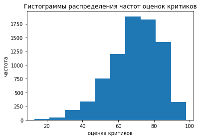
    


```python
# доля пропущенных значений
data['critic_score'].isna().mean()
```


    0.5145932141554177


Доля пропусков порядка 51 %. Медиана больше среднего - распределение смещено влево и имеет нормальный вид, без аномальных выбросов. Оставим данные с пропусками, так как заполнение более 50% средними значениями или нулевыми приведет к сильному искажению формы нормального распределения и, в целом, повлияет на объективность в данных.

### Устранение проблем в столбце user_score


```python
# просмотр описательной статистики
data['user_score'].describe()
```


    count     9839
    unique      96
    top        tbd
    freq      2376
    Name: user_score, dtype: object


```python
# вывод уникальных значений
data['user_score'].unique()
```


    array(['8', nan, '8.3', '8.5', '6.6', '8.4', '8.6', '7.7', '6.3', '7.4',
           '8.2', '9', '7.9', '8.1', '8.7', '7.1', '3.4', '5.3', '4.8', '3.2',
           '8.9', '6.4', '7.8', '7.5', '2.6', '7.2', '9.2', '7', '7.3', '4.3',
           '7.6', '5.7', '5', '9.1', '6.5', 'tbd', '8.8', '6.9', '9.4', '6.8',
           '6.1', '6.7', '5.4', '4', '4.9', '4.5', '9.3', '6.2', '4.2', '6',
           '3.7', '4.1', '5.8', '5.6', '5.5', '4.4', '4.6', '5.9', '3.9',
           '3.1', '2.9', '5.2', '3.3', '4.7', '5.1', '3.5', '2.5', '1.9', '3',
           '2.7', '2.2', '2', '9.5', '2.1', '3.6', '2.8', '1.8', '3.8', '0',
           '1.6', '9.6', '2.4', '1.7', '1.1', '0.3', '1.5', '0.7', '1.2',
           '2.3', '0.5', '1.3', '0.2', '0.6', '1.4', '0.9', '1', '9.7'],
          dtype=object)


```python
# доля пропущенных значений
data['user_score'].isna().mean()
```


    0.40173902468685396


Доля пропусков порядка 40%. Кроме того, аббревиатура 'tbd' (to be defined) означает - данные скоро будут обнародованы, но для нас это все равно, что пропуск. Заменим 'tbd' пропусками "nan" и приведем в числовой тип данные (float).


```python
# замена 'tbd' на "NAN"
data.loc[(data.user_score == 'tbd'), 'user_score'] = NAN

```


```python
# вывод уникальных значений
data['user_score'].unique()
```


    array(['8', nan, '8.3', '8.5', '6.6', '8.4', '8.6', '7.7', '6.3', '7.4',
           '8.2', '9', '7.9', '8.1', '8.7', '7.1', '3.4', '5.3', '4.8', '3.2',
           '8.9', '6.4', '7.8', '7.5', '2.6', '7.2', '9.2', '7', '7.3', '4.3',
           '7.6', '5.7', '5', '9.1', '6.5', '8.8', '6.9', '9.4', '6.8', '6.1',
           '6.7', '5.4', '4', '4.9', '4.5', '9.3', '6.2', '4.2', '6', '3.7',
           '4.1', '5.8', '5.6', '5.5', '4.4', '4.6', '5.9', '3.9', '3.1',
           '2.9', '5.2', '3.3', '4.7', '5.1', '3.5', '2.5', '1.9', '3', '2.7',
           '2.2', '2', '9.5', '2.1', '3.6', '2.8', '1.8', '3.8', '0', '1.6',
           '9.6', '2.4', '1.7', '1.1', '0.3', '1.5', '0.7', '1.2', '2.3',
           '0.5', '1.3', '0.2', '0.6', '1.4', '0.9', '1', '9.7'], dtype=object)


```python
# преобразование в 'float'
data['user_score'] = data['user_score'].astype('float')
```


```python
# просмотр описательной статистики
data['user_score'].describe()
```


    count    7463.000000
    mean        7.126330
    std         1.499447
    min         0.000000
    25%         6.400000
    50%         7.500000
    75%         8.200000
    max         9.700000
    Name: user_score, dtype: float64


```python
data['user_score'].median()
```


    7.5


```python
# просмотр гистограммы распределения частот встречающихся значений

data['user_score'].sort_values().plot(y = 'user_score', kind = 'hist')
plt.title(label='Гистограммы распределения частот оценок пользователей')
plt.xlabel("оценка пользователей ")
plt.ylabel("частота");
```


    
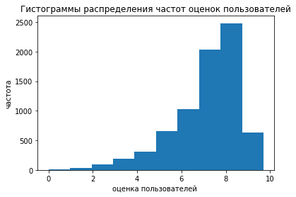
    


```python
# доля пропущенных значений
data['user_score'].isna().mean()
```


    0.5462118448254895


В результате обработки доля пропусков еще увеличилась на 15 %, однако появилась возможность анализа средних, медианных значений выборки, а также ее частотного распределения.

### Устранение проблем в столбце rating


```python
# просмотр описательной статистики
data['rating'].describe()
```


    count     9768
    unique       8
    top          E
    freq      3921
    Name: rating, dtype: object


```python
# вывод уникальных значений
data['rating'].unique()
```


    array(['E', nan, 'M', 'T', 'E10+', 'K-A', 'AO', 'EC', 'RP'], dtype=object)


```python
# доля пропущенных значений
data['rating'].isna().mean()
```


    0.4060561838744984


Доля пропусков порядка 41 %. Переменная относится к типу категориальных. Заполним пропуски значением "unknown".


```python
# заполнение пропусков
data['rating'] = data['rating'].fillna('unknown')
```


```python
# доля пропущенных значений
data['rating'].isna().mean()
```


    0.0


### Устранение проблем в столбце genre


```python
# просмотр описательной статистики
data['genre'].describe()
```


    count      16444
    unique        12
    top       Action
    freq        3307
    Name: genre, dtype: object


```python
# вывод уникальных значений
data['genre'].unique()
```


    array(['Sports', 'Platform', 'Racing', 'Role-Playing', 'Puzzle', 'Misc',
           'Shooter', 'Simulation', 'Action', 'Fighting', 'Adventure',
           'Strategy', nan], dtype=object)


```python
# доля пропущенных значений
data['genre'].isna().mean()
```


    0.00012161011796181443


Доля пропусков менее 1 %. Удалим пропуски.


```python
# удаление пропусков
data = data.dropna(subset=['genre'])
```


```python
# доля пропущенных значений
data['genre'].isna().mean()
```


    0.0


### Устранение проблем в столбце name 


```python
# просмотр описательной статистики
data['name'].describe()
```


    count                           16444
    unique                          11426
    top       Need for Speed: Most Wanted
    freq                               12
    Name: name, dtype: object


```python
# вывод уникальных значений
data['name'].unique()
```


    array(['Wii Sports', 'Super Mario Bros.', 'Mario Kart Wii', ...,
           'Woody Woodpecker in Crazy Castle 5', 'LMA Manager 2007',
           'Haitaka no Psychedelica'], dtype=object)


```python
# доля пропущенных значений
data['name'].isna().mean()
```


    0.0


### Контрольная проверка результатов предобработки


```python
# контрольная проверка на пропуски
data.isnull().sum()
```


    name                  0
    platform              0
    year_of_release       0
    genre                 0
    na_sales              0
    eu_sales              0
    jp_sales              0
    other_sales           0
    critic_score       8461
    user_score         8981
    rating                0
    dtype: int64


```python
# контрольная проверка типов данных и кол-ва ненулевых значений
data.info()
```

    <class 'pandas.core.frame.DataFrame'>
    Int64Index: 16444 entries, 0 to 16714
    Data columns (total 11 columns):
     #   Column           Non-Null Count  Dtype  
    ---  ------           --------------  -----  
     0   name             16444 non-null  object 
     1   platform         16444 non-null  object 
     2   year_of_release  16444 non-null  int64  
     3   genre            16444 non-null  object 
     4   na_sales         16444 non-null  float64
     5   eu_sales         16444 non-null  float64
     6   jp_sales         16444 non-null  float64
     7   other_sales      16444 non-null  float64
     8   critic_score     7983 non-null   float64
     9   user_score       7463 non-null   float64
     10  rating           16444 non-null  object 
    dtypes: float64(6), int64(1), object(4)
    memory usage: 1.5+ MB
    


```python
data
```


  <div id="df-0591169c-3e8c-484b-8b04-23bffb6f0894">
    <div class="colab-df-container">
      <div>
<style scoped>
    .dataframe tbody tr th:only-of-type {
        vertical-align: middle;
    }

    .dataframe tbody tr th {
        vertical-align: top;
    }

    .dataframe thead th {
        text-align: right;
    }
</style>
<table border="1" class="dataframe">
  <thead>
    <tr style="text-align: right;">
      <th></th>
      <th>name</th>
      <th>platform</th>
      <th>year_of_release</th>
      <th>genre</th>
      <th>na_sales</th>
      <th>eu_sales</th>
      <th>jp_sales</th>
      <th>other_sales</th>
      <th>critic_score</th>
      <th>user_score</th>
      <th>rating</th>
    </tr>
  </thead>
  <tbody>
    <tr>
      <th>0</th>
      <td>Wii Sports</td>
      <td>Wii</td>
      <td>2006</td>
      <td>Sports</td>
      <td>41.36</td>
      <td>28.96</td>
      <td>3.77</td>
      <td>8.45</td>
      <td>76.0</td>
      <td>8.0</td>
      <td>E</td>
    </tr>
    <tr>
      <th>1</th>
      <td>Super Mario Bros.</td>
      <td>NES</td>
      <td>1985</td>
      <td>Platform</td>
      <td>29.08</td>
      <td>3.58</td>
      <td>6.81</td>
      <td>0.77</td>
      <td>NaN</td>
      <td>NaN</td>
      <td>unknown</td>
    </tr>
    <tr>
      <th>2</th>
      <td>Mario Kart Wii</td>
      <td>Wii</td>
      <td>2008</td>
      <td>Racing</td>
      <td>15.68</td>
      <td>12.76</td>
      <td>3.79</td>
      <td>3.29</td>
      <td>82.0</td>
      <td>8.3</td>
      <td>E</td>
    </tr>
    <tr>
      <th>3</th>
      <td>Wii Sports Resort</td>
      <td>Wii</td>
      <td>2009</td>
      <td>Sports</td>
      <td>15.61</td>
      <td>10.93</td>
      <td>3.28</td>
      <td>2.95</td>
      <td>80.0</td>
      <td>8.0</td>
      <td>E</td>
    </tr>
    <tr>
      <th>4</th>
      <td>Pokemon Red/Pokemon Blue</td>
      <td>GB</td>
      <td>1996</td>
      <td>Role-Playing</td>
      <td>11.27</td>
      <td>8.89</td>
      <td>10.22</td>
      <td>1.00</td>
      <td>NaN</td>
      <td>NaN</td>
      <td>unknown</td>
    </tr>
    <tr>
      <th>...</th>
      <td>...</td>
      <td>...</td>
      <td>...</td>
      <td>...</td>
      <td>...</td>
      <td>...</td>
      <td>...</td>
      <td>...</td>
      <td>...</td>
      <td>...</td>
      <td>...</td>
    </tr>
    <tr>
      <th>16710</th>
      <td>Samurai Warriors: Sanada Maru</td>
      <td>PS3</td>
      <td>2016</td>
      <td>Action</td>
      <td>0.00</td>
      <td>0.00</td>
      <td>0.01</td>
      <td>0.00</td>
      <td>NaN</td>
      <td>NaN</td>
      <td>unknown</td>
    </tr>
    <tr>
      <th>16711</th>
      <td>LMA Manager 2007</td>
      <td>X360</td>
      <td>2006</td>
      <td>Sports</td>
      <td>0.00</td>
      <td>0.01</td>
      <td>0.00</td>
      <td>0.00</td>
      <td>NaN</td>
      <td>NaN</td>
      <td>unknown</td>
    </tr>
    <tr>
      <th>16712</th>
      <td>Haitaka no Psychedelica</td>
      <td>PSV</td>
      <td>2016</td>
      <td>Adventure</td>
      <td>0.00</td>
      <td>0.00</td>
      <td>0.01</td>
      <td>0.00</td>
      <td>NaN</td>
      <td>NaN</td>
      <td>unknown</td>
    </tr>
    <tr>
      <th>16713</th>
      <td>Spirits &amp; Spells</td>
      <td>GBA</td>
      <td>2003</td>
      <td>Platform</td>
      <td>0.01</td>
      <td>0.00</td>
      <td>0.00</td>
      <td>0.00</td>
      <td>NaN</td>
      <td>NaN</td>
      <td>unknown</td>
    </tr>
    <tr>
      <th>16714</th>
      <td>Winning Post 8 2016</td>
      <td>PSV</td>
      <td>2016</td>
      <td>Simulation</td>
      <td>0.00</td>
      <td>0.00</td>
      <td>0.01</td>
      <td>0.00</td>
      <td>NaN</td>
      <td>NaN</td>
      <td>unknown</td>
    </tr>
  </tbody>
</table>
<p>16444 rows × 11 columns</p>
</div>
      <button class="colab-df-convert" onclick="convertToInteractive('df-0591169c-3e8c-484b-8b04-23bffb6f0894')"
              title="Convert this dataframe to an interactive table."
              style="display:none;">

  <svg xmlns="http://www.w3.org/2000/svg" height="24px"viewBox="0 0 24 24"
       width="24px">
    <path d="M0 0h24v24H0V0z" fill="none"/>
    <path d="M18.56 5.44l.94 2.06.94-2.06 2.06-.94-2.06-.94-.94-2.06-.94 2.06-2.06.94zm-11 1L8.5 8.5l.94-2.06 2.06-.94-2.06-.94L8.5 2.5l-.94 2.06-2.06.94zm10 10l.94 2.06.94-2.06 2.06-.94-2.06-.94-.94-2.06-.94 2.06-2.06.94z"/><path d="M17.41 7.96l-1.37-1.37c-.4-.4-.92-.59-1.43-.59-.52 0-1.04.2-1.43.59L10.3 9.45l-7.72 7.72c-.78.78-.78 2.05 0 2.83L4 21.41c.39.39.9.59 1.41.59.51 0 1.02-.2 1.41-.59l7.78-7.78 2.81-2.81c.8-.78.8-2.07 0-2.86zM5.41 20L4 18.59l7.72-7.72 1.47 1.35L5.41 20z"/>
  </svg>
      </button>

  <style>
    .colab-df-container {
      display:flex;
      flex-wrap:wrap;
      gap: 12px;
    }

    .colab-df-convert {
      background-color: #E8F0FE;
      border: none;
      border-radius: 50%;
      cursor: pointer;
      display: none;
      fill: #1967D2;
      height: 32px;
      padding: 0 0 0 0;
      width: 32px;
    }

    .colab-df-convert:hover {
      background-color: #E2EBFA;
      box-shadow: 0px 1px 2px rgba(60, 64, 67, 0.3), 0px 1px 3px 1px rgba(60, 64, 67, 0.15);
      fill: #174EA6;
    }

    [theme=dark] .colab-df-convert {
      background-color: #3B4455;
      fill: #D2E3FC;
    }

    [theme=dark] .colab-df-convert:hover {
      background-color: #434B5C;
      box-shadow: 0px 1px 3px 1px rgba(0, 0, 0, 0.15);
      filter: drop-shadow(0px 1px 2px rgba(0, 0, 0, 0.3));
      fill: #FFFFFF;
    }
  </style>

      <script>
        const buttonEl =
          document.querySelector('#df-0591169c-3e8c-484b-8b04-23bffb6f0894 button.colab-df-convert');
        buttonEl.style.display =
          google.colab.kernel.accessAllowed ? 'block' : 'none';

        async function convertToInteractive(key) {
          const element = document.querySelector('#df-0591169c-3e8c-484b-8b04-23bffb6f0894');
          const dataTable =
            await google.colab.kernel.invokeFunction('convertToInteractive',
                                                     [key], {});
          if (!dataTable) return;

          const docLinkHtml = 'Like what you see? Visit the ' +
            '<a target="_blank" href=https://colab.research.google.com/notebooks/data_table.ipynb>data table notebook</a>'
            + ' to learn more about interactive tables.';
          element.innerHTML = '';
          dataTable['output_type'] = 'display_data';
          await google.colab.output.renderOutput(dataTable, element);
          const docLink = document.createElement('div');
          docLink.innerHTML = docLinkHtml;
          element.appendChild(docLink);
        }
      </script>
    </div>
  </div>


```python
data = data.reset_index(drop=True)
```


```python
data
```


  <div id="df-dde4a745-2d7d-45a9-88bd-c6cf63c139fe">
    <div class="colab-df-container">
      <div>
<style scoped>
    .dataframe tbody tr th:only-of-type {
        vertical-align: middle;
    }

    .dataframe tbody tr th {
        vertical-align: top;
    }

    .dataframe thead th {
        text-align: right;
    }
</style>
<table border="1" class="dataframe">
  <thead>
    <tr style="text-align: right;">
      <th></th>
      <th>name</th>
      <th>platform</th>
      <th>year_of_release</th>
      <th>genre</th>
      <th>na_sales</th>
      <th>eu_sales</th>
      <th>jp_sales</th>
      <th>other_sales</th>
      <th>critic_score</th>
      <th>user_score</th>
      <th>rating</th>
    </tr>
  </thead>
  <tbody>
    <tr>
      <th>0</th>
      <td>Wii Sports</td>
      <td>Wii</td>
      <td>2006</td>
      <td>Sports</td>
      <td>41.36</td>
      <td>28.96</td>
      <td>3.77</td>
      <td>8.45</td>
      <td>76.0</td>
      <td>8.0</td>
      <td>E</td>
    </tr>
    <tr>
      <th>1</th>
      <td>Super Mario Bros.</td>
      <td>NES</td>
      <td>1985</td>
      <td>Platform</td>
      <td>29.08</td>
      <td>3.58</td>
      <td>6.81</td>
      <td>0.77</td>
      <td>NaN</td>
      <td>NaN</td>
      <td>unknown</td>
    </tr>
    <tr>
      <th>2</th>
      <td>Mario Kart Wii</td>
      <td>Wii</td>
      <td>2008</td>
      <td>Racing</td>
      <td>15.68</td>
      <td>12.76</td>
      <td>3.79</td>
      <td>3.29</td>
      <td>82.0</td>
      <td>8.3</td>
      <td>E</td>
    </tr>
    <tr>
      <th>3</th>
      <td>Wii Sports Resort</td>
      <td>Wii</td>
      <td>2009</td>
      <td>Sports</td>
      <td>15.61</td>
      <td>10.93</td>
      <td>3.28</td>
      <td>2.95</td>
      <td>80.0</td>
      <td>8.0</td>
      <td>E</td>
    </tr>
    <tr>
      <th>4</th>
      <td>Pokemon Red/Pokemon Blue</td>
      <td>GB</td>
      <td>1996</td>
      <td>Role-Playing</td>
      <td>11.27</td>
      <td>8.89</td>
      <td>10.22</td>
      <td>1.00</td>
      <td>NaN</td>
      <td>NaN</td>
      <td>unknown</td>
    </tr>
    <tr>
      <th>...</th>
      <td>...</td>
      <td>...</td>
      <td>...</td>
      <td>...</td>
      <td>...</td>
      <td>...</td>
      <td>...</td>
      <td>...</td>
      <td>...</td>
      <td>...</td>
      <td>...</td>
    </tr>
    <tr>
      <th>16439</th>
      <td>Samurai Warriors: Sanada Maru</td>
      <td>PS3</td>
      <td>2016</td>
      <td>Action</td>
      <td>0.00</td>
      <td>0.00</td>
      <td>0.01</td>
      <td>0.00</td>
      <td>NaN</td>
      <td>NaN</td>
      <td>unknown</td>
    </tr>
    <tr>
      <th>16440</th>
      <td>LMA Manager 2007</td>
      <td>X360</td>
      <td>2006</td>
      <td>Sports</td>
      <td>0.00</td>
      <td>0.01</td>
      <td>0.00</td>
      <td>0.00</td>
      <td>NaN</td>
      <td>NaN</td>
      <td>unknown</td>
    </tr>
    <tr>
      <th>16441</th>
      <td>Haitaka no Psychedelica</td>
      <td>PSV</td>
      <td>2016</td>
      <td>Adventure</td>
      <td>0.00</td>
      <td>0.00</td>
      <td>0.01</td>
      <td>0.00</td>
      <td>NaN</td>
      <td>NaN</td>
      <td>unknown</td>
    </tr>
    <tr>
      <th>16442</th>
      <td>Spirits &amp; Spells</td>
      <td>GBA</td>
      <td>2003</td>
      <td>Platform</td>
      <td>0.01</td>
      <td>0.00</td>
      <td>0.00</td>
      <td>0.00</td>
      <td>NaN</td>
      <td>NaN</td>
      <td>unknown</td>
    </tr>
    <tr>
      <th>16443</th>
      <td>Winning Post 8 2016</td>
      <td>PSV</td>
      <td>2016</td>
      <td>Simulation</td>
      <td>0.00</td>
      <td>0.00</td>
      <td>0.01</td>
      <td>0.00</td>
      <td>NaN</td>
      <td>NaN</td>
      <td>unknown</td>
    </tr>
  </tbody>
</table>
<p>16444 rows × 11 columns</p>
</div>
      <button class="colab-df-convert" onclick="convertToInteractive('df-dde4a745-2d7d-45a9-88bd-c6cf63c139fe')"
              title="Convert this dataframe to an interactive table."
              style="display:none;">

  <svg xmlns="http://www.w3.org/2000/svg" height="24px"viewBox="0 0 24 24"
       width="24px">
    <path d="M0 0h24v24H0V0z" fill="none"/>
    <path d="M18.56 5.44l.94 2.06.94-2.06 2.06-.94-2.06-.94-.94-2.06-.94 2.06-2.06.94zm-11 1L8.5 8.5l.94-2.06 2.06-.94-2.06-.94L8.5 2.5l-.94 2.06-2.06.94zm10 10l.94 2.06.94-2.06 2.06-.94-2.06-.94-.94-2.06-.94 2.06-2.06.94z"/><path d="M17.41 7.96l-1.37-1.37c-.4-.4-.92-.59-1.43-.59-.52 0-1.04.2-1.43.59L10.3 9.45l-7.72 7.72c-.78.78-.78 2.05 0 2.83L4 21.41c.39.39.9.59 1.41.59.51 0 1.02-.2 1.41-.59l7.78-7.78 2.81-2.81c.8-.78.8-2.07 0-2.86zM5.41 20L4 18.59l7.72-7.72 1.47 1.35L5.41 20z"/>
  </svg>
      </button>

  <style>
    .colab-df-container {
      display:flex;
      flex-wrap:wrap;
      gap: 12px;
    }

    .colab-df-convert {
      background-color: #E8F0FE;
      border: none;
      border-radius: 50%;
      cursor: pointer;
      display: none;
      fill: #1967D2;
      height: 32px;
      padding: 0 0 0 0;
      width: 32px;
    }

    .colab-df-convert:hover {
      background-color: #E2EBFA;
      box-shadow: 0px 1px 2px rgba(60, 64, 67, 0.3), 0px 1px 3px 1px rgba(60, 64, 67, 0.15);
      fill: #174EA6;
    }

    [theme=dark] .colab-df-convert {
      background-color: #3B4455;
      fill: #D2E3FC;
    }

    [theme=dark] .colab-df-convert:hover {
      background-color: #434B5C;
      box-shadow: 0px 1px 3px 1px rgba(0, 0, 0, 0.15);
      filter: drop-shadow(0px 1px 2px rgba(0, 0, 0, 0.3));
      fill: #FFFFFF;
    }
  </style>

      <script>
        const buttonEl =
          document.querySelector('#df-dde4a745-2d7d-45a9-88bd-c6cf63c139fe button.colab-df-convert');
        buttonEl.style.display =
          google.colab.kernel.accessAllowed ? 'block' : 'none';

        async function convertToInteractive(key) {
          const element = document.querySelector('#df-dde4a745-2d7d-45a9-88bd-c6cf63c139fe');
          const dataTable =
            await google.colab.kernel.invokeFunction('convertToInteractive',
                                                     [key], {});
          if (!dataTable) return;

          const docLinkHtml = 'Like what you see? Visit the ' +
            '<a target="_blank" href=https://colab.research.google.com/notebooks/data_table.ipynb>data table notebook</a>'
            + ' to learn more about interactive tables.';
          element.innerHTML = '';
          dataTable['output_type'] = 'display_data';
          await google.colab.output.renderOutput(dataTable, element);
          const docLink = document.createElement('div');
          docLink.innerHTML = docLinkHtml;
          element.appendChild(docLink);
        }
      </script>
    </div>
  </div>


### Расчёты и добавление результатов в таблицу


```python
# формируем столбец и округляем в нем значения до сотых
data['total_sales'] = round((data['na_sales'] + data['eu_sales'] + data['jp_sales'] + data['other_sales']), 2)
```


```python
data.head()
```


  <div id="df-7ed0d804-bf59-4cfd-b12a-d3df669dda52">
    <div class="colab-df-container">
      <div>
<style scoped>
    .dataframe tbody tr th:only-of-type {
        vertical-align: middle;
    }

    .dataframe tbody tr th {
        vertical-align: top;
    }

    .dataframe thead th {
        text-align: right;
    }
</style>
<table border="1" class="dataframe">
  <thead>
    <tr style="text-align: right;">
      <th></th>
      <th>name</th>
      <th>platform</th>
      <th>year_of_release</th>
      <th>genre</th>
      <th>na_sales</th>
      <th>eu_sales</th>
      <th>jp_sales</th>
      <th>other_sales</th>
      <th>critic_score</th>
      <th>user_score</th>
      <th>rating</th>
      <th>total_sales</th>
    </tr>
  </thead>
  <tbody>
    <tr>
      <th>0</th>
      <td>Wii Sports</td>
      <td>Wii</td>
      <td>2006</td>
      <td>Sports</td>
      <td>41.36</td>
      <td>28.96</td>
      <td>3.77</td>
      <td>8.45</td>
      <td>76.0</td>
      <td>8.0</td>
      <td>E</td>
      <td>82.54</td>
    </tr>
    <tr>
      <th>1</th>
      <td>Super Mario Bros.</td>
      <td>NES</td>
      <td>1985</td>
      <td>Platform</td>
      <td>29.08</td>
      <td>3.58</td>
      <td>6.81</td>
      <td>0.77</td>
      <td>NaN</td>
      <td>NaN</td>
      <td>unknown</td>
      <td>40.24</td>
    </tr>
    <tr>
      <th>2</th>
      <td>Mario Kart Wii</td>
      <td>Wii</td>
      <td>2008</td>
      <td>Racing</td>
      <td>15.68</td>
      <td>12.76</td>
      <td>3.79</td>
      <td>3.29</td>
      <td>82.0</td>
      <td>8.3</td>
      <td>E</td>
      <td>35.52</td>
    </tr>
    <tr>
      <th>3</th>
      <td>Wii Sports Resort</td>
      <td>Wii</td>
      <td>2009</td>
      <td>Sports</td>
      <td>15.61</td>
      <td>10.93</td>
      <td>3.28</td>
      <td>2.95</td>
      <td>80.0</td>
      <td>8.0</td>
      <td>E</td>
      <td>32.77</td>
    </tr>
    <tr>
      <th>4</th>
      <td>Pokemon Red/Pokemon Blue</td>
      <td>GB</td>
      <td>1996</td>
      <td>Role-Playing</td>
      <td>11.27</td>
      <td>8.89</td>
      <td>10.22</td>
      <td>1.00</td>
      <td>NaN</td>
      <td>NaN</td>
      <td>unknown</td>
      <td>31.38</td>
    </tr>
  </tbody>
</table>
</div>
      <button class="colab-df-convert" onclick="convertToInteractive('df-7ed0d804-bf59-4cfd-b12a-d3df669dda52')"
              title="Convert this dataframe to an interactive table."
              style="display:none;">

  <svg xmlns="http://www.w3.org/2000/svg" height="24px"viewBox="0 0 24 24"
       width="24px">
    <path d="M0 0h24v24H0V0z" fill="none"/>
    <path d="M18.56 5.44l.94 2.06.94-2.06 2.06-.94-2.06-.94-.94-2.06-.94 2.06-2.06.94zm-11 1L8.5 8.5l.94-2.06 2.06-.94-2.06-.94L8.5 2.5l-.94 2.06-2.06.94zm10 10l.94 2.06.94-2.06 2.06-.94-2.06-.94-.94-2.06-.94 2.06-2.06.94z"/><path d="M17.41 7.96l-1.37-1.37c-.4-.4-.92-.59-1.43-.59-.52 0-1.04.2-1.43.59L10.3 9.45l-7.72 7.72c-.78.78-.78 2.05 0 2.83L4 21.41c.39.39.9.59 1.41.59.51 0 1.02-.2 1.41-.59l7.78-7.78 2.81-2.81c.8-.78.8-2.07 0-2.86zM5.41 20L4 18.59l7.72-7.72 1.47 1.35L5.41 20z"/>
  </svg>
      </button>

  <style>
    .colab-df-container {
      display:flex;
      flex-wrap:wrap;
      gap: 12px;
    }

    .colab-df-convert {
      background-color: #E8F0FE;
      border: none;
      border-radius: 50%;
      cursor: pointer;
      display: none;
      fill: #1967D2;
      height: 32px;
      padding: 0 0 0 0;
      width: 32px;
    }

    .colab-df-convert:hover {
      background-color: #E2EBFA;
      box-shadow: 0px 1px 2px rgba(60, 64, 67, 0.3), 0px 1px 3px 1px rgba(60, 64, 67, 0.15);
      fill: #174EA6;
    }

    [theme=dark] .colab-df-convert {
      background-color: #3B4455;
      fill: #D2E3FC;
    }

    [theme=dark] .colab-df-convert:hover {
      background-color: #434B5C;
      box-shadow: 0px 1px 3px 1px rgba(0, 0, 0, 0.15);
      filter: drop-shadow(0px 1px 2px rgba(0, 0, 0, 0.3));
      fill: #FFFFFF;
    }
  </style>

      <script>
        const buttonEl =
          document.querySelector('#df-7ed0d804-bf59-4cfd-b12a-d3df669dda52 button.colab-df-convert');
        buttonEl.style.display =
          google.colab.kernel.accessAllowed ? 'block' : 'none';

        async function convertToInteractive(key) {
          const element = document.querySelector('#df-7ed0d804-bf59-4cfd-b12a-d3df669dda52');
          const dataTable =
            await google.colab.kernel.invokeFunction('convertToInteractive',
                                                     [key], {});
          if (!dataTable) return;

          const docLinkHtml = 'Like what you see? Visit the ' +
            '<a target="_blank" href=https://colab.research.google.com/notebooks/data_table.ipynb>data table notebook</a>'
            + ' to learn more about interactive tables.';
          element.innerHTML = '';
          dataTable['output_type'] = 'display_data';
          await google.colab.output.renderOutput(dataTable, element);
          const docLink = document.createElement('div');
          docLink.innerHTML = docLinkHtml;
          element.appendChild(docLink);
        }
      </script>
    </div>
  </div>


### Вывод

**В результате предобработки, установлено и выполнено следующие:**

1. Изменены названия столбцов (приведите к нижнему регистру).
2. Преобразованы данные в столбце "year_of_release" и "user_score" в тип int64 и float64 соответственно.
3. Удалены пропуски по столбцам "name" и "genre" (доля пропусков менне 1 %).
4. В столбце "rating" заполнены пропуски значением "unknown", так как переменная относится к типу категориальных и доля пропусков порядка 41 %.
5. В столбце "user_score" доля пропусков сначала составляла порядка 54 %.  Обнаруженные значения 'tbd' (to be defined - данные скоро будут обнародованы) были заполнены пропусками "NAN". В результате доля пропусков еще увеличилась на 15 %, однако появилась возможность анализа средних, медианных значений выборки, а также ее частотного распределения. Также необходимо отметить, что внесенные изменения в целом, не повлияли на объективность в данных.
6. В столбце "critic_score" доля пропусков составила порядка 51 %. Медиана больше среднего - распределение смещено влево и имеет нормальный вид, без аномальных выбросов. Оставим данные с пропусками как есть, так как заполнение более 50% средними значениями или нулевыми приведет к сильному искажению формы нормального распределения и, в целом, повлияет на объективность в данных.
7. Добавлен столбец "total_sales" - показывающий суммарные продажи во всех регионах.


## Исследовательский анализ данных

### Сколько игр выпускалось в разные годы


```python
# формируем сводную таблицу
data_pivot_year_of_release = data.pivot_table(index = ['year_of_release'], values = 'total_sales', aggfunc = 'count')
```


```python
# переименование столбцов сводной таблицы
data_pivot_year_of_release.columns = ['game_release_count']
```


```python
# вывод сводной таблицы
data_pivot_year_of_release
```


  <div id="df-2b5458bc-568d-46b1-a1f2-0a0cd340bd2a">
    <div class="colab-df-container">
      <div>
<style scoped>
    .dataframe tbody tr th:only-of-type {
        vertical-align: middle;
    }

    .dataframe tbody tr th {
        vertical-align: top;
    }

    .dataframe thead th {
        text-align: right;
    }
</style>
<table border="1" class="dataframe">
  <thead>
    <tr style="text-align: right;">
      <th></th>
      <th>game_release_count</th>
    </tr>
    <tr>
      <th>year_of_release</th>
      <th></th>
    </tr>
  </thead>
  <tbody>
    <tr>
      <th>1980</th>
      <td>9</td>
    </tr>
    <tr>
      <th>1981</th>
      <td>46</td>
    </tr>
    <tr>
      <th>1982</th>
      <td>36</td>
    </tr>
    <tr>
      <th>1983</th>
      <td>17</td>
    </tr>
    <tr>
      <th>1984</th>
      <td>14</td>
    </tr>
    <tr>
      <th>1985</th>
      <td>14</td>
    </tr>
    <tr>
      <th>1986</th>
      <td>21</td>
    </tr>
    <tr>
      <th>1987</th>
      <td>16</td>
    </tr>
    <tr>
      <th>1988</th>
      <td>15</td>
    </tr>
    <tr>
      <th>1989</th>
      <td>17</td>
    </tr>
    <tr>
      <th>1990</th>
      <td>16</td>
    </tr>
    <tr>
      <th>1991</th>
      <td>41</td>
    </tr>
    <tr>
      <th>1992</th>
      <td>43</td>
    </tr>
    <tr>
      <th>1993</th>
      <td>60</td>
    </tr>
    <tr>
      <th>1994</th>
      <td>121</td>
    </tr>
    <tr>
      <th>1995</th>
      <td>219</td>
    </tr>
    <tr>
      <th>1996</th>
      <td>263</td>
    </tr>
    <tr>
      <th>1997</th>
      <td>289</td>
    </tr>
    <tr>
      <th>1998</th>
      <td>379</td>
    </tr>
    <tr>
      <th>1999</th>
      <td>338</td>
    </tr>
    <tr>
      <th>2000</th>
      <td>350</td>
    </tr>
    <tr>
      <th>2001</th>
      <td>482</td>
    </tr>
    <tr>
      <th>2002</th>
      <td>829</td>
    </tr>
    <tr>
      <th>2003</th>
      <td>775</td>
    </tr>
    <tr>
      <th>2004</th>
      <td>762</td>
    </tr>
    <tr>
      <th>2005</th>
      <td>939</td>
    </tr>
    <tr>
      <th>2006</th>
      <td>1006</td>
    </tr>
    <tr>
      <th>2007</th>
      <td>1197</td>
    </tr>
    <tr>
      <th>2008</th>
      <td>1427</td>
    </tr>
    <tr>
      <th>2009</th>
      <td>1426</td>
    </tr>
    <tr>
      <th>2010</th>
      <td>1255</td>
    </tr>
    <tr>
      <th>2011</th>
      <td>1136</td>
    </tr>
    <tr>
      <th>2012</th>
      <td>653</td>
    </tr>
    <tr>
      <th>2013</th>
      <td>544</td>
    </tr>
    <tr>
      <th>2014</th>
      <td>581</td>
    </tr>
    <tr>
      <th>2015</th>
      <td>606</td>
    </tr>
    <tr>
      <th>2016</th>
      <td>502</td>
    </tr>
  </tbody>
</table>
</div>
      <button class="colab-df-convert" onclick="convertToInteractive('df-2b5458bc-568d-46b1-a1f2-0a0cd340bd2a')"
              title="Convert this dataframe to an interactive table."
              style="display:none;">

  <svg xmlns="http://www.w3.org/2000/svg" height="24px"viewBox="0 0 24 24"
       width="24px">
    <path d="M0 0h24v24H0V0z" fill="none"/>
    <path d="M18.56 5.44l.94 2.06.94-2.06 2.06-.94-2.06-.94-.94-2.06-.94 2.06-2.06.94zm-11 1L8.5 8.5l.94-2.06 2.06-.94-2.06-.94L8.5 2.5l-.94 2.06-2.06.94zm10 10l.94 2.06.94-2.06 2.06-.94-2.06-.94-.94-2.06-.94 2.06-2.06.94z"/><path d="M17.41 7.96l-1.37-1.37c-.4-.4-.92-.59-1.43-.59-.52 0-1.04.2-1.43.59L10.3 9.45l-7.72 7.72c-.78.78-.78 2.05 0 2.83L4 21.41c.39.39.9.59 1.41.59.51 0 1.02-.2 1.41-.59l7.78-7.78 2.81-2.81c.8-.78.8-2.07 0-2.86zM5.41 20L4 18.59l7.72-7.72 1.47 1.35L5.41 20z"/>
  </svg>
      </button>

  <style>
    .colab-df-container {
      display:flex;
      flex-wrap:wrap;
      gap: 12px;
    }

    .colab-df-convert {
      background-color: #E8F0FE;
      border: none;
      border-radius: 50%;
      cursor: pointer;
      display: none;
      fill: #1967D2;
      height: 32px;
      padding: 0 0 0 0;
      width: 32px;
    }

    .colab-df-convert:hover {
      background-color: #E2EBFA;
      box-shadow: 0px 1px 2px rgba(60, 64, 67, 0.3), 0px 1px 3px 1px rgba(60, 64, 67, 0.15);
      fill: #174EA6;
    }

    [theme=dark] .colab-df-convert {
      background-color: #3B4455;
      fill: #D2E3FC;
    }

    [theme=dark] .colab-df-convert:hover {
      background-color: #434B5C;
      box-shadow: 0px 1px 3px 1px rgba(0, 0, 0, 0.15);
      filter: drop-shadow(0px 1px 2px rgba(0, 0, 0, 0.3));
      fill: #FFFFFF;
    }
  </style>

      <script>
        const buttonEl =
          document.querySelector('#df-2b5458bc-568d-46b1-a1f2-0a0cd340bd2a button.colab-df-convert');
        buttonEl.style.display =
          google.colab.kernel.accessAllowed ? 'block' : 'none';

        async function convertToInteractive(key) {
          const element = document.querySelector('#df-2b5458bc-568d-46b1-a1f2-0a0cd340bd2a');
          const dataTable =
            await google.colab.kernel.invokeFunction('convertToInteractive',
                                                     [key], {});
          if (!dataTable) return;

          const docLinkHtml = 'Like what you see? Visit the ' +
            '<a target="_blank" href=https://colab.research.google.com/notebooks/data_table.ipynb>data table notebook</a>'
            + ' to learn more about interactive tables.';
          element.innerHTML = '';
          dataTable['output_type'] = 'display_data';
          await google.colab.output.renderOutput(dataTable, element);
          const docLink = document.createElement('div');
          docLink.innerHTML = docLinkHtml;
          element.appendChild(docLink);
        }
      </script>
    </div>
  </div>


```python
# график по годам и количеству релизов
data_pivot_year_of_release.plot(figsize=(12, 5))
plt.title(label='Распределение количества выпущенных игр с 1980 по 2016 год')
plt.xlabel("год релиза")
plt.ylabel("количество");
```


    
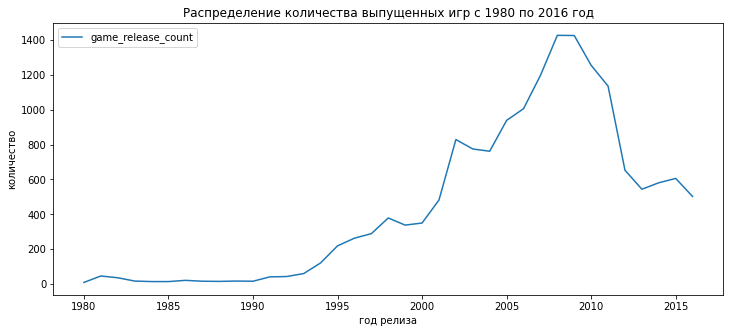
    


```python
# просмотр описательной статистики сводной таблицы
data_pivot_year_of_release.describe()
```


  <div id="df-75d73d89-3e98-4ed0-8522-85bcd549f8f2">
    <div class="colab-df-container">
      <div>
<style scoped>
    .dataframe tbody tr th:only-of-type {
        vertical-align: middle;
    }

    .dataframe tbody tr th {
        vertical-align: top;
    }

    .dataframe thead th {
        text-align: right;
    }
</style>
<table border="1" class="dataframe">
  <thead>
    <tr style="text-align: right;">
      <th></th>
      <th>game_release_count</th>
    </tr>
  </thead>
  <tbody>
    <tr>
      <th>count</th>
      <td>37.000000</td>
    </tr>
    <tr>
      <th>mean</th>
      <td>444.432432</td>
    </tr>
    <tr>
      <th>std</th>
      <td>451.604334</td>
    </tr>
    <tr>
      <th>min</th>
      <td>9.000000</td>
    </tr>
    <tr>
      <th>25%</th>
      <td>36.000000</td>
    </tr>
    <tr>
      <th>50%</th>
      <td>338.000000</td>
    </tr>
    <tr>
      <th>75%</th>
      <td>762.000000</td>
    </tr>
    <tr>
      <th>max</th>
      <td>1427.000000</td>
    </tr>
  </tbody>
</table>
</div>
      <button class="colab-df-convert" onclick="convertToInteractive('df-75d73d89-3e98-4ed0-8522-85bcd549f8f2')"
              title="Convert this dataframe to an interactive table."
              style="display:none;">

  <svg xmlns="http://www.w3.org/2000/svg" height="24px"viewBox="0 0 24 24"
       width="24px">
    <path d="M0 0h24v24H0V0z" fill="none"/>
    <path d="M18.56 5.44l.94 2.06.94-2.06 2.06-.94-2.06-.94-.94-2.06-.94 2.06-2.06.94zm-11 1L8.5 8.5l.94-2.06 2.06-.94-2.06-.94L8.5 2.5l-.94 2.06-2.06.94zm10 10l.94 2.06.94-2.06 2.06-.94-2.06-.94-.94-2.06-.94 2.06-2.06.94z"/><path d="M17.41 7.96l-1.37-1.37c-.4-.4-.92-.59-1.43-.59-.52 0-1.04.2-1.43.59L10.3 9.45l-7.72 7.72c-.78.78-.78 2.05 0 2.83L4 21.41c.39.39.9.59 1.41.59.51 0 1.02-.2 1.41-.59l7.78-7.78 2.81-2.81c.8-.78.8-2.07 0-2.86zM5.41 20L4 18.59l7.72-7.72 1.47 1.35L5.41 20z"/>
  </svg>
      </button>

  <style>
    .colab-df-container {
      display:flex;
      flex-wrap:wrap;
      gap: 12px;
    }

    .colab-df-convert {
      background-color: #E8F0FE;
      border: none;
      border-radius: 50%;
      cursor: pointer;
      display: none;
      fill: #1967D2;
      height: 32px;
      padding: 0 0 0 0;
      width: 32px;
    }

    .colab-df-convert:hover {
      background-color: #E2EBFA;
      box-shadow: 0px 1px 2px rgba(60, 64, 67, 0.3), 0px 1px 3px 1px rgba(60, 64, 67, 0.15);
      fill: #174EA6;
    }

    [theme=dark] .colab-df-convert {
      background-color: #3B4455;
      fill: #D2E3FC;
    }

    [theme=dark] .colab-df-convert:hover {
      background-color: #434B5C;
      box-shadow: 0px 1px 3px 1px rgba(0, 0, 0, 0.15);
      filter: drop-shadow(0px 1px 2px rgba(0, 0, 0, 0.3));
      fill: #FFFFFF;
    }
  </style>

      <script>
        const buttonEl =
          document.querySelector('#df-75d73d89-3e98-4ed0-8522-85bcd549f8f2 button.colab-df-convert');
        buttonEl.style.display =
          google.colab.kernel.accessAllowed ? 'block' : 'none';

        async function convertToInteractive(key) {
          const element = document.querySelector('#df-75d73d89-3e98-4ed0-8522-85bcd549f8f2');
          const dataTable =
            await google.colab.kernel.invokeFunction('convertToInteractive',
                                                     [key], {});
          if (!dataTable) return;

          const docLinkHtml = 'Like what you see? Visit the ' +
            '<a target="_blank" href=https://colab.research.google.com/notebooks/data_table.ipynb>data table notebook</a>'
            + ' to learn more about interactive tables.';
          element.innerHTML = '';
          dataTable['output_type'] = 'display_data';
          await google.colab.output.renderOutput(dataTable, element);
          const docLink = document.createElement('div');
          docLink.innerHTML = docLinkHtml;
          element.appendChild(docLink);
        }
      </script>
    </div>
  </div>


```python
# год с минимальным количеством релизов
year_of_release_min = data_pivot_year_of_release[data_pivot_year_of_release['game_release_count'] == 9]
year_of_release_min
```


  <div id="df-1458d4b7-ae5a-4bfc-b7c3-55e5e6d7c1ac">
    <div class="colab-df-container">
      <div>
<style scoped>
    .dataframe tbody tr th:only-of-type {
        vertical-align: middle;
    }

    .dataframe tbody tr th {
        vertical-align: top;
    }

    .dataframe thead th {
        text-align: right;
    }
</style>
<table border="1" class="dataframe">
  <thead>
    <tr style="text-align: right;">
      <th></th>
      <th>game_release_count</th>
    </tr>
    <tr>
      <th>year_of_release</th>
      <th></th>
    </tr>
  </thead>
  <tbody>
    <tr>
      <th>1980</th>
      <td>9</td>
    </tr>
  </tbody>
</table>
</div>
      <button class="colab-df-convert" onclick="convertToInteractive('df-1458d4b7-ae5a-4bfc-b7c3-55e5e6d7c1ac')"
              title="Convert this dataframe to an interactive table."
              style="display:none;">

  <svg xmlns="http://www.w3.org/2000/svg" height="24px"viewBox="0 0 24 24"
       width="24px">
    <path d="M0 0h24v24H0V0z" fill="none"/>
    <path d="M18.56 5.44l.94 2.06.94-2.06 2.06-.94-2.06-.94-.94-2.06-.94 2.06-2.06.94zm-11 1L8.5 8.5l.94-2.06 2.06-.94-2.06-.94L8.5 2.5l-.94 2.06-2.06.94zm10 10l.94 2.06.94-2.06 2.06-.94-2.06-.94-.94-2.06-.94 2.06-2.06.94z"/><path d="M17.41 7.96l-1.37-1.37c-.4-.4-.92-.59-1.43-.59-.52 0-1.04.2-1.43.59L10.3 9.45l-7.72 7.72c-.78.78-.78 2.05 0 2.83L4 21.41c.39.39.9.59 1.41.59.51 0 1.02-.2 1.41-.59l7.78-7.78 2.81-2.81c.8-.78.8-2.07 0-2.86zM5.41 20L4 18.59l7.72-7.72 1.47 1.35L5.41 20z"/>
  </svg>
      </button>

  <style>
    .colab-df-container {
      display:flex;
      flex-wrap:wrap;
      gap: 12px;
    }

    .colab-df-convert {
      background-color: #E8F0FE;
      border: none;
      border-radius: 50%;
      cursor: pointer;
      display: none;
      fill: #1967D2;
      height: 32px;
      padding: 0 0 0 0;
      width: 32px;
    }

    .colab-df-convert:hover {
      background-color: #E2EBFA;
      box-shadow: 0px 1px 2px rgba(60, 64, 67, 0.3), 0px 1px 3px 1px rgba(60, 64, 67, 0.15);
      fill: #174EA6;
    }

    [theme=dark] .colab-df-convert {
      background-color: #3B4455;
      fill: #D2E3FC;
    }

    [theme=dark] .colab-df-convert:hover {
      background-color: #434B5C;
      box-shadow: 0px 1px 3px 1px rgba(0, 0, 0, 0.15);
      filter: drop-shadow(0px 1px 2px rgba(0, 0, 0, 0.3));
      fill: #FFFFFF;
    }
  </style>

      <script>
        const buttonEl =
          document.querySelector('#df-1458d4b7-ae5a-4bfc-b7c3-55e5e6d7c1ac button.colab-df-convert');
        buttonEl.style.display =
          google.colab.kernel.accessAllowed ? 'block' : 'none';

        async function convertToInteractive(key) {
          const element = document.querySelector('#df-1458d4b7-ae5a-4bfc-b7c3-55e5e6d7c1ac');
          const dataTable =
            await google.colab.kernel.invokeFunction('convertToInteractive',
                                                     [key], {});
          if (!dataTable) return;

          const docLinkHtml = 'Like what you see? Visit the ' +
            '<a target="_blank" href=https://colab.research.google.com/notebooks/data_table.ipynb>data table notebook</a>'
            + ' to learn more about interactive tables.';
          element.innerHTML = '';
          dataTable['output_type'] = 'display_data';
          await google.colab.output.renderOutput(dataTable, element);
          const docLink = document.createElement('div');
          docLink.innerHTML = docLinkHtml;
          element.appendChild(docLink);
        }
      </script>
    </div>
  </div>


```python
# год с максимальным количеством релизов
year_of_release_max = data_pivot_year_of_release[data_pivot_year_of_release['game_release_count'] == 1427]
year_of_release_max
```


  <div id="df-df3aca0f-5a69-4eeb-9a5d-e05940d950c0">
    <div class="colab-df-container">
      <div>
<style scoped>
    .dataframe tbody tr th:only-of-type {
        vertical-align: middle;
    }

    .dataframe tbody tr th {
        vertical-align: top;
    }

    .dataframe thead th {
        text-align: right;
    }
</style>
<table border="1" class="dataframe">
  <thead>
    <tr style="text-align: right;">
      <th></th>
      <th>game_release_count</th>
    </tr>
    <tr>
      <th>year_of_release</th>
      <th></th>
    </tr>
  </thead>
  <tbody>
    <tr>
      <th>2008</th>
      <td>1427</td>
    </tr>
  </tbody>
</table>
</div>
      <button class="colab-df-convert" onclick="convertToInteractive('df-df3aca0f-5a69-4eeb-9a5d-e05940d950c0')"
              title="Convert this dataframe to an interactive table."
              style="display:none;">

  <svg xmlns="http://www.w3.org/2000/svg" height="24px"viewBox="0 0 24 24"
       width="24px">
    <path d="M0 0h24v24H0V0z" fill="none"/>
    <path d="M18.56 5.44l.94 2.06.94-2.06 2.06-.94-2.06-.94-.94-2.06-.94 2.06-2.06.94zm-11 1L8.5 8.5l.94-2.06 2.06-.94-2.06-.94L8.5 2.5l-.94 2.06-2.06.94zm10 10l.94 2.06.94-2.06 2.06-.94-2.06-.94-.94-2.06-.94 2.06-2.06.94z"/><path d="M17.41 7.96l-1.37-1.37c-.4-.4-.92-.59-1.43-.59-.52 0-1.04.2-1.43.59L10.3 9.45l-7.72 7.72c-.78.78-.78 2.05 0 2.83L4 21.41c.39.39.9.59 1.41.59.51 0 1.02-.2 1.41-.59l7.78-7.78 2.81-2.81c.8-.78.8-2.07 0-2.86zM5.41 20L4 18.59l7.72-7.72 1.47 1.35L5.41 20z"/>
  </svg>
      </button>

  <style>
    .colab-df-container {
      display:flex;
      flex-wrap:wrap;
      gap: 12px;
    }

    .colab-df-convert {
      background-color: #E8F0FE;
      border: none;
      border-radius: 50%;
      cursor: pointer;
      display: none;
      fill: #1967D2;
      height: 32px;
      padding: 0 0 0 0;
      width: 32px;
    }

    .colab-df-convert:hover {
      background-color: #E2EBFA;
      box-shadow: 0px 1px 2px rgba(60, 64, 67, 0.3), 0px 1px 3px 1px rgba(60, 64, 67, 0.15);
      fill: #174EA6;
    }

    [theme=dark] .colab-df-convert {
      background-color: #3B4455;
      fill: #D2E3FC;
    }

    [theme=dark] .colab-df-convert:hover {
      background-color: #434B5C;
      box-shadow: 0px 1px 3px 1px rgba(0, 0, 0, 0.15);
      filter: drop-shadow(0px 1px 2px rgba(0, 0, 0, 0.3));
      fill: #FFFFFF;
    }
  </style>

      <script>
        const buttonEl =
          document.querySelector('#df-df3aca0f-5a69-4eeb-9a5d-e05940d950c0 button.colab-df-convert');
        buttonEl.style.display =
          google.colab.kernel.accessAllowed ? 'block' : 'none';

        async function convertToInteractive(key) {
          const element = document.querySelector('#df-df3aca0f-5a69-4eeb-9a5d-e05940d950c0');
          const dataTable =
            await google.colab.kernel.invokeFunction('convertToInteractive',
                                                     [key], {});
          if (!dataTable) return;

          const docLinkHtml = 'Like what you see? Visit the ' +
            '<a target="_blank" href=https://colab.research.google.com/notebooks/data_table.ipynb>data table notebook</a>'
            + ' to learn more about interactive tables.';
          element.innerHTML = '';
          dataTable['output_type'] = 'display_data';
          await google.colab.output.renderOutput(dataTable, element);
          const docLink = document.createElement('div');
          docLink.innerHTML = docLinkHtml;
          element.appendChild(docLink);
        }
      </script>
    </div>
  </div>


#### Вывод

1. На протяжении периода с 1980 по 2008 годы наблюдался рост выпускаемых релизов с 9 до 1427. 
2. В период с 2008 по 2016 годы начался спад. Количество выпускаемых в год релизов снизилось до 502.
3. Среднее количество релизов, выпускаемых в год, составляет порядка 444.

### Как менялись продажи по платформам. Выбор платформы с наибольшими суммарными продажами и построение распределение по годам. Характерный срок появлия новых и исчезания старых платформ


```python
# формируем сводную таблицу
data_pivot_platform = data.pivot_table(index = ['platform'], values = 'total_sales', aggfunc = 'sum')
```


```python
# переименование столбца сводной таблицы
data_pivot_platform.columns = ['total_sales_platform']
```


```python
# вывод отсортированного списка
data_pivot_platform.sort_values(by='total_sales_platform', ascending=False).head(10)
```


  <div id="df-fcf8efc9-d136-42c9-bae4-a62817b2dbc0">
    <div class="colab-df-container">
      <div>
<style scoped>
    .dataframe tbody tr th:only-of-type {
        vertical-align: middle;
    }

    .dataframe tbody tr th {
        vertical-align: top;
    }

    .dataframe thead th {
        text-align: right;
    }
</style>
<table border="1" class="dataframe">
  <thead>
    <tr style="text-align: right;">
      <th></th>
      <th>total_sales_platform</th>
    </tr>
    <tr>
      <th>platform</th>
      <th></th>
    </tr>
  </thead>
  <tbody>
    <tr>
      <th>PS2</th>
      <td>1233.56</td>
    </tr>
    <tr>
      <th>X360</th>
      <td>961.24</td>
    </tr>
    <tr>
      <th>PS3</th>
      <td>931.34</td>
    </tr>
    <tr>
      <th>Wii</th>
      <td>891.18</td>
    </tr>
    <tr>
      <th>DS</th>
      <td>802.78</td>
    </tr>
    <tr>
      <th>PS</th>
      <td>727.58</td>
    </tr>
    <tr>
      <th>PS4</th>
      <td>314.14</td>
    </tr>
    <tr>
      <th>GBA</th>
      <td>312.88</td>
    </tr>
    <tr>
      <th>PSP</th>
      <td>289.53</td>
    </tr>
    <tr>
      <th>3DS</th>
      <td>257.81</td>
    </tr>
  </tbody>
</table>
</div>
      <button class="colab-df-convert" onclick="convertToInteractive('df-fcf8efc9-d136-42c9-bae4-a62817b2dbc0')"
              title="Convert this dataframe to an interactive table."
              style="display:none;">

  <svg xmlns="http://www.w3.org/2000/svg" height="24px"viewBox="0 0 24 24"
       width="24px">
    <path d="M0 0h24v24H0V0z" fill="none"/>
    <path d="M18.56 5.44l.94 2.06.94-2.06 2.06-.94-2.06-.94-.94-2.06-.94 2.06-2.06.94zm-11 1L8.5 8.5l.94-2.06 2.06-.94-2.06-.94L8.5 2.5l-.94 2.06-2.06.94zm10 10l.94 2.06.94-2.06 2.06-.94-2.06-.94-.94-2.06-.94 2.06-2.06.94z"/><path d="M17.41 7.96l-1.37-1.37c-.4-.4-.92-.59-1.43-.59-.52 0-1.04.2-1.43.59L10.3 9.45l-7.72 7.72c-.78.78-.78 2.05 0 2.83L4 21.41c.39.39.9.59 1.41.59.51 0 1.02-.2 1.41-.59l7.78-7.78 2.81-2.81c.8-.78.8-2.07 0-2.86zM5.41 20L4 18.59l7.72-7.72 1.47 1.35L5.41 20z"/>
  </svg>
      </button>

  <style>
    .colab-df-container {
      display:flex;
      flex-wrap:wrap;
      gap: 12px;
    }

    .colab-df-convert {
      background-color: #E8F0FE;
      border: none;
      border-radius: 50%;
      cursor: pointer;
      display: none;
      fill: #1967D2;
      height: 32px;
      padding: 0 0 0 0;
      width: 32px;
    }

    .colab-df-convert:hover {
      background-color: #E2EBFA;
      box-shadow: 0px 1px 2px rgba(60, 64, 67, 0.3), 0px 1px 3px 1px rgba(60, 64, 67, 0.15);
      fill: #174EA6;
    }

    [theme=dark] .colab-df-convert {
      background-color: #3B4455;
      fill: #D2E3FC;
    }

    [theme=dark] .colab-df-convert:hover {
      background-color: #434B5C;
      box-shadow: 0px 1px 3px 1px rgba(0, 0, 0, 0.15);
      filter: drop-shadow(0px 1px 2px rgba(0, 0, 0, 0.3));
      fill: #FFFFFF;
    }
  </style>

      <script>
        const buttonEl =
          document.querySelector('#df-fcf8efc9-d136-42c9-bae4-a62817b2dbc0 button.colab-df-convert');
        buttonEl.style.display =
          google.colab.kernel.accessAllowed ? 'block' : 'none';

        async function convertToInteractive(key) {
          const element = document.querySelector('#df-fcf8efc9-d136-42c9-bae4-a62817b2dbc0');
          const dataTable =
            await google.colab.kernel.invokeFunction('convertToInteractive',
                                                     [key], {});
          if (!dataTable) return;

          const docLinkHtml = 'Like what you see? Visit the ' +
            '<a target="_blank" href=https://colab.research.google.com/notebooks/data_table.ipynb>data table notebook</a>'
            + ' to learn more about interactive tables.';
          element.innerHTML = '';
          dataTable['output_type'] = 'display_data';
          await google.colab.output.renderOutput(dataTable, element);
          const docLink = document.createElement('div');
          docLink.innerHTML = docLinkHtml;
          element.appendChild(docLink);
        }
      </script>
    </div>
  </div>


#### TOP-10 platform


```python
# формируем список TOP-10 платформ
list_top_10 = data_pivot_platform.sort_values(by='total_sales_platform', ascending=False).head(10).reset_index()
list_top_10 = list_top_10['platform'].unique()
list_top_10
```


    array(['PS2', 'X360', 'PS3', 'Wii', 'DS', 'PS', 'PS4', 'GBA', 'PSP',
           '3DS'], dtype=object)


```python
# функция вывода графиков жизненного цикла платформ
def print_top_life_cycle(list_top):
    for list in list_top:
        df_pl = data.query('platform == list')
        df_pl_pivot = df_pl.pivot_table(index = ['year_of_release'], values = 'total_sales', aggfunc = 'count')
        df_pl_pivot.columns = [list]
        df_pl_pivot.plot()
        plt.xlabel("год релиза")
        plt.ylabel("количество релизов")
```


```python
print_top_life_cycle(list_top_10)
```


    
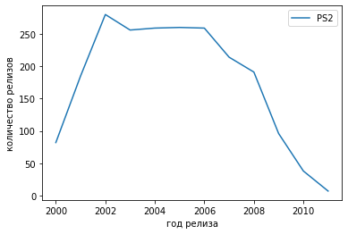
    


    
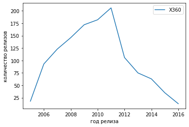
    


    
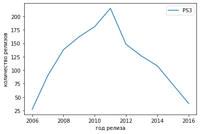
    


    
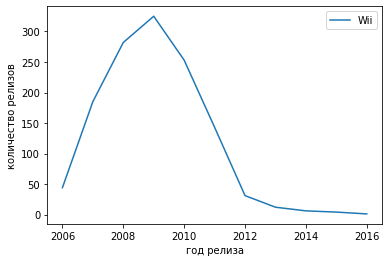
    


    
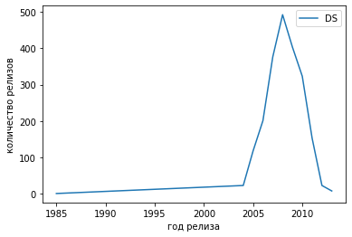
    


    
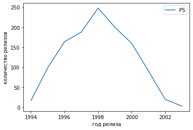
    


    
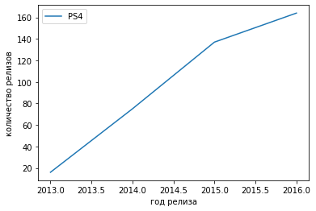
    


    
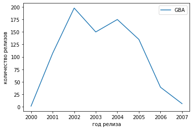
    


    
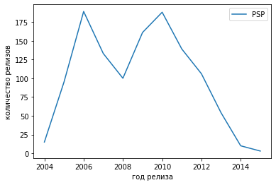
    


    
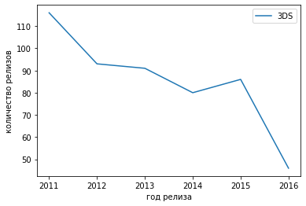
    


#### Среднее и медианное количество лет существования платформ


```python
# функция подсчета среднего и медианного значения жизненного цикла платформ
def mean_life_cycle_platform(list_top):
    life_cycle_platform = []
    for list in list_top:
        df_pl = data.query('platform == list')
        life_cycle_platform.append(df_pl['year_of_release'].max() - df_pl['year_of_release'].min())
        
    mean_life_cycle_platform = mean(life_cycle_platform)
    median_life_cycle_platform = median(life_cycle_platform)
    print('Среднее значение жизненного цикла платформы равно', mean_life_cycle_platform)
    print('Медианное значение жизненного цикла платформы равно', median_life_cycle_platform)
```


```python
mean_life_cycle_platform(list_top_10)
```

    Среднее значение жизненного цикла платформы равно 10.5
    Медианное значение жизненного цикла платформы равно 10.0
    

#### Вывод

1. В TOP-10 platform с наибольшими суммарными продажами входят:
    *   PS2
    *   X360
    *   PS3
    *   Wii
    *   DS
    *   PS
    *   PS4
    *   GBA
    *   PSP
    *   3DS
2. Среднее количество лет существования платформ - 10.5
3. Медианное количество лет существования платформ – 10.


### Прогноз на 2017 год

#### Потенциально прибыльные платформы

В предыдущем подразделе было установлено, что медианное время существования платформы составляет порядка 10 лет. Исходя из этого пик продаж приходится, примерно, на 4-6 годы. Таким образом, проанализировав количество релизов, вышедших за последние 4 года, можно обнаружить либо трен роста, который говорит о потенциальной прибыльности платформы, либо трен снижения, говорящий об обратном.


```python
# срез по годам
data_promis = data.query('year_of_release >= 2013')
data_promis.head()
```


  <div id="df-a221a109-bcb3-408a-915d-b01bee3060e9">
    <div class="colab-df-container">
      <div>
<style scoped>
    .dataframe tbody tr th:only-of-type {
        vertical-align: middle;
    }

    .dataframe tbody tr th {
        vertical-align: top;
    }

    .dataframe thead th {
        text-align: right;
    }
</style>
<table border="1" class="dataframe">
  <thead>
    <tr style="text-align: right;">
      <th></th>
      <th>name</th>
      <th>platform</th>
      <th>year_of_release</th>
      <th>genre</th>
      <th>na_sales</th>
      <th>eu_sales</th>
      <th>jp_sales</th>
      <th>other_sales</th>
      <th>critic_score</th>
      <th>user_score</th>
      <th>rating</th>
      <th>total_sales</th>
    </tr>
  </thead>
  <tbody>
    <tr>
      <th>16</th>
      <td>Grand Theft Auto V</td>
      <td>PS3</td>
      <td>2013</td>
      <td>Action</td>
      <td>7.02</td>
      <td>9.09</td>
      <td>0.98</td>
      <td>3.96</td>
      <td>97.0</td>
      <td>8.2</td>
      <td>M</td>
      <td>21.05</td>
    </tr>
    <tr>
      <th>23</th>
      <td>Grand Theft Auto V</td>
      <td>X360</td>
      <td>2013</td>
      <td>Action</td>
      <td>9.66</td>
      <td>5.14</td>
      <td>0.06</td>
      <td>1.41</td>
      <td>97.0</td>
      <td>8.1</td>
      <td>M</td>
      <td>16.27</td>
    </tr>
    <tr>
      <th>31</th>
      <td>Call of Duty: Black Ops 3</td>
      <td>PS4</td>
      <td>2015</td>
      <td>Shooter</td>
      <td>6.03</td>
      <td>5.86</td>
      <td>0.36</td>
      <td>2.38</td>
      <td>NaN</td>
      <td>NaN</td>
      <td>unknown</td>
      <td>14.63</td>
    </tr>
    <tr>
      <th>33</th>
      <td>Pokemon X/Pokemon Y</td>
      <td>3DS</td>
      <td>2013</td>
      <td>Role-Playing</td>
      <td>5.28</td>
      <td>4.19</td>
      <td>4.35</td>
      <td>0.78</td>
      <td>NaN</td>
      <td>NaN</td>
      <td>unknown</td>
      <td>14.60</td>
    </tr>
    <tr>
      <th>42</th>
      <td>Grand Theft Auto V</td>
      <td>PS4</td>
      <td>2014</td>
      <td>Action</td>
      <td>3.96</td>
      <td>6.31</td>
      <td>0.38</td>
      <td>1.97</td>
      <td>97.0</td>
      <td>8.3</td>
      <td>M</td>
      <td>12.62</td>
    </tr>
  </tbody>
</table>
</div>
      <button class="colab-df-convert" onclick="convertToInteractive('df-a221a109-bcb3-408a-915d-b01bee3060e9')"
              title="Convert this dataframe to an interactive table."
              style="display:none;">

  <svg xmlns="http://www.w3.org/2000/svg" height="24px"viewBox="0 0 24 24"
       width="24px">
    <path d="M0 0h24v24H0V0z" fill="none"/>
    <path d="M18.56 5.44l.94 2.06.94-2.06 2.06-.94-2.06-.94-.94-2.06-.94 2.06-2.06.94zm-11 1L8.5 8.5l.94-2.06 2.06-.94-2.06-.94L8.5 2.5l-.94 2.06-2.06.94zm10 10l.94 2.06.94-2.06 2.06-.94-2.06-.94-.94-2.06-.94 2.06-2.06.94z"/><path d="M17.41 7.96l-1.37-1.37c-.4-.4-.92-.59-1.43-.59-.52 0-1.04.2-1.43.59L10.3 9.45l-7.72 7.72c-.78.78-.78 2.05 0 2.83L4 21.41c.39.39.9.59 1.41.59.51 0 1.02-.2 1.41-.59l7.78-7.78 2.81-2.81c.8-.78.8-2.07 0-2.86zM5.41 20L4 18.59l7.72-7.72 1.47 1.35L5.41 20z"/>
  </svg>
      </button>

  <style>
    .colab-df-container {
      display:flex;
      flex-wrap:wrap;
      gap: 12px;
    }

    .colab-df-convert {
      background-color: #E8F0FE;
      border: none;
      border-radius: 50%;
      cursor: pointer;
      display: none;
      fill: #1967D2;
      height: 32px;
      padding: 0 0 0 0;
      width: 32px;
    }

    .colab-df-convert:hover {
      background-color: #E2EBFA;
      box-shadow: 0px 1px 2px rgba(60, 64, 67, 0.3), 0px 1px 3px 1px rgba(60, 64, 67, 0.15);
      fill: #174EA6;
    }

    [theme=dark] .colab-df-convert {
      background-color: #3B4455;
      fill: #D2E3FC;
    }

    [theme=dark] .colab-df-convert:hover {
      background-color: #434B5C;
      box-shadow: 0px 1px 3px 1px rgba(0, 0, 0, 0.15);
      filter: drop-shadow(0px 1px 2px rgba(0, 0, 0, 0.3));
      fill: #FFFFFF;
    }
  </style>

      <script>
        const buttonEl =
          document.querySelector('#df-a221a109-bcb3-408a-915d-b01bee3060e9 button.colab-df-convert');
        buttonEl.style.display =
          google.colab.kernel.accessAllowed ? 'block' : 'none';

        async function convertToInteractive(key) {
          const element = document.querySelector('#df-a221a109-bcb3-408a-915d-b01bee3060e9');
          const dataTable =
            await google.colab.kernel.invokeFunction('convertToInteractive',
                                                     [key], {});
          if (!dataTable) return;

          const docLinkHtml = 'Like what you see? Visit the ' +
            '<a target="_blank" href=https://colab.research.google.com/notebooks/data_table.ipynb>data table notebook</a>'
            + ' to learn more about interactive tables.';
          element.innerHTML = '';
          dataTable['output_type'] = 'display_data';
          await google.colab.output.renderOutput(dataTable, element);
          const docLink = document.createElement('div');
          docLink.innerHTML = docLinkHtml;
          element.appendChild(docLink);
        }
      </script>
    </div>
  </div>


```python
# формируем сводную таблицу
data_promis_pivot = data_promis.pivot_table(index = ['platform'], values = 'total_sales', aggfunc = 'sum')
```


```python
# переименование столбцов сводной таблицы
data_promis_pivot.columns = ['total_sales_platform']
```


```python
# вывод отсортированного списка
data_promis_pivot.sort_values(by='total_sales_platform', ascending=False).head(10)
```


  <div id="df-889103cc-eedb-48f8-8491-bdb5602f4242">
    <div class="colab-df-container">
      <div>
<style scoped>
    .dataframe tbody tr th:only-of-type {
        vertical-align: middle;
    }

    .dataframe tbody tr th {
        vertical-align: top;
    }

    .dataframe thead th {
        text-align: right;
    }
</style>
<table border="1" class="dataframe">
  <thead>
    <tr style="text-align: right;">
      <th></th>
      <th>total_sales_platform</th>
    </tr>
    <tr>
      <th>platform</th>
      <th></th>
    </tr>
  </thead>
  <tbody>
    <tr>
      <th>PS4</th>
      <td>314.14</td>
    </tr>
    <tr>
      <th>PS3</th>
      <td>181.43</td>
    </tr>
    <tr>
      <th>XOne</th>
      <td>159.32</td>
    </tr>
    <tr>
      <th>3DS</th>
      <td>143.25</td>
    </tr>
    <tr>
      <th>X360</th>
      <td>136.80</td>
    </tr>
    <tr>
      <th>WiiU</th>
      <td>64.63</td>
    </tr>
    <tr>
      <th>PC</th>
      <td>39.43</td>
    </tr>
    <tr>
      <th>PSV</th>
      <td>32.99</td>
    </tr>
    <tr>
      <th>Wii</th>
      <td>13.66</td>
    </tr>
    <tr>
      <th>PSP</th>
      <td>3.50</td>
    </tr>
  </tbody>
</table>
</div>
      <button class="colab-df-convert" onclick="convertToInteractive('df-889103cc-eedb-48f8-8491-bdb5602f4242')"
              title="Convert this dataframe to an interactive table."
              style="display:none;">

  <svg xmlns="http://www.w3.org/2000/svg" height="24px"viewBox="0 0 24 24"
       width="24px">
    <path d="M0 0h24v24H0V0z" fill="none"/>
    <path d="M18.56 5.44l.94 2.06.94-2.06 2.06-.94-2.06-.94-.94-2.06-.94 2.06-2.06.94zm-11 1L8.5 8.5l.94-2.06 2.06-.94-2.06-.94L8.5 2.5l-.94 2.06-2.06.94zm10 10l.94 2.06.94-2.06 2.06-.94-2.06-.94-.94-2.06-.94 2.06-2.06.94z"/><path d="M17.41 7.96l-1.37-1.37c-.4-.4-.92-.59-1.43-.59-.52 0-1.04.2-1.43.59L10.3 9.45l-7.72 7.72c-.78.78-.78 2.05 0 2.83L4 21.41c.39.39.9.59 1.41.59.51 0 1.02-.2 1.41-.59l7.78-7.78 2.81-2.81c.8-.78.8-2.07 0-2.86zM5.41 20L4 18.59l7.72-7.72 1.47 1.35L5.41 20z"/>
  </svg>
      </button>

  <style>
    .colab-df-container {
      display:flex;
      flex-wrap:wrap;
      gap: 12px;
    }

    .colab-df-convert {
      background-color: #E8F0FE;
      border: none;
      border-radius: 50%;
      cursor: pointer;
      display: none;
      fill: #1967D2;
      height: 32px;
      padding: 0 0 0 0;
      width: 32px;
    }

    .colab-df-convert:hover {
      background-color: #E2EBFA;
      box-shadow: 0px 1px 2px rgba(60, 64, 67, 0.3), 0px 1px 3px 1px rgba(60, 64, 67, 0.15);
      fill: #174EA6;
    }

    [theme=dark] .colab-df-convert {
      background-color: #3B4455;
      fill: #D2E3FC;
    }

    [theme=dark] .colab-df-convert:hover {
      background-color: #434B5C;
      box-shadow: 0px 1px 3px 1px rgba(0, 0, 0, 0.15);
      filter: drop-shadow(0px 1px 2px rgba(0, 0, 0, 0.3));
      fill: #FFFFFF;
    }
  </style>

      <script>
        const buttonEl =
          document.querySelector('#df-889103cc-eedb-48f8-8491-bdb5602f4242 button.colab-df-convert');
        buttonEl.style.display =
          google.colab.kernel.accessAllowed ? 'block' : 'none';

        async function convertToInteractive(key) {
          const element = document.querySelector('#df-889103cc-eedb-48f8-8491-bdb5602f4242');
          const dataTable =
            await google.colab.kernel.invokeFunction('convertToInteractive',
                                                     [key], {});
          if (!dataTable) return;

          const docLinkHtml = 'Like what you see? Visit the ' +
            '<a target="_blank" href=https://colab.research.google.com/notebooks/data_table.ipynb>data table notebook</a>'
            + ' to learn more about interactive tables.';
          element.innerHTML = '';
          dataTable['output_type'] = 'display_data';
          await google.colab.output.renderOutput(dataTable, element);
          const docLink = document.createElement('div');
          docLink.innerHTML = docLinkHtml;
          element.appendChild(docLink);
        }
      </script>
    </div>
  </div>


```python
# check

(
    data_promis
    .pivot_table(index = ['platform'], columns = 'year_of_release', values = 'total_sales', aggfunc = 'sum')
    .fillna(0)
    .T
)
```


  <div id="df-058f1472-37fa-44bc-b449-335d529a2787">
    <div class="colab-df-container">
      <div>
<style scoped>
    .dataframe tbody tr th:only-of-type {
        vertical-align: middle;
    }

    .dataframe tbody tr th {
        vertical-align: top;
    }

    .dataframe thead th {
        text-align: right;
    }
</style>
<table border="1" class="dataframe">
  <thead>
    <tr style="text-align: right;">
      <th>platform</th>
      <th>3DS</th>
      <th>DS</th>
      <th>PC</th>
      <th>PS3</th>
      <th>PS4</th>
      <th>PSP</th>
      <th>PSV</th>
      <th>Wii</th>
      <th>WiiU</th>
      <th>X360</th>
      <th>XOne</th>
    </tr>
    <tr>
      <th>year_of_release</th>
      <th></th>
      <th></th>
      <th></th>
      <th></th>
      <th></th>
      <th></th>
      <th></th>
      <th></th>
      <th></th>
      <th></th>
      <th></th>
    </tr>
  </thead>
  <tbody>
    <tr>
      <th>2013</th>
      <td>56.57</td>
      <td>1.54</td>
      <td>12.38</td>
      <td>113.25</td>
      <td>25.99</td>
      <td>3.14</td>
      <td>10.59</td>
      <td>8.59</td>
      <td>21.65</td>
      <td>88.58</td>
      <td>18.96</td>
    </tr>
    <tr>
      <th>2014</th>
      <td>43.76</td>
      <td>0.00</td>
      <td>13.28</td>
      <td>47.76</td>
      <td>100.00</td>
      <td>0.24</td>
      <td>11.90</td>
      <td>3.75</td>
      <td>22.03</td>
      <td>34.74</td>
      <td>54.07</td>
    </tr>
    <tr>
      <th>2015</th>
      <td>27.78</td>
      <td>0.00</td>
      <td>8.52</td>
      <td>16.82</td>
      <td>118.90</td>
      <td>0.12</td>
      <td>6.25</td>
      <td>1.14</td>
      <td>16.35</td>
      <td>11.96</td>
      <td>60.14</td>
    </tr>
    <tr>
      <th>2016</th>
      <td>15.14</td>
      <td>0.00</td>
      <td>5.25</td>
      <td>3.60</td>
      <td>69.25</td>
      <td>0.00</td>
      <td>4.25</td>
      <td>0.18</td>
      <td>4.60</td>
      <td>1.52</td>
      <td>26.15</td>
    </tr>
  </tbody>
</table>
</div>
      <button class="colab-df-convert" onclick="convertToInteractive('df-058f1472-37fa-44bc-b449-335d529a2787')"
              title="Convert this dataframe to an interactive table."
              style="display:none;">

  <svg xmlns="http://www.w3.org/2000/svg" height="24px"viewBox="0 0 24 24"
       width="24px">
    <path d="M0 0h24v24H0V0z" fill="none"/>
    <path d="M18.56 5.44l.94 2.06.94-2.06 2.06-.94-2.06-.94-.94-2.06-.94 2.06-2.06.94zm-11 1L8.5 8.5l.94-2.06 2.06-.94-2.06-.94L8.5 2.5l-.94 2.06-2.06.94zm10 10l.94 2.06.94-2.06 2.06-.94-2.06-.94-.94-2.06-.94 2.06-2.06.94z"/><path d="M17.41 7.96l-1.37-1.37c-.4-.4-.92-.59-1.43-.59-.52 0-1.04.2-1.43.59L10.3 9.45l-7.72 7.72c-.78.78-.78 2.05 0 2.83L4 21.41c.39.39.9.59 1.41.59.51 0 1.02-.2 1.41-.59l7.78-7.78 2.81-2.81c.8-.78.8-2.07 0-2.86zM5.41 20L4 18.59l7.72-7.72 1.47 1.35L5.41 20z"/>
  </svg>
      </button>

  <style>
    .colab-df-container {
      display:flex;
      flex-wrap:wrap;
      gap: 12px;
    }

    .colab-df-convert {
      background-color: #E8F0FE;
      border: none;
      border-radius: 50%;
      cursor: pointer;
      display: none;
      fill: #1967D2;
      height: 32px;
      padding: 0 0 0 0;
      width: 32px;
    }

    .colab-df-convert:hover {
      background-color: #E2EBFA;
      box-shadow: 0px 1px 2px rgba(60, 64, 67, 0.3), 0px 1px 3px 1px rgba(60, 64, 67, 0.15);
      fill: #174EA6;
    }

    [theme=dark] .colab-df-convert {
      background-color: #3B4455;
      fill: #D2E3FC;
    }

    [theme=dark] .colab-df-convert:hover {
      background-color: #434B5C;
      box-shadow: 0px 1px 3px 1px rgba(0, 0, 0, 0.15);
      filter: drop-shadow(0px 1px 2px rgba(0, 0, 0, 0.3));
      fill: #FFFFFF;
    }
  </style>

      <script>
        const buttonEl =
          document.querySelector('#df-058f1472-37fa-44bc-b449-335d529a2787 button.colab-df-convert');
        buttonEl.style.display =
          google.colab.kernel.accessAllowed ? 'block' : 'none';

        async function convertToInteractive(key) {
          const element = document.querySelector('#df-058f1472-37fa-44bc-b449-335d529a2787');
          const dataTable =
            await google.colab.kernel.invokeFunction('convertToInteractive',
                                                     [key], {});
          if (!dataTable) return;

          const docLinkHtml = 'Like what you see? Visit the ' +
            '<a target="_blank" href=https://colab.research.google.com/notebooks/data_table.ipynb>data table notebook</a>'
            + ' to learn more about interactive tables.';
          element.innerHTML = '';
          dataTable['output_type'] = 'display_data';
          await google.colab.output.renderOutput(dataTable, element);
          const docLink = document.createElement('div');
          docLink.innerHTML = docLinkHtml;
          element.appendChild(docLink);
        }
      </script>
    </div>
  </div>


```python
# check

(
    data_promis
    .pivot_table(index = ['platform'], columns = 'year_of_release', values = 'total_sales', aggfunc = 'count')
    .fillna(0)
    .T
)
```


  <div id="df-78e028eb-34c4-4e2e-a72a-7d6a67e4bc1c">
    <div class="colab-df-container">
      <div>
<style scoped>
    .dataframe tbody tr th:only-of-type {
        vertical-align: middle;
    }

    .dataframe tbody tr th {
        vertical-align: top;
    }

    .dataframe thead th {
        text-align: right;
    }
</style>
<table border="1" class="dataframe">
  <thead>
    <tr style="text-align: right;">
      <th>platform</th>
      <th>3DS</th>
      <th>DS</th>
      <th>PC</th>
      <th>PS3</th>
      <th>PS4</th>
      <th>PSP</th>
      <th>PSV</th>
      <th>Wii</th>
      <th>WiiU</th>
      <th>X360</th>
      <th>XOne</th>
    </tr>
    <tr>
      <th>year_of_release</th>
      <th></th>
      <th></th>
      <th></th>
      <th></th>
      <th></th>
      <th></th>
      <th></th>
      <th></th>
      <th></th>
      <th></th>
      <th></th>
    </tr>
  </thead>
  <tbody>
    <tr>
      <th>2013</th>
      <td>91.0</td>
      <td>8.0</td>
      <td>38.0</td>
      <td>126.0</td>
      <td>16.0</td>
      <td>54.0</td>
      <td>63.0</td>
      <td>12.0</td>
      <td>42.0</td>
      <td>75.0</td>
      <td>19.0</td>
    </tr>
    <tr>
      <th>2014</th>
      <td>80.0</td>
      <td>0.0</td>
      <td>47.0</td>
      <td>108.0</td>
      <td>75.0</td>
      <td>10.0</td>
      <td>100.0</td>
      <td>6.0</td>
      <td>31.0</td>
      <td>63.0</td>
      <td>61.0</td>
    </tr>
    <tr>
      <th>2015</th>
      <td>86.0</td>
      <td>0.0</td>
      <td>50.0</td>
      <td>73.0</td>
      <td>137.0</td>
      <td>3.0</td>
      <td>110.0</td>
      <td>4.0</td>
      <td>28.0</td>
      <td>35.0</td>
      <td>80.0</td>
    </tr>
    <tr>
      <th>2016</th>
      <td>46.0</td>
      <td>0.0</td>
      <td>54.0</td>
      <td>38.0</td>
      <td>164.0</td>
      <td>0.0</td>
      <td>85.0</td>
      <td>1.0</td>
      <td>14.0</td>
      <td>13.0</td>
      <td>87.0</td>
    </tr>
  </tbody>
</table>
</div>
      <button class="colab-df-convert" onclick="convertToInteractive('df-78e028eb-34c4-4e2e-a72a-7d6a67e4bc1c')"
              title="Convert this dataframe to an interactive table."
              style="display:none;">

  <svg xmlns="http://www.w3.org/2000/svg" height="24px"viewBox="0 0 24 24"
       width="24px">
    <path d="M0 0h24v24H0V0z" fill="none"/>
    <path d="M18.56 5.44l.94 2.06.94-2.06 2.06-.94-2.06-.94-.94-2.06-.94 2.06-2.06.94zm-11 1L8.5 8.5l.94-2.06 2.06-.94-2.06-.94L8.5 2.5l-.94 2.06-2.06.94zm10 10l.94 2.06.94-2.06 2.06-.94-2.06-.94-.94-2.06-.94 2.06-2.06.94z"/><path d="M17.41 7.96l-1.37-1.37c-.4-.4-.92-.59-1.43-.59-.52 0-1.04.2-1.43.59L10.3 9.45l-7.72 7.72c-.78.78-.78 2.05 0 2.83L4 21.41c.39.39.9.59 1.41.59.51 0 1.02-.2 1.41-.59l7.78-7.78 2.81-2.81c.8-.78.8-2.07 0-2.86zM5.41 20L4 18.59l7.72-7.72 1.47 1.35L5.41 20z"/>
  </svg>
      </button>

  <style>
    .colab-df-container {
      display:flex;
      flex-wrap:wrap;
      gap: 12px;
    }

    .colab-df-convert {
      background-color: #E8F0FE;
      border: none;
      border-radius: 50%;
      cursor: pointer;
      display: none;
      fill: #1967D2;
      height: 32px;
      padding: 0 0 0 0;
      width: 32px;
    }

    .colab-df-convert:hover {
      background-color: #E2EBFA;
      box-shadow: 0px 1px 2px rgba(60, 64, 67, 0.3), 0px 1px 3px 1px rgba(60, 64, 67, 0.15);
      fill: #174EA6;
    }

    [theme=dark] .colab-df-convert {
      background-color: #3B4455;
      fill: #D2E3FC;
    }

    [theme=dark] .colab-df-convert:hover {
      background-color: #434B5C;
      box-shadow: 0px 1px 3px 1px rgba(0, 0, 0, 0.15);
      filter: drop-shadow(0px 1px 2px rgba(0, 0, 0, 0.3));
      fill: #FFFFFF;
    }
  </style>

      <script>
        const buttonEl =
          document.querySelector('#df-78e028eb-34c4-4e2e-a72a-7d6a67e4bc1c button.colab-df-convert');
        buttonEl.style.display =
          google.colab.kernel.accessAllowed ? 'block' : 'none';

        async function convertToInteractive(key) {
          const element = document.querySelector('#df-78e028eb-34c4-4e2e-a72a-7d6a67e4bc1c');
          const dataTable =
            await google.colab.kernel.invokeFunction('convertToInteractive',
                                                     [key], {});
          if (!dataTable) return;

          const docLinkHtml = 'Like what you see? Visit the ' +
            '<a target="_blank" href=https://colab.research.google.com/notebooks/data_table.ipynb>data table notebook</a>'
            + ' to learn more about interactive tables.';
          element.innerHTML = '';
          dataTable['output_type'] = 'display_data';
          await google.colab.output.renderOutput(dataTable, element);
          const docLink = document.createElement('div');
          docLink.innerHTML = docLinkHtml;
          element.appendChild(docLink);
        }
      </script>
    </div>
  </div>


```python
# формируем список потенциально прибыльных платформ
list_promis = data_promis_pivot.sort_values(by='total_sales_platform', ascending=False).head(10).reset_index()
list_promis = list_promis['platform'].unique()
list_promis
```


    array(['PS4', 'PS3', 'XOne', '3DS', 'X360', 'WiiU', 'PC', 'PSV', 'Wii',
           'PSP'], dtype=object)


```python
# функция вывода графиков потенциально прибыльных платформ
def print_promis_platform(list_top):
    for list in list_top:
        df_pl = data_promis.query('platform == list')
        df_pl_pivot = df_pl.pivot_table(index = ['year_of_release'], values = 'total_sales', aggfunc = 'count')
        df_pl_pivot.columns = [list]
        df_pl_pivot.plot(figsize=(9, 4))
        plt.xlabel("год релиза")
        plt.ylabel("количество релизов")
```


```python
print_promis_platform(list_promis)
```


    
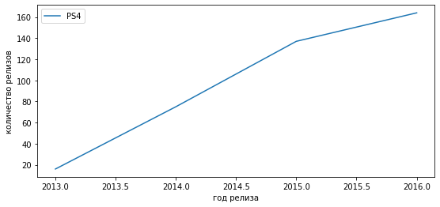
    


    
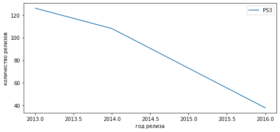
    


    
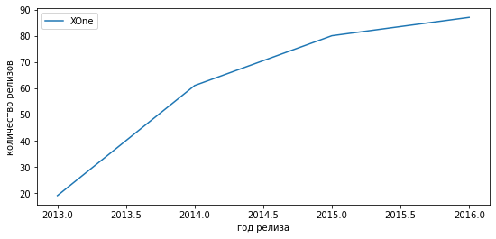
    


    
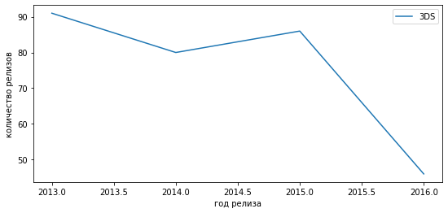
    


    
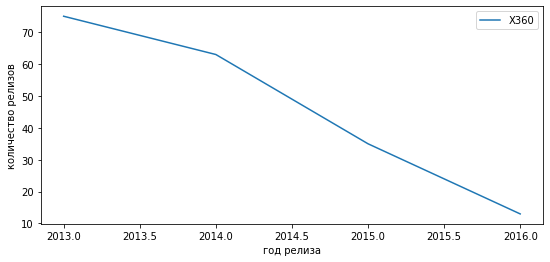
    


    
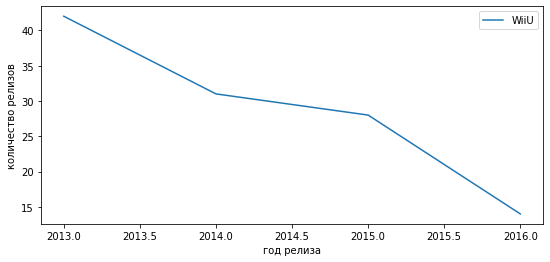
    


    
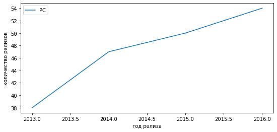
    


    
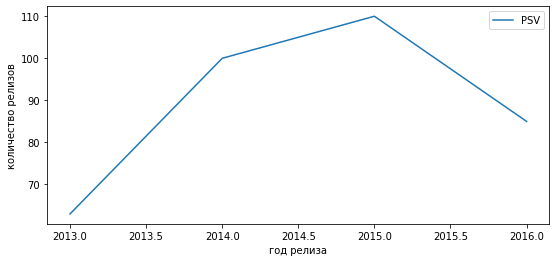
    


    
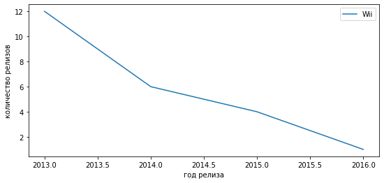
    


    
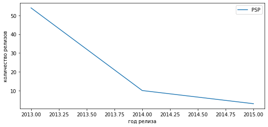
    


#### Вывод

1. К платформам, "растущим" по продажам можно отнести:
    *   PS4
    *   XOne
    *   PC
    *   PSV (с 2015 наметилась тенденция к снижению, возможен второй "гребень" роста, однако и возможно, что тенденция "падения" продолжится)
2. К платформам, "падающим" по продажам можно отнести:
    *   PS3
    *   3DS
    *   X360
    *   WiiU
    *   Wii
    *   PSP
3. К потенциально прибыльным платформам можно отнести:
    *   PS4
    *   XOne
    *   PC

### «Ящик с усами» 


```python
# формируем сабсет из 6 платформам списка "TOP-10" и 4 платформ списка потенциально прибыльных "promis"
data_TOP_6_promis_4 = data.query('platform == ["PS2", "X360", "PS3", "Wii", "DS", "PS", "PS4", "XOne", "PC", "PSV"]')
```


```python
# диаграмма размаха
plt.figure(figsize=(15,10))
sns.boxplot(data=data_TOP_6_promis_4, x='total_sales', y='platform')
plt.title(label='Диаграмма размаха по глобальным продажам игр', fontsize=14, fontweight="bold")
plt.xlim(0, 2.5)
plt.xlabel("глобальные продажи", fontsize=14, fontweight="bold")
plt.ylabel("платформы", fontsize=14, fontweight="bold");
```


    
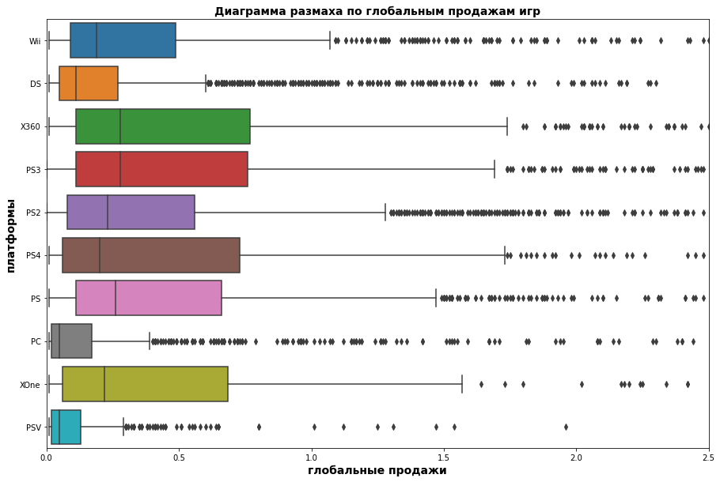
    


#### Вывод

1. Диаграмма размаха наглядно отображает самые популярные и прибыльные платформы.
2. Также, на основе диаграммы размаха можно предположить до какого уровня возможен потенциальный рост медианных значений прибыли у развивающихся платформ, находящихся в стадии роста (например PS4, XOne, PC).

### Как влияют на продажи внутри одной популярной платформы отзывы пользователей и критиков. Постройте диаграмму рассеяния и посчитайте корреляцию между отзывами и продажами


```python
# расчет коэффициента корреляции между продажами и оценкой критиков
cor_sales_critic = data.query('platform == "PS2"')[['total_sales', 'critic_score']]
cor_sales_critic.corr()
```


  <div id="df-c95e12f1-bd74-4739-81b8-a21b6be7e948">
    <div class="colab-df-container">
      <div>
<style scoped>
    .dataframe tbody tr th:only-of-type {
        vertical-align: middle;
    }

    .dataframe tbody tr th {
        vertical-align: top;
    }

    .dataframe thead th {
        text-align: right;
    }
</style>
<table border="1" class="dataframe">
  <thead>
    <tr style="text-align: right;">
      <th></th>
      <th>total_sales</th>
      <th>critic_score</th>
    </tr>
  </thead>
  <tbody>
    <tr>
      <th>total_sales</th>
      <td>1.000000</td>
      <td>0.392536</td>
    </tr>
    <tr>
      <th>critic_score</th>
      <td>0.392536</td>
      <td>1.000000</td>
    </tr>
  </tbody>
</table>
</div>
      <button class="colab-df-convert" onclick="convertToInteractive('df-c95e12f1-bd74-4739-81b8-a21b6be7e948')"
              title="Convert this dataframe to an interactive table."
              style="display:none;">

  <svg xmlns="http://www.w3.org/2000/svg" height="24px"viewBox="0 0 24 24"
       width="24px">
    <path d="M0 0h24v24H0V0z" fill="none"/>
    <path d="M18.56 5.44l.94 2.06.94-2.06 2.06-.94-2.06-.94-.94-2.06-.94 2.06-2.06.94zm-11 1L8.5 8.5l.94-2.06 2.06-.94-2.06-.94L8.5 2.5l-.94 2.06-2.06.94zm10 10l.94 2.06.94-2.06 2.06-.94-2.06-.94-.94-2.06-.94 2.06-2.06.94z"/><path d="M17.41 7.96l-1.37-1.37c-.4-.4-.92-.59-1.43-.59-.52 0-1.04.2-1.43.59L10.3 9.45l-7.72 7.72c-.78.78-.78 2.05 0 2.83L4 21.41c.39.39.9.59 1.41.59.51 0 1.02-.2 1.41-.59l7.78-7.78 2.81-2.81c.8-.78.8-2.07 0-2.86zM5.41 20L4 18.59l7.72-7.72 1.47 1.35L5.41 20z"/>
  </svg>
      </button>

  <style>
    .colab-df-container {
      display:flex;
      flex-wrap:wrap;
      gap: 12px;
    }

    .colab-df-convert {
      background-color: #E8F0FE;
      border: none;
      border-radius: 50%;
      cursor: pointer;
      display: none;
      fill: #1967D2;
      height: 32px;
      padding: 0 0 0 0;
      width: 32px;
    }

    .colab-df-convert:hover {
      background-color: #E2EBFA;
      box-shadow: 0px 1px 2px rgba(60, 64, 67, 0.3), 0px 1px 3px 1px rgba(60, 64, 67, 0.15);
      fill: #174EA6;
    }

    [theme=dark] .colab-df-convert {
      background-color: #3B4455;
      fill: #D2E3FC;
    }

    [theme=dark] .colab-df-convert:hover {
      background-color: #434B5C;
      box-shadow: 0px 1px 3px 1px rgba(0, 0, 0, 0.15);
      filter: drop-shadow(0px 1px 2px rgba(0, 0, 0, 0.3));
      fill: #FFFFFF;
    }
  </style>

      <script>
        const buttonEl =
          document.querySelector('#df-c95e12f1-bd74-4739-81b8-a21b6be7e948 button.colab-df-convert');
        buttonEl.style.display =
          google.colab.kernel.accessAllowed ? 'block' : 'none';

        async function convertToInteractive(key) {
          const element = document.querySelector('#df-c95e12f1-bd74-4739-81b8-a21b6be7e948');
          const dataTable =
            await google.colab.kernel.invokeFunction('convertToInteractive',
                                                     [key], {});
          if (!dataTable) return;

          const docLinkHtml = 'Like what you see? Visit the ' +
            '<a target="_blank" href=https://colab.research.google.com/notebooks/data_table.ipynb>data table notebook</a>'
            + ' to learn more about interactive tables.';
          element.innerHTML = '';
          dataTable['output_type'] = 'display_data';
          await google.colab.output.renderOutput(dataTable, element);
          const docLink = document.createElement('div');
          docLink.innerHTML = docLinkHtml;
          element.appendChild(docLink);
        }
      </script>
    </div>
  </div>


```python
# диаграмма рассеяния
cor_sales_critic.plot.scatter(y='total_sales', x='critic_score')
plt.xlabel("оценки критиков")
plt.ylabel("продажи");
```


    
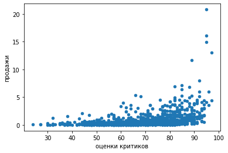
    


```python
# расчет коэффициента корреляции между продажами и оценкой пользователей
cor_sales_user = data.query('platform == "PS2"')[['total_sales', 'user_score']]
cor_sales_user.corr()
```


  <div id="df-68c55b47-d528-4e45-8ace-65eff5fd4d87">
    <div class="colab-df-container">
      <div>
<style scoped>
    .dataframe tbody tr th:only-of-type {
        vertical-align: middle;
    }

    .dataframe tbody tr th {
        vertical-align: top;
    }

    .dataframe thead th {
        text-align: right;
    }
</style>
<table border="1" class="dataframe">
  <thead>
    <tr style="text-align: right;">
      <th></th>
      <th>total_sales</th>
      <th>user_score</th>
    </tr>
  </thead>
  <tbody>
    <tr>
      <th>total_sales</th>
      <td>1.000000</td>
      <td>0.175055</td>
    </tr>
    <tr>
      <th>user_score</th>
      <td>0.175055</td>
      <td>1.000000</td>
    </tr>
  </tbody>
</table>
</div>
      <button class="colab-df-convert" onclick="convertToInteractive('df-68c55b47-d528-4e45-8ace-65eff5fd4d87')"
              title="Convert this dataframe to an interactive table."
              style="display:none;">

  <svg xmlns="http://www.w3.org/2000/svg" height="24px"viewBox="0 0 24 24"
       width="24px">
    <path d="M0 0h24v24H0V0z" fill="none"/>
    <path d="M18.56 5.44l.94 2.06.94-2.06 2.06-.94-2.06-.94-.94-2.06-.94 2.06-2.06.94zm-11 1L8.5 8.5l.94-2.06 2.06-.94-2.06-.94L8.5 2.5l-.94 2.06-2.06.94zm10 10l.94 2.06.94-2.06 2.06-.94-2.06-.94-.94-2.06-.94 2.06-2.06.94z"/><path d="M17.41 7.96l-1.37-1.37c-.4-.4-.92-.59-1.43-.59-.52 0-1.04.2-1.43.59L10.3 9.45l-7.72 7.72c-.78.78-.78 2.05 0 2.83L4 21.41c.39.39.9.59 1.41.59.51 0 1.02-.2 1.41-.59l7.78-7.78 2.81-2.81c.8-.78.8-2.07 0-2.86zM5.41 20L4 18.59l7.72-7.72 1.47 1.35L5.41 20z"/>
  </svg>
      </button>

  <style>
    .colab-df-container {
      display:flex;
      flex-wrap:wrap;
      gap: 12px;
    }

    .colab-df-convert {
      background-color: #E8F0FE;
      border: none;
      border-radius: 50%;
      cursor: pointer;
      display: none;
      fill: #1967D2;
      height: 32px;
      padding: 0 0 0 0;
      width: 32px;
    }

    .colab-df-convert:hover {
      background-color: #E2EBFA;
      box-shadow: 0px 1px 2px rgba(60, 64, 67, 0.3), 0px 1px 3px 1px rgba(60, 64, 67, 0.15);
      fill: #174EA6;
    }

    [theme=dark] .colab-df-convert {
      background-color: #3B4455;
      fill: #D2E3FC;
    }

    [theme=dark] .colab-df-convert:hover {
      background-color: #434B5C;
      box-shadow: 0px 1px 3px 1px rgba(0, 0, 0, 0.15);
      filter: drop-shadow(0px 1px 2px rgba(0, 0, 0, 0.3));
      fill: #FFFFFF;
    }
  </style>

      <script>
        const buttonEl =
          document.querySelector('#df-68c55b47-d528-4e45-8ace-65eff5fd4d87 button.colab-df-convert');
        buttonEl.style.display =
          google.colab.kernel.accessAllowed ? 'block' : 'none';

        async function convertToInteractive(key) {
          const element = document.querySelector('#df-68c55b47-d528-4e45-8ace-65eff5fd4d87');
          const dataTable =
            await google.colab.kernel.invokeFunction('convertToInteractive',
                                                     [key], {});
          if (!dataTable) return;

          const docLinkHtml = 'Like what you see? Visit the ' +
            '<a target="_blank" href=https://colab.research.google.com/notebooks/data_table.ipynb>data table notebook</a>'
            + ' to learn more about interactive tables.';
          element.innerHTML = '';
          dataTable['output_type'] = 'display_data';
          await google.colab.output.renderOutput(dataTable, element);
          const docLink = document.createElement('div');
          docLink.innerHTML = docLinkHtml;
          element.appendChild(docLink);
        }
      </script>
    </div>
  </div>


```python
# диаграмма рассеяния
cor_sales_user.plot.scatter(y='total_sales', x='user_score')
plt.xlabel("оценки пользователей")
plt.ylabel("продажи");
```


    
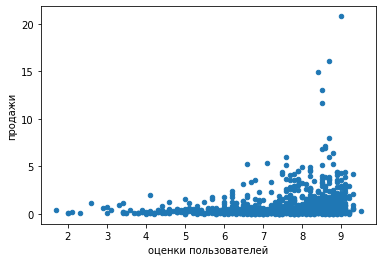
    


#### Вывод

1. Между продажами и оценкой критиков существует несильная положительная корреляция порядка 0.39, которую мы не принимаем во внимание, так как она попадает в диапазон от -0,5 до +0,5.
2. Между продажами и оценкой пользователей не существует значимой взаимосвязи.


```python
# вывод листа TOP-10
list_top_10
```


    array(['PS2', 'X360', 'PS3', 'Wii', 'DS', 'PS', 'PS4', 'GBA', 'PSP',
           '3DS'], dtype=object)


```python
# функция подсчета корреляции между продажами и отзывами (критиков и пользователей) по платформам
def cor_sales_score(list_top):
    for list in list_top:
        print(list)
        df = data.query('platform == list')
        print(df[['total_sales', 'critic_score']].corr())
        print(df[['total_sales', 'user_score']].corr())
        print('_______________________________________')
```


```python
cor_sales_score(list_top_10)
```

    PS2
                  total_sales  critic_score
    total_sales      1.000000      0.392536
    critic_score     0.392536      1.000000
                 total_sales  user_score
    total_sales     1.000000    0.175055
    user_score      0.175055    1.000000
    _______________________________________
    X360
                  total_sales  critic_score
    total_sales      1.000000      0.392866
    critic_score     0.392866      1.000000
                 total_sales  user_score
    total_sales     1.000000    0.114187
    user_score      0.114187    1.000000
    _______________________________________
    PS3
                  total_sales  critic_score
    total_sales      1.000000      0.432759
    critic_score     0.432759      1.000000
                 total_sales  user_score
    total_sales     1.000000    0.128416
    user_score      0.128416    1.000000
    _______________________________________
    Wii
                  total_sales  critic_score
    total_sales      1.000000      0.177907
    critic_score     0.177907      1.000000
                 total_sales  user_score
    total_sales     1.000000    0.112831
    user_score      0.112831    1.000000
    _______________________________________
    DS
                  total_sales  critic_score
    total_sales      1.000000      0.237546
    critic_score     0.237546      1.000000
                 total_sales  user_score
    total_sales     1.000000    0.130876
    user_score      0.130876    1.000000
    _______________________________________
    PS
                  total_sales  critic_score
    total_sales       1.00000       0.44669
    critic_score      0.44669       1.00000
                 total_sales  user_score
    total_sales     1.000000    0.300078
    user_score      0.300078    1.000000
    _______________________________________
    PS4
                  total_sales  critic_score
    total_sales      1.000000      0.406568
    critic_score     0.406568      1.000000
                 total_sales  user_score
    total_sales     1.000000   -0.031957
    user_score     -0.031957    1.000000
    _______________________________________
    GBA
                  total_sales  critic_score
    total_sales      1.000000      0.242107
    critic_score     0.242107      1.000000
                 total_sales  user_score
    total_sales     1.000000    0.106149
    user_score      0.106149    1.000000
    _______________________________________
    PSP
                  total_sales  critic_score
    total_sales      1.000000      0.317525
    critic_score     0.317525      1.000000
                 total_sales  user_score
    total_sales      1.00000     0.22089
    user_score       0.22089     1.00000
    _______________________________________
    3DS
                  total_sales  critic_score
    total_sales       1.00000       0.34874
    critic_score      0.34874       1.00000
                 total_sales  user_score
    total_sales     1.000000    0.222078
    user_score      0.222078    1.000000
    _______________________________________
    

#### Вывод

1. В целом, наличие взаимосвязи между продажами и оценкой критиков на других платформах также не подтвердилось, как и на самой прибыльной платформе - "PS2" (за указанный период времени).
2. Отсутствие наличия значимой взаимосвязи между продажами и оценкой пользователей, на других платформах также подтвердилось.

### Общее распределение игр по жанрам. Что можно сказать о самых прибыльных жанрах. Выделяются ли жанры с высокими и низкими продажами

#### Период с 2013 по 2016


```python
data_promis
```


  <div id="df-4566dc04-d980-4461-ac8a-807690a8b6b1">
    <div class="colab-df-container">
      <div>
<style scoped>
    .dataframe tbody tr th:only-of-type {
        vertical-align: middle;
    }

    .dataframe tbody tr th {
        vertical-align: top;
    }

    .dataframe thead th {
        text-align: right;
    }
</style>
<table border="1" class="dataframe">
  <thead>
    <tr style="text-align: right;">
      <th></th>
      <th>name</th>
      <th>platform</th>
      <th>year_of_release</th>
      <th>genre</th>
      <th>na_sales</th>
      <th>eu_sales</th>
      <th>jp_sales</th>
      <th>other_sales</th>
      <th>critic_score</th>
      <th>user_score</th>
      <th>rating</th>
      <th>total_sales</th>
    </tr>
  </thead>
  <tbody>
    <tr>
      <th>16</th>
      <td>Grand Theft Auto V</td>
      <td>PS3</td>
      <td>2013</td>
      <td>Action</td>
      <td>7.02</td>
      <td>9.09</td>
      <td>0.98</td>
      <td>3.96</td>
      <td>97.0</td>
      <td>8.2</td>
      <td>M</td>
      <td>21.05</td>
    </tr>
    <tr>
      <th>23</th>
      <td>Grand Theft Auto V</td>
      <td>X360</td>
      <td>2013</td>
      <td>Action</td>
      <td>9.66</td>
      <td>5.14</td>
      <td>0.06</td>
      <td>1.41</td>
      <td>97.0</td>
      <td>8.1</td>
      <td>M</td>
      <td>16.27</td>
    </tr>
    <tr>
      <th>31</th>
      <td>Call of Duty: Black Ops 3</td>
      <td>PS4</td>
      <td>2015</td>
      <td>Shooter</td>
      <td>6.03</td>
      <td>5.86</td>
      <td>0.36</td>
      <td>2.38</td>
      <td>NaN</td>
      <td>NaN</td>
      <td>unknown</td>
      <td>14.63</td>
    </tr>
    <tr>
      <th>33</th>
      <td>Pokemon X/Pokemon Y</td>
      <td>3DS</td>
      <td>2013</td>
      <td>Role-Playing</td>
      <td>5.28</td>
      <td>4.19</td>
      <td>4.35</td>
      <td>0.78</td>
      <td>NaN</td>
      <td>NaN</td>
      <td>unknown</td>
      <td>14.60</td>
    </tr>
    <tr>
      <th>42</th>
      <td>Grand Theft Auto V</td>
      <td>PS4</td>
      <td>2014</td>
      <td>Action</td>
      <td>3.96</td>
      <td>6.31</td>
      <td>0.38</td>
      <td>1.97</td>
      <td>97.0</td>
      <td>8.3</td>
      <td>M</td>
      <td>12.62</td>
    </tr>
    <tr>
      <th>...</th>
      <td>...</td>
      <td>...</td>
      <td>...</td>
      <td>...</td>
      <td>...</td>
      <td>...</td>
      <td>...</td>
      <td>...</td>
      <td>...</td>
      <td>...</td>
      <td>...</td>
      <td>...</td>
    </tr>
    <tr>
      <th>16432</th>
      <td>Strawberry Nauts</td>
      <td>PSV</td>
      <td>2016</td>
      <td>Adventure</td>
      <td>0.00</td>
      <td>0.00</td>
      <td>0.01</td>
      <td>0.00</td>
      <td>NaN</td>
      <td>NaN</td>
      <td>unknown</td>
      <td>0.01</td>
    </tr>
    <tr>
      <th>16436</th>
      <td>Aiyoku no Eustia</td>
      <td>PSV</td>
      <td>2014</td>
      <td>Misc</td>
      <td>0.00</td>
      <td>0.00</td>
      <td>0.01</td>
      <td>0.00</td>
      <td>NaN</td>
      <td>NaN</td>
      <td>unknown</td>
      <td>0.01</td>
    </tr>
    <tr>
      <th>16439</th>
      <td>Samurai Warriors: Sanada Maru</td>
      <td>PS3</td>
      <td>2016</td>
      <td>Action</td>
      <td>0.00</td>
      <td>0.00</td>
      <td>0.01</td>
      <td>0.00</td>
      <td>NaN</td>
      <td>NaN</td>
      <td>unknown</td>
      <td>0.01</td>
    </tr>
    <tr>
      <th>16441</th>
      <td>Haitaka no Psychedelica</td>
      <td>PSV</td>
      <td>2016</td>
      <td>Adventure</td>
      <td>0.00</td>
      <td>0.00</td>
      <td>0.01</td>
      <td>0.00</td>
      <td>NaN</td>
      <td>NaN</td>
      <td>unknown</td>
      <td>0.01</td>
    </tr>
    <tr>
      <th>16443</th>
      <td>Winning Post 8 2016</td>
      <td>PSV</td>
      <td>2016</td>
      <td>Simulation</td>
      <td>0.00</td>
      <td>0.00</td>
      <td>0.01</td>
      <td>0.00</td>
      <td>NaN</td>
      <td>NaN</td>
      <td>unknown</td>
      <td>0.01</td>
    </tr>
  </tbody>
</table>
<p>2233 rows × 12 columns</p>
</div>
      <button class="colab-df-convert" onclick="convertToInteractive('df-4566dc04-d980-4461-ac8a-807690a8b6b1')"
              title="Convert this dataframe to an interactive table."
              style="display:none;">

  <svg xmlns="http://www.w3.org/2000/svg" height="24px"viewBox="0 0 24 24"
       width="24px">
    <path d="M0 0h24v24H0V0z" fill="none"/>
    <path d="M18.56 5.44l.94 2.06.94-2.06 2.06-.94-2.06-.94-.94-2.06-.94 2.06-2.06.94zm-11 1L8.5 8.5l.94-2.06 2.06-.94-2.06-.94L8.5 2.5l-.94 2.06-2.06.94zm10 10l.94 2.06.94-2.06 2.06-.94-2.06-.94-.94-2.06-.94 2.06-2.06.94z"/><path d="M17.41 7.96l-1.37-1.37c-.4-.4-.92-.59-1.43-.59-.52 0-1.04.2-1.43.59L10.3 9.45l-7.72 7.72c-.78.78-.78 2.05 0 2.83L4 21.41c.39.39.9.59 1.41.59.51 0 1.02-.2 1.41-.59l7.78-7.78 2.81-2.81c.8-.78.8-2.07 0-2.86zM5.41 20L4 18.59l7.72-7.72 1.47 1.35L5.41 20z"/>
  </svg>
      </button>

  <style>
    .colab-df-container {
      display:flex;
      flex-wrap:wrap;
      gap: 12px;
    }

    .colab-df-convert {
      background-color: #E8F0FE;
      border: none;
      border-radius: 50%;
      cursor: pointer;
      display: none;
      fill: #1967D2;
      height: 32px;
      padding: 0 0 0 0;
      width: 32px;
    }

    .colab-df-convert:hover {
      background-color: #E2EBFA;
      box-shadow: 0px 1px 2px rgba(60, 64, 67, 0.3), 0px 1px 3px 1px rgba(60, 64, 67, 0.15);
      fill: #174EA6;
    }

    [theme=dark] .colab-df-convert {
      background-color: #3B4455;
      fill: #D2E3FC;
    }

    [theme=dark] .colab-df-convert:hover {
      background-color: #434B5C;
      box-shadow: 0px 1px 3px 1px rgba(0, 0, 0, 0.15);
      filter: drop-shadow(0px 1px 2px rgba(0, 0, 0, 0.3));
      fill: #FFFFFF;
    }
  </style>

      <script>
        const buttonEl =
          document.querySelector('#df-4566dc04-d980-4461-ac8a-807690a8b6b1 button.colab-df-convert');
        buttonEl.style.display =
          google.colab.kernel.accessAllowed ? 'block' : 'none';

        async function convertToInteractive(key) {
          const element = document.querySelector('#df-4566dc04-d980-4461-ac8a-807690a8b6b1');
          const dataTable =
            await google.colab.kernel.invokeFunction('convertToInteractive',
                                                     [key], {});
          if (!dataTable) return;

          const docLinkHtml = 'Like what you see? Visit the ' +
            '<a target="_blank" href=https://colab.research.google.com/notebooks/data_table.ipynb>data table notebook</a>'
            + ' to learn more about interactive tables.';
          element.innerHTML = '';
          dataTable['output_type'] = 'display_data';
          await google.colab.output.renderOutput(dataTable, element);
          const docLink = document.createElement('div');
          docLink.innerHTML = docLinkHtml;
          element.appendChild(docLink);
        }
      </script>
    </div>
  </div>


```python
# диаграмма размаха
plt.figure(figsize=(15,10))
sns.boxplot(data=data_promis, x='total_sales', y='genre')
plt.title(label='Диаграмма размаха по глобальным продажам игр, различных жанров', fontsize=14, fontweight="bold")
plt.xlim(0, 1.5)
plt.xlabel("глобальные продажи", fontsize=14, fontweight="bold")
plt.ylabel("жанры", fontsize=14, fontweight="bold");
```


    
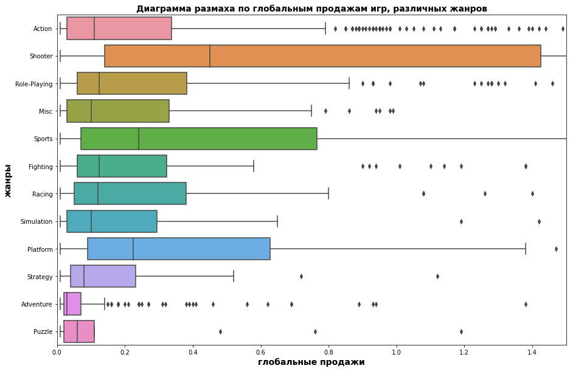
    


```python
# формируем сводную таблицу
data_pivot_genre = data_promis.pivot_table(index = ['genre'], values = 'total_sales', aggfunc = 'sum')
```


```python
# переименование столбцов сводной таблицы
data_pivot_genre.columns = ['']
```


```python
# вывод отсортированного списка
data_pivot_genre = data_pivot_genre.sort_values(by='', ascending=False)
data_pivot_genre
```


  <div id="df-61611b54-2cc7-43df-b63d-984d971ab925">
    <div class="colab-df-container">
      <div>
<style scoped>
    .dataframe tbody tr th:only-of-type {
        vertical-align: middle;
    }

    .dataframe tbody tr th {
        vertical-align: top;
    }

    .dataframe thead th {
        text-align: right;
    }
</style>
<table border="1" class="dataframe">
  <thead>
    <tr style="text-align: right;">
      <th></th>
      <th></th>
    </tr>
    <tr>
      <th>genre</th>
      <th></th>
    </tr>
  </thead>
  <tbody>
    <tr>
      <th>Action</th>
      <td>321.87</td>
    </tr>
    <tr>
      <th>Shooter</th>
      <td>232.98</td>
    </tr>
    <tr>
      <th>Sports</th>
      <td>150.65</td>
    </tr>
    <tr>
      <th>Role-Playing</th>
      <td>145.89</td>
    </tr>
    <tr>
      <th>Misc</th>
      <td>62.82</td>
    </tr>
    <tr>
      <th>Platform</th>
      <td>42.63</td>
    </tr>
    <tr>
      <th>Racing</th>
      <td>39.89</td>
    </tr>
    <tr>
      <th>Fighting</th>
      <td>35.31</td>
    </tr>
    <tr>
      <th>Adventure</th>
      <td>23.64</td>
    </tr>
    <tr>
      <th>Simulation</th>
      <td>21.76</td>
    </tr>
    <tr>
      <th>Strategy</th>
      <td>10.08</td>
    </tr>
    <tr>
      <th>Puzzle</th>
      <td>3.17</td>
    </tr>
  </tbody>
</table>
</div>
      <button class="colab-df-convert" onclick="convertToInteractive('df-61611b54-2cc7-43df-b63d-984d971ab925')"
              title="Convert this dataframe to an interactive table."
              style="display:none;">

  <svg xmlns="http://www.w3.org/2000/svg" height="24px"viewBox="0 0 24 24"
       width="24px">
    <path d="M0 0h24v24H0V0z" fill="none"/>
    <path d="M18.56 5.44l.94 2.06.94-2.06 2.06-.94-2.06-.94-.94-2.06-.94 2.06-2.06.94zm-11 1L8.5 8.5l.94-2.06 2.06-.94-2.06-.94L8.5 2.5l-.94 2.06-2.06.94zm10 10l.94 2.06.94-2.06 2.06-.94-2.06-.94-.94-2.06-.94 2.06-2.06.94z"/><path d="M17.41 7.96l-1.37-1.37c-.4-.4-.92-.59-1.43-.59-.52 0-1.04.2-1.43.59L10.3 9.45l-7.72 7.72c-.78.78-.78 2.05 0 2.83L4 21.41c.39.39.9.59 1.41.59.51 0 1.02-.2 1.41-.59l7.78-7.78 2.81-2.81c.8-.78.8-2.07 0-2.86zM5.41 20L4 18.59l7.72-7.72 1.47 1.35L5.41 20z"/>
  </svg>
      </button>

  <style>
    .colab-df-container {
      display:flex;
      flex-wrap:wrap;
      gap: 12px;
    }

    .colab-df-convert {
      background-color: #E8F0FE;
      border: none;
      border-radius: 50%;
      cursor: pointer;
      display: none;
      fill: #1967D2;
      height: 32px;
      padding: 0 0 0 0;
      width: 32px;
    }

    .colab-df-convert:hover {
      background-color: #E2EBFA;
      box-shadow: 0px 1px 2px rgba(60, 64, 67, 0.3), 0px 1px 3px 1px rgba(60, 64, 67, 0.15);
      fill: #174EA6;
    }

    [theme=dark] .colab-df-convert {
      background-color: #3B4455;
      fill: #D2E3FC;
    }

    [theme=dark] .colab-df-convert:hover {
      background-color: #434B5C;
      box-shadow: 0px 1px 3px 1px rgba(0, 0, 0, 0.15);
      filter: drop-shadow(0px 1px 2px rgba(0, 0, 0, 0.3));
      fill: #FFFFFF;
    }
  </style>

      <script>
        const buttonEl =
          document.querySelector('#df-61611b54-2cc7-43df-b63d-984d971ab925 button.colab-df-convert');
        buttonEl.style.display =
          google.colab.kernel.accessAllowed ? 'block' : 'none';

        async function convertToInteractive(key) {
          const element = document.querySelector('#df-61611b54-2cc7-43df-b63d-984d971ab925');
          const dataTable =
            await google.colab.kernel.invokeFunction('convertToInteractive',
                                                     [key], {});
          if (!dataTable) return;

          const docLinkHtml = 'Like what you see? Visit the ' +
            '<a target="_blank" href=https://colab.research.google.com/notebooks/data_table.ipynb>data table notebook</a>'
            + ' to learn more about interactive tables.';
          element.innerHTML = '';
          dataTable['output_type'] = 'display_data';
          await google.colab.output.renderOutput(dataTable, element);
          const docLink = document.createElement('div');
          docLink.innerHTML = docLinkHtml;
          element.appendChild(docLink);
        }
      </script>
    </div>
  </div>


```python
# круговая диаграмма распределения жанров в процентном соотношении
data_pivot_genre[''].plot(kind='pie', figsize=(8, 8), autopct='%.1f', radius = 1.1);
```


    
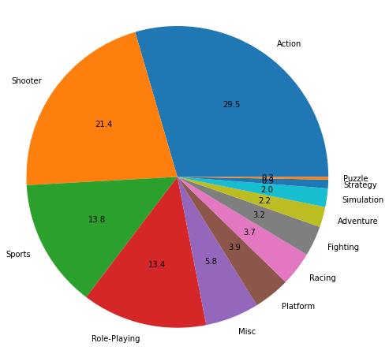
    


```python
# формируем сводную таблицу
data_pivot_genre = data_promis.pivot_table(index = ['genre'], values = 'total_sales', aggfunc = 'median')
```


```python
# переименование столбцов сводной таблицы
data_pivot_genre.columns = ['']
```


```python
# вывод отсортированного списка
data_pivot_genre = data_pivot_genre.sort_values(by='', ascending=False)
data_pivot_genre
```


  <div id="df-70b0f18b-e73a-4889-bbc4-da58a634011f">
    <div class="colab-df-container">
      <div>
<style scoped>
    .dataframe tbody tr th:only-of-type {
        vertical-align: middle;
    }

    .dataframe tbody tr th {
        vertical-align: top;
    }

    .dataframe thead th {
        text-align: right;
    }
</style>
<table border="1" class="dataframe">
  <thead>
    <tr style="text-align: right;">
      <th></th>
      <th></th>
    </tr>
    <tr>
      <th>genre</th>
      <th></th>
    </tr>
  </thead>
  <tbody>
    <tr>
      <th>Shooter</th>
      <td>0.450</td>
    </tr>
    <tr>
      <th>Sports</th>
      <td>0.240</td>
    </tr>
    <tr>
      <th>Platform</th>
      <td>0.225</td>
    </tr>
    <tr>
      <th>Fighting</th>
      <td>0.125</td>
    </tr>
    <tr>
      <th>Role-Playing</th>
      <td>0.125</td>
    </tr>
    <tr>
      <th>Racing</th>
      <td>0.120</td>
    </tr>
    <tr>
      <th>Action</th>
      <td>0.110</td>
    </tr>
    <tr>
      <th>Misc</th>
      <td>0.100</td>
    </tr>
    <tr>
      <th>Simulation</th>
      <td>0.100</td>
    </tr>
    <tr>
      <th>Strategy</th>
      <td>0.080</td>
    </tr>
    <tr>
      <th>Puzzle</th>
      <td>0.060</td>
    </tr>
    <tr>
      <th>Adventure</th>
      <td>0.030</td>
    </tr>
  </tbody>
</table>
</div>
      <button class="colab-df-convert" onclick="convertToInteractive('df-70b0f18b-e73a-4889-bbc4-da58a634011f')"
              title="Convert this dataframe to an interactive table."
              style="display:none;">

  <svg xmlns="http://www.w3.org/2000/svg" height="24px"viewBox="0 0 24 24"
       width="24px">
    <path d="M0 0h24v24H0V0z" fill="none"/>
    <path d="M18.56 5.44l.94 2.06.94-2.06 2.06-.94-2.06-.94-.94-2.06-.94 2.06-2.06.94zm-11 1L8.5 8.5l.94-2.06 2.06-.94-2.06-.94L8.5 2.5l-.94 2.06-2.06.94zm10 10l.94 2.06.94-2.06 2.06-.94-2.06-.94-.94-2.06-.94 2.06-2.06.94z"/><path d="M17.41 7.96l-1.37-1.37c-.4-.4-.92-.59-1.43-.59-.52 0-1.04.2-1.43.59L10.3 9.45l-7.72 7.72c-.78.78-.78 2.05 0 2.83L4 21.41c.39.39.9.59 1.41.59.51 0 1.02-.2 1.41-.59l7.78-7.78 2.81-2.81c.8-.78.8-2.07 0-2.86zM5.41 20L4 18.59l7.72-7.72 1.47 1.35L5.41 20z"/>
  </svg>
      </button>

  <style>
    .colab-df-container {
      display:flex;
      flex-wrap:wrap;
      gap: 12px;
    }

    .colab-df-convert {
      background-color: #E8F0FE;
      border: none;
      border-radius: 50%;
      cursor: pointer;
      display: none;
      fill: #1967D2;
      height: 32px;
      padding: 0 0 0 0;
      width: 32px;
    }

    .colab-df-convert:hover {
      background-color: #E2EBFA;
      box-shadow: 0px 1px 2px rgba(60, 64, 67, 0.3), 0px 1px 3px 1px rgba(60, 64, 67, 0.15);
      fill: #174EA6;
    }

    [theme=dark] .colab-df-convert {
      background-color: #3B4455;
      fill: #D2E3FC;
    }

    [theme=dark] .colab-df-convert:hover {
      background-color: #434B5C;
      box-shadow: 0px 1px 3px 1px rgba(0, 0, 0, 0.15);
      filter: drop-shadow(0px 1px 2px rgba(0, 0, 0, 0.3));
      fill: #FFFFFF;
    }
  </style>

      <script>
        const buttonEl =
          document.querySelector('#df-70b0f18b-e73a-4889-bbc4-da58a634011f button.colab-df-convert');
        buttonEl.style.display =
          google.colab.kernel.accessAllowed ? 'block' : 'none';

        async function convertToInteractive(key) {
          const element = document.querySelector('#df-70b0f18b-e73a-4889-bbc4-da58a634011f');
          const dataTable =
            await google.colab.kernel.invokeFunction('convertToInteractive',
                                                     [key], {});
          if (!dataTable) return;

          const docLinkHtml = 'Like what you see? Visit the ' +
            '<a target="_blank" href=https://colab.research.google.com/notebooks/data_table.ipynb>data table notebook</a>'
            + ' to learn more about interactive tables.';
          element.innerHTML = '';
          dataTable['output_type'] = 'display_data';
          await google.colab.output.renderOutput(dataTable, element);
          const docLink = document.createElement('div');
          docLink.innerHTML = docLinkHtml;
          element.appendChild(docLink);
        }
      </script>
    </div>
  </div>


```python
# круговая диаграмма распределения жанров в процентном соотношении
data_pivot_genre[''].plot(kind='pie', figsize=(8, 8), autopct='%.1f', radius = 1.1);
```


    
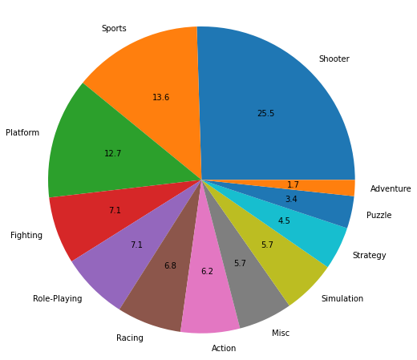
    


##### Вывод

За период с 2013 по 2016:
1. Самый суммарноприбыльный жанр Action порядка 30% от общего числа
2. Самый не суммарноприбыльный жанр Puzzle менее 1% от общего числа
3. В тройку самых суммарноприбыльный жанров, занимающих порядка 70% от общего числа, входят:
    *   Action
    *   Shooter
    *   Sports
    
Кроме того, анализ медианных значений прибыли каждого жанра и диаграммы размаха показал следующее:

4. Самый медианноприбыльный жанр Shooter порядка 26% от общего числа
5. Самый не медианноприбыльный жанр Adventure порядка 2% от общего числа
6. В тройку самых медианноприбыльный жанров, занимающих порядка 52% от общего числа, входят:
    *   Shooter
    *   Sports
    *   Platform

#### Актуальный период


```python
data_actual = data_promis.query('year_of_release == 2016')
```


```python
# диаграмма размаха
plt.figure(figsize=(15,10))
sns.boxplot(data=data_actual, x='total_sales', y='genre')
plt.title(label='Диаграмма размаха по глобальным продажам игр, различных жанров', fontsize=14, fontweight="bold")
plt.xlim(0, 1.5)
plt.xlabel("глобальные продажи", fontsize=14, fontweight="bold")
plt.ylabel("жанры", fontsize=14, fontweight="bold");
```


    
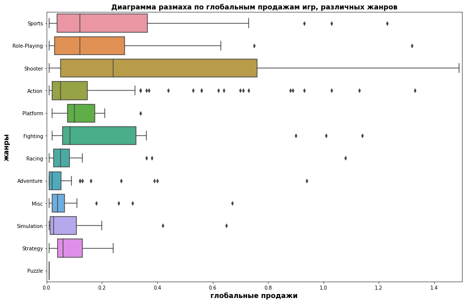
    


```python
# формируем сводную таблицу
data_pivot_genre = data_actual.pivot_table(index = ['genre'], values = 'total_sales', aggfunc = 'sum')
```


```python
# переименование столбцов сводной таблицы
data_pivot_genre.columns = ['']
```


```python
# вывод отсортированного списка
data_pivot_genre = data_pivot_genre.sort_values(by='', ascending=False)
data_pivot_genre
```


  <div id="df-a3591694-bb02-44d8-9f07-59a8963f251e">
    <div class="colab-df-container">
      <div>
<style scoped>
    .dataframe tbody tr th:only-of-type {
        vertical-align: middle;
    }

    .dataframe tbody tr th {
        vertical-align: top;
    }

    .dataframe thead th {
        text-align: right;
    }
</style>
<table border="1" class="dataframe">
  <thead>
    <tr style="text-align: right;">
      <th></th>
      <th></th>
    </tr>
    <tr>
      <th>genre</th>
      <th></th>
    </tr>
  </thead>
  <tbody>
    <tr>
      <th>Shooter</th>
      <td>38.22</td>
    </tr>
    <tr>
      <th>Action</th>
      <td>30.11</td>
    </tr>
    <tr>
      <th>Sports</th>
      <td>23.49</td>
    </tr>
    <tr>
      <th>Role-Playing</th>
      <td>18.18</td>
    </tr>
    <tr>
      <th>Fighting</th>
      <td>4.47</td>
    </tr>
    <tr>
      <th>Adventure</th>
      <td>3.82</td>
    </tr>
    <tr>
      <th>Platform</th>
      <td>3.23</td>
    </tr>
    <tr>
      <th>Racing</th>
      <td>2.79</td>
    </tr>
    <tr>
      <th>Misc</th>
      <td>2.60</td>
    </tr>
    <tr>
      <th>Simulation</th>
      <td>1.89</td>
    </tr>
    <tr>
      <th>Strategy</th>
      <td>1.13</td>
    </tr>
    <tr>
      <th>Puzzle</th>
      <td>0.01</td>
    </tr>
  </tbody>
</table>
</div>
      <button class="colab-df-convert" onclick="convertToInteractive('df-a3591694-bb02-44d8-9f07-59a8963f251e')"
              title="Convert this dataframe to an interactive table."
              style="display:none;">

  <svg xmlns="http://www.w3.org/2000/svg" height="24px"viewBox="0 0 24 24"
       width="24px">
    <path d="M0 0h24v24H0V0z" fill="none"/>
    <path d="M18.56 5.44l.94 2.06.94-2.06 2.06-.94-2.06-.94-.94-2.06-.94 2.06-2.06.94zm-11 1L8.5 8.5l.94-2.06 2.06-.94-2.06-.94L8.5 2.5l-.94 2.06-2.06.94zm10 10l.94 2.06.94-2.06 2.06-.94-2.06-.94-.94-2.06-.94 2.06-2.06.94z"/><path d="M17.41 7.96l-1.37-1.37c-.4-.4-.92-.59-1.43-.59-.52 0-1.04.2-1.43.59L10.3 9.45l-7.72 7.72c-.78.78-.78 2.05 0 2.83L4 21.41c.39.39.9.59 1.41.59.51 0 1.02-.2 1.41-.59l7.78-7.78 2.81-2.81c.8-.78.8-2.07 0-2.86zM5.41 20L4 18.59l7.72-7.72 1.47 1.35L5.41 20z"/>
  </svg>
      </button>

  <style>
    .colab-df-container {
      display:flex;
      flex-wrap:wrap;
      gap: 12px;
    }

    .colab-df-convert {
      background-color: #E8F0FE;
      border: none;
      border-radius: 50%;
      cursor: pointer;
      display: none;
      fill: #1967D2;
      height: 32px;
      padding: 0 0 0 0;
      width: 32px;
    }

    .colab-df-convert:hover {
      background-color: #E2EBFA;
      box-shadow: 0px 1px 2px rgba(60, 64, 67, 0.3), 0px 1px 3px 1px rgba(60, 64, 67, 0.15);
      fill: #174EA6;
    }

    [theme=dark] .colab-df-convert {
      background-color: #3B4455;
      fill: #D2E3FC;
    }

    [theme=dark] .colab-df-convert:hover {
      background-color: #434B5C;
      box-shadow: 0px 1px 3px 1px rgba(0, 0, 0, 0.15);
      filter: drop-shadow(0px 1px 2px rgba(0, 0, 0, 0.3));
      fill: #FFFFFF;
    }
  </style>

      <script>
        const buttonEl =
          document.querySelector('#df-a3591694-bb02-44d8-9f07-59a8963f251e button.colab-df-convert');
        buttonEl.style.display =
          google.colab.kernel.accessAllowed ? 'block' : 'none';

        async function convertToInteractive(key) {
          const element = document.querySelector('#df-a3591694-bb02-44d8-9f07-59a8963f251e');
          const dataTable =
            await google.colab.kernel.invokeFunction('convertToInteractive',
                                                     [key], {});
          if (!dataTable) return;

          const docLinkHtml = 'Like what you see? Visit the ' +
            '<a target="_blank" href=https://colab.research.google.com/notebooks/data_table.ipynb>data table notebook</a>'
            + ' to learn more about interactive tables.';
          element.innerHTML = '';
          dataTable['output_type'] = 'display_data';
          await google.colab.output.renderOutput(dataTable, element);
          const docLink = document.createElement('div');
          docLink.innerHTML = docLinkHtml;
          element.appendChild(docLink);
        }
      </script>
    </div>
  </div>


```python
# круговая диаграмма распределения жанров в процентном соотношении
data_pivot_genre[''].plot(kind='pie', figsize=(8, 8), autopct='%.1f', radius = 1.1);
```


    
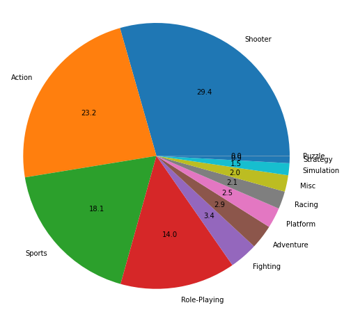
    


```python
# формируем сводную таблицу
data_pivot_genre = data_actual.pivot_table(index = ['genre'], values = 'total_sales', aggfunc = 'median')
```


```python
# переименование столбцов сводной таблицы
data_pivot_genre.columns = ['']
```


```python
# вывод отсортированного списка
data_pivot_genre = data_pivot_genre.sort_values(by='', ascending=False)
data_pivot_genre
```


  <div id="df-ae63dbfb-3182-42d2-be8c-22d857dd90b0">
    <div class="colab-df-container">
      <div>
<style scoped>
    .dataframe tbody tr th:only-of-type {
        vertical-align: middle;
    }

    .dataframe tbody tr th {
        vertical-align: top;
    }

    .dataframe thead th {
        text-align: right;
    }
</style>
<table border="1" class="dataframe">
  <thead>
    <tr style="text-align: right;">
      <th></th>
      <th></th>
    </tr>
    <tr>
      <th>genre</th>
      <th></th>
    </tr>
  </thead>
  <tbody>
    <tr>
      <th>Shooter</th>
      <td>0.240</td>
    </tr>
    <tr>
      <th>Role-Playing</th>
      <td>0.120</td>
    </tr>
    <tr>
      <th>Sports</th>
      <td>0.120</td>
    </tr>
    <tr>
      <th>Platform</th>
      <td>0.100</td>
    </tr>
    <tr>
      <th>Fighting</th>
      <td>0.085</td>
    </tr>
    <tr>
      <th>Strategy</th>
      <td>0.060</td>
    </tr>
    <tr>
      <th>Action</th>
      <td>0.050</td>
    </tr>
    <tr>
      <th>Racing</th>
      <td>0.050</td>
    </tr>
    <tr>
      <th>Misc</th>
      <td>0.040</td>
    </tr>
    <tr>
      <th>Simulation</th>
      <td>0.025</td>
    </tr>
    <tr>
      <th>Adventure</th>
      <td>0.020</td>
    </tr>
    <tr>
      <th>Puzzle</th>
      <td>0.010</td>
    </tr>
  </tbody>
</table>
</div>
      <button class="colab-df-convert" onclick="convertToInteractive('df-ae63dbfb-3182-42d2-be8c-22d857dd90b0')"
              title="Convert this dataframe to an interactive table."
              style="display:none;">

  <svg xmlns="http://www.w3.org/2000/svg" height="24px"viewBox="0 0 24 24"
       width="24px">
    <path d="M0 0h24v24H0V0z" fill="none"/>
    <path d="M18.56 5.44l.94 2.06.94-2.06 2.06-.94-2.06-.94-.94-2.06-.94 2.06-2.06.94zm-11 1L8.5 8.5l.94-2.06 2.06-.94-2.06-.94L8.5 2.5l-.94 2.06-2.06.94zm10 10l.94 2.06.94-2.06 2.06-.94-2.06-.94-.94-2.06-.94 2.06-2.06.94z"/><path d="M17.41 7.96l-1.37-1.37c-.4-.4-.92-.59-1.43-.59-.52 0-1.04.2-1.43.59L10.3 9.45l-7.72 7.72c-.78.78-.78 2.05 0 2.83L4 21.41c.39.39.9.59 1.41.59.51 0 1.02-.2 1.41-.59l7.78-7.78 2.81-2.81c.8-.78.8-2.07 0-2.86zM5.41 20L4 18.59l7.72-7.72 1.47 1.35L5.41 20z"/>
  </svg>
      </button>

  <style>
    .colab-df-container {
      display:flex;
      flex-wrap:wrap;
      gap: 12px;
    }

    .colab-df-convert {
      background-color: #E8F0FE;
      border: none;
      border-radius: 50%;
      cursor: pointer;
      display: none;
      fill: #1967D2;
      height: 32px;
      padding: 0 0 0 0;
      width: 32px;
    }

    .colab-df-convert:hover {
      background-color: #E2EBFA;
      box-shadow: 0px 1px 2px rgba(60, 64, 67, 0.3), 0px 1px 3px 1px rgba(60, 64, 67, 0.15);
      fill: #174EA6;
    }

    [theme=dark] .colab-df-convert {
      background-color: #3B4455;
      fill: #D2E3FC;
    }

    [theme=dark] .colab-df-convert:hover {
      background-color: #434B5C;
      box-shadow: 0px 1px 3px 1px rgba(0, 0, 0, 0.15);
      filter: drop-shadow(0px 1px 2px rgba(0, 0, 0, 0.3));
      fill: #FFFFFF;
    }
  </style>

      <script>
        const buttonEl =
          document.querySelector('#df-ae63dbfb-3182-42d2-be8c-22d857dd90b0 button.colab-df-convert');
        buttonEl.style.display =
          google.colab.kernel.accessAllowed ? 'block' : 'none';

        async function convertToInteractive(key) {
          const element = document.querySelector('#df-ae63dbfb-3182-42d2-be8c-22d857dd90b0');
          const dataTable =
            await google.colab.kernel.invokeFunction('convertToInteractive',
                                                     [key], {});
          if (!dataTable) return;

          const docLinkHtml = 'Like what you see? Visit the ' +
            '<a target="_blank" href=https://colab.research.google.com/notebooks/data_table.ipynb>data table notebook</a>'
            + ' to learn more about interactive tables.';
          element.innerHTML = '';
          dataTable['output_type'] = 'display_data';
          await google.colab.output.renderOutput(dataTable, element);
          const docLink = document.createElement('div');
          docLink.innerHTML = docLinkHtml;
          element.appendChild(docLink);
        }
      </script>
    </div>
  </div>


```python
# круговая диаграмма распределения жанров в процентном соотношении
data_pivot_genre[''].plot(kind='pie', figsize=(8, 8), autopct='%.1f', radius = 1.1);
```


    
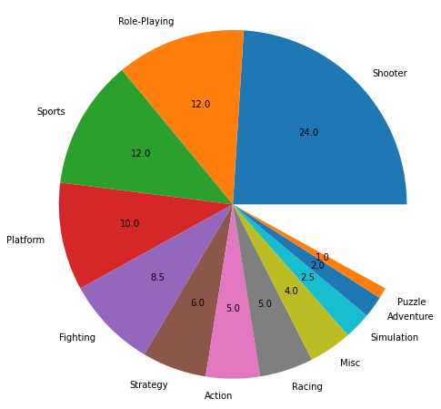
    


##### Вывод

За актуальный период:
1. Самый популярный жанр Shooter порядка 29% от общего числа
2. Самый не популярный жанр Puzzle менее 1% от общего числа
3. В тройку самых популярных жанров, занимающих порядка 71% от общего числа, входят:
    *   Shooter
    *   Action
    *   Sports

Кроме того, анализ медианных значений прибыли каждого жанра и диаграммы размаха показал следующее:

4. Самый медианноприбыльный жанр Shooter порядка 24% от общего числа
5. Самый не медианноприбыльный жанр Puzzle порядка 1% от общего числа
6. В тройку самых медианноприбыльный жанров, занимающих порядка 48% от общего числа, входят:
    *   Shooter
    *   Role-Playing
    *   Sports

#### Вывод

1. В целом, необходимо отметить, что в тройку самых суммарноприбыльных жанров как в актуальный период, так и в период с 2013 по 2016, входят:

    *   Action
    *   Shooter
    *   Sports
    
   Так же установлено, что постоянными участниками тройки самых медианноприбыльный жанров как в актуальный период, так и в    период с 2013 по 2016, являются:

    *   Shooter
    *   Sports

   что касается третьего участника (самых медианноприбыльных жанров) он не стабилен и в разное время это были:
    
    *   Platform
    *   Role-Playing
        
2. Отсутствие Action в тройке самых медианноприбыльных жанров, говорит о том, что он свое лидерство по суммарной прибыли взял лишь количеством.

## Портрет пользователя каждого региона

### Самые популярные платформы (топ-5)


```python
# формируем лист регионов
list_region =['na_sales', 'eu_sales', 'jp_sales']
```


```python
# функция подсчет TOP-5 платформ по регионам
def top_5(list_reg):
    top_5_total = pd.DataFrame()   
    for region in list_reg:
        df = data_promis.pivot_table(index = ['platform'], values = region, aggfunc = 'sum')
        df_sort = df.sort_values(by=region, ascending=False).head(5)
        top_5_total = pd.concat([top_5_total, df_sort], sort=False)
        top_5_total = top_5_total.fillna(0)
    top_5_total = top_5_total.pivot_table(index = ['platform'], values = ['na_sales', 'eu_sales', 'jp_sales'], aggfunc = 'sum')
    top_5_total['total_sales_region'] = top_5_total['na_sales'] + top_5_total['eu_sales'] + top_5_total['jp_sales']
    top_5_total = top_5_total.sort_values(by='total_sales_region', ascending=False).head(5)
    return top_5_total
```


```python
df_top_5 = top_5(list_region)
```


```python
display(df_top_5)
print()
plt.suptitle("Диаграммы распределения популярности платформ по регионам", fontsize=14)
plt.subplot(1, 3, 1)
df_top_5['na_sales'].plot(kind='pie', figsize=(15, 5), autopct='%.1f', radius = 1.1, ylabel='', title='na_sales')

plt.subplot(1, 3, 2)
df_top_5['eu_sales'].plot(kind='pie', figsize=(15, 5), autopct='%.1f', radius = 1.1, ylabel='', title='eu_sales')

plt.subplot(1, 3, 3)
df_top_5['jp_sales'].plot(kind='pie', figsize=(15, 5), autopct='%.1f', radius = 1.1, ylabel='', title='jp_sales')
plt.show()
```


  <div id="df-6dcfd6d0-23dd-4873-ab10-9237d24ea931">
    <div class="colab-df-container">
      <div>
<style scoped>
    .dataframe tbody tr th:only-of-type {
        vertical-align: middle;
    }

    .dataframe tbody tr th {
        vertical-align: top;
    }

    .dataframe thead th {
        text-align: right;
    }
</style>
<table border="1" class="dataframe">
  <thead>
    <tr style="text-align: right;">
      <th></th>
      <th>eu_sales</th>
      <th>jp_sales</th>
      <th>na_sales</th>
      <th>total_sales_region</th>
    </tr>
    <tr>
      <th>platform</th>
      <th></th>
      <th></th>
      <th></th>
      <th></th>
    </tr>
  </thead>
  <tbody>
    <tr>
      <th>PS4</th>
      <td>141.09</td>
      <td>15.96</td>
      <td>108.74</td>
      <td>265.79</td>
    </tr>
    <tr>
      <th>PS3</th>
      <td>67.81</td>
      <td>23.35</td>
      <td>63.50</td>
      <td>154.66</td>
    </tr>
    <tr>
      <th>XOne</th>
      <td>51.59</td>
      <td>0.00</td>
      <td>93.12</td>
      <td>144.71</td>
    </tr>
    <tr>
      <th>3DS</th>
      <td>30.96</td>
      <td>67.81</td>
      <td>38.20</td>
      <td>136.97</td>
    </tr>
    <tr>
      <th>X360</th>
      <td>42.52</td>
      <td>0.00</td>
      <td>81.66</td>
      <td>124.18</td>
    </tr>
  </tbody>
</table>
</div>
      <button class="colab-df-convert" onclick="convertToInteractive('df-6dcfd6d0-23dd-4873-ab10-9237d24ea931')"
              title="Convert this dataframe to an interactive table."
              style="display:none;">

  <svg xmlns="http://www.w3.org/2000/svg" height="24px"viewBox="0 0 24 24"
       width="24px">
    <path d="M0 0h24v24H0V0z" fill="none"/>
    <path d="M18.56 5.44l.94 2.06.94-2.06 2.06-.94-2.06-.94-.94-2.06-.94 2.06-2.06.94zm-11 1L8.5 8.5l.94-2.06 2.06-.94-2.06-.94L8.5 2.5l-.94 2.06-2.06.94zm10 10l.94 2.06.94-2.06 2.06-.94-2.06-.94-.94-2.06-.94 2.06-2.06.94z"/><path d="M17.41 7.96l-1.37-1.37c-.4-.4-.92-.59-1.43-.59-.52 0-1.04.2-1.43.59L10.3 9.45l-7.72 7.72c-.78.78-.78 2.05 0 2.83L4 21.41c.39.39.9.59 1.41.59.51 0 1.02-.2 1.41-.59l7.78-7.78 2.81-2.81c.8-.78.8-2.07 0-2.86zM5.41 20L4 18.59l7.72-7.72 1.47 1.35L5.41 20z"/>
  </svg>
      </button>

  <style>
    .colab-df-container {
      display:flex;
      flex-wrap:wrap;
      gap: 12px;
    }

    .colab-df-convert {
      background-color: #E8F0FE;
      border: none;
      border-radius: 50%;
      cursor: pointer;
      display: none;
      fill: #1967D2;
      height: 32px;
      padding: 0 0 0 0;
      width: 32px;
    }

    .colab-df-convert:hover {
      background-color: #E2EBFA;
      box-shadow: 0px 1px 2px rgba(60, 64, 67, 0.3), 0px 1px 3px 1px rgba(60, 64, 67, 0.15);
      fill: #174EA6;
    }

    [theme=dark] .colab-df-convert {
      background-color: #3B4455;
      fill: #D2E3FC;
    }

    [theme=dark] .colab-df-convert:hover {
      background-color: #434B5C;
      box-shadow: 0px 1px 3px 1px rgba(0, 0, 0, 0.15);
      filter: drop-shadow(0px 1px 2px rgba(0, 0, 0, 0.3));
      fill: #FFFFFF;
    }
  </style>

      <script>
        const buttonEl =
          document.querySelector('#df-6dcfd6d0-23dd-4873-ab10-9237d24ea931 button.colab-df-convert');
        buttonEl.style.display =
          google.colab.kernel.accessAllowed ? 'block' : 'none';

        async function convertToInteractive(key) {
          const element = document.querySelector('#df-6dcfd6d0-23dd-4873-ab10-9237d24ea931');
          const dataTable =
            await google.colab.kernel.invokeFunction('convertToInteractive',
                                                     [key], {});
          if (!dataTable) return;

          const docLinkHtml = 'Like what you see? Visit the ' +
            '<a target="_blank" href=https://colab.research.google.com/notebooks/data_table.ipynb>data table notebook</a>'
            + ' to learn more about interactive tables.';
          element.innerHTML = '';
          dataTable['output_type'] = 'display_data';
          await google.colab.output.renderOutput(dataTable, element);
          const docLink = document.createElement('div');
          docLink.innerHTML = docLinkHtml;
          element.appendChild(docLink);
        }
      </script>
    </div>
  </div>


    
    


    
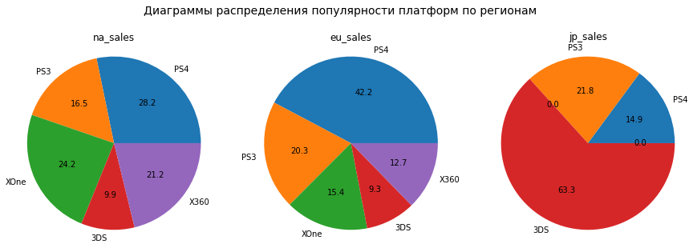
    


#### Вывод

1. Платформа PS4 занимает первое место, ее популярность в регионах составляет:
    *   первое место в "na" регионе, доля продаж - 28.2%
    *   первое место в "eu" регионе, доля продаж - 42.2%
    *   третье место в "jp" регионе, доля продаж - 14.9%
2. Платформа PS3 занимает второе место, ее популярность в регионах составляет:
    *   четвертое место в "na" регионе, доля продаж - 16.5%
    *   второе место в "eu" регионе, доля продаж - 20.3%
    *   второе место в "jp" регионе, доля продаж - 21.8%
3. Платформа XOne занимает третье место, ее популярность в регионах составляет:
    *   второе место в "na" регионе, доля продаж - 24.2%
    *   третье место в "eu" регионе, доля продаж - 15.4%

### Самые популярные жанры (топ-5)


```python
# функция подсчет TOP-5 жанров по регионам
def top_5_genre(list_reg):
    top_5_total = pd.DataFrame()   
    for region in list_reg:
        df = data_promis.pivot_table(index = ['genre'], values = region, aggfunc = 'sum')
        df_sort = df.sort_values(by=region, ascending=False).head(5)
        top_5_total = pd.concat([top_5_total, df_sort], sort=False)
        top_5_total = top_5_total.fillna(0)
    top_5_total = top_5_total.pivot_table(index = ['genre'], values = ['na_sales', 'eu_sales', 'jp_sales'], aggfunc = 'sum')
    top_5_total['total_sales_region'] = top_5_total['na_sales'] + top_5_total['eu_sales'] + top_5_total['jp_sales']
    top_5_total = top_5_total.sort_values(by='total_sales_region', ascending=False).head(5)
    return top_5_total
```


```python
df_top_5 = top_5_genre(list_region)
```


```python
display(df_top_5)
print()
plt.suptitle("Диаграммы распределения популярности жанров по регионам", fontsize=14)
plt.subplot(1, 3, 1)
df_top_5['na_sales'].plot(kind='pie', figsize=(15, 5), autopct='%.1f', radius = 1.1, ylabel='', title='na_sales')

plt.subplot(1, 3, 2)
df_top_5['eu_sales'].plot(kind='pie', figsize=(15, 5), autopct='%.1f', radius = 1.1, ylabel='', title='eu_sales')

plt.subplot(1, 3, 3)
df_top_5['jp_sales'].plot(kind='pie', figsize=(15, 5), autopct='%.1f', radius = 1.1, ylabel='', title='jp_sales')
plt.show()
```


  <div id="df-bb9edebb-3884-4624-a0f7-58864191c74f">
    <div class="colab-df-container">
      <div>
<style scoped>
    .dataframe tbody tr th:only-of-type {
        vertical-align: middle;
    }

    .dataframe tbody tr th {
        vertical-align: top;
    }

    .dataframe thead th {
        text-align: right;
    }
</style>
<table border="1" class="dataframe">
  <thead>
    <tr style="text-align: right;">
      <th></th>
      <th>eu_sales</th>
      <th>jp_sales</th>
      <th>na_sales</th>
      <th>total_sales_region</th>
    </tr>
    <tr>
      <th>genre</th>
      <th></th>
      <th></th>
      <th></th>
      <th></th>
    </tr>
  </thead>
  <tbody>
    <tr>
      <th>Action</th>
      <td>118.13</td>
      <td>40.49</td>
      <td>126.05</td>
      <td>284.67</td>
    </tr>
    <tr>
      <th>Shooter</th>
      <td>87.86</td>
      <td>6.61</td>
      <td>109.74</td>
      <td>204.21</td>
    </tr>
    <tr>
      <th>Role-Playing</th>
      <td>36.97</td>
      <td>51.04</td>
      <td>46.40</td>
      <td>134.41</td>
    </tr>
    <tr>
      <th>Sports</th>
      <td>60.52</td>
      <td>0.00</td>
      <td>65.27</td>
      <td>125.79</td>
    </tr>
    <tr>
      <th>Misc</th>
      <td>0.00</td>
      <td>9.20</td>
      <td>27.49</td>
      <td>36.69</td>
    </tr>
  </tbody>
</table>
</div>
      <button class="colab-df-convert" onclick="convertToInteractive('df-bb9edebb-3884-4624-a0f7-58864191c74f')"
              title="Convert this dataframe to an interactive table."
              style="display:none;">

  <svg xmlns="http://www.w3.org/2000/svg" height="24px"viewBox="0 0 24 24"
       width="24px">
    <path d="M0 0h24v24H0V0z" fill="none"/>
    <path d="M18.56 5.44l.94 2.06.94-2.06 2.06-.94-2.06-.94-.94-2.06-.94 2.06-2.06.94zm-11 1L8.5 8.5l.94-2.06 2.06-.94-2.06-.94L8.5 2.5l-.94 2.06-2.06.94zm10 10l.94 2.06.94-2.06 2.06-.94-2.06-.94-.94-2.06-.94 2.06-2.06.94z"/><path d="M17.41 7.96l-1.37-1.37c-.4-.4-.92-.59-1.43-.59-.52 0-1.04.2-1.43.59L10.3 9.45l-7.72 7.72c-.78.78-.78 2.05 0 2.83L4 21.41c.39.39.9.59 1.41.59.51 0 1.02-.2 1.41-.59l7.78-7.78 2.81-2.81c.8-.78.8-2.07 0-2.86zM5.41 20L4 18.59l7.72-7.72 1.47 1.35L5.41 20z"/>
  </svg>
      </button>

  <style>
    .colab-df-container {
      display:flex;
      flex-wrap:wrap;
      gap: 12px;
    }

    .colab-df-convert {
      background-color: #E8F0FE;
      border: none;
      border-radius: 50%;
      cursor: pointer;
      display: none;
      fill: #1967D2;
      height: 32px;
      padding: 0 0 0 0;
      width: 32px;
    }

    .colab-df-convert:hover {
      background-color: #E2EBFA;
      box-shadow: 0px 1px 2px rgba(60, 64, 67, 0.3), 0px 1px 3px 1px rgba(60, 64, 67, 0.15);
      fill: #174EA6;
    }

    [theme=dark] .colab-df-convert {
      background-color: #3B4455;
      fill: #D2E3FC;
    }

    [theme=dark] .colab-df-convert:hover {
      background-color: #434B5C;
      box-shadow: 0px 1px 3px 1px rgba(0, 0, 0, 0.15);
      filter: drop-shadow(0px 1px 2px rgba(0, 0, 0, 0.3));
      fill: #FFFFFF;
    }
  </style>

      <script>
        const buttonEl =
          document.querySelector('#df-bb9edebb-3884-4624-a0f7-58864191c74f button.colab-df-convert');
        buttonEl.style.display =
          google.colab.kernel.accessAllowed ? 'block' : 'none';

        async function convertToInteractive(key) {
          const element = document.querySelector('#df-bb9edebb-3884-4624-a0f7-58864191c74f');
          const dataTable =
            await google.colab.kernel.invokeFunction('convertToInteractive',
                                                     [key], {});
          if (!dataTable) return;

          const docLinkHtml = 'Like what you see? Visit the ' +
            '<a target="_blank" href=https://colab.research.google.com/notebooks/data_table.ipynb>data table notebook</a>'
            + ' to learn more about interactive tables.';
          element.innerHTML = '';
          dataTable['output_type'] = 'display_data';
          await google.colab.output.renderOutput(dataTable, element);
          const docLink = document.createElement('div');
          docLink.innerHTML = docLinkHtml;
          element.appendChild(docLink);
        }
      </script>
    </div>
  </div>


    
    


    
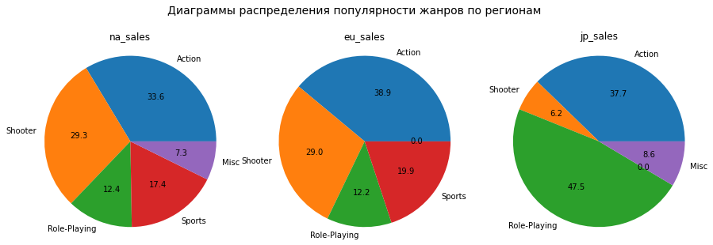
    


#### Вывод

1. Жанр Action как самый популярный занимает лидирующие места по всем регионам, а именно:
    *   первое место в "na" регионе, доля продаж - 33.6%
    *   первое место в "eu" регионе, доля продаж - 38.9%
    *   второе место в "jp" регионе, доля продаж - 37.7%
2. Жанр Shooter занимает второе место по популярности в регионах, а именно:
    *   второе место в "na" регионе, доля продаж - 29.3%
    *   второе место в "eu" регионе, доля продаж - 29.0%
    *   четвертое место в "jp" регионе, доля продаж - 6.2%
3. Жанр Role-Playing занимает третье место по популярности в регионах, а именно:
    *   четвертое место в "na" регионе, доля продаж - 12.4%
    *   четвертое место в "eu" регионе, доля продаж - 12.2%
    *   первое место в "jp" регионе, доля продаж - 47.5%

### Влияет ли рейтинг ESRB на продажи в отдельном регионе

#### Корреляционный анализ

Для подсчета корреляции между рейтингом ESRB и продажами в отдельном регионе, переведем номинативную шкалу ESRB в числовую. Присвоим каждому буквенному значению рейтинга - числовое, соответствующее возрасту из источника: https://ru.wikipedia.org/wiki/Entertainment_Software_Rating_Board


```python
# вывод уникальных значений
data['rating'].unique()
```


    array(['E', 'unknown', 'M', 'T', 'E10+', 'K-A', 'AO', 'EC', 'RP'],
          dtype=object)


```python
# формируем новый столбец
data['num_rating'] = data['rating']
```


```python
# замена номинативных значений числовыми
data['num_rating'].where(~(data.num_rating == 'E'), other=6, inplace=True)
data['num_rating'].where(~(data.num_rating == 'K-A'), other=6, inplace=True)
data['num_rating'].where(~(data.num_rating == 'M'), other=17, inplace=True)
data['num_rating'].where(~(data.num_rating == 'T'), other=13, inplace=True)
data['num_rating'].where(~(data.num_rating == 'E10+'), other=10, inplace=True)
data['num_rating'].where(~(data.num_rating == 'AO'), other=18, inplace=True)
data['num_rating'].where(~(data.num_rating == 'EC'), other=3, inplace=True)
data['num_rating'].where(~(data.num_rating == 'unknown'), other=0, inplace=True)
data['num_rating'].where(~(data.num_rating == 'RP'), other=0, inplace=True)
```


```python
# приведение столбца к типу 'int'
data['num_rating'] = data['num_rating'].astype('int')
```


```python
# функция подсчета корреляции между продажами и отзывами (критиков и пользователей) по платформам
def cor_sales_num_rating(list_reg):
    for region in list_reg:
        print(region)
        print(data[[region, 'num_rating']].corr())
        print('________________________________')

```


```python
cor_sales_num_rating(list_region)
```

    na_sales
                na_sales  num_rating
    na_sales    1.000000    0.083349
    num_rating  0.083349    1.000000
    ________________________________
    eu_sales
                eu_sales  num_rating
    eu_sales    1.000000    0.098459
    num_rating  0.098459    1.000000
    ________________________________
    jp_sales
                jp_sales  num_rating
    jp_sales    1.000000   -0.108276
    num_rating -0.108276    1.000000
    ________________________________
    

 #### Круговые диаграммы распределения по регионам


```python
# функция подсчет TOP-5 ESRB
def top_esrb_rating(list_reg):
    top_5_total = pd.DataFrame()   
    for region in list_reg:
        df = data_promis.pivot_table(index = ['rating'], values = region, aggfunc = 'sum')
        df_sort = df.sort_values(by=region, ascending=False).head(5)
        top_5_total = pd.concat([top_5_total, df_sort], sort=False)
        top_5_total = top_5_total.fillna(0)
    top_5_total = top_5_total.pivot_table(index = ['rating'], values = ['na_sales', 'eu_sales', 'jp_sales'], aggfunc = 'sum')
    top_5_total['total_sales_region'] = top_5_total['na_sales'] + top_5_total['eu_sales'] + top_5_total['jp_sales']
    top_5_total = top_5_total.sort_values(by='total_sales_region', ascending=False).head(5)
    return top_5_total
```


```python
df_top_5 = top_esrb_rating(list_region)
```


```python
display(df_top_5)
print()
plt.suptitle("Диаграммы распределения ESRB по регионам", fontsize=14)
plt.subplot(1, 3, 1)
df_top_5['na_sales'].plot(kind='pie', figsize=(15, 5), autopct='%.1f', radius = 1.1, ylabel='', title='na_sales')

plt.subplot(1, 3, 2)
df_top_5['eu_sales'].plot(kind='pie', figsize=(15, 5), autopct='%.1f', radius = 1.1, ylabel='', title='eu_sales')

plt.subplot(1, 3, 3)
df_top_5['jp_sales'].plot(kind='pie', figsize=(15, 5), autopct='%.1f', radius = 1.1, ylabel='', title='jp_sales')
plt.show()
```


  <div id="df-04221900-e1fc-4a45-9ac8-115e2a277d26">
    <div class="colab-df-container">
      <div>
<style scoped>
    .dataframe tbody tr th:only-of-type {
        vertical-align: middle;
    }

    .dataframe tbody tr th {
        vertical-align: top;
    }

    .dataframe thead th {
        text-align: right;
    }
</style>
<table border="1" class="dataframe">
  <thead>
    <tr style="text-align: right;">
      <th></th>
      <th>eu_sales</th>
      <th>jp_sales</th>
      <th>na_sales</th>
      <th>total_sales_region</th>
    </tr>
    <tr>
      <th>rating</th>
      <th></th>
      <th></th>
      <th></th>
      <th></th>
    </tr>
  </thead>
  <tbody>
    <tr>
      <th>M</th>
      <td>145.32</td>
      <td>14.11</td>
      <td>165.21</td>
      <td>324.64</td>
    </tr>
    <tr>
      <th>unknown</th>
      <td>78.91</td>
      <td>85.05</td>
      <td>89.42</td>
      <td>253.38</td>
    </tr>
    <tr>
      <th>E</th>
      <td>83.36</td>
      <td>15.14</td>
      <td>79.05</td>
      <td>177.55</td>
    </tr>
    <tr>
      <th>T</th>
      <td>41.95</td>
      <td>20.59</td>
      <td>49.79</td>
      <td>112.33</td>
    </tr>
    <tr>
      <th>E10+</th>
      <td>42.69</td>
      <td>5.89</td>
      <td>54.24</td>
      <td>102.82</td>
    </tr>
  </tbody>
</table>
</div>
      <button class="colab-df-convert" onclick="convertToInteractive('df-04221900-e1fc-4a45-9ac8-115e2a277d26')"
              title="Convert this dataframe to an interactive table."
              style="display:none;">

  <svg xmlns="http://www.w3.org/2000/svg" height="24px"viewBox="0 0 24 24"
       width="24px">
    <path d="M0 0h24v24H0V0z" fill="none"/>
    <path d="M18.56 5.44l.94 2.06.94-2.06 2.06-.94-2.06-.94-.94-2.06-.94 2.06-2.06.94zm-11 1L8.5 8.5l.94-2.06 2.06-.94-2.06-.94L8.5 2.5l-.94 2.06-2.06.94zm10 10l.94 2.06.94-2.06 2.06-.94-2.06-.94-.94-2.06-.94 2.06-2.06.94z"/><path d="M17.41 7.96l-1.37-1.37c-.4-.4-.92-.59-1.43-.59-.52 0-1.04.2-1.43.59L10.3 9.45l-7.72 7.72c-.78.78-.78 2.05 0 2.83L4 21.41c.39.39.9.59 1.41.59.51 0 1.02-.2 1.41-.59l7.78-7.78 2.81-2.81c.8-.78.8-2.07 0-2.86zM5.41 20L4 18.59l7.72-7.72 1.47 1.35L5.41 20z"/>
  </svg>
      </button>

  <style>
    .colab-df-container {
      display:flex;
      flex-wrap:wrap;
      gap: 12px;
    }

    .colab-df-convert {
      background-color: #E8F0FE;
      border: none;
      border-radius: 50%;
      cursor: pointer;
      display: none;
      fill: #1967D2;
      height: 32px;
      padding: 0 0 0 0;
      width: 32px;
    }

    .colab-df-convert:hover {
      background-color: #E2EBFA;
      box-shadow: 0px 1px 2px rgba(60, 64, 67, 0.3), 0px 1px 3px 1px rgba(60, 64, 67, 0.15);
      fill: #174EA6;
    }

    [theme=dark] .colab-df-convert {
      background-color: #3B4455;
      fill: #D2E3FC;
    }

    [theme=dark] .colab-df-convert:hover {
      background-color: #434B5C;
      box-shadow: 0px 1px 3px 1px rgba(0, 0, 0, 0.15);
      filter: drop-shadow(0px 1px 2px rgba(0, 0, 0, 0.3));
      fill: #FFFFFF;
    }
  </style>

      <script>
        const buttonEl =
          document.querySelector('#df-04221900-e1fc-4a45-9ac8-115e2a277d26 button.colab-df-convert');
        buttonEl.style.display =
          google.colab.kernel.accessAllowed ? 'block' : 'none';

        async function convertToInteractive(key) {
          const element = document.querySelector('#df-04221900-e1fc-4a45-9ac8-115e2a277d26');
          const dataTable =
            await google.colab.kernel.invokeFunction('convertToInteractive',
                                                     [key], {});
          if (!dataTable) return;

          const docLinkHtml = 'Like what you see? Visit the ' +
            '<a target="_blank" href=https://colab.research.google.com/notebooks/data_table.ipynb>data table notebook</a>'
            + ' to learn more about interactive tables.';
          element.innerHTML = '';
          dataTable['output_type'] = 'display_data';
          await google.colab.output.renderOutput(dataTable, element);
          const docLink = document.createElement('div');
          docLink.innerHTML = docLinkHtml;
          element.appendChild(docLink);
        }
      </script>
    </div>
  </div>


    
    


    
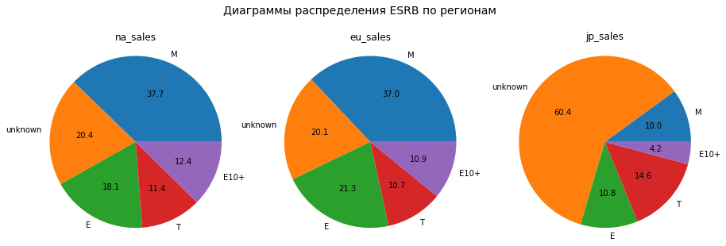
    


#### Вывод

А. Исходя их корреляционного анализа статистически значимой взаимосвязи между рейтингом ESRB и продажами в отдельном регионе не обнаружено.

Б. Однако, анализ круговых диаграмм распределения значений рейтинга ESRB по регионам, показал следующее:

1. Больше всего прибыли приносят игры со значением рейтинга "M" («Для взрослых» от 17 лет), лидирующим по всем регионам, а именно:
    *   первое место в "na" регионе, доля продаж - 37.7%
    *   первое место в "eu" регионе, доля продаж - 30.0%
    *   четвертое место в "jp" регионе, доля продаж - 10.0%
2. Игры со значением рейтинга "unknown" занимают второе место по популярности в регионах, а именно (обусловлено большим количеством пропусков):
    *   второе место в "na" регионе, доля продаж - 20.4%
    *   третье место в "eu" регионе, доля продаж - 20.1%
    *   первое место в "jp" регионе, доля продаж - 60.4%
3. Игры со значением рейтинга "E" («Для всех» - от 6 лет) занимают третье место по популярности в регионах, а именно:
    *   третье место в "na" регионе, доля продаж - 18.1%
    *   второе место в "eu" регионе, доля продаж - 21.3%
    *   третье место в "jp" регионе, доля продаж - 10.8%

## Проверка гипотез

### Средние пользовательские рейтинги платформ Xbox One и PC одинаковые


```python
# срез по платформам
data_XOne = data_promis.query('platform == "XOne"')
data_PC = data_promis.query('platform == "PC"')
```


```python
# удаление пропусков
data_XOne = data_XOne.dropna()
data_PC = data_PC.dropna()
```


```python
# СПРАВОЧНО: средний пользовательский рейтинг платформы Xbox One
data_XOne['user_score'].mean()
```


    6.538181818181819


```python
# СПРАВОЧНО: дисперсия
var_data_XOne = data_XOne['user_score'].var()
var_data_XOne
```


    1.7963991130820411


```python
# СПРАВОЧНО: средний пользовательский рейтинг платформы PC
data_PC['user_score'].mean()
```


    6.302027027027026


```python
# СПРАВОЧНО: дисперсия
var_data_PC = data_PC['user_score'].var()
var_data_PC
```


    2.9324448428019863


1.   H0: гипотеза о равенстве средних пользовательского рейтинга платформы PC и Xbox One
2.   H1: гипотеза о неравенстве средних пользовательского рейтинга платформы PC и Xbox One
3. Примечание:
*   параметр equal_var = False, так как дисперсии не равны
*   проверяем гипотезу о равенстве средних двух генеральных совокупностей


```python
sample_1 = data_XOne['user_score']
sample_2 = data_PC['user_score']

alpha = .05 # критический уровень статистической значимости
# если p-value окажется меньше него - отвергнем гипотезу

results = st.ttest_ind(
    sample_1, 
    sample_2,
    equal_var = False)

print('p-значение:', results.pvalue)

if results.pvalue < alpha:
    print("Отвергаем нулевую гипотезу")
else:
    print("Не получилось отвергнуть нулевую гипотезу") 
```

    p-значение: 0.17882648263401307
    Не получилось отвергнуть нулевую гипотезу
    

#### Вывод

При условии, что средние пользовательского рейтинга платформы PC и Xbox One равны, вероятность получить такие или еще более выраженные различия составила 0.17882648263401307. Принимаем нулевую гипотезу о равенстве средних пользовательского рейтинга платформы PC и Xbox One.

### Средние пользовательские рейтинги жанров Action (англ. «действие», экшен-игры) и Sports (англ. «спортивные соревнования»)


```python
# срез по жанрам
data_Action = data_promis.query('genre == "Action"')
data_Sports = data_promis.query('genre == "Sports"')
```


```python
# удаление пропусков
data_Action = data_Action.dropna()
data_Sports = data_Sports.dropna()
```


```python
# СПРАВОЧНО: cредний пользовательский рейтинг платформы Xbox One
data_Action['user_score'].mean()
```


    6.936245954692556


```python
# СПРАВОЧНО: дисперсия
var_data_Action = data_Action['user_score'].var()
var_data_Action
```


    1.6462144328163717


```python
# СПРАВОЧНО: cредний пользовательский рейтинг платформы PC
data_Sports['user_score'].mean()
```


    5.665454545454544


```python
# СПРАВОЧНО: дисперсия
var_data_Sports = data_Sports['user_score'].var()
var_data_Sports
```


    2.1316396997497913


1.   H0: гипотеза о равенстве средних пользовательского рейтинга жанров Action и Sports
2.   H0: гипотеза о неравенстве средних пользовательского рейтинга жанров Action и Sports
3. Примечание:
*   параметр equal_var = False, так как дисперсии не равны
*   проверяем гипотезу о равенстве средних двух генеральных совокупностей


```python
sample_1 = data_Action['user_score']
sample_2 = data_Sports['user_score']

alpha = .05 # критический уровень статистической значимости
# если p-value окажется меньше него - отвергнем гипотезу

results = st.ttest_ind(
    sample_1, 
    sample_2,
    equal_var = False)

print('p-значение:', results.pvalue)

if results.pvalue < alpha:
    print("Отвергаем нулевую гипотезу")
else:
    print("Не получилось отвергнуть нулевую гипотезу") 
```

    p-значение: 1.0496920005008588e-13
    Отвергаем нулевую гипотезу
    

#### Вывод

При условии, что средние пользовательского рейтинга жанров Action и Sports равны, вероятность получить такие или еще более выраженные различия составила 1.0496920005008588e-13. Отвергаем нулевую гипотезу о равенстве средних пользовательского рейтинга жанров Action и Sports.

## Общий вывод

### В результате предобработки:

1. Изменены названия столбцов (приведите к нижнему регистру).
2. Преобразованы данные в столбце "year_of_release" и "user_score" в тип int64 и float64 соответственно.
3. Удалены пропуски по столбцам "name" и "genre" (доля пропусков менне 1 %).
4. В столбце "rating" заполнены пропуски значением "unknown", так как переменная относится к типу категориальных и доля пропусков порядка 41 %.
5. В столбце "user_score" доля пропусков сначала составляла порядка 54 %.  Обнаруженные значения 'tbd' (to be defined - данные скоро будут обнародованы) были заполнены пропусками "NAN". В результате доля пропусков еще увеличилась на 15 %, однако появилась возможность анализа средних, медианных значений выборки, а также ее частотного распределения. Также необходимо отметить, что внесенные изменения в целом, не повлияли на объективность в данных.
6. В столбце "critic_score" доля пропусков составила порядка 51 %. Медиана больше среднего - распределение смещено влево и имеет нормальный вид, без аномальных выбросов. Оставим данные с пропусками как есть, так как заполнение более 50% средними значениями или нулевыми приведет к сильному искажению формы нормального распределения и, в целом, повлияет на объективность в данных.
7. Добавлен столбец "total_sales" - показывающий суммарные продажи во всех регионах.

### В результате исследовательского анализа данных установлено следующее:

1. На протяжении периода с 1980 по 2008 годы наблюдался рост выпускаемых релизов с 9 до 1427.
2. В период с 2008 по 2016 годы - спад. Количество выпускаемых в год релизов снизилось до 502.
3. Среднее количество релизов, выпускаемых в год составляет порядка 444.
4. В TOP-10 platform с наибольшими суммарными продажами входят:
    *   PS2
    *   X360
    *   PS3
    *   Wii
    *   DS
    *   PS
    *   PS4
    *   GBA
    *   PSP
    *   3DS
5. Среднее количество лет существования платформ - 10.5.
6. Медианное количество лет существования платформ – 10.
7. К платформам, "растущим" по продажам можно отнести:
    *   PS4
    *   XOne
    *   PC
    *   PSV (с 2015 наметилась тенденция к снижению, возможен второй "гребень" роста, однако и возможно, что тенденция "падения" продолжится)
8. К платформам, "падающим" по продажам можно отнести:
    *   PS3
    *   3DS
    *   X360
    *   WiiU
    *   Wii
    *   PSP
9. К потенциально прибыльным платформам можно отнести:
    *   PS4
    *   XOne
    *   PC
10. На основе диаграммы размаха можно предположить до какого уровня возможен потенциальный рост медианных значений прибыли у развивающихся платформ, находящихся в стадии роста (например PS4, XOne, PC).
11. Между продажами и оценкой критиков существует несильная положительная корреляция порядка 0.39, которую мы не принимаем во внимание, так как она попадает в диапазон от -0,5 до +0,5.
12. Между продажами и оценкой пользователей не существует значимой взаимосвязи.
13. Наличие взаимосвязи между продажами и оценкой критиков на других платформах также не подтвердилась, как и на самой прибыльной платформе - "PS2" (за указанный период времени).
14. Отсутствие наличия значимой взаимосвязи между продажами и оценкой пользователей, на других платформах также подтвердилась.
15. За период с 2013 по 2016:
    *   Самый суммарноприбыльный жанр Action порядка 30% от общего числа
    *   Самый не суммарноприбыльный жанр Puzzle менее 1% от общего числа
    *   В тройку самых суммарноприбыльный жанров, занимающих порядка 70% от общего числа, входят:
            *   Action
            *   Shooter
            *   Sports
16. Анализ медианных значений прибыли (за период с 2013 по 2016) каждого жанра и диаграммы размаха показал следующее:
    *   Самый медианноприбыльный жанр Shooter порядка 26% от общего числа
    *   Самый не медианноприбыльный жанр Adventure порядка 2% от общего числа
    *   В тройку самых медианноприбыльный жанров, занимающих порядка 52% от общего числа, входят:
            *   Shooter
            *   Sports
            *   Platform
17. За актуальный период:
    *   Самый популярный жанр Shooter порядка 29% от общего числа
    *   Самый не популярный жанр Puzzle менее 1% от общего числа
    *   В тройку самых суммарноприбыльный жанров, занимающих порядка 71% от общего числа, входят:
            *   Shooter
            *   Action
            *   Sports
18. Анализ медианных значений прибыли (за актуальный период) каждого жанра и диаграммы размаха показал следующее:
    *   Самый медианноприбыльный жанр Shooter порядка 24% от общего числа
    *   Самый не медианноприбыльный жанр Puzzle порядка 1% от общего числа
    *   В тройку самых медианноприбыльный жанров, занимающих порядка 48% от общего числа, входят:
            *   Shooter
            *   Role-Playing
            *   Sports
19. Платформа PS4 (за актуальный период) занимает первое место, ее популярность в регионах составляет:
    *   первое место в "na" регионе, доля продаж - 28.2%
    *   первое место в "eu" регионе, доля продаж - 42.2%
    *   третье место в "jp" регионе, доля продаж - 14.9%
20. Платформа PS3 (за актуальный период) занимает второе место, ее популярность в регионах составляет:
    *   четвертое место в "na" регионе, доля продаж - 16.5%
    *   второе место в "eu" регионе, доля продаж - 20.3%
    *   второе место в "jp" регионе, доля продаж - 21.8%
21. Платформа XOne (за актуальный период) занимает третье место, ее популярность в регионах составляет:
    *   второе место в "na" регионе, доля продаж - 24.2%
    *   третье место в "eu" регионе, доля продаж - 15.4%
22. Жанр Action (за актуальный период) как самый популярный занимает лидирующие места по всем регионам, а именно:
    *   первое место в "na" регионе, доля продаж - 33.6%
    *   первое место в "eu" регионе, доля продаж - 38.9%
    *   второе место в "jp" регионе, доля продаж - 37.7%
23. Жанр Shooter (за актуальный период) занимает второе место по популярности в регионах, а именно:
    *   второе место в "na" регионе, доля продаж - 29.3%
    *   второе место в "eu" регионе, доля продаж - 29.0%
    *   четвертое место в "jp" регионе, доля продаж - 6.2%
24. Жанр Role-Playing (за актуальный период) занимает третье место по популярности в регионах, а именно:
    *   четвертое место в "na" регионе, доля продаж - 12.4%
    *   четвертое место в "eu" регионе, доля продаж - 12.2%
    *   первое место в "jp" регионе, доля продаж - 47.5%
25. Исходя их корреляционного анализа статистически значимой взаимосвязи между рейтингом ESRB и продажами в отдельном регионе не обнаружено.
26. Больше всего прибыли приносят игры со значением рейтинга "M" («Для взрослых» от 17 лет), лидирующим по всем регионам, а именно:
    *   первое место в "na" регионе, доля продаж - 37.7%
    *   первое место в "eu" регионе, доля продаж - 30.0%
    *   четвертое место в "jp" регионе, доля продаж - 10.0%
27. Игры со значением рейтинга "unknown" занимают второе место (обусловлено большим количеством пропусков) по популярности в регионах, а именно:
    *   второе место в "na" регионе, доля продаж - 20.4%
    *   третье место в "eu" регионе, доля продаж - 20.1%
    *   первое место в "jp" регионе, доля продаж - 60.4%
28. Игры со значением рейтинга "E" («Для всех» - от 6 лет) занимают третье место по популярности в регионах, а именно:
    *   третье место в "na" регионе, доля продаж - 18.1%
    *   второе место в "eu" регионе, доля продаж - 21.3%
    *   третье место в "jp" регионе, доля продаж - 10.8%

### Проверка гипотез показала следующее:
1. Принимаем нулевую гипотезу о равенстве средних пользовательского рейтинга платформы PC и Xbox One.
2. Отвергаем нулевую гипотезу о равенстве средних пользовательского рейтинга жанров Action и Sports.

