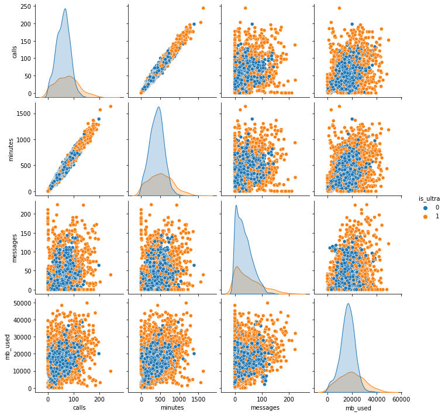

## Импорт библиотек, загрузка данных и общий просмотр


```python
import pandas as pd
import matplotlib.pyplot as plt 
import seaborn as sns
from scipy import stats as st
import numpy as np
import warnings
warnings.simplefilter("ignore")
import math

from sklearn.tree import DecisionTreeClassifier
from sklearn.ensemble import RandomForestClassifier
from sklearn.linear_model import LogisticRegression

from sklearn.model_selection import train_test_split
from sklearn.metrics import accuracy_score
```


```python
# просмотр, где находится каталог с файлами на COLAB
from google.colab import drive
drive.mount('/content/drive')
```

    Drive already mounted at /content/drive; to attempt to forcibly remount, call drive.mount("/content/drive", force_remount=True).
    


```python
# получить доступ к каталогу и уточнить названия папок
import os
os.listdir('/content/drive/My Drive/Colab Notebooks/Яндекс/Проект 5 Предложить пользователям новый тариф: «Смарт» или «Ультра»')
```


    ['users_behavior.csv', 'Предложить тариф.ipynb', 'GitHub']


```python
# присвоить переменной путь к файлу в каталоге
path = "/content/drive/My Drive/Colab Notebooks/Яндекс/Проект 5 Предложить пользователям новый тариф: «Смарт» или «Ультра»/users_behavior.csv"
```


```python
# считать данные csv и присвоить им имя
df = pd.read_csv(path)
```


```python
# просмотр типов данных и кол-ва ненулевых значений
df.info()
```

    <class 'pandas.core.frame.DataFrame'>
    RangeIndex: 3214 entries, 0 to 3213
    Data columns (total 5 columns):
     #   Column    Non-Null Count  Dtype  
    ---  ------    --------------  -----  
     0   calls     3214 non-null   float64
     1   minutes   3214 non-null   float64
     2   messages  3214 non-null   float64
     3   mb_used   3214 non-null   float64
     4   is_ultra  3214 non-null   int64  
    dtypes: float64(4), int64(1)
    memory usage: 125.7 KB
    


```python
df
```


  <div id="df-7a7febbe-ee23-41e1-8143-6e718b138849">
    <div class="colab-df-container">
      <div>
<style scoped>
    .dataframe tbody tr th:only-of-type {
        vertical-align: middle;
    }

    .dataframe tbody tr th {
        vertical-align: top;
    }

    .dataframe thead th {
        text-align: right;
    }
</style>
<table border="1" class="dataframe">
  <thead>
    <tr style="text-align: right;">
      <th></th>
      <th>calls</th>
      <th>minutes</th>
      <th>messages</th>
      <th>mb_used</th>
      <th>is_ultra</th>
    </tr>
  </thead>
  <tbody>
    <tr>
      <th>0</th>
      <td>40.0</td>
      <td>311.90</td>
      <td>83.0</td>
      <td>19915.42</td>
      <td>0</td>
    </tr>
    <tr>
      <th>1</th>
      <td>85.0</td>
      <td>516.75</td>
      <td>56.0</td>
      <td>22696.96</td>
      <td>0</td>
    </tr>
    <tr>
      <th>2</th>
      <td>77.0</td>
      <td>467.66</td>
      <td>86.0</td>
      <td>21060.45</td>
      <td>0</td>
    </tr>
    <tr>
      <th>3</th>
      <td>106.0</td>
      <td>745.53</td>
      <td>81.0</td>
      <td>8437.39</td>
      <td>1</td>
    </tr>
    <tr>
      <th>4</th>
      <td>66.0</td>
      <td>418.74</td>
      <td>1.0</td>
      <td>14502.75</td>
      <td>0</td>
    </tr>
    <tr>
      <th>...</th>
      <td>...</td>
      <td>...</td>
      <td>...</td>
      <td>...</td>
      <td>...</td>
    </tr>
    <tr>
      <th>3209</th>
      <td>122.0</td>
      <td>910.98</td>
      <td>20.0</td>
      <td>35124.90</td>
      <td>1</td>
    </tr>
    <tr>
      <th>3210</th>
      <td>25.0</td>
      <td>190.36</td>
      <td>0.0</td>
      <td>3275.61</td>
      <td>0</td>
    </tr>
    <tr>
      <th>3211</th>
      <td>97.0</td>
      <td>634.44</td>
      <td>70.0</td>
      <td>13974.06</td>
      <td>0</td>
    </tr>
    <tr>
      <th>3212</th>
      <td>64.0</td>
      <td>462.32</td>
      <td>90.0</td>
      <td>31239.78</td>
      <td>0</td>
    </tr>
    <tr>
      <th>3213</th>
      <td>80.0</td>
      <td>566.09</td>
      <td>6.0</td>
      <td>29480.52</td>
      <td>1</td>
    </tr>
  </tbody>
</table>
<p>3214 rows × 5 columns</p>
</div>
      <button class="colab-df-convert" onclick="convertToInteractive('df-7a7febbe-ee23-41e1-8143-6e718b138849')"
              title="Convert this dataframe to an interactive table."
              style="display:none;">

  <svg xmlns="http://www.w3.org/2000/svg" height="24px"viewBox="0 0 24 24"
       width="24px">
    <path d="M0 0h24v24H0V0z" fill="none"/>
    <path d="M18.56 5.44l.94 2.06.94-2.06 2.06-.94-2.06-.94-.94-2.06-.94 2.06-2.06.94zm-11 1L8.5 8.5l.94-2.06 2.06-.94-2.06-.94L8.5 2.5l-.94 2.06-2.06.94zm10 10l.94 2.06.94-2.06 2.06-.94-2.06-.94-.94-2.06-.94 2.06-2.06.94z"/><path d="M17.41 7.96l-1.37-1.37c-.4-.4-.92-.59-1.43-.59-.52 0-1.04.2-1.43.59L10.3 9.45l-7.72 7.72c-.78.78-.78 2.05 0 2.83L4 21.41c.39.39.9.59 1.41.59.51 0 1.02-.2 1.41-.59l7.78-7.78 2.81-2.81c.8-.78.8-2.07 0-2.86zM5.41 20L4 18.59l7.72-7.72 1.47 1.35L5.41 20z"/>
  </svg>
      </button>

  <style>
    .colab-df-container {
      display:flex;
      flex-wrap:wrap;
      gap: 12px;
    }

    .colab-df-convert {
      background-color: #E8F0FE;
      border: none;
      border-radius: 50%;
      cursor: pointer;
      display: none;
      fill: #1967D2;
      height: 32px;
      padding: 0 0 0 0;
      width: 32px;
    }

    .colab-df-convert:hover {
      background-color: #E2EBFA;
      box-shadow: 0px 1px 2px rgba(60, 64, 67, 0.3), 0px 1px 3px 1px rgba(60, 64, 67, 0.15);
      fill: #174EA6;
    }

    [theme=dark] .colab-df-convert {
      background-color: #3B4455;
      fill: #D2E3FC;
    }

    [theme=dark] .colab-df-convert:hover {
      background-color: #434B5C;
      box-shadow: 0px 1px 3px 1px rgba(0, 0, 0, 0.15);
      filter: drop-shadow(0px 1px 2px rgba(0, 0, 0, 0.3));
      fill: #FFFFFF;
    }
  </style>

      <script>
        const buttonEl =
          document.querySelector('#df-7a7febbe-ee23-41e1-8143-6e718b138849 button.colab-df-convert');
        buttonEl.style.display =
          google.colab.kernel.accessAllowed ? 'block' : 'none';

        async function convertToInteractive(key) {
          const element = document.querySelector('#df-7a7febbe-ee23-41e1-8143-6e718b138849');
          const dataTable =
            await google.colab.kernel.invokeFunction('convertToInteractive',
                                                     [key], {});
          if (!dataTable) return;

          const docLinkHtml = 'Like what you see? Visit the ' +
            '<a target="_blank" href=https://colab.research.google.com/notebooks/data_table.ipynb>data table notebook</a>'
            + ' to learn more about interactive tables.';
          element.innerHTML = '';
          dataTable['output_type'] = 'display_data';
          await google.colab.output.renderOutput(dataTable, element);
          const docLink = document.createElement('div');
          docLink.innerHTML = docLinkHtml;
          element.appendChild(docLink);
        }
      </script>
    </div>
  </div>


```python
# изучение корреляции в данных
sns.pairplot(df, hue="is_ultra");
```


    

    


### Подготовка данных к исследованию


```python
features = df.drop(['is_ultra'], axis=1)
target = df['is_ultra']
```


```python
features_train, features_valid_test, target_train, target_valid_test = train_test_split(
    features, target, test_size=0.4, random_state=12345)
```


```python
features_train.shape
```


    (1928, 4)


```python
features_valid_test.shape
```


    (1286, 4)


```python
target_train.shape
```


    (1928,)


```python
target_valid_test.shape
```


    (1286,)


```python
features_valid, features_test, target_valid, target_test = train_test_split(
    features_valid_test, target_valid_test, test_size=0.5, random_state=12345)
```


```python
features_valid.shape
```


    (643, 4)


```python
target_valid.shape
```


    (643,)


```python
features_test.shape
```


    (643, 4)


```python
target_test.shape
```


    (643,)


### Решающее дерево - DecisionTreeClassifier


```python
best_model_DecisionTreeClassifier = None
best_result = 0
for depth in range(1, 6):
	model = DecisionTreeClassifier(random_state=12345, max_depth=depth)
	model.fit(features_train, target_train)
	predictions_valid = model.predict(features_valid)
	result = accuracy_score(target_valid, predictions_valid)
	if result > best_result:
		best_model_DecisionTreeClassifier = model
		best_result = result
        
print("Accuracy лучшей модели на валидационной выборке:", round(best_result, 3))
```

    Accuracy лучшей модели на валидационной выборке: 0.785
    


```python
best_model_DecisionTreeClassifier
```


    DecisionTreeClassifier(max_depth=3, random_state=12345)


### Решающий лес - RandomForestClassifier


```python
best_model_RandomForestClassifier = None
best_result = 0
for est in range(1, 11):
  for depth in range(1, 6):
    model = RandomForestClassifier(random_state=12345, n_estimators=est, max_depth=depth)
    model.fit(features_train, target_train) 
    result = model.score(features_valid, target_valid) 
    if result > best_result:
        best_model_RandomForestClassifier = model
        best_result = result 

print("Accuracy наилучшей модели на валидационной выборке:", round(best_result, 3))
```

    Accuracy наилучшей модели на валидационной выборке: 0.793
    


```python
best_model_RandomForestClassifier
```


    RandomForestClassifier(max_depth=5, n_estimators=8, random_state=12345)


### Логистическая регрессия - LogisticRegression


```python
list_solver = ['saga', 'lbfgs', 'liblinear', 'sag', 'newton-cg']
best_model_LogisticRegression = None
best_result = 0
for sol in list_solver:
  model = LogisticRegression(random_state=12345, solver=sol, max_iter=1000)
  model.fit(features_train, target_train)
  valid_predictions = model.predict(features_valid)
  result = accuracy_score(target_valid, valid_predictions)
  if best_result < result:
    best_result = result
    best_model_LogisticRegression = model
```


```python
print("Accuracy наилучшей модели на валидационной выборке:", round(best_result, 3))
```

    Accuracy наилучшей модели на валидационной выборке: 0.759
    


```python
best_model_LogisticRegression
```


    LogisticRegression(max_iter=1000, random_state=12345, solver='liblinear')


### Проверка качества модели на тестовой выборке


```python
list_model = [best_model_DecisionTreeClassifier, best_model_RandomForestClassifier, best_model_LogisticRegression]
```


```python
list_model
```


    [DecisionTreeClassifier(max_depth=3, random_state=12345),
     RandomForestClassifier(max_depth=5, n_estimators=8, random_state=12345),
     LogisticRegression(max_iter=1000, random_state=12345, solver='liblinear')]


```python
best_model = None
best_result = 0
for mod in list_model:
  test_predictions = mod.predict(features_test)
  result = accuracy_score(target_test, test_predictions)
  if best_result < result:
    best_result = result
    best_model = mod

print("Лучшая модель:", best_model)
print("Accuracy наилучшей модели на тестовой выборке:", round(best_result, 3))
```

    Лучшая модель: RandomForestClassifier(max_depth=5, n_estimators=8, random_state=12345)
    Accuracy наилучшей модели на тестовой выборке: 0.796
    

## Вывод

**В результате моделирования, установлено:**
1. Accuracy модели DecisionTreeClassifier(max_depth=3, random_state=12345) на валидационной выборке: 0.785
2. Accuracy модели RandomForestClassifier(max_depth=5, n_estimators=8, random_state=12345) на валидационной выборке: 0.793
3. Accuracy модели LogisticRegression(max_iter=1000, random_state=12345, solver='liblinear') на валидационной выборке: 0.759
4. Лучшая модель: RandomForestClassifier(max_depth=5, n_estimators=8, random_state=12345). Accuracy наилучшей модели на тестовой выборке: 0.796
