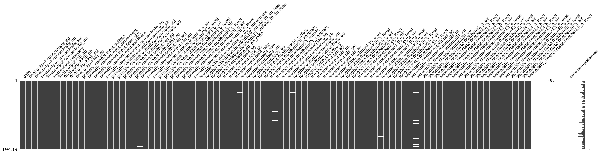
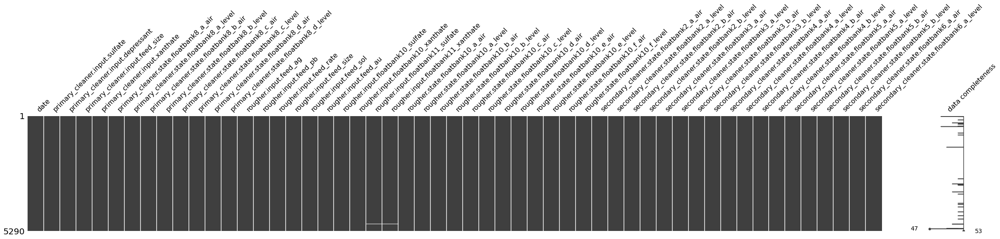
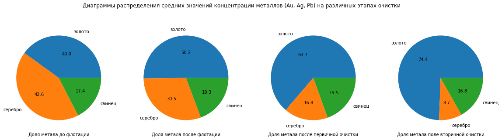
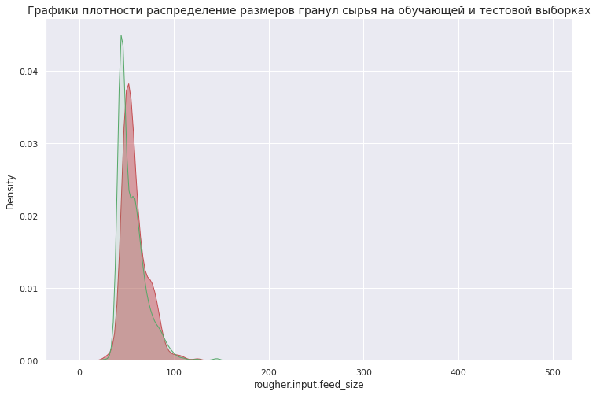
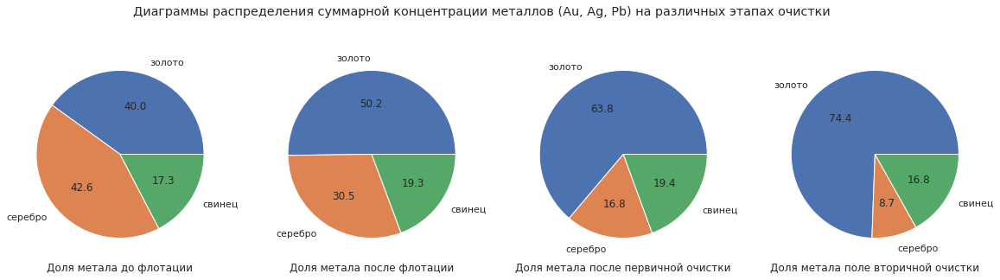

## Загрузка и подготовка данных


```python
# импорт библиотек
!pip install missingno
import missingno as msno
import pandas as pd
import numpy as np
import warnings
warnings.simplefilter("ignore")
import math
from statistics import mean

from sklearn.model_selection import train_test_split
from sklearn.preprocessing import StandardScaler
from sklearn.linear_model import LinearRegression
from sklearn.tree import DecisionTreeRegressor
from sklearn.ensemble import RandomForestRegressor


from sklearn.metrics import mean_absolute_error
from sklearn.model_selection import cross_val_score

import seaborn as sns
import matplotlib.pyplot as plt
from numpy.core.fromnumeric import size
%matplotlib inline
```

    Looking in indexes: https://pypi.org/simple, https://us-python.pkg.dev/colab-wheels/public/simple/
    Requirement already satisfied: missingno in /usr/local/lib/python3.7/dist-packages (0.5.1)
    Requirement already satisfied: seaborn in /usr/local/lib/python3.7/dist-packages (from missingno) (0.11.2)
    Requirement already satisfied: matplotlib in /usr/local/lib/python3.7/dist-packages (from missingno) (3.2.2)
    Requirement already satisfied: numpy in /usr/local/lib/python3.7/dist-packages (from missingno) (1.21.6)
    Requirement already satisfied: scipy in /usr/local/lib/python3.7/dist-packages (from missingno) (1.4.1)
    Requirement already satisfied: kiwisolver>=1.0.1 in /usr/local/lib/python3.7/dist-packages (from matplotlib->missingno) (1.4.2)
    Requirement already satisfied: pyparsing!=2.0.4,!=2.1.2,!=2.1.6,>=2.0.1 in /usr/local/lib/python3.7/dist-packages (from matplotlib->missingno) (3.0.9)
    Requirement already satisfied: python-dateutil>=2.1 in /usr/local/lib/python3.7/dist-packages (from matplotlib->missingno) (2.8.2)
    Requirement already satisfied: cycler>=0.10 in /usr/local/lib/python3.7/dist-packages (from matplotlib->missingno) (0.11.0)
    Requirement already satisfied: typing-extensions in /usr/local/lib/python3.7/dist-packages (from kiwisolver>=1.0.1->matplotlib->missingno) (4.2.0)
    Requirement already satisfied: six>=1.5 in /usr/local/lib/python3.7/dist-packages (from python-dateutil>=2.1->matplotlib->missingno) (1.15.0)
    Requirement already satisfied: pandas>=0.23 in /usr/local/lib/python3.7/dist-packages (from seaborn->missingno) (1.3.5)
    Requirement already satisfied: pytz>=2017.3 in /usr/local/lib/python3.7/dist-packages (from pandas>=0.23->seaborn->missingno) (2022.1)
    


```python
# просмотр, где находится каталог с файлами на COLAB
from google.colab import drive
drive.mount('/content/drive')
```

    Mounted at /content/drive
    


```python
# получение доступа к каталогу и уточнение названия папок
import os
os.listdir('/content/drive/My Drive/Colab Notebooks/Яндекс/Сборный проект 2')
```


    ['gold_recovery_train_new.csv',
     'gold_recovery_test_new.csv',
     'gold_recovery_full_new.csv',
     'Коэффициент восстановления золота.ipynb',
     'ПРАВКА',
     'GitHub']


```python
# присвоить переменной путь к файлу в каталоге
path_0 = "/content/drive/My Drive/Colab Notebooks/Яндекс/Сборный проект 2/gold_recovery_full_new.csv"
```


```python
# присвоить переменной путь к файлу в каталоге
path_1 = "/content/drive/My Drive/Colab Notebooks/Яндекс/Сборный проект 2/gold_recovery_train_new.csv"
```


```python
# присвоить переменной путь к файлу в каталоге
path_2 = "/content/drive/My Drive/Colab Notebooks/Яндекс/Сборный проект 2/gold_recovery_test_new.csv"
```


```python
# считать данные csv и присвоить им имя
data_0 = pd.read_csv(path_0)
data_1 = pd.read_csv(path_1)
data_2 = pd.read_csv(path_2)
```


```python
data_0.info()
```

    <class 'pandas.core.frame.DataFrame'>
    RangeIndex: 19439 entries, 0 to 19438
    Data columns (total 87 columns):
     #   Column                                              Non-Null Count  Dtype  
    ---  ------                                              --------------  -----  
     0   date                                                19439 non-null  object 
     1   final.output.concentrate_ag                         19438 non-null  float64
     2   final.output.concentrate_pb                         19438 non-null  float64
     3   final.output.concentrate_sol                        19228 non-null  float64
     4   final.output.concentrate_au                         19439 non-null  float64
     5   final.output.recovery                               19439 non-null  float64
     6   final.output.tail_ag                                19438 non-null  float64
     7   final.output.tail_pb                                19338 non-null  float64
     8   final.output.tail_sol                               19433 non-null  float64
     9   final.output.tail_au                                19439 non-null  float64
     10  primary_cleaner.input.sulfate                       19415 non-null  float64
     11  primary_cleaner.input.depressant                    19402 non-null  float64
     12  primary_cleaner.input.feed_size                     19439 non-null  float64
     13  primary_cleaner.input.xanthate                      19335 non-null  float64
     14  primary_cleaner.output.concentrate_ag               19439 non-null  float64
     15  primary_cleaner.output.concentrate_pb               19323 non-null  float64
     16  primary_cleaner.output.concentrate_sol              19069 non-null  float64
     17  primary_cleaner.output.concentrate_au               19439 non-null  float64
     18  primary_cleaner.output.tail_ag                      19435 non-null  float64
     19  primary_cleaner.output.tail_pb                      19418 non-null  float64
     20  primary_cleaner.output.tail_sol                     19377 non-null  float64
     21  primary_cleaner.output.tail_au                      19439 non-null  float64
     22  primary_cleaner.state.floatbank8_a_air              19435 non-null  float64
     23  primary_cleaner.state.floatbank8_a_level            19438 non-null  float64
     24  primary_cleaner.state.floatbank8_b_air              19435 non-null  float64
     25  primary_cleaner.state.floatbank8_b_level            19438 non-null  float64
     26  primary_cleaner.state.floatbank8_c_air              19437 non-null  float64
     27  primary_cleaner.state.floatbank8_c_level            19438 non-null  float64
     28  primary_cleaner.state.floatbank8_d_air              19436 non-null  float64
     29  primary_cleaner.state.floatbank8_d_level            19438 non-null  float64
     30  rougher.calculation.sulfate_to_au_concentrate       19437 non-null  float64
     31  rougher.calculation.floatbank10_sulfate_to_au_feed  19437 non-null  float64
     32  rougher.calculation.floatbank11_sulfate_to_au_feed  19437 non-null  float64
     33  rougher.calculation.au_pb_ratio                     19439 non-null  float64
     34  rougher.input.feed_ag                               19439 non-null  float64
     35  rougher.input.feed_pb                               19339 non-null  float64
     36  rougher.input.feed_rate                             19428 non-null  float64
     37  rougher.input.feed_size                             19294 non-null  float64
     38  rougher.input.feed_sol                              19340 non-null  float64
     39  rougher.input.feed_au                               19439 non-null  float64
     40  rougher.input.floatbank10_sulfate                   19405 non-null  float64
     41  rougher.input.floatbank10_xanthate                  19431 non-null  float64
     42  rougher.input.floatbank11_sulfate                   19395 non-null  float64
     43  rougher.input.floatbank11_xanthate                  18986 non-null  float64
     44  rougher.output.concentrate_ag                       19439 non-null  float64
     45  rougher.output.concentrate_pb                       19439 non-null  float64
     46  rougher.output.concentrate_sol                      19416 non-null  float64
     47  rougher.output.concentrate_au                       19439 non-null  float64
     48  rougher.output.recovery                             19439 non-null  float64
     49  rougher.output.tail_ag                              19438 non-null  float64
     50  rougher.output.tail_pb                              19439 non-null  float64
     51  rougher.output.tail_sol                             19439 non-null  float64
     52  rougher.output.tail_au                              19439 non-null  float64
     53  rougher.state.floatbank10_a_air                     19438 non-null  float64
     54  rougher.state.floatbank10_a_level                   19438 non-null  float64
     55  rougher.state.floatbank10_b_air                     19438 non-null  float64
     56  rougher.state.floatbank10_b_level                   19438 non-null  float64
     57  rougher.state.floatbank10_c_air                     19438 non-null  float64
     58  rougher.state.floatbank10_c_level                   19438 non-null  float64
     59  rougher.state.floatbank10_d_air                     19439 non-null  float64
     60  rougher.state.floatbank10_d_level                   19439 non-null  float64
     61  rougher.state.floatbank10_e_air                     19003 non-null  float64
     62  rougher.state.floatbank10_e_level                   19439 non-null  float64
     63  rougher.state.floatbank10_f_air                     19439 non-null  float64
     64  rougher.state.floatbank10_f_level                   19439 non-null  float64
     65  secondary_cleaner.output.tail_ag                    19437 non-null  float64
     66  secondary_cleaner.output.tail_pb                    19427 non-null  float64
     67  secondary_cleaner.output.tail_sol                   17691 non-null  float64
     68  secondary_cleaner.output.tail_au                    19439 non-null  float64
     69  secondary_cleaner.state.floatbank2_a_air            19219 non-null  float64
     70  secondary_cleaner.state.floatbank2_a_level          19438 non-null  float64
     71  secondary_cleaner.state.floatbank2_b_air            19416 non-null  float64
     72  secondary_cleaner.state.floatbank2_b_level          19438 non-null  float64
     73  secondary_cleaner.state.floatbank3_a_air            19426 non-null  float64
     74  secondary_cleaner.state.floatbank3_a_level          19438 non-null  float64
     75  secondary_cleaner.state.floatbank3_b_air            19438 non-null  float64
     76  secondary_cleaner.state.floatbank3_b_level          19438 non-null  float64
     77  secondary_cleaner.state.floatbank4_a_air            19433 non-null  float64
     78  secondary_cleaner.state.floatbank4_a_level          19438 non-null  float64
     79  secondary_cleaner.state.floatbank4_b_air            19438 non-null  float64
     80  secondary_cleaner.state.floatbank4_b_level          19438 non-null  float64
     81  secondary_cleaner.state.floatbank5_a_air            19438 non-null  float64
     82  secondary_cleaner.state.floatbank5_a_level          19438 non-null  float64
     83  secondary_cleaner.state.floatbank5_b_air            19438 non-null  float64
     84  secondary_cleaner.state.floatbank5_b_level          19438 non-null  float64
     85  secondary_cleaner.state.floatbank6_a_air            19437 non-null  float64
     86  secondary_cleaner.state.floatbank6_a_level          19438 non-null  float64
    dtypes: float64(86), object(1)
    memory usage: 12.9+ MB
    


```python
data_0.isna().mean().sum()*100
```


    23.051597304388082


```python
data_1.info()
```

    <class 'pandas.core.frame.DataFrame'>
    RangeIndex: 14149 entries, 0 to 14148
    Data columns (total 87 columns):
     #   Column                                              Non-Null Count  Dtype  
    ---  ------                                              --------------  -----  
     0   date                                                14149 non-null  object 
     1   final.output.concentrate_ag                         14148 non-null  float64
     2   final.output.concentrate_pb                         14148 non-null  float64
     3   final.output.concentrate_sol                        13938 non-null  float64
     4   final.output.concentrate_au                         14149 non-null  float64
     5   final.output.recovery                               14149 non-null  float64
     6   final.output.tail_ag                                14149 non-null  float64
     7   final.output.tail_pb                                14049 non-null  float64
     8   final.output.tail_sol                               14144 non-null  float64
     9   final.output.tail_au                                14149 non-null  float64
     10  primary_cleaner.input.sulfate                       14129 non-null  float64
     11  primary_cleaner.input.depressant                    14117 non-null  float64
     12  primary_cleaner.input.feed_size                     14149 non-null  float64
     13  primary_cleaner.input.xanthate                      14049 non-null  float64
     14  primary_cleaner.output.concentrate_ag               14149 non-null  float64
     15  primary_cleaner.output.concentrate_pb               14063 non-null  float64
     16  primary_cleaner.output.concentrate_sol              13863 non-null  float64
     17  primary_cleaner.output.concentrate_au               14149 non-null  float64
     18  primary_cleaner.output.tail_ag                      14148 non-null  float64
     19  primary_cleaner.output.tail_pb                      14134 non-null  float64
     20  primary_cleaner.output.tail_sol                     14103 non-null  float64
     21  primary_cleaner.output.tail_au                      14149 non-null  float64
     22  primary_cleaner.state.floatbank8_a_air              14145 non-null  float64
     23  primary_cleaner.state.floatbank8_a_level            14148 non-null  float64
     24  primary_cleaner.state.floatbank8_b_air              14145 non-null  float64
     25  primary_cleaner.state.floatbank8_b_level            14148 non-null  float64
     26  primary_cleaner.state.floatbank8_c_air              14147 non-null  float64
     27  primary_cleaner.state.floatbank8_c_level            14148 non-null  float64
     28  primary_cleaner.state.floatbank8_d_air              14146 non-null  float64
     29  primary_cleaner.state.floatbank8_d_level            14148 non-null  float64
     30  rougher.calculation.sulfate_to_au_concentrate       14148 non-null  float64
     31  rougher.calculation.floatbank10_sulfate_to_au_feed  14148 non-null  float64
     32  rougher.calculation.floatbank11_sulfate_to_au_feed  14148 non-null  float64
     33  rougher.calculation.au_pb_ratio                     14149 non-null  float64
     34  rougher.input.feed_ag                               14149 non-null  float64
     35  rougher.input.feed_pb                               14049 non-null  float64
     36  rougher.input.feed_rate                             14141 non-null  float64
     37  rougher.input.feed_size                             14005 non-null  float64
     38  rougher.input.feed_sol                              14071 non-null  float64
     39  rougher.input.feed_au                               14149 non-null  float64
     40  rougher.input.floatbank10_sulfate                   14120 non-null  float64
     41  rougher.input.floatbank10_xanthate                  14141 non-null  float64
     42  rougher.input.floatbank11_sulfate                   14113 non-null  float64
     43  rougher.input.floatbank11_xanthate                  13721 non-null  float64
     44  rougher.output.concentrate_ag                       14149 non-null  float64
     45  rougher.output.concentrate_pb                       14149 non-null  float64
     46  rougher.output.concentrate_sol                      14127 non-null  float64
     47  rougher.output.concentrate_au                       14149 non-null  float64
     48  rougher.output.recovery                             14149 non-null  float64
     49  rougher.output.tail_ag                              14148 non-null  float64
     50  rougher.output.tail_pb                              14149 non-null  float64
     51  rougher.output.tail_sol                             14149 non-null  float64
     52  rougher.output.tail_au                              14149 non-null  float64
     53  rougher.state.floatbank10_a_air                     14148 non-null  float64
     54  rougher.state.floatbank10_a_level                   14148 non-null  float64
     55  rougher.state.floatbank10_b_air                     14148 non-null  float64
     56  rougher.state.floatbank10_b_level                   14148 non-null  float64
     57  rougher.state.floatbank10_c_air                     14148 non-null  float64
     58  rougher.state.floatbank10_c_level                   14148 non-null  float64
     59  rougher.state.floatbank10_d_air                     14149 non-null  float64
     60  rougher.state.floatbank10_d_level                   14149 non-null  float64
     61  rougher.state.floatbank10_e_air                     13713 non-null  float64
     62  rougher.state.floatbank10_e_level                   14149 non-null  float64
     63  rougher.state.floatbank10_f_air                     14149 non-null  float64
     64  rougher.state.floatbank10_f_level                   14149 non-null  float64
     65  secondary_cleaner.output.tail_ag                    14147 non-null  float64
     66  secondary_cleaner.output.tail_pb                    14139 non-null  float64
     67  secondary_cleaner.output.tail_sol                   12544 non-null  float64
     68  secondary_cleaner.output.tail_au                    14149 non-null  float64
     69  secondary_cleaner.state.floatbank2_a_air            13932 non-null  float64
     70  secondary_cleaner.state.floatbank2_a_level          14148 non-null  float64
     71  secondary_cleaner.state.floatbank2_b_air            14128 non-null  float64
     72  secondary_cleaner.state.floatbank2_b_level          14148 non-null  float64
     73  secondary_cleaner.state.floatbank3_a_air            14145 non-null  float64
     74  secondary_cleaner.state.floatbank3_a_level          14148 non-null  float64
     75  secondary_cleaner.state.floatbank3_b_air            14148 non-null  float64
     76  secondary_cleaner.state.floatbank3_b_level          14148 non-null  float64
     77  secondary_cleaner.state.floatbank4_a_air            14143 non-null  float64
     78  secondary_cleaner.state.floatbank4_a_level          14148 non-null  float64
     79  secondary_cleaner.state.floatbank4_b_air            14148 non-null  float64
     80  secondary_cleaner.state.floatbank4_b_level          14148 non-null  float64
     81  secondary_cleaner.state.floatbank5_a_air            14148 non-null  float64
     82  secondary_cleaner.state.floatbank5_a_level          14148 non-null  float64
     83  secondary_cleaner.state.floatbank5_b_air            14148 non-null  float64
     84  secondary_cleaner.state.floatbank5_b_level          14148 non-null  float64
     85  secondary_cleaner.state.floatbank6_a_air            14147 non-null  float64
     86  secondary_cleaner.state.floatbank6_a_level          14148 non-null  float64
    dtypes: float64(86), object(1)
    memory usage: 9.4+ MB
    


```python
data_1.isna().mean().sum()*100
```


    28.97731288430278


```python
data_2.info()
```

    <class 'pandas.core.frame.DataFrame'>
    RangeIndex: 5290 entries, 0 to 5289
    Data columns (total 53 columns):
     #   Column                                      Non-Null Count  Dtype  
    ---  ------                                      --------------  -----  
     0   date                                        5290 non-null   object 
     1   primary_cleaner.input.sulfate               5286 non-null   float64
     2   primary_cleaner.input.depressant            5285 non-null   float64
     3   primary_cleaner.input.feed_size             5290 non-null   float64
     4   primary_cleaner.input.xanthate              5286 non-null   float64
     5   primary_cleaner.state.floatbank8_a_air      5290 non-null   float64
     6   primary_cleaner.state.floatbank8_a_level    5290 non-null   float64
     7   primary_cleaner.state.floatbank8_b_air      5290 non-null   float64
     8   primary_cleaner.state.floatbank8_b_level    5290 non-null   float64
     9   primary_cleaner.state.floatbank8_c_air      5290 non-null   float64
     10  primary_cleaner.state.floatbank8_c_level    5290 non-null   float64
     11  primary_cleaner.state.floatbank8_d_air      5290 non-null   float64
     12  primary_cleaner.state.floatbank8_d_level    5290 non-null   float64
     13  rougher.input.feed_ag                       5290 non-null   float64
     14  rougher.input.feed_pb                       5290 non-null   float64
     15  rougher.input.feed_rate                     5287 non-null   float64
     16  rougher.input.feed_size                     5289 non-null   float64
     17  rougher.input.feed_sol                      5269 non-null   float64
     18  rougher.input.feed_au                       5290 non-null   float64
     19  rougher.input.floatbank10_sulfate           5285 non-null   float64
     20  rougher.input.floatbank10_xanthate          5290 non-null   float64
     21  rougher.input.floatbank11_sulfate           5282 non-null   float64
     22  rougher.input.floatbank11_xanthate          5265 non-null   float64
     23  rougher.state.floatbank10_a_air             5290 non-null   float64
     24  rougher.state.floatbank10_a_level           5290 non-null   float64
     25  rougher.state.floatbank10_b_air             5290 non-null   float64
     26  rougher.state.floatbank10_b_level           5290 non-null   float64
     27  rougher.state.floatbank10_c_air             5290 non-null   float64
     28  rougher.state.floatbank10_c_level           5290 non-null   float64
     29  rougher.state.floatbank10_d_air             5290 non-null   float64
     30  rougher.state.floatbank10_d_level           5290 non-null   float64
     31  rougher.state.floatbank10_e_air             5290 non-null   float64
     32  rougher.state.floatbank10_e_level           5290 non-null   float64
     33  rougher.state.floatbank10_f_air             5290 non-null   float64
     34  rougher.state.floatbank10_f_level           5290 non-null   float64
     35  secondary_cleaner.state.floatbank2_a_air    5287 non-null   float64
     36  secondary_cleaner.state.floatbank2_a_level  5290 non-null   float64
     37  secondary_cleaner.state.floatbank2_b_air    5288 non-null   float64
     38  secondary_cleaner.state.floatbank2_b_level  5290 non-null   float64
     39  secondary_cleaner.state.floatbank3_a_air    5281 non-null   float64
     40  secondary_cleaner.state.floatbank3_a_level  5290 non-null   float64
     41  secondary_cleaner.state.floatbank3_b_air    5290 non-null   float64
     42  secondary_cleaner.state.floatbank3_b_level  5290 non-null   float64
     43  secondary_cleaner.state.floatbank4_a_air    5290 non-null   float64
     44  secondary_cleaner.state.floatbank4_a_level  5290 non-null   float64
     45  secondary_cleaner.state.floatbank4_b_air    5290 non-null   float64
     46  secondary_cleaner.state.floatbank4_b_level  5290 non-null   float64
     47  secondary_cleaner.state.floatbank5_a_air    5290 non-null   float64
     48  secondary_cleaner.state.floatbank5_a_level  5290 non-null   float64
     49  secondary_cleaner.state.floatbank5_b_air    5290 non-null   float64
     50  secondary_cleaner.state.floatbank5_b_level  5290 non-null   float64
     51  secondary_cleaner.state.floatbank6_a_air    5290 non-null   float64
     52  secondary_cleaner.state.floatbank6_a_level  5290 non-null   float64
    dtypes: float64(52), object(1)
    memory usage: 2.1+ MB
    


```python
data_2.isna().mean().sum()*100
```


    1.7013232514177696


```python
# подсчет доли дубликатов
print(data_0.duplicated().sum() / len(data_0) * 100)
print(data_1.duplicated().sum() / len(data_1) * 100)
print(data_2.duplicated().sum() / len(data_2) * 100)
```

    0.0
    0.0
    0.0
    

**Наименование столбцов (признаков) исходного датафрейма (full) в части столбцов входящих в тренировочный датасет**
1. date - год, месяц, день и часы, минуты, секунды
_______________________________________________________________________________
2. primary_cleaner.input.sulfate - первичная очистка сырья сульфатами
3. primary_cleaner.input.depressant - первичная очистка сырья силикатом натрия
4. primary_cleaner.input.xanthate - первичная очистка сырья ксантогенатом
5. primary_cleaner.input.feed_size - размер гранул сырья при первичной очистке
_______________________________________________________________________________
6. primary_cleaner.state.floatbank8_a_air - объём воздуха в флотационной установке 8 "a" при первичной очистке
7. primary_cleaner.state.floatbank8_a_level - уровень жидкости в флотационной установке 8 "a" при первичной очистке
8. primary_cleaner.state.floatbank8_b_air - объём воздуха в флотационной установке 8 "b" при первичной очистке
9. primary_cleaner.state.floatbank8_b_level - уровень жидкости в флотационной установке 8 "b" при первичной очистке
10. primary_cleaner.state.floatbank8_c_air - объём воздуха в флотационной установке 8 "c" при первичной очистке
11. primary_cleaner.state.floatbank8_c_level - уровень жидкости в флотационной установке 8 "c" при первичной очистке
12. primary_cleaner.state.floatbank8_d_air - объём воздуха в флотационной установке 8 "d" при первичной очистке
13. primary_cleaner.state.floatbank8_d_level - уровень жидкости в флотационной установке 8 "d" при первичной очистке
_______________________________________________________________________________
14. rougher.input.feed_ag - доля серебра в сырье до флотации
15. rougher.input.feed_pb - доля свинца в сырье до флотации
16. rougher.input.feed_rate - скорость подачи сырья при флотация
17. rougher.input.feed_size - размер гранул сырья при флотация
18. rougher.input.feed_sol - доля солей в сырье до флотации
19. rougher.input.feed_au - доля золота в сырье до флотации _______________________________________________________________________________
20. rougher.input.floatbank10_sulfate - сульфид натрия в флотационной установке 10
21. rougher.input.floatbank10_xanthate - ксантогенат в флотационной установке 10
22. rougher.input.floatbank11_sulfate - сульфид натрия в флотационной установке 11
23. rougher.input.floatbank11_xanthate - ксантогенат в флотационной установке 11
_______________________________________________________________________________
24. rougher.state.floatbank10_a_air - объём воздуха в флотационной установке 10 "a" при первичной очистке
25. rougher.state.floatbank10_a_level - уровень жидкости в флотационной установке 10 "a" при первичной очистке
26. rougher.state.floatbank10_b_air - объём воздуха в флотационной установке 10 "b" при флотации
27. rougher.state.floatbank10_b_level - уровень жидкости в флотационной установке 10 "b" при флотации
28. rougher.state.floatbank10_c_air - объём воздуха в флотационной установке 10 "c" при флотации
29. rougher.state.floatbank10_c_level - уровень жидкости в флотационной установке 10 "c" при флотации
30. rougher.state.floatbank10_d_air - объём воздуха в флотационной установке 10 "d" при флотации
31. rougher.state.floatbank10_d_level - уровень жидкости в флотационной установке 10 "d" при флотации
32. rougher.state.floatbank10_e_air - объём воздуха в флотационной установке 10 "e" при флотации
33. rougher.state.floatbank10_e_level - уровень жидкости в флотационной установке 10 "e" при флотации
34. rougher.state.floatbank10_f_air - объём воздуха в флотационной установке 10 "f" при флотации
35. rougher.state.floatbank10_f_level - уровень жидкости в флотационной установке 10 "f" при флотации
_______________________________________________________________________________
36. secondary_cleaner.state.floatbank2_a_air - объём воздуха в флотационной установке 2 "a" при вторичной очистке
37. secondary_cleaner.state.floatbank2_a_level - уровень жидкости в флотационной установке 2 "a" при вторичной очистке
38. secondary_cleaner.state.floatbank2_b_air - объём воздуха в флотационной установке 2 "b" при вторичной очистке
39. secondary_cleaner.state.floatbank2_b_level - уровень жидкости в флотационной установке 2 "b" при вторичной очистке
40. secondary_cleaner.state.floatbank3_a_air - объём воздуха в флотационной установке 3 "a" при вторичной очистке
41. secondary_cleaner.state.floatbank3_a_level - уровень жидкости в флотационной установке 3 "a" при вторичной очистке
42. secondary_cleaner.state.floatbank3_b_air - объём воздуха в флотационной установке 3 "b" при вторичной очистке
43. secondary_cleaner.state.floatbank3_b_level - уровень жидкости в флотационной установке 3 "b" при вторичной очистке
44. secondary_cleaner.state.floatbank4_a_air - объём воздуха в флотационной установке 4 "a" при вторичной очистке
45. secondary_cleaner.state.floatbank4_a_level - уровень жидкости в флотационной установке 4 "a" при вторичной очистке
46. secondary_cleaner.state.floatbank4_b_air - объём воздуха в флотационной установке 4 "b" при вторичной очистке
47. secondary_cleaner.state.floatbank4_b_level - уровень жидкости в флотационной установке 4 "b" при вторичной очистке
48. secondary_cleaner.state.floatbank5_a_air - объём воздуха в флотационной установке 5 "a" при вторичной очистке
49. secondary_cleaner.state.floatbank5_a_level - уровень жидкости в флотационной установке 5 "a" при вторичной очистке
50. secondary_cleaner.state.floatbank5_b_air - объём воздуха в флотационной установке 5 "b" при вторичной очистке
51. secondary_cleaner.state.floatbank5_b_level - уровень жидкости в флотационной установке 5 "b" при вторичной очистке
52. secondary_cleaner.state.floatbank6_a_air - объём воздуха в флотационной установке 6 "a" при вторичной очистке
53. secondary_cleaner.state.floatbank6_a_level - уровень жидкости в флотационной установке 6 "a" при вторичной очистке
_______________________________________________________________________________
**Наименование столбцов (признаков) исходного датафрейма (full) в части столбцов не входящих в тренировочный датасет**
1. final.output.concentrate_ag - финальная доля серебра в концентрате
2. final.output.concentrate_pb - финальная доля свинца в концентрате
3. final.output.concentrate_sol - финальная доля солей в концентрате
4. final.output.concentrate_au - финальная доля золота в концентрате
5. final.output.recovery - эффективность обогащения финального концентрата 
6. final.output.tail_ag - финальная доля серебра в хвостах
7. final.output.tail_pb - финальная доля свинца в хвостах
8. final.output.tail_sol - финальная доля солей в хвостах
9. final.output.tail_au - финальная доля золота в хвостах
_______________________________________________________________________________
10. primary_cleaner.output.concentrate_ag - доля серебра в концентрате после первичной очистки
11. primary_cleaner.output.concentrate_pb - доля свинца в концентрате после первичной очистки
12. primary_cleaner.output.concentrate_sol - доля солей в концентрате после первичной очистки
13. primary_cleaner.output.concentrate_au - доля золота в концентрате после первичной очистки
14. primary_cleaner.output.tail_ag - доля серебра в хвостах после первичной очистки
15. primary_cleaner.output.tail_pb - доля свица в хвостах после первичной очистки
16. primary_cleaner.output.tail_sol - доля солей в хвостах после первичной очистки
17. primary_cleaner.output.tail_au - доля золота в хвостах после первичной очистки
_______________________________________________________________________________
18. rougher.calculation.sulfate_to_au_concentrate - расчет сульфида натрия для концентрата золота при флотации
19. rougher.calculation.floatbank10_sulfate_to_au_feed - расчет сульфида натрия для сырья золота в флотационной установке 10
20. rougher.calculation.floatbank11_sulfate_to_au_feed - расчет сульфида натрия для сырья золота в флотационной установке 11
21. rougher.calculation.au_pb_ratio - расчет скорости подачи золота и свинца при флотации
_______________________________________________________________________________
22. rougher.output.concentrate_ag - доля серебра в концентрате после флотации
23. rougher.output.concentrate_pb - доля свинца в концентрате после флотации
24. rougher.output.concentrate_sol - доля солей в концентрате после флотации
25. rougher.output.concentrate_au - доля золота в концентрате после флотации
_______________________________________________________________________________
26. rougher.output.recovery - эффективность обогащения чернового концентрата
27. rougher.output.tail_ag - доля серебра в хвостах  после флотации
28. rougher.output.tail_pb - доля свинца в хвостах  после флотации
29. rougher.output.tail_sol - доля солей в хвостах  после флотации
30. rougher.output.tail_au - доля золота в хвостах  после флотации
_______________________________________________________________________________
31. secondary_cleaner.output.tail_ag - доля серебра в хвостах после вторичной очистки
32. secondary_cleaner.output.tail_pb - доля свинца в хвостах после вторичной очистки
33. secondary_cleaner.output.tail_sol - доля солей в хвостах после вторичной очистки  
34. secondary_cleaner.output.tail_au - доля золота в хвостах после вторичной очистки  

### Вывод

**На этапе предобработки установлено:**
1. Доля пропусков в исходном датафрейме (full) порядка 23% - это очень много.
2. Доля пропусков в тренировочном датафрейме (train) порядка 29% - это очень много.
3. Доля пропусков в тестовом датафрейме (test) порядка 2%
4. Явные дубликаты в данных отсутствуют.

### Проверка верности расчета эффективности обогащения  чернового концентрата


```python
F = data_0["rougher.input.feed_au"] # доля золота в сырье
C = data_0["rougher.output.concentrate_au"] # доля золота в концентрате
T = data_0["rougher.output.tail_au"] # доля золота в хвостах
```

Перед проведением расчетов еще раз убедимся в отсутствии пропусков в столбцах


```python
F.isna().sum()
```


    0


```python
C.isna().sum()

```


    0


```python
T.isna().sum()
```


    0


```python
recovery = (C *(F - T)) / (F *(C - T)) * 100
```


```python
recovery
```


    0        87.107763
    1        86.843261
    2        86.842308
    3        87.226430
    4        86.688794
               ...    
    19434    89.574376
    19435    87.724007
    19436    88.890579
    19437    89.858126
    19438    89.514960
    Length: 19439, dtype: float64


```python
recovery_data_0 = data_0['rougher.output.recovery']
recovery_data_0
```


    0        87.107763
    1        86.843261
    2        86.842308
    3        87.226430
    4        86.688794
               ...    
    19434    89.574376
    19435    87.724007
    19436    88.890579
    19437    89.858126
    19438    89.514960
    Name: rougher.output.recovery, Length: 19439, dtype: float64


```python
print("MAE =",mean_absolute_error(recovery_data_0, recovery))
```

    MAE = 9.874045668302637e-15
    

### Вывод

**Расчет эффективности обогащения чернового концентрата выполнен корректно**


```python
target = data_0[['rougher.output.recovery', 'final.output.recovery']]
```


```python
target.isna().mean().sum()
```


    0.0


```python
target.sort_values(by='rougher.output.recovery', ascending=False)
```


  <div id="df-e7e51a25-8e73-4720-9383-a4a3c1a5ab48">
    <div class="colab-df-container">
      <div>
<style scoped>
    .dataframe tbody tr th:only-of-type {
        vertical-align: middle;
    }

    .dataframe tbody tr th {
        vertical-align: top;
    }

    .dataframe thead th {
        text-align: right;
    }
</style>
<table border="1" class="dataframe">
  <thead>
    <tr style="text-align: right;">
      <th></th>
      <th>rougher.output.recovery</th>
      <th>final.output.recovery</th>
    </tr>
  </thead>
  <tbody>
    <tr>
      <th>16227</th>
      <td>100.0</td>
      <td>100.000000</td>
    </tr>
    <tr>
      <th>16230</th>
      <td>100.0</td>
      <td>100.000000</td>
    </tr>
    <tr>
      <th>16226</th>
      <td>100.0</td>
      <td>100.000000</td>
    </tr>
    <tr>
      <th>16229</th>
      <td>100.0</td>
      <td>100.000000</td>
    </tr>
    <tr>
      <th>16228</th>
      <td>100.0</td>
      <td>100.000000</td>
    </tr>
    <tr>
      <th>...</th>
      <td>...</td>
      <td>...</td>
    </tr>
    <tr>
      <th>15120</th>
      <td>0.0</td>
      <td>57.634579</td>
    </tr>
    <tr>
      <th>4776</th>
      <td>0.0</td>
      <td>37.231322</td>
    </tr>
    <tr>
      <th>4775</th>
      <td>0.0</td>
      <td>54.324899</td>
    </tr>
    <tr>
      <th>4773</th>
      <td>0.0</td>
      <td>54.910086</td>
    </tr>
    <tr>
      <th>15516</th>
      <td>0.0</td>
      <td>76.491169</td>
    </tr>
  </tbody>
</table>
<p>19439 rows × 2 columns</p>
</div>
      <button class="colab-df-convert" onclick="convertToInteractive('df-e7e51a25-8e73-4720-9383-a4a3c1a5ab48')"
              title="Convert this dataframe to an interactive table."
              style="display:none;">

  <svg xmlns="http://www.w3.org/2000/svg" height="24px"viewBox="0 0 24 24"
       width="24px">
    <path d="M0 0h24v24H0V0z" fill="none"/>
    <path d="M18.56 5.44l.94 2.06.94-2.06 2.06-.94-2.06-.94-.94-2.06-.94 2.06-2.06.94zm-11 1L8.5 8.5l.94-2.06 2.06-.94-2.06-.94L8.5 2.5l-.94 2.06-2.06.94zm10 10l.94 2.06.94-2.06 2.06-.94-2.06-.94-.94-2.06-.94 2.06-2.06.94z"/><path d="M17.41 7.96l-1.37-1.37c-.4-.4-.92-.59-1.43-.59-.52 0-1.04.2-1.43.59L10.3 9.45l-7.72 7.72c-.78.78-.78 2.05 0 2.83L4 21.41c.39.39.9.59 1.41.59.51 0 1.02-.2 1.41-.59l7.78-7.78 2.81-2.81c.8-.78.8-2.07 0-2.86zM5.41 20L4 18.59l7.72-7.72 1.47 1.35L5.41 20z"/>
  </svg>
      </button>

  <style>
    .colab-df-container {
      display:flex;
      flex-wrap:wrap;
      gap: 12px;
    }

    .colab-df-convert {
      background-color: #E8F0FE;
      border: none;
      border-radius: 50%;
      cursor: pointer;
      display: none;
      fill: #1967D2;
      height: 32px;
      padding: 0 0 0 0;
      width: 32px;
    }

    .colab-df-convert:hover {
      background-color: #E2EBFA;
      box-shadow: 0px 1px 2px rgba(60, 64, 67, 0.3), 0px 1px 3px 1px rgba(60, 64, 67, 0.15);
      fill: #174EA6;
    }

    [theme=dark] .colab-df-convert {
      background-color: #3B4455;
      fill: #D2E3FC;
    }

    [theme=dark] .colab-df-convert:hover {
      background-color: #434B5C;
      box-shadow: 0px 1px 3px 1px rgba(0, 0, 0, 0.15);
      filter: drop-shadow(0px 1px 2px rgba(0, 0, 0, 0.3));
      fill: #FFFFFF;
    }
  </style>

      <script>
        const buttonEl =
          document.querySelector('#df-e7e51a25-8e73-4720-9383-a4a3c1a5ab48 button.colab-df-convert');
        buttonEl.style.display =
          google.colab.kernel.accessAllowed ? 'block' : 'none';

        async function convertToInteractive(key) {
          const element = document.querySelector('#df-e7e51a25-8e73-4720-9383-a4a3c1a5ab48');
          const dataTable =
            await google.colab.kernel.invokeFunction('convertToInteractive',
                                                     [key], {});
          if (!dataTable) return;

          const docLinkHtml = 'Like what you see? Visit the ' +
            '<a target="_blank" href=https://colab.research.google.com/notebooks/data_table.ipynb>data table notebook</a>'
            + ' to learn more about interactive tables.';
          element.innerHTML = '';
          dataTable['output_type'] = 'display_data';
          await google.colab.output.renderOutput(dataTable, element);
          const docLink = document.createElement('div');
          docLink.innerHTML = docLinkHtml;
          element.appendChild(docLink);
        }
      </script>
    </div>
  </div>


```python
target.sort_values(by='final.output.recovery', ascending=False)
```


  <div id="df-b423b8f8-25eb-4e20-a49a-e397cc8bff71">
    <div class="colab-df-container">
      <div>
<style scoped>
    .dataframe tbody tr th:only-of-type {
        vertical-align: middle;
    }

    .dataframe tbody tr th {
        vertical-align: top;
    }

    .dataframe thead th {
        text-align: right;
    }
</style>
<table border="1" class="dataframe">
  <thead>
    <tr style="text-align: right;">
      <th></th>
      <th>rougher.output.recovery</th>
      <th>final.output.recovery</th>
    </tr>
  </thead>
  <tbody>
    <tr>
      <th>14740</th>
      <td>65.196111</td>
      <td>100.0</td>
    </tr>
    <tr>
      <th>11929</th>
      <td>83.406924</td>
      <td>100.0</td>
    </tr>
    <tr>
      <th>8843</th>
      <td>87.624925</td>
      <td>100.0</td>
    </tr>
    <tr>
      <th>8842</th>
      <td>88.832417</td>
      <td>100.0</td>
    </tr>
    <tr>
      <th>8841</th>
      <td>89.680290</td>
      <td>100.0</td>
    </tr>
    <tr>
      <th>...</th>
      <td>...</td>
      <td>...</td>
    </tr>
    <tr>
      <th>14734</th>
      <td>77.103878</td>
      <td>0.0</td>
    </tr>
    <tr>
      <th>14733</th>
      <td>75.499299</td>
      <td>0.0</td>
    </tr>
    <tr>
      <th>7587</th>
      <td>83.489926</td>
      <td>0.0</td>
    </tr>
    <tr>
      <th>7586</th>
      <td>80.886673</td>
      <td>0.0</td>
    </tr>
    <tr>
      <th>11285</th>
      <td>71.450445</td>
      <td>0.0</td>
    </tr>
  </tbody>
</table>
<p>19439 rows × 2 columns</p>
</div>
      <button class="colab-df-convert" onclick="convertToInteractive('df-b423b8f8-25eb-4e20-a49a-e397cc8bff71')"
              title="Convert this dataframe to an interactive table."
              style="display:none;">

  <svg xmlns="http://www.w3.org/2000/svg" height="24px"viewBox="0 0 24 24"
       width="24px">
    <path d="M0 0h24v24H0V0z" fill="none"/>
    <path d="M18.56 5.44l.94 2.06.94-2.06 2.06-.94-2.06-.94-.94-2.06-.94 2.06-2.06.94zm-11 1L8.5 8.5l.94-2.06 2.06-.94-2.06-.94L8.5 2.5l-.94 2.06-2.06.94zm10 10l.94 2.06.94-2.06 2.06-.94-2.06-.94-.94-2.06-.94 2.06-2.06.94z"/><path d="M17.41 7.96l-1.37-1.37c-.4-.4-.92-.59-1.43-.59-.52 0-1.04.2-1.43.59L10.3 9.45l-7.72 7.72c-.78.78-.78 2.05 0 2.83L4 21.41c.39.39.9.59 1.41.59.51 0 1.02-.2 1.41-.59l7.78-7.78 2.81-2.81c.8-.78.8-2.07 0-2.86zM5.41 20L4 18.59l7.72-7.72 1.47 1.35L5.41 20z"/>
  </svg>
      </button>

  <style>
    .colab-df-container {
      display:flex;
      flex-wrap:wrap;
      gap: 12px;
    }

    .colab-df-convert {
      background-color: #E8F0FE;
      border: none;
      border-radius: 50%;
      cursor: pointer;
      display: none;
      fill: #1967D2;
      height: 32px;
      padding: 0 0 0 0;
      width: 32px;
    }

    .colab-df-convert:hover {
      background-color: #E2EBFA;
      box-shadow: 0px 1px 2px rgba(60, 64, 67, 0.3), 0px 1px 3px 1px rgba(60, 64, 67, 0.15);
      fill: #174EA6;
    }

    [theme=dark] .colab-df-convert {
      background-color: #3B4455;
      fill: #D2E3FC;
    }

    [theme=dark] .colab-df-convert:hover {
      background-color: #434B5C;
      box-shadow: 0px 1px 3px 1px rgba(0, 0, 0, 0.15);
      filter: drop-shadow(0px 1px 2px rgba(0, 0, 0, 0.3));
      fill: #FFFFFF;
    }
  </style>

      <script>
        const buttonEl =
          document.querySelector('#df-b423b8f8-25eb-4e20-a49a-e397cc8bff71 button.colab-df-convert');
        buttonEl.style.display =
          google.colab.kernel.accessAllowed ? 'block' : 'none';

        async function convertToInteractive(key) {
          const element = document.querySelector('#df-b423b8f8-25eb-4e20-a49a-e397cc8bff71');
          const dataTable =
            await google.colab.kernel.invokeFunction('convertToInteractive',
                                                     [key], {});
          if (!dataTable) return;

          const docLinkHtml = 'Like what you see? Visit the ' +
            '<a target="_blank" href=https://colab.research.google.com/notebooks/data_table.ipynb>data table notebook</a>'
            + ' to learn more about interactive tables.';
          element.innerHTML = '';
          dataTable['output_type'] = 'display_data';
          await google.colab.output.renderOutput(dataTable, element);
          const docLink = document.createElement('div');
          docLink.innerHTML = docLinkHtml;
          element.appendChild(docLink);
        }
      </script>
    </div>
  </div>


### Вывод

**Выявлены следующие аномалии:**

1. В столбцах с целевыми признаками имеются значения концентрации 100 %.
2. В столбцах с целевыми признаками имеются значения концентрации 0 %.

### Устранение пропусков и аномалий


```python
# функция замены пропусков
def change_nan(data_colum, num):
  for i in range(len(data_colum)):
    if data_colum[i] == num:
      data_colum[i] = data_colum[i - 1] 
```


```python
# функция проверки наличия числа в столбцах 
def check_num_in_data(data, list_colums, num):
  count = 0
  num = num
  for colum in list_colums:
    if num in data[colum]:
      count = count + 1
  if count == 0:
    print("Число", num, "не встречается в столбцах")
    print("Число", num, "подходит для применения в функции fillna()")
  else:
    print("Число", num, "встречается в столбцах")
    print("Подберите другое число для применения в функции fillna()")   
      
```

*Так как, этапы технологического процесса связаны и идут друг за другом, то заполнение пропусков средними значениями не корректно. Наиболее рациональным будет заполнение пропусков данными из предыдущих строк.*

**Таким образом, предлагается устранить пропуски и аномалии. После чего, исходя из индексов целевых признаков, сформировать тестовый датафрейм и тренировочный.**

### Устранение пропусков в data_0


```python
msno.matrix(data_0, labels=True, figsize=(40, 5));
```


    

    


```python
check_num_in_data(data_0, data_0.columns, -1)
```

    Число -1 не встречается в столбцах
    Число -1 подходит для применения в функции fillna()
    


```python
data_1[data_0.columns] = data_1[data_0.columns].fillna(-1)
```


```python
for colum in data_0.columns:
  change_nan(data_0[colum], -1)
```


```python
data_1.isna().mean().sum()*100
```


    0.0


```python
data_0.shape
```


    (19439, 87)


### Устранение пропусков в data_1


```python
msno.matrix(data_1, labels=True, figsize=(40, 5));
```


    

    


```python
check_num_in_data(data_1, data_1.columns, -1)
```

    Число -1 не встречается в столбцах
    Число -1 подходит для применения в функции fillna()
    


```python
data_1[data_1.columns] = data_1[data_1.columns].fillna(-1)
```


```python
for colum in data_1.columns:
  change_nan(data_1[colum], -1)
```


```python
data_1.isna().mean().sum()*100
```


    0.0


```python
data_1.shape
```


    (14149, 87)


### Устранение пропусков в data_2


```python
msno.matrix(data_2, labels=True, figsize=(40, 5));
```


    

    


```python
check_num_in_data(data_2, data_2.columns, -1)
```

    Число -1 не встречается в столбцах
    Число -1 подходит для применения в функции fillna()
    


```python
data_2[data_2.columns] = data_2[data_2.columns].fillna(-1)
```


```python
for colum in data_2.columns:
  change_nan(data_2[colum], -1)
```


```python
data_1.isna().mean().sum()*100
```


    0.0


```python
data_2.shape
```


    (5290, 53)


### Устранение аномалий


```python
target = target[(target['rougher.output.recovery'] != 100) & (target['rougher.output.recovery'] != 0)]
target = target[(target['final.output.recovery'] != 100) & (target['final.output.recovery'] != 0)]
```


```python
target.sort_values(by='rougher.output.recovery', ascending=False)
```


  <div id="df-d14d330c-50e1-4e06-8891-3a289943cc3a">
    <div class="colab-df-container">
      <div>
<style scoped>
    .dataframe tbody tr th:only-of-type {
        vertical-align: middle;
    }

    .dataframe tbody tr th {
        vertical-align: top;
    }

    .dataframe thead th {
        text-align: right;
    }
</style>
<table border="1" class="dataframe">
  <thead>
    <tr style="text-align: right;">
      <th></th>
      <th>rougher.output.recovery</th>
      <th>final.output.recovery</th>
    </tr>
  </thead>
  <tbody>
    <tr>
      <th>18534</th>
      <td>99.979041</td>
      <td>72.744645</td>
    </tr>
    <tr>
      <th>16830</th>
      <td>99.847663</td>
      <td>82.128174</td>
    </tr>
    <tr>
      <th>8757</th>
      <td>99.772958</td>
      <td>68.867133</td>
    </tr>
    <tr>
      <th>19248</th>
      <td>99.617781</td>
      <td>77.943676</td>
    </tr>
    <tr>
      <th>16967</th>
      <td>99.430390</td>
      <td>77.874466</td>
    </tr>
    <tr>
      <th>...</th>
      <td>...</td>
      <td>...</td>
    </tr>
    <tr>
      <th>13780</th>
      <td>20.691275</td>
      <td>75.966464</td>
    </tr>
    <tr>
      <th>7218</th>
      <td>18.491446</td>
      <td>5.586496</td>
    </tr>
    <tr>
      <th>5939</th>
      <td>10.430587</td>
      <td>51.772807</td>
    </tr>
    <tr>
      <th>2344</th>
      <td>9.826876</td>
      <td>45.586191</td>
    </tr>
    <tr>
      <th>1109</th>
      <td>2.520854</td>
      <td>12.005723</td>
    </tr>
  </tbody>
</table>
<p>18859 rows × 2 columns</p>
</div>
      <button class="colab-df-convert" onclick="convertToInteractive('df-d14d330c-50e1-4e06-8891-3a289943cc3a')"
              title="Convert this dataframe to an interactive table."
              style="display:none;">

  <svg xmlns="http://www.w3.org/2000/svg" height="24px"viewBox="0 0 24 24"
       width="24px">
    <path d="M0 0h24v24H0V0z" fill="none"/>
    <path d="M18.56 5.44l.94 2.06.94-2.06 2.06-.94-2.06-.94-.94-2.06-.94 2.06-2.06.94zm-11 1L8.5 8.5l.94-2.06 2.06-.94-2.06-.94L8.5 2.5l-.94 2.06-2.06.94zm10 10l.94 2.06.94-2.06 2.06-.94-2.06-.94-.94-2.06-.94 2.06-2.06.94z"/><path d="M17.41 7.96l-1.37-1.37c-.4-.4-.92-.59-1.43-.59-.52 0-1.04.2-1.43.59L10.3 9.45l-7.72 7.72c-.78.78-.78 2.05 0 2.83L4 21.41c.39.39.9.59 1.41.59.51 0 1.02-.2 1.41-.59l7.78-7.78 2.81-2.81c.8-.78.8-2.07 0-2.86zM5.41 20L4 18.59l7.72-7.72 1.47 1.35L5.41 20z"/>
  </svg>
      </button>

  <style>
    .colab-df-container {
      display:flex;
      flex-wrap:wrap;
      gap: 12px;
    }

    .colab-df-convert {
      background-color: #E8F0FE;
      border: none;
      border-radius: 50%;
      cursor: pointer;
      display: none;
      fill: #1967D2;
      height: 32px;
      padding: 0 0 0 0;
      width: 32px;
    }

    .colab-df-convert:hover {
      background-color: #E2EBFA;
      box-shadow: 0px 1px 2px rgba(60, 64, 67, 0.3), 0px 1px 3px 1px rgba(60, 64, 67, 0.15);
      fill: #174EA6;
    }

    [theme=dark] .colab-df-convert {
      background-color: #3B4455;
      fill: #D2E3FC;
    }

    [theme=dark] .colab-df-convert:hover {
      background-color: #434B5C;
      box-shadow: 0px 1px 3px 1px rgba(0, 0, 0, 0.15);
      filter: drop-shadow(0px 1px 2px rgba(0, 0, 0, 0.3));
      fill: #FFFFFF;
    }
  </style>

      <script>
        const buttonEl =
          document.querySelector('#df-d14d330c-50e1-4e06-8891-3a289943cc3a button.colab-df-convert');
        buttonEl.style.display =
          google.colab.kernel.accessAllowed ? 'block' : 'none';

        async function convertToInteractive(key) {
          const element = document.querySelector('#df-d14d330c-50e1-4e06-8891-3a289943cc3a');
          const dataTable =
            await google.colab.kernel.invokeFunction('convertToInteractive',
                                                     [key], {});
          if (!dataTable) return;

          const docLinkHtml = 'Like what you see? Visit the ' +
            '<a target="_blank" href=https://colab.research.google.com/notebooks/data_table.ipynb>data table notebook</a>'
            + ' to learn more about interactive tables.';
          element.innerHTML = '';
          dataTable['output_type'] = 'display_data';
          await google.colab.output.renderOutput(dataTable, element);
          const docLink = document.createElement('div');
          docLink.innerHTML = docLinkHtml;
          element.appendChild(docLink);
        }
      </script>
    </div>
  </div>


```python
features_test = data_2
features_test = features_test.drop(columns=['date'])
target_test = target.iloc[features_test.index]
```


```python
target_test.shape
```


    (5290, 2)


```python
features_test.shape
```


    (5290, 52)


```python
features = data_1
features = features[features_test.columns]
target = target.iloc[features.index]
```


```python
target.shape
```


    (14149, 2)


```python
features.shape
```


    (14149, 52)


### Общий вывод по этапу подготовки данных

**На этапе предобработки, установлено:**
1. Доля пропусков в исходном датафрейме (full) порядка 23% - это очень много.
2. Доля пропусков в тренировочном датафрейме (train) порядка 29% - это очень много.
3. Доля пропусков в тестовом датафрейме (test) порядка 2%
4. Явные дубликаты в данных отсутствуют.

**Расчет эффективности обогащения чернового концентрата выполнен корректно**

**Выявлены следующие аномалии:**

1. В столбцах с целевыми признаками имеются значения концентрации 100 %.
2. В столбцах с целевыми признаками имеются значения концентрации 0 %.

**Устранены пропуски и аномалии.**

## Анализ данных

### Анализ концентрации металлов (Au, Ag, Pb) на различных этапах очистки


```python
new_data_0 = data_0
```


```python
#print("До флотации           золото                серебро                 свинец")
new_data_0[['rougher.input.feed_au', 'rougher.input.feed_ag', 'rougher.input.feed_pb']].describe()
```


  <div id="df-532a004e-2831-417b-9525-f7e135ca1f14">
    <div class="colab-df-container">
      <div>
<style scoped>
    .dataframe tbody tr th:only-of-type {
        vertical-align: middle;
    }

    .dataframe tbody tr th {
        vertical-align: top;
    }

    .dataframe thead th {
        text-align: right;
    }
</style>
<table border="1" class="dataframe">
  <thead>
    <tr style="text-align: right;">
      <th></th>
      <th>rougher.input.feed_au</th>
      <th>rougher.input.feed_ag</th>
      <th>rougher.input.feed_pb</th>
    </tr>
  </thead>
  <tbody>
    <tr>
      <th>count</th>
      <td>19439.000000</td>
      <td>19439.000000</td>
      <td>19339.000000</td>
    </tr>
    <tr>
      <th>mean</th>
      <td>8.266097</td>
      <td>8.794927</td>
      <td>3.598085</td>
    </tr>
    <tr>
      <th>std</th>
      <td>1.955092</td>
      <td>1.936847</td>
      <td>1.049486</td>
    </tr>
    <tr>
      <th>min</th>
      <td>0.010000</td>
      <td>0.010000</td>
      <td>0.010000</td>
    </tr>
    <tr>
      <th>25%</th>
      <td>6.854384</td>
      <td>7.237967</td>
      <td>2.887280</td>
    </tr>
    <tr>
      <th>50%</th>
      <td>8.125839</td>
      <td>8.593574</td>
      <td>3.534895</td>
    </tr>
    <tr>
      <th>75%</th>
      <td>9.769917</td>
      <td>10.213771</td>
      <td>4.244161</td>
    </tr>
    <tr>
      <th>max</th>
      <td>13.731330</td>
      <td>14.596026</td>
      <td>7.142594</td>
    </tr>
  </tbody>
</table>
</div>
      <button class="colab-df-convert" onclick="convertToInteractive('df-532a004e-2831-417b-9525-f7e135ca1f14')"
              title="Convert this dataframe to an interactive table."
              style="display:none;">

  <svg xmlns="http://www.w3.org/2000/svg" height="24px"viewBox="0 0 24 24"
       width="24px">
    <path d="M0 0h24v24H0V0z" fill="none"/>
    <path d="M18.56 5.44l.94 2.06.94-2.06 2.06-.94-2.06-.94-.94-2.06-.94 2.06-2.06.94zm-11 1L8.5 8.5l.94-2.06 2.06-.94-2.06-.94L8.5 2.5l-.94 2.06-2.06.94zm10 10l.94 2.06.94-2.06 2.06-.94-2.06-.94-.94-2.06-.94 2.06-2.06.94z"/><path d="M17.41 7.96l-1.37-1.37c-.4-.4-.92-.59-1.43-.59-.52 0-1.04.2-1.43.59L10.3 9.45l-7.72 7.72c-.78.78-.78 2.05 0 2.83L4 21.41c.39.39.9.59 1.41.59.51 0 1.02-.2 1.41-.59l7.78-7.78 2.81-2.81c.8-.78.8-2.07 0-2.86zM5.41 20L4 18.59l7.72-7.72 1.47 1.35L5.41 20z"/>
  </svg>
      </button>

  <style>
    .colab-df-container {
      display:flex;
      flex-wrap:wrap;
      gap: 12px;
    }

    .colab-df-convert {
      background-color: #E8F0FE;
      border: none;
      border-radius: 50%;
      cursor: pointer;
      display: none;
      fill: #1967D2;
      height: 32px;
      padding: 0 0 0 0;
      width: 32px;
    }

    .colab-df-convert:hover {
      background-color: #E2EBFA;
      box-shadow: 0px 1px 2px rgba(60, 64, 67, 0.3), 0px 1px 3px 1px rgba(60, 64, 67, 0.15);
      fill: #174EA6;
    }

    [theme=dark] .colab-df-convert {
      background-color: #3B4455;
      fill: #D2E3FC;
    }

    [theme=dark] .colab-df-convert:hover {
      background-color: #434B5C;
      box-shadow: 0px 1px 3px 1px rgba(0, 0, 0, 0.15);
      filter: drop-shadow(0px 1px 2px rgba(0, 0, 0, 0.3));
      fill: #FFFFFF;
    }
  </style>

      <script>
        const buttonEl =
          document.querySelector('#df-532a004e-2831-417b-9525-f7e135ca1f14 button.colab-df-convert');
        buttonEl.style.display =
          google.colab.kernel.accessAllowed ? 'block' : 'none';

        async function convertToInteractive(key) {
          const element = document.querySelector('#df-532a004e-2831-417b-9525-f7e135ca1f14');
          const dataTable =
            await google.colab.kernel.invokeFunction('convertToInteractive',
                                                     [key], {});
          if (!dataTable) return;

          const docLinkHtml = 'Like what you see? Visit the ' +
            '<a target="_blank" href=https://colab.research.google.com/notebooks/data_table.ipynb>data table notebook</a>'
            + ' to learn more about interactive tables.';
          element.innerHTML = '';
          dataTable['output_type'] = 'display_data';
          await google.colab.output.renderOutput(dataTable, element);
          const docLink = document.createElement('div');
          docLink.innerHTML = docLinkHtml;
          element.appendChild(docLink);
        }
      </script>
    </div>
  </div>


```python
#print("После флотации                золото                        серебро                         свинец")
new_data_0[['rougher.output.concentrate_au', 'rougher.output.concentrate_ag', 'rougher.output.concentrate_ag']].describe()
```


  <div id="df-3a478260-2373-46f4-bb60-81d69a972d17">
    <div class="colab-df-container">
      <div>
<style scoped>
    .dataframe tbody tr th:only-of-type {
        vertical-align: middle;
    }

    .dataframe tbody tr th {
        vertical-align: top;
    }

    .dataframe thead th {
        text-align: right;
    }
</style>
<table border="1" class="dataframe">
  <thead>
    <tr style="text-align: right;">
      <th></th>
      <th>rougher.output.concentrate_au</th>
      <th>rougher.output.concentrate_ag</th>
      <th>rougher.output.concentrate_ag</th>
    </tr>
  </thead>
  <tbody>
    <tr>
      <th>count</th>
      <td>19439.000000</td>
      <td>19439.000000</td>
      <td>19439.000000</td>
    </tr>
    <tr>
      <th>mean</th>
      <td>19.772000</td>
      <td>11.994759</td>
      <td>11.994759</td>
    </tr>
    <tr>
      <th>std</th>
      <td>3.753600</td>
      <td>2.733862</td>
      <td>2.733862</td>
    </tr>
    <tr>
      <th>min</th>
      <td>0.000000</td>
      <td>0.000000</td>
      <td>0.000000</td>
    </tr>
    <tr>
      <th>25%</th>
      <td>18.802523</td>
      <td>10.628337</td>
      <td>10.628337</td>
    </tr>
    <tr>
      <th>50%</th>
      <td>20.280214</td>
      <td>12.098115</td>
      <td>12.098115</td>
    </tr>
    <tr>
      <th>75%</th>
      <td>21.717843</td>
      <td>13.736996</td>
      <td>13.736996</td>
    </tr>
    <tr>
      <th>max</th>
      <td>28.824507</td>
      <td>24.480271</td>
      <td>24.480271</td>
    </tr>
  </tbody>
</table>
</div>
      <button class="colab-df-convert" onclick="convertToInteractive('df-3a478260-2373-46f4-bb60-81d69a972d17')"
              title="Convert this dataframe to an interactive table."
              style="display:none;">

  <svg xmlns="http://www.w3.org/2000/svg" height="24px"viewBox="0 0 24 24"
       width="24px">
    <path d="M0 0h24v24H0V0z" fill="none"/>
    <path d="M18.56 5.44l.94 2.06.94-2.06 2.06-.94-2.06-.94-.94-2.06-.94 2.06-2.06.94zm-11 1L8.5 8.5l.94-2.06 2.06-.94-2.06-.94L8.5 2.5l-.94 2.06-2.06.94zm10 10l.94 2.06.94-2.06 2.06-.94-2.06-.94-.94-2.06-.94 2.06-2.06.94z"/><path d="M17.41 7.96l-1.37-1.37c-.4-.4-.92-.59-1.43-.59-.52 0-1.04.2-1.43.59L10.3 9.45l-7.72 7.72c-.78.78-.78 2.05 0 2.83L4 21.41c.39.39.9.59 1.41.59.51 0 1.02-.2 1.41-.59l7.78-7.78 2.81-2.81c.8-.78.8-2.07 0-2.86zM5.41 20L4 18.59l7.72-7.72 1.47 1.35L5.41 20z"/>
  </svg>
      </button>

  <style>
    .colab-df-container {
      display:flex;
      flex-wrap:wrap;
      gap: 12px;
    }

    .colab-df-convert {
      background-color: #E8F0FE;
      border: none;
      border-radius: 50%;
      cursor: pointer;
      display: none;
      fill: #1967D2;
      height: 32px;
      padding: 0 0 0 0;
      width: 32px;
    }

    .colab-df-convert:hover {
      background-color: #E2EBFA;
      box-shadow: 0px 1px 2px rgba(60, 64, 67, 0.3), 0px 1px 3px 1px rgba(60, 64, 67, 0.15);
      fill: #174EA6;
    }

    [theme=dark] .colab-df-convert {
      background-color: #3B4455;
      fill: #D2E3FC;
    }

    [theme=dark] .colab-df-convert:hover {
      background-color: #434B5C;
      box-shadow: 0px 1px 3px 1px rgba(0, 0, 0, 0.15);
      filter: drop-shadow(0px 1px 2px rgba(0, 0, 0, 0.3));
      fill: #FFFFFF;
    }
  </style>

      <script>
        const buttonEl =
          document.querySelector('#df-3a478260-2373-46f4-bb60-81d69a972d17 button.colab-df-convert');
        buttonEl.style.display =
          google.colab.kernel.accessAllowed ? 'block' : 'none';

        async function convertToInteractive(key) {
          const element = document.querySelector('#df-3a478260-2373-46f4-bb60-81d69a972d17');
          const dataTable =
            await google.colab.kernel.invokeFunction('convertToInteractive',
                                                     [key], {});
          if (!dataTable) return;

          const docLinkHtml = 'Like what you see? Visit the ' +
            '<a target="_blank" href=https://colab.research.google.com/notebooks/data_table.ipynb>data table notebook</a>'
            + ' to learn more about interactive tables.';
          element.innerHTML = '';
          dataTable['output_type'] = 'display_data';
          await google.colab.output.renderOutput(dataTable, element);
          const docLink = document.createElement('div');
          docLink.innerHTML = docLinkHtml;
          element.appendChild(docLink);
        }
      </script>
    </div>
  </div>


```python
#print("После первичной очистки               золото                                серебро                                 свинец")
new_data_0[['primary_cleaner.output.concentrate_au', 'primary_cleaner.output.concentrate_ag', 'primary_cleaner.output.concentrate_pb']].describe()
```


  <div id="df-bbefa073-e3c3-414d-8981-69970b8641e2">
    <div class="colab-df-container">
      <div>
<style scoped>
    .dataframe tbody tr th:only-of-type {
        vertical-align: middle;
    }

    .dataframe tbody tr th {
        vertical-align: top;
    }

    .dataframe thead th {
        text-align: right;
    }
</style>
<table border="1" class="dataframe">
  <thead>
    <tr style="text-align: right;">
      <th></th>
      <th>primary_cleaner.output.concentrate_au</th>
      <th>primary_cleaner.output.concentrate_ag</th>
      <th>primary_cleaner.output.concentrate_pb</th>
    </tr>
  </thead>
  <tbody>
    <tr>
      <th>count</th>
      <td>19439.000000</td>
      <td>19439.000000</td>
      <td>19323.000000</td>
    </tr>
    <tr>
      <th>mean</th>
      <td>32.119400</td>
      <td>8.442408</td>
      <td>9.829530</td>
    </tr>
    <tr>
      <th>std</th>
      <td>5.627611</td>
      <td>2.054465</td>
      <td>2.556843</td>
    </tr>
    <tr>
      <th>min</th>
      <td>0.000000</td>
      <td>0.000000</td>
      <td>0.000000</td>
    </tr>
    <tr>
      <th>25%</th>
      <td>30.463140</td>
      <td>7.263288</td>
      <td>8.702328</td>
    </tr>
    <tr>
      <th>50%</th>
      <td>32.841295</td>
      <td>8.507298</td>
      <td>10.152433</td>
    </tr>
    <tr>
      <th>75%</th>
      <td>35.048006</td>
      <td>9.809001</td>
      <td>11.424971</td>
    </tr>
    <tr>
      <th>max</th>
      <td>45.933934</td>
      <td>16.081632</td>
      <td>17.081278</td>
    </tr>
  </tbody>
</table>
</div>
      <button class="colab-df-convert" onclick="convertToInteractive('df-bbefa073-e3c3-414d-8981-69970b8641e2')"
              title="Convert this dataframe to an interactive table."
              style="display:none;">

  <svg xmlns="http://www.w3.org/2000/svg" height="24px"viewBox="0 0 24 24"
       width="24px">
    <path d="M0 0h24v24H0V0z" fill="none"/>
    <path d="M18.56 5.44l.94 2.06.94-2.06 2.06-.94-2.06-.94-.94-2.06-.94 2.06-2.06.94zm-11 1L8.5 8.5l.94-2.06 2.06-.94-2.06-.94L8.5 2.5l-.94 2.06-2.06.94zm10 10l.94 2.06.94-2.06 2.06-.94-2.06-.94-.94-2.06-.94 2.06-2.06.94z"/><path d="M17.41 7.96l-1.37-1.37c-.4-.4-.92-.59-1.43-.59-.52 0-1.04.2-1.43.59L10.3 9.45l-7.72 7.72c-.78.78-.78 2.05 0 2.83L4 21.41c.39.39.9.59 1.41.59.51 0 1.02-.2 1.41-.59l7.78-7.78 2.81-2.81c.8-.78.8-2.07 0-2.86zM5.41 20L4 18.59l7.72-7.72 1.47 1.35L5.41 20z"/>
  </svg>
      </button>

  <style>
    .colab-df-container {
      display:flex;
      flex-wrap:wrap;
      gap: 12px;
    }

    .colab-df-convert {
      background-color: #E8F0FE;
      border: none;
      border-radius: 50%;
      cursor: pointer;
      display: none;
      fill: #1967D2;
      height: 32px;
      padding: 0 0 0 0;
      width: 32px;
    }

    .colab-df-convert:hover {
      background-color: #E2EBFA;
      box-shadow: 0px 1px 2px rgba(60, 64, 67, 0.3), 0px 1px 3px 1px rgba(60, 64, 67, 0.15);
      fill: #174EA6;
    }

    [theme=dark] .colab-df-convert {
      background-color: #3B4455;
      fill: #D2E3FC;
    }

    [theme=dark] .colab-df-convert:hover {
      background-color: #434B5C;
      box-shadow: 0px 1px 3px 1px rgba(0, 0, 0, 0.15);
      filter: drop-shadow(0px 1px 2px rgba(0, 0, 0, 0.3));
      fill: #FFFFFF;
    }
  </style>

      <script>
        const buttonEl =
          document.querySelector('#df-bbefa073-e3c3-414d-8981-69970b8641e2 button.colab-df-convert');
        buttonEl.style.display =
          google.colab.kernel.accessAllowed ? 'block' : 'none';

        async function convertToInteractive(key) {
          const element = document.querySelector('#df-bbefa073-e3c3-414d-8981-69970b8641e2');
          const dataTable =
            await google.colab.kernel.invokeFunction('convertToInteractive',
                                                     [key], {});
          if (!dataTable) return;

          const docLinkHtml = 'Like what you see? Visit the ' +
            '<a target="_blank" href=https://colab.research.google.com/notebooks/data_table.ipynb>data table notebook</a>'
            + ' to learn more about interactive tables.';
          element.innerHTML = '';
          dataTable['output_type'] = 'display_data';
          await google.colab.output.renderOutput(dataTable, element);
          const docLink = document.createElement('div');
          docLink.innerHTML = docLinkHtml;
          element.appendChild(docLink);
        }
      </script>
    </div>
  </div>


```python
#print("После вторичной очистки     золото                      серебро                       свинец")
new_data_0[['final.output.concentrate_au', 'final.output.concentrate_ag', 'final.output.concentrate_pb']].describe()
```


  <div id="df-85c08b1c-0254-4f23-9b0e-b1cbc5152dbe">
    <div class="colab-df-container">
      <div>
<style scoped>
    .dataframe tbody tr th:only-of-type {
        vertical-align: middle;
    }

    .dataframe tbody tr th {
        vertical-align: top;
    }

    .dataframe thead th {
        text-align: right;
    }
</style>
<table border="1" class="dataframe">
  <thead>
    <tr style="text-align: right;">
      <th></th>
      <th>final.output.concentrate_au</th>
      <th>final.output.concentrate_ag</th>
      <th>final.output.concentrate_pb</th>
    </tr>
  </thead>
  <tbody>
    <tr>
      <th>count</th>
      <td>19439.000000</td>
      <td>19438.000000</td>
      <td>19438.000000</td>
    </tr>
    <tr>
      <th>mean</th>
      <td>44.076513</td>
      <td>5.168470</td>
      <td>9.978895</td>
    </tr>
    <tr>
      <th>std</th>
      <td>5.129784</td>
      <td>1.372348</td>
      <td>1.669240</td>
    </tr>
    <tr>
      <th>min</th>
      <td>0.000000</td>
      <td>0.000000</td>
      <td>0.000000</td>
    </tr>
    <tr>
      <th>25%</th>
      <td>43.402215</td>
      <td>4.251240</td>
      <td>9.137262</td>
    </tr>
    <tr>
      <th>50%</th>
      <td>45.011244</td>
      <td>5.066094</td>
      <td>10.102433</td>
    </tr>
    <tr>
      <th>75%</th>
      <td>46.275313</td>
      <td>5.895527</td>
      <td>11.035769</td>
    </tr>
    <tr>
      <th>max</th>
      <td>52.756638</td>
      <td>16.001945</td>
      <td>17.031899</td>
    </tr>
  </tbody>
</table>
</div>
      <button class="colab-df-convert" onclick="convertToInteractive('df-85c08b1c-0254-4f23-9b0e-b1cbc5152dbe')"
              title="Convert this dataframe to an interactive table."
              style="display:none;">

  <svg xmlns="http://www.w3.org/2000/svg" height="24px"viewBox="0 0 24 24"
       width="24px">
    <path d="M0 0h24v24H0V0z" fill="none"/>
    <path d="M18.56 5.44l.94 2.06.94-2.06 2.06-.94-2.06-.94-.94-2.06-.94 2.06-2.06.94zm-11 1L8.5 8.5l.94-2.06 2.06-.94-2.06-.94L8.5 2.5l-.94 2.06-2.06.94zm10 10l.94 2.06.94-2.06 2.06-.94-2.06-.94-.94-2.06-.94 2.06-2.06.94z"/><path d="M17.41 7.96l-1.37-1.37c-.4-.4-.92-.59-1.43-.59-.52 0-1.04.2-1.43.59L10.3 9.45l-7.72 7.72c-.78.78-.78 2.05 0 2.83L4 21.41c.39.39.9.59 1.41.59.51 0 1.02-.2 1.41-.59l7.78-7.78 2.81-2.81c.8-.78.8-2.07 0-2.86zM5.41 20L4 18.59l7.72-7.72 1.47 1.35L5.41 20z"/>
  </svg>
      </button>

  <style>
    .colab-df-container {
      display:flex;
      flex-wrap:wrap;
      gap: 12px;
    }

    .colab-df-convert {
      background-color: #E8F0FE;
      border: none;
      border-radius: 50%;
      cursor: pointer;
      display: none;
      fill: #1967D2;
      height: 32px;
      padding: 0 0 0 0;
      width: 32px;
    }

    .colab-df-convert:hover {
      background-color: #E2EBFA;
      box-shadow: 0px 1px 2px rgba(60, 64, 67, 0.3), 0px 1px 3px 1px rgba(60, 64, 67, 0.15);
      fill: #174EA6;
    }

    [theme=dark] .colab-df-convert {
      background-color: #3B4455;
      fill: #D2E3FC;
    }

    [theme=dark] .colab-df-convert:hover {
      background-color: #434B5C;
      box-shadow: 0px 1px 3px 1px rgba(0, 0, 0, 0.15);
      filter: drop-shadow(0px 1px 2px rgba(0, 0, 0, 0.3));
      fill: #FFFFFF;
    }
  </style>

      <script>
        const buttonEl =
          document.querySelector('#df-85c08b1c-0254-4f23-9b0e-b1cbc5152dbe button.colab-df-convert');
        buttonEl.style.display =
          google.colab.kernel.accessAllowed ? 'block' : 'none';

        async function convertToInteractive(key) {
          const element = document.querySelector('#df-85c08b1c-0254-4f23-9b0e-b1cbc5152dbe');
          const dataTable =
            await google.colab.kernel.invokeFunction('convertToInteractive',
                                                     [key], {});
          if (!dataTable) return;

          const docLinkHtml = 'Like what you see? Visit the ' +
            '<a target="_blank" href=https://colab.research.google.com/notebooks/data_table.ipynb>data table notebook</a>'
            + ' to learn more about interactive tables.';
          element.innerHTML = '';
          dataTable['output_type'] = 'display_data';
          await google.colab.output.renderOutput(dataTable, element);
          const docLink = document.createElement('div');
          docLink.innerHTML = docLinkHtml;
          element.appendChild(docLink);
        }
      </script>
    </div>
  </div>


```python
plt.rcParams["figure.figsize"] = (20,5)
plt.suptitle('Диаграммы распределения средних значений концентрации металлов (Au, Ag, Pb) на различных этапах очистки')
plt.subplot(1, 4, 1)
names='золото', 'серебро', 'свинец',
values=[new_data_0["rougher.input.feed_au"].mean(),
        new_data_0["rougher.input.feed_ag"].mean(),
        new_data_0["rougher.input.feed_pb"].mean()]
plt.pie(values, labels=names, labeldistance=1.15, autopct='%.1f');
plt.xlabel("Доля метала до флотации")

plt.subplot(1, 4, 2)
names='золото', 'серебро', 'свинец',
values=[new_data_0["rougher.output.concentrate_au"].mean(),
        new_data_0["rougher.output.concentrate_ag"].mean(),
        new_data_0["rougher.output.concentrate_pb"].mean()]
plt.pie(values, labels=names, labeldistance=1.15, autopct='%.1f');
plt.xlabel("Доля метала после флотации")

plt.subplot(1, 4, 3)
names='золото', 'серебро', 'свинец',
values=[new_data_0["primary_cleaner.output.concentrate_au"].mean(),
        new_data_0["primary_cleaner.output.concentrate_ag"].mean(),
        new_data_0["primary_cleaner.output.concentrate_pb"].mean()]
plt.pie(values, labels=names, labeldistance=1.15, autopct='%.1f');
plt.xlabel("Доля метала после первичной очистки")

plt.subplot(1, 4, 4)
names='золото', 'серебро', 'свинец',
values=[new_data_0["final.output.concentrate_au"].mean(),
        new_data_0["final.output.concentrate_ag"].mean(),
        new_data_0["final.output.concentrate_pb"].mean()]
plt.pie(values, labels=names, labeldistance=1.15, autopct='%.1f');
plt.xlabel("Доля метала поле вторичной очистки")

plt.show();
```


    

    


### Вывод

**Анализ концентрации металлов (Au, Ag, Pb) на различных этапах очистки, показывает:**

1. Концентрация серебра в финальном концентрате на 40,9 % меньше чем в исходном сырье.
2. Концентрация свинца в финальном концентрате на 177,8 % больше чем в исходном сырье.
2. Концентрация золота в финальном концентрате на 431,3 % больше чем в исходном сырье.
3. Диаграммы распределения средних значений концентрации металлов (Au, Ag, Pb) на различных этапах очистки, отражают увеличение доли золота по мере очистки, при этом доля серебра уменьшается, а доля свинца остается относительно постоянной.

### Сравнение распределения размеров гранул сырья на обучающей и тестовой выборках


```python
print("Для обучающей выборки:")
print("MIN =", round(features["rougher.input.feed_size"].min(), 1))
print("MAX =", round(features["rougher.input.feed_size"].max(), 1))
print("Среднее значение =", round(features["rougher.input.feed_size"].mean(), 1))
print("Медианное значение =", round(features["rougher.input.feed_size"].median(), 1))
print()
print("Для тестовой выборки:")
print("MIN =", round(features_test["rougher.input.feed_size"].min(), 1))
print("MAX =", round(features_test["rougher.input.feed_size"].max(), 1))
print("Среднее значение =", round(features_test["rougher.input.feed_size"].mean(), 1))
print("Медианное значение =", round(features_test["rougher.input.feed_size"].median(), 1))
```

    Для обучающей выборки:
    MIN = 9.7
    MAX = 485.0
    Среднее значение = 60.2
    Медианное значение = 55.3
    
    Для тестовой выборки:
    MIN = 0.0
    MAX = 392.5
    Среднее значение = 56.0
    Медианное значение = 50.8
    


```python
sns.set(style="darkgrid")
plt.rcParams["figure.figsize"]=12,8

plt.title("Графики плотности распределение размеров гранул сырья на обучающей и тестовой выборках", size=14)
fig = sns.kdeplot(features["rougher.input.feed_size"], shade=True, color="r", alpha=0.5)
fig = sns.kdeplot(features_test["rougher.input.feed_size"], shade=True, color="g", alpha=0.1)
plt.show()
```


    

    


### Вывод

**Анализ распределения размеров гранул сырья на обучающей и тестовой выборках, показал:**

1. Средние значения различаются на 7.5 %.
2. Медианные значения различаются на 8.9 %.
3. Графики распределения плотности размеров гранул сырья на обучающей и тестовой выборках не сильно отличаются друг от друга.


```python
print("До флотации")
print("Суммарная концентрация  золота:{: 0.2f}*10^5, серебра:{: 0.2f}*10^5, свинца:{: 0.2f}*10^5".
format(new_data_0["rougher.input.feed_au"].sum() / 10**5,
new_data_0["rougher.input.feed_ag"].sum() / 10**5,
new_data_0["rougher.input.feed_pb"].sum() / 10**5))
print()
print("После флотации")
print("Суммарная концентрация золота:{: 0.2f}*10^5, серебра:{: 0.2f}*10^5, свинца:{: 0.2f}*10^5".
format(new_data_0["rougher.output.concentrate_au"].sum() / 10**5,
new_data_0["rougher.output.concentrate_ag"].sum() / 10**5,
new_data_0["rougher.output.concentrate_pb"].sum() / 10**5))
print()
print("После первичной очистки")
print("Суммарная концентрация золота:{: 0.2f}*10^5, серебра:{: 0.2f}*10^5, свинца:{: 0.2f}*10^5".
format(new_data_0["primary_cleaner.output.concentrate_au"].sum() / 10**5,
new_data_0["primary_cleaner.output.concentrate_ag"].sum() / 10**5,
new_data_0["primary_cleaner.output.concentrate_pb"].sum() / 10**5))
print()
print("Поcле вторичной очистки")
print("Суммарная концентрация золота:{: 0.2f}*10^5, серебра:{: 0.2f}*10^5, свинца:{: 0.2f}*10^5".
format(new_data_0["final.output.concentrate_au"].sum() / 10**5,
new_data_0["final.output.concentrate_ag"].sum() / 10**5,
new_data_0["final.output.concentrate_pb"].sum() / 10**5))
```

    До флотации
    Суммарная концентрация  золота: 1.61*10^5, серебра: 1.71*10^5, свинца: 0.70*10^5
    
    После флотации
    Суммарная концентрация золота: 3.84*10^5, серебра: 2.33*10^5, свинца: 1.48*10^5
    
    После первичной очистки
    Суммарная концентрация золота: 6.24*10^5, серебра: 1.64*10^5, свинца: 1.90*10^5
    
    Поcле вторичной очистки
    Суммарная концентрация золота: 8.57*10^5, серебра: 1.00*10^5, свинца: 1.94*10^5
    


```python
plt.rcParams["figure.figsize"] = (20,5)
plt.suptitle('Диаграммы распределения суммарной концентрации металлов (Au, Ag, Pb) на различных этапах очистки')
plt.subplot(1, 4, 1)
names='золото', 'серебро', 'свинец',
values=[new_data_0["rougher.input.feed_au"].sum() / 10**5,
        new_data_0["rougher.input.feed_ag"].sum() / 10**5,
        new_data_0["rougher.input.feed_pb"].sum() / 10**5]
plt.pie(values, labels=names, labeldistance=1.15, autopct='%.1f');
plt.xlabel("Доля метала до флотации")

plt.subplot(1, 4, 2)
names='золото', 'серебро', 'свинец',
values=[new_data_0["rougher.output.concentrate_au"].sum() / 10**5,
        new_data_0["rougher.output.concentrate_ag"].sum() / 10**5,
        new_data_0["rougher.output.concentrate_pb"].sum() / 10**5]
plt.pie(values, labels=names, labeldistance=1.15, autopct='%.1f');
plt.xlabel("Доля метала после флотации")

plt.subplot(1, 4, 3)
names='золото', 'серебро', 'свинец',
values=[new_data_0["primary_cleaner.output.concentrate_au"].sum() / 10**5,
        new_data_0["primary_cleaner.output.concentrate_ag"].sum() / 10**5,
        new_data_0["primary_cleaner.output.concentrate_pb"].sum() / 10**5]
plt.pie(values, labels=names, labeldistance=1.15, autopct='%.1f');
plt.xlabel("Доля метала после первичной очистки")

plt.subplot(1, 4, 4)
names='золото', 'серебро', 'свинец',
values=[new_data_0["final.output.concentrate_au"].sum() / 10**5,
        new_data_0["final.output.concentrate_ag"].sum() / 10**5,
        new_data_0["final.output.concentrate_pb"].sum() / 10**5]
plt.pie(values, labels=names, labeldistance=1.15, autopct='%.1f');
plt.xlabel("Доля метала поле вторичной очистки")

plt.show();

```


    

    


### Вывод

**Анализ суммарной концентрации металлов (Au, Ag, Pb) на различных этапах очистки, показывает:**

1. Суммарная концентрация серебра в финальном концентрате на 41,5 % меньше чем в исходном сырье.
2. Суммарная концентрация свинца в финальном концентрате на 177,1 % больше чем в исходном сырье.
3. Суммарная концентрация золота в финальном концентрате на 432,3 % больше чем в исходном сырье.
4. Диаграммы распределения суммарной концентрации металлов (Au, Ag, Pb) на различных этапах очистки, отражают увеличение доли золота по мере очистки, при этом доля серебра уменьшается, а доля свинца остается относительно постоянной.

## Модель

### Функция для вычисления итоговой sMAPE


```python
def sMAPE(y_true,y_pred):
    error = np.mean(abs(y_true - y_pred)/((abs(y_true)+abs(y_pred))/2))*100
    return error
```


```python
def final_sMAPE(sMAPE_rougher,sMAPE_final):
    return (0.25*sMAPE_rougher + 0.75*sMAPE_final)
```


```python
def mape(y_true, y_pred):
  sMAPE_rougher = sMAPE(y_true["rougher.output.recovery"], y_pred[0])
  sMAPE_final = sMAPE(y_true["final.output.recovery"], y_pred[1])
  return final_sMAPE(sMAPE_rougher,sMAPE_final)
    
```

### Обучение моделей и оценка их качества кросс-валидацией


```python
  features = features
  target = target
  # деление данных на обучающую и валидационную выборки в соотношении 73:27
  features_train, features_valid, target_train, target_valid = train_test_split(
    features, target, test_size=0.27, random_state=12345)
```


```python
# масштабирование признаков
numeric = features.columns

scaler = StandardScaler()
scaler.fit(features[numeric])
features[numeric] = scaler.transform(features[numeric])
```


```python
# функция поиска лучшей модели на кросс-валидации в Python (cv=cv_num)
def search_best_model(list_model, features, target, cv_num):
  best_model = None
  score = 100
  for model in list_model:
    scores = []
    sample_size = int(len(features)/cv_num)
    for i in range(0, len(features), sample_size): 
      valid_indexes = features.iloc[i: i + sample_size].index 
      train_indexes = (features.iloc[:i] + features.iloc[i + sample_size : len(features)]).index

      features_train = features.iloc[train_indexes] 
      features_valid = features.iloc[valid_indexes] 
      target_train = target.iloc[train_indexes] 
      target_valid = target.iloc[valid_indexes] 

      model = model.fit(features_train, target_train)

      y_true = target_valid
      y_pred = pd.DataFrame(model.predict(features_valid))

      fin_sMAPE = mape(y_true, y_pred)
      scores.append(fin_sMAPE)
    scores = pd.Series(scores)
    result = scores.mean()
    if result < score:
      score = result
      best_model = model
  print("Среднее итоговое sMAPE лучшей модели на тестовом датафрейме:", round(score, 2), "%)")
  print("Лучшая модель:", best_model)
  print("Точность предсказания лучшей модели:", 100 - round(score, 2), "%")
```

### LinearRegression


```python
# расчет итогового sMAPE для LinearRegression
model = LinearRegression()
model.fit(features_train, target_train)
y_true = target_valid
y_pred = pd.DataFrame(model.predict(features_valid))

result = mape(y_true, y_pred)

print("Модель:", model)
print("Итоговое sMAPE:", round(result, 1))
```

    Модель: LinearRegression()
    Итоговое sMAPE: 10.6
    


```python
model_LinearRegression = model
```

### RandomForestRegressor


```python
# подбор гиперпараметров: глубины дерева, числа деревьев на основе итогового sMAPE
best_model_RandomForestRegressor = None
best_result = 100
for depth in range(1, 5, 1):
  for est in range(1, 5, 1):
    model = RandomForestRegressor(n_estimators=est, max_depth=depth, random_state=12345)
    model.fit(features_train, target_train)
    
    y_true = target_valid
    y_pred = pd.DataFrame(model.predict(features_valid))

    result = mape(y_true, y_pred)
    if result < best_result:
      best_model_RandomForestRegressor = model
      best_result = result

print("Лучшие параметры модели:", best_model_RandomForestRegressor)
print("Итоговое sMAPE:", round(best_result, 1))
```

    Лучшие параметры модели: RandomForestRegressor(max_depth=1, n_estimators=3, random_state=12345)
    Итоговое sMAPE: 10.0
    

### DecisionTreeRegressor


```python
# подбор гиперпараметров: глубины дерева, минимального числа samples_split на основе итогового sMAPE 
best_model_DecisionTreeRegressor = None
best_result = 100
for depth in range(1, 5, 1):
  for spl in range(2, 6, 1):
    model = DecisionTreeRegressor(max_depth=depth, min_samples_split=spl, random_state=12345)
    model.fit(features_train, target_train)
    
    y_true = target_valid
    y_pred = pd.DataFrame(model.predict(features_valid))

    result = mape(y_true, y_pred)
    if result < best_result:
      best_model_DecisionTreeRegressor = model
      best_result = result

print("Лучшие параметры модели:", best_model_DecisionTreeRegressor)
print("Итоговое sMAPE:", round(best_result, 1))
```

    Лучшие параметры модели: DecisionTreeRegressor(max_depth=1, random_state=12345)
    Итоговое sMAPE: 10.0
    

### Выбор лучшей модели среди лучших


```python
# лист из претендентов на лучшую модель
list_model = [model_LinearRegression, best_model_RandomForestRegressor, best_model_DecisionTreeRegressor]
```


```python
search_best_model(list_model, features_test, target_test, 3)
```

    Среднее итоговое sMAPE лучшей модели на тестовом датафрейме: 10.77 %)
    Лучшая модель: DecisionTreeRegressor(max_depth=1, random_state=12345)
    Точность предсказания лучшей модели: 89.23 %
    

### Вывод

**В результате моделирования установлено:**

1. Лучшая модель: DecisionTreeRegressor(max_depth=1, random_state=12345).
2. Среднее итоговое sMAPE лучшей модели на тестовом датафрейме: 10.77 %.
3. Точность предсказания лучшей модели: 89.23 %.


## Общий вывод

**На этапе предобработки установлено:**
1. Доля пропусков в исходном датафрейме (full) порядка 23%.
2. Доля пропусков в тренировочном датафрейме (train) порядка 29%.
3. Доля пропусков в тестовом датафрейме (test) порядка 2%
4. Явные дубликаты в данных отсутствуют.

**Расчет эффективности обогащения чернового концентрата выполнен корректно**

**Выявлены следующие аномалии:**

1. В столбцах с целевыми признаками имеются значения концентрации 100 %.
2. В столбцах с целевыми признаками имеются значения концентрации 0 %.

**В заключении этапа предобработки устранены пропуски и аномалии.**

**Анализ концентрации металлов (Au, Ag, Pb) на различных этапах очистки, показал:**

1. Концентрация серебра в финальном концентрате на 40,9 % меньше чем в исходном сырье.
2. Концентрация свинца в финальном концентрате на 177,8 % больше чем в исходном сырье.
2. Концентрация золота в финальном концентрате на 431,3 % больше чем в исходном сырье.
3. Диаграммы распределения средних значений концентрации металлов (Au, Ag, Pb) на различных этапах очистки, отражают увеличение доли золота по мере очистки, при этом доля серебра уменьшается, а доля свинца остается относительно постоянной.

**Анализ распределения размеров гранул сырья на обучающей и тестовой выборках, показал:**

1. Средние значения различаются на 7.5 %.
2. Медианные значения различаются на 8.9 %.
3. Графики распределения плотности размеров гранул сырья на обучающей и тестовой выборках не сильно отличаются друг от друга.

**Анализ суммарной концентрации металлов (Au, Ag, Pb) на различных этапах очистки, показал:**

1. Суммарная концентрация серебра в финальном концентрате на 41,5 % меньше чем в исходном сырье.
2. Суммарная концентрация свинца в финальном концентрате на 177,1 % больше чем в исходном сырье.
3. Суммарная концентрация золота в финальном концентрате на 432,3 % больше чем в исходном сырье.
4. Диаграммы распределения суммарной концентрации металлов (Au, Ag, Pb) на различных этапах очистки, отражают увеличение доли золота по мере очистки, при этом доля серебра уменьшается, а доля свинца остается относительно постоянной.

**В результате моделирования установлено:**

1. Лучшая модель: DecisionTreeRegressor(max_depth=1, random_state=12345).
2. Среднее итоговое sMAPE лучшей модели на тестовом датафрейме: 10.77 %.
3. Точность предсказания лучшей модели: 89.23 %.
